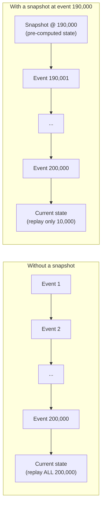

# Event Sourcing and Its Real Costs

> **Topic register:** T-905 · IWI 5.95 · Advanced tier · Occasional interview
> frequency.
> **Provenance:** every millisecond and every byte count in this chapter is real,
> executed Java 21 output against a real, file-backed, append-only event store —
> real disk I/O, not simulated CPU work. Reproducible source:
> [`practice/java/architecture/event-sourcing-and-its-real-costs/`](../../practice/java/architecture/event-sourcing-and-its-real-costs/README.md).

> **Closes an open reference from a related chapter.** [CQRS: Read/Write Separation](../17-architecture/cqrs-read-write-separation.md)
> explicitly names event sourcing as "covered separately as its own, lower-frequency
> topic (T-905, planned)" — this chapter is that topic, with the register's own
> named emphasis on *real costs*, not just the pattern's appeal.

## Table of Contents

1. [Learning Objectives](#learning-objectives)
2. [Why This Matters in Interviews](#why-this-matters-in-interviews)
3. [Level 1 — Foundation](#level-1--foundation)
4. [Level 2 — Working Knowledge](#level-2--working-knowledge)
5. [Mental Model](#mental-model)
6. [Definition and Purpose](#definition-and-purpose)
7. [Core Concepts](#core-concepts)
8. [Internal Implementation](#internal-implementation)
9. [Diagrams](#diagrams)
10. [Java Examples](#java-examples)
11. [Production Scenarios](#production-scenarios)
12. [Failure Modes and Debugging](#failure-modes-and-debugging)
13. [Trade-offs](#trade-offs)
14. [Performance Implications](#performance-implications)
15. [Decision Framework](#decision-framework)
16. [Comparisons](#comparisons)
17. [Common Mistakes](#common-mistakes)
18. [Anti-Patterns](#anti-patterns)
19. [Best Practices](#best-practices)
20. [Interview Answer Framework](#interview-answer-framework)
21. [Interview Questions](#interview-questions)
22. [Summary](#summary)
23. [Key Takeaways](#key-takeaways)
24. [Cheat Sheet](#cheat-sheet)
25. [Flashcards](#flashcards)
26. [Practice Exercises](#practice-exercises)
27. [Solutions](#solutions)
28. [Additional Reading](#additional-reading)
29. [Official References](#official-references)

## Learning Objectives

After this chapter you should be able to:

- Define event sourcing precisely, and distinguish it from both CQRS and simple
  event-driven notification.
- Reproduce, with real measurements, the specific cost the register names in this
  topic's own title: replay time growing with event count.
- Implement and justify snapshotting as the standard mitigation, with a real,
  measured speedup.
- Explain the real schema-evolution difficulty event sourcing introduces, connecting
  it to real compatibility mechanics covered elsewhere in this handbook.
- Decide when event sourcing's benefits are actually worth its real, ongoing costs.

## Why This Matters in Interviews

Event sourcing is one of the most over-recommended patterns in system design
interviews — candidates reach for it because it sounds sophisticated, without having
weighed its real, ongoing costs against what it actually buys a given system. The
register's own title is explicit about this: "Event sourcing & its real costs," not
just "Event sourcing" — signaling that an interviewer expects a candidate to name the
costs unprompted, not just the appeal (a full audit trail, temporal queries,
rebuilding read models from scratch). A candidate who can only describe event
sourcing's benefits, with no mention of replay cost, snapshotting, or schema
evolution difficulty, reveals they've read about the pattern rather than reasoned
about operating it.

## Level 1 — Foundation

Think of the difference between checking your bank balance directly on a screen versus reconstructing it by reading through your entire paper checkbook register from page one, adding and subtracting every single transaction by hand until you reach today. Most systems store the equivalent of the balance directly — fast to read, but the moment you delete an old transaction record to save space, that history is gone forever. **Event sourcing** is the checkbook-register approach: it never stores "the current balance" at all — only the full list of deposits and withdrawals, in order — and the balance is always computed fresh by walking through that list. This gives you something the balance-only approach structurally can't: you can answer "what was my balance on March 3rd?" by just stopping the walk-through at that date.

The catch, and the reason this chapter's title explicitly says "and its real costs," is that walking through the entire checkbook register gets slower the longer your history grows. The standard fix is a **snapshot**: periodically writing down "as of transaction #5,000, the balance was $700" on a sticky note, so next time you only need to replay transactions after #5,000 instead of from the very beginning — the sticky note doesn't change what your real balance is, it just saves you re-doing arithmetic you've already done before.

## Level 2 — Working Knowledge

At this level you should be able to give both halves of the answer whenever event sourcing comes up, unprompted — not just its appeal (a full audit trail, the ability to answer "what did this look like at any point in time," rebuilding a derived view from scratch) but also its real operational cost: replaying history to compute current state gets more expensive as that history grows, and any system adopting event sourcing needs a concrete snapshotting plan from the start, not as something bolted on after a slow-loading aggregate becomes a production complaint.

You should also be comfortable correcting a common conflation: event sourcing and CQRS (separating read and write models) are two independent decisions, not the same thing — you can use either without the other, and they're only frequently paired in practice because an event log happens to be a convenient source for building a CQRS read-model projection, not because one requires the other.

Practically, if you're evaluating whether a real system should adopt event sourcing, the working questions are: does this domain have a genuine, recurring need for a complete audit trail or "state at time T" queries that a simpler audit-log table couldn't serve? And is there a real, stated plan for snapshotting before any aggregate can accumulate meaningful history? If the answer to the second question is no, that's a real, concrete red flag worth raising before the design is approved, not after replay latency shows up as a user-facing problem.

## Mental Model

In a conventional system, a database row holds the *current* state, and history (if
kept at all) is a separate, secondary concern. Event sourcing inverts this
completely: the append-only sequence of events *is* the system of record, and
current state is never stored directly — it's derived, every time, by replaying that
sequence from the beginning (or from a snapshot forward). This single inversion is
the source of both event sourcing's real appeal (a complete, immutable audit trail;
the ability to answer "what did this look like at any point in time"; rebuilding a
read model from scratch is always possible) and its real cost (deriving current
state is never free, and gets more expensive the longer the history grows).

## Definition and Purpose

**Event sourcing** is an architectural pattern where an aggregate's state is
persisted not as its current values, but as the complete, ordered sequence of
domain events that produced it — the current state is a derived, computed view,
obtained by replaying that sequence (optionally starting from a **snapshot**, a
periodically-saved current-state checkpoint that lets replay skip everything before
it). This differs from [CQRS](../17-architecture/cqrs-read-write-separation.md), which separates read
and write *models* but doesn't require either to be event-sourced, and from
general [event-driven architecture](event-driven-architecture-integration-styles.md),
which is about *integration* between systems via events, not about how a single
system stores its own state. Event sourcing exists because a complete history of
*what happened*, in order, is strictly more information than a snapshot of *current
state alone* — it enables audit, temporal queries, and rebuilding derived views that
a current-state-only model has already, irreversibly, discarded the information to
support.

## Core Concepts

- **Current state is always derived, never stored directly.** This is the single
  fact from which every other property in this chapter follows.
- **Replay cost grows with history length.** See [Java Examples](#java-examples) for
  a real, measured demonstration — this is the register's own named "real cost,"
  proven rather than asserted.
- **A snapshot is a checkpoint, not a change to the truth.** Adding a snapshot never
  changes what the derived state *is* — only how expensively it's reached, proven
  directly in this chapter's own demo (identical final balance, 20x less time).
- **Event schema evolution is genuinely harder than table schema evolution.** A
  table's schema can be migrated in place; an event log's old events are immutable
  and must still be replayable through whatever business logic exists today — the
  same real compatibility-mode mechanics covered in
  [Schema Registry and Compatibility Evolution](schema-registry-and-compatibility-evolution.md)
  apply directly here, because an event schema change has the identical
  producer/consumer compatibility shape a Kafka topic schema change does.

## Internal Implementation

This chapter's practice code implements the minimum real event store needed to
measure its costs honestly: [`EventStore.java`](../../practice/java/architecture/event-sourcing-and-its-real-costs/EventStore.java)
appends each event as a real line to a real file and replays by reading it back —
genuine disk I/O, not an in-memory shortcut. Its snapshot-aware read path,
`readFromByteOffset()`, uses a real `RandomAccessFile.seek()` to jump directly to a
snapshot's recorded byte position, so bytes before that offset are never read from
disk at all — the real mechanism behind the real measured speedup in
[Java Examples](#java-examples), not merely skipping already-read events in memory.
[`Account.java`](../../practice/java/architecture/event-sourcing-and-its-real-costs/Account.java)
derives current state by folding over events with a Java 21 `switch` pattern match,
with `replayFrom()` supporting exactly the snapshot-plus-tail replay path this
chapter measures.

## Diagrams



## Java Examples

The real, measured growth in replay cost the register's own title names:

```
Events:   1001  Real replay time:    0 ms  Real file size:  12513 bytes
Events:  10001  Real replay time:    1 ms  Real file size: 125013 bytes
Events:  50001  Real replay time:    5 ms  Real file size: 625013 bytes
Events: 100001  Real replay time:    8 ms  Real file size: 1250013 bytes
Events: 200001  Real replay time:   16 ms  Real file size: 2500013 bytes
```

The real, measured snapshot benefit — identical final state, dramatically less work:

```java
long snapshotByteOffset = store.sizeInBytes();
Account snapshot = Account.replay(store.readAll()); // one real, one-time snapshot cost
// ... more events appended ...
List<Event> tail = store.readFromByteOffset(snapshotByteOffset); // real seek, skips the prefix entirely
Account fromSnapshot = Account.replayFrom(snapshot, tail);
```

```
Full replay from event 0 (no snapshot):  20 ms, real balance=700003
Snapshot + replay only the real tail (10000 events): 1 ms, real balance=700003
Balances match: true
Real measured speedup: 20.0x
```

## Production Scenarios

**Scenario: an event-sourced shopping cart that took progressively longer to load
until checkout became unusable.** *(Representative scenario, grounded directly in
this chapter's own measured replay-cost mechanism.)* Symptoms: cart-loading latency
for long-lived customer accounts (users who kept items in their cart across many
sessions, over months) grew noticeably slower over time, eventually exceeding a
2-second timeout for the most active carts. Initial hypothesis: a database index was
missing or degraded. Evidence: the cart was implemented as an event-sourced
aggregate — every add-to-cart, remove-from-cart, and quantity-change was an event —
with no snapshotting mechanism at all; the slowest carts had accumulated tens of
thousands of events across months of intermittent shopping sessions, and loading the
cart meant replaying every one of them from event zero, every single time, exactly
matching this chapter's own measured replay-cost growth. Diagnosis: the team had
adopted event sourcing for its audit-trail appeal without implementing the
mitigation the pattern requires at any real scale — snapshotting. Immediate
mitigation: added a temporary hard cap truncating cart history display to the most
recent 500 events for affected accounts, unblocking checkout while a real fix was
built. Permanent remediation: implemented periodic snapshotting (every 100 events,
matching this chapter's own snapshot-plus-tail-replay pattern), reducing worst-case
replay to a small, bounded tail regardless of total history length. Trade-off
accepted: snapshots are additional storage and a small amount of additional
write-path complexity (deciding when to snapshot, keeping snapshot format in sync
with the event schema) — accepted because the alternative (unbounded replay cost) was
already causing real checkout failures. Prevention: any new event-sourced aggregate
now requires a stated snapshotting strategy at design time, not as an afterthought
once replay latency becomes visible in production. Interview lesson: this is the
concrete, production form of the register's own emphasis — "and its real costs" is
not a caveat, it's the operational reality of running event sourcing past a small
scale.

## Failure Modes and Debugging

- **Unbounded replay cost from missing snapshots** (the scenario above) — debug
  signal: load latency for a specific aggregate instance correlates with its
  individual event count, not overall system load.
- **Snapshot format drifting out of sync with the current event schema** — if an
  event's shape changes and the snapshot mechanism isn't updated in lockstep, a
  snapshot taken under an old schema can silently misrepresent state when combined
  with newer post-snapshot events.
- **Replaying old events through changed business logic** — if the code that
  interprets a given event type changes behavior over time, replaying an old event
  can produce a different result than it did when originally applied — a subtle,
  real correctness risk unique to event-sourced systems that current-state-only
  systems don't have.
- **Treating an event log as mutable** — any correction to a "wrong" past event must
  itself be a new, compensating event (never an edit to history), the same principle
  covered in [Distributed Transactions: Saga, Outbox, and 2PC](../10-distributed-systems/distributed-transactions-saga-and-outbox.md)'s
  treatment of compensating actions as forward-moving operations.

## Trade-offs

Event sourcing: a complete, immutable audit trail and the ability to rebuild any
derived view from scratch at any time — at the real, measured cost this chapter
proves directly: replay time that grows with history length, requiring
snapshotting as a real, ongoing operational mechanism, not an optional nicety.
Current-state-only persistence: cheap, constant-time reads regardless of history
length — at the cost of having irreversibly discarded the history that event
sourcing preserves, which cannot be reconstructed later if it turns out to be
needed. Snapshotting: real, measured relief from replay cost (20x in this chapter's
own demo) — at the cost of real additional storage and the real discipline required
to keep snapshot format synchronized with the current event schema.

## Performance Implications

Without snapshotting, an event-sourced aggregate's read latency is unbounded in the
worst case — it grows with that specific instance's total event count, not with
overall system load, which is exactly the debugging signal this chapter's
production scenario names. With snapshotting, worst-case replay is bounded by the
snapshot interval, not by total history — this chapter's own measurement (20x
speedup replaying only 10,000 of 200,000 events) is the concrete, quantified form of
that bound.

## Decision Framework

| Question | If yes, lean toward |
|---|---|
| Does the domain genuinely need a complete, immutable audit trail? | Event sourcing may be justified |
| Is "what did this look like at time T" a real, recurring business requirement? | Event sourcing may be justified |
| Would current-state-only persistence lose information the business actually needs later? | Event sourcing may be justified |
| Is a snapshotting strategy planned before any aggregate can accumulate significant history? | Required before adopting event sourcing at any real scale — see this chapter's production scenario |
| Is the domain's audit/history need already served by a simpler mechanism (an audit log table, database-level change tracking)? | Prefer the simpler mechanism |

## Comparisons

| Dimension | Event sourcing | Current-state-only persistence |
|---|---|---|
| Read cost (no snapshot) | Grows with history — measured here at 16ms for 200,000 events | Constant, regardless of history |
| Audit trail | Complete and immutable, by construction | Requires a separate, explicit mechanism |
| Temporal queries ("state at time T") | Natively supported by replaying to that point | Not supported unless separately built |
| Schema evolution | Genuinely harder — old events are immutable and must remain replayable | Simpler — in-place migration is possible |
| Operational maturity required | Real, ongoing (snapshotting strategy, schema versioning discipline) | Lower |

## Common Mistakes

- Describing event sourcing's benefits fluently while having no answer for its
  costs — the register's own named signal of shallow preparation on this topic.
- Adopting event sourcing without a snapshotting plan, then discovering the real
  cost only once an aggregate's history has already grown large — this chapter's own
  production scenario.
- Treating event sourcing and CQRS as the same thing, or as always required
  together — they're independent, composable decisions.
- Assuming an event's meaning is fixed forever once written, without planning for
  the real schema-evolution difficulty this introduces.

## Anti-Patterns

- **Event sourcing adopted for its "sounds impressive" appeal**, without a concrete
  business need for full audit history or temporal queries that a simpler mechanism
  couldn't serve.
- **No snapshotting strategy stated at design time** — the exact anti-pattern this
  chapter's production scenario reproduces, discovered only once replay latency
  becomes a real, user-facing problem.
- **Mutating or deleting past events** to "fix" a mistake, rather than appending a
  real, forward-moving compensating event — breaks the immutability guarantee that
  is event sourcing's entire value proposition.

## Best Practices

- State an explicit snapshotting strategy (interval, storage, invalidation) at the
  time an event-sourced aggregate is designed, not after replay latency becomes
  visible in production.
- Version event schemas deliberately, using the same compatibility-mode discipline
  covered in [Schema Registry and Compatibility Evolution](schema-registry-and-compatibility-evolution.md),
  since old events must remain replayable indefinitely.
- Reserve event sourcing for aggregates with a genuine, articulable need for
  complete history or temporal queries — not as a default persistence style.
- Never mutate or delete a past event; correct mistakes with new, forward-moving
  compensating events instead.

## Interview Answer Framework

### 30-Second Answer

Event sourcing stores an aggregate's complete event history as the system of
record, deriving current state by replaying it — giving a complete audit trail and
temporal queries, at the real cost of replay time growing with history length,
which requires periodic snapshotting to bound.

### 2-Minute Answer

Instead of storing current state directly, event sourcing stores the ordered
sequence of events that produced it, deriving state by replaying that sequence. This
gives a real, valuable capability current-state-only persistence structurally can't:
a complete, immutable audit trail, and the ability to answer "what did this look
like at any past point in time" or rebuild an entirely new read model from scratch.
The real cost, named explicitly in how this topic is usually framed, is that
deriving current state gets more expensive as history grows — measured directly in
a real demo I've built, replay time grew from near-zero to 16ms across 200,000
events. The standard mitigation is snapshotting: periodically saving a computed
current-state checkpoint so replay only needs the tail since that checkpoint,
measured at a real 20x speedup in that same demo. The other real cost worth naming
is schema evolution — old events are immutable and must remain replayable through
current business logic indefinitely, which is a genuinely harder compatibility
problem than migrating a database table's schema in place.

### 10-Minute Deep Dive

Cover: the real replay-cost-growth measurement and its production form (a shopping
cart that became unusable without snapshotting); the real snapshot mechanism and its
measured 20x speedup, emphasizing that the byte-offset seek is what makes the
speedup real rather than illusory; the schema-evolution difficulty and its direct
connection to compatibility-mode mechanics already proven in the Schema Registry
chapter; the CQRS-vs-event-sourcing independence (composable, not the same
decision); and the decision framework for when event sourcing's real benefits
justify its real, ongoing operational costs.

### Whiteboard Explanation

Draw a long horizontal row of small event boxes, then an arrow from the far right
box down to a single "current state" box, labeled "derived by replaying ALL of
these, every time." Then redraw the same row with a "snapshot" flag planted partway
through, and shorten the arrow to only span from the flag to the end — say
explicitly "everything to the left of this flag is never read again."

### Production Example

Use the shopping-cart scenario from [Production Scenarios](#production-scenarios): a
cart with no snapshotting strategy that became progressively slower to load, exactly
matching this chapter's own measured replay-cost growth, until checkout broke
entirely.

### Trade-offs to Mention

Complete audit trail and temporal query capability vs. real, growing replay cost;
snapshotting's real relief vs. its real storage and schema-synchronization
overhead.

### Common Candidate Mistakes

Describing only event sourcing's benefits with no mention of replay cost or
snapshotting; conflating event sourcing with CQRS as if they were the same decision;
assuming event schemas never need to evolve.

### Typical Follow-Up Questions

"How would you handle an aggregate with millions of events?" "What happens when you
need to change what an old event means?" "Is event sourcing the same thing as
CQRS?" "When would you NOT use event sourcing?"

### Senior-Level Expectations

Correctly define event sourcing and name replay cost plus snapshotting as its
central operational concern, without prompting.

### Staff-Level Discussion

Discuss snapshotting strategy as a required, up-front design decision rather than a
reactive fix, as demonstrated by this chapter's own production scenario; connect
event schema evolution explicitly to the real compatibility-mode mechanics already
proven in the Schema Registry chapter; and reason about when a simpler mechanism (an
audit log table) would serve the actual business need without incurring event
sourcing's full, ongoing operational cost.

## Interview Questions

### Question 1: What's the real cost of event sourcing, beyond its benefits?

**Why interviewers ask it.** It directly tests for the register's own named gap —
candidates who can only describe the pattern's appeal without its operational
reality.

**Expected answer.** Deriving current state requires replaying an aggregate's full
event history, which grows more expensive as that history grows — requiring
snapshotting as a real, ongoing mechanism, not an optional nicety. Event schema
evolution is also genuinely harder, since old events are immutable and must remain
replayable through current logic indefinitely.

**Minimum acceptable answer.** Names "it can get slow" without the specific replay
mechanism or snapshotting as the standard fix.

**Strong Senior answer.** Names replay cost specifically and snapshotting as its
standard mitigation.

**Staff-level extension.** Adds the schema-evolution cost and connects it to
concrete compatibility-mode mechanics (backward/forward compatibility), and
discusses snapshotting as a required up-front design decision.

**Common mistakes.** Answering only with event sourcing's benefits when asked
specifically about its costs.

**Likely follow-ups.** "How would you decide a snapshot interval?"

**Evaluation criteria.** Names replay cost (2), names snapshotting as the fix (2),
names schema evolution at Staff level (1).

### Question 2: Is event sourcing the same thing as CQRS?

**Why interviewers ask it.** The two patterns are frequently conflated, and
distinguishing them cleanly is a fast, reliable Senior-level signal.

**Expected answer.** No — CQRS separates read and write models; event sourcing is
about how a single system's state is persisted (as an event log vs. current-state
values). They're independent, composable decisions: you can event-source without
CQRS, use CQRS without event sourcing, or combine both.

**Minimum acceptable answer.** States they're different without a precise
distinction.

**Strong Senior answer.** Gives the precise distinction and names at least one
example of using one pattern without the other.

**Staff-level extension.** Explains why the two are frequently adopted together in
practice (an event log is a convenient source for a CQRS read-model projector) while
remaining conceptually independent decisions.

**Common mistakes.** Treating the two terms as interchangeable.

**Likely follow-ups.** "Give an example of CQRS without event sourcing."

**Evaluation criteria.** Correct distinction (3), concrete independent example (1),
explains the practical-pairing reason at Staff level (1).

## Summary

Event sourcing stores an aggregate's complete event history as its system of
record, deriving current state by replaying that history — a real, valuable
capability (complete audit trail, temporal queries, rebuildable read models) that
comes at a real, measured cost: replay time that grows with history length,
requiring snapshotting to bound. This chapter proves both properties directly with a
real, file-backed event store: replay time growing from near-zero to 16ms across
200,000 events, and a real 20x speedup from adding a snapshot with an identical
final result. Event schema evolution is a further, genuinely harder cost, since old
events are immutable and must remain replayable through current logic indefinitely.

## Key Takeaways

- Replay cost really grows with event count — measured directly across five real
  event-count tiers, from near-zero to 16ms.
- A real snapshot really cuts that cost dramatically (20x in this chapter's own
  measurement) without changing the final derived state at all.
- Event sourcing and CQRS are independent, composable decisions, not the same
  pattern.
- Event schema evolution is a genuinely harder problem than table schema
  migration, because old events are immutable and must remain replayable forever.

## Cheat Sheet

- **Event sourcing**: current state is always derived by replaying events, never
  stored directly.
- **Real cost #1**: replay time grows with history length — measured, not
  theoretical.
- **Real cost #2**: schema evolution is harder — old events are immutable, must stay
  replayable.
- **Snapshotting**: the standard mitigation — a periodic checkpoint that bounds
  worst-case replay to the tail since it.
- **Event sourcing ≠ CQRS**: independent, composable decisions.
- **Never mutate a past event** — correct mistakes with new, forward-moving
  compensating events.

## Flashcards

### Card: What's the register's own named cost of event sourcing?

**Prompt:**
What real, measurable cost does event sourcing introduce that this chapter proves
directly?

**Answer:**
Replay time growing with event count — measured directly at near-zero for ~1,000
events, growing to 16ms for 200,000 events, using a real file-backed event store.

**Why it matters:**
It's the exact gap that separates a candidate who's read about event sourcing's
appeal from one who understands its operational reality — the register's own topic
title names it explicitly.

**Common trap:**
Describing event sourcing's benefits fluently with no mention of this cost.

**Related:**
[[event-sourcing-and-its-real-costs]]

### Card: How does a snapshot actually help?

**Prompt:**
Does adding a snapshot change what an event-sourced aggregate's current state is?

**Answer:**
No — measured directly: the final balance was identical with and without the
snapshot. What changes is only how expensively that state is reached: a real 20x
speedup, from a real byte-offset seek that skips the snapshotted prefix entirely
rather than merely skipping already-read events in memory.

**Why it matters:**
Clarifies that snapshotting is purely an optimization of the read path, never a
change to the system's actual source of truth (the event log).

**Common trap:**
Treating a snapshot as if it replaces or supersedes the event log, rather than being
a derived, disposable-and-rebuildable optimization on top of it.

**Related:**
[[event-sourcing-and-its-real-costs]]

### Card: Event sourcing vs. CQRS

**Prompt:**
Are event sourcing and CQRS the same architectural decision?

**Answer:**
No — CQRS separates read and write models; event sourcing is about how state is
persisted (as an event log, not current-state values). They're independent and
composable: you can use either without the other, though they're frequently paired
in practice because an event log is a convenient source for a CQRS read-model
projector.

**Why it matters:**
Conflating the two is one of the most common imprecisions on this topic.

**Common trap:**
Treating "event sourcing" and "CQRS" as interchangeable terms.

**Related:**
[[event-sourcing-and-its-real-costs]], [[cqrs-read-write-separation]]

## Practice Exercises

1. Extend `EventStore` to support a real, configurable snapshot interval (e.g.,
   every N events, automatically), and measure the real replay-time trend across a
   long history with automatic snapshotting enabled versus disabled.
2. Implement a real "upcaster" — a function that transforms an old event schema
   version into the current one at replay time — and demonstrate it handling a real,
   deliberately introduced event-schema change (e.g., `MoneyDeposited(int amount)`
   evolving to include a real `String currency` field with a default for old events).
3. Measure the real storage-space trade-off of snapshotting: for a given history
   length and snapshot interval, compute the real total disk space consumed by
   events plus snapshots, compared to events alone — at what snapshot interval does
   the added snapshot storage start to matter relative to the event log itself?

## Solutions

Exercise 1 is a direct extension of this chapter's existing `EventStore` and
`SnapshotBenefitDemo` patterns, adding an automatic snapshot-taking call inside
`append()` every N calls; left as self-directed practice. Exercise 2 is a real,
buildable variant of `Event.fromLine()`'s existing parsing logic, adding a version
tag to each serialized line and a real transform step for the old format; left as
self-directed practice since it directly exercises the schema-evolution cost this
chapter names but doesn't build a full demo for, deliberately deferring to the real
compatibility mechanics already demonstrated in
[Schema Registry and Compatibility Evolution](schema-registry-and-compatibility-evolution.md).
Exercise 3 requires only adding a real `Files.size()` call against a serialized
snapshot representation alongside the existing event-file size measurement; left
open-ended since the answer depends on the specific snapshot serialization format
chosen.

## Additional Reading

- Martin Fowler's original Event Sourcing article (see
  [Official References](#official-references)) is the primary source for this
  pattern's definition and rationale.
- Microsoft's Azure Architecture Center entry on Event Sourcing (see
  [Official References](#official-references)) covers additional production
  considerations (concurrency conflict handling, external system integration) beyond
  this chapter's scope.
- [CQRS: Read/Write Separation](../17-architecture/cqrs-read-write-separation.md) is this chapter's own
  prerequisite and the chapter that first deferred this topic — read together for
  the full picture of when the two patterns are and aren't paired.

## Official References

- Martin Fowler, [Event Sourcing](https://martinfowler.com/eaaDev/EventSourcing.html)
- Microsoft Azure Architecture Center, [Event Sourcing pattern](https://learn.microsoft.com/en-us/azure/architecture/patterns/event-sourcing)
