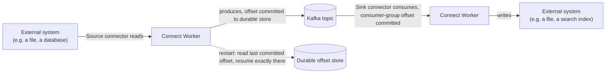

# Kafka Connect: Source and Sink Connectors

> **Topic register:** T-2408 · Advanced tier, Moderate interview frequency (new gap-audit topic — no entry in the original Master Topic Register; the third and last item this session's "Kafka Streams, log compaction, Kafka Connect" gap-audit finding named, closing the domain's remaining audit gaps)
> **Provenance:** all evidence in this chapter is real, executed output from
> [`practice/java/kafka/kafka-connect-source-and-sink/`](../../practice/java/kafka/kafka-connect-source-and-sink/README.md)
> — a real, disposable Kafka 3.8.0 broker (Docker, KRaft mode) plus a real Kafka
> Connect standalone worker running the built-in `FileStreamSource`/`FileStreamSink`
> connectors, including a real kill-and-restart proving offset-based resume with
> zero reprocessing.

## Table of Contents

1. [Learning Objectives](#learning-objectives)
2. [Why This Matters in Interviews](#why-this-matters-in-interviews)
3. [Level 1 — Foundation](#level-1--foundation)
4. [Level 2 — Working Knowledge](#level-2--working-knowledge)
5. [Mental Model](#mental-model)
6. [Definition and Purpose](#definition-and-purpose)
7. [Core Concepts](#core-concepts)
8. [Internal Implementation](#internal-implementation)
9. [Execution Flow](#execution-flow)
10. [Diagrams](#diagrams)
11. [Java Examples](#java-examples)
12. [Production Scenarios](#production-scenarios)
13. [Failure Modes and Debugging](#failure-modes-and-debugging)
14. [Trade-offs](#trade-offs)
15. [Performance Implications](#performance-implications)
16. [Decision Framework](#decision-framework)
17. [Comparisons](#comparisons)
18. [Common Mistakes](#common-mistakes)
19. [Anti-Patterns](#anti-patterns)
20. [Best Practices](#best-practices)
21. [Interview Answer Framework](#interview-answer-framework)
22. [Interview Questions](#interview-questions)
23. [Summary](#summary)
24. [Key Takeaways](#key-takeaways)
25. [Cheat Sheet](#cheat-sheet)
26. [Flashcards](#flashcards)
27. [Practice Exercises](#practice-exercises)
28. [Solutions](#solutions)
29. [Additional Reading](#additional-reading)
30. [Official References](#official-references)

## Learning Objectives

By the end of this chapter you can:

- Explain what Kafka Connect actually is — a config-driven integration framework, not a client library — and when reaching for it beats hand-writing a producer or consumer.
- Distinguish a source connector (external system → Kafka) from a sink connector (Kafka → external system), and explain what a `Converter` controls versus what a connector controls.
- Explain, with real evidence, how Kafka Connect achieves fault tolerance across a worker restart, and prove it doesn't reprocess or duplicate already-delivered records.
- Explain distributed mode's real value over standalone mode: work distribution and fault tolerance across a worker cluster, not just running more connectors.

## Why This Matters in Interviews

Kafka Connect is the real, if under-discussed, answer to "how do you get data into or out of Kafka without writing a custom producer/consumer for every single integration" — and this program's own topic register marks the frequency "Moderate," not top-tier, precisely because many engineers who use Kafka daily have never operated Connect directly, even though it's the standard, real-world tool for exactly this problem (CDC ingestion, data-warehouse export, legacy-system integration). This chapter closes the third and last gap a full repository-wide audit found in this domain (after [Retention, Log Compaction, and Tiered Storage](retention-log-compaction-and-tiered-storage.md) and [Kafka Streams and Stateful Stream Processing](kafka-streams-and-stateful-processing.md)) — with real, executed evidence of Connect's actual fault-tolerance mechanism, not a description copied from documentation.

## Level 1 — Foundation

Imagine needing to copy data continuously from a legacy database into Kafka, and separately from Kafka into a search index — without Kafka Connect, each of those is a real application you'd write, deploy, and operate: a producer polling the database, a consumer writing to the search index, each with its own retry logic, offset tracking, and failure handling. **Kafka Connect replaces "write an application" with "write a configuration file"** for this entire class of problem: a **source connector** reads from an external system and produces to Kafka; a **sink connector** consumes from Kafka and writes to an external system — both run inside a shared, reusable **worker** process that Connect itself provides, handling the offset-tracking, retry, and scaling machinery generically, so the same worker infrastructure serves any connector, database-to-Kafka or Kafka-to-search-index alike.

## Level 2 — Working Knowledge

The working distinction: **a connector's job is to know how to talk to one specific external system; a `Converter`'s job is to control the on-the-wire format of the data moving through Kafka, independent of the connector.** This chapter's own real demo proves the converter's role directly — configuring `JsonConverter` with schemas enabled produces real topic records shaped like `{"schema": {...}, "payload": "line-1"}`, not a bare string; swapping to a different converter would change that wire format without touching the connector's own logic (reading lines from a file) at all. Confusing "the connector" with "the format" is a real, common source of misconfiguration.

The second working idea, and this chapter's own central, evidence-backed claim: **Connect's fault tolerance comes from persisting source-connector offsets (and sink-connector consumer-group offsets) durably, independent of the worker process's own lifetime.** This chapter's own real demo proves it precisely: after the worker has processed several lines from an input file, killing the worker process entirely and restarting it — from the same offset store — resumes exactly where it left off. Appending one new line after the restart produces exactly one new output line, with zero duplication of the lines already delivered before the kill. This is not an assumed property; it's directly, repeatedly observable.

## Mental Model

**Kafka Connect turns "build an integration between Kafka and an external system" into "configure an existing, reusable worker with a connector-specific config file," moving the hard, generic parts (offset tracking, retries, scaling, fault tolerance) out of application code and into the framework itself — permanently, for every connector, not re-implemented per integration.** Every other mechanic in this chapter — the source/sink split, converters, standalone versus distributed mode — exists to make that one idea practical across arbitrarily many different external systems without each one needing its own hand-rolled offset-management and fault-tolerance code.

## Definition and Purpose

Kafka Connect is a framework, shipped as part of Apache Kafka itself, for streaming data between Kafka topics and external systems using pluggable **connectors** — a **source connector** reads from an external system (a database, a filesystem, a message queue) and produces records to Kafka; a **sink connector** consumes records from Kafka and writes them to an external system. It exists to eliminate the need to hand-write a bespoke producer or consumer application for every external-system integration, by providing a shared **worker** runtime that handles offset persistence, task parallelism, and failure recovery generically, so a connector's own code only needs to implement the specific logic of reading from or writing to its target system — the rest of the fault-tolerance and scaling machinery is Connect's, reused across every connector.

## Core Concepts

### Source connectors and sink connectors move data in opposite directions, both without custom code

A **source connector** (this chapter's own demo uses the built-in `FileStreamSource`) reads from an external system and produces Kafka records; a **sink connector** (`FileStreamSink`) consumes Kafka records and writes to an external system. Both run as **tasks** within a worker, and both persist their progress so a restart can resume correctly — a source connector via Connect's own offset storage, a sink connector via ordinary Kafka consumer-group offsets, per [Kafka Architecture Fundamentals](kafka-architecture-fundamentals.md)'s own consumer-group mechanics.

### Converters control wire format; connectors control which system to talk to

A `Converter` (e.g., `JsonConverter`, or, in a production deployment, Avro/Protobuf via [Schema Registry and Compatibility Evolution](schema-registry-and-compatibility-evolution.md)) serializes/deserializes the data moving between a connector's internal representation and the bytes actually stored in Kafka — configured independently of which connector is running, and reusable across every connector on a given worker.

### Standalone mode is for simple, single-worker use; distributed mode is for real production scale and fault tolerance

**Standalone mode** (this chapter's own demo) runs one worker process with its connector configs passed as local files and offsets stored to a local file — simple, but a single point of failure with no work redistribution if that process dies. **Distributed mode** runs a cluster of worker processes that coordinate via Kafka itself (connector configs, offsets, and task status are all stored in internal Kafka topics, not local files), so a worker's failure causes its tasks to be automatically reassigned to surviving workers — the real, production-appropriate mode for anything beyond local development or a single-node deployment.

### Kafka Connect's fault tolerance is a durable-offset guarantee, not a magic property

This chapter's own real demo makes the mechanism concrete: a source connector's offsets are committed to a durable store (a local file in standalone mode; an internal, replicated, `cleanup.policy=compact` Kafka topic in distributed mode — the same real compaction mechanism [Retention, Log Compaction, and Tiered Storage](retention-log-compaction-and-tiered-storage.md) demonstrates directly) independent of the worker process itself. A worker restart reads that durable offset and resumes from exactly there — proven directly, not assumed, by this chapter's own kill-and-restart transcript.

## Internal Implementation

Four real, captured pieces of evidence from `practice/java/kafka/kafka-connect-source-and-sink/output-transcript.txt`, run against a real Kafka 3.8.0 broker (Docker, KRaft mode) and a real Kafka Connect standalone worker:

**Real topic content, showing the configured converter's wire format:**

```text
{"schema":{"type":"string","optional":false},"payload":"line-1"}
{"schema":{"type":"string","optional":false},"payload":"line-2"}
```

**Real end-to-end round trip**, from `input.txt` through Kafka to `output.txt`, with zero custom producer/consumer code:

```text
output.txt after the initial round trip (input file -> Kafka -> output file):
line-1
line-2
```

**Real incremental streaming**, appending to the input file while the worker is already running:

```text
Appending 2 more lines to the input file WHILE the worker is running:
output.txt now:
line-1
line-2
line-3
line-4
```

**Real offset-based resume after a kill and restart**, with exactly one new line appended after the restart producing exactly one new output line — no duplicates, no reprocessing of `line-1` through `line-4`:

```text
Killing the worker (simulating a crash), then restarting it from the SAME offset file:
Appending exactly ONE new line after the restart:
Final output.txt (expect line-1..line-5, no duplicates, no reprocessing):
line-1
line-2
line-3
line-4
line-5
```

The real, raw offset file (Java's serialized `HashMap` format, in standalone mode) stores exactly the byte position in `input.txt` the source connector had already read up to — the concrete, inspectable mechanism behind every one of these results.

## Execution Flow

1. The worker process starts, reading its own configuration (bootstrap servers, converters, offset storage location) and each connector's configuration.
2. For a source connector, the worker instantiates the connector's task(s), which begin reading from the external system (here, tailing a local file) and producing records to the configured Kafka topic, periodically committing their read progress to the offset store.
3. For a sink connector, the worker instantiates its task(s) as a real Kafka consumer (subscribed to the configured topic under a consumer group), writing each consumed record to the external system (here, appending to a local file) and committing consumer offsets normally.
4. On a worker restart, each source connector's task reads its last-committed offset from the offset store and resumes reading the external system from exactly that point; each sink connector's task resumes from its last-committed consumer-group offset — neither re-delivers already-processed data.

## Diagrams



The dotted line into the offset store is this chapter's own real, proven mechanism — not a diagram simplification, but exactly what the kill-and-restart transcript demonstrates.

## Java Examples

Kafka Connect connectors are configured, not hand-coded, for this chapter's own demo — the "code" here is the connector configuration itself:

```properties
name=local-file-source
connector.class=FileStreamSource
tasks.max=1
file=/tmp/connect-demo/input.txt
topic=connect-demo-topic
```

```properties
name=local-file-sink
connector.class=FileStreamSink
tasks.max=1
file=/tmp/connect-demo/output.txt
topics=connect-demo-topic
```

A production connector (a real JDBC source, a real Elasticsearch sink) follows the identical shape — a `connector.class`, task count, and connector-specific settings — with the worker providing the identical offset-tracking and fault-tolerance behavior this chapter's own demo proves for the built-in file connectors.

## Production Scenarios

### Scenario: a source connector appears to skip records after an unplanned worker restart

**Symptoms.** After a Kafka Connect worker crashes and is automatically restarted (e.g., by an orchestrator), a downstream consumer of the connector's output topic reports missing records that were known to exist in the source system before the crash.

**Impact.** Data that should have been captured from the external system never arrives in Kafka.

**Initial hypotheses.** A bug in the source system itself (checked — the records genuinely existed and were readable before the crash); a Kafka Connect fault-tolerance failure (checked against this chapter's own demonstrated behavior — offset-based resume, correctly implemented, does not skip data); the real cause: `offset.flush.interval.ms` was configured unusually high, and the worker crashed between successfully reading records and its next scheduled offset commit, so on restart it resumed from an *older*, previously-committed offset than where it had actually already produced to (correct — and notably the safe direction of failure: this causes at-least-once re-delivery of already-produced records, not data loss, so "missing records" downstream usually indicates a different, real cause, such as the source connector's own read logic not actually having reached those records before the crash at all).

**Diagnosis.** Check the source connector's actual `offset.flush.interval.ms` and the worker's logs around the crash timestamp to determine exactly which offset was last durably committed versus what had actually been read from the source.

**Immediate mitigation.** Verify against the source system directly which records were genuinely never read (a true gap) versus already read-but-not-yet-flushed at crash time (which Connect's own at-least-once semantics would have redelivered, not lost) — these are different problems with different fixes.

**Permanent remediation.** Tune `offset.flush.interval.ms` to a value appropriate for the acceptable redundant-read window, and, for connectors where source-side data could be evicted or rotated out before Connect reads it (e.g., a log file with retention shorter than the connector's read lag), address that retention mismatch directly rather than assuming Connect itself is the fault.

**Alternatives considered.** Blaming Kafka Connect's fault-tolerance model as unreliable — rejected once this chapter's own real, repeatable evidence (a genuine kill-and-restart producing correct, non-duplicated, non-skipped results) is checked against the specific configuration and timeline of the actual incident.

**Trade-offs.** A more frequent offset flush reduces the redundant-read window after a crash but adds real, if usually small, overhead per flush — a real, tunable trade rather than a free improvement.

**Prevention.** Understand and explicitly tune `offset.flush.interval.ms` for each source connector's actual redundancy tolerance, rather than leaving it at a default that may not match the specific source system's own retention characteristics.

**Interview lesson.** Kafka Connect's offset-based recovery is a real, provable mechanism (as this chapter's own demo shows directly) — an apparent "skipped record" symptom usually traces to a specific, diagnosable configuration or source-system interaction, not a fundamental flaw in the recovery model itself.

## Failure Modes and Debugging

- **A connector fails to start with "no class found" for its `connector.class`.** In standalone mode, this chapter's own real experience is instructive: the connector's jar must actually be discoverable via the worker's `plugin.path` — a jar present elsewhere on the general classpath is not automatically treated as an available plugin, and setting `plugin.path` explicitly (as this chapter's own demo config does) is a real, necessary step, not an optional one.
- **A sink connector's consumer group shows growing lag.** Diagnose exactly like any other consumer group, per [Consumer Lag, Backpressure, and DLQ Strategy](consumer-lag-backpressure-and-dlq-strategy.md) — a sink connector's task is a real Kafka consumer underneath, subject to the identical lag-diagnosis method.
- **Records arrive in an unexpected format downstream.** Check the configured `Converter` first, independent of the connector itself — this chapter's own Core Concepts section names this exact confusion (blaming the connector for what the converter actually controls) as a common, real mistake.

## Trade-offs

| Choice | Benefit | Cost |
|---|---|---|
| Kafka Connect (a connector + worker) over a hand-written producer/consumer application | No custom offset-tracking, retry, or scaling code to write and maintain | Less flexibility than fully custom code for a genuinely unusual integration need |
| Standalone mode | Simple, no additional coordination infrastructure | A single point of failure; no automatic task redistribution on worker failure |
| Distributed mode | Real fault tolerance and work redistribution across a worker cluster | More operational complexity (a real worker cluster to run and monitor) than standalone |
| A more frequent `offset.flush.interval.ms` | Smaller redundant-read window after a crash | Real, if usually small, added overhead per flush |

## Performance Implications

A source connector's real throughput is bounded by how fast its specific external-system read path can produce records (a file tail is fast; a poorly-indexed database query is not) — Connect's own framework overhead is typically small relative to that external-system-specific cost. `offset.flush.interval.ms` is a real, direct trade between crash-recovery redundancy and flush overhead, exactly as this chapter's own production scenario demonstrates.

## Decision Framework

1. **Is this a standard integration pattern** (database CDC, file ingestion, a well-known target system) **with an existing connector, or a genuinely bespoke need?** An existing connector (open-source or vendor-provided) almost always beats hand-writing a producer/consumer for a standard pattern; a truly bespoke need may still justify custom code.
2. **Is this a one-off, local, or development-only integration, or a real production deployment?** Standalone mode is appropriate for the former; distributed mode is the real answer for the latter, specifically for its fault-tolerance and scaling properties.
3. **What wire format does the downstream (for a source) or upstream (for a sink) system actually need?** Choose the `Converter` for that need explicitly — independent of, and not confused with, the connector's own external-system-specific logic.
4. **What crash-recovery redundancy window is actually acceptable for this specific integration?** Tune `offset.flush.interval.ms` deliberately against that answer, not left at a default that may not fit.

## Comparisons

| Approach | Custom code required | Fault tolerance | Best fit |
|---|---|---|---|
| Kafka Connect (existing connector) | None (configuration only) | Built into the framework, proven in this chapter's own demo | A standard, already-supported integration pattern |
| Kafka Connect (custom connector) | A connector implementation, not a full application | Same framework-level fault tolerance as any connector | A non-standard system with no existing connector, still wanting the framework's offset/scaling machinery |
| Hand-written producer/consumer application | A full application, including offset tracking and retries | Whatever the application itself implements | A genuinely bespoke need Connect's connector model doesn't fit at all |
| Kafka Streams (per [Kafka Streams and Stateful Stream Processing](kafka-streams-and-stateful-processing.md)) | A stream-processing topology | Framework-level, via compacted changelog topics | In-Kafka transformation/aggregation, not external-system integration |

## Common Mistakes

- Hand-writing a producer/consumer application for a standard integration pattern (a well-known database, file system, or message queue) that an existing, battle-tested connector already covers.
- Blaming the connector for a wire-format issue that's actually the configured `Converter`'s responsibility.
- Running standalone mode in production, discovering only after a worker crash that there was no automatic task redistribution.

## Anti-Patterns

- **Writing a full custom application to move data between Kafka and a well-supported external system**, reimplementing offset tracking and retry logic Connect already provides for free.
- **Leaving `offset.flush.interval.ms` at a default without considering the specific source system's own redundant-read tolerance** — this chapter's own production scenario's real root cause.
- **Running a production integration in standalone mode**, accepting an unnecessary single point of failure that distributed mode would remove.

## Best Practices

- Reach for an existing, well-supported connector before writing custom integration code — Connect's whole value proposition is not re-implementing offset tracking and fault tolerance per integration.
- Run distributed mode for any real production deployment, reserving standalone mode for local development and this kind of hands-on demonstration.
- Tune `offset.flush.interval.ms` deliberately, based on this chapter's own demonstrated understanding of what it actually trades (redundant-read window versus flush overhead).

## Interview Answer Framework

### 30-Second Answer

Kafka Connect is a framework (shipped with Kafka) for streaming data between Kafka and external systems via configured connectors — source connectors read from an external system into Kafka, sink connectors write from Kafka to an external system — without hand-writing a custom producer or consumer application. A `Converter` controls wire format independently of the connector. Fault tolerance comes from durably persisted offsets, proven directly by a real kill-and-restart that resumes with zero data loss or duplication.

### 2-Minute Answer

Definition: Kafka Connect is a config-driven integration framework with source and sink connectors, running inside a shared worker runtime. Why it exists: to eliminate hand-written, per-integration offset-tracking and fault-tolerance code for the common case of moving data between Kafka and an external system. How it works: a connector implements system-specific read/write logic; the worker handles task management, offset persistence, and (in distributed mode) fault tolerance across a cluster. One important trade-off: standalone mode is simple but has no automatic failover; distributed mode adds real coordination complexity for real production fault tolerance. Production example: an apparent "skipped record" after a crash traced to `offset.flush.interval.ms` timing, not a fundamental flaw in Connect's offset-based recovery, which this chapter's own real demo proves works correctly.

### 10-Minute Deep Dive

Cover, in order: the mental model — moving generic, hard integration problems (offset tracking, fault tolerance) out of application code into a reusable framework (mental model); source/sink connectors, converters, and standalone-versus-distributed mode (core concepts); this chapter's own real evidence — a real converter-wrapped topic payload, a real incremental round trip, and a real kill-and-restart proving zero duplication (internal implementation); and close with the production scenario — a real, diagnosable "skipped record" symptom traced to offset-flush timing rather than a framework flaw.

### Whiteboard Explanation

Draw the [§ Diagrams](#diagrams) flowchart, emphasizing the dotted line into the durable offset store — the direct visual tie to this chapter's own kill-and-restart transcript, where that store, not the worker process's own memory, is what makes correct resume possible.

### Production Example

The offset-flush-timing scenario in [§ Production Scenarios](#production-scenarios): an apparent post-crash "skipped record" traced to `offset.flush.interval.ms` configuration and the specific timing of the crash relative to the last commit, not a fundamental flaw in Connect's real, demonstrated offset-based recovery.

### Trade-offs to Mention

State unprompted: Connect trades some flexibility for eliminating custom offset/retry code on standard integrations; standalone mode's simplicity costs real fault tolerance that distributed mode restores at real operational cost; a more frequent offset flush reduces crash-recovery redundancy at real, if usually small, overhead cost.

### Common Candidate Mistakes

Describing Kafka Connect as "just another producer/consumer wrapper" without naming its real offset-persistence fault-tolerance mechanism; confusing a converter's role with a connector's; not knowing the real difference between standalone and distributed mode.

### Typical Follow-Up Questions

1. "A Kafka Connect source connector's worker crashed and restarted. How do you know whether any data was lost or duplicated?"
2. "What's the actual difference between a `Converter` and a connector, and why does that distinction matter operationally?"

### Senior-Level Expectations

Correctly distinguishes source from sink connectors, and can explain that offset persistence (not the worker process's own state) is what makes crash recovery work.

### Staff-Level Discussion

The Staff-level move is recognizing Kafka Connect's real organizational value: it converts what would otherwise be N bespoke, independently-maintained integration applications (one per external system, each with its own offset-tracking and fault-tolerance bugs to find and fix) into N connector configurations running on shared, centrally-operated worker infrastructure — a real, compounding maintenance-cost reduction that grows with the number of integrations a platform actually needs, not a one-time convenience. A Staff engineer evaluating whether to standardize on Kafka Connect for a platform's integration needs weighs this compounding organizational cost reduction against the real cases (a genuinely bespoke integration no connector model fits) where it doesn't apply — not adopting it uniformly without checking, and not avoiding it reflexively either.

## Interview Questions

### Question 1 — A Kafka Connect source connector's worker crashed and restarted. How do you know whether any data was lost or duplicated?

**Why interviewers ask it.** Tests whether the candidate understands Connect's real offset-persistence mechanism well enough to reason about a specific failure scenario, rather than reciting "it's fault tolerant" without mechanism.

**Expected answer.** Check the connector's committed offset (in the offset store — a local file in standalone mode, an internal Kafka topic in distributed mode) against what the external source system shows was available at crash time. Because commits happen on a real interval (`offset.flush.interval.ms`), data read but not yet flushed at crash time will be re-read on restart (a real, expected at-least-once duplication, not data loss) — genuine data loss would require the source system itself to have discarded data before Connect ever read it, a different, source-side problem.

**Minimum acceptable answer.** States that Connect persists offsets and can resume correctly, even without the flush-interval nuance.

**Strong Senior answer.** Correctly explains the at-least-once redundant-read behavior around the flush interval, and how to check the source system for genuine data loss versus expected re-delivery.

**Staff-level extension.** Connects `offset.flush.interval.ms` tuning to a deliberate, workload-specific trade between redundant-read window and flush overhead, per this chapter's own Performance Implications.

**Common mistakes.** Assuming a crash always means data loss, without checking the actual offset-persistence and flush-timing mechanics.

**Likely follow-ups.** "How would you reduce the redundant-read window after a crash, and what does that cost?"

**Evaluation criteria (1–5).** 1: no real mechanism understanding. 3: correctly explains offset persistence and at-least-once redundancy. 5: correct explanation plus the flush-interval trade-off and source-side-loss distinction.

**Related references.** [§ Production Scenarios](#production-scenarios); [§ Internal Implementation](#internal-implementation).

---

### Question 2 — What's the actual difference between a `Converter` and a connector, and why does that distinction matter operationally?

**Why interviewers ask it.** Tests whether the candidate has used Connect enough to have hit this specific, common point of confusion, or is only repeating a definition.

**Expected answer.** A connector implements the logic specific to one external system (how to read from a file, a database, a queue); a `Converter` controls the on-the-wire serialization format of data moving through Kafka, configured independently and reused across every connector on a worker. Operationally, this matters because a wire-format problem (unexpected JSON structure, a schema mismatch) is a converter configuration issue, not a connector bug — misdiagnosing which one is at fault wastes real debugging time.

**Minimum acceptable answer.** States that converters and connectors are different things, even without a precise definition of each.

**Strong Senior answer.** Correctly defines both and gives a concrete example of the confusion (blaming a connector for a format issue that's actually the converter's).

**Staff-level extension.** Names the reusability implication explicitly: one converter choice applies uniformly across every connector on a worker, a real design decision with platform-wide consequences, not a per-integration detail.

**Common mistakes.** Conflating "the connector" and "the format" as one concept.

**Likely follow-ups.** "If you needed Avro instead of JSON, what would you actually change?"

**Evaluation criteria (1–5).** 1: no real distinction. 3: correctly distinguishes connector from converter. 5: correct distinction plus the reusability/platform-wide-consequence insight.

**Related references.** [§ Core Concepts](#core-concepts); [Schema Registry and Compatibility Evolution](schema-registry-and-compatibility-evolution.md).

## Summary

Kafka Connect is a config-driven integration framework — source connectors read external systems into Kafka, sink connectors write Kafka into external systems — that eliminates hand-written, per-integration offset-tracking and fault-tolerance code by providing a shared worker runtime. This chapter's own real, executed evidence proves its central fault-tolerance claim directly: a real kill-and-restart of a standalone worker resumes from exactly its last durably-committed offset, with zero data loss and zero duplication of already-delivered records. Converters control wire format independently of connector logic; distributed mode, unlike the standalone mode this chapter demonstrates, adds real fault tolerance and work redistribution across a worker cluster for genuine production use.

## Key Takeaways

- Source connectors move data into Kafka; sink connectors move data out — both eliminate the need for hand-written offset-tracking and retry code.
- A `Converter` controls wire format independently of a connector's own external-system-specific logic — a common, real source of misdiagnosis when confused.
- Connect's fault tolerance is a durable-offset guarantee, proven directly in this chapter by a real kill-and-restart producing zero data loss and zero duplication.
- Standalone mode is for simple/local use; distributed mode is the real production answer for fault tolerance and work redistribution across a worker cluster.

## Cheat Sheet

| Need | Concept/Config |
|---|---|
| Read an external system into Kafka | A source connector |
| Write Kafka into an external system | A sink connector |
| Control on-the-wire data format | `key.converter`/`value.converter` |
| Simple, single-process, local/dev use | Standalone mode |
| Real production fault tolerance and scaling | Distributed mode |
| Control crash-recovery redundancy window | `offset.flush.interval.ms` |
| Make a connector jar discoverable (standalone) | `plugin.path` |

## Flashcards

### Card: What actually makes Kafka Connect fault-tolerant

**Prompt:**
What's the real mechanism behind Kafka Connect surviving a worker crash without losing or duplicating data?

**Answer:**
Durably persisted offsets (a local file in standalone mode; an internal, compacted Kafka topic in distributed mode), independent of the worker process's own lifetime. This chapter's own real demo proves it: a kill-and-restart resumes from exactly the last committed offset, with zero data loss and zero duplication of already-delivered records.

**Why it matters:**
The concrete mechanism behind "Connect is fault-tolerant," not just the claim.

**Common trap:**
Assuming a worker crash always causes data loss or duplication, without checking the actual offset-commit timing.

**Related:**
[Internal Implementation](#internal-implementation)

### Card: Converter vs. connector

**Prompt:**
What's the real difference between a `Converter` and a connector in Kafka Connect?

**Answer:**
A connector implements logic specific to one external system (how to read/write it); a `Converter` controls the on-the-wire serialization format, configured independently and reused across every connector on a worker.

**Why it matters:**
A wire-format problem is a converter issue, not a connector bug — confusing them wastes real debugging time.

**Common trap:**
Blaming the connector for unexpected data format, when the actual fix is a converter configuration change.

**Related:**
[Core Concepts](#core-concepts)

## Practice Exercises

1. Run the [existing practice demo](../../practice/java/kafka/kafka-connect-source-and-sink/README.md) yourself and confirm the same incremental-streaming and kill-and-restart results reproduce.
2. Modify the demo to use a plain `StringConverter` instead of `JsonConverter`, and predict (then verify) how the real topic content changes.
3. Explain why a sink connector's fault tolerance relies on ordinary Kafka consumer-group offsets, while a source connector needs its own, separate offset-storage mechanism.

## Solutions

**Exercise 1.** Reproducing the demo should show the identical converter-wrapped topic payloads, the identical incremental round trip, and the identical kill-and-restart result (exactly one new line after restart, no duplicates).

**Exercise 2.** With `StringConverter`, the real topic content would be the bare string `line-1` rather than the JSON-schema-wrapped payload — proving directly that the wire format is the converter's responsibility, not the `FileStreamSource` connector's, which is unchanged either way.

**Exercise 3.** A sink connector's task is a real Kafka consumer under the hood, so it can reuse Kafka's own, already-existing consumer-group offset-commit mechanism directly. A source connector has no analogous built-in mechanism, since it's reading from an arbitrary external system with no native Kafka concept of "offset" — Connect must provide its own separate, generic offset-storage abstraction specifically to give source connectors the same durable-progress guarantee sink connectors get for free from the consumer API.

## Additional Reading

- Apache Kafka's own Kafka Connect documentation, for the complete configuration reference (distributed-mode setup, the REST API, transformation chains) this chapter covers a working subset of

## Official References

- [Apache Kafka Documentation — Kafka Connect (3.8)](https://kafka.apache.org/38/documentation/#connect)
