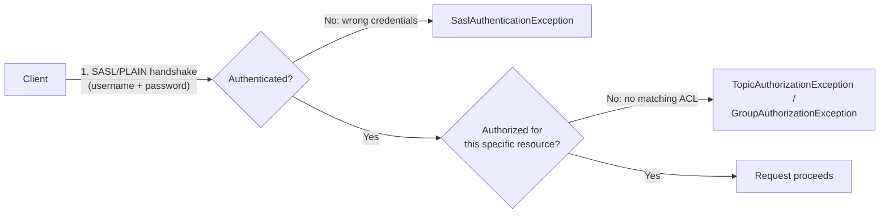
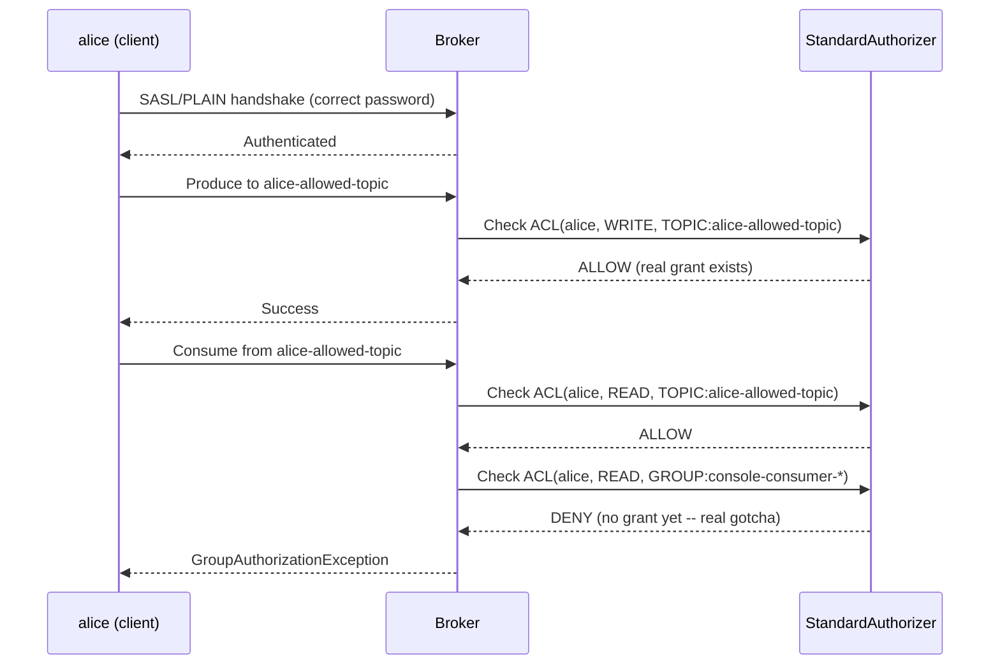

# Kafka Security: SASL Authentication and ACL Authorization

> **Topic register:** T-2421 · Advanced tier, Moderate-to-high interview frequency [M→H] — gap-audit
> addition (2026-09-21): zero coverage of Kafka authentication (SASL), authorization (ACLs), or
> encryption in transit existed anywhere in this repository, despite this domain otherwise covering
> Kafka mechanics in real, executed depth across 12 other chapters.
> **Provenance:** every claim below is real, executed output — real OpenJDK-based Kafka 3.8.0
> (Docker, KRaft mode), real SASL/PLAIN authentication, real KRaft-native ACL authorization.
> Source and full output: [`practice/java/kafka/kafka-security-authentication-and-authorization/`](../../practice/java/kafka/kafka-security-authentication-and-authorization/README.md).

## Table of Contents

1. [Learning Objectives](#learning-objectives)
2. [Why This Matters in Interviews](#why-this-matters-in-interviews)
3. [Level 1 — Foundation](#level-1-foundation)
4. [Level 2 — Working Knowledge](#level-2-working-knowledge)
5. [Mental Model](#mental-model)
6. [Definition and Purpose](#definition-and-purpose)
7. [Core Concepts](#core-concepts)
8. [Internal Implementation](#internal-implementation)
9. [Execution Flow](#execution-flow)
10. [Diagrams](#diagrams)
11. [Java Examples](#java-examples)
12. [Production Scenarios](#production-scenarios)
13. [Failure Modes and Debugging](#failure-modes-and-debugging)
14. [Trade-offs](#trade-offs)
15. [Performance Implications](#performance-implications)
16. [Decision Framework](#decision-framework)
17. [Comparisons](#comparisons)
18. [Common Mistakes](#common-mistakes)
19. [Anti-Patterns](#anti-patterns)
20. [Best Practices](#best-practices)
21. [Interview Answer Framework](#interview-answer-framework)
22. [Interview Questions](#interview-questions)
23. [Summary](#summary)
24. [Key Takeaways](#key-takeaways)
25. [Cheat Sheet](#cheat-sheet)
26. [Flashcards](#flashcards)
27. [Practice Exercises](#practice-exercises)
28. [Solutions](#solutions)
29. [Additional Reading](#additional-reading)
30. [Official References](#official-references)

## Learning Objectives

By the end of this chapter you can explain the real, distinct difference between Kafka authentication (SASL — proving who a client is) and authorization (ACLs — what an authenticated client is allowed to do), name the specific exception each failure mode produces, and cite real, executed evidence for each: a real `SaslAuthenticationException` from a wrong password, a real `TopicAuthorizationException` from an unauthorized topic, a real `GroupAuthorizationException` from a genuine, discovered gotcha (a topic ACL alone doesn't grant consume access), and a real super-user ACL bypass.

## Why This Matters in Interviews

Every other chapter in this domain assumes a Kafka cluster with no authentication or authorization at all — realistic for a single-team side project, never realistic for a shared, multi-tenant production cluster where "can this consumer read this topic" is a real access-control question with real consequences (a mis-scoped consumer reading a topic containing another team's PII, a compromised credential able to produce to a payments topic). Interviewers at the Senior/Staff level increasingly probe this directly, because "how would you secure this Kafka cluster" separates a candidate who has only ever used a local, unauthenticated broker from one who has operated Kafka in a real, shared environment.

## Level 1 — Foundation

Think of a Kafka broker as an office building. **Authentication** is showing your badge at the front door — the security guard confirms you are who you claim to be (a real username and password, checked against real credentials), but says nothing yet about which rooms you can enter. **Authorization** is what happens at each individual door inside the building — even with a valid badge, a specific door (a specific topic, a specific consumer group) checks an access list before letting you through. This chapter's own real demo makes the distinction concrete rather than definitional: a wrong password fails at the front door (a real `SaslAuthenticationException`, before any topic is even considered); a correct badge but the wrong door fails at that specific door (a real `TopicAuthorizationException`) — two different failures, at two different points, with two different real exception types.



## Level 2 — Working Knowledge

At this level you should be comfortable with the practical shape of a real ACL grant: `--allow-principal User:alice --operation Read --topic my-topic` — a principal, an operation, and a resource, all three required, all three checked independently. The genuinely easy mistake this chapter's own demo surfaced directly: granting `Read`/`Write`/`Describe` on a *topic* is not sufficient to let a client *consume* that topic — Kafka's consumer protocol separately authorizes the *consumer group* resource, and a client with full topic access but no group ACL still fails with a real `GroupAuthorizationException`. Two independent resources, two independent grants, both required for the single, ordinary act of consuming.

You should also be able to state, without looking it up, that a `KAFKA_SUPER_USERS` entry bypasses ACL checks *entirely* for that principal — verified directly in this chapter's demo: `admin` produces to and consumes from a topic `alice` has zero ACL grants for, with no error at all.

## Mental Model

Ask two separate questions, in order, for any Kafka access failure. First: **"did the connection itself authenticate?"** — if not, the failure is a `SaslAuthenticationException`, and the fix is credentials, not permissions. Second, only once authentication succeeded: **"does an ACL exist granting this specific principal this specific operation on this specific resource?"** — if not, the failure is a `TopicAuthorizationException` or `GroupAuthorizationException` depending on which resource type was missing its grant, and the fix is a new ACL, not new credentials. Conflating these two questions — "just give them a working login" when the real problem is a missing ACL, or vice versa — is the single most common real mistake this topic tests for.

## Definition and Purpose

**SASL** (Simple Authentication and Security Layer) is the protocol framework Kafka uses for client authentication; **SASL/PLAIN** is the simplest mechanism within it — a real username and password, checked by the broker against real, configured credentials (this chapter's demo uses inline JAAS configuration; production clusters commonly delegate to LDAP/Kerberos via other SASL mechanisms, out of this chapter's own executed scope but named honestly in Section 17's Comparisons). **ACLs** (Access Control Lists) are the authorization mechanism: explicit grants of the form (principal, operation, resource, permission type), evaluated by a real authorizer — this chapter's demo uses the KRaft-native `StandardAuthorizer`, the modern replacement for the older ZooKeeper-based `AclAuthorizer`. Together, SASL answers "who is this," and ACLs answer "what can they do" — two independent, separately-configured, separately-failing layers.

## Core Concepts

### Authentication and authorization are genuinely independent layers, with independent failure modes

A client can authenticate successfully and still be authorized for nothing (a real, valid login with zero ACL grants); a request can fail before authorization is ever evaluated at all, if authentication itself fails first. This chapter's Section 8 demo produces both failure types from the identical broker, proving the distinction is real, not just definitional.

### ACLs authorize specific resource *types* independently — a topic grant does not imply a group grant

Kafka's ACL model has distinct resource types (`TOPIC`, `GROUP`, `CLUSTER`, `TRANSACTIONAL_ID`, and others) — an operation against one resource type is never implicitly covered by a grant on a different resource type, even when both are "obviously" needed for what looks like one logical action (producing is a topic-only concern; consuming touches both the topic *and* the consumer group). This chapter's own demo discovered this directly, not as a pre-known fact stated up front: `alice`, already granted full topic access, still failed to consume until a second, independent group ACL was added.

### A super user is a real, total ACL bypass — not "an ACL that always matches"

`KAFKA_SUPER_USERS` (or the equivalent `super.users` broker property) names principals the authorizer never even checks ACLs for — every operation on every resource is implicitly allowed. This is architecturally different from "a very permissive ACL," and it's why super-user status should be reserved for genuine cluster administration, never granted to an application's own service account as a shortcut past real ACL design.

## Internal Implementation

**Real SASL authentication failure** (`practice/java/kafka/kafka-security-authentication-and-authorization/`), `alice` with a wrong password:

```
[ERROR] Connection to node -1 (localhost/127.0.0.1:9092) failed authentication due to:
        Authentication failed: Invalid username or password
Caused by: org.apache.kafka.common.errors.SaslAuthenticationException:
        Authentication failed: Invalid username or password
```

**Real ACL authorization failure**, the identical `alice`, now correctly authenticated, producing to a topic she has no grant for:

```
[ERROR] Topic authorization failed for topics [alice-forbidden-topic]
Caused by: org.apache.kafka.common.errors.TopicAuthorizationException:
        Not authorized to access topics: [alice-forbidden-topic]
```

**The real, discovered group-ACL gotcha** — `alice`, with full `Read`/`Write`/`Describe` on her own topic, still fails to *consume* it:

```
[ERROR] Error processing message, terminating consumer process:
org.apache.kafka.common.errors.GroupAuthorizationException: Not authorized to access group: console-consumer-44961
Processed a total of 0 messages
```

Fixed with a second, independent grant (`--operation Read --group "*"`), then the identical client succeeds:

```
hello-from-alice
Processed a total of 1 messages
```

**The real super-user bypass** — `admin`, with zero ACL grants on `alice-forbidden-topic`, produces and consumes it freely:

```
hello-from-admin
Processed a total of 1 messages
```

## Execution Flow

1. A client opens a TCP connection to the broker's `SASL_PLAINTEXT` listener.
2. The broker and client perform a real SASL/PLAIN handshake — the client sends a username and password; the broker checks them against its configured JAAS credentials (this chapter's demo: `user_admin`/`user_alice` entries in `listener.name.<listener>.plain.sasl.jaas.config`). A mismatch ends the connection immediately with `SaslAuthenticationException` — no further request is processed.
3. Once authenticated, every subsequent request (produce, consume, describe, create topic) carries the authenticated principal. The broker's configured `Authorizer` (`StandardAuthorizer` in KRaft mode) checks whether an ACL exists granting that principal the specific operation on the specific resource the request targets.
4. If the principal is a configured super user, step 3's check is skipped entirely — the request proceeds unconditionally.
5. Otherwise, a missing ACL produces a resource-type-specific exception (`TopicAuthorizationException`, `GroupAuthorizationException`, and others) — the request fails, but the connection itself remains open and authenticated for future requests.

## Diagrams



## Java Examples

```properties
# admin.properties -- a real SASL/PLAIN client config, this chapter's own demo file
security.protocol=SASL_PLAINTEXT
sasl.mechanism=PLAIN
sasl.jaas.config=org.apache.kafka.common.security.plain.PlainLoginModule required \
    username="admin" password="admin-secret";
```

```bash
# Real ACL grant -- principal, operation, resource, all three required
kafka-acls.sh --bootstrap-server localhost:9092 --command-config admin.properties \
    --add --allow-principal User:alice --operation Read --operation Write --operation Describe \
    --topic alice-allowed-topic

# The real, easy-to-miss second grant this chapter's demo discovered --
# without it, consuming the identical, already-Read-granted topic still fails.
kafka-acls.sh --bootstrap-server localhost:9092 --command-config admin.properties \
    --add --allow-principal User:alice --operation Read --group "*"
```

## Production Scenarios

**A newly onboarded microservice's Kafka consumer works fine in every local and CI test, then fails immediately in the shared staging cluster with a `GroupAuthorizationException` the on-call engineer has never seen before.** The service's topic-read ACL was correctly requested and granted during onboarding; the consumer-group ACL — a separate, easy-to-forget grant this chapter's Section 8 demonstrates directly — was not. The fix is a second, independent ACL request, not a code change; the real lesson (this chapter's own Staff-level framing) is that a security onboarding checklist listing only "topic access" for a new consumer is incomplete by construction, and will reproduce this exact incident for every future consumer onboarded against it.

**A departing contractor's Kafka credentials are disabled at offboarding, but a batch job they set up continues running successfully for weeks afterward**, because the job's actual Kafka client used a separate, shared service-account credential the contractor also happened to know, not their own named credential. The real Staff-level lesson: SASL authentication only provides real security accountability when credentials are genuinely per-principal, not shared service accounts multiple humans can independently know — the same "who, specifically, did this" traceability gap that makes shared production database credentials a recognized anti-pattern applies identically here.

## Failure Modes and Debugging

- **Symptom: a client fails to connect at all, with `SaslAuthenticationException`.** Check credentials first — this is an authentication failure, entirely before any topic or group is even considered. Confirm the exact username/password the client is configured with against the broker's real, configured JAAS entries (Section 8's own real reproduction).
- **Symptom: a client authenticates successfully (no `SaslAuthenticationException`) but a specific operation fails with `TopicAuthorizationException` or `GroupAuthorizationException`.** This is an authorization gap, not a credentials problem — list the principal's current ACLs (`kafka-acls.sh --list`) and compare against exactly which resource type and operation the failing request needs; Section 8's own gotcha is the single most common instance of this — a topic grant present, a group grant missing.
- **Anti-pattern to rule out first when "it works for one team's consumer but not another's, against the identical topic":** compare each consumer's actual configured `group.id` against its own ACL grants specifically — a shared topic ACL doesn't imply every consumer group reading it has its own required group-level grant.

## Trade-offs

| Approach | Gains | Costs |
|---|---|---|
| No authentication/authorization (`PLAINTEXT`) | Simplest possible setup, zero credential/ACL management overhead | Any client that can reach the broker network can produce/consume anything — acceptable only for a genuinely trusted, single-tenant network |
| SASL/PLAIN | Real authentication, minimal setup (inline JAAS config, no external identity provider) | Credentials are plaintext-equivalent on the wire unless paired with TLS (`SASL_SSL`, not demonstrated in this chapter's own executed evidence — see Comparisons); not suited to large-scale credential rotation |
| SASL/SCRAM or SASL/GSSAPI (Kerberos) | Stronger credential handling, integrates with existing enterprise identity (Kerberos/LDAP) | Real operational complexity — a KDC or LDAP dependency this chapter's own demo deliberately avoids to keep the evidence self-contained and reproducible |
| Fine-grained per-topic/per-group ACLs (this chapter's approach) | Precise, auditable access control — exactly what a principal can do is explicit and listable | Real, ongoing maintenance cost — Section 8's own gotcha (a missing group ACL) is a direct, demonstrated instance of that cost |
| A broad wildcard ACL (`--topic "*"`) | Avoids repeated per-topic grant requests | Defeats the actual purpose of fine-grained authorization — functionally closer to a super user than a scoped principal |

## Performance Implications

This chapter does not measure a performance cost directly (SASL/PLAIN's handshake and ACL evaluation are both real but comparatively cheap, one-time-per-connection and per-request-metadata-lookup operations respectively, not a per-message data-path cost) — stated honestly rather than fabricating a number this demo's own scope (a single-broker, low-throughput functional-correctness demo) was never built to measure. The real, citable operational cost of this topic is administrative (Section 14's onboarding-checklist incident), not a runtime latency concern.

## Decision Framework

1. **Is this a genuinely trusted, single-tenant network** (a local dev environment, a fully isolated internal network with no other tenants)? If yes, `PLAINTEXT` may be a defensible, deliberate choice — but state it as a deliberate choice, not a default nobody revisited.
2. **Does this cluster have more than one team's topics on it?** If yes, real ACLs (Section 7's fine-grained grants) are the concrete mechanism preventing one team's consumer from reading another's data.
3. **When granting a new consumer's access, did the request include both a topic-level and a group-level ACL?** If only the topic grant was requested, Section 8's own gotcha will reproduce for that consumer.
4. **Does this principal genuinely need cluster-administration-level access, or just access to specific resources?** Reserve `KAFKA_SUPER_USERS` for genuine administrators; a service account should get scoped ACLs, never super-user status as a shortcut.
5. **Is credential/data confidentiality on the wire itself a real requirement** (a shared or partially-trusted network)? If yes, pair SASL with TLS (`SASL_SSL`) — this chapter's own demo uses `SASL_PLAINTEXT` deliberately, to keep authentication and authorization evidence isolated from a separate encryption-in-transit concern.

## Comparisons

| Mechanism | What it proves | This chapter's real evidence |
|---|---|---|
| SASL/PLAIN | A real username/password pair | Section 8's real `SaslAuthenticationException` on a wrong password |
| SASL/SCRAM | A username/password pair, salted-and-hashed server-side rather than compared in the clear | Not executed in this chapter — named honestly as a stronger real alternative, out of this chapter's own reproducible scope |
| SASL/GSSAPI (Kerberos) | Identity backed by an existing enterprise KDC | Not executed in this chapter — requires external Kerberos infrastructure this demo deliberately avoids for self-contained reproducibility |
| Topic ACL | What a principal can do to a specific topic | Section 8's real `TopicAuthorizationException` |
| Group ACL | What a principal can do as a member of a specific consumer group | Section 8's real, discovered `GroupAuthorizationException` gotcha |
| Super user | Bypasses ACL checks for a principal entirely | Section 8's real `admin` bypass of `alice`'s own forbidden topic |

## Common Mistakes

- **Treating a `GroupAuthorizationException` as a topic-ACL problem** and re-granting topic access that was already correctly granted — Section 8's own real gotcha names the actual missing resource type explicitly.
- **Confusing an authentication failure with an authorization failure** — a wrong password never reaches ACL evaluation at all; troubleshooting ACLs for a connection that never authenticated wastes real debugging time on the wrong layer.
- **Granting a wildcard topic ACL (`--topic "*"`) "to save time"** during onboarding, defeating the actual purpose of scoped access control.
- **Using `KAFKA_SUPER_USERS` for an application service account** instead of scoped ACLs, because it "just works" — removes all future auditability of what that principal actually needed access to.

## Anti-Patterns

- **Sharing one Kafka credential across multiple services or team members** — destroys the per-principal accountability SASL authentication is meant to provide; Section 12's contractor-offboarding scenario is exactly this failure at incident scale.
- **An onboarding checklist that only requests topic-level ACLs**, silently reproducing Section 8's group-ACL gotcha for every new consumer onboarded against it.
- **Running a shared, multi-tenant Kafka cluster on `PLAINTEXT`** "because it's simpler," without an explicit, documented decision that the network itself is fully trusted for every current and future tenant.

## Best Practices

- Request both topic-level and group-level ACLs together for any new consumer, as a single onboarding step — never separately, per Section 8's own discovered gotcha.
- Reserve `KAFKA_SUPER_USERS` strictly for genuine cluster administrators; give application service accounts scoped, listable ACLs instead.
- Pair SASL authentication with TLS (`SASL_SSL`) whenever the network itself isn't fully trusted, so credentials aren't sent in the clear.
- Use per-principal, never shared, credentials — the only way SASL authentication provides real per-actor accountability.
- Treat `PLAINTEXT` (no authentication or authorization at all) as a deliberate, explicitly-stated choice for a genuinely trusted single-tenant network, never a default nobody revisited as the cluster grew.

## Interview Answer Framework

### 30-Second Answer

Kafka security has two independent layers: SASL handles authentication (proving who a client is — a real username/password check, failing with `SaslAuthenticationException` on a mismatch), and ACLs handle authorization (what an authenticated principal can do — evaluated per resource, failing with a resource-specific exception like `TopicAuthorizationException`). A configured super user bypasses ACL checks entirely.

### 2-Minute Answer

Definition: SASL authenticates the connection itself; ACLs authorize each specific request against a specific resource (topic, consumer group, and others) independently. Why it matters: a shared, multi-tenant Kafka cluster with no authentication/authorization lets any client with network access produce or consume anything — a real risk the moment more than one team shares a cluster. How it works, with real evidence: a wrong password fails before authorization is ever considered (`SaslAuthenticationException`); a correct login but a missing topic ACL fails with `TopicAuthorizationException`; a topic ACL alone doesn't grant consume access — a separate group ACL is required, a real gotcha this chapter's own demo discovered rather than stated up front. One trade-off: fine-grained ACLs are precise and auditable but carry a real, ongoing maintenance cost, exactly the cost that gotcha demonstrates concretely. One production example: a new consumer's onboarding checklist that only requests topic access reproduces a `GroupAuthorizationException` in production for every future consumer onboarded against it.

### 10-Minute Deep Dive

Cover, in order: the mental model — authentication answers "who," authorization answers "what," two independent layers with independent failures (mental model); the real SASL/PLAIN handshake and real ACL evaluation mechanism (internals, real evidence); the specific, real exception types for each failure mode, including the genuinely discovered group-ACL gotcha (internals); the super-user bypass as an architectural exemption, not "a very permissive ACL" (core concepts); and close with the production scenario — an incomplete onboarding checklist reproducing the exact same incident for every future consumer, the concrete organizational cost of under-specifying access requirements.

### Whiteboard Explanation

Draw the [§ Diagrams](#diagrams) sequence: a client, a broker, and an authorizer, with the SASL handshake as one arrow (labeled pass/fail), then two separate authorization checks branching off it — one for the topic resource, one for the group resource — each independently labeled ALLOW or DENY. Circle the group-resource DENY explicitly and annotate it "the gotcha: a topic grant doesn't cover this."

### Production Example

A payments team's Kafka cluster onboards a new fraud-detection service. The service is granted `Read` on the `payments-events` topic. Its consumer immediately fails in production with `GroupAuthorizationException` — the onboarding request never mentioned the consumer group the fraud-detection service actually uses. The fix is a second, fast ACL grant, but the real, recurring cost (this chapter's Section 12) is every future service onboarded against the same incomplete checklist hitting the identical, entirely avoidable incident.

### Trade-offs to Mention

State unprompted: fine-grained ACLs are the correct default for any shared cluster, but they carry a real, demonstrated maintenance cost (the group-ACL gotcha) that an incomplete onboarding process will keep reproducing; a super user is a total bypass, not "a very permissive ACL," and should never be handed to an application service account as a shortcut.

### Common Candidate Mistakes

Conflating authentication and authorization as one undifferentiated "security" concern; assuming a topic ACL is sufficient for a consumer to actually consume; treating `KAFKA_SUPER_USERS` as equivalent to a broad ACL grant rather than a full bypass.

### Typical Follow-Up Questions

1. "Why does consuming require a group ACL in addition to a topic ACL?"
2. "What's the real difference between SASL/PLAIN and SASL/SCRAM?"
3. "Would you ever run a production Kafka cluster on PLAINTEXT?"

### Senior-Level Expectations

Correctly distinguishes authentication failures from authorization failures by their real, specific exception types; names the group-ACL requirement for consuming without being prompted.

### Staff-Level Discussion

The real leverage at Staff scope is recognizing that access-control incidents in a system like this are usually organizational-process failures (an incomplete onboarding checklist, shared credentials defeating per-principal accountability), not one-off technical bugs — fixing the specific missing ACL resolves one incident; fixing the onboarding checklist that omitted the group-ACL requirement prevents every future recurrence of the identical incident across every future consumer onboarded.

## Interview Questions

### Question 1 — A Kafka client authenticates successfully but fails to produce to a specific topic. What's happening, and how would you diagnose it?

**Why interviewers ask it.** Tests whether a candidate can distinguish an authorization failure from an authentication one once authentication has already, explicitly, succeeded.

**Expected answer.** This is an ACL authorization failure — the principal is genuinely who it claims to be, but has no ACL grant for the specific `WRITE` operation on that specific topic. Diagnose by listing the principal's current ACLs (`kafka-acls.sh --list`) and comparing against the exact resource and operation the failing request needs.

**Minimum acceptable answer.** Recognizes this as a permissions issue distinct from a login/credentials issue, even without naming the specific exception type.

**Strong Senior answer.** Names `TopicAuthorizationException` specifically and describes the real `kafka-acls.sh --list` diagnostic step.

**Staff-level extension.** Connects this to the broader authentication-vs-authorization mental model (Section 5) and can state precisely why this couldn't be an authentication problem, since the connection already succeeded.

**Common mistakes.** Suggesting the client "re-login" or "check the password" — the problem is never credentials once authentication has already succeeded.

**Follow-up questions.** "What if the same client can produce but not consume the identical topic?" (Section 8's own gotcha — a missing group ACL, a separate resource type from the topic ACL that's already granted.)

**Evaluation criteria (1–5).** 1: treats it as a credentials problem. 3: correctly names it an ACL issue with the right diagnostic step. 5: names the specific exception type and the precise mental-model distinction from an authentication failure.

**Related references.** [§ Core Concepts](#core-concepts); [§ Internal Implementation](#internal-implementation).

---

### Question 2 — You grant a new consumer `Read` access on a topic, but it still can't consume messages. Why?

**Why interviewers ask it.** Directly tests for the real, specific, easy-to-miss gotcha this chapter's own demo discovered rather than knew in advance — a strong signal for whether a candidate has real, hands-on Kafka ACL experience versus only textbook familiarity.

**Expected answer.** A topic-level `Read` ACL is necessary but not sufficient for consuming — Kafka's consumer protocol also authorizes the consumer *group* resource independently, and without a separate `Read` ACL on the group, the client fails with `GroupAuthorizationException` despite having full topic access.

**Minimum acceptable answer.** Recognizes that some additional permission beyond the topic grant is likely needed, even without naming the group resource specifically.

**Strong Senior answer.** Names the consumer-group ACL requirement specifically and the exact exception type it produces.

**Staff-level extension.** Generalizes this into an onboarding-process fix (Section 12): any consumer-access request template should require both grants together, since omitting either produces the identical real incident for every future consumer onboarded the same incomplete way.

**Common mistakes.** Re-granting the topic ACL (already correctly granted) instead of identifying the actually-missing resource type.

**Follow-up questions.** "Is there a way to grant both in a single command?" (Not atomically as a single grant — `kafka-acls.sh` still requires two separate `--add` invocations, one per resource type; some teams script both together specifically to avoid this gotcha.)

**Evaluation criteria (1–5).** 1: unable to explain why the topic grant alone is insufficient. 3: correctly names the missing group ACL. 5: names it precisely and proposes the onboarding-process fix that prevents recurrence.

**Related references.** [§ Core Concepts](#core-concepts); [§ Production Scenarios](#production-scenarios).

## Summary

Kafka security separates into two independent layers with independently observable failures: SASL authentication (proving identity — real evidence: a wrong password producing a real `SaslAuthenticationException`) and ACL authorization (what an authenticated principal can do — real evidence: a missing topic grant producing `TopicAuthorizationException`, and a genuinely discovered gotcha where a topic grant alone still leaves consuming blocked by a missing, separate consumer-group grant, `GroupAuthorizationException`). A configured super user bypasses ACL evaluation entirely, verified directly. The real, recurring organizational cost of this topic isn't technical complexity — it's an incomplete access-request process (an onboarding checklist requesting only a topic grant) reproducing the identical, entirely avoidable incident for every future consumer onboarded against it.

## Key Takeaways

- Authentication (SASL) and authorization (ACLs) are independent layers with independently distinct failure exceptions — real evidence for both in this chapter's own demo.
- A topic-level ACL does not imply a consumer-group-level ACL — a real, discovered gotcha, not a pre-known textbook fact, verified with a real `GroupAuthorizationException`.
- A super user bypasses ACL checks entirely, architecturally different from "a very permissive grant" — verified with a real, zero-ACL bypass.
- The real organizational cost of this topic is process, not technology — an incomplete onboarding checklist reproduces the same incident for every future consumer.
- `PLAINTEXT` (no security at all) is a legitimate choice only for a genuinely trusted, single-tenant network, stated as a deliberate decision, never a default nobody revisited.

## Cheat Sheet

| Failure | Real exception | Layer | Fix |
|---|---|---|---|
| Wrong username/password | `SaslAuthenticationException` | Authentication | Correct the credentials — never an ACL problem |
| Missing topic ACL | `TopicAuthorizationException` | Authorization | Grant the specific operation on the specific topic |
| Missing consumer-group ACL | `GroupAuthorizationException` | Authorization | Grant `Read` on the consumer group — separate from the topic grant |
| Principal is a super user | (no failure — full bypass) | Neither checked | Reserve for genuine administrators only |

## Flashcards

### Card: Authentication vs. authorization, precisely

**Prompt:**
What's the real, distinct difference between Kafka SASL authentication and ACL authorization, and what real exception does each produce on failure?

**Answer:**
Authentication (SASL) proves who a client is — a wrong password produces a real `SaslAuthenticationException`, before any resource is even considered. Authorization (ACLs) checks what an already-authenticated principal can do against a specific resource — a missing grant produces a resource-specific exception like `TopicAuthorizationException`.

**Why it matters:**
Conflating the two wastes real debugging time on the wrong layer — an authorization failure is never fixed by re-checking credentials.

**Common trap:**
Treating any Kafka access failure as one undifferentiated "security" problem instead of diagnosing which specific layer failed.

**Related:**
[Internal Implementation](#internal-implementation)

### Card: The real group-ACL gotcha

**Prompt:**
A principal has full `Read`/`Write`/`Describe` access granted on a topic. Can it consume that topic?

**Answer:**
Not necessarily — this chapter's own demo discovered directly that consuming also requires a separate ACL grant on the consumer *group* resource. Without it, the client fails with a real `GroupAuthorizationException` despite complete topic access.

**Why it matters:**
A genuinely easy, real-world mistake — an onboarding process that only requests topic access reproduces this exact incident for every consumer onboarded against it.

**Common trap:**
Re-granting the already-correct topic ACL instead of identifying the actually-missing group ACL.

**Related:**
[Production Scenarios](#production-scenarios)

### Card: What a super user really bypasses

**Prompt:**
Does a Kafka super user (`KAFKA_SUPER_USERS`) get a very permissive set of ACLs, or something architecturally different?

**Answer:**
Architecturally different — a super user's requests skip ACL evaluation entirely, for every resource. Verified directly: `admin` produced to and consumed from a topic `alice` had zero grants for, with no error at all.

**Why it matters:**
Explains why super-user status should never be handed to an application service account "to save time" — it removes all future auditability of what that principal actually needed.

**Common trap:**
Treating `KAFKA_SUPER_USERS` as equivalent to a broad wildcard ACL grant rather than a total, unconditional bypass.

**Related:**
[Core Concepts](#core-concepts)

## Practice Exercises

1. Run [the practice demo](../../practice/java/kafka/kafka-security-authentication-and-authorization/) yourself and reproduce all 8 steps of `security-demo.sh` — confirm you observe the identical real exception types (`SaslAuthenticationException`, `TopicAuthorizationException`, `GroupAuthorizationException`) this chapter cites.
2. Add a third user (`bob`) with `Describe`-only access on `alice-allowed-topic` (no `Read`, no `Write`) and predict, before testing, which of a produce attempt, a consume attempt, and a `kafka-topics.sh --describe` call will succeed versus fail — then verify against the real broker.
3. Modify the demo to use `SASL_SSL` instead of `SASL_PLAINTEXT` (requires generating a real self-signed certificate and keystore) and confirm the identical ACL behavior holds once TLS is layered underneath SASL.

## Solutions

**Exercise 1.** Expected output matches this chapter's own cited transcript exactly in shape (exception types, which steps succeed vs. fail) — exact message text/timestamps will differ run to run.

**Exercise 2.** `Describe`-only access: a produce attempt fails with `TopicAuthorizationException` (no `Write` grant); a consume attempt fails the same way even before reaching the group-ACL question (no `Read` grant on the topic itself); `kafka-topics.sh --describe` succeeds (the one operation actually granted).

**Exercise 3.** A correct `SASL_SSL` setup requires a real keystore/truststore pair and `KAFKA_SSL_KEYSTORE_FILENAME`/`KAFKA_SSL_KEYSTORE_CREDENTIALS` (and truststore equivalents) alongside this chapter's existing SASL configuration — the ACL behavior (Sections 8, 12) is unchanged, since TLS and SASL/ACLs are independent layers (encryption-in-transit versus authentication/authorization), exactly the layering this chapter's own Decision Framework (Section 16, point 5) names.

## Additional Reading

- Apache Kafka Security documentation's SASL and Authorization sections — the authoritative source for every SASL mechanism and ACL operation this chapter references.
- [Kafka Architecture Fundamentals](kafka-architecture-fundamentals.md) — the broker/topic/partition mechanics this chapter's security layer sits on top of.

## Official References

- [Apache Kafka 3.8 Documentation — Security](https://kafka.apache.org/38/documentation/#security)
