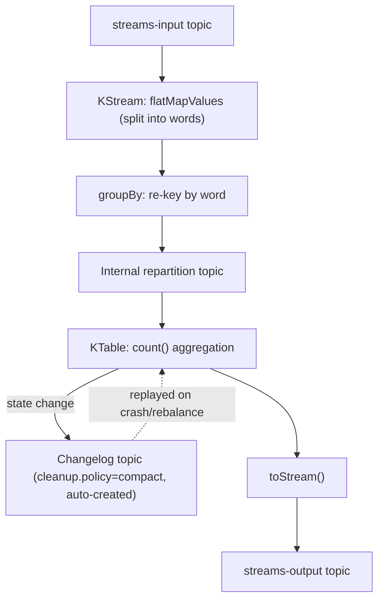

# Kafka Streams and Stateful Stream Processing

> **Topic register:** T-709 · IWI 5.3 · Advanced tier, Moderate interview frequency
> **Provenance:** all evidence in this chapter is real, executed output from
> [`practice/java/kafka/kafka-streams-and-stateful-processing/`](../../practice/java/kafka/kafka-streams-and-stateful-processing/README.md)
> — a real, compiling Kafka Streams application running against a real, disposable
> Kafka 3.8.0 broker (Docker), including a real topology printout, real, correctly
> aggregated output, and a real internal changelog topic's configuration.

## Table of Contents

1. [Learning Objectives](#learning-objectives)
2. [Why This Matters in Interviews](#why-this-matters-in-interviews)
3. [Level 1 — Foundation](#level-1--foundation)
4. [Level 2 — Working Knowledge](#level-2--working-knowledge)
5. [Mental Model](#mental-model)
6. [Definition and Purpose](#definition-and-purpose)
7. [Core Concepts](#core-concepts)
8. [Internal Implementation](#internal-implementation)
9. [Execution Flow](#execution-flow)
10. [Diagrams](#diagrams)
11. [Java Examples](#java-examples)
12. [Production Scenarios](#production-scenarios)
13. [Failure Modes and Debugging](#failure-modes-and-debugging)
14. [Trade-offs](#trade-offs)
15. [Performance Implications](#performance-implications)
16. [Decision Framework](#decision-framework)
17. [Comparisons](#comparisons)
18. [Common Mistakes](#common-mistakes)
19. [Anti-Patterns](#anti-patterns)
20. [Best Practices](#best-practices)
21. [Interview Answer Framework](#interview-answer-framework)
22. [Interview Questions](#interview-questions)
23. [Summary](#summary)
24. [Key Takeaways](#key-takeaways)
25. [Cheat Sheet](#cheat-sheet)
26. [Flashcards](#flashcards)
27. [Practice Exercises](#practice-exercises)
28. [Solutions](#solutions)
29. [Additional Reading](#additional-reading)
30. [Official References](#official-references)

## Learning Objectives

By the end of this chapter you can:

- Distinguish `KStream` (an unbounded sequence of independent records) from `KTable` (a continuously-updated, latest-value-per-key view), and explain why converting between them (`groupBy`) requires a real repartition step.
- Explain, with real evidence, that a `KTable`'s state is durable and crash-recoverable specifically because it's backed by a real, automatically compacted Kafka topic.
- Read a real Kafka Streams topology printout well enough to identify sub-topologies, internal repartition topics, and stateful processors.
- Explain the real difference between Kafka Streams (a library, embedded in your own application) and a separate stream-processing cluster (Flink, Spark Streaming) — the actual operational trade-off, not just a feature checklist.

## Why This Matters in Interviews

Kafka Streams sits at a real, if not universal, intersection in interviews: a candidate who's used Kafka as a message bus is common; a candidate who's actually built a stateful aggregation with Kafka Streams is rarer, and interviewers use it specifically to test whether "I use Kafka" generalizes to "I understand what a continuously-updated, fault-tolerant aggregation actually requires under the hood" — this program's own topic register marks the frequency "Moderate," not the top tier, but real and specific once it comes up. This chapter closes a genuine gap: [Kafka Architecture Fundamentals](kafka-architecture-fundamentals.md) covers topics and partitions, but never the stream-processing library built on top of them, and [Retention, Log Compaction, and Tiered Storage](retention-log-compaction-and-tiered-storage.md)'s own compaction mechanics turn out to be the exact, concrete answer to "how does a KTable survive a crash" — a connection this chapter makes explicit with real, running evidence.

## Level 1 — Foundation

A `KStream` is like a security camera's continuous video feed — every event (every record) is independent, timestamped, and meaningful on its own; watching yesterday's footage doesn't require watching today's. A `KTable` is like a whiteboard showing "current inventory count per item" — every new event updates the board in place, and what matters is the board's *current* state, not the full history of every change that led to it. Kafka Streams is a real Java library (not a separate cluster to deploy and operate) that lets an application read from real Kafka topics, transform and aggregate that data using these two complementary views, and write results back to real Kafka topics — all running inside the application's own JVM process.

## Level 2 — Working Knowledge

The working distinction: **a `KStream.groupBy()` followed by an aggregation (`.count()`, `.reduce()`, `.aggregate()`) produces a `KTable`, and that `KTable`'s current state lives in a local state store backed by a real, automatically-created Kafka topic — a changelog — configured with `cleanup.policy=compact` by the library itself.** This is not a documentation claim in this chapter — it's directly, independently verifiable: this chapter's own real demo runs `kafka-topics.sh --describe` against the actual changelog topic Kafka Streams created and shows `cleanup.policy=compact` in the real output, with zero manual configuration from the application.

The second working idea: **`groupBy` triggers a real repartition**, visible directly in a running topology's own printed description. If an aggregation needs to group by something other than a record's existing partition key (here, re-keying "which line did this word come from" into "which word is this"), Kafka Streams must physically move records to the correct partition for the new key before aggregating — implemented as a real, internal intermediate topic (this chapter's own demo shows it: `word-counts-store-repartition`). This is real, measurable work, not a free operation, and is exactly why avoiding an unnecessary re-key (when the existing partitioning already matches what an aggregation needs) is a genuine, worthwhile Kafka Streams optimization.

## Mental Model

**Kafka Streams turns a sequence of Kafka topics into a graph of local, in-process transformations — `KStream` for independent events, `KTable` for continuously-updated per-key state — and makes that state durable and crash-recoverable by backing every stateful operation with a real, automatically-managed, compacted Kafka topic, rather than requiring the application to build its own persistence and recovery mechanism.** Every other mechanic in this chapter — repartitioning, the state-store/changelog relationship, at-least-once vs. exactly-once processing guarantees — exists in service of that one idea: real fault tolerance, built directly on Kafka's own existing durability primitives, not a separate system bolted on top.

## Definition and Purpose

Kafka Streams is a Java library (part of Apache Kafka itself, not a separate download or cluster) for building stream-processing applications that read from and write to Kafka topics. It provides two core abstractions — `KStream` (an unbounded stream of independent key-value records) and `KTable` (a continuously-updated table representing the latest value per key, conceptually the changelog of a table's updates) — plus a `Processor API` for lower-level custom logic when the higher-level DSL (`filter`, `map`, `groupBy`, `join`, `aggregate`) isn't expressive enough. It exists to let engineers build real-time, stateful aggregations and transformations without operating a separate stream-processing cluster (Flink, Spark Streaming) — an application using Kafka Streams is just a regular JVM application, scaled by running more instances of it, with Kafka's own consumer-group rebalancing (per [Consumer Groups, Rebalancing, and Offset Management](consumer-groups-and-rebalancing.md)) distributing work across them.

## Core Concepts

### `KStream` and `KTable` are two views over the same underlying log

A `KStream` treats every record as an independent event; a `KTable` treats a stream of records sharing a key as successive updates to that key's current value — the same "stream vs. table duality" that underlies compacted topics generally (per [Retention, Log Compaction, and Tiered Storage](retention-log-compaction-and-tiered-storage.md)), now exposed as a first-class programming abstraction.

### `groupBy` triggers a real repartition when the grouping key differs from the source's partition key

Kafka guarantees ordering only within a partition — if an aggregation groups by something other than the record's current key, Kafka Streams must re-key and physically redistribute records to a real internal topic before aggregating, so all records for a given new key land in the same partition and can be aggregated correctly and in order. This chapter's own real topology printout shows this internal topic by name (`word-counts-store-repartition`) and its own sub-topology boundary, not as an abstract description.

### A `KTable`'s state store is backed by a real, automatically compacted changelog topic

Materializing a `KTable` (explicitly, via `Materialized.as(...)`, or implicitly) creates a local state store (in-memory or RocksDB-backed) *and* a Kafka topic recording every change to that store, so the store can be rebuilt from the changelog after a crash or when a task moves to a different application instance during rebalancing. This chapter's own real demo confirms the changelog topic is created with `cleanup.policy=compact` automatically — the direct reason recovery only needs to replay each key's latest value, not its full history.

### Processing guarantees are a real, explicit configuration choice

Kafka Streams supports `at_least_once` (the default — a failure can cause a record to be reprocessed, so downstream operations must tolerate duplicates) and `exactly_once_v2` (using Kafka transactions, per [Delivery Semantics and Exactly-Once Processing](delivery-semantics-and-exactly-once.md), to atomically commit consumed offsets and produced output together) — a real, application-level choice with a real performance cost for the stronger guarantee, not a fixed property of the library.

## Internal Implementation

Real, captured evidence from `practice/java/kafka/kafka-streams-and-stateful-processing/output-transcript.txt`, a real Kafka Streams 3.8.0 application (`WordCountStreamsDemo.java`) running against a real Kafka 3.8.0 broker (Docker):

**The real topology**, printed by the running application itself (`topology.describe()`), showing two sub-topologies connected by a real internal repartition topic:

```text
Sub-topology: 0
    Source: KSTREAM-SOURCE-0000000000 (topics: [streams-input])
      --> KSTREAM-FLATMAPVALUES-0000000001
    ...
    Sink: word-counts-store-repartition-sink (topic: word-counts-store-repartition)

  Sub-topology: 1
    Source: word-counts-store-repartition-source (topics: [word-counts-store-repartition])
      --> KSTREAM-AGGREGATE-0000000003
    Processor: KSTREAM-AGGREGATE-0000000003 (stores: [word-counts-store])
      --> KTABLE-TOSTREAM-0000000007
      ...
    Sink: KSTREAM-SINK-0000000008 (topic: streams-output)
```

**Real, correctly aggregated output** from feeding three lines of text (`"the quick brown fox"`, `"the lazy dog"`, `"the fox runs"`):

```text
quick:1
brown:1
lazy:1
dog:1
the:3
fox:2
runs:1
```

`the` (appearing in all three lines) correctly aggregates to `3`; `fox` (two lines) to `2` — real, cross-record stateful aggregation, not per-record transformation.

**Real proof the changelog topic is automatically compacted**, via `kafka-topics.sh --describe` against the real topic Kafka Streams itself created:

```text
Topic: word-count-demo-app-word-counts-store-changelog ... Configs: cleanup.policy=compact,message.timestamp.type=CreateTime
```

No configuration for this topic was ever set by the application — this is the library's own, real default behavior for a materialized `KTable`'s changelog.

## Execution Flow

1. A record arrives on the source topic (`streams-input`); the application's `KStream` transforms it (here, splitting a line into words via `flatMapValues`).
2. `groupBy` re-keys each transformed record by its new grouping key (the word itself); since this key differs from the source record's original key, Kafka Streams writes it to a real internal repartition topic.
3. A second sub-topology consumes from that repartition topic and applies the stateful aggregation (`count()`), updating the local state store and, in the same step, writing the change to the store's real changelog topic.
4. The updated aggregate value is emitted downstream (`toStream().to(...)`) to the output topic.
5. On a crash or rebalance, a new task instance restores the state store by replaying its changelog topic from the beginning — fast, specifically because that changelog is compacted and holds only the latest value per key.

## Diagrams



The dotted line back into `E` is this chapter's own central, real-evidence-backed claim: state recovery is a replay of the compacted changelog, not a rebuild from the original source topic's full history.

## Java Examples

```java
StreamsBuilder builder = new StreamsBuilder();
KStream<String, String> lines = builder.stream("streams-input");

Materialized<String, Long, KeyValueStore<Bytes, byte[]>> materialized =
        Materialized.<String, Long>as(Stores.inMemoryKeyValueStore("word-counts-store"))
                .withKeySerde(Serdes.String())
                .withValueSerde(Serdes.Long());

KTable<String, Long> counts = lines
        .flatMapValues(line -> Arrays.asList(line.toLowerCase().split("\\s+")))
        .groupBy((key, word) -> word)
        .count(materialized);

counts.toStream().to("streams-output", Produced.with(Serdes.String(), Serdes.Long()));
```

This is the exact, real, compiling topology this chapter's own demo runs — `practice/java/kafka/kafka-streams-and-stateful-processing/src/WordCountStreamsDemo.java` in full.

## Production Scenarios

### Scenario: a Kafka Streams application's aggregation results appear duplicated during a rolling deployment

**Symptoms.** During a rolling deployment of a Kafka Streams application (old instances stopping, new instances starting), some aggregated counts briefly appear higher than expected, then self-correct.

**Impact.** Downstream consumers of the aggregation output see transient, incorrect values during every deployment.

**Initial hypotheses.** A bug in the aggregation logic itself (checked — the logic is correct and the values self-correct without any code change); a Kafka Streams library bug (checked — this is documented, expected behavior, not a defect); the real cause: the application runs with the default `at_least_once` processing guarantee, and task reassignment during the rolling deployment causes some already-processed records to be reprocessed before the old task's final committed offset is honored by the new task (correct).

**Diagnosis.** Confirm the application's `processing.guarantee` config — `at_least_once` (the default) explicitly permits this exact class of transient duplication under rebalancing; `exactly_once_v2` would prevent it, at a real throughput cost.

**Immediate mitigation.** Communicate to downstream consumers that this specific aggregation is `at_least_once` and may show transient over-counts during deployments, self-correcting shortly after — often an acceptable trade-off for the workload.

**Permanent remediation.** If downstream consumers genuinely cannot tolerate even transient duplication, switch to `processing.guarantee=exactly_once_v2`, understanding the real added latency/throughput cost that comes with the underlying Kafka transactions.

**Alternatives considered.** Having downstream consumers de-duplicate or treat the aggregation as eventually consistent — a real, often simpler fix than changing the processing guarantee, appropriate when the downstream consumer can absorb brief inconsistency.

**Trade-offs.** `exactly_once_v2` removes this specific symptom but adds real transactional overhead to every write — a genuine cost that should be paid only when the actual downstream requirement demands it, not defensively.

**Prevention.** Decide `at_least_once` vs. `exactly_once_v2` deliberately, based on what downstream consumers actually require, and document that decision rather than leaving it as an unexamined default.

**Interview lesson.** Kafka Streams' default guarantee is a real, deliberate trade-off (throughput over strict exactly-once), not an oversight — and the correct fix depends on what the specific downstream consumer actually needs, not a blanket "always use the stronger guarantee."

## Failure Modes and Debugging

- **A state store fails to restore, or restoration is unexpectedly slow.** Check the underlying changelog topic's actual `cleanup.policy` first (per this chapter's own real verification method) — if it's been overridden away from `compact`, restoration degrades to replaying full history instead of a compacted latest-value-per-key snapshot.
- **An aggregation produces unexpected results after adding a new instance.** Check whether the topology includes an unnecessary re-key (`groupBy` on a field that doesn't actually need re-partitioning) — an avoidable repartition step is both a real performance cost and a potential source of confusion when reasoning about ordering guarantees.
- **The application appears "stuck" during a rebalance.** This is often real, expected state-restoration work (replaying a changelog to rebuild a state store on a newly-assigned task) rather than a hang — check the restoration-progress logs before assuming a failure.

## Trade-offs

| Choice | Benefit | Cost |
|---|---|---|
| Kafka Streams (embedded library) | No separate cluster to operate; scales by running more application instances | Tied to the JVM/Kafka ecosystem; less general-purpose than a dedicated stream-processing engine |
| `at_least_once` processing guarantee | Higher throughput, the library's default | Real, if often transient, duplicate processing possible under failure/rebalance |
| `exactly_once_v2` processing guarantee | No duplicate processing, even under failure | Real added latency/throughput cost from underlying Kafka transactions |
| A `KTable` aggregation requiring a re-key | Correct, ordered aggregation by the new key | Real repartition cost — an extra internal topic write/read for every record |

## Performance Implications

A repartition step is genuinely one extra produce-then-consume round trip through Kafka for every record needing re-keying — real, measurable latency and broker load, not a free logical operation. `exactly_once_v2`'s transactional writes add real overhead per commit interval compared to `at_least_once`. Both are real, quantifiable costs worth measuring against a specific workload's actual throughput and latency requirements rather than assumed.

## Decision Framework

1. **Does this workload need stateful, continuously-updated aggregation, or just per-record transformation?** Per-record transformation (filter, map) doesn't need `KTable`/state-store machinery at all; only genuine aggregation does.
2. **Does the aggregation's grouping key match the source topic's existing partition key?** If yes, no repartition is needed — verify this in the real topology printout rather than assuming.
3. **Can downstream consumers tolerate transient duplicate processing during failures/rebalances?** If yes, `at_least_once` (the default, higher-throughput); if not, `exactly_once_v2`, accepting its real cost.
4. **Does this genuinely need a separate stream-processing cluster's capabilities** (non-Kafka sources/sinks, a different processing model), **or does Kafka Streams' embedded-library model fit?** Most Kafka-native stream-processing needs are well served by Kafka Streams without the operational overhead of a separate cluster.

## Comparisons

| Approach | Deployment model | State management | Best fit |
|---|---|---|---|
| Kafka Streams | Embedded library, scales with application instances | Local state store + compacted Kafka changelog | Kafka-native stream processing, no separate cluster desired |
| A dedicated stream-processing cluster (Flink, Spark Streaming) | Separate, independently-operated cluster | Cluster-managed, often more general-purpose (checkpointing to various backends) | Multi-source processing (not Kafka-only), or workloads needing capabilities beyond the Kafka Streams DSL |
| Plain Kafka consumer + hand-rolled aggregation | Custom application code | Whatever the application implements itself | Very simple aggregations where Kafka Streams' abstractions would be overkill |

## Common Mistakes

- Assuming a `KTable`'s state is held only in memory/local disk with no durability story — its real durability comes specifically from the compacted changelog topic.
- Triggering an unnecessary repartition (grouping by a field that doesn't actually require re-keying) without recognizing the real cost, visible directly in the topology printout.
- Defaulting to `exactly_once_v2` "to be safe" without a real requirement for it, paying its real throughput cost unnecessarily.

## Anti-Patterns

- **Manually reimplementing state persistence and crash recovery in application code** instead of using `KTable`/`Materialized` and letting the library's changelog mechanism handle it — Kafka Streams already solves this real problem.
- **Overriding or centrally managing a Kafka Streams internal topic's configuration** (changelog or repartition topics) — the same real anti-pattern [Retention, Log Compaction, and Tiered Storage](retention-log-compaction-and-tiered-storage.md)'s own production scenario documents, extended here to the library that creates those topics.

## Best Practices

- Read a topology's actual printed description (`topology.describe()`) before assuming its real shape — internal repartition and changelog topics are easy to miss from the DSL code alone.
- Choose `at_least_once` vs. `exactly_once_v2` deliberately, based on a specific downstream requirement, not by default or by over-caution.
- Verify a `KTable`'s changelog topic's real `cleanup.policy` directly (as this chapter's own demo does) when diagnosing an unexpected state-recovery issue, rather than assuming the library's default configuration is still in effect.

## Interview Answer Framework

### 30-Second Answer

Kafka Streams is a Java library (not a separate cluster) for building stateful stream-processing applications directly on Kafka topics. `KStream` represents independent events; `KTable` represents continuously-updated, latest-value-per-key state, materialized into a local state store backed by a real, automatically compacted Kafka changelog topic — the mechanism that makes crash recovery fast and durable. `groupBy` re-keying triggers a real internal repartition when the new grouping key differs from the source's partition key.

### 2-Minute Answer

Definition: Kafka Streams is an embedded Java library providing `KStream`/`KTable` abstractions over Kafka topics for stream processing. Why it exists: to let engineers build real-time, stateful aggregations without operating a separate stream-processing cluster, scaling instead by running more application instances under Kafka's own consumer-group rebalancing. How it works: `KTable` aggregations materialize into a local state store, durably backed by an automatically compacted changelog topic; grouping by a new key triggers a real internal repartition. One important trade-off: the default `at_least_once` processing guarantee permits real, if often transient, duplicate processing under failure, versus `exactly_once_v2`'s real added transactional cost. Production example: transient duplicate aggregation counts during a rolling deployment, a real, expected consequence of the default guarantee, not a bug.

### 10-Minute Deep Dive

Cover, in order: the mental model — local, in-process stream transformation backed by Kafka's own durability primitives (mental model); `KStream` vs. `KTable`, repartitioning, and the changelog-backed state store (core concepts); this chapter's own real evidence — a real topology printout, real correct aggregation output, and a real, verified compacted changelog topic (internal implementation); and close with the production scenario — real, expected transient duplication under the default processing guarantee during a rolling deployment.

### Whiteboard Explanation

Draw the [§ Diagrams](#diagrams) flowchart, emphasizing the dotted "replayed on crash/rebalance" line back into the aggregation step — the direct visual tie to [Retention, Log Compaction, and Tiered Storage](retention-log-compaction-and-tiered-storage.md)'s own compaction mechanics, now shown backing a real, running stateful application.

### Production Example

The rolling-deployment scenario in [§ Production Scenarios](#production-scenarios): real, expected transient duplicate aggregation counts under the default `at_least_once` guarantee during task reassignment, resolved by either accepting the trade-off or switching to `exactly_once_v2` based on the actual downstream requirement.

### Trade-offs to Mention

State unprompted: Kafka Streams trades a dedicated cluster's generality for zero separate-cluster operational overhead; `at_least_once` trades strict correctness for throughput; an avoidable repartition is a real, measurable cost worth checking for in the actual topology.

### Common Candidate Mistakes

Assuming `KTable` state has no durability story; not knowing what a repartition topic is or why `groupBy` can trigger one; defaulting to the strongest processing guarantee without a real requirement driving that choice.

### Typical Follow-Up Questions

1. "How does a `KTable`'s state survive an application crash, concretely?"
2. "Why did adding a `groupBy` to this topology suddenly add a new internal topic?"

### Senior-Level Expectations

Correctly distinguishes `KStream` from `KTable`, and can explain that a `KTable`'s durability comes from a real, compacted changelog topic.

### Staff-Level Discussion

The Staff-level move is recognizing Kafka Streams' embedded-library model as a real, deliberate architectural trade-off: it avoids a separate cluster's operational surface entirely, at the cost of tying the processing logic tightly to the JVM and to Kafka as the sole source/sink — a real, worthwhile trade for a Kafka-centric organization, and a real constraint for one that needs genuinely heterogeneous stream sources or a processing model Kafka Streams' DSL doesn't naturally express. A Staff engineer choosing between Kafka Streams and a dedicated stream-processing cluster names this operational-surface trade-off explicitly, rather than treating the choice as purely a feature-list comparison.

## Interview Questions

### Question 1 — How does a `KTable`'s state survive an application crash, concretely?

**Why interviewers ask it.** Tests whether the candidate has real, specific knowledge of Kafka Streams' fault-tolerance mechanism, not just that it "handles failures somehow."

**Expected answer.** A materialized `KTable`'s local state store is backed by a real, automatically-created Kafka topic (a changelog), configured with `cleanup.policy=compact` by the library. Every state-store update is also written to this changelog. On crash or task reassignment, the new task instance rebuilds the state store by replaying the changelog from the beginning — fast, because compaction guarantees it holds only the latest value per key, not full history.

**Minimum acceptable answer.** States that a changelog topic backs the state store, even without naming compaction specifically.

**Strong Senior answer.** Correctly names compaction as the mechanism keeping changelog replay fast and bounded.

**Staff-level extension.** Connects this to the general pattern (a durable, compacted, replayable current-state topic) as the same building block [Retention, Log Compaction, and Tiered Storage](retention-log-compaction-and-tiered-storage.md) covers generally, reused here by the library.

**Common mistakes.** Assuming state is only ever in local memory/RocksDB with no durable backing, or that recovery replays full, uncompacted history.

**Likely follow-ups.** "What would happen to recovery time if that changelog's `cleanup.policy` were somehow set to `delete`?"

**Evaluation criteria (1–5).** 1: no real mechanism named. 3: correctly names the changelog topic. 5: correct answer plus the compaction detail and its performance implication.

**Related references.** [§ Internal Implementation](#internal-implementation); [Retention, Log Compaction, and Tiered Storage](retention-log-compaction-and-tiered-storage.md).

---

### Question 2 — Why did adding a `groupBy` to this topology suddenly add a new internal topic?

**Why interviewers ask it.** Tests whether the candidate understands repartitioning as a real, visible, costed operation rather than an invisible implementation detail.

**Expected answer.** `groupBy` re-keys records by a new grouping key. Because Kafka only guarantees ordering within a partition, and the new key may not map to the same partition as the original, Kafka Streams must physically redistribute records to a real internal repartition topic before aggregating, so all records sharing the new key land together — visible directly in the topology's own printed description as a distinct sub-topology boundary.

**Minimum acceptable answer.** States that `groupBy` can trigger internal re-partitioning, even without full mechanism detail.

**Strong Senior answer.** Explains the ordering-guarantee reason a repartition is structurally necessary when the grouping key changes.

**Staff-level extension.** Connects this to a real optimization: recognizing when the existing source partitioning already matches the intended grouping key, avoiding an unnecessary (and costly) repartition entirely.

**Common mistakes.** Treating repartitioning as a bug or unexpected side effect rather than a real, necessary, and inspectable part of the topology.

**Likely follow-ups.** "How would you verify, before deploying, whether a given topology needs a repartition step?"

**Evaluation criteria (1–5).** 1: no real explanation. 3: correctly explains the ordering-guarantee reason. 5: correct explanation plus the optimization insight.

**Related references.** [§ Core Concepts](#core-concepts); [§ Diagrams](#diagrams).

## Summary

Kafka Streams is an embedded Java library providing `KStream` (independent events) and `KTable` (continuously-updated, latest-value-per-key state) abstractions directly on Kafka topics, avoiding the need for a separate stream-processing cluster. This chapter's own real, executed evidence proves its two most consequential mechanics directly: a `groupBy` re-key produces a real, visible internal repartition topic when the grouping key differs from the source's partition key, and a materialized `KTable`'s durability comes from a real, automatically-compacted Kafka changelog topic — the concrete, verified link to [Retention, Log Compaction, and Tiered Storage](retention-log-compaction-and-tiered-storage.md)'s own compaction mechanics, now shown backing a real, running stateful application's crash-recovery guarantee.

## Key Takeaways

- `KStream` represents independent events; `KTable` represents continuously-updated, latest-value-per-key state, materialized into a local, durable state store.
- `groupBy` triggers a real internal repartition topic whenever the new grouping key differs from the source's partition key — visible directly in the topology's own printed description.
- A `KTable`'s state store is durable and fast to recover specifically because its changelog topic is automatically compacted by the library — verified directly, not assumed.
- `at_least_once` (default) and `exactly_once_v2` are a real, deliberate throughput-versus-correctness trade-off, chosen per application based on actual downstream requirements.

## Cheat Sheet

| Need | API/Concept |
|---|---|
| An unbounded stream of independent events | `KStream<K, V>` |
| A continuously-updated, latest-value-per-key view | `KTable<K, V>` |
| Re-key before aggregating | `.groupBy((k, v) -> newKey)` (real repartition if the key changes) |
| Materialize a `KTable`'s state explicitly | `Materialized.as(...)` |
| Inspect the real topology before deploying | `topology.describe()` |
| Stronger-than-default processing guarantee | `processing.guarantee=exactly_once_v2` |
| Verify a `KTable`'s changelog is really compacted | `kafka-topics.sh --describe` on `<app.id>-<store>-changelog` |

## Flashcards

### Card: What actually backs a `KTable`'s durability

**Prompt:**
What makes a Kafka Streams `KTable`'s state durable and fast to recover after a crash?

**Answer:**
A real, automatically-created Kafka changelog topic with `cleanup.policy=compact` — every state-store update is also written there, and recovery replays only the latest value per key, not full history. Verified directly in this chapter's own demo via `kafka-topics.sh --describe`.

**Why it matters:**
The concrete mechanism behind Kafka Streams' fault tolerance — not "it just handles it."

**Common trap:**
Assuming `KTable` state is only in local memory/RocksDB with no durable backing.

**Related:**
[Internal Implementation](#internal-implementation)

### Card: Why `groupBy` can add a new topic

**Prompt:**
Why does `groupBy` sometimes create a new internal Kafka topic that wasn't in the original application code?

**Answer:**
Kafka only guarantees record ordering within a partition. If the new grouping key differs from the source record's partition key, Kafka Streams must physically redistribute (repartition) records to a real internal topic so all records sharing the new key land in the same partition before aggregating.

**Why it matters:**
A real, visible, costed operation — not a free logical transformation.

**Common trap:**
Not checking the real topology (`topology.describe()`) before assuming no repartition is happening.

**Related:**
[Core Concepts](#core-concepts)

## Practice Exercises

1. Run the [existing practice demo](../../practice/java/kafka/kafka-streams-and-stateful-processing/README.md) yourself and confirm the same word-count output and compacted changelog topic reproduce.
2. Modify the demo's topology to group by the original record's key instead of the extracted word, and compare the resulting topology's printed description — does the repartition step still appear?
3. Explain, using this chapter's own production scenario, why an `at_least_once` Kafka Streams application might show transient duplicate counts specifically during a rolling deployment, and not during steady-state operation.

## Solutions

**Exercise 1.** Reproducing the demo should show the identical real output (`the:3`, `fox:2`, and `1` for every other word) and confirm `cleanup.policy=compact` on the real changelog topic via the same `kafka-topics.sh --describe` command.

**Exercise 2.** If the aggregation key matches the source's existing partition key, Kafka Streams can skip the repartition step entirely — the topology's printed description would show a single sub-topology instead of two, directly confirming the optimization from this chapter's own Decision Framework.

**Exercise 3.** During a rolling deployment, tasks are reassigned between application instances (a rebalance); under `at_least_once`, a task can resume from its last *committed* offset, which may be slightly behind its last *processed* offset, causing a real, bounded window of reprocessing — and therefore transient over-counting — that resolves itself once the new task catches up to steady state, where no reassignment (and therefore no reprocessing) is occurring.

## Additional Reading

- Apache Kafka's own Kafka Streams documentation, for the complete DSL reference (joins, windowing, the Processor API) this chapter covers a working subset of

## Official References

- [Apache Kafka Documentation — Kafka Streams (3.8)](https://kafka.apache.org/38/documentation/streams/)
