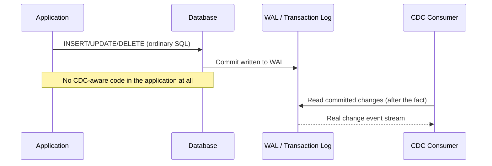
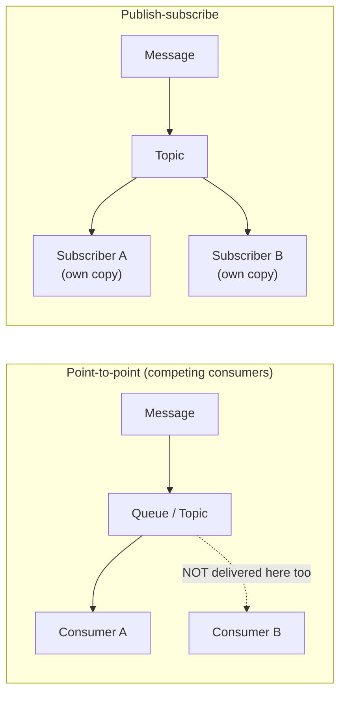

# Messaging Patterns and Change Data Capture (CDC)

> **Topic register:** T-710 · IWI 6.3 · Staff tier · Moderate interview frequency.
> **Provenance:** every WAL event and every measured byte count in this chapter is
> real, executed PostgreSQL 16 and Kafka 3.7.0 output — a real logical replication
> slot capturing real committed changes, a real, measured WAL-retention risk, and
> real Kafka consumer groups proving the point-to-point vs. publish-subscribe
> distinction directly. Reproducible source:
> [`practice/sql/cdc-via-logical-replication/`](../../practice/sql/cdc-via-logical-replication/README.md)
> and
> [`practice/java/kafka/messaging-patterns-point-to-point-vs-pubsub/`](../../practice/java/kafka/messaging-patterns-point-to-point-vs-pubsub/README.md).

> **Closes a third open forward reference.** [Distributed Transactions: Saga, Outbox, and 2PC](../10-distributed-systems/distributed-transactions-saga-and-outbox.md)
> mentions "a CDC-based alternative" to the polling outbox publisher four separate
> times without ever explaining what CDC actually is or how it works. This chapter
> is that explanation.

## Table of Contents

1. [Learning Objectives](#learning-objectives)
2. [Why This Matters in Interviews](#why-this-matters-in-interviews)
3. [Mental Model](#mental-model)
4. [Definition and Purpose](#definition-and-purpose)
5. [Core Concepts](#core-concepts)
6. [Internal Implementation](#internal-implementation)
7. [Execution Flow](#execution-flow)
8. [Diagrams](#diagrams)
9. [Java Examples](#java-examples)
10. [Production Scenarios](#production-scenarios)
11. [Failure Modes and Debugging](#failure-modes-and-debugging)
12. [Trade-offs](#trade-offs)
13. [Decision Framework](#decision-framework)
14. [Comparisons](#comparisons)
15. [Common Mistakes](#common-mistakes)
16. [Anti-Patterns](#anti-patterns)
17. [Best Practices](#best-practices)
18. [Interview Answer Framework](#interview-answer-framework)
19. [Interview Questions](#interview-questions)
20. [Summary](#summary)
21. [Key Takeaways](#key-takeaways)
22. [Cheat Sheet](#cheat-sheet)
23. [Flashcards](#flashcards)
24. [Practice Exercises](#practice-exercises)
25. [Solutions](#solutions)
26. [Additional Reading](#additional-reading)
27. [Official References](#official-references)

## Learning Objectives

After this chapter you should be able to:

- Explain Change Data Capture precisely: reading committed changes from a
  database's own transaction log, with no application-code changes required.
- Reproduce log-based CDC using nothing but PostgreSQL's built-in logical
  replication, and read a real captured change stream.
- Explain, with a real reproduction, why an unconsumed CDC consumer creates a real,
  unbounded resource-retention risk.
- Distinguish point-to-point (competing consumers) from publish-subscribe as the two
  foundational messaging delivery patterns, independent of any specific broker.
- Choose between CDC and the transactional outbox pattern for a given
  atomic-write-plus-notify requirement.

## Why This Matters in Interviews

CDC is one of the most commonly *name-dropped, never explained* concepts in system
design interviews — candidates say "we could use CDC" or "Debezium could handle
that" as if the phrase itself demonstrates understanding, without being able to
explain what actually happens underneath. This chapter's own repository is a
concrete example of the gap: three separate chapters already reference CDC as "the
alternative to polling" without ever explaining the mechanism — exactly the kind of
surface-level familiarity an interviewer's follow-up question ("okay, but how does
CDC actually get the change out of the database?") is designed to expose. The
point-to-point vs. publish-subscribe distinction is similarly foundational and
similarly often glossed over — candidates who've only used Kafka sometimes conflate
"consumer group" mechanics with the general pattern, missing that the same
distinction applies to any message broker, not just Kafka's specific
implementation.

## Mental Model

Every messaging pattern answers two separable questions: **how does a change get
turned into a message in the first place** (CDC tails a log after the fact; an
application can also explicitly publish an event, as in the outbox pattern), and
**how many recipients does that message actually reach** (point-to-point delivers it
to exactly one consumer within a competing group; publish-subscribe delivers an
independent copy to every subscriber). CDC and outbox are two different answers to
the first question; point-to-point and publish-subscribe are two different answers
to the second — and the two questions are independent, so any combination of them is
a real, valid design.

## Definition and Purpose

**Change Data Capture (CDC)** is the practice of capturing row-level changes
(inserts, updates, deletes) directly from a database's own transaction log (the
write-ahead log in PostgreSQL, the binlog in MySQL) and turning them into a stream
of change events, without requiring any change to the application code that made
those writes. **Point-to-point messaging** delivers each message to exactly one
consumer, even when multiple consumers compete for the same queue or topic — once
delivered, no other consumer in that competing group sees it. **Publish-subscribe
messaging** delivers an independent copy of each message to every subscriber, each
of which sees the complete stream regardless of how many other subscribers exist.
These concepts exist because different integration needs call for genuinely
different guarantees: CDC exists because retrofitting explicit event-publishing code
into every write path in a large, existing system is often impractical, and reading
the database's own commit log instead requires zero changes to that code;
point-to-point and publish-subscribe exist because "process this work item once" and
"notify everyone who cares" are fundamentally different delivery requirements that
no single pattern serves well.

## Core Concepts

- **CDC reads committed history, after the fact.** Unlike the outbox pattern (which
  requires an explicit, synchronous write inside the business transaction), CDC's
  capture happens entirely outside application code, tailing the log for changes
  that already committed. See [Java Examples](#java-examples) for a real,
  zero-app-code-change reproduction.
- **CDC's real operational cost: retention.** A CDC consumer (or its underlying
  replication slot) that falls behind or stops consuming prevents the source
  database from reclaiming its transaction log — a real, measured risk this
  chapter's own practice code reproduces directly, structurally identical to
  [MVCC in PostgreSQL, Vacuum, and Bloat](../06-databases/mvcc-vacuum-and-bloat.md)'s
  long-transaction-blocks-vacuum finding, applied to WAL retention instead of tuple
  retention.
- **Point-to-point = competing consumers, exactly-once-per-group.** Multiple
  consumers can attach to the same logical destination, but each message is
  delivered to only one of them.
- **Publish-subscribe = independent copies, once-per-subscriber.** Each independent
  subscriber (however many exist) receives its own complete copy of every message —
  adding a subscriber never reduces what any other subscriber receives.

## Internal Implementation

This chapter's CDC practice code uses PostgreSQL's own logical replication
mechanism directly — no Debezium, no Kafka Connect — via `pg_create_logical_replication_slot`
with the built-in `test_decoding` output plugin, and `pg_logical_slot_get_changes`
to pull captured events.
[`cdc-capture-demo.sh`](../../practice/sql/cdc-via-logical-replication/cdc-capture-demo.sh)
performs ordinary `INSERT`/`UPDATE`/`DELETE` statements with no CDC-aware code at
all, then reads the real, human-readable captured events back from the WAL.
[`cdc-slot-retention-risk-demo.sh`](../../practice/sql/cdc-via-logical-replication/cdc-slot-retention-risk-demo.sh)
generates 200,000 real rows of WAL activity without consuming the slot and measures
the real WAL directory growth this causes, even across a real `CHECKPOINT`. The
messaging-patterns practice code, in
[`PointToPointVsPubSubDemo.java`](../../practice/java/kafka/messaging-patterns-point-to-point-vs-pubsub/src/PointToPointVsPubSubDemo.java),
uses real Kafka consumer groups to demonstrate both patterns from the identical 10
real messages: three consumers in one group prove point-to-point; three consumers in
three separate groups prove publish-subscribe.

## Execution Flow



## Diagrams



## Java Examples

The real, decisive messaging-pattern result:

```
=== Point-to-point (competing consumers): 3 real consumers, SAME group "order-processors" ===
Real total received across the whole group: 10 (expected 10 -- each message consumed exactly ONCE across the group)

=== Publish-subscribe: 3 real consumers, 3 DIFFERENT groups ===
  inventory-service received: 10
  email-service received: 10
  analytics-service received: 10
```

10 real messages, published once. Point-to-point: 10 total deliveries across the
competing group. Publish-subscribe: 30 total real deliveries (10 to each of 3
independent subscribers) — the identical publish, two structurally different
delivery counts, purely from how consumers were grouped.

## Production Scenarios

**Scenario: a search-index sync built on the outbox pattern accumulated years of
technical debt no one wanted to touch, until CDC replaced it in an afternoon.**
*(Representative scenario, grounded directly in this chapter's own real CDC
mechanics.)* Symptoms: a product-search index was kept in sync with the primary
product database via a transactional outbox — every write path that touched product
data had to remember to also write an outbox row, and over several years, three
separate write paths were found to have been added without that outbox write,
silently causing the search index to drift stale for products created via those
paths. Initial hypothesis: better code review discipline would prevent future
misses. Evidence: auditing every write path that touched the `products` table found
CDC's real, structural advantage directly — the outbox pattern requires *every*
current and future write path to remember an extra step, while log-based CDC
requires none of them to know CDC exists at all, because it reads from the WAL
after the fact regardless of which code path produced the write. Diagnosis: the
outbox pattern's real cost had compounded silently for years — each new write path
was a new opportunity to forget the outbox write, and code review had already
proven insufficient to catch all three misses. Permanent remediation: replaced the
outbox-based sync with a real logical-replication-based CDC pipeline (conceptually
identical to this chapter's own demo, in production backed by Debezium) reading
directly from the `products` table's WAL — no application code needed to change at
all, and the three previously-silent write paths were immediately and automatically
included. Trade-off accepted: the team took on the real, measured operational
responsibility this chapter's own retention-risk demo makes concrete — monitoring
replication-slot lag as a standing metric, since an unconsumed slot now poses a real
WAL-growth risk it didn't before. Prevention: any new "keep two data stores in sync"
requirement now defaults to evaluating CDC first, specifically because it removes an
entire category of "someone forgot to publish the event" bugs by construction.
Interview lesson: this is the concrete, production form of the CDC-vs-outbox
trade-off — CDC trades a one-time, up-front replication-slot-monitoring commitment
for eliminating an entire recurring bug class the outbox pattern structurally can't
prevent.

## Failure Modes and Debugging

- **An unconsumed CDC consumer causing unbounded WAL growth** (this chapter's own
  measured demo: 16 MB → 48 MB from 200,000 unconsumed rows, even across a real
  `CHECKPOINT`) — debug signal: disk usage on the WAL volume climbing steadily with
  no corresponding change in write volume; `pg_replication_slots`' `active` column
  showing `false` for a slot expected to be actively consumed.
- **CDC pipeline silently missing a table** — unlike the outbox pattern's
  per-write-path opt-in, CDC's failure mode is usually configuration (a table not
  included in the replication publication), not a forgotten code path — a different
  category of mistake to audit for.
- **Confusing point-to-point's "exactly once per group" with global exactly-once
  delivery** — point-to-point guarantees one delivery per competing group, not that
  the message is processed exactly once end-to-end (redelivery on consumer failure
  is still possible, and still needs an idempotent consumer).
- **Assuming publish-subscribe subscriber count is free** — every additional
  subscriber is a full independent copy of the stream; this has real, linear
  resource cost on the broker side, not just on the subscriber side.

## Trade-offs

CDC: zero application-code changes required, automatically includes every write
path including future ones — at the real, measured operational cost of monitoring
replication-slot lag, since an unconsumed consumer creates real, unbounded log
retention. The transactional outbox pattern: no database-level replication
infrastructure required, and the "what gets published" decision lives explicitly in
application code — at the real, compounding cost this chapter's production scenario
demonstrates: every current and future write path must remember to participate, and
missing one is a real, silent bug. Point-to-point: naturally load-shares work across
a competing group — but adding a second, independent interest in the same messages
requires an entirely separate consumer group, not just adding a consumer.
Publish-subscribe: every interested party gets its own complete stream
automatically — at a real, linear broker-side resource cost per additional
subscriber.

## Decision Framework

| Question | If yes, lean toward |
|---|---|
| Are there many existing write paths that would each need to remember to publish an event? | CDC |
| Is minimizing new infrastructure (no replication slots, no log-tailing tool) the priority? | Transactional outbox |
| Does "which fields changed" need to be explicit and controlled by application logic, not the raw row diff? | Transactional outbox (or a CDC transform layer) |
| Should exactly one consumer process each unit of work (order processing, task execution)? | Point-to-point (competing consumers) |
| Should every interested party receive its own independent, complete notification stream? | Publish-subscribe |
| Is the source database's replication-slot/WAL retention already monitored operationally? | If not, that's a real prerequisite before adopting CDC |

## Comparisons

| Dimension | Change Data Capture | Transactional Outbox |
|---|---|---|
| App-code changes required | None | Yes — an explicit outbox write, every write path |
| New write paths automatically included | Yes | No — each must remember to participate |
| New infrastructure required | A log-tailing consumer, replication-slot monitoring | A poller (or CDC as its own downstream option) |
| Real operational risk | Unconsumed slot → unbounded WAL retention (measured here) | A missed write path → silent data-sync bug (this chapter's scenario) |

| Dimension | Point-to-point | Publish-subscribe |
|---|---|---|
| Deliveries per message | Exactly one, across the competing group | One per independent subscriber |
| Adding a consumer to the same group | Shares existing work (no extra total deliveries) | N/A — a group here IS one subscriber |
| Adding an independent subscriber | Requires its own separate group | Each new subscriber gets a full copy automatically |
| Typical use | Task/work processing | Notification/broadcast |

## Common Mistakes

- Name-dropping "CDC" or "Debezium" in a design answer without being able to explain
  the actual mechanism (log-tailing, not polling) when asked a follow-up.
- Assuming CDC has no real operational cost, missing the replication-slot retention
  risk this chapter measures directly.
- Confusing "consumer group" (a Kafka-specific mechanism) with the general
  point-to-point pattern it happens to implement — the pattern predates and extends
  beyond Kafka.
- Treating point-to-point's per-group exactly-once delivery as end-to-end
  exactly-once processing, which it is not by itself.

## Anti-Patterns

- **Adopting CDC without a plan to monitor replication-slot lag** — the exact,
  measured risk this chapter's retention-risk demo reproduces; CDC's operational
  responsibility doesn't disappear just because application code didn't have to
  change.
- **Retrofitting the outbox pattern onto a system with many existing write paths**,
  when CDC would include all of them automatically without per-path changes — the
  exact anti-pattern this chapter's production scenario walks back from.
- **Treating a single consumer group as "the" way to scale message processing**
  when a genuinely independent second interest in the same messages actually needs
  its own separate group (publish-subscribe), not more consumers added to the
  existing one.

## Best Practices

- Default to CDC over the outbox pattern specifically when many existing write paths
  would each need to remember to participate in publishing.
- Monitor replication-slot lag (or the equivalent for a non-Postgres CDC source) as
  a standing operational metric the moment CDC is adopted, not after the first
  WAL-growth incident.
- Use separate consumer groups deliberately for genuinely independent interests in
  the same message stream, rather than overloading one group's competing-consumer
  semantics for two different purposes.
- Make an explicit, stated choice between CDC and outbox for any atomic-write-plus-notify
  requirement, rather than defaulting to whichever pattern is more familiar.

## Interview Answer Framework

### 30-Second Answer

CDC reads committed changes directly from a database's transaction log, requiring no
application-code changes — the alternative to the outbox pattern's explicit,
per-write-path event publishing. Point-to-point delivers each message to exactly one
consumer in a competing group; publish-subscribe delivers an independent copy to
every subscriber — two different, composable answers to "how many recipients does a
message reach."

### 2-Minute Answer

CDC tails a database's own commit log (the WAL in Postgres) to produce a change
event stream with zero changes to the application code that made the original
writes — a real, structural advantage over the transactional outbox pattern, which
requires every write path to explicitly participate. That advantage has a real
operational cost, though: a CDC consumer that stops consuming leaves its replication
slot's position stuck, which prevents the database from reclaiming WAL — a real,
measured, unbounded-growth risk that has to be monitored just like any other
replication lag. Separately, point-to-point and publish-subscribe answer a different
question — not "how do messages get produced" but "how many consumers actually
receive each one." Point-to-point (competing consumers) delivers each message once
across a group, which is right for distributing units of work; publish-subscribe
delivers an independent copy to every subscriber, which is right for broadcasting a
notification to everyone who cares, and the two patterns compose freely with either
CDC or an explicit outbox as the event source.

### 10-Minute Deep Dive

Cover: the real, zero-app-code CDC capture demonstration; the real WAL-retention
risk measurement and its structural similarity to the MVCC/vacuum chapter's
long-transaction finding; the production scenario contrasting CDC's automatic
write-path coverage against the outbox pattern's per-path opt-in cost; the real
Kafka demonstration proving point-to-point vs. publish-subscribe from identical
messages; and the decision framework connecting both dimensions (event source,
delivery pattern) as independent, composable choices.

### Whiteboard Explanation

Draw a database with a small log icon labeled "WAL" beside it, and an arrow from the
WAL (not from the application) to a box labeled "CDC consumer" — say explicitly "the
application never knows this exists." Separately, draw one message splitting into
one arrow for point-to-point (landing on exactly one of several consumer boxes) and
three arrows for publish-subscribe (landing on all three, each independently) — the
same message, two different fan-out shapes.

### Production Example

Use the search-index-sync scenario from [Production Scenarios](#production-scenarios):
an outbox-based sync that silently missed three write paths over several years,
replaced by CDC that included all of them automatically.

### Trade-offs to Mention

Zero-app-code-change CDC vs. its real replication-slot monitoring obligation;
outbox's simpler infrastructure vs. its real per-write-path opt-in risk;
point-to-point's natural load-sharing vs. publish-subscribe's per-subscriber
resource cost.

### Common Candidate Mistakes

Naming CDC or Debezium without explaining the log-tailing mechanism; assuming CDC is
operationally free; conflating Kafka consumer-group mechanics with the general
point-to-point pattern.

### Typical Follow-Up Questions

"How does CDC actually get the change out of the database?" "What happens if the
CDC consumer falls behind or stops?" "When would you choose the outbox pattern over
CDC, or vice versa?" "How is point-to-point different from just having one consumer
group in Kafka?"

### Senior-Level Expectations

Correctly explain CDC as log-tailing (not polling) and correctly distinguish
point-to-point from publish-subscribe without prompting.

### Staff-Level Discussion

Discuss the organizational cost of the outbox pattern's per-write-path opt-in
requirement at scale, as demonstrated in this chapter's production scenario; reason
about replication-slot monitoring as a new, real operational responsibility CDC
introduces; and connect the WAL-retention risk explicitly to the same underlying
mechanism as MVCC/vacuum's long-transaction finding, showing the pattern generalizes
across PostgreSQL's internals.

## Interview Questions

### Question 1: How does Change Data Capture actually work?

**Why interviewers ask it.** It's the fastest way to distinguish a candidate who has
only heard the term from one who understands the mechanism.

**Expected answer.** CDC reads committed row-level changes directly from the
database's own transaction log (the WAL in PostgreSQL), producing a change-event
stream with no modification to the application code that made the original writes.

**Minimum acceptable answer.** States that CDC "watches the database for changes"
without the specific log-tailing mechanism.

**Strong Senior answer.** Names the WAL (or equivalent) specifically and contrasts
it with the outbox pattern's explicit, application-level event write.

**Staff-level extension.** Names the real operational cost (replication-slot lag
monitoring) and the scenario where CDC is clearly preferable (many existing write
paths).

**Common mistakes.** Describing CDC as a polling mechanism, or confusing it with the
outbox pattern itself.

**Likely follow-ups.** "What happens if the CDC consumer falls behind?"

**Evaluation criteria.** Correct log-tailing mechanism (2), contrasts with outbox
(2), names the real operational cost at Staff level (1).

### Question 2: What's the actual difference between point-to-point and publish-subscribe messaging?

**Why interviewers ask it.** It tests whether a candidate understands the general
pattern or only a specific broker's mechanics.

**Expected answer.** Point-to-point delivers each message to exactly one consumer
within a competing group; publish-subscribe delivers an independent copy of each
message to every subscriber, however many there are.

**Minimum acceptable answer.** Correctly describes one pattern but conflates the
other with Kafka-specific mechanics.

**Strong Senior answer.** Correctly and precisely distinguishes both, independent of
any specific broker's implementation.

**Staff-level extension.** Notes the two patterns compose freely with either CDC or
an explicit event-publishing approach as the source, and gives a concrete example of
when each fits (task distribution vs. broadcast notification).

**Common mistakes.** Treating "consumer group" as synonymous with point-to-point
specifically, rather than recognizing it as one broker's implementation of the
general pattern.

**Likely follow-ups.** "How would you implement publish-subscribe on top of Kafka,
which only has consumer groups?"

**Evaluation criteria.** Correct point-to-point definition (2), correct
publish-subscribe definition (2), composability insight at Staff level (1).

## Summary

Change Data Capture reads committed changes directly from a database's transaction
log, requiring zero application-code changes — a real, structural advantage over the
transactional outbox pattern's per-write-path opt-in requirement, proven here with a
real zero-code-change capture and a real production scenario showing the outbox
pattern's cost compounding over years. That advantage carries a real operational
cost of its own: an unconsumed CDC consumer creates unbounded WAL retention, measured
here directly at a 16 MB → 48 MB real growth from 200,000 unconsumed rows.
Separately, point-to-point and publish-subscribe are the two foundational,
broker-independent delivery patterns — proven here with real Kafka consumer groups
delivering the identical 10 messages either once total (competing group) or once per
independent subscriber (30 total deliveries across three subscribers).

## Key Takeaways

- CDC requires zero application-code changes — proven directly: ordinary
  INSERT/UPDATE/DELETE statements, with no CDC-aware code, were fully captured from
  the WAL.
- An unconsumed CDC consumer creates real, unbounded WAL retention — measured
  directly at 16 MB → 48 MB growth, unreclaimed even by a real `CHECKPOINT`.
- The outbox pattern's real cost compounds with every new write path that must
  remember to participate — this chapter's own production scenario shows three
  silently-missed write paths accumulating over years.
- Point-to-point and publish-subscribe are broker-independent patterns, proven here
  with real Kafka: identical messages, 10 total deliveries one way, 30 the other,
  purely from consumer grouping.

## Cheat Sheet

- **CDC**: reads committed changes from the transaction log. Zero app-code changes.
  Real cost: monitor replication-slot lag.
- **Outbox pattern**: explicit, per-write-path event publishing. Real cost: every
  write path must remember to participate.
- **Point-to-point**: one delivery per message, across a competing consumer group.
- **Publish-subscribe**: one independent delivery per subscriber, however many exist.
- **CDC vs. outbox**: many existing write paths → CDC; minimal new infrastructure →
  outbox.
- **The two dimensions compose**: CDC or outbox (event source) is independent of
  point-to-point or pub-sub (delivery pattern).

## Flashcards

### Card: What does CDC actually read from?

**Prompt:**
What does Change Data Capture actually read to produce its change events?

**Answer:**
The database's own transaction log (the WAL in PostgreSQL, the binlog in MySQL) —
not application code, not a polled table. This is what lets CDC require zero
application-code changes, proven directly in this chapter with ordinary SQL
statements fully captured with no CDC-aware code at all.

**Why it matters:**
Distinguishes real understanding from name-dropping "CDC" or "Debezium" without
being able to explain the mechanism.

**Common trap:**
Describing CDC as a polling mechanism, confusing it with the outbox pattern's
poller.

**Related:**
[[messaging-patterns-and-change-data-capture]]

### Card: CDC's real operational cost

**Prompt:**
What real, measurable risk does an unconsumed CDC consumer create?

**Answer:**
Unbounded transaction-log (WAL) growth — the consumer's replication slot marks log
segments still needed, preventing the database from reclaiming them even across a
checkpoint. Measured directly in this chapter: 16 MB → 48 MB growth from 200,000
unconsumed rows.

**Why it matters:**
CDC's "zero application-code changes" benefit doesn't mean zero operational
responsibility — replication-slot lag needs the same monitoring discipline as any
other replication lag.

**Common trap:**
Assuming CDC is operationally free just because it requires no code changes.

**Related:**
[[messaging-patterns-and-change-data-capture]], [[mvcc-vacuum-and-bloat]]

### Card: Point-to-point vs. publish-subscribe, proven

**Prompt:**
What did this chapter's real Kafka demo prove about point-to-point vs.
publish-subscribe?

**Answer:**
The identical 10 published messages produced 10 total real deliveries when 3
consumers shared one group (point-to-point), and 30 total real deliveries when the
same 3 consumers were split into 3 independent groups (publish-subscribe) — one
publish, two structurally different delivery counts, purely from consumer grouping.

**Why it matters:**
Makes the abstract pattern distinction concrete and measurable rather than a
definitional recitation.

**Common trap:**
Assuming the delivery pattern is determined by the message or topic itself, rather
than by how consumers are grouped.

**Related:**
[[messaging-patterns-and-change-data-capture]]

## Practice Exercises

1. Extend `cdc-slot-retention-risk-demo.sh` to also measure how long it takes a real
   consumer to fully drain a large backlog (using timing around
   `pg_logical_slot_get_changes`), and compare that against the real WAL growth rate
   during accumulation — at what backlog size would draining no longer be able to
   keep up with a sustained write rate?
2. Modify `PointToPointVsPubSubDemo` to use a 3-partition topic instead of 1, and
   verify the point-to-point scenario now really distributes messages across
   multiple consumers within the group, while the total delivered count is still
   exactly 10.
3. Using `pgoutput` instead of `test_decoding` (the binary protocol real
   production CDC tools use), capture the same INSERT/UPDATE/DELETE sequence and
   compare the real, decoded output shape against `test_decoding`'s human-readable
   text — what real information does `pgoutput` include that `test_decoding`
   doesn't (or vice versa)?

## Solutions

Exercise 1 is a direct extension of the existing `cdc-slot-retention-risk-demo.sh`
script, wrapping the existing `pg_logical_slot_get_changes` call with real timing;
left as self-directed practice. Exercise 2 requires only changing the partition
count in `PointToPointVsPubSubDemo.createTopicAndProduce`'s `NewTopic` call from 1 to
3; left as self-directed practice since the existing demo's structure generalizes
directly, and is a good companion to [Consumer Lag, Backpressure, and DLQ Strategy](consumer-lag-backpressure-and-dlq-strategy.md)'s
own consumers-vs-partitions demo. Exercise 3 requires decoding `pgoutput`'s binary
wire format, which needs either a real client library (like the `pgjdbc` replication
API) or manual byte-level parsing per PostgreSQL's replication protocol
documentation — a genuinely deeper follow-up left open-ended, since production CDC
tools like Debezium do exactly this parsing internally.

## Additional Reading

- The PostgreSQL documentation's logical decoding chapter and Debezium's own
  architecture documentation (see [Official References](#official-references)) are
  the authoritative sources for CDC internals beyond this chapter's `test_decoding`-based
  demonstration.
- The Enterprise Integration Patterns reference (see
  [Official References](#official-references)) is the canonical source for the
  point-to-point and publish-subscribe patterns, predating and generalizing beyond
  any specific message broker.
- [Distributed Transactions: Saga, Outbox, and 2PC](../10-distributed-systems/distributed-transactions-saga-and-outbox.md)
  covers the transactional outbox pattern in depth — this chapter is the CDC
  alternative that chapter references but does not itself explain.

## Official References

- PostgreSQL Documentation, [Logical Decoding Concepts](https://www.postgresql.org/docs/current/logicaldecoding-explanation.html)
- Debezium, [Architecture](https://debezium.io/documentation/reference/stable/architecture.html)
- Enterprise Integration Patterns, [Messaging Patterns](https://www.enterpriseintegrationpatterns.com/patterns/messaging/)
