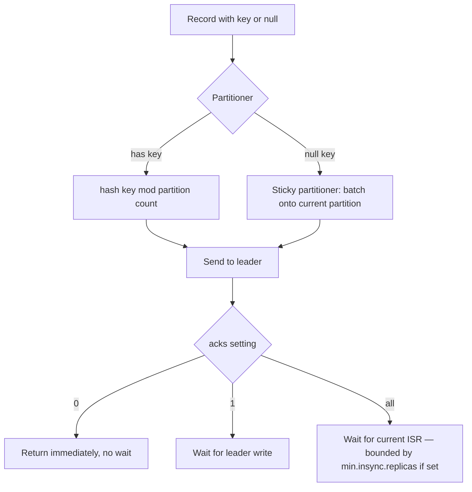

# Kafka Producer Semantics: acks, Idempotence, and Partition Key Design

> **Topic register:** T-702 (Producer semantics, IWI 7.40) · T-705 (Partition key design, IWI 7.55, #23 tied of 198) · Advanced tier · High interview frequency [H]
> **Provenance:** the partition-routing behavior and idempotent-producer configuration in this chapter are real, executed output from [`practice/java/week-08/kafka/src/ProducerPartitionKeyDemo.java`](../../practice/java/week-08/kafka/src/ProducerPartitionKeyDemo.java) against a live single-broker KRaft cluster.

## Table of Contents

1. [Learning Objectives](#learning-objectives)
2. [Why This Matters in Interviews](#why-this-matters-in-interviews)
3. [Level 1 — Foundation](#level-1--foundation)
4. [Level 2 — Working Knowledge](#level-2--working-knowledge)
5. [Mental Model](#mental-model)
6. [Definition and Purpose](#definition-and-purpose)
7. [Historical Context](#historical-context)
8. [Core Concepts](#core-concepts)
9. [Internal Implementation](#internal-implementation)
10. [Diagrams](#diagrams)
11. [Production Scenarios](#production-scenarios)
12. [Failure Modes and Debugging](#failure-modes-and-debugging)
13. [Trade-offs](#trade-offs)
14. [Decision Framework](#decision-framework)
15. [Comparisons](#comparisons)
16. [Common Mistakes](#common-mistakes)
17. [Anti-Patterns](#anti-patterns)
18. [Best Practices](#best-practices)
19. [Interview Answer Framework](#interview-answer-framework)
20. [Interview Questions](#interview-questions)
21. [Summary](#summary)
22. [Key Takeaways](#key-takeaways)
23. [Cheat Sheet](#cheat-sheet)
24. [Flashcards](#flashcards)
25. [Practice Exercises](#practice-exercises)
26. [Solutions](#solutions)
27. [Additional Reading](#additional-reading)
28. [Official References](#official-references)

---

## Learning Objectives

By the end of this chapter you can:

- State precisely why `acks=all` alone does not guarantee durability, and name the setting that closes the gap.
- Explain what an idempotent producer actually deduplicates, and what it explicitly does not cover.
- Diagnose the classic "`acks=all` and you still lost a message" interview trap with the exact mechanism.
- Choose a partition key deliberately, naming both failure modes (too coarse, too fine) it must avoid.
- Explain the sticky partitioner's null-key batching behavior and why it differs from older round-robin expectations.

## Why This Matters in Interviews

A Kafka producer makes two genuinely independent decisions per record — which partition it goes to, and how durably it's written before the call returns — and interview answers routinely conflate the two. This chapter's central interview trap, *"`acks=all` and you still lost a message. How?"*, is explicitly named in this project's own blueprint as a discriminating follow-up: the honest answer requires understanding that `acks=all` is a statement about the *current* ISR, not the configured replication factor, which is only learnable by first understanding replication mechanics ([Kafka Architecture Fundamentals](kafka-architecture-fundamentals.md)).

## Level 1 — Foundation

Sending a Kafka record is like mailing a certified letter. Two separate decisions happen: which mailbox it goes to (the **partition**, decided by the key), and how much proof of delivery you demand before you consider the letter truly sent (`acks`). Asking for `acks=0` is like dropping a letter in a public mailbox and walking away without a receipt — fast, but you'll never know if it was lost. Asking for `acks=all` is like requiring every backup clerk currently on duty to sign for it — but if only one clerk happens to be on duty that day (the in-sync replica set has shrunk), "everyone signed" only means one signature, not the three you assumed.

**Idempotence** is like stamping each letter with a unique serial number before mailing it: if the postal service loses track of whether your letter arrived and you resend it "just in case," the receiving office sees the same serial number twice and discards the duplicate — but this trick only works for the mailing step itself. It says nothing about whether the person who eventually reads the letter opens it once or twice.

## Level 2 — Working Knowledge

At this level you should be able to reason through the specific interview trap this chapter names without hesitation: "I set `acks=all` and I still lost data — how?" The working answer is that `acks=all` only ever waits for whoever is *currently* in the in-sync replica set, which can shrink to just the leader if followers fall behind — so `acks=all` alone is not a durability guarantee unless you also set `min.insync.replicas` to something greater than one, forcing the write to fail loudly instead of silently succeeding on a single, about-to-fail copy.

You should also be practically comfortable choosing a partition key for a real scenario. If a consumer needs to process one entity's events strictly in order (a customer's orders, a device's telemetry), key by that entity's ID. If there's no such ordering need, sending records with no key at all is often the better default — it lets Kafka's sticky partitioner batch records efficiently for throughput, since there's nothing to preserve order for in the first place. A key that's unique per record (a random UUID) buys you no ordering benefit at all while still costing you that batching efficiency — a common, avoidable mistake.

## Mental Model

**A producer answers two unrelated questions per record: "where does it go?" and "how sure am I it landed?"** Partitioning answers the first, using the key; `acks` (plus `min.insync.replicas`) answers the second, using replica acknowledgment. Idempotence is a third, narrower guarantee layered on top of the second: it only protects against the producer's *own* retries creating duplicates — it says nothing about where the record went or how many replicas hold it.

## Definition and Purpose

The **partitioner** decides which partition a record is routed to, driven by the record's key (or the sticky partitioner's batching strategy when no key is given). **`acks`** decides how many replicas must acknowledge a write before the producer considers it durable. **Idempotence** (`enable.idempotence=true`) prevents the producer's own retries from creating duplicate writes to Kafka. These three exist because, without a deliberate partitioning strategy, related records could land anywhere, making per-entity ordering impossible to reconstruct downstream; and without a durability contract, a producer has no way to know — or tell the caller — whether a "successful" send actually survived a subsequent broker crash.

## Historical Context

Prior to **KIP-480** (Kafka 2.4, 2019), the default partitioner for unkeyed records used strict round-robin — one record per partition, cycling through all of them. This produced small, inefficient batches, since every record's target partition changed before enough records could accumulate to fill a batch. The **sticky partitioner** introduced by KIP-480 changed this: it sticks to one partition for an entire in-flight batch, then switches, trading strict per-record round-robin distribution for materially larger batches and better throughput. Idempotent producers were introduced alongside transactional producers in **KIP-98** (Kafka 0.11, 2017) — the same release that made exactly-once semantics achievable for Kafka-to-Kafka pipelines (see [Delivery Semantics and Exactly-Once Processing](delivery-semantics-and-exactly-once.md)).

## Core Concepts

### Partition key design is a permanent ordering commitment

As established in [Kafka Architecture Fundamentals](kafka-architecture-fundamentals.md#core-concepts), partition key choice governs per-entity ordering and is effectively permanent once keyed data is live. Pick the entity whose internal ordering actually matters to the consumer — typically the aggregate root ID (`customerId`, `orderId`) — never a random or high-cardinality-but-irrelevant field. Two failure modes to design against explicitly:

- **Too coarse a key** (e.g., `tenantId` for a huge tenant) → hot partition; one consumer instance bottlenecks the whole tenant's throughput.
- **Too fine a key** (e.g., a UUID per event with no shared entity) → no ordering guarantee is actually being purchased, since nothing repeats; a null key would have been simpler and enabled the sticky-batching throughput benefit.

### `acks` levels and what they actually wait for

| `acks` value | Waits for | Loses data when |
|---|---|---|
| `0` | Nothing — fire and forget | Any broker issue, network drop, anything |
| `1` | Leader has written to its local log | Leader crashes before followers replicate it |
| `all` (`-1`) | Every replica currently in the ISR | ISR has shrunk to just the leader — needs `min.insync.replicas ≥ 2` to actually mean something |

### Idempotent producers solve a narrower problem than "exactly-once"

`enable.idempotence=true` (the modern default) assigns each producer instance a `PID` (producer ID) and stamps each record with a monotonically increasing sequence number per partition; the broker deduplicates by `(PID, partition, sequence)`, so a retried send (e.g., after a timeout where the original actually succeeded) is dropped rather than double-appended. This covers **producer-side retries to Kafka only** — it says nothing about a consumer processing a successfully-written record more than once, which is [Delivery Semantics and Exactly-Once Processing](delivery-semantics-and-exactly-once.md)'s (T-704) domain entirely.

## Internal Implementation

### The sticky partitioner, measured

**Real output, null key (no key given):**
```
== null key -> sticky partitioner batches onto one partition per batch ==
key=null value=unkeyed-0 -> partition=2 offset=3
key=null value=unkeyed-1 -> partition=2 offset=4
key=null value=unkeyed-2 -> partition=2 offset=5
key=null value=unkeyed-3 -> partition=2 offset=6
key=null value=unkeyed-4 -> partition=2 offset=7
key=null value=unkeyed-5 -> partition=2 offset=8
```

All six unkeyed records land on partition 2 for this batch — proof of sticky-batching behavior, not round-robin distribution.

### Idempotent producer configuration, measured

The real config dump from `ProducerPartitionKeyDemo`'s run shows idempotence enabled by default:

```
acks = -1
enable.idempotence = true
max.in.flight.requests.per.connection = 5
retries = 2147483647
```

`acks = -1` is the numeric form of `all`. `retries = 2147483647` (effectively infinite) is safe specifically *because* idempotence is enabled — without it, unlimited retries would risk unlimited duplication on transient failures; with it, the broker's `(PID, partition, sequence)` deduplication makes retrying indefinitely safe.

### The `acks=all` interview trap, explained mechanically

*"`acks=all` and you still lost a message. How?"* The ISR had shrunk to just the leader (a follower had fallen behind and been dropped from the ISR — see [Kafka Architecture Fundamentals](kafka-architecture-fundamentals.md#core-concepts)) at the moment of the write, so "all of the current ISR" acked with a single replica — then that replica died before the follower caught back up. `acks=all` is a statement about *how many current replicas acked*, not *how many replicas exist*. `min.insync.replicas` is the setting that makes the producer's write fail loudly (`NotEnoughReplicasException`) rather than silently succeed on a shrunk ISR.

## Diagrams



## Production Scenarios

### Scenario: a silent data-loss incident traced to a shrunk ISR

**Symptoms.** A small number of financial transaction events are missing from a downstream analytics pipeline, discovered during a monthly reconciliation, with no corresponding error or alert at write time.

**Impact.** Financial reporting discrepancy requiring manual investigation and correction.

**Initial hypotheses.** Consumer-side processing bug (checked — offsets and logs show the records were never in the topic at all); producer silently failing (checked — producer logs show all sends returned successfully); a broker-level data-loss event (correct).

**Evidence.** Broker logs from the affected time window show a follower replica had been dropped from the ISR shortly before the incident window (lagging beyond `replica.lag.time.max.ms`), and the topic's `acks=all` configuration had no corresponding `min.insync.replicas` setting — it was left at the default of 1.

**Diagnosis.** With the ISR shrunk to just the leader, `acks=all` acknowledged writes based on a single replica. The leader broker then failed before the lagging follower caught up and was restored to the ISR, losing every record acknowledged during that window.

**Immediate mitigation.** Set `min.insync.replicas=2` on the affected topic, converting the silent-loss failure mode into a loud, immediate `NotEnoughReplicasException` the next time the ISR shrinks below the minimum.

**Permanent remediation.** Audit all production topics for `acks=all` without a corresponding `min.insync.replicas` setting, and add alerting on ISR shrinkage events, not just broker-down events — since the dangerous window is exactly the period where the ISR is smaller than expected but nothing looks obviously wrong.

**Alternatives considered.** Increasing `replication.factor` alone — rejected as insufficient in isolation, since the actual failure mode is about the *current* ISR at write time, not the configured replica count.

**Trade-offs.** `min.insync.replicas=2` means writes fail (rather than silently succeed) during any window where fewer than two replicas are in sync — accepted, since failing loudly and rejecting the write is strictly safer than silently accepting data that isn't actually durable.

**Prevention.** Treat `acks=all` and `min.insync.replicas` as a single, inseparable configuration pair in every topic-provisioning checklist and infrastructure-as-code template.

**Interview lesson.** This is the "`acks=all` and you still lost a message" interview trap (§ Interview Questions Q1) arriving as a real, delayed-discovery financial-reporting incident.

## Failure Modes and Debugging

| Symptom | Likely cause | Debugging step |
|---|---|---|
| Data loss despite `acks=all` | ISR had shrunk below intended replication at write time; no `min.insync.replicas` enforced | Check broker logs for ISR shrink events around the loss window; add `min.insync.replicas` |
| Unexpected duplicate records in a downstream system | Producer retried a send after a transient failure without idempotence enabled | Verify `enable.idempotence=true`; if already enabled, the duplication is likely consumer-side (T-704), not producer-side |
| One partition consistently far busier than others | Key skew from a coarse or unevenly-distributed partition key | Measure per-partition throughput; consider a compound key to spread the hot entity |
| Unexpectedly small producer batches, lower throughput than expected | Producing with a high-cardinality or per-record-unique key when no ordering is actually needed | Switch to a null key to enable sticky-partitioner batching, if ordering isn't actually required |

## Trade-offs

| Setting | Benefit | Cost |
|---|---|---|
| `acks=0` | Lowest latency, highest throughput | No durability guarantee at all |
| `acks=all` + `min.insync.replicas≥2` | Survives single-broker failure without data loss | Higher write latency; unavailable if ISR drops below the minimum |
| `enable.idempotence=true` | Eliminates duplicate writes from producer retries, at negligible cost | None significant — this is why it's the modern default |
| Entity-ID partition key | Per-entity ordering, predictable | Skewed entities become hot partitions; key choice is a one-way door |

## Decision Framework

1. **Does this data need per-entity ordering?** If yes, key by the aggregate root ID. If no, use a null key to get sticky-partitioner batching throughput.
2. **How many simultaneous broker failures must this topic survive without data loss?** Set `replication.factor` and `min.insync.replicas` from that number explicitly — never leave `min.insync.replicas` at its default alongside `acks=all`.
3. **Is the chosen key too coarse (one entity dominates) or too fine (nothing repeats)?** Reconsider before the topic is live with real data depending on the choice.
4. **Is idempotence enabled?** It should be, essentially always — there is no meaningful cost to leaving it on.

## Comparisons

| Mechanism | Protects against | Does NOT protect against |
|---|---|---|
| `acks=all` alone | A single-replica-ack write being reported as successful when more replicas were requested | Data loss when the ISR itself has shrunk below the intended replica count |
| `acks=all` + `min.insync.replicas` | Silent durability shortfalls — fails loudly instead | Consumer-side duplicate processing (a different layer entirely, see T-704) |
| Idempotent producer | Producer-retry-caused duplicate writes to Kafka | Consumer processing the same successfully-written record more than once |
| Transactional producer (T-704) | Atomicity across a read-process-write loop within Kafka | Atomicity with an external system (database, HTTP call) without an outbox or idempotent consumer |

## Common Mistakes

- Believing `acks=all` alone guarantees no data loss — it needs `min.insync.replicas`.
- Assuming idempotent producers make the whole pipeline exactly-once — they only dedupe producer retries.
- Choosing a partition key for entities that don't actually need relative ordering, sacrificing sticky-batching throughput for a guarantee nobody consumes.

## Anti-Patterns

- **Setting `acks=all` without ever configuring `min.insync.replicas`** — this leaves the exact silent-loss gap this chapter's production scenario demonstrates.
- **Keying every topic "just in case" ordering matters later** — pays a throughput and hot-partition-risk cost for a guarantee that may never be consumed.
- **Treating idempotent producers as "Kafka is now exactly-once"** — a scope error that surfaces the moment a consumer processes a record twice.

## Best Practices

- Always pair `acks=all` with an explicit `min.insync.replicas ≥ 2` — never leave one without the other.
- Leave `enable.idempotence=true` (the default) enabled essentially universally; there is no meaningful downside.
- Choose partition keys from the entity whose ordering the consumer actually depends on — verify this against real downstream consumer logic, not an assumption.
- Monitor per-partition throughput to catch key skew before it becomes a hot-partition incident.

## Interview Answer Framework

### 30-Second Answer

A producer makes two independent decisions per record: which partition (via the key) and how durably (via `acks`). `acks=all` alone only waits for the *current* ISR, which can shrink to a single replica — pair it with `min.insync.replicas` for a real durability guarantee. Idempotent producers dedupe the producer's own retries only, not consumer-side duplicate processing.

### 2-Minute Answer

Definition: the partitioner routes by key (or sticky-batches null keys); `acks` sets how many replicas must acknowledge a write; idempotence dedupes the producer's own retries via a PID and per-partition sequence number. Why it exists: without deliberate partitioning, per-entity ordering is unreconstructable; without a durability contract, "success" is meaningless. How it works: `acks=all` waits for the current ISR, not the configured `replication.factor`. One important trade-off: `acks=all` without `min.insync.replicas` silently accepts writes acknowledged by a single, about-to-fail replica. Production example: a real financial-data-loss incident traced to exactly this gap — `acks=all` set, `min.insync.replicas` left at its default, an ISR shrink followed by a leader failure.

### 10-Minute Deep Dive

Cover, in order: the two independent producer decisions (partitioning, durability) and why interview answers conflate them (mental model); the sticky partitioner's measured null-key batching behavior versus older round-robin expectations (internals + historical context); the `acks` table and precisely what each level waits for (internals); the "`acks=all` and you still lost a message" mechanism, tied directly to ISR shrinkage from the architecture-fundamentals chapter (failure mode); idempotent producers' narrow, measured scope — PID plus sequence number, producer-retries only (edge case, scope boundary); and close with the production scenario — a real financial-reporting incident from exactly this gap, discovered only in a monthly reconciliation.

### Whiteboard Explanation

Draw the [§ Diagrams](#diagrams) flowchart first: record → partitioner (key-hash or sticky) → send → `acks` check branching into three outcomes. Then, next to the `all` branch, draw a small box labeled "ISR" with 3 replica circles, and cross out one to show it shrinking to 2 — annotate that `acks=all` waits on whatever's inside that box *right now*, not a fixed number. This visually pins down why `acks=all` alone isn't a durability guarantee.

### Production Example

The financial-data-loss incident in [§ Production Scenarios](#production-scenarios): `acks=all` was set without `min.insync.replicas`, the ISR shrank to a single replica, that replica failed, and the loss was discovered only in a monthly reconciliation — not at write time, since nothing failed loudly.

### Trade-offs to Mention

State unprompted: `acks=all` alone is bounded by the current ISR, not `replication.factor`; idempotent producers only cover producer-side retries, not consumer-side duplicate processing; partition key choice trades ordering granularity against hot-partition risk and is effectively permanent.

### Common Candidate Mistakes

Insisting `acks=all` is unconditionally durable; conflating idempotent producers with "Kafka is exactly-once end to end"; choosing a partition key for entities that don't need relative ordering.

### Typical Follow-Up Questions

1. "What setting closes the `acks=all` durability gap?"
2. "So is Kafka exactly-once or not?"
3. "With `replication.factor=3`, `min.insync.replicas=2`, and `acks=all`, how many simultaneous broker failures can the topic survive without becoming write-unavailable?"

### Senior-Level Expectations

Names `min.insync.replicas` correctly as the fix for the `acks=all` gap; draws the producer-side (idempotence) vs. consumer-side (delivery semantics) boundary correctly.

### Staff-Level Discussion

`acks` and `min.insync.replicas` together express an explicit CAP-style trade: how many replicas must be reachable before the system accepts a write. This is the same shape of decision as a quorum-write setting in Cassandra or DynamoDB — a Staff engineer states it as "we tolerate N broker failures before writes become unavailable" as a deliberate SLA decision, not a default left untouched. Partition-key design is the same category of irreversible-by-default choice as a database shard key (T-614) — both should be sized and chosen from projected access patterns before the system is live with real ordering-dependent data on it.

## Interview Questions

### Question 1 — `acks=all` and you still lost a message. How?

**Why interviewers ask it.** Named explicitly in this project's own interview-frequency data as a discriminating follow-up; a shallow answer here reveals the candidate never reasoned past the surface meaning of `acks=all`.

**Expected answer.** The ISR had shrunk to the leader alone at write time; no `min.insync.replicas` enforcement, so the write succeeded with a single copy, which was then lost.

**Minimum acceptable answer.** States that `acks=all` is not an unconditional guarantee, even without the precise ISR mechanism.

**Strong Senior answer.** Names `min.insync.replicas` correctly as the setting that closes the gap.

**Staff-level extension.** Explains the resulting availability trade explicitly — enforcing `min.insync.replicas=2` means writes fail during a two-broker outage rather than silently risking data loss.

**Common mistakes.** Insisting `acks=all` is unconditionally durable.

**Likely follow-ups.** "What setting closes this gap?"

**Evaluation criteria (1–5).** 1: "acks=all can't lose data." 3: correct ISR-shrink mechanism. 5: mechanism plus `min.insync.replicas` plus the resulting availability trade-off.

**Related references.** [§ Internal Implementation](#internal-implementation); [§ Production Scenarios](#production-scenarios).

---

### Question 2 — What does the idempotent producer actually prevent, and what does it NOT prevent?

**Why interviewers ask it.** Tests the producer-side/consumer-side boundary that most candidates blur into "Kafka is exactly-once."

**Expected answer.** Prevents duplicate writes to Kafka caused by the *producer* retrying a send it isn't sure succeeded. Does NOT prevent the *consumer* from processing the same successfully-written record twice — that's a delivery-semantics/consumer problem (T-704).

**Minimum acceptable answer.** States that idempotent producers prevent some form of duplication, even without the precise scope.

**Strong Senior answer.** Draws the producer-side vs. consumer-side boundary correctly.

**Staff-level extension.** Connects it forward to the transactional read-process-write loop (T-704) as the mechanism that closes the remaining gap within Kafka-to-Kafka pipelines.

**Common mistakes.** Conflating idempotent producers with "Kafka is exactly-once end to end."

**Likely follow-ups.** "So is Kafka exactly-once or not?"

**Evaluation criteria (1–5).** 1: "idempotence makes Kafka exactly-once." 3: correct scope, producer-retries only. 5: correct scope plus forward connection to T-704's transactional mechanism.

**Related references.** [§ Core Concepts](#core-concepts); [Delivery Semantics and Exactly-Once Processing](delivery-semantics-and-exactly-once.md).

## Summary

Producer durability (`acks`, `min.insync.replicas`) and producer-retry deduplication (idempotence) are two separate mechanisms solving two separate problems, and partition-key choice is a third, independent decision governing per-entity ordering. All three are commonly conflated in interview answers; keeping them distinct is most of what separates a Senior from a Staff answer on this topic.

## Key Takeaways

- `acks=all` durability is bounded by the current ISR, not `replication.factor` — pair it with `min.insync.replicas`.
- Idempotent producers dedupe producer-side retries only; they do not make the pipeline end-to-end exactly-once.
- The sticky partitioner batches null-key records per-partition-per-batch for throughput, not strict round-robin.
- Partition key choice trades ordering granularity against hot-partition risk, and is effectively permanent for existing data.

## Cheat Sheet

| Need | Setting |
|---|---|
| No data loss on single-broker failure | `acks=all`, `min.insync.replicas=2`, `replication.factor=3` |
| No duplicate writes from retries | `enable.idempotence=true` (default) |
| Per-entity ordering | Partition key = aggregate root ID |
| Maximum throughput, no ordering need | No key (sticky partitioner) |

## Flashcards

### Card: Why acks=all alone isn't enough

**Prompt:**
Why isn't `acks=all` alone sufficient for durability?

**Answer:**
It only waits for the current ISR, which can shrink to a single replica; pair it with `min.insync.replicas` for a real guarantee.

**Why it matters:**
The named interview trap for this topic.

**Common trap:**
Believing `acks=all` is unconditionally durable.

**Related:**
[Internal Implementation](#internal-implementation)

### Card: What idempotent producers dedupe

**Prompt:**
What does an idempotent producer deduplicate?

**Answer:**
Its own retried sends to Kafka (via PID + partition + sequence number) — not consumer-side duplicate processing.

**Why it matters:**
Prevents overclaiming "Kafka is exactly-once" from this mechanism alone.

**Common trap:**
Conflating idempotent producers with end-to-end exactly-once.

**Related:**
[Core Concepts](#core-concepts)

### Card: Sticky partitioner behavior

**Prompt:**
What does the sticky partitioner do with a null key?

**Answer:**
Batches records onto one partition per in-flight batch (not strict round-robin) to maximize batch size and throughput.

**Why it matters:**
Corrects an outdated round-robin expectation from older Kafka documentation.

**Common trap:**
Expecting strict round-robin distribution for unkeyed records.

**Related:**
[Historical Context](#historical-context)

## Practice Exercises

1. Reproduce the traces yourself: [`practice/java/week-08/kafka/src/ProducerPartitionKeyDemo.java`](../../practice/java/week-08/kafka/src/ProducerPartitionKeyDemo.java).
2. With `replication.factor=3`, `min.insync.replicas=2`, and `acks=all`, work out on paper how many simultaneous broker failures the topic can survive without becoming write-unavailable.
3. Design a compound-key strategy for a customer generating 60% of traffic on a single partition, and state the ordering trade-off explicitly.

## Solutions

**Exercise 1.** Expected output matches the null-key sticky-batching trace and the keyed same-partition trace in this chapter; the config dump should show `enable.idempotence = true` and `acks = -1` by default.

**Exercise 2.** With `replication.factor=3` and `min.insync.replicas=2`, the topic can survive exactly one broker failure without becoming write-unavailable — losing a second broker drops the ISR below the minimum, and writes fail with `NotEnoughReplicasException` rather than continuing on a single replica.

**Exercise 3.** A correct compound key: `customerId + (eventSequence % N)` for some small `N`, spreading one customer's traffic across `N` partitions. The trade-off: strict per-customer ordering is weakened to ordering-within-a-bucket only — acceptable if the consumer's actual invariant only needs ordering within smaller sub-sequences, not the full per-customer stream.

## Additional Reading

- [Kafka documentation — Producer configs](https://kafka.apache.org/documentation/#producerconfigs)

## Official References

- [KIP-98 — Exactly Once Delivery and Transactional Messaging](https://cwiki.apache.org/confluence/display/KAFKA/KIP-98+-+Exactly+Once+Delivery+and+Transactional+Messaging)
- [KIP-480 — Sticky Partitioner](https://cwiki.apache.org/confluence/display/KAFKA/KIP-480%3A+Sticky+Partitioner)
