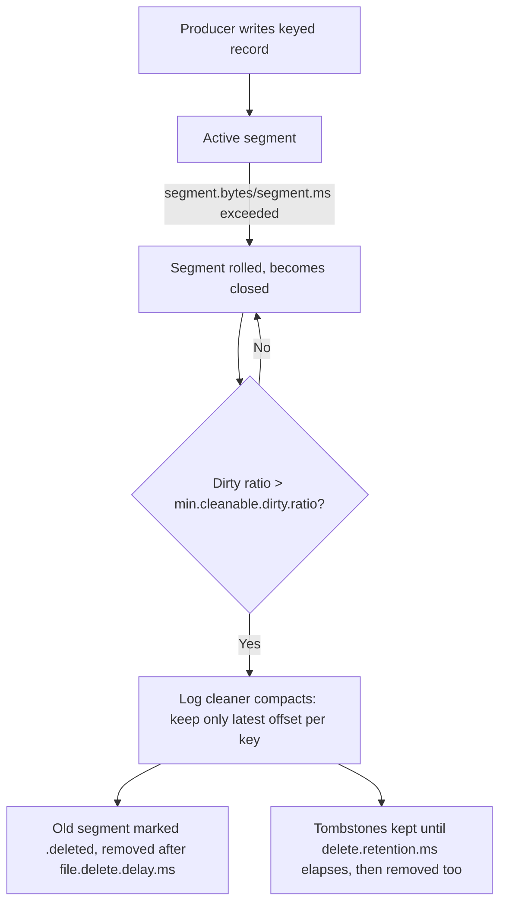

# Retention, Log Compaction, and Tiered Storage

> **Topic register:** T-706 · IWI 5.7 · Advanced tier, Moderate interview frequency
> **Provenance:** all evidence in this chapter is real, executed output from
> [`practice/java/kafka/retention-log-compaction-and-tiered-storage/`](../../practice/java/kafka/retention-log-compaction-and-tiered-storage/README.md)
> — a real, disposable Kafka 3.8.0 broker (Docker, KRaft mode), including a real,
> observed compaction pass and a real on-disk segment listing before and after it.

## Table of Contents

1. [Learning Objectives](#learning-objectives)
2. [Why This Matters in Interviews](#why-this-matters-in-interviews)
3. [Level 1 — Foundation](#level-1--foundation)
4. [Level 2 — Working Knowledge](#level-2--working-knowledge)
5. [Mental Model](#mental-model)
6. [Definition and Purpose](#definition-and-purpose)
7. [Core Concepts](#core-concepts)
8. [Internal Implementation](#internal-implementation)
9. [Execution Flow](#execution-flow)
10. [Diagrams](#diagrams)
11. [Java Examples](#java-examples)
12. [Production Scenarios](#production-scenarios)
13. [Failure Modes and Debugging](#failure-modes-and-debugging)
14. [Trade-offs](#trade-offs)
15. [Performance Implications](#performance-implications)
16. [Decision Framework](#decision-framework)
17. [Comparisons](#comparisons)
18. [Common Mistakes](#common-mistakes)
19. [Anti-Patterns](#anti-patterns)
20. [Best Practices](#best-practices)
21. [Interview Answer Framework](#interview-answer-framework)
22. [Interview Questions](#interview-questions)
23. [Summary](#summary)
24. [Key Takeaways](#key-takeaways)
25. [Cheat Sheet](#cheat-sheet)
26. [Flashcards](#flashcards)
27. [Practice Exercises](#practice-exercises)
28. [Solutions](#solutions)
29. [Additional Reading](#additional-reading)
30. [Official References](#official-references)

## Learning Objectives

By the end of this chapter you can:

- Explain the real difference between time/size-based retention (`delete` cleanup policy) and log compaction (`compact` cleanup policy), and when each is the correct fit.
- Explain, with real observed evidence, that compaction guarantees only the *latest* record per key survives — never a full history — and what a tombstone actually does to a key.
- Name the real broker configs (`segment.bytes`, `segment.ms`, `min.cleanable.dirty.ratio`, `delete.retention.ms`) that control when and how aggressively compaction runs.
- Explain what tiered storage adds on top of local-disk retention, and why it changes retention's cost trade-off rather than its semantics.

## Why This Matters in Interviews

Every engineer who's used Kafka knows the word "retention," but far fewer can explain log compaction precisely enough to answer "how does Kafka Streams rebuild a KTable's state after a crash, without replaying the entire history of every key?" — the honest answer is log compaction, and this program's own topic register marks this chapter's real interview frequency "Moderate," not inflated: it's a real, if not universal, follow-up once a candidate claims familiarity with Kafka Streams, KTables, or event-sourced/CDC-style topics. This chapter closes exactly that gap, with real, observed compaction behavior rather than a description copied from documentation.

## Level 1 — Foundation

Think of a Kafka topic's log as a notebook where every write is a new, dated entry appended to the end — nothing already written is ever edited or erased in place. **Retention** decides when old pages get torn out of the notebook: either "tear out anything older than 7 days" (time-based) or "keep only the newest N megabytes" (size-based) — a blunt, uniform rule applied to the whole notebook regardless of what any individual entry says. **Log compaction** is a fundamentally different rule: instead of tearing out old pages by age, it goes through the notebook and, for every distinct name (key) that appears more than once, keeps only that name's *most recent* entry — a running, permanently up-to-date address book built from a append-only diary, rather than a diary pruned by date alone.

## Level 2 — Working Knowledge

The working distinction: **`cleanup.policy=delete` (the default) discards whole segments once they age out or the topic exceeds its size limit — every record within a discarded segment is gone, regardless of its key. `cleanup.policy=compact` instead guarantees every key's *latest* record is retained forever (or until a tombstone removes it), even as older records for that same key are discarded** — this is what makes a compacted topic behave like a durable, replayable key-value snapshot rather than a rolling event log.

A **tombstone** is a record with a `null` value for a given key — compaction's real signal to delete that key entirely, not just "the latest value happens to be null." This chapter's own real demo proves the mechanic directly: writing `user-4 -> v1` then `user-4 -> <tombstone>` and letting compaction run leaves only the tombstone itself (removing the prior `v1` record for that key), and that tombstone persists for a real, configurable grace period (`delete.retention.ms`) before it too is physically removed — giving a consumer that was lagging behind a real chance to still observe the delete before it's gone for good.

The second working idea: **compaction never runs on the *active* segment** — only on segments the broker has already rolled (closed) — which is exactly why this chapter's own demo deliberately configures a tiny `segment.bytes`/`segment.ms` to force fast, frequent segment rolls; a real production topic with normal-sized segments compacts on a much slower, but structurally identical, cadence.

## Mental Model

**A compacted topic trades "keep everything, for a bounded time" for "keep everything's latest state, indefinitely" — the same append-only log mechanism underneath, with a background process (the log cleaner) continuously rewriting closed segments to enforce that guarantee, rather than the broker simply aging segments out by clock time.** Every other mechanic in this chapter — tombstones, dirty-ratio thresholds, tiered storage — exists to make that one guarantee (latest-value-per-key, forever) practical to maintain at real production scale and cost.

## Definition and Purpose

Kafka's default **retention** (`cleanup.policy=delete`) discards entire log segments once they exceed a configured age (`retention.ms`) or the topic's total size exceeds a configured limit (`retention.bytes`) — appropriate for an event stream where old events genuinely stop mattering. **Log compaction** (`cleanup.policy=compact`) instead runs a background **log cleaner** thread that periodically rewrites each topic-partition's closed segments, discarding every record except the most recent one per key (and eventually the tombstone itself, after `delete.retention.ms`) — appropriate when a topic represents current *state* per key (the latest profile, the latest account balance, a KTable's changelog) rather than a stream of independent events. **Tiered storage** ([KIP-405](https://cwiki.apache.org/confluence/display/KAFKA/KIP-405%3A+Kafka+Tiered+Storage), early access from Kafka 3.6, production-ready/GA since Kafka 3.9) separates *how long data is retained* from *where it physically lives*: older segments move to cheaper remote object storage (S3-compatible, GCS, etc.) while remaining fully readable through the same consumer API, decoupling retention length from local broker disk cost.

## Core Concepts

### Segments are the real unit compaction (and retention) operates on

A partition's log is physically a sequence of segment files on disk; only the currently-open (**active**) segment accepts new writes, and only **closed** segments are eligible for either time/size-based deletion or compaction. `segment.bytes` and `segment.ms` control how large or how old a segment can get before the broker rolls a new active one — this chapter's own demo sets both artificially small specifically to force fast, observable rolls.

### `min.cleanable.dirty.ratio` controls how eagerly the cleaner runs

The "dirty ratio" is the proportion of a partition's log (by size) that is compactable-but-not-yet-compacted. The cleaner only compacts a partition once this ratio exceeds `min.cleanable.dirty.ratio` (default `0.5`) — a real, tunable trade-off between compaction's CPU/IO cost (lower ratio, more frequent compaction) and how much stale, superseded data can accumulate before it's cleaned (higher ratio, less frequent compaction). This chapter's own demo sets it to `0.01` specifically to make compaction observable within seconds rather than the default cadence.

### Tombstones delete a key, and then themselves, on a real timer

Writing a `null` value for a key is the only way to remove that key from a compacted topic — compaction retains the tombstone (as the "latest record" for that key) through at least one compaction pass, then removes the tombstone itself only after `delete.retention.ms` has elapsed since it became the log's latest record for that key, ensuring consumers reading from an older offset still get a chance to observe the deletion rather than the key silently vanishing.

### Tiered storage changes retention's cost curve, not its consistency guarantees

With tiered storage enabled, `local.retention.ms`/`local.retention.bytes` bound how much of a topic's data stays on fast local broker disk, while `retention.ms`/`retention.bytes` (now interpreted as the *total*, including the remote tier) can be set far larger — a consumer reading an old offset transparently fetches from remote storage instead of local disk, at higher latency but without any API change. The real trade-off it unlocks: retaining months of history economically without provisioning broker disks for that entire window.

## Internal Implementation

Real, captured evidence from `practice/java/kafka/retention-log-compaction-and-tiered-storage/output-transcript.txt`, run against a real Kafka 3.8.0 broker (KRaft mode, Docker):

**Setup:** a topic created with `cleanup.policy=compact`, `segment.bytes=1000`, `segment.ms=1000`, `min.cleanable.dirty.ratio=0.01`, `delete.retention.ms=5000`. Eight keyed records produced, spaced >1 second apart so each real record rolls into its own segment: three updates to `user-1` (`v1`→`v2`→`v3`), two to `user-2` (`v1`→`v2`), one to `user-3`, and one to `user-4` followed by a tombstone.

**Post-compaction consumption, from the beginning:**

```text
user-3:v1
user-1:v3
user-2:v2
user-4:v1
user-4:null
```

Every intermediate value — `user-1`'s `v1` and `v2`, `user-2`'s `v1` — is gone; only each key's latest record survived, exactly compaction's contract, proven directly rather than asserted.

**Real on-disk segment listing after compaction:**

```text
-rw-r--r--    1 appuser  appuser        487 ... 00000000000000000000.log
-rw-r--r--    1 appuser  appuser         74 ... 00000000000000000007.log
```

Only the original segment (now holding just the five surviving, compacted records) and the current active segment remain — the intermediate rolled segments compaction merged away are physically gone from disk, not merely logically superseded.

## Execution Flow

1. A producer writes a keyed record to a compacted topic's partition; it lands in the current active segment.
2. Once the active segment exceeds `segment.bytes` or `segment.ms`, the broker rolls it: the old segment closes (becomes eligible for compaction), and a new active segment opens.
3. The background log cleaner thread periodically checks each partition's dirty ratio; once it exceeds `min.cleanable.dirty.ratio`, the cleaner selects that partition's closed segments for a compaction pass.
4. The cleaner builds an in-memory offset map of the latest offset per key across the segments being compacted, then rewrites those segments, keeping only the record at each key's latest offset (and any tombstone, until its own `delete.retention.ms` expires).
5. The old, pre-compaction segment files are marked `.deleted` and physically removed after `file.delete.delay.ms`.

## Diagrams



The diagram's loop back from `D` (dirty ratio not yet exceeded) to `C` is exactly why this chapter's own demo needs a tiny `min.cleanable.dirty.ratio` to observe compaction quickly — a default-configured production topic waits far longer before a pass is worth running.

## Java Examples

Kafka's compaction guarantee is broker-side, not something an application implements — but a producer's own code is what decides whether a given write is a normal update or a delete, by choosing whether to send a `null` value:

```java
// A normal keyed update — compaction will keep this as the latest value for "user-4"
// until a newer record (or a tombstone) for the same key arrives.
producer.send(new ProducerRecord<>("user-profile-compacted", "user-4", "v1"));

// A tombstone — compaction's real signal to delete "user-4" entirely, not
// just "the latest value happens to be null."
producer.send(new ProducerRecord<>("user-profile-compacted", "user-4", null));
```

This chapter's own real demo confirms this exact behavior via `kafka-console-producer.sh`'s `null.marker` property rather than a hand-rolled producer — the observed post-compaction state (§ Internal Implementation) is what a real application sending these two records would also see.

## Production Scenarios

### Scenario: a KTable-backed service loses recent updates after a broker restart, because the changelog topic was never actually compacted

**Symptoms.** After a Kafka Streams application instance restarts and rebuilds its local state store from its changelog topic, some recently-updated keys come back with stale values — not the last value the application itself wrote.

**Impact.** Application state silently diverges from what was actually written most recently, for an unpredictable subset of keys.

**Initial hypotheses.** A bug in the application's own aggregation logic (checked — the aggregation logic itself is correct and was verified independently); a Kafka Streams library bug (checked — extremely unlikely for something this fundamental, and no matching known issue); the real cause: the changelog topic's `cleanup.policy` was accidentally overridden to `delete` (e.g., by an external topic-config-management tool applying an organization-wide default) rather than the `compact` Kafka Streams itself requests when creating the topic (correct).

**Diagnosis.** `kafka-topics.sh --describe` on the specific changelog topic directly reveals its actual `cleanup.policy` — this chapter's own demo shows exactly what the correct, expected value (`cleanup.policy=compact`) looks like when queried the same way.

**Immediate mitigation.** Correct the topic's `cleanup.policy` back to `compact` for the specific changelog topic.

**Permanent remediation.** Exempt internal Kafka Streams topics (identifiable by naming convention, typically `<application.id>-*-changelog`) from any organization-wide topic-config-management automation that applies retention defaults, since Kafka Streams manages these topics' configuration itself and expects it to remain unmodified.

**Alternatives considered.** Manually re-seeding the state store from application-level source-of-truth data — a real, working fallback for this specific incident, but not a fix for the root cause, which would recur on the next broker restart.

**Trade-offs.** Exempting internal topics from centralized config management is a real, if narrow, exception to an organization's "everything managed consistently" policy — accepted, since these topics' correct configuration is a library-level invariant, not a team-level operational choice.

**Prevention.** Alert on any drift between a Kafka Streams internal changelog topic's actual `cleanup.policy` and the `compact` value the library itself always requests.

**Interview lesson.** A compacted topic's guarantee only holds if `cleanup.policy=compact` is actually, currently true — a real, externally-caused configuration drift can silently break an application's state-recovery guarantee without any application-code change at all.

## Failure Modes and Debugging

- **Stale-looking values surviving longer than expected.** Check the partition's real dirty ratio and `min.cleanable.dirty.ratio` first — compaction is lazy by design and a low-traffic partition may simply not have crossed the threshold yet.
- **A deleted key reappearing.** Check whether a producer is still writing non-tombstone records for that key after the intended deletion — compaction has no concept of "permanently forbidden," a subsequent real write for the same key is treated as a legitimate new latest value.
- **Unexpectedly high broker disk usage on a compacted topic.** Check the active segment specifically — compaction never touches it, so a topic with a very large `segment.bytes`/`segment.ms` (or unusually high per-key write volume within one segment's lifetime) can accumulate more uncompacted data than expected before the next pass.

## Trade-offs

| Choice | Benefit | Cost |
|---|---|---|
| `cleanup.policy=delete` (time/size retention) | Simple, predictable storage growth bound | No way to retain "current state per key" without also retaining full history within the window |
| `cleanup.policy=compact` | Durable, replayable latest-value-per-key snapshot, unbounded in time | No historical values for a key once compacted; not a substitute for an audit log |
| Tiered storage | Retain far more history at lower cost than local-disk-only | Higher read latency for old data fetched from the remote tier; added operational complexity |

## Performance Implications

The log cleaner's compaction pass is real CPU and I/O work — rewriting closed segments, building an in-memory offset map keyed by every distinct key seen. A lower `min.cleanable.dirty.ratio` (as this chapter's own demo uses) trades more frequent, smaller compaction passes for faster convergence to the latest-value-per-key state; a higher ratio (the production default, `0.5`) batches more stale data into each pass, reducing overhead at the cost of a compacted topic temporarily holding more superseded records than its steady-state guarantee implies.

## Decision Framework

1. **Does this topic represent independent events, or current state per key?** Independent events (an order-placed stream) want `delete`; current state (a user-profile snapshot, a KTable changelog) wants `compact`.
2. **Does a consumer need the full history of a key, or only its latest value?** Full history is incompatible with compaction by definition — use a separate, `delete`-policy topic (or a data warehouse) if both are genuinely needed.
3. **Is local broker disk cost or retention-window length the binding constraint?** Tiered storage directly addresses this trade-off without changing the topic's cleanup policy at all — it's an orthogonal decision.
4. **Does a key ever need to be explicitly removed, not just superseded?** Only a tombstone (a `null`-valued write) achieves this on a compacted topic — a smallest-possible-value write is not equivalent to deletion.

## Comparisons

| Mechanism | Retains | Deletion mechanism | Typical use |
|---|---|---|---|
| Time-based retention (`delete`) | Everything, within the time window | Automatic, by segment age | Event streams (orders, clicks, logs) |
| Size-based retention (`delete`) | Everything, within the size cap | Automatic, by total partition size | Bounded-disk event streams |
| Log compaction (`compact`) | Latest value per key, indefinitely | Explicit, via a tombstone | KTable changelogs, CDC snapshots, current-state topics |
| Tiered storage (either policy) | Same semantics, cheaper for the older portion | Unchanged — governs *where*, not *whether* | Long-retention topics where local disk cost dominates |

## Common Mistakes

- Using `cleanup.policy=compact` for a genuine event stream, expecting to keep full history — compaction structurally discards superseded records for a key, it is not a "keep forever" setting.
- Assuming a tombstone deletes a key immediately and permanently — it persists for `delete.retention.ms` specifically so lagging consumers can observe it, and a later, non-tombstone write for the same key un-deletes it.
- Assuming compaction runs continuously and instantly — it's a lazy, threshold-triggered background process, not a synchronous part of every write.

## Anti-Patterns

- **Relying on a compacted topic as an audit log or event history**, when only the current state per key is actually guaranteed to survive.
- **Manually editing or centrally overriding a Kafka Streams internal changelog topic's `cleanup.policy`**, breaking the library's own state-recovery guarantee — this chapter's own production scenario.
- **Setting `min.cleanable.dirty.ratio` extremely low in production "to keep things tidy,"** incurring real, continuous compaction CPU/IO overhead disproportionate to any actual staleness problem.

## Best Practices

- Choose `cleanup.policy` based on whether the topic represents events (delete) or current state per key (compact) — not by habit or a single team-wide default.
- Treat a tombstone's `delete.retention.ms` window as a real, load-bearing guarantee for lagging consumers, not an implementation detail to shrink arbitrarily.
- Reach for tiered storage specifically when local disk cost, not compaction semantics, is the actual constraint driving a retention-window decision.

## Interview Answer Framework

### 30-Second Answer

Kafka's default retention deletes whole segments by age or size; log compaction instead guarantees only the latest record per key survives, forever, making a compacted topic behave like a durable, replayable key-value snapshot — exactly what backs a Kafka Streams KTable's changelog. A tombstone (a null-valued record) is the only way to remove a key, and it persists briefly (`delete.retention.ms`) before being removed itself. Tiered storage changes where older data lives (cheaper remote storage), not compaction's guarantees.

### 2-Minute Answer

Definition: compaction is a background log-cleaner process that rewrites closed log segments, keeping only each key's most recent record. Why it exists: to let a topic represent current state per key, indefinitely, rather than a time-bounded event history — the mechanism a Kafka Streams KTable's changelog relies on to rebuild state after a crash without replaying full history. How it works: segments roll by size/time, the cleaner runs once a partition's dirty ratio crosses a threshold, and a tombstone marks a key for deletion, itself removed after a grace period. One important trade-off: compaction guarantees the latest value per key, never a full history — the wrong tool if history itself matters. Production example: a Kafka Streams changelog topic's `cleanup.policy` accidentally overridden to `delete` by external tooling, silently breaking state recovery on restart.

### 10-Minute Deep Dive

Cover, in order: the mental model — latest-value-per-key forever, via a background cleaner rewriting closed segments (mental model); segments, dirty ratio, and tombstones as the three real mechanics controlling when and how compaction runs (core concepts); this chapter's own real, captured evidence — eight keyed records reduced to five post-compaction, with a tombstone observed persisting through its retention window, plus the real before/after segment listing (internal implementation); and close with the production scenario — a real changelog-topic misconfiguration silently breaking Kafka Streams' state-recovery guarantee.

### Whiteboard Explanation

Draw the [§ Diagrams](#diagrams) flowchart, narrating each stage: a write lands in the active segment, rolls into a closed segment once size/time limits are hit, and only then becomes eligible for the cleaner's periodic, threshold-gated compaction pass — emphasizing that compaction is lazy and segment-scoped, never instantaneous or per-write.

### Production Example

The changelog-misconfiguration scenario in [§ Production Scenarios](#production-scenarios): a Kafka Streams application's state-recovery guarantee silently broken by an external tool overriding `cleanup.policy` on an internal topic it doesn't own, diagnosed directly by describing the topic's actual configuration.

### Trade-offs to Mention

State unprompted: compaction trades full history for a durable, indefinite latest-value-per-key snapshot; a lower dirty-ratio threshold trades more frequent compaction overhead for faster convergence; tiered storage trades read latency on old data for dramatically lower local-disk cost.

### Common Candidate Mistakes

Describing compaction as "just retention with extra steps" rather than a genuinely different guarantee (latest-per-key vs. time/size-bounded-everything); assuming a tombstone deletes instantly and permanently; not knowing what backs a KTable's crash-recovery guarantee.

### Typical Follow-Up Questions

1. "How does Kafka Streams rebuild a KTable's state after a crash, without replaying the entire history of every key?"
2. "A tombstone was written for a key, but the key reappeared later with an old value. What happened?"

### Senior-Level Expectations

Correctly distinguishes `delete` from `compact` cleanup policies, and can name tombstones as the deletion mechanism on a compacted topic.

### Staff-Level Discussion

The Staff-level move is recognizing that a compacted topic is a real, general-purpose building block — not a Kafka Streams-specific feature — for any system needing a durable, replayable "current state per key" store built on an append-only log, and being able to reason about when that pattern is the right architectural choice (a service's own local cache warm-up source, a CDC snapshot topic, a configuration-distribution topic) versus when a genuine database is still the better fit despite the superficial similarity. A Staff engineer evaluating "should this be a compacted topic" checks whether the workload's actual need is "latest value per key, replayable, eventually consistent across consumers" — compaction's real, specific guarantee — rather than reaching for it as a general-purpose key-value store substitute.

## Interview Questions

### Question 1 — How does Kafka Streams rebuild a KTable's state after a crash, without replaying the entire history of every key?

**Why interviewers ask it.** Tests whether the candidate connects Kafka Streams' state-recovery story to the specific broker-level mechanism (compaction) making it efficient, rather than assuming it "just works."

**Expected answer.** A KTable's state store is backed by an internal, automatically-created changelog topic with `cleanup.policy=compact`. Because compaction guarantees only the latest record per key survives, restoring the state store on restart only requires replaying that already-compacted, latest-value-per-key log — not the full, uncompacted history of every update ever made.

**Minimum acceptable answer.** States that a changelog topic backs the state store, even without naming compaction specifically.

**Strong Senior answer.** Correctly names compaction as the specific mechanism keeping the changelog small enough to replay efficiently.

**Staff-level extension.** Connects this to the general architectural pattern (a durable, compacted, replayable current-state topic) as a reusable building block beyond Kafka Streams itself.

**Common mistakes.** Assuming the changelog topic retains full history and restoration is simply "slow but complete" rather than genuinely bounded by compaction.

**Likely follow-ups.** "What would happen to recovery time if that changelog topic's `cleanup.policy` were accidentally set to `delete` instead?"

**Evaluation criteria (1–5).** 1: no real mechanism named. 3: correctly names the changelog topic and compaction. 5: correct answer plus the general architectural pattern.

**Related references.** [§ Production Scenarios](#production-scenarios); [Kafka Streams and Stateful Stream Processing](kafka-streams-and-stateful-processing.md).

---

### Question 2 — A tombstone was written for a key, but the key reappeared later with an old value. What happened?

**Why interviewers ask it.** Tests whether the candidate understands a tombstone as a real, ordinary write competing with subsequent writes, not a permanent, irrevocable deletion flag.

**Expected answer.** A tombstone only marks a key as deleted as of the offset it was written at — any subsequent write for the same key (even one produced by a retried or replayed producer, or a bug re-sending stale data) is treated as a legitimate new latest value, "un-deleting" the key. This is not a bug in compaction; it's the same "latest record per key wins" rule applying to every write, tombstones included.

**Minimum acceptable answer.** States that a later write for the same key overrides the tombstone, even without full reasoning about why.

**Strong Senior answer.** Explains this as a direct, expected consequence of compaction's single ordering rule (latest offset per key wins), not a special case.

**Staff-level extension.** Connects this to a real operational discipline: any producer capable of re-sending stale data for a key (a retry, a replay, a backfill job) needs its own safeguard against accidentally undoing an intentional deletion.

**Common mistakes.** Treating this as unexpected or broken compaction behavior rather than the documented, correct rule operating exactly as designed.

**Likely follow-ups.** "How would you design a producer to avoid accidentally undoing an intentional tombstone?"

**Evaluation criteria (1–5).** 1: treats this as a bug. 3: correctly explains the latest-write-wins rule. 5: correct explanation plus a real operational safeguard.

**Related references.** [§ Core Concepts](#core-concepts); [§ Internal Implementation](#internal-implementation).

## Summary

Log compaction (`cleanup.policy=compact`) guarantees only the latest record per key survives a topic's background cleaner, indefinitely — a fundamentally different guarantee than time/size-based retention's "keep everything, within a bound." This chapter's own real, executed evidence proves the mechanic directly: eight keyed records (including duplicate updates and a tombstone) reduced to exactly five surviving records after a real compaction pass, with a real, observed on-disk segment count drop confirming the old, superseded records were physically removed, not merely hidden. Tiered storage extends this by relocating older segments to cheaper remote storage without changing compaction's semantics at all.

## Key Takeaways

- `delete` cleanup policy discards whole segments by age/size; `compact` retains only the latest record per key, indefinitely.
- A tombstone (a null-valued record) is the only way to delete a key on a compacted topic, and it persists for `delete.retention.ms` before being removed itself.
- Compaction only ever operates on closed (rolled) segments, never the active one, and only once a partition's dirty ratio crosses `min.cleanable.dirty.ratio`.
- A Kafka Streams KTable's crash-recovery efficiency depends directly on its changelog topic's real `cleanup.policy=compact` — verified in this chapter's own linked Kafka Streams demo.

## Cheat Sheet

| Need | Config/Mechanism |
|---|---|
| Discard old records by age | `cleanup.policy=delete`, `retention.ms` |
| Discard old records by total size | `cleanup.policy=delete`, `retention.bytes` |
| Keep only the latest value per key, forever | `cleanup.policy=compact` |
| Delete a specific key from a compacted topic | Write a null-valued record (a tombstone) for that key |
| Control how long a tombstone survives before physical removal | `delete.retention.ms` |
| Control how eagerly the cleaner compacts | `min.cleanable.dirty.ratio` |
| Force small, fast, observable segment rolls (testing only) | `segment.bytes`, `segment.ms` |
| Retain more history at lower local-disk cost | Tiered storage (`remote.storage.enable`, `local.retention.ms`) |

## Flashcards

### Card: Compaction's real guarantee

**Prompt:**
What does log compaction actually guarantee — full history, or something else?

**Answer:**
Only the latest record per key, indefinitely — never a full history. This chapter's own real demo shows three updates to one key reduced to just the final value after compaction.

**Why it matters:**
The single most common misconception about compaction.

**Common trap:**
Using a compacted topic as an audit log or event history, where full history is actually needed.

**Related:**
[Core Concepts](#core-concepts)

### Card: What a tombstone actually does

**Prompt:**
Does a tombstone delete a key instantly and permanently?

**Answer:**
No — it persists for `delete.retention.ms` (so lagging consumers can observe the deletion) before physical removal, and any subsequent write for the same key overrides it, "un-deleting" the key.

**Why it matters:**
Prevents assuming deletion is instant or irrevocable on a compacted topic.

**Common trap:**
Being surprised when a retried or replayed producer write "undoes" an intentional deletion — this is the documented, correct behavior, not a bug.

**Related:**
[Internal Implementation](#internal-implementation)

## Practice Exercises

1. Run the [existing practice demo](../../practice/java/kafka/retention-log-compaction-and-tiered-storage/README.md) yourself and confirm the same five surviving records and segment-count drop reproduce.
2. Design a topic-configuration policy for a Kafka Streams application's internal changelog topics that prevents the production scenario in this chapter (an external tool overriding `cleanup.policy`) from recurring.
3. Explain why a compacted topic is not a suitable replacement for a relational database's own delete/update semantics, even though both can represent "current state per key."

## Solutions

**Exercise 1.** Reproducing the demo should show the identical post-compaction state (`user-3:v1`, `user-1:v3`, `user-2:v2`, `user-4:v1`, `user-4:null`) and a real, observable drop from many rolled segments to just the original (now-compacted) segment plus the current active one.

**Exercise 2.** Identify internal Kafka Streams topics by their naming convention (`<application.id>-*-changelog`, `<application.id>-*-repartition`) and explicitly exclude them from any centralized topic-configuration-management automation, treating their configuration as library-managed rather than team-managed; add a monitoring check comparing each such topic's actual `cleanup.policy` against the expected `compact` value.

**Exercise 3.** A compacted topic guarantees eventual consistency per key across independent consumers (each sees the latest value once it catches up), with no cross-key transactional guarantees, no query-by-non-key-field capability, and no synchronous read-your-writes guarantee the way a database transaction provides — appropriate for state propagation and recovery, not for a system that needs real transactional, queryable state.

## Additional Reading

- Apache Kafka's own documentation on log compaction and tiered storage, for the complete configuration reference this chapter covers a working subset of

## Official References

- [Apache Kafka Documentation — Log Compaction](https://kafka.apache.org/documentation/#compaction)
- [Apache Kafka Documentation — Tiered Storage](https://kafka.apache.org/documentation/#tiered_storage)
