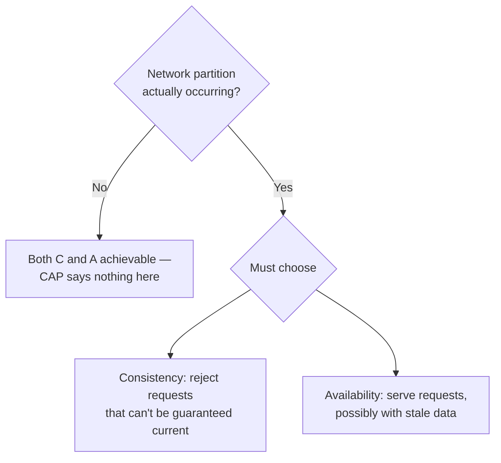

# CAP Theorem and Consistency Models

> **Topic register:** T-807 · IWI 7.90 (#15 tied of 198) · Advanced tier · High interview frequency [H] in system design rounds
> **The interviewer is checking for application, not recitation:** a candidate who states the formal definitions correctly but can't say which specific user-facing behavior changes has memorized the theorem without being able to apply it to a design decision.

## Table of Contents

1. [Learning Objectives](#learning-objectives)
2. [Why This Matters in Interviews](#why-this-matters-in-interviews)
3. [Level 1 — Foundation](#level-1--foundation)
4. [Level 2 — Working Knowledge](#level-2--working-knowledge)
5. [Mental Model](#mental-model)
6. [Definition and Purpose](#definition-and-purpose)
7. [Core Concepts](#core-concepts)
8. [Diagrams](#diagrams)
9. [Production Scenarios](#production-scenarios)
10. [Trade-offs](#trade-offs)
11. [Decision Framework](#decision-framework)
12. [Comparisons](#comparisons)
13. [Common Mistakes](#common-mistakes)
14. [Anti-Patterns](#anti-patterns)
15. [Best Practices](#best-practices)
16. [Interview Answer Framework](#interview-answer-framework)
17. [Interview Questions](#interview-questions)
18. [Summary](#summary)
19. [Key Takeaways](#key-takeaways)
20. [Cheat Sheet](#cheat-sheet)
21. [Flashcards](#flashcards)
22. [Practice Exercises](#practice-exercises)
23. [Solutions](#solutions)
24. [Additional Reading](#additional-reading)
25. [Official References](#official-references)

---

## Learning Objectives

By the end of this chapter you can:

- State precisely when CAP applies — during an actual network partition, not as a permanent, always-active trade-off.
- Classify a real or hypothetical system as CP or AP and name the specific guarantee it relaxes, in user-facing terms.
- Explain eventual vs. strong consistency in terms of what a user actually experiences, not just the formal definition.
- Partition consistency requirements by data type within a single system, rather than applying one model uniformly.

## Why This Matters in Interviews

CAP is one of the most commonly *recited* and least commonly *applied* topics in system design interviews — nearly every candidate can state "consistency, availability, partition tolerance, pick two," and that recitation is precisely what fails to differentiate a Senior from a Staff answer. The interviewer is checking whether the candidate can tie the abstract theorem to a specific, real system and a specific, user-visible consequence — which is a fundamentally different skill than memorizing the theorem's statement.

## Level 1 — Foundation

Imagine two branches of the same library, in different cities, that normally sync their catalog with each other constantly. One day, the connection between them goes down — a **network partition**. A patron walks into Branch A and asks to check out a book. Branch A now faces a real choice: refuse the checkout because it can't confirm with Branch B whether the book is already checked out somewhere else (**consistency** — safe, but the patron is turned away), or let the checkout happen anyway, accepting the small risk that Branch B might have already lent the same title to someone else (**availability** — the patron is served, but the two branches' records might briefly disagree). **CAP** is just the observation that during that actual outage, a branch has to pick one of these two options — it can't guarantee both "never wrong" and "always open" at the same time.

The key detail most people miss: this choice only matters *while the connection is actually down*. The moment the two branches can talk to each other again, there's no more dilemma — they sync up and both goals are achievable again. CAP isn't a permanent tax paid every day; it's a question that only comes up during the (hopefully rare) moments things are actually broken.

## Level 2 — Working Knowledge

At this level you should be able to answer a CAP question the way an interviewer actually wants it answered: never with the bare phrase "consistency, availability, partition tolerance, pick two," but by naming a real or realistic system, saying whether it leans CP or AP, and stating precisely what a user would experience as a result. For example: a session store during a partition should almost always choose availability — a user should never get logged out because of a brief network blip between data centers — accepting that a profile change made on one side might not show up on the other side for a little while.

You should also be comfortable with the more sophisticated, working-level insight that a single system usually shouldn't apply one consistency model to everything it stores. An e-commerce platform is a good example to reach for: inventory counts genuinely need strong consistency (overselling a sold-out item is a real, costly mistake), while a "recently viewed products" list can be eventually consistent without anyone ever noticing or caring. Practically, when reviewing or designing a system, ask "does every piece of data in here actually need the same consistency guarantee?" rather than picking one database consistency setting for the whole system and calling it done.

## Mental Model

**CAP is not a permanent tax — it's a question that only gets asked when the network actually breaks.** Outside of a partition, a well-designed system can be both consistent and available; CAP has nothing to say in that case. The moment a partition genuinely occurs, the system must answer one question: does the partitioned-off side keep serving requests (possibly stale) or refuse them (possibly unavailable)? Every real system has already answered this question, explicitly or by accident — CAP just names the two possible answers and insists that "we've never thought about it" isn't a third one.

## Definition and Purpose

**CAP** states that a distributed system, during an actual network partition, must choose between **Consistency** (every read sees the most recent write, or an error) and **Availability** (every request receives a non-error response, possibly with stale data) — it cannot have both while the partition lasts. Outside of a partition, a well-designed system can be both consistent and available; CAP is specifically a statement about the partition case, not a permanent, always-active trade-off. It exists to correct a naive intuition that a distributed system can simply be "consistent and available" as a permanent design goal, full stop — forcing the honest question: when the network genuinely fails to deliver a message between two nodes (not "if" — this happens in every real distributed system eventually), which guarantee does this specific system relax?

## Core Concepts

### What a system actually gives up during a partition

A **CP** system (e.g., a strongly consistent configuration store like `etcd` or `ZooKeeper`) refuses to serve a read or accept a write on the minority side of a partition, returning an error rather than risk returning stale or conflicting data. What it gives up: availability, specifically for the partitioned-off minority. An **AP** system (e.g., DNS, or a shopping cart service designed to always accept an "add to cart") continues to serve reads and writes on both sides of a partition, accepting that the two sides may now disagree and will need to be reconciled once the partition heals. What it gives up: consistency, specifically the guarantee that a read reflects the most recent write from the other side.

**The Staff-level answer to "what does your system give up" is never "it depends" in the abstract** — it names the actual system and the actual guarantee relaxed. Applied to a session store: during a partition, the system chooses availability — a user should never be logged out because of a network blip between data centers — accepting that a session update made on one side might not be visible on the other side until the partition heals. The specific, nameable thing given up: a session attribute changed on side A (e.g., "user upgraded to premium") may not be visible to a request served from side B until reconciliation completes.

### Eventual vs. strong consistency, for the user

**Strong consistency**, from the user's perspective: "the moment I make a change, every subsequent read — from me or anyone else, from any replica — reflects it." No stale reads, ever, at the cost of higher write latency (the write must propagate/confirm before being acknowledged) and reduced availability during a partition.

**Eventual consistency**, from the user's perspective: "the moment I make a change, *I* might not see it reflected immediately if my next read happens to hit a different replica, and neither might anyone else — but it will converge eventually." This is invisible and irrelevant for a "likes" counter; it is very visible and consequential for "did my payment go through" — a user re-submitting because they didn't see confirmation is a direct, costly, real-world failure mode connecting straight back to [idempotency](../11-system-design/idempotency.md).

## Diagrams

## Production Scenarios

### Scenario: a strongly-consistent configuration store causes a full regional outage during a network blip

**Symptoms.** A brief (under one minute) network partition between two data centers causes a service-discovery/configuration lookup to start failing entirely in the minority-side data center, taking down every service that depends on it there, even though the underlying application services themselves were healthy.

**Impact.** A full regional outage triggered by a transient network issue, disproportionate to the triggering event's actual duration.

**Initial hypotheses.** An application-level bug (checked — application services report healthy, only configuration lookups fail); a broader infrastructure failure (checked — only the configuration store's cross-region replication was affected); the configuration store's CP design correctly refusing to serve potentially-stale data (correct, and by design).

**Evidence.** The configuration store's own logs show it correctly detected the partition and refused reads/writes on the minority side, exactly as its CP design specifies; the regional outage was a direct, intended consequence of that refusal, not a malfunction.

**Diagnosis.** The configuration store is, correctly, a CP system — during the partition, it chose consistency over availability, refusing to risk serving stale configuration. The outage is not a bug in the configuration store; it's the system working exactly as designed, applied to a use case (regional service availability) where the cost of that design choice was higher than the team had explicitly accounted for.

**Immediate mitigation.** None needed at the configuration-store level — the partition healed within the minute, and the store correctly resumed serving once consistency could be guaranteed again.

**Permanent remediation.** Add a bounded, explicitly-stale local cache of the last-known-good configuration for services that can tolerate briefly stale configuration during a partition, so a transient network blip doesn't cascade into a full regional outage for services where staleness is an acceptable trade for availability — without changing the configuration store's own CP guarantee for the services that genuinely need it.

**Alternatives considered.** Switching the configuration store itself to an AP model — rejected, since some consumers (security policy configuration, for instance) genuinely need the consistency guarantee and cannot tolerate stale reads.

**Trade-offs.** The local fallback cache means those specific services could briefly operate on stale configuration during a partition — accepted for services where that's tolerable, explicitly not applied to services where it isn't.

**Prevention.** Any dependency on a CP system should be reviewed for whether every consumer genuinely needs the consistency guarantee, or whether some consumers would be better served by a bounded-staleness fallback — exactly the "different data warrants different consistency models" lesson, applied at the level of consumers of a shared store rather than data within one system.

**Interview lesson.** This is the "what does your system give up during a partition" interview question (§ Interview Questions Q1) arriving as a real incident — and the honest diagnosis is that the system behaved correctly by its own design; the gap was in not having explicitly decided, per consumer, whether that design's cost was acceptable everywhere it was applied.

## Trade-offs

| Choice during partition | User-facing consequence | When it's the right call |
|---|---|---|
| CP (consistency) | Some requests fail outright during the partition | Financial ledgers, inventory counts where overselling is worse than unavailability, configuration/coordination stores |
| AP (availability) | Requests succeed but may return stale data | Social feeds, session stores, shopping carts, anything where staleness is more tolerable than an error |

## Decision Framework

1. **Is a network partition actually occurring, or is this a general design question?** CAP applies specifically to the partition case — outside of one, both consistency and availability are achievable and the question doesn't apply.
2. **For this specific data, what's worse: an error, or stale data?** If an error is worse (a session store, a shopping cart), lean AP. If stale/conflicting data is worse (a ledger, an inventory count where overselling is real damage), lean CP.
3. **Does this system have one consistency model applied uniformly, or does different data warrant different models?** Assess per data type — inventory counts and a "recently viewed" list within the same e-commerce system legitimately warrant different answers.
4. **What does the user actually experience under each choice?** State it concretely (e.g., "a session update on one side isn't visible on the other until reconciliation"), not as an abstract restatement of the theorem.

## Comparisons

| System type | Example | What it gives up during a partition |
|---|---|---|
| CP | `etcd`, `ZooKeeper`, a strongly consistent configuration store | Availability on the partitioned-off minority side |
| AP | DNS, a shopping-cart "add to cart" service, a session store prioritizing uptime | Consistency — the two sides may disagree until reconciliation |

## Common Mistakes

- Treating CAP as an always-active, permanent trade-off rather than a statement specifically about partition behavior.
- Answering the "what does your system give up" question in the abstract, without naming an actual system or actual user-facing consequence.
- Assuming eventual consistency is uniformly acceptable across an entire system rather than assessing it per data type.

## Anti-Patterns

- **Reciting "pick two" without ever connecting it to a real system or a real user experience** — the single most common way this topic fails to demonstrate Senior/Staff signal.
- **Applying one consistency model to an entire system** rather than assessing staleness tolerance per data type, exactly the caching-strategy mistake this chapter's Staff-level discussion connects to directly.
- **Treating a CP system's partition-time unavailability as a bug** rather than recognizing it as the system's design working exactly as intended — the real question is whether that design choice was deliberately made for every consumer relying on it.

## Best Practices

- Always answer CAP questions by naming a specific system and a specific, user-facing consequence — never the abstract theorem alone.
- Assess consistency requirements per data type within a system, not as one uniform system-wide policy.
- When depending on a CP system, explicitly evaluate whether every consumer genuinely needs the consistency guarantee, or whether some would be better served by a bounded-staleness fallback.
- Connect eventual-consistency staleness windows to their concrete user-facing cost — explicitly naming cases like "payment confirmation" where a user's own retry behavior compounds the problem.

## Interview Answer Framework

### 30-Second Answer

CAP says a distributed system, during an actual network partition, must choose between consistency (reject requests it can't guarantee are current) and availability (serve requests, possibly with stale data). It only applies during a partition — outside one, both are achievable. The good answer names a real system and the specific thing it gives up, not the abstract theorem.

### 2-Minute Answer

Definition: during a genuine network partition, a system must choose to refuse some requests (consistency) or serve possibly-stale data (availability) — it can't do both for the affected nodes. Why it exists: to correct the naive assumption that a system can just be "consistent and available" always, forcing an explicit answer to what happens when the network actually fails. How it works: a CP system like `etcd` refuses reads/writes on the minority side; an AP system like a shopping cart keeps serving both sides and reconciles later. One important trade-off: eventual consistency's staleness window is invisible for a likes counter and consequential for a payment confirmation. Production example: a CP configuration store correctly refusing reads during a brief partition, causing a disproportionate regional outage — not a bug, but a design choice whose cost wasn't explicitly evaluated for every consumer depending on it.

### Whiteboard Explanation

Draw the [§ Diagrams](#diagrams) decision tree: "partition occurring?" branching to "both achievable, CAP says nothing" on the no side, and "must choose C or A" on the yes side. Then, next to the C and A boxes, write one concrete example system under each (e.g., `etcd` under C, a shopping cart under A) and one sentence of what a user of that system actually experiences — this is what turns the abstract diagram into the answer interviewers are actually checking for.

### Production Example

The CP-configuration-store outage in [§ Production Scenarios](#production-scenarios): a strongly-consistent config store correctly refused to serve potentially-stale reads during a brief partition, causing a full regional outage for every dependent service — the system behaved exactly as its CP design specifies; the gap was not evaluating whether every consumer actually needed that guarantee.

### Trade-offs to Mention

State unprompted: CAP applies specifically during a partition, not as a permanent trade-off; the good answer names a real system and a concrete user-facing consequence; different data within the same system legitimately warrants different consistency models.

### Common Candidate Mistakes

Reciting "consistency, availability, partition tolerance, pick two" without naming what a real system actually does; giving the formal definition of eventual consistency without connecting it to user experience; assuming one consistency model must apply system-wide.

### Typical Follow-Up Questions

1. "What would the user actually see during this trade-off?"
2. "Give one example where eventual consistency is clearly fine, and one where it clearly isn't."
3. "Should this entire system use one consistency model, or different models for different data?"

### Senior-Level Expectations

Correctly classifies a real or hypothetical system as CP or AP; gives the correct formal distinction between eventual and strong consistency.

### Staff-Level Discussion

The most sophisticated version of this topic isn't picking CP or AP for an entire system — it's recognizing that **different data within the same system legitimately warrants different consistency models**, exactly mirroring the "partition by staleness tolerance" lesson from [caching strategy](../11-system-design/caching-strategies-and-invalidation.md). A well-designed e-commerce system is strongly consistent about inventory counts (overselling is a real, costly failure) while being eventually consistent about a "recently viewed" list (staleness there is imperceptible) — treating the whole system as needing one uniform consistency model is the mistake this discussion exists to correct.

## Interview Questions

### Question 1 — CAP: what does a system actually give up during a partition? Be specific about your own system.

**Why interviewers ask it.** Directly tests whether the candidate can apply the theorem to a concrete system rather than reciting it.

**Expected answer.** Name the actual system, state whether it's CP or AP, and name the *specific* guarantee relaxed (e.g., "a session update on one side isn't visible on the other until reconciliation"), not an abstract restatement of the theorem.

**Minimum acceptable answer.** States the abstract theorem correctly, even without a concrete example.

**Strong Senior answer.** Correctly classifies a real or hypothetical system as CP or AP.

**Staff-level extension.** Ties the classification to a specific, user-visible consequence, as in the session-store example in this chapter.

**Common mistakes.** Reciting "consistency, availability, partition tolerance, pick two" without ever naming what a real system actually does or what a user actually experiences.

**Likely follow-ups.** "What would the user actually see during this trade-off?"

**Evaluation criteria (1–5).** 1: recites the theorem only. 3: correctly classifies a real system as CP or AP. 5: classification plus a specific, user-visible consequence named.

**Related references.** [§ Core Concepts](#core-concepts); [§ Production Scenarios](#production-scenarios).

---

### Question 2 — What is the difference between eventual and strong consistency for the user?

**Why interviewers ask it.** Tests whether the candidate connects the formal definition to actual user experience, the entire point of asking this in a design context rather than a definitions quiz.

**Expected answer.** Strong consistency means no stale reads ever, at a latency/availability cost; eventual consistency means a possible temporary staleness window, invisible for low-stakes data and consequential for high-stakes data (e.g., payment confirmation).

**Minimum acceptable answer.** Gives the formal definition correctly, even without the user-facing framing.

**Strong Senior answer.** Gives the correct formal distinction.

**Staff-level extension.** Produces both example types unprompted (a case where eventual consistency is clearly fine, and one where it clearly isn't) and explicitly connects the "payment didn't appear to go through" case to the idempotency mechanism.

**Common mistakes.** Giving the formal definition without connecting it to what the user actually experiences.

**Likely follow-ups.** "Give one example where eventual consistency is clearly fine, and one where it clearly isn't."

**Evaluation criteria (1–5).** 1: formal definition only, no application. 3: formal definition plus one connected example. 5: both example types plus the explicit idempotency connection.

**Related references.** [§ Core Concepts](#core-concepts); [Idempotency at System Edges](../11-system-design/idempotency.md).

## Summary

CAP is a statement about partition behavior specifically, not a permanent trade-off — during a real network partition, a system must choose to reject some requests (consistency) or serve possibly-stale data (availability). The Staff-level answer names the actual system and the actual user-facing consequence, not the abstract theorem. Eventual vs. strong consistency should be assessed per data type within a system, not applied uniformly.

## Key Takeaways

- CAP applies specifically during an actual partition — outside of one, both C and A are achievable.
- A good answer names a real system, classifies it CP or AP, and states the specific guarantee given up.
- Eventual consistency's acceptability depends entirely on the specific data's staleness tolerance — invisible for a like-count, consequential for a payment confirmation.
- Different data within one system can and should have different consistency models.

## Cheat Sheet

| Data type | Right choice | Why |
|---|---|---|
| Financial ledger, inventory count | CP | Overselling/incorrect balance is worse than an error |
| Configuration/coordination store | CP | Stale configuration can cause worse downstream failures than unavailability |
| Session store, shopping cart | AP | A user being logged out or unable to add to cart is worse than brief staleness |
| Social feed, "recently viewed" list | AP | Staleness is imperceptible; an error is a worse user experience |

## Flashcards

### Card: When CAP applies

**Prompt:**
Does CAP apply outside of an actual network partition?

**Answer:**
No — CAP is specifically a statement about partition behavior; both C and A are achievable when no partition is occurring.

**Why it matters:**
Prevents treating CAP as a permanent, always-active trade-off.

**Common trap:**
Discussing CAP as if it constrains every design decision, not just partition behavior.

**Related:**
[Definition and Purpose](#definition-and-purpose)

### Card: CP system behavior

**Prompt:**
What does a CP system do during a partition?

**Answer:**
Refuses requests it can't guarantee are current, on the partitioned-off side — trading availability for consistency.

**Why it matters:**
Concrete behavior, not just the label "CP."

**Common trap:**
Stating the label without describing the actual refusal behavior.

**Related:**
[Core Concepts](#core-concepts)

### Card: AP system behavior

**Prompt:**
What does an AP system do during a partition?

**Answer:**
Continues serving requests on both sides, accepting the sides may disagree until reconciliation — trading consistency for availability.

**Why it matters:**
Concrete behavior, not just the label "AP."

**Common trap:**
Stating the label without describing the reconciliation implication.

**Related:**
[Core Concepts](#core-concepts)

### Card: One model for a whole system?

**Prompt:**
Should one consistency model apply uniformly across a whole system?

**Answer:**
No — different data types warrant different models (e.g., strong for inventory, eventual for a recently-viewed list).

**Why it matters:**
The most sophisticated version of this topic; most candidates stop at "pick CP or AP for the system."

**Common trap:**
Choosing one consistency model for an entire system rather than per data type.

**Related:**
[Staff-Level Discussion](#interview-answer-framework)

## Practice Exercises

1. Take a system you know. For each major data type in it, classify whether strong or eventual consistency is appropriate, and justify each choice individually rather than picking one model for the whole system.
2. Write out, in concrete user-facing terms, what a specific user would experience during a partition for a system you classify as AP.
3. Given the configuration-store production scenario in this chapter, design the bounded local-fallback-cache mechanism described in the remediation, stating exactly what staleness window it introduces and for which specific consumers it would be appropriate to enable.

## Solutions

**Exercise 1.** No single expected answer — complete when the candidate has named at least two data types within one system with genuinely different, individually-justified consistency choices (e.g., "inventory: strong, because overselling is a real cost" and "recently-viewed list: eventual, because a one-second staleness is imperceptible").

**Exercise 2.** A strong answer states the concrete mechanism and the concrete staleness window from the user's point of view (e.g., "if I update my profile on the US-East side during a partition, a request served from the EU side might show my old profile for up to N seconds after the partition heals").

**Exercise 3.** A correct design specifies: which consumers get the fallback cache (those that can tolerate staleness, e.g., non-security-critical feature flags) versus which do not (e.g., authorization policy lookups); the cache's own staleness bound (how old can the cached value be before it's considered unusable); and an explicit statement that this does not change the configuration store's own CP guarantee for consumers that opt out of the fallback.

## Additional Reading

- Eric Brewer, ["CAP Twelve Years Later: How the 'Rules' Have Changed"](https://www.infoq.com/articles/cap-twelve-years-later-how-the-rules-have-changed/) — the original theorem's author revisiting and refining it
- [Replication, Read Replicas, and Replica Lag](../06-databases/replication-read-replicas-and-replica-lag.md) — a real, concrete, PostgreSQL-specific instance of this chapter's CP-vs-AP trade-offs, measured directly rather than described abstractly.

## Official References

- Martin Kleppmann, *Designing Data-Intensive Applications*, Chapter 9, "Consistency and Consensus," pp. 321–345
