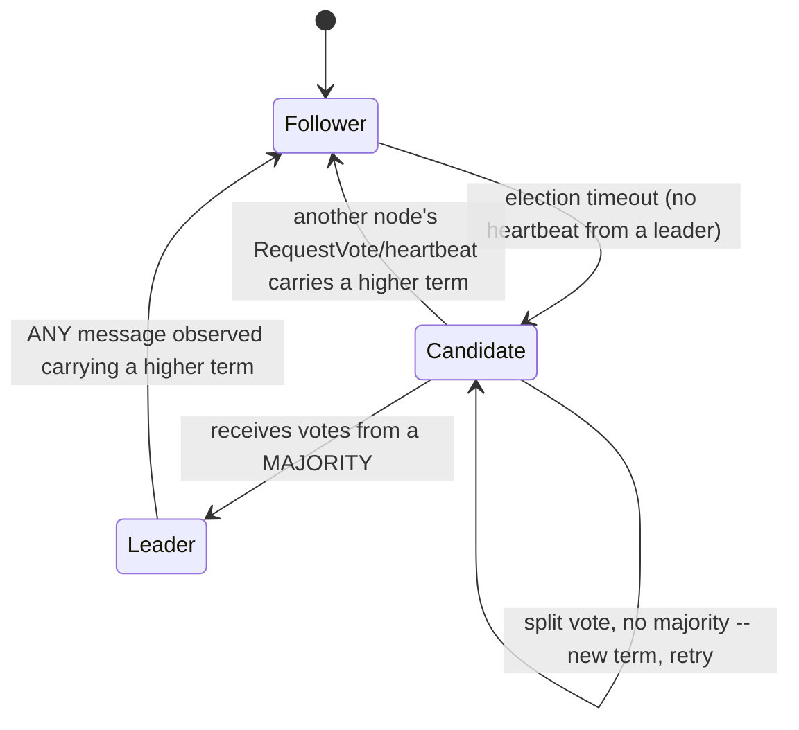

# Consensus Algorithms: Raft and Paxos

> **Topic register:** T-2403 · IWI 6.8 · Advanced tier · High interview frequency [H] in Staff-level system design rounds
> **Provenance:** the leader-election evidence in this chapter is real, executed output from
> [`practice/java/consensus-raft/`](../../practice/java/consensus-raft/README.md) — a deterministic
> simulation implementing Raft's actual `RequestVote` vote-granting rule (Figure 2 of the Raft paper),
> not a simplification.

## Table of Contents

1. [Learning Objectives](#learning-objectives)
2. [Why This Matters in Interviews](#why-this-matters-in-interviews)
3. [Level 1 — Foundation](#level-1--foundation)
4. [Level 2 — Working Knowledge](#level-2--working-knowledge)
5. [Mental Model](#mental-model)
6. [Definition and Purpose](#definition-and-purpose)
7. [Historical Context](#historical-context)
8. [Core Concepts](#core-concepts)
9. [Internal Implementation](#internal-implementation)
10. [Diagrams](#diagrams)
11. [Production Scenarios](#production-scenarios)
12. [Trade-offs](#trade-offs)
13. [Decision Framework](#decision-framework)
14. [Comparisons](#comparisons)
15. [Common Mistakes](#common-mistakes)
16. [Anti-Patterns](#anti-patterns)
17. [Best Practices](#best-practices)
18. [Interview Answer Framework](#interview-answer-framework)
19. [Interview Questions](#interview-questions)
20. [Summary](#summary)
21. [Key Takeaways](#key-takeaways)
22. [Cheat Sheet](#cheat-sheet)
23. [Flashcards](#flashcards)
24. [Practice Exercises](#practice-exercises)
25. [Solutions](#solutions)
26. [Additional Reading](#additional-reading)
27. [Official References](#official-references)

---

## Learning Objectives

By the end of this chapter you can explain what a consensus algorithm actually guarantees (all nodes agree on the same value/leader, even with failures, as long as a majority is healthy), walk through Raft's leader-election mechanism precisely (terms, votes, majority quorum), and cite real, executed evidence of a network partition preventing the minority side from electing a leader, a real split vote producing no winner, and a stale leader stepping down the instant it observes a higher term.

## Why This Matters in Interviews

Consensus algorithms are Advanced tier and High frequency specifically in Staff-level rounds because "how does the system agree on a leader/value when nodes can fail or the network can partition" is the load-bearing mechanism underneath nearly every real coordination service a candidate will have used (`etcd`, `ZooKeeper`, Consul) without necessarily having looked inside. Interviewers use it to separate candidates who can name "Raft" or "Paxos" from candidates who can actually explain *why* a majority quorum is the mechanism that makes split-brain (two nodes both believing they're the leader) structurally impossible — a distinction with real, direct consequences for [CAP theorem](cap-theorem-and-consistency-models.md) reasoning, since a consensus-backed system's "C" in CP is only as strong as this exact mechanism.

## Level 1 — Foundation

**Imagine five people in different rooms who need to agree on one designated decision-maker, communicating only by passing notes, where notes can be delayed or lost.** If they all vote at once and each person only trusts a decision backed by *more than half* of the group (3 of 5), something important falls out for free: it's mathematically impossible for two different people to both get a majority in the same round — there aren't enough votes to go around twice. This is the entire trick behind **consensus algorithms** like Raft: a "leader" is simply whoever collected votes from a majority of the group in a given round (called a **term**), and requiring a strict majority is what prevents two people from both legitimately claiming leadership in the same round.

```text
5 nodes, majority = 3
Round (term) 1: Node A asks for votes -> gets 3 (including itself) -> WINS, becomes leader
                Node A can be confident: no one else could ALSO get 3 votes this same round --
                there are only 5 votes total, and A already used 3 of them.
```

**Raft** and **Paxos** are the two most widely known algorithms implementing exactly this idea (plus the harder follow-on problem of also agreeing on a replicated *log* of operations, not just a leader) — Raft was designed specifically to be more understandable than Paxos while providing the same real guarantees, which is exactly why real systems (`etcd`, Consul, CockroachDB) overwhelmingly chose it.

## Level 2 — Working Knowledge

At this level you should be able to state precisely what a **term** is in Raft: a monotonically increasing counter, incremented every time a new election starts, acting as a logical clock that lets every node unambiguously order events and detect staleness — any node that ever sees a term higher than its own immediately knows something more recent has happened and must catch up (and, if it was a leader, step down). This one rule — "a higher term always wins, and seeing one demotes you" — is what [Internal Implementation](#internal-implementation) demonstrates directly, and it's the single most important safety mechanism to be able to explain precisely, not just name.

You should also be comfortable with the practical, working distinction between a consensus algorithm agreeing on a **single leader** (the easier problem, what this chapter's real demo exercises) and agreeing on a **replicated log of operations** (the harder, more complete problem real systems actually need — every committed log entry must end up identical, in the identical order, on every node). Leader election is the foundation the log-replication protocol builds on top of — a real Raft cluster's leader, once elected, is what serially proposes every subsequent log entry, and the same "requires a majority" rule that elected it is reused to decide when an entry is safely committed.

**A practical rule for a working engineer**: if a system needs "exactly one thing happens" (an active job scheduler, a distributed lock) or "operations apply in the identical order everywhere" (a distributed configuration store's history), that's a consensus-shaped requirement — reach for a battle-tested implementation (`etcd`'s Raft, a managed coordination service) rather than hand-rolling leader election with a simpler mechanism like "whoever's ID is lowest," which has no real answer to "what happens during a partition" the way a majority-quorum-based algorithm does by construction.

## Mental Model

Keep one number in mind for every consensus question: **the majority threshold, `⌊N/2⌋ + 1`.** Every real guarantee a consensus algorithm provides — no two leaders in the same term, a committed log entry is never lost even if some nodes crash — reduces to the simple arithmetic fact that two disjoint groups of nodes can't both be a majority of the same total. A candidate becomes leader by collecting votes from a majority; a partition's minority side structurally cannot collect a majority, no matter how many times it retries, for exactly the same arithmetic reason — this is not a policy decision anywhere in the algorithm, it's a direct consequence of what "majority" means.

## Definition and Purpose

A **consensus algorithm** lets a group of nodes agree on a single value (or a single leader, or a single ordered sequence of operations) even when some nodes fail or messages are delayed, as long as a majority of nodes remain healthy and can communicate. **Raft** (Ongaro & Ousterhout, 2014) is a consensus algorithm explicitly designed for understandability, decomposing the problem into leader election, log replication, and safety, using a strict majority-vote mechanism and a monotonically increasing **term** counter as its core primitives. **Paxos** (Lamport, 1998/2001) is the earlier, foundational consensus algorithm — correct and widely deployed (Google's Chubby lock service, Spanner's underlying replication) but historically considered harder to understand and to correctly implement in full, which is the specific gap Raft was built to close.

## Historical Context

Paxos was introduced by Leslie Lamport in a 1998 paper ("The Part-Time Parliament") deliberately written as an allegory that many readers found confusing, followed by a clearer 2001 paper ("Paxos Made Simple") — even with the clarification, Paxos remained notorious for being difficult to reason about and to implement correctly in its full, multi-value form (Multi-Paxos), with numerous published "simplified" variants attempting to close that gap. Raft was published in 2014 by Diego Ongaro and John Ousterhout at Stanford specifically as a response to this — a formal user study in the original paper found students understood Raft significantly better than Paxos after equivalent instruction — and Raft has since become the dominant consensus algorithm in new distributed systems (`etcd`, Consul, CockroachDB, TiKV) precisely because of that understandability advantage, not because it provides a stronger guarantee than a correct Paxos implementation would.

## Core Concepts

### The majority-quorum requirement is what makes "at most one leader per term" a mathematical fact, not a policy

Raft requires a candidate to receive votes from a strict majority (`⌊N/2⌋ + 1`) of all nodes, not just the nodes it can currently reach, before becoming leader. Because any two majorities of the same fixed-size group must overlap by at least one node, and that shared node can only vote for one candidate in a given term, it is structurally impossible for two different nodes to both win a majority in the same term — [Internal Implementation](#internal-implementation) demonstrates this directly via a real network partition, where the minority side's candidate caps out at 2 of 5 votes and can never reach the required 3, no matter how many times it retries while the partition persists.

### Terms are Raft's logical clock, and "see a higher term, step down" is the core safety rule

Every node tracks a `currentTerm`, incremented only when starting a new election. Any RPC (a vote request, or in a full implementation, a log-replication heartbeat) that carries a term higher than a node's own `currentTerm` causes that node to immediately adopt the higher term and revert to `FOLLOWER` — even if the node currently believes itself to be the leader. This single rule is what guarantees a stale leader (one that's lost contact with the rest of the cluster, perhaps due to a network hiccup, while the rest of the cluster has since elected a new leader in a higher term) cannot continue believing it's in charge once it reconnects and learns the real, current term — [Internal Implementation](#internal-implementation) reproduces this exact scenario directly.

### Leader election is the easier half of the problem; log replication is what makes it a complete consensus algorithm

A real Raft deployment doesn't stop at "agree on a leader" — the elected leader then serially proposes entries to a replicated log, and an entry is considered **committed** once it's been replicated to (again) a majority of nodes. This chapter and its real demo focus specifically on leader election, the foundational half of the problem, since it's where the majority-quorum mechanism this chapter is centered on is easiest to observe directly — log replication reuses the identical majority-counting mechanism to decide when an entry is safely durable.

## Internal Implementation

**Real, normal election — five nodes, no partition:**

```
0 starts election for term 1 (reachable peers: [0, 1, 2, 3, 4])
    RequestVote(term=1) -> node 1 : granted=true (peer now at term 1)
    RequestVote(term=1) -> node 2 : granted=true (peer now at term 1)
    RequestVote(term=1) -> node 3 : granted=true (peer now at term 1)
    RequestVote(term=1) -> node 4 : granted=true (peer now at term 1)
  Result: 5/5 votes (majority needs 3) -> ELECTED LEADER
```

**Real evidence a network partition prevents the minority side from ever electing a leader** — a 5-node cluster split into a 3-node majority `{0,1,2}` and a 2-node minority `{3,4}`:

```
--- Majority-side partition {0,1,2} attempts an election ---
  0 starts election for term 1 (reachable peers: [0, 1, 2])
  Result: 3/5 votes (majority needs 3) -> ELECTED LEADER

--- Minority-side partition {3,4} attempts an election, same real rules ---
  3 starts election for term 1 (reachable peers: [4, 3])
  Result: 2/5 votes (majority needs 3) -> no majority, election fails this term
```

The minority side runs through the *identical* election code path — same vote-granting rule, same majority arithmetic — and still caps out at 2 votes out of a possible 5, one short of the required 3. This isn't a special case coded into the simulation; it's the direct, structural consequence of only 2 of the cluster's 5 nodes being reachable to it.

**Real evidence of a genuine split vote producing no leader, followed by a clean resolution the next term:**

```
--- Term 1: two candidates (0 and 1) campaign in the SAME term ---
  Node 4's RequestVote messages from BOTH candidates are lost/delayed this round --
  Candidate 0 got 2/5 votes; Candidate 1 got 2/5 votes (node 4 never responded to either candidate this round).
  Neither reaches the cluster-wide majority of 3 -- term 1 ends with NO elected leader.
```

Node 4 never responds to either candidate's `RequestVote` in time — a real, plausible cause of a split vote in an actual deployment (message delay or loss, not a hard partition). With only 4 of the cluster's 5 votes cast at all, neither candidate can reach the cluster-wide majority of 3, and term 1 genuinely produces no leader:

```
--- Term 2: nodes 0 and 1 step back to FOLLOWER; node 2 alone campaigns next ---
  2 starts election for term 2 (reachable peers: [0, 1, 2, 3, 4])
  Result: 5/5 votes (majority needs 3) -> ELECTED LEADER
```

**Real evidence a stale leader steps down the instant it observes a higher term:**

```
--- Node 0 wins a real election and becomes leader for term 1 ---
  Node 0 state: Node0[term=1, state=LEADER, votedFor=0]

--- Node 1 times out (e.g. missed heartbeats) and starts an election for term 2 ---
  Result: 4/5 votes (majority needs 3) -> ELECTED LEADER
  Node 1 state: Node1[term=2, state=LEADER, votedFor=1]

--- Node 0 (the old term-1 leader) now receives a RequestVote carrying term 2 ---
  Node 0 state AFTER seeing the higher term: Node0[term=2, state=FOLLOWER, votedFor=1]
```

Node 0 transitions from `LEADER` to `FOLLOWER` the instant it processes a message carrying a higher term — real, direct evidence of the exact safety mechanism that keeps a network cluster from ever having two nodes simultaneously believing they're the leader for an overlapping period once they're back in contact.

## Diagrams



Every arrow into `Follower` except the very first one is triggered by the same real rule — "saw a higher term" — which is exactly why this one transition, more than any other in the diagram, is worth being able to explain precisely rather than just recognizing the diagram's shape.

## Production Scenarios

### Scenario: a brief network blip causes two application instances to both believe they hold an active lock

**Context.** A distributed job scheduler uses a hand-rolled leader-election scheme — "whichever instance's row in a shared database was updated most recently is the active scheduler" — rather than a real consensus algorithm.

**Symptoms.** During a brief network partition between the scheduler instance and the database, a second instance, unable to see the first instance's recent heartbeat, promotes itself to active and begins scheduling jobs. When the partition heals, both instances briefly believe they are the active scheduler, and a batch of jobs runs twice.

**Impact.** Duplicate job execution — for an idempotent job, a wasted resource cost; for a non-idempotent one (e.g., "charge the customer," "send the daily digest email"), a real, user-visible correctness incident.

**Initial hypotheses.** A database consistency bug (checked — the database behaved correctly per its own guarantees); a bug in the heartbeat-timeout logic (checked — timeouts fired exactly as configured); the underlying leader-election scheme has no real majority-quorum mechanism, so nothing structurally prevents two instances from both believing they're active during a partition (correct).

**Evidence.** Both instances' logs show them independently concluding "I am now the active scheduler" during the same window — a design that, unlike Raft's real vote-counting rule demonstrated in this chapter, never asked "did I actually get a majority" at all; it only asked "does the other instance look unresponsive to me."

**Diagnosis.** The hand-rolled scheme has no equivalent of Raft's majority-quorum requirement — it can produce two simultaneous "leaders" precisely because nothing in its design makes that mathematically impossible, unlike the real, structural guarantee this chapter's own partition demo shows directly.

**Immediate mitigation.** Manually deduplicate the affected job runs and audit for any non-idempotent side effects from the double execution.

**Permanent remediation.** Replace the hand-rolled scheme with a real, battle-tested consensus-backed lock (`etcd`'s lease-based distributed lock, built on Raft) — the majority-quorum requirement this chapter demonstrates is exactly the mechanism that makes "two simultaneous leaders" structurally impossible, not merely unlikely.

**Alternatives considered.** Tightening the heartbeat-timeout window to reduce the incident's likelihood — rejected as treating the symptom; a shorter timeout reduces the *frequency* of the failure mode without addressing that the underlying scheme has no real safety guarantee against it at all.

**Trade-offs.** Adopting a real consensus-backed lock adds an operational dependency (running or consuming `etcd`) in exchange for a genuine, structural correctness guarantee the previous scheme never actually had.

**Prevention.** Treat "we need exactly one active instance" as a consensus-shaped requirement by default, and reach for a real, existing implementation rather than a heuristic (most-recent-heartbeat, lowest-ID) that has no actual majority-quorum mechanism underneath it.

**Interview lesson.** This is Interview Question 1 (§ Interview Questions) — "why does a majority-quorum requirement prevent split-brain" — arriving as a real, duplicate-job-execution incident rather than an abstract safety property.

## Trade-offs

| Approach | Benefit | Cost |
|---|---|---|
| Raft (or a real consensus-backed coordination service built on it) | Real, structural guarantee against split-brain; well-understood, widely implemented | Requires a majority of nodes to be healthy and mutually reachable to make any progress at all — an odd node count (3, 5) is the practical default specifically to maximize quorum tolerance per node added |
| Paxos (Multi-Paxos in production systems) | The same real correctness guarantee; underlies some of the most heavily-used systems in the world (Chubby, Spanner) | Historically harder to reason about and implement correctly than Raft; fewer off-the-shelf, directly-usable open-source implementations |
| A heuristic leader-election scheme (most-recent-heartbeat, lowest node ID) | Simple to implement, no consensus library dependency | Real, demonstrated risk of split-brain during a partition — no majority-quorum mechanism actually prevents two nodes from both concluding they're the leader |

## Decision Framework

1. **Does this requirement genuinely need "exactly one active X" or "operations apply in the identical order everywhere," with correctness that must hold even during a partition?** This is consensus-shaped — reach for a real, existing implementation (`etcd`, ZooKeeper, Consul), never a hand-rolled heuristic.
2. **Is a majority of the cluster's nodes going to remain mutually reachable under the failure modes you actually expect?** If not (e.g., a 2-node cluster, where losing either node leaves no possible majority), the deployment topology itself needs rethinking before the algorithm choice matters at all.
3. **Do you need to implement this from scratch, or consume an existing coordination service?** Overwhelmingly consume one — implementing Raft or Paxos correctly, including all the edge cases around log replication and cluster membership changes, is a substantial undertaking most teams should not take on themselves.
4. **Odd or even node count?** Default to an odd number (3, 5, 7) — an even count adds a node without improving the majority threshold's fault tolerance (5 nodes tolerate 2 failures; 6 nodes still only tolerate 2, since 4 is the majority needed either way), purely extra operational cost with no corresponding safety benefit.

## Comparisons

| Aspect | Raft | Paxos (Multi-Paxos) |
|---|---|---|
| Design goal | Explicit understandability (per the original paper's own stated aim and user study) | Correctness first; understandability was not an original design goal |
| Structure | Strong leader — all log entries flow through one elected leader | Historically more symmetric; a practical Multi-Paxos deployment typically also elects a stable leader/distinguished proposer for efficiency |
| Term/round naming | Explicit, monotonically increasing `term` | Analogous concept (a "ballot number" or "proposal number"), same underlying role |
| Real-world adoption in new systems | Dominant choice (`etcd`, Consul, CockroachDB, TiKV) | Still foundational in some of the largest-scale systems built before Raft existed (Chubby, Spanner) or where its specific properties were already deeply embedded |
| Core safety mechanism | Majority quorum vote per term, higher-term-wins | Majority quorum per proposal/ballot number, higher-ballot-wins — the same structural idea, differently named |

Both algorithms rest on the *identical* majority-quorum arithmetic this chapter's real demo exercises directly for Raft — the practical difference for most engineers is which one has a battle-tested, directly-consumable implementation available for their actual use case, which today overwhelmingly favors Raft for new systems.

## Common Mistakes

- Describing "majority quorum" as an arbitrary policy choice rather than the specific mathematical property (two disjoint majorities of the same group can't both exist) that makes split-brain structurally impossible.
- Implementing a hand-rolled leader-election heuristic (most-recent-heartbeat, lowest node ID) and assuming it provides the same safety guarantee a real majority-quorum algorithm does — real evidence in this chapter's Production Scenario shows exactly the split-brain failure mode this omission enables.
- Believing Raft and Paxos provide meaningfully different correctness guarantees, rather than the same guarantee via a differently structured (and, for Raft, deliberately more teachable) mechanism.
- Choosing an even cluster size, not realizing it adds operational cost without improving fault tolerance versus the next-lower odd size.

## Anti-Patterns

- **A "leader election" scheme with no actual vote-counting or majority-quorum step** — the real, demonstrated failure mode is split-brain during exactly the failure conditions (a partition, a network blip) the scheme was nominally built to survive.
- **Implementing Raft or Paxos from scratch for a production system** rather than consuming an existing, heavily-tested implementation — the algorithm's core idea is teachable in one chapter; a fully correct, production-grade implementation (handling cluster membership changes, snapshotting, log compaction) is a much larger undertaking with a real cost to getting subtly wrong.
- **An even-numbered cluster size**, treating "more nodes" as unconditionally better fault tolerance without checking whether it actually raised the majority threshold's tolerance.

## Best Practices

- Default to an odd cluster size (3 or 5 for most real deployments) — it maximizes fault tolerance per node added, unlike an even count.
- Consume an existing, battle-tested consensus implementation (`etcd`, ZooKeeper, Consul) for any "exactly one active X" or "ordered log everyone agrees on" requirement, rather than implementing the algorithm or a heuristic substitute from scratch.
- When explaining or reviewing a leader-election design, explicitly verify it has a real majority-quorum step — not just a heartbeat-timeout heuristic — since that step is specifically what prevents split-brain.
- Treat "what happens to the minority side during a partition" as a standing design question for any consensus-backed system — the real, correct answer is "it cannot make progress," and any consumer relying on that minority side needs to plan for unavailability, not silent staleness.

## Interview Answer Framework

### 30-Second Answer

A consensus algorithm lets a group of nodes agree on a leader or an ordered log even with node failures, using a strict majority-quorum requirement — because two disjoint majorities of the same fixed group can't both exist, majority voting makes it structurally impossible for two nodes to both become leader in the same term. Raft implements this with an explicit, monotonically increasing term counter and a strong-leader design, specifically built to be more understandable than the earlier Paxos algorithm while providing the same real guarantee. A network partition's minority side can never reach the majority threshold and therefore can never elect a leader while the partition persists — a real, structural safety property, not a policy choice.

### 2-Minute Answer

Definition: consensus algorithms let a distributed group agree on a value (a leader, an ordered log) correctly even with failures, via a majority-quorum requirement. Why the quorum matters: two different subsets of the same fixed-size group can't both be a strict majority, so majority-vote-to-win makes two-simultaneous-leaders mathematically impossible, not just unlikely. How Raft works specifically: a monotonically increasing `term` acts as a logical clock; any node seeing a higher term than its own immediately adopts it and steps down to follower, even a sitting leader — this is the exact mechanism that resolves a stale leader once it reconnects after a network hiccup. One important trade-off: the algorithm can only make progress with a healthy majority — the minority side of a partition is correctly, deliberately unavailable, not silently stale. One production example: a hand-rolled "most-recent-heartbeat" leader-election scheme (no real quorum step) allowed two application instances to both believe they were the active scheduler during a brief partition, causing duplicate job execution — the exact split-brain failure a real majority-quorum mechanism, demonstrated directly in this chapter, structurally prevents.

### 10-Minute Deep Dive

Cover, in order: the majority-quorum mental model and why it makes split-brain mathematically, not just practically, impossible (mental model, core concepts); Raft's term-as-logical-clock mechanism and the "higher term always wins, and seeing one demotes you" safety rule (core concepts); the real, executed evidence of a normal election, a partition where only the majority side can elect a leader, a genuine split vote, and a stale leader's real step-down on a higher term (internals, real evidence); the historical Paxos-to-Raft transition and why understandability, not a stronger guarantee, was Raft's actual design goal (historical context, comparisons); the hand-rolled-heuristic production scenario, a real instance of what's lost by skipping the actual majority-quorum mechanism; the decision framework for odd-vs-even cluster sizing and build-vs-consume.

### Whiteboard Explanation

Draw the [§ Diagrams](#diagrams) state diagram: Follower/Candidate/Leader boxes with the transition arrows. Beside it, draw five small circles representing cluster nodes, split into a 3-circle group and a 2-circle group with a jagged line between them labeled "partition" — shade the 3-circle group's majority-vote arrow green ("reaches 3, wins") and the 2-circle group's arrow red ("caps at 2, can never win while split") to make the arithmetic concrete rather than asserted.

### Production Example

The duplicate-job-execution incident in [§ Production Scenarios](#production-scenarios): a hand-rolled, heartbeat-only leader-election scheme (no real majority-quorum step) let two scheduler instances both believe they were active during a brief network partition, causing a batch of jobs to run twice — fixed by replacing the scheme with a real, consensus-backed distributed lock, whose majority-quorum requirement is exactly the mechanism this chapter's own partition demo shows directly preventing the minority side from ever reaching the same conclusion.

### Trade-offs to Mention

State unprompted: a consensus-backed system can only make progress with a healthy majority — the minority side of a partition is correctly, deliberately unavailable rather than silently serving stale data, a direct instance of the [CP choice in CAP terms](cap-theorem-and-consistency-models.md); Raft and Paxos provide the identical real guarantee, and the practical choice today is overwhelmingly about implementation availability and understandability, not a difference in correctness.

### Common Candidate Mistakes

Describing "majority quorum" as an arbitrary rule rather than the specific arithmetic property that prevents two simultaneous leaders; believing Paxos and Raft differ in what they actually guarantee; proposing a heartbeat-only leader-election heuristic as equivalent to a real consensus algorithm.

### Typical Follow-Up Questions

1. "Why does a majority-quorum requirement specifically prevent two nodes from both becoming leader in the same term?"
2. "What happens to the minority side of a network partition in a Raft cluster — does it serve stale data, or refuse requests?"
3. "Why do most real consensus deployments use an odd number of nodes?"

### Senior-Level Expectations

Correctly explains the majority-quorum mechanism and can trace through a simple leader-election scenario, including what happens during a partition.

### Staff-Level Discussion

Connects the majority-quorum mechanism directly to [CAP theorem](cap-theorem-and-consistency-models.md)'s CP choice — a consensus-backed system's minority-side unavailability during a partition *is* the CP trade-off, made concrete and mechanistic rather than abstract — and can reason about real deployment-topology decisions (odd vs. even node count, how many simultaneous node failures a given cluster size tolerates) rather than treating "just use Raft" as a complete answer without sizing the actual cluster correctly for the failure modes the system needs to survive.

## Interview Questions

### Question 1 — Why does requiring a strict majority of votes prevent two different nodes from both becoming leader in the same term?

**Why interviewers ask it.** Tests whether a candidate understands the majority-quorum requirement as a real, structural guarantee rather than an arbitrary design choice — the single most load-bearing safety property in this whole topic.

**Expected answer.** In a fixed-size group, any two subsets that are each strictly more than half the group must overlap by at least one member (there simply aren't enough remaining members to form two disjoint majorities). Since each node can only vote for one candidate in a given term, that shared, overlapping node can only have contributed its vote to one of the two candidates — so it is mathematically impossible for two different candidates to both collect a majority of votes in the same term. This is not a policy the algorithm enforces by convention; it's a direct consequence of what "majority" means arithmetically.

**Minimum acceptable answer.** States that Raft requires a majority to become leader, even without the overlap argument for why that specifically prevents two leaders.

**Strong Senior answer.** Gives the overlap argument correctly.

**Staff-level extension.** Connects this directly to the CAP theorem's CP classification — the minority side's inability to reach a majority during a partition *is* the mechanism behind "choosing consistency over availability," made concrete rather than asserted.

**Common mistakes.** Describing majority-vote as simply "the way Raft happens to work" without being able to explain why it specifically rules out two simultaneous winners.

**Likely follow-ups.** "What happens to the minority side of a partition — does it keep trying to elect a leader?" (Yes, real Raft implementations retry with increasing terms, but the minority side structurally cannot succeed while it remains a minority, regardless of how many times it retries — exactly this chapter's own partition demo.)

**Evaluation criteria (1–5).** 1: names "majority" with no explanation of why it works. 3: gives a correct but incomplete explanation. 5: gives the full overlap argument and connects it to CAP's CP classification unprompted.

**Related references.** [§ Core Concepts](#core-concepts); [§ Internal Implementation](#internal-implementation); [CAP Theorem and Consistency Models](cap-theorem-and-consistency-models.md).

---

### Question 2 — A node believes it's the leader, but it's actually been disconnected from the rest of the cluster for a while, and a new leader has since been elected. What happens when connectivity is restored?

**Why interviewers ask it.** Tests whether a candidate knows the specific mechanism (term comparison, immediate step-down) that resolves a stale leader, rather than just asserting "it gets fixed somehow."

**Expected answer.** The moment the stale leader receives any message (a vote request, or in a full implementation, a heartbeat/log-replication RPC) carrying a term higher than its own, it immediately adopts that higher term and transitions to `FOLLOWER` — real, direct evidence of exactly this transition is captured in this chapter's own demo. There is no ambiguity or negotiation involved; observing a higher term is an unconditional signal to step down.

**Common mistakes.** Describing the resolution vaguely ("eventually it figures out it's not the leader anymore") without naming the specific term-comparison mechanism that makes this deterministic and immediate.

**Follow-up questions:** "Could the stale leader have committed writes to clients while disconnected that the new leader's log doesn't have?" (This is exactly why log replication also requires majority acknowledgment before considering an entry committed — a leader that can't reach a majority can't safely tell a client a write succeeded, which is the log-replication half of the algorithm this chapter's leader-election-focused demo doesn't itself exercise, but relies on the identical majority mechanism.)

**Senior-level expectations:** correctly names the term-comparison, immediate-step-down mechanism.

**Staff-level expectations:** proactively raises the log-replication/commit-acknowledgment implication for a disconnected leader that may have accepted writes it couldn't safely commit.

## Summary

Consensus algorithms let a group of nodes agree on a leader or an ordered log even with failures, via a majority-quorum requirement whose safety guarantee — at most one leader per term — is a direct, mathematical consequence of the fact that two disjoint majorities of the same fixed-size group cannot both exist. Raft implements this with an explicit `term` counter acting as a logical clock, real evidence in this chapter showing a normal election succeeding unanimously, a network partition's minority side capping out short of a majority no matter how many times it retries, a genuine split vote resolving cleanly the next term, and a stale leader stepping down the instant it observes a higher term. Paxos provides the identical real guarantee via a differently structured (and historically harder to teach) mechanism — Raft's dominance in new systems reflects its deliberate design-for-understandability, not a stronger correctness property. The majority-quorum mechanism this chapter demonstrates directly is also the concrete, mechanistic version of [CAP theorem](cap-theorem-and-consistency-models.md)'s CP choice — a consensus-backed system's minority-side unavailability during a partition isn't an incidental limitation; it's the safety guarantee working exactly as designed.

## Key Takeaways

- A strict majority-quorum requirement makes "two leaders in the same term" mathematically impossible, not just unlikely — two disjoint majorities of a fixed-size group cannot both exist.
- Raft's `term` counter is a logical clock; any node observing a higher term than its own immediately adopts it and steps down to follower, even a sitting leader — real, demonstrated evidence in this chapter's stale-leader scenario.
- A network partition's minority side structurally cannot elect a leader while the partition persists — real, measured evidence shows it capping out short of the majority threshold regardless of retries.
- Raft and Paxos provide the identical real consensus guarantee; Raft's dominance in new systems is due to its deliberate design-for-understandability, not a stronger correctness property.
- Default to an odd cluster size — it maximizes majority-threshold fault tolerance per node added, unlike an even count.

## Cheat Sheet

| Question | Answer |
|---|---|
| Why does majority voting prevent two leaders? | Two disjoint majorities of the same fixed group can't both exist — mathematically, not by convention |
| What resolves a stale leader after reconnecting? | It sees a higher term in an incoming message and immediately steps down to follower |
| What happens to a partition's minority side? | It can never reach the majority threshold while partitioned — correctly, deliberately unavailable |
| Raft vs. Paxos — different guarantee? | No — identical real guarantee; Raft was designed to be more understandable, not more correct |
| Odd or even cluster size? | Odd — an even count adds a node without improving majority-threshold fault tolerance |

## Flashcards

### Card: Why majority quorum prevents split-brain

**Prompt:**
Why does requiring a strict majority of votes make it mathematically impossible for two nodes to both become leader in the same term?

**Answer:**
Any two subsets that are each strictly more than half a fixed-size group must overlap by at least one member — that shared node can only vote for one candidate, so two disjoint majorities in the same term cannot both exist.

**Why it matters:**
The single most load-bearing safety property in this whole topic — a real, structural guarantee, not a policy choice.

**Common trap:**
Describing majority-vote as an arbitrary Raft design decision rather than the specific arithmetic fact that makes split-brain impossible.

**Related:**
[Internal Implementation](#internal-implementation)

### Card: What a partition's minority side can do

**Prompt:**
Can the minority side of a network partition ever elect a leader, no matter how many times it retries?

**Answer:**
No — verified directly, a 2-of-5 minority partition caps out at 2 votes, one short of the required majority of 3, and no amount of retrying changes this while the partition persists.

**Why it matters:**
This is the concrete, mechanistic version of the CP choice in CAP theorem — unavailability by design, not a bug.

**Common trap:**
Assuming a consensus algorithm will "eventually" let the minority side make progress if it just retries enough.

**Related:**
[Internal Implementation](#internal-implementation), [CAP Theorem and Consistency Models](cap-theorem-and-consistency-models.md)

### Card: Raft vs. Paxos

**Prompt:**
Does Raft provide a stronger correctness guarantee than a correctly implemented Paxos?

**Answer:**
No — both provide the identical real consensus guarantee. Raft was designed specifically for understandability (confirmed by a user study in the original paper), which is why it dominates new systems, not because it's "more correct."

**Why it matters:**
A common candidate misconception — treating Raft's popularity as evidence of a stronger guarantee rather than a teachability advantage.

**Common trap:**
Describing Paxos as "less safe" rather than "harder to implement correctly."

**Related:**
[Historical Context](#historical-context), [Comparisons](#comparisons)

## Practice Exercises

1. Reproduce every scenario in this chapter yourself: [`practice/java/consensus-raft/`](../../practice/java/consensus-raft/README.md).
2. Modify the partition demo to use a 7-node cluster split into a 4-node and a 3-node partition, and confirm the majority-side (4 of 7) can elect a leader while the minority (3 of 7, short of the 4-node majority) cannot — real evidence the same mechanic generalizes beyond the 5-node example.
3. Extend `RaftNode` with a real `AppendEntries`-style log-replication method (accepting a single string "command" per call) and a `commitIndex` that only advances once a majority of nodes have acknowledged receiving a given entry — confirm a command is never considered committed unless a real majority has it.

## Solutions

**Exercise 1.** Expected output matches this chapter's captured traces exactly, since the simulation is fully deterministic (no real network timing involved).

**Exercise 2.** With 7 nodes, majority = 4. A `{0,1,2,3}` partition (4 nodes) can reach 4 votes and win; a `{4,5,6}` partition (3 nodes) caps out at 3 votes, one short of the majority of 4 — the identical structural outcome as the chapter's 5-node example, confirming the mechanic isn't specific to that one cluster size.

**Exercise 3.** A correct implementation tracks, per log entry, how many nodes have acknowledged it; `commitIndex` advances to the highest index for which at least a majority of nodes (including the leader) have acknowledged receipt — mirroring the exact same majority-counting logic `runElection` already uses for votes, applied to log entries instead of ballots.

## Additional Reading

- [CAP Theorem and Consistency Models](cap-theorem-and-consistency-models.md) — the majority-quorum mechanism this chapter demonstrates directly is the concrete, mechanistic version of that chapter's CP classification.

## Official References

- Diego Ongaro and John Ousterhout, ["In Search of an Understandable Consensus Algorithm (Extended Version)"](https://raft.github.io/raft.pdf) — the original Raft paper
- Google Research, ["Spanner: Google's Globally-Distributed Database"](https://research.google/pubs/pub27897/) — a real, large-scale production system built on Paxos-derived consensus
