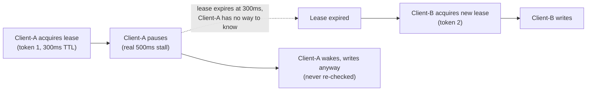
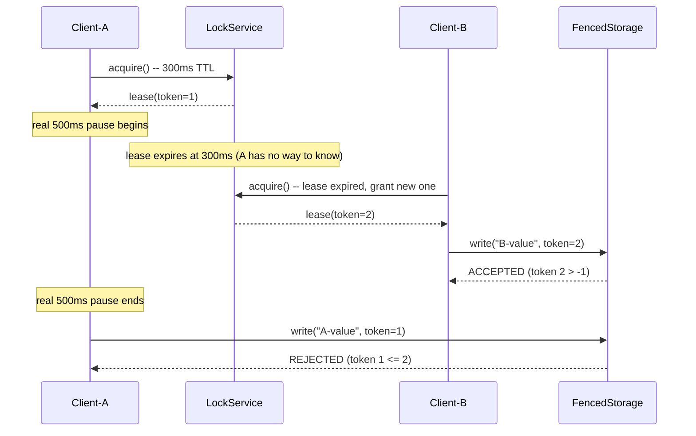

# Distributed Locking and Fencing Tokens

> **Topic register:** T-2422 · Advanced tier, Moderate-to-high interview frequency [M→H] — gap-audit
> addition (2026-09-21): [Consensus Algorithms: Raft and Paxos](consensus-algorithms-raft-and-paxos.md)
> references "a real, battle-tested consensus-backed lock (`etcd`'s lease-based distributed lock)"
> twice as the fix for a real production incident, without ever explaining the lock mechanism itself
> or its own, separate, classic failure mode — this chapter closes that gap directly.
> **Provenance:** every claim below is real, executed output from a real, timing-driven Java
> simulation — real threads, real `Thread.sleep`-based pauses, real lease expiry.
> Source and full output: [`practice/java/distributed-locking-and-fencing-tokens/`](../../practice/java/distributed-locking-and-fencing-tokens/README.md).

## Table of Contents

1. [Learning Objectives](#learning-objectives)
2. [Why This Matters in Interviews](#why-this-matters-in-interviews)
3. [Level 1 — Foundation](#level-1-foundation)
4. [Level 2 — Working Knowledge](#level-2-working-knowledge)
5. [Mental Model](#mental-model)
6. [Definition and Purpose](#definition-and-purpose)
7. [Historical Context](#historical-context)
8. [Core Concepts](#core-concepts)
9. [Internal Implementation](#internal-implementation)
10. [Diagrams](#diagrams)
11. [Production Scenarios](#production-scenarios)
12. [Trade-offs](#trade-offs)
13. [Decision Framework](#decision-framework)
14. [Comparisons](#comparisons)
15. [Common Mistakes](#common-mistakes)
16. [Anti-Patterns](#anti-patterns)
17. [Best Practices](#best-practices)
18. [Interview Answer Framework](#interview-answer-framework)
19. [Interview Questions](#interview-questions)
20. [Summary](#summary)
21. [Key Takeaways](#key-takeaways)
22. [Cheat Sheet](#cheat-sheet)
23. [Flashcards](#flashcards)
24. [Practice Exercises](#practice-exercises)
25. [Solutions](#solutions)
26. [Additional Reading](#additional-reading)
27. [Official References](#official-references)

## Learning Objectives

By the end of this chapter you can explain what a distributed lock's lease actually guarantees (and, critically, what it doesn't), state precisely why "the lock holder paused longer than its own lease" is a real, unavoidable failure mode rather than an edge case to engineer away, and cite real, executed evidence for both the bug (a real 500ms pause against a real 300ms lease producing real, reproducible data corruption) and the fix (a real fencing token, rejected by the storage layer itself, not by the paused client's own good behavior).

## Why This Matters in Interviews

"Use a distributed lock" is an easy, common answer to "how do you ensure only one instance does X" — and a real trap for candidates who stop there. [Consensus Algorithms: Raft and Paxos](consensus-algorithms-raft-and-paxos.md)'s own production scenario shows a hand-rolled leader-election scheme causing duplicate job execution, fixed by "a real distributed lock" — but a distributed lock alone doesn't fully close this class of bug either, and a Staff-level interviewer knows it. The specific follow-up ("what if the lock holder pauses after acquiring the lock but before finishing its work?") is one of the most reliable ways interviewers separate candidates who've used a distributed lock from candidates who've actually reasoned about what it guarantees.

## Level 1 — Foundation

Think of a distributed lock as a claim ticket with an expiration time, not a physical key. A physical key stays in your pocket until you hand it back — nobody else can have it while you hold it. A claim ticket, by contrast, has a printed expiry time; if you don't come back before it expires, the ticket becomes invalid and someone else can be issued a new one, *whether or not you still believe your old ticket is valid*. A distributed lock's **lease** works exactly like the claim ticket: it has a real TTL (time-to-live), and if the holder doesn't renew it before that TTL elapses, the lock service considers it expired and free to reassign — regardless of whether the original holder is still running, has crashed, or is merely paused and unaware time has passed at all.



This chapter's own real demo reproduces exactly this: `Client-A`'s 300ms lease genuinely expires during a real 500ms pause, `Client-B` legitimately takes over, and `Client-A` — waking up with no idea time has passed — writes anyway.

## Level 2 — Working Knowledge

At this level you should be comfortable with the specific, real reason this bug is unavoidable through better engineering of the lock service alone: **a paused process cannot observe its own pause.** No amount of shortening lease TTLs, adding heartbeats, or making expiry detection faster changes the fundamental fact that `Client-A`, mid-pause, has no way to learn that time has elapsed — by definition, it isn't running any code while paused. This is why the real fix (Section 8) has to live at the resource being written to, not at the lock service or the lock holder.

You should also be able to state the practical rule clearly: a fencing token is a real, monotonically increasing number issued with every lease, and the resource being protected must reject any write carrying a token lower than the highest one it has already accepted — a check that works regardless of *why* an older client is still trying to write (a pause, a network delay, a retried request), because it only depends on comparing two numbers, never on trusting the writer's own belief about whether it still holds the lock.

## Mental Model

Ask two separate questions, in order, whenever "add a distributed lock" comes up as a proposed fix. First: **"does this lock have a real, bounded lease, or could a crashed holder block everyone else forever?"** — a lock with no TTL at all is a much simpler, different failure mode (permanent deadlock on crash) than this chapter's focus. Second, only once a real lease exists: **"what happens if the holder pauses, rather than crashes, for longer than the lease?"** — if the answer is "the lock service reassigns the lock, and the paused holder eventually wakes up and acts as if it still holds it," the design has this chapter's exact bug, and needs fencing tokens at the resource layer, not a cleverer lock service.

## Definition and Purpose

A **distributed lock** grants mutual exclusion across multiple processes/machines, typically backed by a coordination service (etcd, ZooKeeper, a database with atomic compare-and-swap) rather than in-process synchronization. A **lease** is a lock grant with a real TTL — the lock service's own guarantee that the grant becomes invalid, and reassignable, after that TTL elapses, whether or not the holder explicitly released it. A **fencing token** is a real, monotonically increasing number issued alongside each lease grant, whose entire purpose is letting the *protected resource itself* — not the lock service, and not the lock holder — reject a stale write from a client whose lease has since expired and been reissued to someone else.

## Historical Context

This chapter's exact failure mode, and fencing tokens as its fix, were made widely known by Martin Kleppmann's 2016 post ["How to do distributed locking"](https://martin.kleppmann.com/2016/02/08/how-to-do-distributed-locking.html), written specifically as a critique of Redis's "Redlock" algorithm — Kleppmann's argument wasn't that Redlock's consensus mechanics were wrong, but that *no* distributed lock design, however carefully built, can prevent this chapter's pause-then-stale-write bug without a fencing mechanism at the resource layer, because the bug isn't about the lock service's correctness at all — it's about what a paused process can and can't know about elapsed time. The post produced a real, public technical disagreement with Redis's own creator (Salvatore Sanfilippo) over exactly how much Redlock's design does or doesn't address this — a genuinely unresolved, still-cited debate in real distributed-systems engineering discussions, not settled trivia.

## Core Concepts

### A lease's TTL is a real, unavoidable trade-off, not a tunable-away parameter

A shorter TTL reduces how long a crashed holder blocks others, but increases the chance a slow-but-alive holder gets prematurely evicted (a real "lost lock while still legitimately working" failure, distinct from this chapter's own focus). A longer TTL reduces premature eviction but extends how long a genuinely crashed holder blocks recovery. No TTL value eliminates this trade-off — it only shifts which failure mode is more likely.

### Fencing tokens work because they don't depend on the stale writer's own state

The critical property: `FencedStorage`'s rejection (Section 9) depends only on comparing the incoming token to the highest token already accepted — it requires no information about *why* the incoming write is stale (a pause, a network delay, a retry), and no cooperation from the stale writer (which, by definition, doesn't know it's stale). This is what makes it a complete fix rather than a mitigation that only handles some causes of staleness.

### A distributed lock's mutual exclusion and a fencing token's stale-write rejection are two separate mechanisms

The lock service (Section 9's `LockService`) correctly refuses a *second, concurrent* acquire attempt while a lease is genuinely still valid — real, ordinary mutual exclusion, verified directly in this chapter's own `LockContentionDemo`. That mechanism alone says nothing about what happens *after* a lease expires and is reissued; fencing tokens are the separate, additional mechanism needed for that specific case.

## Internal Implementation

**Real ordinary mutual exclusion** (`practice/java/distributed-locking-and-fencing-tokens/`, `LockContentionDemo`) — a second client's acquire attempt while the first client's lease is still genuinely valid:

```
Client-A acquired lock, token=1 (5s TTL, still valid)
Client-B correctly refused: Client-B cannot acquire: lock currently held by Client-A (token 1, not yet expired)
```

**Real data corruption, without fencing tokens** (`UnsafeLockDemo`) — `Client-A` acquires a 300ms lease, pauses for a real 500ms (longer than the lease), and writes anyway after waking:

```
Client-A acquired lock, token=1, ttl=300ms
Client-A pausing for 500ms (simulated GC pause)...
Client-B acquired lock (A's lease expired), token=2
  [UnsafeStorage] Client-B wrote: B-value
Client-A resumed -- writes without ever re-checking its own lease
  [UnsafeStorage] Client-A wrote: A-value

Final UnsafeStorage value: A-value
BUG REPRODUCED: stale Client-A silently overwrote Client-B's authoritative write.
```

**The real fix** (`FencedLockDemo`) — the identical timeline, every write now carrying its lease's own real token:

```
Client-A acquired lock, token=1, ttl=300ms
Client-A pausing for 500ms (simulated GC pause)...
Client-B acquired lock (A's lease expired), token=2
  [FencedStorage] Client-B ACCEPTED (token 2): wrote B-value
Client-A resumed -- attempts write with its now-stale token=1
  [FencedStorage] Client-A REJECTED: token 1 <= last accepted token 2 (stale writer)

Final FencedStorage value: B-value
Client-A's stale write accepted? false
FIX VERIFIED: stale Client-A's write was rejected; Client-B's authoritative write survived.
```

**Why this reproduces reliably, not rarely.** The demo's 200ms margin between the 300ms lease and the 500ms pause is deliberately generous — this isn't a rare, hard-to-trigger race requiring precise timing; any real stall longer than the lease TTL (a GC pause, a slow disk write, a scheduler delay under CPU pressure) reproduces the identical bug, which is exactly why this is a real, recurring production risk rather than a theoretical curiosity.

## Diagrams



## Production Scenarios

**A distributed cron/job-scheduler service uses a distributed lock to ensure only one instance runs a given scheduled job at a time. A long GC pause on the active instance causes its lease to expire; a standby instance correctly takes over and runs the job; the paused instance then resumes and, unaware its lease expired, also runs the job — the exact duplicate-execution failure [Consensus Algorithms](consensus-algorithms-raft-and-paxos.md)'s own production scenario describes, but this time even though a real, correctly-implemented distributed lock (not a hand-rolled scheme) was already in place.** This is the concrete point this chapter exists to make: a real, correct distributed lock is necessary but not sufficient — without fencing tokens enforced at the job's own side-effecting operations (writing results, sending a notification, charging a payment), the exact same duplicate-execution risk survives even a textbook-correct lock implementation.

**A leader-elected primary database replica pauses long enough for its lease to expire; a new primary is promoted and begins accepting writes; the paused original primary resumes, still believing it's the primary, and accepts a write from a client that hadn't yet learned about the failover — a real split-brain write, resolved (or not) entirely by whether the storage layer itself enforces a fencing token on writes**, independent of which node currently *believes* it's the primary.

## Trade-offs

| Approach | Gains | Costs |
|---|---|---|
| No lease (a lock held until explicitly released) | Simple mental model | A crashed holder blocks every other client forever — no automatic recovery |
| Short lease TTL | Faster recovery from a genuinely crashed holder | Higher risk of prematurely evicting a slow-but-alive holder |
| Long lease TTL | Lower risk of premature eviction | Slower recovery from a genuinely crashed holder |
| Distributed lock alone, no fencing | Correct mutual exclusion while all holders are genuinely responsive | Real, reproducible data corruption when a holder pauses longer than its lease (Section 9) |
| Distributed lock + fencing tokens | Closes the pause-then-stale-write gap completely, real evidence in Section 9 | Requires the protected resource itself to be fencing-token-aware — not automatic for every kind of resource (e.g., an external third-party API you don't control) |

## Decision Framework

1. **Does the lock have a real, bounded lease, or could a crashed holder block recovery forever?** A lease with a real TTL is the starting requirement for everything else in this chapter.
2. **Can the lock holder ever pause for longer than the lease TTL** (a GC pause, a slow I/O call, CPU starvation under load)? If the holder's own runtime has any real, uncontrolled pause risk (true for essentially any JVM process doing real work), assume yes.
3. **Does the protected resource support fencing tokens** (an atomic, per-write comparison against a monotonically increasing number — a database `WHERE token > last_token` update, a versioned object store write)? If yes, use it — Section 9's fix.
4. **If the resource can't support fencing tokens directly** (a third-party API with no such concept), can you introduce an intermediary that can — a proxy or gateway that itself enforces the token check before forwarding the request?
5. **Is "duplicate execution is acceptable if rare" genuinely true for this specific operation**, or does it have a real, costly consequence (double-charging a payment, sending a duplicate notification)? The higher the real cost of duplication, the stronger the case for fencing tokens over accepting the residual risk.

## Comparisons

| Mechanism | What it guarantees | What it doesn't |
|---|---|---|
| A lock with no lease | Mutual exclusion while every holder behaves correctly | No automatic recovery from a crashed holder |
| A lock with a lease, no fencing | Mutual exclusion, automatic recovery from crash/pause | A paused-then-resumed stale holder can still write — real, demonstrated in Section 9 |
| A lock with a lease + fencing tokens | Both of the above, plus the resource itself rejects stale writes regardless of cause | Requires fencing-token support at the resource layer |
| Consensus (Raft/Paxos, [Consensus Algorithms](consensus-algorithms-raft-and-paxos.md)) | Agreement on a single value/leader across a majority | A separate mechanism from this chapter's own focus — often used *to implement* the lock service itself, but doesn't by itself solve the stale-holder-write problem once a lease exists |

## Common Mistakes

- **Treating "we use a distributed lock" as a complete answer** to "how do you prevent duplicate execution," without the fencing-token follow-up this chapter's own Section 12 scenario demonstrates is still a real gap.
- **Trying to fix the pause-then-stale-write bug by shortening the lease TTL** — reduces the *window*, never closes it; any TTL, however short, has some real pause duration that exceeds it.
- **Assuming a "smarter" lock service (faster heartbeats, quicker expiry detection) can solve this** — it cannot, because the fundamental problem (a paused process can't observe its own pause) is unrelated to how quickly the lock *service* detects expiry.
- **Adding a fencing token check to the lock service instead of the protected resource** — the lock service already correctly tracks tokens; the check has to happen wherever the actual side effect (the write) occurs, since that's the only place that can refuse to apply a stale operation.

## Anti-Patterns

**"Just make the lease really long" as a workaround for premature eviction under load** — pushes recovery time from a genuinely crashed holder out to match, defeating the point of having a bounded lease at all, and doesn't address this chapter's own pause-then-stale-write bug regardless of how long the lease is.

## Best Practices

- Treat "does this operation need fencing tokens" as a standing question for any operation protected by a distributed lock with real, costly side effects (payments, irreversible state transitions) — not just an edge case to consider if an incident occurs.
- Design the protected resource's write path to accept a fencing token from day one, even before a specific pause-related incident forces the question — retrofitting fencing support after a real production incident is real, avoidable rework.
- Size lease TTLs based on the real, measured pause characteristics of the actual runtime (JVM GC pause distributions, observed I/O latency tails) — not a round number picked without data.
- When a resource genuinely can't support fencing tokens (a third-party API), introduce a fencing-aware intermediary rather than accepting the residual risk silently.

## Interview Answer Framework

### 30-Second Answer

A distributed lock's lease has a real TTL — if the holder pauses longer than that TTL (a GC pause, a slow I/O call), the lock service reassigns the lock to someone else, but the original holder has no way to know time has passed and can still write after waking up. A fencing token — a real, monotonically increasing number issued with each lease — fixes this by having the protected resource itself reject any write with a token lower than the highest one already accepted, regardless of why the writer is stale.

### 2-Minute Answer

Definition: a lease-based distributed lock with a real TTL; a fencing token is a monotonically increasing number issued alongside each lease. Why it matters: a paused process cannot observe its own pause, so no amount of lock-service sophistication (shorter leases, faster heartbeats) closes the gap — only the protected resource itself, checking the token on every write, can. How it works, with real evidence: a real 300ms lease against a real 500ms pause reproduces real data corruption (the paused holder's stale write silently overwrites the legitimate new holder's write) without fencing tokens; the identical timeline with fencing tokens produces a real, explicit rejection of the stale write instead. One trade-off: fencing tokens require the protected resource to support the token comparison — not automatic for every kind of resource. One production example: a job scheduler with a real, correct distributed lock still risks duplicate job execution from a paused-then-resumed instance, unless the job's own side-effecting operations are fencing-token-aware.

### 10-Minute Deep Dive

Cover, in order: the mental model — a lease is a claim ticket with an expiry, not a physical key (mental model); why a paused process can't observe its own pause, the real, unavoidable reason this bug exists (core concepts); the real demo's exact mechanics — a real `LockService`, real `Thread.sleep`-based pause, real timing margins (internals, real evidence); the historical Kleppmann-vs-Redlock context, a genuinely unresolved public technical debate (historical context); the production scenario — a real, correct distributed lock still insufficient without fencing at the resource layer (production scenarios); and close with the decision framework for when fencing tokens are worth their resource-layer integration cost.

### Whiteboard Explanation

Draw the [§ Diagrams](#diagrams) sequence: `Client-A` acquiring a lease, a dotted line marking the real lease-expiry moment during `Client-A`'s pause, `Client-B` acquiring a new lease and writing, then `Client-A` waking and attempting to write with its now-stale token — circle the storage layer's rejection explicitly, and label it "the only place this can actually be caught."

### Production Example

The job-scheduler scenario from [§ Production Scenarios](#production-scenarios): a real, correctly-implemented distributed lock still permits duplicate job execution from a paused-then-resumed instance, unless the job's own write operations carry and check a fencing token — the concrete demonstration that "we already use a distributed lock" doesn't fully answer "how do you prevent duplicate execution."

### Trade-offs to Mention

State unprompted: shortening a lease TTL reduces the pause-then-stale-write window but never closes it — any TTL has some real pause duration that exceeds it; fencing tokens require the protected resource to support the comparison, a real integration cost not every resource (especially third-party APIs) can absorb directly.

### Common Candidate Mistakes

Stopping at "use a distributed lock" without the fencing-token follow-up; proposing a shorter lease TTL as a complete fix; placing the fencing-token check in the lock service rather than the resource actually being written to.

### Typical Follow-Up Questions

1. "What if the resource being protected is a third-party API you don't control?"
2. "Does a shorter lease TTL fix this?"
3. "How does this relate to consensus algorithms like Raft?"

### Senior-Level Expectations

Correctly explains why a paused holder is a real, unavoidable risk (not an edge case), and proposes fencing tokens specifically rather than a lease-tuning workaround.

### Staff-Level Discussion

The real leverage at Staff scope is recognizing that "we use a distributed lock" is a necessary-but-incomplete answer for any operation with a real, costly duplication risk, and building fencing-token support into a resource's write path as a standing design requirement — not a reactive fix applied only after a real incident (the job-scheduler and split-brain-primary scenarios in Section 11) has already demonstrated the gap the hard way.

## Interview Questions

### Question 1 — Your service uses a distributed lock to ensure only one instance processes a job at a time. Is this sufficient to prevent duplicate processing?

**Why interviewers ask it.** Tests whether a candidate stops at "we use a distributed lock" or reasons through the lease-expiry-during-a-pause gap a real lock alone doesn't close.

**Expected answer.** No — if the lock holder pauses (a GC pause, a slow I/O call) longer than its lease's TTL, the lock service reassigns the lock to a new holder, and the original holder can resume and act as if it still holds the lock, since it has no way to know time has passed. Real fencing tokens, checked by the job's own side-effecting operations, are required to fully close this gap.

**Minimum acceptable answer.** Recognizes that a distributed lock alone has some real limitation, even without naming the specific pause mechanism.

**Strong Senior answer.** Names the pause-then-stale-write mechanism specifically and proposes fencing tokens as the fix.

**Staff-level extension.** Explains precisely why shortening the lease TTL doesn't fully solve it (Section 8's core concept — any TTL has some real pause duration that exceeds it), and discusses what to do when the protected resource can't support fencing tokens directly (an intermediary).

**Common mistakes.** Treating a shorter lease TTL as a complete fix rather than a narrower window.

**Follow-up questions.** "What if the job's side effect is calling a third-party payment API with no concept of fencing tokens?" (Introduce a fencing-aware intermediary — record the token locally, or make the call idempotent via a client-supplied idempotency key, a related but distinct mechanism from [API Design](../07-api-design/api-design.md)'s own coverage.)

**Evaluation criteria (1–5).** 1: "yes, the lock is sufficient." 3: correctly identifies the pause-then-stale-write gap. 5: identifies the gap, proposes fencing tokens, and explains why lease-tuning alone can't close it.

**Related references.** [§ Core Concepts](#core-concepts); [§ Production Scenarios](#production-scenarios).

## Summary

A distributed lock's lease has a real, bounded TTL — necessary for automatic recovery from a crashed holder, but it creates a real, unavoidable gap: a holder that merely *pauses* longer than its lease (a GC pause, a slow I/O call) has no way to know its lease expired, and can resume believing it still holds the lock. This chapter measured the gap directly — a real 300ms lease against a real 500ms pause reproducibly corrupts data when a legitimate new holder's write is silently overwritten by the stale one — and measured the fix directly too: a real, monotonically increasing fencing token, checked by the resource being written to (not the lock service, not the holder's own state), reliably rejects the stale write instead. No amount of lock-service sophistication closes this gap, because the underlying problem — a paused process cannot observe its own pause — is unrelated to how the lock service itself is built.

## Key Takeaways

- A lease's TTL creates a real, unavoidable trade-off between fast crash recovery and premature eviction of a slow-but-alive holder — no value eliminates it.
- A paused process cannot observe its own pause — this is why no lock-service improvement (shorter leases, faster heartbeats) fully closes the stale-holder-write gap.
- Real, measured evidence: a 300ms lease against a 500ms pause reproducibly corrupts data without fencing tokens, and reliably rejects the stale write with them.
- Fencing tokens work because they don't depend on the stale writer's own state or cooperation — only a numeric comparison at the resource actually being written to.
- "We use a distributed lock" is a necessary-but-incomplete answer for any operation where duplicate execution has a real, costly consequence.

## Cheat Sheet

| Concept | What it means | Real evidence |
|---|---|---|
| Lease | A lock grant with a real TTL, reassignable after expiry | `LockService.acquire()`, real `IllegalStateException` on a still-valid lease |
| Fencing token | A real, monotonically increasing number issued with each lease | `token=1` then `token=2` across the two real acquires |
| The bug | A paused holder resumes and writes with no idea its lease expired | Real: `Final UnsafeStorage value: A-value` (corruption) |
| The fix | The resource itself rejects a token lower than the highest accepted | Real: `Client-A REJECTED: token 1 <= last accepted token 2` |

## Flashcards

### Card: Why a shorter lease TTL doesn't fix the stale-write bug

**Prompt:**
Does shortening a distributed lock's lease TTL fix the pause-then-stale-write bug?

**Answer:**
No — it only narrows the window. A paused process cannot observe its own pause regardless of how short the TTL is; any TTL has some real pause duration (a longer GC pause, a slower disk write) that exceeds it. Real fencing tokens at the resource layer are the only complete fix.

**Why it matters:**
A common, incomplete first answer to this chapter's core question.

**Common trap:**
Treating lease-TTL tuning as a real fix rather than a narrower, still-real risk window.

**Related:**
[Core Concepts](#core-concepts)

### Card: Real measured evidence — the bug and the fix

**Prompt:**
What did this chapter's own real demo measure for a 300ms lease against a real 500ms pause, with and without fencing tokens?

**Answer:**
Without fencing tokens: the stale holder's write silently overwrote the legitimate new holder's write (`Final UnsafeStorage value: A-value`) — real, reproducible corruption. With fencing tokens: the stale holder's write was explicitly rejected (`token 1 <= last accepted token 2`), and the legitimate holder's write survived.

**Why it matters:**
Turns an abstract distributed-systems concern into a concrete, reproducible, measured result.

**Common trap:**
Treating this failure mode as a rare, hard-to-trigger race rather than a reliably reproducible one at any pause longer than the lease.

**Related:**
[Internal Implementation](#internal-implementation)

### Card: Why the fencing check must live at the resource, not the lock service

**Prompt:**
Why does the fencing-token check have to happen at the resource being written to, rather than inside the lock service itself?

**Answer:**
Because the lock service has no way to intercept the stale holder's actual write operation — by the time `Client-A` resumes and writes, it isn't talking to the lock service at all, only to the resource. Only the resource itself, checking the token on every write, can catch it.

**Why it matters:**
A precise, mechanistic answer, not just "fencing tokens fix it."

**Common trap:**
Proposing to add the fencing check to the lock service instead of the actual write path.

**Related:**
[Common Mistakes](#common-mistakes)

## Practice Exercises

1. Run [the practice demo](../../practice/java/distributed-locking-and-fencing-tokens/) yourself and reproduce all three real transcripts — confirm the bug and fix reproduce identically on your own machine.
2. Modify `UnsafeLockDemo` to use a 100ms lease and a 150ms pause (a smaller margin) and run it 10 times in a row — observe whether the bug still reproduces every time, and reason about why the margin size does or doesn't affect reliability.
3. Design (in writing, no code required) how you would add fencing-token support to a write path that currently calls a third-party payment API with no native concept of tokens.

## Solutions

**Exercise 1.** Expected output matches this chapter's own cited transcripts in shape (`A-value` without fencing, `B-value` with it) — exact timing numbers in any printed elapsed-time output will differ run to run.

**Exercise 2.** The bug should still reproduce consistently at a 50ms margin, since the pause reliably exceeds the lease in both cases — the underlying mechanism (a paused process can't observe elapsed time) doesn't depend on the margin's size, only on the pause genuinely exceeding the TTL, which both configurations guarantee.

**Exercise 3.** A reasonable design: record the fencing token locally (in your own database) alongside the payment request before calling the third-party API; before actually issuing the call, check whether a higher token has since been recorded for the same logical operation, and skip the call if so — moving the fencing check to a layer you control, immediately in front of the API you don't.

## Additional Reading

- Martin Kleppmann, ["How to do distributed locking"](https://martin.kleppmann.com/2016/02/08/how-to-do-distributed-locking.html) (2016) — the canonical treatment of this exact failure mode and the public technical debate it produced.
- [Consensus Algorithms: Raft and Paxos](consensus-algorithms-raft-and-paxos.md) — the consensus mechanics often used to *implement* the lock service this chapter builds on top of.

## Official References

- [Kleppmann, "How to do distributed locking"](https://martin.kleppmann.com/2016/02/08/how-to-do-distributed-locking.html)
