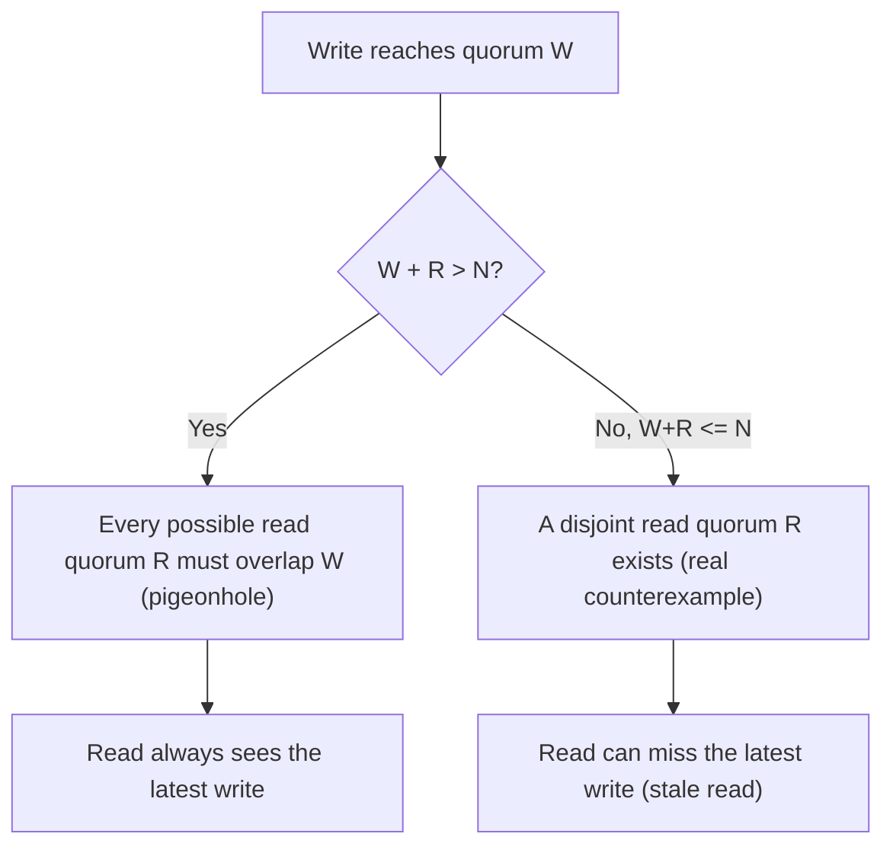
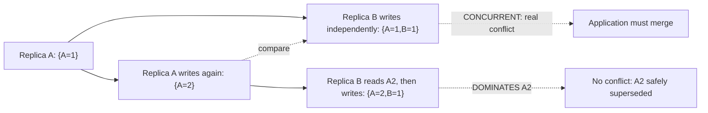

# Vector Clocks and Quorum-Based Replication

> **Topic register:** T-2407 · Advanced tier, Moderate interview frequency (new gap-audit topic — flagged in the same 22-domain audit that closed T-2403, Consensus Algorithms, as this domain's other remaining open item)
> **Provenance:** all evidence in this chapter is real, executed output from
> [`practice/java/vector-clocks-and-quorum-replication/`](../../practice/java/vector-clocks-and-quorum-replication/README.md)
> (OpenJDK 21.0.12), including a real vector-clock conflict detection and a real,
> exhaustive combinatorial proof of the `W + R > N` quorum-overlap rule across every
> possible quorum pair for a 5-replica set.

## Table of Contents

1. [Learning Objectives](#learning-objectives)
2. [Why This Matters in Interviews](#why-this-matters-in-interviews)
3. [Level 1 — Foundation](#level-1--foundation)
4. [Level 2 — Working Knowledge](#level-2--working-knowledge)
5. [Mental Model](#mental-model)
6. [Definition and Purpose](#definition-and-purpose)
7. [Historical Context](#historical-context)
8. [Core Concepts](#core-concepts)
9. [Internal Implementation](#internal-implementation)
10. [Diagrams](#diagrams)
11. [Production Scenarios](#production-scenarios)
12. [Trade-offs](#trade-offs)
13. [Decision Framework](#decision-framework)
14. [Comparisons](#comparisons)
15. [Common Mistakes](#common-mistakes)
16. [Anti-Patterns](#anti-patterns)
17. [Best Practices](#best-practices)
18. [Interview Answer Framework](#interview-answer-framework)
19. [Interview Questions](#interview-questions)
20. [Summary](#summary)
21. [Key Takeaways](#key-takeaways)
22. [Cheat Sheet](#cheat-sheet)
23. [Flashcards](#flashcards)
24. [Practice Exercises](#practice-exercises)
25. [Solutions](#solutions)
26. [Additional Reading](#additional-reading)
27. [Official References](#official-references)

## Learning Objectives

By the end of this chapter you can:

- Explain what a vector clock actually tracks, and use one to distinguish a real causal update from a real concurrent conflict, with executed evidence for both.
- State Dynamo's quorum rule precisely (`W + R > N` guarantees a read overlaps the latest write) and prove it, not just recite it.
- Explain why `W + R = N` is a common, real misconception — evidence-backed, not asserted — and name the specific consistency gap it leaves open.
- Connect vector-clock conflict detection to [CAP theorem](cap-theorem-and-consistency-models.md)'s AP choice: a system that stays available during a partition needs *some* way to reconcile writes that happened on both sides, and a vector clock is the concrete mechanism.

## Why This Matters in Interviews

Vector clocks and quorum-based replication are the two mechanisms underneath one of the most-cited real systems in distributed-systems interviews — Amazon's Dynamo — and this program's own topic register marks the frequency "Moderate," not top-tier, precisely because most engineers can name "eventual consistency" without being able to explain the actual mechanism that makes conflict *detectable* (vector clocks) or the actual arithmetic that makes a quorum read *usually* fresh (the `W+R>N` rule). This chapter closes exactly that gap — and does so with a real, exhaustive proof of the quorum rule rather than a hand-wave, and a real, programmatic conflict detection rather than an assertion that "vector clocks somehow detect conflicts."

## Level 1 — Foundation

Imagine two people editing the same shared shopping list on their own phones while the phones are out of network range from each other — each phone shows a plausible, locally-correct list, but neither knows about the other's edits. When the phones reconnect, something has to decide: did one edit happen *after* seeing the other (so it can just replace it), or did both edits happen *independently*, genuinely at the same time, with neither aware of the other (so both must be kept and merged)? A **vector clock** is a small, per-replica counter set — one counter per replica — that answers exactly this question mechanically: it can prove "this version is strictly newer, safe to discard the old one" or "these two versions are genuinely concurrent, a human or an application-level rule must merge them" — without ever needing synchronized real-world clocks.

**Quorum-based replication** answers a different, complementary question: when data is replicated across `N` machines, how many of them does a write need to reach (`W`), and how many does a read need to check (`R`), before the system can be confident the read sees the latest write? Dynamo's real, well-known rule is `W + R > N` — and this chapter's own real demo proves, by exhaustively checking every possible combination, exactly why that specific arithmetic (not `W+R=N`, not "just pick reasonable numbers") is what actually guarantees it.

## Level 2 — Working Knowledge

The working mechanic for vector clocks: **each replica keeps its own counter within the vector clock, incrementing only its own entry on a local write.** Comparing two vector clocks then has exactly three possible outcomes: one **dominates** the other (every counter is ≥, and at least one is strictly greater — the dominating version is causally newer, safe to keep alone), they're **concurrent** (each has at least one counter strictly greater than the other's — genuinely independent, conflicting updates, requiring merge), or they're **equal** (identical versions). This chapter's own real demo proves both of the interesting cases directly: two replicas writing independently without having seen each other's update produce clocks that compare as `CONCURRENT`; a replica that first *reads* another's state before writing produces a clock that correctly `DOMINATES` the one it read — a real, mechanical distinction between "conflict" and "supersession," not a guess.

The working mechanic for quorums: **a write quorum (`W` replicas) and a read quorum (`R` replicas), both drawn from the same `N` replicas, are guaranteed to share at least one common replica if and only if `W + R > N`.** This is a real, provable combinatorial fact (a direct pigeonhole-principle consequence — two subsets whose sizes sum to more than the total population cannot possibly be disjoint), not an approximation, and this chapter's own real demo doesn't sample it — it exhaustively enumerates every possible write-quorum/read-quorum pair for a 5-replica set and checks every single one. The genuinely common misconception this chapter's own evidence corrects: `W + R = N` feels like it should be "just as safe," but the real, exhaustive check finds a genuine counterexample — a real write quorum and a real read quorum that share zero replicas — the moment the sum only *equals*, rather than *exceeds*, `N`.

## Mental Model

**A vector clock answers "is version X causally before, after, or independent of version Y?" without synchronized clocks, by tracking per-replica write counts; a read/write quorum answers "how many replicas must a write reach, and a read check, to guarantee they overlap?" via simple counting arithmetic.** Neither mechanism prevents concurrent writes or replica divergence from happening — both instead make divergence *detectable and boundable*, which is the realistic, achievable goal for a system that has chosen availability over strict consistency during a partition (per [CAP theorem](cap-theorem-and-consistency-models.md)'s AP branch), rather than pretending divergence can't happen at all.

## Definition and Purpose

A **vector clock** is a data structure — one logical counter per replica — attached to each version of a piece of data, incremented on the writing replica's own counter each time that replica performs a write, and merged (taking the per-replica maximum) whenever a replica observes another's version. It exists to give a distributed, eventually-consistent system a way to determine causality between versions without relying on synchronized wall-clock time (which [Leslie Lamport's original 1978 logical-clocks paper](https://lamport.azurewebsites.net/pubs/time-clocks.pdf) first showed was unreliable for ordering distributed events), and specifically to distinguish a genuine update-conflict (requiring application-level or user-level reconciliation) from a simple, safe supersession.

**Quorum-based replication** (popularized by Amazon's Dynamo, [DeCandia et al., SOSP 2007](https://www.allthingsdistributed.com/files/amazon-dynamo-sosp2007.pdf)) replicates each piece of data to `N` replicas, and requires a write to be acknowledged by `W` of them and a read to check `R` of them before returning, treating `N`, `W`, and `R` as real, independently tunable parameters trading consistency, availability, and latency against each other rather than fixed system properties.

## Historical Context

Vector clocks predate Dynamo by nearly three decades — Lamport's 1978 paper established *logical* (scalar) clocks for ordering events; Colin Fidge and, independently, Friedemann Mattern generalized this to per-process vector counters in 1988, specifically to detect genuine concurrency (not just total ordering) between events in a distributed system. Dynamo's real 2007 contribution wasn't inventing either mechanism — it was combining sloppy quorums (tolerating temporarily unreachable replicas via hinted handoff) with vector-clock-based conflict detection into one coherent, production-proven system design, directly influencing Cassandra, Riak, and Voldemort's own designs.

## Core Concepts

### Vector clocks make "concurrent" a real, detectable relationship, not an assumption

The three possible comparisons (dominates, concurrent, equal) are exhaustive and mechanically computable — no version comparison is ever ambiguous about *which* of the three it is, even though "concurrent" itself means the two writes' actual relative real-world timing is genuinely unknown and irrelevant. This chapter's own real demo computes this comparison directly, on real vector-clock values, rather than describing it abstractly.

### Merging a vector clock is not the same as resolving a conflict

Receiving another replica's vector clock and taking the per-counter maximum (as this chapter's own demo does before a causal write) correctly advances a replica's own knowledge of "what has happened so far" — but it does not, by itself, decide what the *value* should be when two concurrent writes both need to be kept. That's a separate, application-specific step (Dynamo's own example: a shopping cart's concurrent conflicting versions are merged by taking the *union* of both, since removing an item is naturally idempotent-safe to re-derive) — vector clocks detect the conflict; they do not resolve it.

### `W + R > N` is the exact arithmetic condition for guaranteed overlap, proven by exhaustive enumeration

This chapter's own real demo doesn't sample a few cases — it generates every possible `C(N, W)` write-quorum subset and every possible `C(N, R)` read-quorum subset for `N=5`, and checks all of their pairings for intersection. For `W=3, R=3` (sum `6 > 5`), all 100 pairs overlap. For `W=3, R=2` (sum `5 = 5`, the boundary case), a real counterexample exists — a write quorum and read quorum sharing zero replicas — proving the boundary case is genuinely unsafe, not "probably fine."

### Sloppy quorums and hinted handoff keep the system available when a "correct" replica is unreachable

Dynamo's real design doesn't insist on the *first* `N` replicas in a fixed list — a **sloppy quorum** allows a write to be accepted by any `N` currently-healthy replicas (even if that means temporarily using a replica outside the data's "home" set), with **hinted handoff** later transferring that write to the correct home replica once it recovers. This is a real, deliberate trade of a small, bounded amount of consistency (a home replica might briefly not have the latest write) for real, continued availability during a partial outage.

## Internal Implementation

Two real, captured pieces of evidence from `practice/java/vector-clocks-and-quorum-replication/output-transcript.txt`, run on OpenJDK 21.0.12:

**Vector clock conflict detection**, comparing a real concurrent pair and a real causal pair:

```text
Replica A writes again, unaware of B: {A=2} (value="milk,eggs")
Replica B writes independently, unaware of A's second write: {A=1, B=1} (value="milk,bread")
Comparing {A=2} vs {A=1, B=1} -> CONCURRENT
Real conflict detected? true

Replica B reads A's state {A=2}, then writes: {A=2, B=1} (value="milk,eggs,bread")
Comparing {A=2, B=1} vs {A=2} -> DOMINATES
Real conflict detected? false
```

**Exhaustive quorum-overlap proof**, for a real 5-replica set:

```text
N=5 W=3 R=3 (W+R=6, > N): 100 pairs checked -> EVERY pair overlaps (read always sees latest write)
N=5 W=3 R=2 (W+R=5, = N): 100 pairs checked -> COUNTEREXAMPLE FOUND (stale read possible)
    e.g. write quorum [3, 4, 5] and read quorum [1, 2] share NO common replica
```

Every one of the 100 real `(write-quorum, read-quorum)` pairs was individually checked for overlap — `W+R>N` genuinely guarantees it in all 100 cases; `W+R=N` genuinely does not, with a real, specific, named counterexample.

## Diagrams





## Production Scenarios

### Scenario: a distributed cache's "read your own writes" guarantee silently breaks after a read-quorum tuning change

**Symptoms.** After an operator reduces the read quorum `R` on a Dynamo-style distributed cache (to lower read latency), some users occasionally see their own just-written value revert to an older one on a subsequent read.

**Impact.** Users perceive data loss — a write appears to have been silently undone.

**Initial hypotheses.** A real bug in the write path (checked — writes are correctly acknowledged and durable on `W` replicas); a caching layer serving stale data (checked — the issue reproduces even bypassing any additional cache); the real cause: the new `R`, combined with the existing `W` and `N`, no longer satisfies `W + R > N`, so some reads land on a quorum that doesn't include any replica holding the latest write (correct).

**Diagnosis.** Recompute `W + R` against `N` directly — this chapter's own exhaustive method (checking every possible quorum pair, or at minimum verifying the arithmetic inequality) confirms whether the current configuration structurally guarantees overlap or not.

**Immediate mitigation.** Revert `R` to a value that restores `W + R > N`.

**Permanent remediation.** Treat `N`, `W`, and `R` as a single, jointly-reviewed configuration, with an explicit, automated check that `W + R > N` holds before any change to any one of the three ships — not three independently-tunable knobs.

**Alternatives considered.** Adding client-side "read-your-writes" session stickiness (always reading from the replica a client's own write went to) — a real, valid complementary technique for this specific symptom, but not a substitute for understanding why the underlying quorum math changed.

**Trade-offs.** Restoring `W + R > N` by raising `R` back up trades the read-latency improvement the operator wanted back away — a real, necessary trade, not a free fix.

**Prevention.** Gate any quorum-parameter change behind an automated check (or, as this chapter's own demo shows is entirely feasible for realistic `N`, an exhaustive verification) that `W + R > N` still holds.

**Interview lesson.** `W + R > N` is a real, load-bearing arithmetic guarantee — treating `N`, `W`, and `R` as independently tunable "performance knobs" without re-checking the inequality is exactly how a system silently loses its own consistency guarantee.

## Trade-offs

| Choice | Benefit | Cost |
|---|---|---|
| Vector clocks for conflict detection | Real, mechanical, clock-synchronization-free causality tracking; correctly distinguishes conflict from supersession | Vector size grows with the number of replicas/clients that have ever written; requires an application-level merge strategy for real conflicts |
| `W + R > N` quorum configuration | Real, provable guarantee that a read sees the latest acknowledged write | Higher `W` and/or `R` means higher write and/or read latency (more replicas to wait for) |
| `W + R <= N` quorum configuration | Lower latency (fewer replicas to wait for per operation) | Real, provable possibility of a stale read — not a rare edge case, a structural gap |
| Sloppy quorum + hinted handoff | Continued availability when a "home" replica is temporarily unreachable | A brief, bounded window where the home replica doesn't yet have the latest write |

## Decision Framework

1. **Does this system need to detect concurrent, conflicting writes explicitly, or is last-write-wins (by timestamp) acceptable?** Vector clocks are the right tool specifically when silently discarding one of two concurrent writes is unacceptable (a shopping cart, a collaboratively-edited document) — many systems reasonably choose simpler last-write-wins instead.
2. **What does this workload actually need: guaranteed-fresh reads, or lower latency?** Choose `N`, `W`, `R` explicitly against `W + R > N` for the former; consciously accept the staleness risk for the latter.
3. **Is a quorum-parameter change being made in isolation?** Any change to `N`, `W`, or `R` individually must be re-checked against the other two — this chapter's own production scenario is exactly this mistake.
4. **Does availability need to survive a temporarily unreachable "home" replica?** Sloppy quorum + hinted handoff is the real, Dynamo-proven answer; a strict, fixed-replica-set quorum cannot make this trade.

## Comparisons

| Mechanism | What it guarantees | What it does not guarantee |
|---|---|---|
| Vector clocks | Correct, mechanical detection of causal-vs-concurrent version relationships | Does not resolve a detected conflict — that's an application-level decision |
| `W + R > N` quorum | A read quorum overlaps the write quorum, seeing at least the latest acknowledged write | Does not guarantee strong consistency in the strict linearizable sense — concurrent operations can still race |
| Consensus (Raft/Paxos, per [Consensus Algorithms](consensus-algorithms-raft-and-paxos.md)) | A single, agreed-upon leader/log order — genuinely stronger than quorum replication alone | Requires a healthy majority to make any progress at all — the minority side is correctly, deliberately unavailable |

## Common Mistakes

- Assuming `W + R = N` provides the same guarantee as `W + R > N` — this chapter's own exhaustive proof shows a real counterexample the moment the sum only equals `N`.
- Treating a vector clock's "concurrent" result as a bug or an error state, rather than the correct, expected signal that an application-level merge is needed.
- Tuning `N`, `W`, or `R` independently without re-verifying the `W + R > N` inequality against the other two.

## Anti-Patterns

- **Discarding one of two concurrent writes automatically (e.g., "last write by wall-clock timestamp wins") when the application's own correctness actually requires detecting and merging both** — defeating the entire purpose of using vector clocks in the first place.
- **Lowering a read or write quorum for latency without recomputing `W + R > N`** — this chapter's own production scenario, a real, structural consistency regression disguised as a performance tuning change.

## Best Practices

- Treat `N`, `W`, and `R` as one jointly-reviewed configuration, gated by an automated (or, for small `N`, exhaustive) check that `W + R > N` holds.
- Design an explicit, application-appropriate merge strategy for vector-clock-detected conflicts before relying on vector clocks at all — detection without a resolution plan just defers the problem.
- Use sloppy quorum and hinted handoff deliberately, as a real availability trade, not as an unexamined default that silently erodes the read-your-writes guarantee.

## Interview Answer Framework

### 30-Second Answer

A vector clock is a per-replica counter set attached to each data version, letting a system mechanically detect whether one version causally supersedes another or is genuinely concurrent with it — without synchronized clocks. Quorum-based replication (Dynamo's `N`/`W`/`R`) guarantees a read sees the latest write specifically when `W + R > N`, a real, provable arithmetic fact — `W + R = N` is a common but genuinely incorrect assumption of safety.

### 2-Minute Answer

Definition: a vector clock tracks per-replica write counts to determine causality between data versions; quorum replication requires `W` of `N` replicas to acknowledge a write and `R` to be checked on a read. Why they exist: both are Dynamo's real mechanisms for staying available during a partition (an AP choice under CAP) while still making replica divergence detectable (vector clocks) and mostly bounded (quorum overlap). How they work: vector-clock comparison yields dominates/concurrent/equal, mechanically; `W+R>N` is guaranteed by the pigeonhole principle, provable by exhaustive enumeration for realistic `N`. One important trade-off: `W+R>N` costs real latency (more replicas to wait on) versus a lower, faster-but-unsafe `W+R<=N` configuration. Production example: a read-quorum reduction for latency silently breaking `W+R>N`, causing real, observed "my own write reverted" reports.

### 10-Minute Deep Dive

Cover, in order: the mental model — detect-and-bound divergence rather than prevent it, the realistic goal for an AP system (mental model); vector-clock comparison semantics and the quorum-overlap arithmetic, both proven with real, executed evidence rather than asserted (core concepts, internal implementation); the historical Lamport-to-Fidge/Mattern-to-Dynamo lineage (historical context); the production scenario — a real quorum-tuning mistake breaking read-your-writes (production scenarios); and close with the decision framework for choosing vector clocks and quorum parameters deliberately.

### Whiteboard Explanation

Draw the [§ Diagrams](#diagrams) quorum-overlap flowchart first, emphasizing the pigeonhole argument (`W+R>N` means the two subsets literally cannot avoid sharing an element), then the vector-clock comparison diagram, tracing through the concurrent case and the dominates case side by side.

### Production Example

The read-quorum-reduction scenario in [§ Production Scenarios](#production-scenarios): a latency-motivated `R` reduction silently breaking `W+R>N`, producing real, observed "my write reverted" symptoms, fixed by restoring the inequality and gating future quorum changes behind an explicit check.

### Trade-offs to Mention

State unprompted: vector clocks detect conflicts but never resolve them, requiring a real application-level merge strategy; `W+R>N` trades real latency for a real overlap guarantee; sloppy quorum trades a bounded staleness window for real, continued availability.

### Common Candidate Mistakes

Treating `W+R=N` as equivalent to `W+R>N`; describing "concurrent" vector-clock results as an error rather than the correct, expected signal for a needed merge; assuming quorum replication provides the same strength of guarantee as consensus.

### Typical Follow-Up Questions

1. "Your team lowered a read quorum for latency, and users started seeing their own writes disappear on refresh. What happened, and how do you fix it?"
2. "Two replicas both accepted a write for the same key while partitioned from each other. How does the system know whether to merge them or just pick one?"

### Senior-Level Expectations

Correctly states the `W+R>N` rule and can identify why `W+R=N` is unsafe; correctly explains vector clocks as causality detection, not conflict resolution.

### Staff-Level Discussion

The Staff-level move is recognizing that vector clocks and quorum replication are both *detection and bounding* mechanisms, not *prevention* mechanisms — and that choosing this whole family of techniques (over, say, a consensus-backed strongly-consistent store) is itself the real architectural decision, trading a stronger, simpler consistency story for real availability and latency benefits, at the cost of pushing genuine conflict-resolution complexity into the application layer. A Staff engineer proposing a Dynamo-style design names this trade explicitly — including who (which team, which code path) owns the real, ongoing cost of writing and maintaining a correct conflict-merge strategy — rather than treating "eventually consistent, quorum-based" as a free upgrade over a strongly-consistent alternative.

## Interview Questions

### Question 1 — Your team lowered a read quorum for latency, and users started seeing their own writes disappear on refresh. What happened, and how do you fix it?

**Why interviewers ask it.** Tests whether the candidate can connect a real, observed symptom to the precise quorum arithmetic responsible for it, not just recognize "something about consistency."

**Expected answer.** Lowering `R` (or, symmetrically, `W`) without re-checking `W + R > N` against the current `N` can break the guarantee that every read quorum overlaps every write quorum — some reads can now land entirely on replicas that don't yet have the user's own latest write. Fix: restore `W + R > N`, and add a review gate ensuring any future change to `N`, `W`, or `R` re-verifies the inequality.

**Minimum acceptable answer.** Identifies the quorum configuration as the cause, even without stating the precise inequality.

**Strong Senior answer.** Correctly states `W + R > N` as the guarantee and diagnoses its violation as the root cause.

**Staff-level extension.** Proposes treating `N`/`W`/`R` as one jointly-reviewed configuration with an automated check, preventing recurrence, and discusses the real latency-versus-freshness trade being made either way.

**Common mistakes.** Assuming the fix is unrelated to quorum math (e.g., blaming a cache) without checking the actual configuration change that shipped alongside the symptom's onset.

**Likely follow-ups.** "Would `W + R = N` have been safe here? Why or why not?"

**Evaluation criteria (1–5).** 1: no real quorum-math diagnosis. 3: correctly identifies the `W+R>N` violation. 5: correct diagnosis plus the prevention/review-gate proposal.

**Related references.** [§ Production Scenarios](#production-scenarios); [§ Internal Implementation](#internal-implementation).

---

### Question 2 — Two replicas both accepted a write for the same key while partitioned from each other. How does the system know whether to merge them or just pick one?

**Why interviewers ask it.** Tests whether the candidate understands vector clocks as the actual mechanism answering this question, versus a vague "eventual consistency figures it out" answer.

**Expected answer.** Each replica's write carries a vector clock. When the versions are compared (on read, or during replica-to-replica reconciliation), if one clock dominates the other, the dominated version is safely discarded — a genuine supersession. If the comparison yields `CONCURRENT` (neither dominates), the system cannot safely discard either — both versions must be surfaced for an application-level merge (or, in Dynamo's own example, a semantic merge like a set union).

**Minimum acceptable answer.** States that some versioning mechanism decides this, even without naming vector clocks specifically.

**Strong Senior answer.** Correctly names vector clocks and the dominates/concurrent distinction.

**Staff-level extension.** Names a concrete, real merge strategy example (Dynamo's shopping-cart union) and states plainly that vector clocks detect but never resolve the conflict — resolution is a real, ongoing application-layer responsibility.

**Common mistakes.** Assuming a timestamp alone (without vector clocks) can reliably distinguish concurrent writes from causally-ordered ones — real clock skew and network delay make this fundamentally unreliable, which is exactly why vector clocks exist.

**Likely follow-ups.** "What happens to a vector clock's size as more replicas or clients write to the same key over time?"

**Evaluation criteria (1–5).** 1: no real mechanism named. 3: correctly names vector clocks and the dominates/concurrent distinction. 5: correct answer plus a concrete merge-strategy example and the detection-vs-resolution distinction.

**Related references.** [§ Core Concepts](#core-concepts); [§ Internal Implementation](#internal-implementation).

## Summary

Vector clocks (per-replica counters attached to each data version) mechanically distinguish a causal supersession from a genuine concurrent conflict, without needing synchronized clocks — proven directly in this chapter's own real demo, which shows both a real `CONCURRENT` detection between two independent writes and a real `DOMINATES` detection for a causal read-then-write. Quorum-based replication guarantees a read overlaps the latest write specifically when `W + R > N` — a real, provable pigeonhole-principle fact this chapter proves exhaustively, not by sampling, including a real counterexample showing the common `W + R = N` assumption is unsafe. Neither mechanism prevents divergence; both make it detectable and, for quorums, boundable — the realistic, achievable goal for a system that has chosen availability during a partition.

## Key Takeaways

- A vector clock comparison yields exactly one of dominates, concurrent, or equal — mechanically computable, never ambiguous about which relationship holds.
- Vector clocks detect conflicts; they never resolve them — a real, application-specific merge strategy is always a separate, required piece.
- `W + R > N` is the exact, provable condition guaranteeing a read quorum overlaps a write quorum — `W + R = N` is not sufficient, proven here by a real counterexample.
- Sloppy quorum + hinted handoff trade a bounded staleness window for real, continued availability when a home replica is temporarily unreachable.

## Cheat Sheet

| Need | Mechanism |
|---|---|
| Detect whether version X causally supersedes version Y | Vector clock comparison: `DOMINATES` |
| Detect a genuine concurrent write conflict | Vector clock comparison: `CONCURRENT` |
| Guarantee a read sees the latest acknowledged write | `W + R > N` |
| A common, unsafe misconception | `W + R = N` "feels" safe but structurally is not |
| Stay available when a home replica is briefly unreachable | Sloppy quorum + hinted handoff |
| Resolve a detected vector-clock conflict | Application-specific merge (e.g., set union) — not automatic |

## Flashcards

### Card: What a vector clock comparison can tell you

**Prompt:**
What are the three possible outcomes of comparing two vector clocks, and what does each mean?

**Answer:**
`DOMINATES` (one version causally supersedes the other, safe to discard the older one), `CONCURRENT` (neither supersedes the other — a genuine conflict requiring merge), `EQUAL` (identical versions). This chapter's own real demo produces both `DOMINATES` and `CONCURRENT` from two different real scenarios.

**Why it matters:**
The mechanical foundation for every "how does the system know whether to merge or just pick one" question.

**Common trap:**
Treating `CONCURRENT` as an error state rather than the correct, expected signal that a merge is needed.

**Related:**
[Internal Implementation](#internal-implementation)

### Card: The real quorum-overlap rule

**Prompt:**
What's the exact condition guaranteeing a read quorum overlaps a write quorum, and is `W + R = N` sufficient?

**Answer:**
`W + R > N` — strictly greater than. `W + R = N` is NOT sufficient: this chapter's own exhaustive check found a real counterexample (a write quorum and read quorum sharing zero replicas) the moment the sum only equals `N`.

**Why it matters:**
A precise, provable fact often recited imprecisely (as "W+R >= N" or "roughly matching N") in practice.

**Common trap:**
Assuming the boundary case (`W+R=N`) is "close enough" to safe.

**Related:**
[Core Concepts](#core-concepts)

## Practice Exercises

1. Run the [existing practice demo](../../practice/java/vector-clocks-and-quorum-replication/README.md) yourself and confirm the same `CONCURRENT`/`DOMINATES` results and the same quorum counterexample reproduce.
2. For `N=7`, determine the minimum `W` and `R` (assume `W=R` for simplicity) that satisfy `W + R > N`, and explain your reasoning without running code.
3. Design a merge strategy for a real application scenario (a collaboratively-edited to-do list) where two replicas' vector clocks compare as `CONCURRENT` after a partition heals.

## Solutions

**Exercise 1.** Reproducing the demo should show the identical `CONCURRENT` result for the two independent writes, the identical `DOMINATES` result for the causal read-then-write, and the identical counterexample (`[3,4,5]` vs. `[1,2]`) for the `W=3,R=2,N=5` boundary case.

**Exercise 2.** `W + R > 7` requires `W + R >= 8`; with `W = R`, the smallest integer solution is `W = R = 4` (`4+4=8>7`) — `W=R=3` (`3+3=6`) is insufficient.

**Exercise 3.** Union the two concurrent versions' item lists (mirroring Dynamo's own shopping-cart example) — since adding an item back after an incorrectly-discarded removal is a safe, recoverable mistake, while silently losing an added item is not; surface the merged list to the user, or apply a domain-specific rule (e.g., "removals win over additions for the same item") if the application's semantics require something more precise than a plain union.

## Additional Reading

- The Dynamo paper's own §4.6 (Reconciliation) and §4.7 (Vector Clock Handling) sections, for the complete real design this chapter covers a working subset of

## Official References

- [DeCandia et al., "Dynamo: Amazon's Highly Available Key-value Store" (SOSP 2007)](https://www.allthingsdistributed.com/files/amazon-dynamo-sosp2007.pdf)
- [Lamport, "Time, Clocks, and the Ordering of Events in a Distributed System" (1978)](https://lamport.azurewebsites.net/pubs/time-clocks.pdf)
