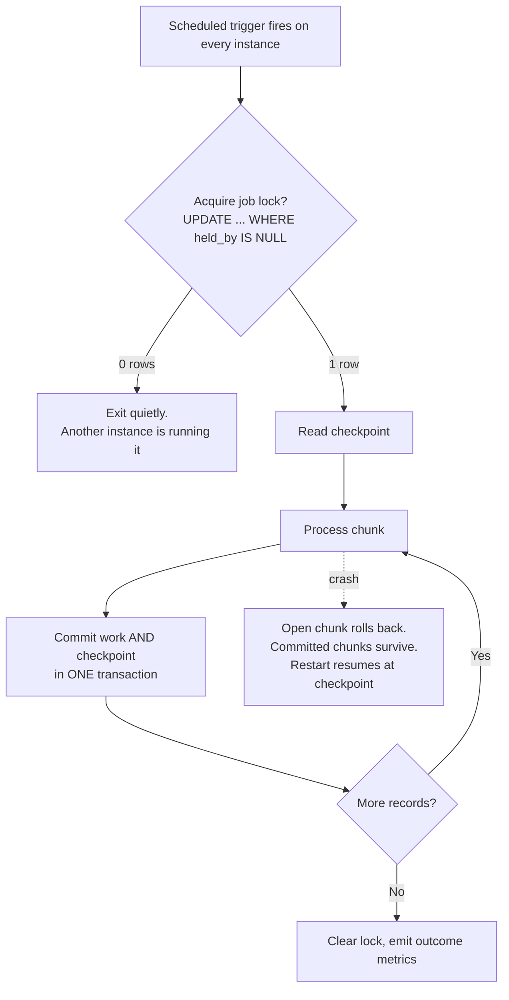
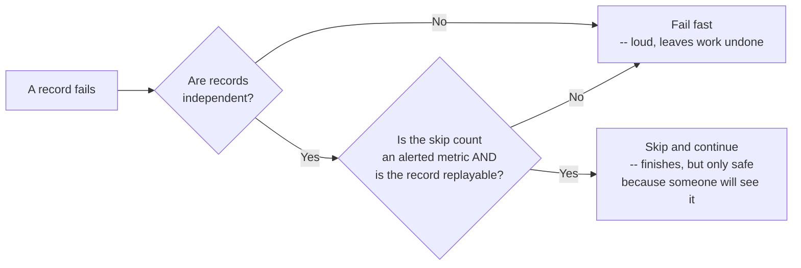

# Batch and Scheduled Job Design

> **Topic register:** T-2443 · Core tier · High interview frequency [H]
> **Provenance:** every number below is real, executed output from
> [`practice/java/system-design/batch-job-design/`](../../practice/java/system-design/batch-job-design/README.md)
> — a real H2 2.3.232 in-memory database on OpenJDK 21.0.12, where the job lock
> is a genuine conditional `UPDATE`, the checkpoint commits in the same
> transaction as its chunk, and correctness is measured by counting rows in a
> side-effect table rather than by trusting the job's own reporting.

## Table of Contents

1. [Learning Objectives](#learning-objectives)
2. [Why This Matters in Interviews](#why-this-matters-in-interviews)
3. [Level 1 — Foundation](#level-1-foundation)
4. [Level 2 — Working Knowledge](#level-2-working-knowledge)
5. [Mental Model](#mental-model)
6. [Definition and Purpose](#definition-and-purpose)
7. [Core Concepts](#core-concepts)
8. [Internal Implementation](#internal-implementation)
9. [Diagrams](#diagrams)
10. [Java Examples](#java-examples)
11. [Production Scenarios](#production-scenarios)
12. [Trade-offs](#trade-offs)
13. [Decision Framework](#decision-framework)
14. [Common Mistakes](#common-mistakes)
15. [Anti-Patterns](#anti-patterns)
16. [Best Practices](#best-practices)
17. [Interview Answer Framework](#interview-answer-framework)
18. [Interview Questions](#interview-questions)
19. [Summary](#summary)
20. [Key Takeaways](#key-takeaways)
21. [Cheat Sheet](#cheat-sheet)
22. [Flashcards](#flashcards)
23. [Practice Exercises](#practice-exercises)
24. [Solutions](#solutions)
25. [Additional Reading](#additional-reading)
26. [Official References](#official-references)

---

## Learning Objectives

By the end of this chapter you can:

- Explain what happens to a `@Scheduled` job when the service scales to three replicas, and fix it with one SQL statement.
- Choose a chunk size as a durability decision rather than a performance one, and say what a crash costs at that size.
- Design a job that can be rerun safely after any failure, and name the property that makes rerunning safe.
- Choose between fail-fast and skip for a bad record, and state the condition that makes skip acceptable.
- Say what a batch job must emit for anyone to know it is healthy, given that "it finished" is not the same as "it worked."

## Why This Matters in Interviews

Every backend system has work that does not happen inside a request: nightly reconciliation, report generation, expiring stale records, retrying failed payments, backfilling a new column. It is a large fraction of real backend engineering and a small fraction of how backend engineering is taught, which makes it a good discriminator.

The questions are specific and the failure modes are concrete: *your nightly job runs on three pods — what happens?* *The job crashed four hours in — what do you do?* *One record in the file is malformed — does the job stop?* A candidate who has only built request/response services usually has no answer to the first, and the honest reason is that the bug does not exist until the second replica is deployed.

It also carries unusual weight at the target companies. Enterprise Java shops run large amounts of batch, and a candidate who can reason about restartability and exactly-once execution without reaching for a framework is demonstrating exactly the judgment those roles need.

## Level 1 — Foundation

A **batch job** is work done over a set of records, on a schedule or on demand, rather than in response to a user's request. Nothing about it is exotic: read some rows, do something to each, write results.

What makes it different from a request is the two things a request never has to worry about.

First, **it is long**. A web request that takes six hours does not exist; a job that takes six hours is ordinary. Anything that can fail during six hours will eventually fail during six hours — a deploy, a node eviction, a database failover, an out-of-memory kill. So "what happens when this dies halfway through" is not a corner case, it is the normal case seen often enough to matter.

Second, **nobody is waiting**. A failed request returns an error to a user who notices. A failed job returns an error to nobody. If it fails silently, it can keep failing silently for weeks, and the way teams usually find out is that someone downstream asks why a number looks wrong.

Both differences point the same direction: a job has to be designed to be **interrupted and restarted**, and to be **loud about its own outcome**, because neither comes for free.

## Level 2 — Working Knowledge

Four decisions define a batch job, and they are largely independent of each other and of any framework.

**Who runs it.** On a single server this is not a question. The moment the service has more than one instance and the schedule lives in the application, every instance runs the job at the same moment. This is measured below, and the result is not subtle.

**How often it commits.** Processing 10 million rows in one transaction and committing after each row are both defensible; everything about the job's failure behaviour follows from where between them you land.

**What it does after a crash.** Start over, or resume. Resuming requires knowing where it got to, which requires having written that down durably as it went.

**What it does with a bad record.** Stop, or skip and keep going. Both are reasonable and both have a failure mode.

A job that has answered these four explicitly is a designed job. One that has not has answered them anyway, by default, usually with "all instances," "one transaction," "start over," and "crash" — which is a coherent design for a job that runs on one machine over a small dataset, and a bad one for anything else.

## Mental Model

Think of a batch job as **a long walk carrying a ledger**, not as a function call.

A function call either returns or throws, and that is the whole story. A long walk can be interrupted at any point, and the only thing that determines whether you can continue from where you stopped — rather than starting from the trailhead — is whether you were writing down your position as you went, in something that survives you falling over.

The ledger has to be written at the same moment as the step, not after a batch of steps you are still holding in your head. Progress you remember but have not recorded is progress you will lose.

And because nobody is walking with you, arriving is not the same as having been seen to arrive. A job that completes and tells nobody, and a job that dies quietly, look identical from outside.

## Definition and Purpose

**Batch and scheduled job design** is the set of decisions that determine how work outside the request path behaves when it is interrupted, duplicated, or fed bad input.

It exists as a distinct concern because the request/response patterns most backend code is built around do not transfer. A request is short, has a waiting client, runs once per invocation, and can reasonably fail by returning an error. A job is long, has no client, may be started concurrently by several instances, and cannot usefully "return an error" to anyone who is not looking.

The mechanics are covered elsewhere in this repository and are deliberately not restated here: `@Scheduled`'s thread model and the `TaskScheduler` in [Auto-Configuration and Bean Lifecycle](../05-spring/auto-configuration-and-bean-lifecycle.md), JDBC batching in [Hibernate Flush Modes and Batch Writes](../06-databases/hibernate-flush-modes-and-batch-writes.md), and idempotency as a general property in [Idempotency at System Edges](idempotency.md). This chapter owns what those parts do not: the shape of the job itself.

## Core Concepts

### A scheduled job on N instances runs N times

The default behaviour of an application-level scheduler is to run on every instance that has the code. Three threads standing in for three pods, released together because their cron expressions are identical, against 1,000 invoices:

```text
Unguarded (@Scheduled on every instance) invoices=1000  side_effect rows=3000  workers that ran=3  -> EVERY INVOICE PROCESSED 3x
Guarded by a database lock               invoices=1000  side_effect rows=1000  workers that ran=1  -> correct
```

Every invoice was processed **three times**. Nothing threw, nothing logged an error, and the job reported success on all three instances. If that job sends an email, charges a card, or posts a ledger entry, it did so three times.

The reason this ships so often is that it is invisible until the second replica exists. It works in development, it works in staging on one pod, and it breaks silently the first time someone scales the deployment — which is a change nobody associates with the job.

The fix is one statement:

```sql
UPDATE job_lock SET held_by = ?, locked_at = CURRENT_TIMESTAMP
 WHERE name = ? AND held_by IS NULL
```

Either it matches the free row and returns 1, or it matches nothing and returns 0. The database's own row-level locking makes that atomic across every instance. A job that runs once a night does not need a coordination service; the database already in the system is sufficient, and measured above it produced exactly one worker and exactly 1,000 rows.

The lock needs an expiry — a `locked_at` timestamp plus a maximum hold time — or an instance that dies holding it blocks the job forever. That is the same lease problem [Resilience Patterns](resilience-patterns.md) describes, and it is why the timestamp column exists in the schema above rather than just a boolean.

An alternative worth naming: move the schedule out of the application entirely, into a Kubernetes `CronJob` or an equivalent external scheduler, which starts one pod that exists only to run the job. That removes the problem rather than guarding against it, at the cost of a second deployment artefact and a second place to look when something does not run.

### Chunk size is a durability budget, not a performance setting

The same 10,000 rows, varying only the commit interval:

| chunk size (rows/commit) | duration | worst-case rows lost to a crash |
|---|---|---|
| 1 | 148 ms | 0 |
| 10 | 41 ms | 9 |
| 100 | 30 ms | 99 |
| 1,000 | 21 ms | 999 |
| 10,000 | 16 ms | 9,999 |

Commit cost is per-chunk, so larger chunks are faster — **9.25x** across this range. And the work at risk in a crash is exactly one chunk, by construction.

Framing this as a performance tuning knob leads to the wrong question ("how fast can this go") and therefore to the largest chunk that fits in memory. The right question is "how much repeated work is acceptable after a crash," which usually has an answer in seconds or minutes, and that answer determines the chunk size. A six-hour job committing hourly risks an hour of rework per crash; the same job committing every thousand rows risks seconds.

There is a second cost the table does not show: a chunk is a transaction, and a long transaction holds locks and accumulates undo for its whole duration. On a busy database the biggest chunk is often not the fastest in practice, for reasons that have nothing to do with the job.

### A checkpoint only works if it commits with the work

A 1,000-invoice job crashing at invoice 600, then restarting:

```text
No checkpoint  : attempt 1 inserted 599 rows, then crashed at invoice 600
                 committed after attempt 1: 0  (the whole transaction rolled back)
                 attempt 2 restarted from invoice 1 and committed 1000
                 result: correct, but 1599 units of work were performed to commit 1000

With checkpoint: attempt 1 inserted 599 rows, then crashed at invoice 600
                 committed after attempt 1: 500  (only the open chunk rolled back)
                 checkpoint = 500, so attempt 2 resumed at invoice 501
                 total committed = 1000 across 1000 distinct invoices  -> every invoice processed exactly once
                 work performed to commit 1000: 1099 units (99 wasted)
```

Both end correct, and being precise about that matters. The single-transaction version is **not wrong** — it is wasteful and operationally fragile. It performed 1,599 units of work to commit 1,000, and the same shape applied to a six-hour job means a failure in hour five redoes five hours. The checkpointed version wasted exactly 99 units: the open chunk, and nothing else.

The mechanism is the part that is easy to get wrong. The checkpoint is written **in the same transaction** as the chunk it describes:

```java
mark.setInt(1, id);
mark.executeUpdate();   // checkpoint row
c.commit();             // one commit for BOTH the work and the checkpoint
```

If the two committed separately, a crash between them would leave the checkpoint ahead of the work (rows silently skipped on restart) or behind it (rows reprocessed). Writing progress to a log file, an in-memory field, or a separate service reintroduces exactly the dual-write problem [Distributed Transactions: Saga, Outbox, and 2PC](../10-distributed-systems/distributed-transactions-saga-and-outbox.md) exists to describe.

### Restartable is not the same as idempotent, and you need both

A checkpoint makes a job **restartable**: it resumes rather than repeating. That is an efficiency property.

It does not make the job **safe to rerun**. A crash between the work and its commit, an operator running the job twice, a lock expiring while the holder is still alive but slow — all of these produce a record processed a second time. Restartability reduces how often that happens; it does not make it impossible.

Safety comes from the work itself being idempotent: `UPDATE invoice SET processed = TRUE WHERE id = ? AND processed = FALSE` is safe to run twice, `INSERT INTO ledger ...` is not. For side effects outside the database — emails, payment authorisations, webhooks — safety comes from an idempotency key the downstream system deduplicates on, which is what [Idempotency at System Edges](idempotency.md) covers in full.

The practical test: *if this job is run twice against the same input, is the result identical to running it once?* A job that cannot answer yes is a job that has not been designed for the failure that will eventually happen to it.

### Fail-fast and skip fail in opposite directions

One unprocessable record at position 500 of 1,000:

```text
fail-fast : stopped at invoice 500. processed=499  skipped=0  remaining=500  -> job must be fixed and rerun
skip      : ran to completion.     processed=999  skipped=1  remaining=0    -> job "succeeded"; the skip is only visible if it is counted
```

Neither is correct in general. Fail-fast leaves 500 records unprocessed and is loud about it — appropriate when records are interdependent, or when one bad record suggests the whole input is suspect. Skip finishes the other 999 and reports success — appropriate when records are independent and one malformed row should not block the rest.

The failure mode of skip is the dangerous one, because it looks like success. The dropped record exists only as a counter, and if nothing reads that counter, the failure is invisible permanently. A skip policy is therefore only safe under two conditions: the skip count is an **alerted metric**, and skipped records land somewhere they can be inspected and replayed — the same reasoning, and often the same mechanism, as the dead-letter queue in [Consumer Lag, Backpressure, and DLQ Strategy](../09-messaging-event-driven/consumer-lag-backpressure-and-dlq-strategy.md).

Without both, "the job succeeded" is a claim nobody has checked.

## Internal Implementation

**The lock, in full.** The demo's `acquireLock` is deliberately two statements, and the split matters. An `INSERT` creates the lock row if it does not exist, and a duplicate-key failure there is expected and harmless — another instance won the race to create it. The real acquisition is the conditional `UPDATE`, whose return value of 1 or 0 *is* the lock result. No `SELECT ... FOR UPDATE`, no application-level check-then-act, and therefore no window between checking and taking.

**Why the checkpoint is a `MERGE`.** `MERGE INTO job_checkpoint (name, last_done_id) KEY (name) VALUES ('nightly', ?)` is an upsert: first run inserts, subsequent runs update. Reading it back with `COALESCE(MAX(last_done_id), 0)` makes the first-ever run start at 1 without a special case.

**Where the resume position comes from.** The demo resumes by primary-key ordering — `WHERE id > checkpoint ORDER BY id` — which is correct only because ids are monotonic and the working set does not change under the job. Where neither holds, the two alternatives are a status column on the rows themselves (`WHERE processed = FALSE`, which is self-checkpointing and naturally idempotent) or a claimed-work table. The status-column approach is usually the better default for exactly that reason: it makes "where did I get to" a property of the data rather than a separate thing that can disagree with it.

**What Spring Batch adds.** The concepts above are the ones Spring Batch names: `Job`, `Step`, chunk-oriented processing with a configurable commit interval, a `JobRepository` holding execution state, skip and retry policies, and partitioning for parallel execution. Its real value is the `JobRepository` — durable, queryable execution history and restart-from-last-failure without hand-rolling the checkpoint table — plus the operational surface that comes with it. Its cost is a substantial framework and its own schema. For a single job on a single table, the demo's fifty lines are the honest comparison; for a portfolio of jobs with real operational requirements, re-implementing a `JobRepository` badly is the likelier outcome of avoiding it.

## Diagrams





## Java Examples

The lock — the whole mechanism, with nothing omitted:

```java
// Java 21. Returns true only for the single instance that wins.
boolean acquireLock(String jobName, String instanceId) throws SQLException {
    try (Connection c = dataSource.getConnection()) {
        c.setAutoCommit(false);

        // Create the row if nobody has yet. A duplicate-key failure here is
        // expected and harmless -- another instance created it first.
        try (var ins = c.prepareStatement(
                "INSERT INTO job_lock (name, held_by) VALUES (?, NULL)")) {
            ins.setString(1, jobName);
            ins.executeUpdate();
            c.commit();
        } catch (SQLException duplicateKey) {
            c.rollback();
        }

        // THE lock. One statement, atomic, no check-then-act window.
        try (var upd = c.prepareStatement("""
                UPDATE job_lock
                   SET held_by = ?, locked_at = CURRENT_TIMESTAMP
                 WHERE name = ?
                   AND (held_by IS NULL OR locked_at < ?)
                """)) {
            upd.setString(1, instanceId);
            upd.setString(2, jobName);
            // Lease expiry: reclaim a lock held by an instance that died.
            upd.setTimestamp(3, Timestamp.from(Instant.now().minus(Duration.ofHours(2))));
            int rows = upd.executeUpdate();
            c.commit();
            return rows == 1;
        }
    }
}
```

The chunk loop, with the one detail that makes it correct:

```java
int start = lastCheckpoint() + 1;
int inChunk = 0;

for (int id = start; id <= lastId; id++) {
    process(id);
    if (++inChunk == chunkSize) {
        markCheckpoint(id);   // same connection, same transaction
        connection.commit();  // work and checkpoint commit TOGETHER
        inChunk = 0;
    }
}
if (inChunk > 0) {
    markCheckpoint(lastId);
    connection.commit();
}
```

The self-checkpointing variant, which needs no checkpoint table at all and is idempotent by construction:

```sql
-- "Where did I get to" is a property of the data, so it cannot disagree with it.
UPDATE invoice
   SET processed = TRUE, processed_at = CURRENT_TIMESTAMP
 WHERE id IN (SELECT id FROM invoice WHERE processed = FALSE ORDER BY id LIMIT 100)
```

Prefer this shape when the working set supports it. Running it twice processes nothing the second time, which is exactly the property the four-decision framework is trying to buy.

## Production Scenarios

### Scenario: customers receive three copies of every monthly statement

**Symptoms.** On the first of the month, support receives complaints about duplicate statement emails. The mail provider's dashboard confirms three sends per customer. The job logged success. No errors anywhere.

**Initial hypotheses.** A retry loop in the mail client; a mail-provider duplicate; a bug in the recipient query.

**Evidence collected.** The mail provider shows three distinct API calls per recipient, seconds apart — so this is the application sending three times, not the provider duplicating. Application logs show the job's start line three times, once per pod, at the same second. The deployment was scaled from one replica to three six weeks earlier, for unrelated capacity reasons. The previous month's statements went out once, because the scale-up happened after that run.

**Diagnosis.** The measured default: a `@Scheduled` job runs on every instance. Three replicas, three runs, 3x the side effects. The change that caused it was a replica-count change, which nobody associated with a job, and the first affected run was six weeks after the change.

**Immediate mitigation.** Scale the deployment to one replica before the next run, or disable the schedule and trigger the job manually once.

**Permanent remediation.** Guard the job with a conditional-`UPDATE` lock with a lease expiry — measured above to produce exactly one worker and exactly one pass. Alternatively move the schedule to a Kubernetes `CronJob` so exactly one pod exists to run it.

**Trade-offs.** The database lock keeps everything in one deployment artefact but adds a lease-expiry decision: too short and a slow run gets its lock stolen while still working, too long and a dead instance blocks the job for that duration. An external `CronJob` removes the problem but splits the system across two artefacts.

**Prevention.** Treat "what happens to this on N replicas" as a required review question for any scheduled work. The failure is invisible in every environment that runs one instance, so it will not be caught by testing.

**Interview lessons.** This is the strongest available answer to "tell me about a bug that only appeared in production," because the cause is structural rather than careless, and the fix is one statement.

### Scenario: a six-hour backfill has failed four nights running

**Symptoms.** A backfill populating a new column across a large table is scheduled nightly. Each night it runs for several hours and fails. Four nights in, the column is still empty.

**Initial hypotheses.** A bug in the transformation; a data problem; resource limits.

**Evidence collected.** The job runs as a single transaction over the whole table. Each failure is a different proximate cause — one node eviction, one deploy, one database failover, one out-of-memory kill. Nothing is wrong with the transformation itself: every failure occurred more than four hours in, and the work completed before the failure was rolled back each time.

**Diagnosis.** The job is not failing because of a bug; it is failing because a six-hour window is long enough that *something* will interrupt it, and the all-or-nothing transaction means any interruption discards everything. Measured on the same shape at smaller scale: a crash at 60% completion committed **zero** rows and cost 1,599 units of work to eventually commit 1,000.

**Immediate mitigation.** Convert to chunked commits with a checkpoint, and rerun. The next failure then costs one chunk rather than the whole run, and each night's run resumes rather than restarting — so the backfill completes across several nights even if no single night succeeds end to end.

**Permanent remediation.** Make the update self-checkpointing (`WHERE new_column IS NULL ... LIMIT n`) so progress is a property of the data, and run it as a bounded-batch job triggered repeatedly rather than one long pass. This is the shape [Zero-Downtime Schema Migration](../06-databases/zero-downtime-schema-migration.md) assumes for its migrate phase.

**Trade-offs.** Chunking means the table is in a mixed state for longer — some rows migrated, some not — which the application must tolerate during the transition. That is the same constraint expand-contract already imposes, so it is usually not an additional cost.

**Prevention.** Treat any job whose runtime exceeds a few minutes as one that will be interrupted, and require a checkpoint before it ships. The question at review is not "will this fail" but "what does it cost when it does."

## Trade-offs

| Decision | Option A | Option B | What actually decides it |
|---|---|---|---|
| Who runs it | Application scheduler + DB lock | External scheduler (`CronJob`) | One artefact and a lease-expiry decision, versus two artefacts and no lock |
| Commit interval | Small chunks | Large chunks | How much rework is acceptable per crash — measured 9.25x throughput across the range, with loss equal to one chunk |
| Restart behaviour | Start over | Resume from checkpoint | Job duration. Under a minute, starting over is simpler and correct |
| Progress tracking | Checkpoint table | Status column on the rows | A status column cannot disagree with the data and is idempotent by construction; a checkpoint table works when rows cannot be marked |
| Bad record | Fail fast | Skip and continue | Whether records are independent — **and** whether the skip is alerted and replayable |
| Parallelism | Single-threaded | Partitioned | Whether partitions are genuinely disjoint. If not, the coordination cost usually exceeds the gain |
| Framework | Hand-rolled | Spring Batch | Number of jobs and operational requirements. One job on one table does not need a `JobRepository`; twelve do |

## Decision Framework

1. **How long does it run?** Under a minute: start-over on failure is fine, and a checkpoint is over-engineering. Longer: it will be interrupted, so design for resume.
2. **How many instances have the code?** More than one, with an application-level schedule: it runs that many times. Add a lock with a lease, or move the schedule outside the application.
3. **What is the acceptable rework after a crash?** Answer in seconds or minutes, then set the chunk size to fit. Do not pick the chunk size first.
4. **Can the rows mark themselves?** If yes, prefer a status column over a checkpoint table — it is self-checkpointing and idempotent by construction.
5. **Is a single record's processing idempotent?** If not, make it so before worrying about restartability. Restartability reduces duplicate processing; only idempotency makes it safe.
6. **Are records independent?** If not, fail fast. If yes, skip is available — but only with an alerted skip count and a replay path.
7. **What does success look like from outside?** If the answer is "no log line," the job is not finished being designed. Emit records processed, records skipped, duration, and completion — and alert on the job *not* having run.

## Common Mistakes

- Assuming a `@Scheduled` job runs once because it is written once. Measured: three replicas processed every record **three times**, silently.
- Treating chunk size as a throughput knob and choosing the largest that fits in memory, rather than the largest whose rework cost is acceptable.
- Writing the checkpoint in a separate transaction from the work, which reintroduces a dual-write and can skip records or reprocess them.
- Keeping progress in memory, a log file, or a separate service — none of which survives the crash the checkpoint exists for.
- Confusing restartable with idempotent. A checkpoint reduces duplicate processing; it does not make duplicate processing safe.
- Choosing skip without alerting on the skip count, which turns a partial failure into a reported success.
- Alerting only on job failure and never on the job *not running*. A job that silently stops being scheduled produces no failure alert at all.
- Running the job against production-shaped volume for the first time in production. The relationship between data volume and runtime is the one thing dev cannot reveal — see [Production Troubleshooting Methodology](../13-observability/production-troubleshooting-methodology.md).
- Holding one transaction open for hours, with the lock and undo-log consequences that implies on a busy database.

## Anti-Patterns

- **The unguarded application-level schedule.** The default that works until the deployment is scaled, then breaks silently and without correlation to any change anyone remembers making.
- **The lock with no expiry.** An instance dies holding it and the job never runs again — a failure mode strictly worse than the duplicate execution it was added to prevent, because it is even quieter.
- **The job that logs only errors.** Indistinguishable from a healthy job and a job that was never triggered.
- **Reprocessing everything nightly because restartability was never built.** Works at small volume, becomes the reason the nightly window is exceeded at large volume, and by then the job's runtime is load-bearing for everything scheduled after it.
- **Parallelising by splitting a range without checking disjointness**, so two workers process the same records and the duplicate-execution problem returns in a form that looks intentional.
- **Adopting a batch framework to get a scheduler.** The framework's value is the `JobRepository` and its operational surface; if the only requirement is "run this at 2am," it is a large dependency for a cron expression.

## Best Practices

- Guard every application-scheduled job with a lock that has a lease expiry, or move the schedule outside the application.
- Commit the checkpoint in the same transaction as the work it describes. Never in a second transaction, a file, or another service.
- Prefer a status column on the rows over a separate checkpoint table where the data allows it — it is self-checkpointing and idempotent by construction.
- Choose the chunk size from acceptable rework, then verify the throughput is adequate, not the other way round.
- Make single-record processing idempotent before adding restartability.
- Emit records processed, records skipped, duration, and a completion signal on every run. Alert on skips and on the absence of a completion signal.
- Give every job a manual trigger. The first thing anyone wants during an incident is to run it now, and a job reachable only by schedule cannot be.
- Test the crash path deliberately — kill the job mid-run in a pre-production environment and confirm the restart resumes correctly. The demo exists to make that cheap to reason about.
- Run against production-scale volume before production.

## Interview Answer Framework

### 30-Second Answer

A batch job is defined by four decisions: who runs it, how often it commits, what it does after a crash, and what it does with a bad record. The one that surprises people is the first — an application-level `@Scheduled` job runs on **every** instance, so three replicas process everything three times, silently. The fix is a conditional `UPDATE` as a lock with a lease expiry, or moving the schedule to an external scheduler.

### 2-Minute Answer

Add the crash story. Any job long enough to matter will be interrupted, so the real question is what an interruption costs. A single transaction over the whole job is not incorrect but it is all-or-nothing — measured, a crash at 60% committed zero rows and cost 1,599 units of work to eventually commit 1,000. Chunked commits with a checkpoint written in the *same transaction* as the chunk cost one chunk instead.

Then the framing that carries the most weight: chunk size is a durability budget, not a performance setting. Larger chunks are genuinely faster — 9.25x across the measured range — but the work at risk in a crash is exactly one chunk, so the right question is how much rework is acceptable, not how fast it can go.

Close with the distinction candidates most often miss: restartable is not idempotent. A checkpoint reduces how often a record is processed twice; only idempotent processing makes it safe when it happens.

### 10-Minute Deep Dive

Cover, in order:

1. The four decisions, and that a job which has not answered them has answered them by default.
2. Multi-instance execution, the measured 3x, and why it is invisible until the second replica.
3. The lock as one conditional `UPDATE`, and why the lease expiry is not optional.
4. Chunk size as a durability budget, with the measured throughput-versus-loss table.
5. Checkpoint-with-the-work, and what a separate commit would break.
6. Restartable versus idempotent, and the "run it twice" test.
7. Fail-fast versus skip, and the two conditions that make skip safe.
8. Observability: why "it finished" and "it worked" are different claims, and why alerting on non-execution matters more than alerting on failure.
9. When a framework earns its place.

### Whiteboard Explanation

Draw a horizontal bar for the record set, with tick marks for chunk boundaries. Mark a crash between two ticks and shade back to the previous tick — that shaded region is the rework, and its width *is* the chunk size. Then draw three boxes above labelled pod-1/pod-2/pod-3, all with arrows to the same bar, and put a single lock between them. Those two pictures are the whole chapter.

### Production Example

The duplicate-statements scenario. It is concrete, the cause is a replica-count change six weeks earlier that nobody associated with the job, and the fix is one SQL statement.

### Trade-offs to Mention

A lock without expiry converts duplicate execution into never running, which is quieter and worse. Larger chunks are faster but hold locks longer on a busy database, so the biggest chunk is often not the fastest in practice. Skip finishes the job but reports success while losing records, unless the skip count is alerted.

### Common Candidate Mistakes

Assuming the scheduler runs the job once. Describing a checkpoint without saying it must commit with the work. Treating chunk size as pure tuning. Conflating restartable and idempotent. Not mentioning observability at all.

### Senior-Level Expectations

Reaches for the database as the coordination mechanism rather than a new dependency. Knows the lease-expiry failure mode. States the "run it twice" test unprompted. Distinguishes what the framework buys from what it costs.

### Staff-Level Discussion

The recurring version of these failures is a platform problem rather than a job problem. If three teams have each independently shipped an unguarded scheduled job, the defect is that the service template makes the unguarded version the easy one. The Staff move is to make the guarded shape the default — a small shared abstraction providing the lock, the lease, the checkpoint table, and the standard metrics — so that an unguarded job becomes a deliberate choice someone has to make rather than the path of least resistance.

The framework question deserves the same treatment. "Should we adopt Spring Batch" is not really a technology question; it is a question about how many jobs exist and whether their operational requirements — restart-from-failure, execution history, skip policies, partitioning — are real or hypothetical. Below a handful of simple jobs the framework's schema and concepts cost more than they return. Above that, the likely outcome of avoiding it is a worse `JobRepository` written incrementally by several people, which is the argument worth making explicitly rather than litigating per job.

There is also a scheduling-ownership question that outlives any individual job: application-level schedules keep everything in one artefact and one review process, while external schedulers centralise visibility and make "what is supposed to run tonight" answerable in one place. Both are defensible; what is not defensible is having both, half-documented, which is the state most organisations drift into.

## Interview Questions

### Question 1 — Your nightly job is deployed on three instances. What happens, and how do you fix it?

**Why interviewers ask it.** It is the single most common batch bug and it is structural — the code is correct, the deployment made it wrong. It also cleanly separates candidates who have operated multi-replica services from those who have not.

**Expected answer.** It runs three times, concurrently, because an application-level scheduler fires on every instance that has the code. Measured directly: three instances against 1,000 records produced **3,000** side effects, with no error and a success report from all three. Every downstream effect happens three times.

The fix is a lock the instances contend for, and a database the system already has is sufficient — a conditional `UPDATE ... WHERE held_by IS NULL` returns 1 for exactly one instance and 0 for the rest, atomic by the database's own row-level locking, with no check-then-act window. The alternative is to move the schedule out of the application into an external scheduler so only one pod exists to run it.

**Minimum acceptable answer.** Recognises that it runs more than once and that some coordination is needed.

**Strong Senior answer.** The above, plus the lease expiry: a lock with no timeout means an instance that dies holding it blocks the job permanently, which is a worse failure than the one being fixed because it is even quieter. Notes that the bug is invisible in any single-instance environment, so testing will not catch it.

**Staff-level extension.** Treats the recurrence as a platform defect — if several teams have shipped this, the service template makes the unguarded version the easy one — and argues for a shared abstraction that makes the guarded shape the default. Also weighs application-level versus external scheduling as an ownership decision rather than a technical one.

**Common mistakes.** Proposing `synchronized` or any in-process mechanism, which does nothing across instances. Proposing a lock with no expiry. Assuming a framework solves it automatically.

**Likely follow-ups.** "The instance holding the lock is killed. Now what?" (Lease expiry; reclaim after a maximum hold time.) "Why not `SELECT ... FOR UPDATE` then update?" (It works, but the single conditional `UPDATE` has no window and no second round trip.)

**Evaluation criteria (1–5).** 1: believes it runs once. 3: identifies duplicate execution and proposes a lock. 5: the single-statement lock, the lease-expiry failure mode, and the observation that no test environment would catch it.

### Question 2 — A six-hour job crashes at hour five. What did you design so that this is survivable?

**Why interviewers ask it.** It probes whether the candidate treats interruption as the normal case or the exceptional one, and whether they know the one implementation detail that makes checkpointing actually work.

**Expected answer.** Chunked commits with a durable checkpoint. Measured: a single-transaction job crashing at 60% committed **zero** rows and needed 1,599 units of work to eventually commit 1,000; the chunked version committed 500, resumed at 501, and wasted exactly 99 — the open chunk.

The detail that matters is that the checkpoint commits **in the same transaction** as the chunk it describes. Separate commits reintroduce a dual write: a crash between them leaves the checkpoint ahead of the work (records silently skipped on restart) or behind it (records reprocessed).

Chunk size follows from acceptable rework, not from throughput. Larger chunks are genuinely faster — 9.25x across the measured range — but the work at risk is exactly one chunk.

**Minimum acceptable answer.** Says the job should commit periodically and track progress.

**Strong Senior answer.** The above, plus: restartable is not idempotent. A checkpoint reduces duplicate processing but does not make it safe — a crash between work and commit, a stolen lease, or a manual rerun all reprocess records — so single-record processing must be idempotent independently. Applies the "run it twice, is the result identical?" test. Prefers a status column on the rows where possible, since progress then cannot disagree with the data.

**Staff-level extension.** Notes the second cost of large chunks: a chunk is a transaction, so on a busy database the biggest chunk is often not the fastest in practice for reasons unrelated to the job. Argues that the crash path should be tested deliberately in pre-production rather than discovered, and that the checkpoint/lock/metrics shape belongs in a shared abstraction rather than in each job.

**Common mistakes.** Describing a checkpoint written to a log file or held in memory. Committing the checkpoint separately. Choosing the chunk size for throughput. Treating a checkpoint as sufficient for safety.

**Likely follow-ups.** "What chunk size, and why that one?" (From acceptable rework, in seconds or minutes.) "Where do you store the checkpoint?" (Same database, same transaction — or better, a status column on the rows.) "Is the job now safe to run twice?" (Only if the per-record work is idempotent.)

**Evaluation criteria (1–5).** 1: no strategy for interruption. 3: chunked commits plus a checkpoint. 5: the same-transaction requirement, the durability-budget framing of chunk size, and the restartable-versus-idempotent distinction.

### Question 3 — One record in the input is malformed. Should the job stop or skip it?

**Why interviewers ask it.** There is no correct answer, which is the point — it tests whether the candidate can state the condition that decides, and whether they see the failure mode of the option that looks safer.

**Expected answer.** It depends on whether records are independent. If they are interdependent, or if one bad record suggests the whole input is suspect, fail fast. If they are independent, skip is available.

But skip's failure mode is the dangerous one, because it looks like success. Measured: fail-fast stopped at record 500 leaving 500 unprocessed and was loud about it; skip processed 999, reported success, and the one dropped record existed only as a counter. If nothing reads that counter, the failure is invisible permanently.

So skip is only safe under two conditions: the skip count is an **alerted metric**, and skipped records land somewhere they can be inspected and replayed. Without both, "the job succeeded" is a claim nobody has checked.

**Minimum acceptable answer.** Recognises both options exist and that it depends on the use case.

**Strong Senior answer.** Names the independence criterion and both conditions for skip, and connects the dead-letter destination to the same reasoning used for message consumers.

**Staff-level extension.** Generalises it: any partial-failure policy that reports overall success is a monitoring commitment, not just a code decision, and adopting one without the alert is strictly worse than failing. Also raises the threshold question — a job that skips 1 of 1,000 is healthy and one that skips 400 is broken, and the same code reports success for both unless the skip *rate* is what is alerted on.

**Common mistakes.** Picking one universally. Choosing skip without mentioning the counter, the alert, or the replay path. Not distinguishing "job finished" from "job worked."

**Likely follow-ups.** "The job skipped 400 of 1,000 and reported success. What should have happened?" (A rate threshold, not just a count.) "Where do skipped records go?" "Who finds out?"

**Evaluation criteria (1–5).** 1: picks one with no reasoning. 3: names the independence criterion. 5: both conditions for skip, the rate-versus-count threshold, and the framing of partial-failure policy as a monitoring commitment.

## Summary

A batch job differs from a request in two ways that determine everything else: it is long enough that interruption is the normal case, and nobody is waiting, so silent failure is possible.

Four decisions define it. **Who runs it** — an application-level schedule runs on every instance, measured at 3x duplicate work on three replicas, fixed by one conditional `UPDATE` with a lease. **How often it commits** — chunk size is a durability budget, with the work at risk in a crash equal to exactly one chunk, against a measured 9.25x throughput range. **What happens after a crash** — a checkpoint committed in the same transaction as its chunk turns 1,599 units of work into 1,099. **What happens to a bad record** — fail-fast is loud and leaves work undone; skip finishes and reports success, which is only acceptable when the skip count is alerted and the record is replayable.

Underneath all four: restartable is not idempotent. Checkpointing reduces how often a record is processed twice; only idempotent processing makes it safe when it happens.

## Key Takeaways

- An application-level `@Scheduled` job runs on **every** instance. Measured: three replicas processed every record three times, silently, with all three reporting success.
- The lock is one statement — `UPDATE ... WHERE held_by IS NULL` — and it needs a lease expiry, or a dead instance blocks the job forever.
- Chunk size is a durability budget, not a performance setting: larger is faster (9.25x measured), and the work at risk is exactly one chunk.
- The checkpoint must commit **in the same transaction** as the work it describes, or a crash between them skips or duplicates records.
- A single transaction over a whole job is not incorrect, just wasteful and fragile: measured at 1,599 units of work to commit 1,000, versus 1,099 chunked.
- Restartable ≠ idempotent. Apply the "run it twice — is the result identical?" test.
- Prefer a status column on the rows over a checkpoint table where possible: progress then cannot disagree with the data.
- Skip is only safe when the skip count is alerted **and** skipped records are replayable. Otherwise a partial failure is reported as success.
- Alert on the job not having run, not only on it having failed.

## Cheat Sheet

See [Batch and Scheduled Job Design Cheat Sheet](../../cheat-sheets/batch-and-scheduled-job-design.md).

## Flashcards

### Card: What happens to a @Scheduled job on three replicas?

**Prompt:**
A `@Scheduled` nightly job is deployed on three instances. What happens?

**Answer:**
It runs three times, concurrently. Measured: three instances against 1,000 records produced **3,000** side effects, with no error and a success report from all three. Application-level schedulers fire on every instance that has the code.

**Why it matters:**
It is invisible until the second replica exists — it works in development and on a one-pod staging environment, and breaks the first time someone scales the deployment, a change nobody associates with a job.

**Common trap:**
Proposing `synchronized` or any in-process guard, which does nothing across instances.

**Related:**
[Core Concepts](#core-concepts)

### Card: The job lock, in one statement

**Prompt:**
What is the minimum mechanism that makes a scheduled job run on exactly one instance, and what does it need besides the lock itself?

**Answer:**
A conditional `UPDATE`: `UPDATE job_lock SET held_by = ? WHERE name = ? AND held_by IS NULL`. It returns 1 for exactly one instance and 0 for the rest, atomic via the database's own row-level locking, with no check-then-act window. It also needs a **lease expiry** — a `locked_at` timestamp plus a maximum hold time.

**Why it matters:**
A lock without expiry converts duplicate execution into the job never running again, which is a worse failure because it is even quieter.

**Common trap:**
Reaching for a coordination service. A job that runs once a night does not need one; the database already in the system is sufficient.

**Related:**
[Core Concepts](#core-concepts)

### Card: Why chunk size is not a performance setting

**Prompt:**
How should you choose a batch job's commit interval?

**Answer:**
From the acceptable rework after a crash, not from throughput. The work at risk in a crash is exactly one chunk, by construction. Measured over 10,000 rows: chunk 1 took 148 ms, chunk 10,000 took 16 ms — **9.25x** faster — with worst-case loss going from 0 rows to 9,999.

**Why it matters:**
Framing it as tuning leads to "the largest chunk that fits in memory," which maximises rework. The right question is how much repeated work is acceptable, usually answerable in seconds or minutes.

**Common trap:**
Ignoring the second cost — a chunk is a transaction, so on a busy database the biggest chunk is often not the fastest in practice.

**Related:**
[Core Concepts](#core-concepts)

### Card: The one detail that makes a checkpoint work

**Prompt:**
Where must a batch job's checkpoint be written, and what breaks if it is written elsewhere?

**Answer:**
In the **same transaction** as the chunk it describes. Separate commits reintroduce a dual write: a crash between them leaves the checkpoint ahead of the work (records silently skipped on restart) or behind it (records reprocessed). A log file, an in-memory field, or a separate service all fail for the same reason.

**Why it matters:**
Measured, the payoff is concrete: a single-transaction job crashing at 60% committed **zero** and cost 1,599 units of work to commit 1,000; the chunked version committed 500, resumed at 501, and wasted exactly 99.

**Common trap:**
Believing the checkpoint makes the job safe. It makes it *restartable*; only idempotent per-record processing makes reprocessing safe.

**Related:**
[Core Concepts](#core-concepts)

### Card: When is skipping a bad record safe?

**Prompt:**
A job hits one malformed record. Under what conditions is skipping it and continuing acceptable?

**Answer:**
Two, both required: the skip count is an **alerted metric**, and skipped records land somewhere they can be inspected and replayed. Measured contrast: fail-fast stopped at record 500 leaving 500 unprocessed and was loud; skip processed 999, reported success, and the dropped record existed only as a counter.

**Why it matters:**
Skip's failure mode looks like success. If nothing reads the counter, the failure is invisible permanently — and the same code reports success whether 1 or 400 records were skipped, unless the skip *rate* is what is alerted on.

**Common trap:**
Choosing skip because it "finishes," without treating it as the monitoring commitment it is.

**Related:**
[Core Concepts](#core-concepts)

## Practice Exercises

1. Run the demo and predict, before executing, how many `side_effect` rows the unguarded three-instance run will produce and how many distinct workers will appear. Verify.
2. Change the crash point in the checkpoint demo from invoice 600 to 550 and predict the checkpoint value and the resume position before running.
3. Modify the lock to have no `locked_at` expiry, then simulate an instance dying while holding it. Describe what the next scheduled run does, and why this failure is harder to detect than the one the lock fixed.
4. Rewrite the job to use a `processed` status column instead of the checkpoint table. Show that running it twice processes nothing the second time, and say which of the four design decisions this makes unnecessary.
5. Add a skip-rate threshold to the poison-record demo: fail the job if more than 1% of records are skipped. Decide what the job should do about the records it already processed before crossing the threshold.

## Solutions

**Exercise 1.** 3,000 rows and 3 distinct workers — every invoice processed by every instance. The guarded run produces 1,000 rows and 1 worker.

**Exercise 2.** With a chunk size of 100, the last committed chunk boundary before 550 is 500, so the checkpoint reads 500 and the restart resumes at 501 — identical to the 600 case. The wasted work differs (49 rows instead of 99), which is the point: rework is bounded by chunk size, not by how far into the chunk the crash happened.

**Exercise 3.** The next run finds `held_by` set to a dead instance and acquires nothing, so the job silently never runs again. It is harder to detect than duplicate execution because duplicates produce visible downstream effects — three emails, three ledger entries — while non-execution produces nothing at all. This is why alerting on the *absence* of a completion signal matters more than alerting on failure.

**Exercise 4.** `UPDATE invoice SET processed = TRUE WHERE id IN (SELECT id FROM invoice WHERE processed = FALSE ORDER BY id LIMIT 100)`. Running it twice processes nothing the second time because the predicate no longer matches. This makes the **progress-tracking** decision unnecessary — progress is a property of the data and cannot disagree with it — and it makes per-record processing idempotent by construction, so it partly answers the restart decision too.

**Exercise 5.** The already-processed records stay processed; that is unavoidable and is exactly why the per-record work must be idempotent. The threshold turns the job into a partial failure that reports failure, which is the honest outcome: the next run resumes from the checkpoint and reprocesses nothing, but a human now knows the input is suspect. A threshold that silently truncates the run without alerting would combine the worst of both policies.

## Additional Reading

- [Idempotency at System Edges](idempotency.md) — the property that makes rerunning safe, in full.
- [Hibernate Flush Modes and Batch Writes](../06-databases/hibernate-flush-modes-and-batch-writes.md) — the JDBC-level mechanics of writing in batches.
- [Auto-Configuration and Bean Lifecycle](../05-spring/auto-configuration-and-bean-lifecycle.md) — `@Scheduled`'s thread model and the default single-threaded `TaskScheduler`.
- [Zero-Downtime Schema Migration](../06-databases/zero-downtime-schema-migration.md) — the backfill phase, which is a batch job with extra constraints.
- [Consumer Lag, Backpressure, and DLQ Strategy](../09-messaging-event-driven/consumer-lag-backpressure-and-dlq-strategy.md) — the same skip-versus-fail reasoning for message consumers.
- [Resilience Patterns](resilience-patterns.md) — leases, timeouts, and retry policy.
- [Production Troubleshooting Methodology](../13-observability/production-troubleshooting-methodology.md) — why data volume is the difference dev cannot reveal.

## Official References

- [Spring Batch Reference Documentation](https://docs.spring.io/spring-batch/reference/index.html) — chunk-oriented processing, `JobRepository`, skip and retry policies, partitioning.
- [Spring Framework — Task Execution and Scheduling](https://docs.spring.io/spring-framework/reference/integration/scheduling.html) — `@Scheduled` and `TaskScheduler`.
- [Kubernetes — CronJob](https://kubernetes.io/docs/concepts/workloads/controllers/cron-jobs/) — external scheduling, concurrency policy, and history limits.
