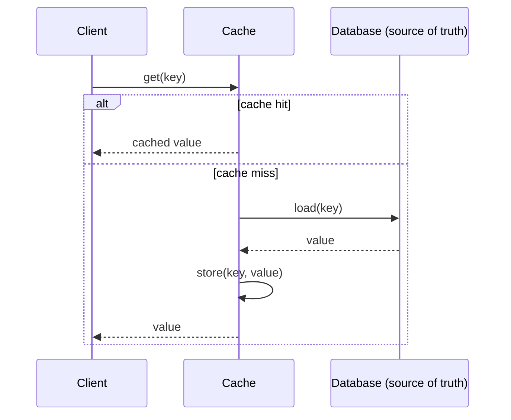
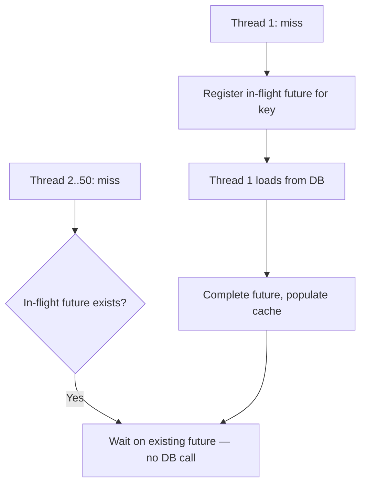

# Caching Strategies and Invalidation

> **Topic register:** T-804 · IWI 8.45 (#3 tied of 198, Mandatory Core) · Staff-Level tier · Near-Certain interview frequency [H] in system design rounds
> **Provenance:** the cache-stampede reproduction in this chapter is real, executed Java — 50 genuinely concurrent threads, real thread pools, real measured database-call counts. Reproducible source: [`practice/java/week-04/failure-modes/src/CacheStampedeDemo.java`](../../practice/java/week-04/failure-modes/src/CacheStampedeDemo.java).

## Table of Contents

1. [Learning Objectives](#learning-objectives)
2. [Why This Matters in Interviews](#why-this-matters-in-interviews)
3. [Mental Model](#mental-model)
4. [Definition and Purpose](#definition-and-purpose)
5. [Core Concepts](#core-concepts)
6. [Internal Implementation](#internal-implementation)
7. [Diagrams](#diagrams)
8. [Java Examples](#java-examples)
9. [Production Scenarios](#production-scenarios)
10. [Failure Modes and Debugging](#failure-modes-and-debugging)
11. [Trade-offs](#trade-offs)
12. [Decision Framework](#decision-framework)
13. [Comparisons](#comparisons)
14. [Common Mistakes](#common-mistakes)
15. [Anti-Patterns](#anti-patterns)
16. [Best Practices](#best-practices)
17. [Interview Answer Framework](#interview-answer-framework)
18. [Interview Questions](#interview-questions)
19. [Summary](#summary)
20. [Key Takeaways](#key-takeaways)
21. [Cheat Sheet](#cheat-sheet)
22. [Flashcards](#flashcards)
23. [Practice Exercises](#practice-exercises)
24. [Solutions](#solutions)
25. [Additional Reading](#additional-reading)
26. [Official References](#official-references)

---

## Learning Objectives

By the end of this chapter you can:

- State the exact race that causes a cache and its database to silently disagree, and name both a detection method and a structural fix.
- Explain cache stampede mechanically and reproduce the measured difference between an uncoordinated and a single-flight-coordinated fix.
- Name three distinct mitigations for a hot key taking a disproportionate share of traffic, and reason about which fits a given access pattern.
- Explain why a cache dying at peak is a full-working-set stampede against a database sized for cache-assisted load, not merely "things get slower."
- Partition a caching strategy by staleness tolerance rather than applying one invalidation policy uniformly across a system.

## Why This Matters in Interviews

Caching appears in essentially every system design discussion and most production performance conversations, and it carries unusual diagnostic value for interviewers: a candidate who adds "a Redis cache" without discussing invalidation, coherence, or failure behavior reveals a great deal in one sentence. This topic is one of only four topics tied at IWI 8.45 — third-ranked in the entire 198-topic Mandatory Core — precisely because it appears in nearly every design round and because a shallow answer ("just add a cache") is instantly and audibly distinguishable from an answer that reasons about staleness, stampede, and failure behavior.

## Mental Model

**A cache is not a performance feature — it's a deliberate correctness trade.** The moment a value is cached, the system has two copies of the truth that can disagree, and every caching decision reduces to exactly three questions: **when does a cached value get written, when does it get removed or refreshed, and what happens to a request that arrives during the gap between those two events?** Every failure mode in this chapter — stale reads, stampede, hot keys, a cache dying at peak — is a specific, nameable answer to one of those three questions going wrong.

## Definition and Purpose

A **cache** trades storage and staleness risk for latency: a value computed or fetched once is kept somewhere faster to read than its source of truth, and served from there until it's invalidated or expires. It exists because a database sized for its data volume and durability requirements is very often not sized for its *read* volume — a cache absorbs read traffic that would otherwise repeatedly re-derive or re-fetch the same value, at the cost of a new correctness question the database alone never had: can the cached copy and the source of truth disagree, and for how long is that acceptable?

## Core Concepts

### Invalidation strategies and their failure modes

| Strategy | Mechanism | Failure mode |
|---|---|---|
| **TTL (time-to-live)** | Entry expires automatically after a fixed duration | Serves stale data for up to the full TTL window after a write; too short a TTL defeats the cache's purpose under load |
| **Write-through** | Every write updates the cache and the database together, synchronously | Write latency now includes the cache; a partial failure (DB succeeds, cache write fails) leaves them disagreeing |
| **Write-behind (write-back)** | Write goes to the cache first, database updated asynchronously | Data loss window if the cache fails before the async write completes |
| **Cache-aside (lazy loading)** | Application checks cache, falls through to DB on miss, populates cache | The gap between "DB write" and "cache invalidation" is exactly where cache/DB disagreement lives |
| **Explicit invalidation on write** | The write path explicitly deletes/updates the affected cache key | Requires the write path to know every cache key that could be affected — easy to miss one on a complex write |

### How cache and database end up disagreeing

The classic race is a cache-aside read racing a concurrent write: a read misses the cache, starts loading from the (still old) database value, and finishes populating the cache with that stale value **after** a concurrent write has already updated the database and invalidated the cache. The cache now holds a value older than the one the database currently has, **indefinitely** — until the next TTL expiry or explicit invalidation — because nothing else will trigger a refresh. Detection: compare a sample of cache values against the database periodically, or instrument invalidation misses. Fix: a short backstop TTL even when explicit invalidation is used, or a versioned cache key that includes a data version so a stale write can never overwrite a newer one.

### Cache stampede (thundering herd)

When a hot cache entry expires, every concurrent request for that key misses at once and independently falls through to the database — instead of one database load, the database receives as many concurrent loads as there were concurrent requests.

### Hot-key mitigation

Three distinct mitigations for a single key taking a disproportionate share of traffic: **local (in-process) caching** of the hot key in addition to the shared cache, trading a small staleness window for eliminating a network hop entirely for the hottest key; **key sharding** — replicate the hot value under several suffixed keys (`hot-key:0` .. `hot-key:9`) and have clients pick one at random, spreading load across multiple cache nodes/shards for what was logically one key; and **read-through CDN or edge caching**, if the value is client-facing content, moving the hot path away from the origin cache entirely.

## Internal Implementation

**Naive cache-aside — no coordination between concurrent misses:**

```java
String value = cache.get("hot-key");
if (value == null) {
    value = loadFromDatabase(); // EVERY concurrent thread that misses does this independently
    cache.put("hot-key", value);
}
```

**Real, measured result — 50 concurrent requests for the same just-expired key:**

```
--- Naive cache-aside (no coordination) ---
Database load calls made: 50 (should be 1 with coordination)

--- Single-flight (request coalescing) fix ---
Database load calls made: 1 (coordination working as intended)
```

**The fix — single-flight / request coalescing:** the first thread to observe a miss registers an in-flight marker (a `CompletableFuture` in the demo) for that key; every other concurrent thread that also misses finds the marker and waits on it instead of issuing its own database call.

```java
CompletableFuture<String> future = new CompletableFuture<>();
CompletableFuture<String> existing = inFlight.putIfAbsent(key, future);
if (existing == null) {
    String loaded = loadFromDatabase();
    cache.put(key, loaded);
    future.complete(loaded);
    inFlight.remove(key);
} else {
    existing.join(); // wait for the in-flight load; no database call of our own
}
```

**Three distinct fixes for stampede:** (1) single-flight/request coalescing, demonstrated above; (2) probabilistic early expiration — refresh a cache entry slightly *before* its TTL, with random jitter per key so many keys don't expire in lockstep; (3) a stale-while-revalidate policy — serve the (slightly) stale value immediately while one request in the background refreshes it, so no client ever waits on the reload at all.

## Diagrams





## Java Examples

```java
// Java 21. Probabilistic early expiration — an alternative to single-flight
// that avoids stampede by refreshing slightly before expiry, with jitter so
// many keys don't expire in lockstep.

record CacheEntry<V>(V value, Instant expiresAt, Instant computedAt) {}

public <V> V getWithEarlyRefresh(String key, Supplier<V> loader, Duration ttl) {
    CacheEntry<V> entry = cache.get(key);
    if (entry == null) {
        return loadAndCache(key, loader, ttl);
    }

    Duration timeToLive = Duration.between(Instant.now(), entry.expiresAt());
    Duration ttlFraction = ttl.dividedBy(20); // refresh in roughly the last 5% of TTL
    double jitter = ThreadLocalRandom.current().nextDouble(0.5, 1.5);
    boolean shouldEarlyRefresh = timeToLive.compareTo(ttlFraction.multipliedBy((long) (jitter * 10)).dividedBy(10)) < 0;

    if (shouldEarlyRefresh) {
        // Serve the current (still valid) value immediately; refresh asynchronously
        // so this request never waits on the reload — stale-while-revalidate.
        CompletableFuture.runAsync(() -> loadAndCache(key, loader, ttl));
    }
    return entry.value();
}

private <V> V loadAndCache(String key, Supplier<V> loader, Duration ttl) {
    V value = loader.get();
    cache.put(key, new CacheEntry<>(value, Instant.now().plus(ttl), Instant.now()));
    return value;
}
```

**Complexity note:** the single-flight and early-refresh mechanisms are `O(1)` per request overhead (a map lookup and, in the miss case, a future registration); the value is entirely in eliminating redundant `O(concurrent misses)` database load, not in algorithmic complexity.

## Production Scenarios

### Scenario: a cache cluster failover triggers a full-database outage

**Symptoms.** During a routine cache-cluster node replacement, the application's primary database experiences a sudden, near-total connection-pool exhaustion and begins rejecting new connections; the on-call engineer initially suspects a database-side regression.

**Impact.** Full-site read-path outage for several minutes, not just a slower cache.

**Initial hypotheses.** A database configuration regression from an unrelated recent change (checked — no relevant deploy in the window); a query regression (checked — query shapes unchanged); the cache-cluster maintenance itself (correct, once cross-referenced against the maintenance window timing).

**Evidence.** Database connection and query-rate metrics show an almost step-function increase precisely coinciding with the cache node replacement window; application logs show a spike in cache-miss-triggered database reads across nearly the entire previously-cached key space, not one hot key.

**Diagnosis.** The cache-cluster maintenance briefly took the cache fully unavailable; every request that would normally hit the cache fell through to the database simultaneously — a full-working-set stampede, not a single-key stampede, against a database that was sized assuming the cache would absorb the overwhelming majority of read traffic.

**Immediate mitigation.** Enable read-path circuit breaking / load shedding on the affected service to fail some requests fast rather than let every one queue against an overwhelmed database, and manually throttle incoming traffic during the remainder of the maintenance window.

**Permanent remediation.** Require cache-cluster maintenance to use a rolling, partial-unavailability strategy (never taking the whole cache down at once) and add a database-side circuit breaker / graceful-degradation path (serving slightly stale data, or failing non-critical reads fast) specifically for the "cache is unavailable" case, rather than assuming the cache is always present.

**Alternatives considered.** Oversizing the database permanently to tolerate a full-cache-outage load — rejected as prohibitively expensive for a rare event, versus a targeted graceful-degradation mechanism.

**Trade-offs.** Graceful degradation means some requests are deliberately failed or served stale data during a cache outage — accepted, since the alternative (the database falling over entirely) is strictly worse for every request, not just some.

**Prevention.** Any cache-cluster maintenance runbook should explicitly model "what does the database receive if the cache is briefly fully unavailable" as a required pre-maintenance capacity check, not an afterthought discovered during the incident.

**Interview lesson.** This is Interview Question 2 (§ Interview Questions) — "your cache dies at peak, walk through what happens to the database" — arriving as a real incident, including the natural but incomplete initial hypothesis (a database regression) that not immediately connecting cache-miss volume to the maintenance window produces.

## Failure Modes and Debugging

| Symptom | Likely cause | Debugging step |
|---|---|---|
| Cache and database occasionally show different values for the same key, with no clear pattern | The cache-aside read-after-concurrent-write race | Instrument invalidation misses; compare cache vs. database on a sample; add a short backstop TTL or versioned keys |
| A sudden spike in database load with no corresponding traffic increase | Cache stampede on one or more hot keys, or the entire cache becoming unavailable | Check whether the spike correlates with a specific key's TTL expiry or a cache-cluster event |
| Database load spikes specifically during cache-cluster maintenance | Full-working-set stampede from cache unavailability | Model expected database load under "cache unavailable" explicitly before any planned maintenance |
| One cache key consistently shows disproportionate traffic in metrics | Hot key | Apply local caching, key sharding, or edge caching depending on the access pattern |

## Trade-offs

| Approach | Benefit | Cost |
|---|---|---|
| TTL-only invalidation | Simple, self-healing (bounded staleness) | Guaranteed staleness window, even without any failure |
| Explicit invalidation | Can be immediate/correct | Requires the write path to know every affected key; easy to miss one |
| Single-flight coalescing | Eliminates stampede entirely | Slightly more complex; the "first" request's latency is now shared by all waiters (acceptable — they were all going to wait for a load anyway) |
| Stale-while-revalidate | Zero request ever waits on a reload | A short window of guaranteed staleness by design, not just as a failure mode |

## Decision Framework

1. **What is this data's staleness tolerance?** Different data in the same system tolerates different staleness — price data may tolerate none, a "likes count" may tolerate minutes. Partition strategy by data type, don't apply one policy uniformly.
2. **Does the write path know every cache key a given write could affect?** If not reliably, prefer TTL with a backstop over pure explicit invalidation.
3. **Is this key hot enough to need dedicated mitigation?** If a single key dominates traffic, choose among local caching, key sharding, or edge caching based on whether the access pattern is read-only, write-heavy, or client-facing.
4. **What happens to the database if the entire cache becomes unavailable at once?** Model this explicitly and provision a graceful-degradation path (circuit breaking, stale-serving, load shedding) rather than discovering the answer during an incident.
5. **Would single-flight, early refresh, or stale-while-revalidate better fit this key's read pattern?** Single-flight suits any hot key; early refresh and stale-while-revalidate suit keys where a background refresh is feasible and slight staleness is acceptable.

## Comparisons

| Mechanism | Solves | Does NOT solve |
|---|---|---|
| TTL | Bounds staleness automatically, self-healing | The cache-aside race (a stale write landing after invalidation) |
| Versioned cache keys | Prevents a stale write from ever overwriting a newer one | Stampede — doesn't reduce concurrent database load on a miss |
| Single-flight coalescing | Cache stampede on a single key | Full-cache-unavailability stampede (there's no single key to coalesce around) |
| Circuit breaking / graceful degradation | Full-cache-unavailability stampede against the database | Individual-key staleness or the aside-race — a different layer of the problem entirely |

## Common Mistakes

- Treating TTL as sufficient invalidation without considering the concurrent-write race.
- Not considering what happens to the database specifically when the *entire* cache — not just one key — becomes unavailable.
- Proposing a single stampede fix without recognizing the three distinct mechanisms address different situations.

## Anti-Patterns

- **Applying one invalidation policy uniformly across all cached data** regardless of each data type's actual staleness tolerance.
- **Treating "add a cache" as a complete answer** in a design discussion without addressing invalidation, stampede, or cache-unavailable behavior.
- **Sizing the database only for cache-assisted load** without ever modeling the full-cache-outage case.
- **Reaching for a single stampede fix reflexively** (usually just "add a lock") without considering whether early refresh or stale-while-revalidate better fits the specific key's access pattern.

## Best Practices

- Partition caching strategy by each data type's actual staleness tolerance rather than applying one policy system-wide.
- Pair explicit invalidation with a short backstop TTL, since write paths reliably miss an affected key eventually.
- Use single-flight coordination (or an equivalent) for any cache key with high concurrent-read potential, especially around expiry.
- Explicitly model and provision for "the entire cache becomes unavailable" as a distinct, planned-for failure mode, not an incident-time discovery.
- Choose the hot-key mitigation from the specific access pattern — local caching for read-heavy hot keys, key sharding for write-heavy ones, edge caching for client-facing content.

## Interview Answer Framework

### 30-Second Answer

A cache trades latency for a correctness question: how stale can a cached value be, and what happens during the gap between a write and the cache reflecting it. Cache stampede — many concurrent misses independently reloading the same key — is real and measurable; the fix is coordinating concurrent misses (single-flight, early refresh, or stale-while-revalidate), not changing the expiration policy alone.

### 2-Minute Answer

Definition: a cache serves a value faster than its source of truth, at the cost of the cached copy potentially disagreeing with that source. Why it exists: databases are rarely sized for their full read volume. How it works: cache-aside, write-through, write-behind, and explicit invalidation each have a distinct failure mode — most commonly, a cache-aside read populating a stale value right after a concurrent write already invalidated it. One important trade-off: single-flight coordination eliminates stampede but means all waiting requests share the first request's latency — acceptable, since they were all going to wait for a load anyway. Production example: a measured cache-stampede demo showing 50 concurrent misses producing 50 database calls uncoordinated, versus 1 with single-flight coordination — the exact mechanism behind "your cache dies at peak" scaled up to the entire working set.

### 10-Minute Deep Dive

Cover, in order: the mental model — every caching decision is "when written, when invalidated, what happens in the gap" (mental model); the five invalidation strategies and their distinct failure modes (internals); the exact cache-aside race that causes silent cache/database disagreement, plus detection and fix (edge case + failure mode); the measured cache-stampede reproduction, 50 database calls vs. 1 (internals, real evidence); the three distinct stampede fixes and when each fits (alternatives); hot-key mitigation strategies matched to access pattern (decision framework); and close with the production scenario — a cache-cluster maintenance window triggering a full-database outage, the full-working-set version of the same stampede mechanism.

### Whiteboard Explanation

Draw the [§ Diagrams](#diagrams) sequence diagram first: client → cache → (on miss) → database → cache populated → client. Then, next to it, draw 50 arrows all hitting "cache miss" simultaneously and converging on one database box — this is the stampede image. Cross out 49 of those arrows and replace them with one arrow labeled "wait on in-flight future" to show single-flight's effect visually, rather than asserting it.

### Production Example

The cache-cluster-maintenance outage in [§ Production Scenarios](#production-scenarios): a planned cache node replacement briefly took the cache fully unavailable, and the resulting full-working-set stampede overwhelmed a database sized only for cache-assisted read load — resolved with graceful degradation and a rolling-maintenance requirement going forward.

### Trade-offs to Mention

State unprompted: caching is a correctness trade, not a free performance win; TTL bounds staleness but doesn't fix the cache-aside race; single-flight coordination shares the first request's latency across all waiters rather than eliminating it; a cache dying at peak is a full-working-set stampede, not just "things get slower."

### Common Candidate Mistakes

Describing cache/database disagreement as a vague "sync issue" instead of the specific concurrent-write race; treating a cache outage as "the cache is just slower now" rather than "the database now receives 100% of read traffic it was never sized for"; naming only one stampede fix.

### Typical Follow-Up Questions

1. "Would a shorter TTL alone fully fix the cache/database disagreement race?"
2. "What would you do to prevent total outage when the cache dies at peak?"
3. "Which of the three hot-key mitigations would you reach for first, and why?"
4. "Why does single-flight not just move the latency problem instead of solving it?"

### Senior-Level Expectations

Describes the cache-aside disagreement race correctly; identifies the full-stampede nature of a cache dying at peak; names at least two of the three stampede fixes and at least two of the three hot-key mitigations.

### Staff-Level Discussion

Caching decisions are ultimately a statement about how much staleness a specific piece of data can tolerate, and that tolerance is rarely uniform across a system — pricing data might tolerate zero staleness while a "likes count" might tolerate minutes. A Staff-level caching design doesn't apply one invalidation strategy uniformly; it partitions data by staleness tolerance first and picks the mechanism per partition, the same access-pattern-first discipline applied to storage selection elsewhere in this handbook, here applied to a different axis: staleness tolerance instead of query shape.

## Interview Questions

### Question 1 — Cache and database disagree. How did it happen, how do you detect it, how do you fix it?

**Why interviewers ask it.** Tests whether the candidate can name the specific race rather than a vague "sync issue."

**Expected answer.** A cache-aside read populates a stale value *after* a concurrent write already invalidated/updated the cache; detection via sampling or instrumented invalidation misses; fix via short backstop TTL or versioned keys.

**Minimum acceptable answer.** States that a race between reads and writes can cause disagreement, even without the precise ordering.

**Strong Senior answer.** Describes the race correctly, in the precise order (stale read completes after the concurrent write's invalidation).

**Staff-level extension.** Proposes both a detection method and a structural fix (versioned keys), not just "add a shorter TTL."

**Common mistakes.** Describing only "the cache didn't get updated" without the specific race condition that causes it.

**Likely follow-ups.** "Would a shorter TTL alone fully fix this?"

**Evaluation criteria (1–5).** 1: "the cache just gets out of sync sometimes." 3: correct race described. 5: race described plus detection method plus structural fix.

**Related references.** [§ Core Concepts](#core-concepts); [§ Internal Implementation](#internal-implementation).

---

### Question 2 — Your cache dies at peak. Walk through what happens to the database.

**Why interviewers ask it.** Tests whether the candidate connects a cache outage to a systemic database-capacity consequence, not just "things get slower."

**Expected answer.** Every request that was previously served from cache now falls through to the database simultaneously — effectively a stampede across the *entire* cached working set, not just one key, and the database, sized for a cache-assisted read load, is likely to fall over.

**Minimum acceptable answer.** States that database load increases significantly, even without the full-stampede framing.

**Strong Senior answer.** Identifies the full-stampede nature of the failure explicitly.

**Staff-level extension.** Proposes a circuit breaker or graceful-degradation strategy (serving slightly stale data, rate-limiting reads, or failing some requests fast) rather than letting every request hit the now-defenseless database.

**Common mistakes.** Treating this as "the cache is just slower now" rather than "the database now receives 100% of read traffic it was never sized for."

**Likely follow-ups.** "What would you do to prevent total outage in this scenario?"

**Evaluation criteria (1–5).** 1: "it gets slower." 3: identifies the full-stampede nature. 5: identifies it plus proposes a concrete graceful-degradation mechanism.

**Related references.** [§ Production Scenarios](#production-scenarios); [§ Decision Framework](#decision-framework).

## Summary

Caching trades latency for a new correctness question: how stale can a cached value be, and what happens to a request during the gap between a write and its cache reflecting it. Cache stampede — many concurrent misses independently reloading the same key — is real and measurable (50 database calls vs. 1, reproduced in this chapter) and is fixed by coordinating concurrent misses, not by any change to the cache's expiration policy alone.

## Key Takeaways

- Every caching decision reduces to: when is a value written, when is it invalidated, and what happens during the gap.
- Cache/database disagreement is a specific race, not a vague "sync issue" — a stale read can populate the cache *after* a concurrent write already invalidated it.
- Cache stampede is real and measurable: 50 concurrent misses → 50 database calls without coordination, 1 with single-flight.
- A cache dying at peak is a full-working-set stampede against a database sized for cache-assisted load, not just "things get slower."
- Staleness tolerance varies by data type — partition caching strategy accordingly, don't apply one policy uniformly.

## Cheat Sheet

| Situation | What to reach for |
|---|---|
| Data can tolerate a bounded staleness window | TTL, sized per data type's tolerance |
| Write path can reliably identify every affected key | Explicit invalidation, backstopped by a short TTL |
| Hot key, read-heavy | Local in-process caching |
| Hot key, write-heavy | Key sharding across suffixed keys |
| Hot key, client-facing content | Edge/CDN caching |
| Cache stampede on expiry | Single-flight coordination, probabilistic early expiration, or stale-while-revalidate |
| Entire cache could become unavailable | Explicit graceful-degradation path (circuit breaker, stale-serving, load shedding) |

## Flashcards

### Card: How cache/database disagreement happens

**Prompt:**
How does cache/database disagreement typically happen?

**Answer:**
A cache-aside read populates a stale value after a concurrent write already invalidated the cache — a race, not a generic sync bug.

**Why it matters:**
The precise, nameable mechanism interviewers expect, not a vague description.

**Common trap:**
Describing it only as "the cache didn't update" without the race's ordering.

**Related:**
[Core Concepts](#core-concepts)

### Card: Cache dying at peak

**Prompt:**
What happens to the database when the entire cache dies at peak?

**Answer:**
It receives a full-working-set stampede — every previously cached read now falls through simultaneously, against a database sized assuming cache assistance.

**Why it matters:**
Distinguishes "things get slower" from the actual systemic capacity failure.

**Common trap:**
Treating a cache outage as merely a performance degradation.

**Related:**
[Production Scenarios](#production-scenarios)

### Card: Three cache-stampede fixes

**Prompt:**
Name three cache-stampede fixes.

**Answer:**
Single-flight/request coalescing, probabilistic early expiration with jitter, stale-while-revalidate.

**Why it matters:**
A named interview question requiring all three, not one.

**Common trap:**
Naming only one fix as if it were the complete answer.

**Related:**
[Internal Implementation](#internal-implementation)

### Card: Three hot-key mitigations

**Prompt:**
Name three hot-key mitigations.

**Answer:**
Local in-process caching, key sharding across suffixed keys, edge/CDN caching.

**Why it matters:**
Different mitigations fit different access patterns — naming one isn't sufficient.

**Common trap:**
Naming only one mitigation regardless of access pattern.

**Related:**
[Core Concepts](#core-concepts)

## Practice Exercises

1. Reproduce the cache-stampede demo yourself: [`practice/java/week-04/failure-modes/src/CacheStampedeDemo.java`](../../practice/java/week-04/failure-modes/src/CacheStampedeDemo.java).
2. Implement probabilistic early expiration as an alternative to single-flight, and reason about when you'd prefer one over the other.
3. Take a cached value in a system you know. Classify its staleness tolerance, and check whether its current invalidation strategy actually matches that tolerance or is over/under-engineered for it.

## Solutions

**Exercise 1.** Expected output matches this chapter's measured trace: 50 database load calls without coordination, 1 with single-flight — confirming coordination eliminates the redundant 49 calls without changing the correctness of the loaded value.

**Exercise 2.** Early expiration avoids ever making a request wait on a reload (since the current, still-valid value is served immediately while refresh happens in the background), at the cost of occasionally doing a slightly-early, possibly-redundant refresh. Prefer single-flight when correctness after expiry matters more than avoiding any wait; prefer early refresh/stale-while-revalidate when the read path must never block on a database call, even briefly.

**Exercise 3.** No single expected answer — complete when the candidate has named a specific cached value, stated its staleness tolerance in concrete terms (e.g., "acceptable up to 60 seconds stale"), and compared that against the actual TTL or invalidation mechanism currently in use, flagging a mismatch in either direction if one exists.

## Additional Reading

- AWS Builders' Library — ["Caching challenges and strategies"](https://aws.amazon.com/builders-library/caching-challenges-and-strategies/)

## Official References

- No single official specification governs caching strategy — this chapter draws on widely-documented industry patterns (cache-aside, write-through, single-flight) rather than one canonical source.
