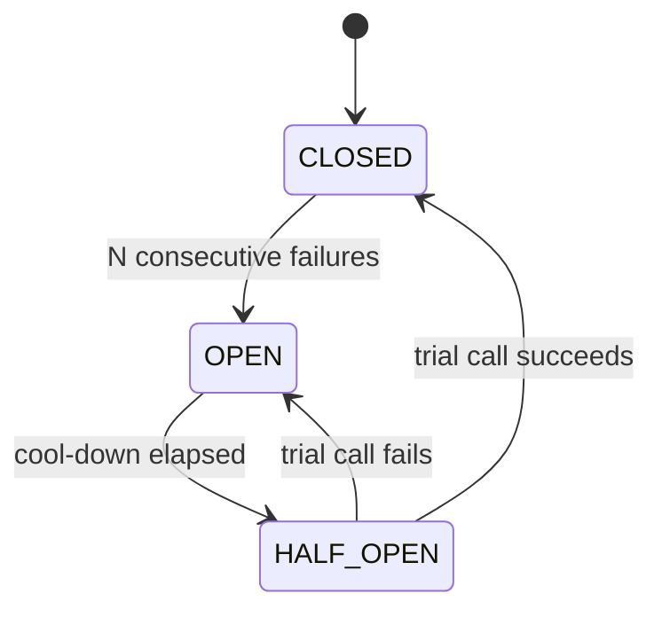

# Resilience Patterns: Circuit Breaker, Retry Jitter, Timeouts, and Bulkheads

> **Topic register:** T-515 · IWI 7.60 · Staff tier
> **Provenance:** every measurement in this chapter is real, executed output from [`practice/java/week-10/resilience/src/CircuitBreakerDemo.java`](../../practice/java/week-10/resilience/src/CircuitBreakerDemo.java) and [`RetryBackoffJitterDemo.java`](../../practice/java/week-10/resilience/src/RetryBackoffJitterDemo.java).
> **See also:** [Distributed Systems Failure Modes](../10-distributed-systems/distributed-systems-failure-modes.md) measures retry amplification (why retrying a merely-slow request adds load rather than replacing it) — a distinct, complementary mechanism from this chapter's jitter measurement (why *synchronized* retries specifically create a storm).

## Table of Contents

1. [Learning Objectives](#learning-objectives)
2. [Why This Matters in Interviews](#why-this-matters-in-interviews)
3. [Level 1 — Foundation](#level-1--foundation)
4. [Level 2 — Working Knowledge](#level-2--working-knowledge)
5. [Mental Model](#mental-model)
6. [Definition and Purpose](#definition-and-purpose)
7. [Core Concepts](#core-concepts)
8. [Internal Implementation](#internal-implementation)
9. [Diagrams](#diagrams)
10. [Production Scenarios](#production-scenarios)
11. [Trade-offs](#trade-offs)
12. [Decision Framework](#decision-framework)
13. [Common Mistakes](#common-mistakes)
14. [Anti-Patterns](#anti-patterns)
15. [Best Practices](#best-practices)
16. [Interview Answer Framework](#interview-answer-framework)
17. [Interview Questions](#interview-questions)
18. [Summary](#summary)
19. [Key Takeaways](#key-takeaways)
20. [Cheat Sheet](#cheat-sheet)
21. [Flashcards](#flashcards)
22. [Practice Exercises](#practice-exercises)
23. [Solutions](#solutions)
24. [Additional Reading](#additional-reading)
25. [Official References](#official-references)

---

## Learning Objectives

By the end of this chapter you can:

- Walk a circuit breaker through all three states (`CLOSED → OPEN → HALF_OPEN → CLOSED`) and state, with a measured number, what the `OPEN` state actually saves.
- Explain why retrying without jitter synchronizes every client's retry instant, and how full jitter fixes it — with measured traces of both.
- Derive a timeout from a latency percentile rather than picking a round number, and justify the percentile choice against the cost of a false timeout.
- Explain what a bulkhead isolates and why, connecting it to the executor thread-pool-exhaustion failure mode one layer down.

## Why This Matters in Interviews

Resilience-pattern questions test whether a candidate treats calling a downstream service as inherently unreliable by design, or only reactively after an incident. The topic is Staff-tier because each pattern here — circuit breaker, jitter, timeout, bulkhead — has a measurable, quantifiable effect, and a candidate who can state the actual numbers (not just the pattern names) demonstrates they've operated these mechanisms, not just read about them.

## Level 1 — Foundation

Imagine calling a friend who sometimes doesn't pick up. A **timeout** is deciding in advance how many rings you'll wait before hanging up, instead of holding the phone forever. A **circuit breaker** is what happens after your friend has missed your last three calls in a row: you stop calling for a while and just assume they're unavailable, saving yourself the wasted effort of dialing and waiting each time — then, after a cool-down, you try once more to see if they've picked up again.

**Retry with jitter** solves a subtler problem: imagine a hundred people all calling the same friend, all get voicemail at the same moment, and all decide to redial in exactly 10 seconds — the friend's phone rings again all at once, just as overwhelmed as before. If instead everyone waits a random amount of time near 10 seconds, the redials spread out and the friend actually has a chance to answer some of them.

A **bulkhead** is like a ship divided into separate watertight compartments: if one compartment floods, it doesn't sink the whole ship — the flooding is contained to that one section. Applied to software, it means giving each dependency its own separate, limited pool of resources (like connections or threads), so a single slow or broken dependency can't use up resources that unrelated, healthy parts of the system also need.

## Level 2 — Working Knowledge

At this level you should be comfortable explaining why a circuit breaker needs three states, not just "on" and "off." The third state, `HALF_OPEN`, is what lets the system heal itself: after the cool-down period, it lets exactly one trial request through to test whether the dependency has recovered, rather than requiring someone to manually flip it back on.

You should also be able to reason precisely about where a timeout value should come from. A timeout picked "by feel" (a round number like 5 seconds) is a guess; a timeout derived from the downstream service's actual observed latency (for example, its p99) is a decision you can defend. The practical trade-off to hold in mind: a timeout set too aggressively kills genuinely slow-but-successful requests, while one set too generously makes a hung dependency take forever to notice.

Practically, when reviewing a service that calls out to other services, ask: does every retry use randomized delay (not a fixed schedule every client computes identically)? Is there a circuit breaker in front of anything known to fail hard during real outages? And do dependencies with very different latency and reliability profiles share the same connection or thread pool, or does each get its own isolated allocation? A "yes, they share one pool" answer here is the concrete, reviewable signal that one dependency's problem could take down unrelated, healthy traffic.

## Mental Model

**Every resilience pattern here answers one question: what should this service do while a dependency is unhealthy, instead of pretending it's healthy?** A timeout stops waiting past a bound. A circuit breaker stops asking at all once the answer is predictably "no." Retry with jitter asks again, but staggered so the recovering dependency isn't hit by every caller simultaneously. A bulkhead makes sure one unhealthy dependency can only exhaust the resources allocated to it, not the resources every other (healthy) dependency also needs.

## Definition and Purpose

Resilience patterns are the standard toolkit for a service that depends on other services which will, eventually, fail or slow down: **timeouts** bound how long you wait, **retries** handle transient failures, **circuit breakers** stop calling a downstream that's clearly down, and **bulkheads** isolate one dependency's failure from starving resources needed by others.

Without these patterns, a single slow or failing downstream dependency doesn't just fail its own calls — it can exhaust the calling service's own thread pool/connection pool waiting on it ([the unbounded-queue trap](../02-java/concurrency/executors-and-thread-pool-sizing.md#internal-implementation) is exactly this failure mode, one layer up), cascading the failure to every OTHER caller of the now-resource-starved service, even ones that never touch the failing dependency.

## Core Concepts

### A circuit breaker has three states, not two

`CLOSED` (normal, calls pass through), `OPEN` (calls fail fast without reaching the downstream, after N consecutive failures), and `HALF_OPEN` (a single trial call is allowed through after a cool-down, to test recovery). A common mistake is modeling it as a binary on/off switch — `HALF_OPEN` is what makes the breaker self-healing rather than requiring a manual reset.

### Jitter fixes a synchronization problem, not a load problem

Exponential backoff without jitter still has every client compute the *identical* delay on the same attempt number — so every client retries at the exact same instant. This is a **synchronization** failure: the retries aren't excessive in aggregate count, they're concentrated in time. Full jitter (a random delay uniformly between 0 and the exponential cap) spreads retry instants across the window, converting a synchronized spike into a smoothed trickle. This is distinct from — and complementary to — [retry amplification](../10-distributed-systems/distributed-systems-failure-modes.md#core-concepts), which is about retries adding load on top of still-running attempts regardless of timing.

### Timeout selection is a percentile choice, not a guess

A timeout set from the p50 latency times out roughly half of all genuinely-successful-but-slower-than-median calls. A timeout set from the p99.9 latency barely times out anything but also barely protects against a truly hung dependency. The practical answer derives the timeout from a percentile chosen for the specific cost of a false timeout versus the cost of waiting too long — often p99 as a starting point, tuned against the actual latency distribution.

### A bulkhead isolates a shared resource per dependency

Bulkhead isolation partitions a limited resource (thread pool, connection pool) per-dependency, so one dependency's slowdown can only exhaust its OWN allocated slice, not the shared pool every other dependency also needs — the same principle as ships' bulkheads containing flooding to one compartment. This is the resilience-pattern framing of exactly the problem [executor sizing](../02-java/concurrency/executors-and-thread-pool-sizing.md#internal-implementation) measures directly: a single shared, unbounded-queue pool lets one slow dependency starve every other caller of that pool.

**The concrete, frequently-asked version of this: a fixed-size HikariCP pool shared across unrelated request types.** A service with a single `maximumPoolSize: 20` connection pool (see [Connection Pooling and Sizing](../06-databases/connection-pooling-and-sizing.md) for the pool's own internals) serves two unrelated endpoints — say, order-lookup and order-cancellation — both borrowing connections from that same pool. If the cancellation flow calls a slow downstream service (a payment processor, a fraud-check API) while still holding its borrowed connection, every cancellation request in flight during that downstream's slowdown holds a connection for the downstream's full latency, not the database's own latency. Once enough concurrent cancellation requests are each holding a connection waiting on the slow downstream, the pool's 20 connections are exhausted — and the *unrelated* order-lookup endpoint, which never talks to the slow downstream at all, now also fails with a connection-timeout, because there are no connections left in the shared pool for it to borrow. This is the same bulkhead violation as the thread-pool case above, just against a JDBC connection pool instead of a thread pool: one dependency's slowness starves every caller of a resource it shares with unrelated work. A circuit breaker (Resilience4j, wrapping the call to the slow downstream) fixes this specifically by failing fast once the downstream's failure/slowness rate crosses its threshold — the breaker opens, cancellation requests fail immediately without ever borrowing a connection and holding it through the downstream's full timeout, and the pool stops being drained by requests waiting on a dependency that's already known to be unhealthy. The breaker doesn't fix the downstream; it stops one dependency's problem from propagating into a shared resource every other, unrelated request also depends on — the textbook justification for pairing a circuit breaker with bulkhead isolation rather than treating either as sufficient alone.

## Internal Implementation

**A real circuit breaker, all three states** — without a breaker, a downstream that's down for its first 6 calls then recovers:

```
== WITHOUT a circuit breaker: every call pays the full 200ms, even while the downstream is down ==
10 calls, 10 attempted (all of them), 4 succeeded, 2046ms total (== 10 x 200ms, every call pays full cost)
```

With a breaker (opens after 3 consecutive failures, stays open 500ms):

```
== WITH a circuit breaker (threshold=3, open for 500ms): fails fast once open ==
  [breaker] CLOSED -> OPEN (3 consecutive failures)
  [breaker] OPEN -> HALF_OPEN (cool-down elapsed, allowing one trial call)
  [breaker] HALF_OPEN -> CLOSED (trial call succeeded)
20 call attempts: 15 actually reached the downstream (200ms each), 5 rejected fast (~0ms), 12 succeeded, 3569ms total
```

All three real state transitions occur in this one run: `CLOSED → OPEN` after 3 consecutive failures (5 of the 20 attempts were rejected in ~0ms rather than waiting 200ms each), `OPEN → HALF_OPEN` once the cool-down window passes, and `HALF_OPEN → CLOSED` because the trial call succeeded. **What the breaker actually saves, measured**: 5 calls that would have cost 200ms each (1000ms total) instead cost ~0ms — a direct, quantified reduction in wasted latency during an outage.

**Retry storms and jitter, measured** — 5 clients independently retrying with exponential backoff, no jitter:

```
== exponential backoff WITHOUT jitter: every failing client retries at the identical instant ==
attempt 1 (exponential cap=100ms): client delays = 100ms 100ms 100ms 100ms 100ms
attempt 2 (exponential cap=200ms): client delays = 200ms 200ms 200ms 200ms 200ms
attempt 3 (exponential cap=400ms): client delays = 400ms 400ms 400ms 400ms 400ms
attempt 4 (exponential cap=800ms): client delays = 800ms 800ms 800ms 800ms 800ms
```

Same clients, full jitter:

```
== exponential backoff WITH full jitter: retries spread out ==
attempt 1 (exponential cap=100ms): client delays = 72ms 68ms 30ms 27ms 66ms
attempt 2 (exponential cap=200ms): client delays = 180ms 73ms 55ms 92ms 156ms
attempt 3 (exponential cap=400ms): client delays = 367ms 174ms 299ms 154ms 70ms
attempt 4 (exponential cap=800ms): client delays = 475ms 167ms 660ms 137ms 469ms
```

**Without jitter, every one of the 5 clients retries at the exact same instant on every attempt** — the "retry storm" failure mode. With jitter, retry instants spread across the full window on every attempt — the downstream sees a smoothed trickle instead of a synchronized spike.

## Diagrams



## Production Scenarios

### Scenario: a downstream recovers from a brief blip, then immediately falls back over from a synchronized retry storm

**Symptoms.** A downstream payment-verification service has a brief 2-second network blip. Every caller's request times out and retries with exponential backoff, but without jitter. The downstream, having just recovered from the original blip, immediately receives a synchronized spike of retries at the exact instant every client's backoff timer expires, and falls back over — worse than the original blip, and lasting longer.

**Impact.** A 2-second transient network issue becomes a multi-minute outage, entirely caused by the retry behavior of the calling services, not the original triggering condition.

**Initial hypotheses.** The original network issue was more severe than reported (checked — network monitoring shows the blip resolved in under 2 seconds); a capacity regression in the payment-verification service (checked — no code or config changes preceded the incident); a synchronized retry storm from the initial timeout wave (correct).

**Evidence.** The payment-verification service's inbound request rate shows a series of sharp, narrow spikes at intervals matching the exponential backoff schedule (100ms, 200ms, 400ms, 800ms after the original timeout) rather than a smooth elevated rate — exactly the "every client retries at the identical instant" signature this chapter measures directly.

**Diagnosis.** Every caller's retry logic used exponential backoff without jitter; because all callers experienced the same triggering timeout at roughly the same moment, their backoff delays computed to the same values, synchronizing every retry wave into a spike large enough to re-trigger an outage in a service that had actually recovered.

**Immediate mitigation.** Manually stagger a service restart / traffic ramp-up to break the synchronization, and temporarily reduce caller concurrency to let the spikes dissipate.

**Permanent remediation.** Add full jitter to every retry policy calling this service, converting synchronized spikes into a smoothed trickle — measured in this chapter to spread what would be an identical-instant retry into a window spanning the full exponential cap.

**Alternatives considered.** Removing retries entirely — rejected, since transient blips are real and retrying is the correct response to a genuine transient failure; the fix is decorrelating retry timing, not eliminating retries.

**Trade-offs.** Jitter adds worst-case latency variance to individual retrying requests (a request might wait close to the full exponential cap instead of a predictable fixed delay) — accepted, since the alternative is a self-inflicted outage amplification.

**Prevention.** A standing requirement that every outbound retry policy uses jitter as a non-negotiable default, verified in code review or enforced by a shared client library, not left to individual implementations to remember.

**Interview lesson.** This is the direct production-scale version of this chapter's jitter measurement: a mechanism that looks like a minor implementation detail (random vs. deterministic delay) has a measurable, outage-causing effect at scale.

## Failure Modes and Debugging

| Symptom | Likely cause | Debugging step |
|---|---|---|
| A recovering downstream immediately falls back over | Synchronized retry storm (no jitter) | Check inbound request rate for sharp periodic spikes matching a backoff schedule, rather than a smooth elevated rate |
| One slow dependency causes unrelated callers to fail | Shared resource pool with no bulkhead isolation | Check whether the calling service's thread/connection pool is shared across all dependencies |
| Calls to a known-down dependency keep costing full latency | No circuit breaker, or threshold set too high | Check whether failed calls are still reaching the downstream (full latency) instead of failing fast |
| Genuinely slow-but-successful calls are being treated as failures | Timeout set below the real p99 latency | Compare the configured timeout against the downstream's actual latency percentile distribution |

## Trade-offs

| Pattern | Benefit | Cost |
|---|---|---|
| Circuit breaker | Fails fast during an outage — measured savings above | Adds state to reason about; a too-sensitive threshold can trip on transient blips |
| Retry with jitter | Handles transient failures without synchronized storms | Retries still cost latency and downstream load; must be paired with a retry budget to avoid amplifying a real overload |
| Timeout tuned to a latency percentile | Bounds worst-case wait | Set wrong (too aggressive), it manufactures false failures out of genuinely-slow-but-successful calls |
| Bulkhead (per-dependency pool) | Isolates one dependency's failure from starving others | More total resources reserved (some pools sit idle while others are busy) than one shared pool would use |

## Decision Framework

1. **Does this call path retry on failure?** If yes, does it use jitter, not a deterministic backoff schedule every client computes identically?
2. **Is there a circuit breaker in front of a dependency known to fail hard during outages** (rather than degrading gracefully)? If not, failed calls keep paying full latency indefinitely.
3. **Is the timeout derived from the downstream's actual latency percentile distribution**, or picked by feel? A skewed distribution (fast p50, slow p99) may warrant a shorter timeout paired with a retry, rather than one long timeout.
4. **Does this dependency share a resource pool (threads, connections) with other dependencies?** If the profiles differ significantly, isolate with a bulkhead so one can't starve the others.
5. **When the circuit opens, what does the caller do next** — fail fast, or degrade gracefully (cached/stale data, reduced feature set)? Tie the answer to the specific business cost of that dependency being unavailable.

## Common Mistakes

- Treating "retry until success" as a reliability strategy — unbounded retries under a real outage amplify load on an already-struggling downstream.
- Retrying without jitter, creating synchronized retry storms.
- Sharing one resource pool across multiple dependencies with different failure/latency profiles, letting one starve the others.

## Anti-Patterns

- **Deterministic exponential backoff with no jitter**, treating "add a delay" as sufficient without addressing timing synchronization across clients.
- **A circuit breaker with no `HALF_OPEN` recovery path**, requiring a manual reset instead of self-healing once the downstream recovers.
- **One shared thread/connection pool for every downstream dependency**, regardless of how different their latency and failure profiles are.
- **A timeout chosen by feel** rather than derived from the downstream's actual observed latency distribution.

## Best Practices

- Use exponential backoff with jitter for every retry policy, as a non-negotiable default rather than an optimization.
- Pair a circuit breaker with a well-tested `HALF_OPEN` recovery path so the system self-heals once the dependency recovers.
- Derive every timeout from the downstream's actual latency percentile distribution, and revisit it if that distribution shifts.
- Isolate dependencies with materially different latency/failure profiles into separate bulkheads rather than a single shared pool.

## Interview Answer Framework

### 30-Second Answer

A circuit breaker fails fast once a downstream is clearly down, measurably saving latency (5 calls at ~0ms instead of 200ms each here). Retry with jitter prevents synchronized retry storms — measured as every client retrying at the identical instant without jitter, spread across the full window with it. Timeouts should come from the downstream's actual latency percentile, and bulkheads isolate one dependency's resource use from starving others.

### 2-Minute Answer

Definition: circuit breakers, retries, timeouts, and bulkheads are the standard toolkit for calling a dependency that will eventually fail or slow down. Why it exists: without them, a single slow dependency can exhaust the calling service's own resources, cascading to unrelated callers. How it works: a circuit breaker cycles `CLOSED → OPEN → HALF_OPEN → CLOSED` based on consecutive failures and a cool-down trial; jitter spreads retry instants so they don't synchronize into a storm; timeouts derive from a latency percentile; bulkheads give each dependency its own resource slice. One important trade-off: jitter adds latency variance in exchange for not synchronizing retries. Production example: a real measured circuit breaker saving 5 calls' worth of full-timeout latency during an outage, and a real measured retry-storm demonstration showing every client retrying at the identical instant without jitter.

### 10-Minute Deep Dive

Cover, in order: the mental model — every pattern answers "what do we do while a dependency is unhealthy" (mental model); the measured three-state circuit breaker cycle and its quantified latency savings (internals, real evidence); the measured jitter-vs-no-jitter retry-storm demonstration, and how it differs from retry amplification (internals + cross-reference); timeout selection from latency percentiles, with the skewed-distribution follow-up (core concepts); bulkhead isolation and its connection to executor pool exhaustion (core concepts + cross-reference); and close with the production scenario — a brief blip amplified into a multi-minute outage by a synchronized retry storm.

### Whiteboard Explanation

Draw the [§ Diagrams](#diagrams) state diagram: `CLOSED` with an arrow labeled "N consecutive failures" to `OPEN`, an arrow labeled "cool-down elapsed" to `HALF_OPEN`, and two arrows out of `HALF_OPEN` — "succeeds" back to `CLOSED`, "fails" back to `OPEN`. Annotate `OPEN` as "fails fast, ~0ms, no call reaches the downstream" to make the measured savings concrete.

### Production Example

The retry-storm cascade in [§ Production Scenarios](#production-scenarios): a brief 2-second network blip caused every caller to retry without jitter, synchronizing into a spike that fell the recovering downstream over again — fixed by adding jitter to every retry policy.

### Trade-offs to Mention

State unprompted: jitter trades individual-request latency predictability for not synchronizing retries; a circuit breaker's threshold sensitivity trades false-trip risk against slow-failure-detection risk; bulkheads trade reserved (sometimes idle) resources for isolation.

### Common Candidate Mistakes

Proposing retry-until-success as a reliability strategy; adding backoff without jitter and assuming that alone prevents retry storms; sharing one pool across all dependencies regardless of profile differences.

### Typical Follow-Up Questions

1. "The p99 is 3 seconds but most calls finish in 100ms. Is 3s the right timeout?"
2. "When would fast-fail be wrong, and graceful degradation the right call?"
3. "How does backoff-with-jitter interact with a bounded retry budget?"

### Senior-Level Expectations

Justifies a percentile-derived timeout; distinguishes fast-fail from graceful degradation as two different responses to the same open-circuit event.

### Staff-Level Discussion

The jitter measurement here — 5 clients perfectly synchronized without jitter versus spread across the full window with it — is a small-scale demonstration of a failure mode that has caused real, well-documented production outages at scale: thousands of clients retrying in lockstep after a brief blip can produce a load spike far exceeding the original traffic pattern, re-triggering the outage the retries were meant to recover from. A Staff engineer treats retry logic as needing the same design rigor as the primary request path — a retry budget, jitter, and often a circuit breaker together, not "wrap the call in a try/retry loop" as an afterthought. For circuit-open behavior, tying the choice (fast-fail vs. graceful degradation) to the specific business cost of each dependency's unavailability — a recommendations service failing open to "no recommendations shown" versus a payments service that must fail loudly — demonstrates the pattern is being applied with judgment, not by rote.

## Interview Questions

### Question 1 — Set the timeout — from what data?

**Why interviewers ask it.** Tests whether the candidate derives operational parameters from evidence rather than intuition.

**Expected answer.** From the downstream's actual observed latency distribution (a percentile, commonly p99 as a starting point), not a round number chosen by feel — explicitly stating the trade-off between false timeouts (too aggressive) and slow failure detection (too lax).

**Minimum acceptable answer.** States that the timeout should come from real latency data, even without naming a specific percentile.

**Strong Senior answer.** Justifies a percentile-derived number.

**Staff-level extension.** Discusses that a highly skewed distribution (100ms p50 vs. 3s p99) might warrant a shorter timeout with a retry, rather than one long timeout — trading a single long wait for a bounded shorter wait plus a controlled retry.

**Common mistakes.** Picking a number without justifying it from data.

**Likely follow-ups.** "The p99 is 3 seconds but most calls finish in 100ms. Is 3s the right timeout?"

**Evaluation criteria (1–5).** 1: picks an arbitrary number. 3: justifies a percentile-derived timeout. 5: correct justification plus the skewed-distribution shorter-timeout-plus-retry insight.

**Related references.** [§ Core Concepts](#core-concepts).

---

### Question 2 — Circuit opens. What does the user see?

**Why interviewers ask it.** Tests whether the candidate treats "the circuit opened" as a design decision, not an end state.

**Expected answer.** Depends on the design — either a fast, explicit failure (better than a slow one) or a graceful degradation (cached/stale data, a reduced feature set) rather than the same error a hung call would eventually produce, just faster.

**Minimum acceptable answer.** States that some user-facing behavior must be designed, rather than assuming the breaker itself is the complete answer.

**Strong Senior answer.** Distinguishes fast-fail from graceful degradation as two different responses to the same open-circuit event.

**Staff-level extension.** Ties the choice to the specific business cost of each dependency being unavailable — e.g., a recommendations service failing open to "no recommendations shown" versus a payments service that must fail loudly rather than silently degrade.

**Common mistakes.** Treating "the circuit opened" as the end of the design question rather than the start of "what's the fallback behavior."

**Likely follow-ups.** "When would fast-fail be wrong, and graceful degradation the right call?"

**Evaluation criteria (1–5).** 1: no fallback behavior considered. 3: names fast-fail and graceful degradation as options. 5: correct options plus ties the choice to business cost per dependency.

**Related references.** [§ Internal Implementation](#internal-implementation).

## Summary

A real circuit breaker measurably saves latency during an outage (5 of 20 calls rejected in ~0ms instead of costing 200ms each) and cycles correctly through all three states as the downstream actually recovers. Retry without jitter genuinely synchronizes every client's retry instant — measured identically across 5 clients on every attempt — creating exactly the retry-storm risk that jitter (measured spreading retries across the full backoff window) exists to prevent. Timeout selection should come from the downstream's actual latency distribution, and bulkheads isolate one dependency's resource consumption from starving others sharing the same pool.

## Key Takeaways

- A circuit breaker's `OPEN` state measurably converts a slow failure (full timeout cost) into a fast one (~0ms) — a real, quantifiable latency saving during an outage.
- Retry without jitter synchronizes every client's retry instant — a measured retry-storm risk, not a theoretical one.
- Timeouts should be derived from the downstream's actual latency percentile distribution, not chosen by feel.
- Bulkheads isolate one dependency's resource consumption so it can't starve callers of other, healthy dependencies sharing infrastructure.

## Cheat Sheet

| Symptom | Pattern to reach for |
|---|---|
| One slow dependency exhausts the shared thread/connection pool | Bulkhead (per-dependency pool) |
| Calls keep hitting a downstream that's clearly down | Circuit breaker |
| Transient failures need to be retried safely | Retry with exponential backoff + jitter, capped by a retry budget |
| Calls hang indefinitely on a stuck dependency | Timeout, derived from the latency percentile distribution |

## Flashcards

### Card: What a circuit breaker's OPEN state saves

**Prompt:**
What does a circuit breaker's OPEN state actually save, measured?

**Answer:**
Converts a call that would cost the full downstream timeout (e.g., 200ms) into one that fails in ~0ms — real, quantified latency savings during an outage.

**Why it matters:**
The concrete, measurable benefit behind an otherwise abstract pattern name.

**Common trap:**
Describing circuit breakers only qualitatively ("stops calling a down service") without the quantified latency benefit.

**Related:**
[Internal Implementation](#internal-implementation)

### Card: What jitter fixes

**Prompt:**
What does jitter fix about retry backoff, precisely?

**Answer:**
Without it, every client retries at the exact same instant on every attempt (measured, not theoretical) — a retry storm risk. Jitter spreads retry instants across the backoff window.

**Why it matters:**
Distinguishes the synchronization problem (jitter's job) from the load-amplification problem (retry budgets' job).

**Common trap:**
Assuming exponential backoff alone (without jitter) prevents retry storms.

**Related:**
[Internal Implementation](#internal-implementation)

### Card: What a bulkhead prevents

**Prompt:**
What is a bulkhead, and what specific failure mode does it prevent?

**Answer:**
A per-dependency resource pool (threads/connections); prevents one slow/failing dependency from exhausting a shared pool and starving callers of unrelated, healthy dependencies.

**Why it matters:**
Connects directly to the executor unbounded-queue failure mode, one layer down.

**Common trap:**
Sharing one resource pool across dependencies with very different latency/failure profiles.

**Related:**
[Definition and Purpose](#definition-and-purpose)

## Practice Exercises

1. Reproduce both demos: [`CircuitBreakerDemo.java`](../../practice/java/week-10/resilience/src/CircuitBreakerDemo.java) and [`RetryBackoffJitterDemo.java`](../../practice/java/week-10/resilience/src/RetryBackoffJitterDemo.java).
2. Change the circuit breaker's failure threshold and cool-down duration and predict, before running, how the rejected-vs-attempted call counts should change.
3. Design a bulkhead scheme for a service with 3 downstream dependencies with very different latency/failure profiles (a fast cache, a slow analytics service, a flaky third-party API) — how many pools, sized how?

## Solutions

**Exercise 1.** Expected output matches this chapter's measured traces: the no-breaker run costs the full 200ms per call regardless of outcome; the with-breaker run rejects 5 of 20 calls in ~0ms after the threshold trips, and cycles through all three states.

**Exercise 2.** A lower failure threshold trips `OPEN` sooner (fewer real calls reach the downstream before failing fast, but more risk of tripping on transient blips); a shorter cool-down re-attempts recovery sooner (faster to `HALF_OPEN`, but more risk of hitting a downstream that hasn't actually recovered yet).

**Exercise 3.** A reasonable scheme: three separate bulkheads, sized by each dependency's expected concurrency and criticality — a small pool for the fast cache (calls return quickly, few concurrent slots needed), a modestly sized pool for the slow analytics service (long-held slots, sized to avoid starving other work while still allowing some concurrency), and a small, aggressively bounded pool for the flaky third-party API paired with a circuit breaker (since it's both slow and unreliable, minimizing exposure matters more than throughput).

## Additional Reading

- [Netflix Tech Blog — Fault Tolerance in a High Volume, Distributed System](https://netflixtechblog.com/fault-tolerance-in-a-high-volume-distributed-system-91ab4faae74a)

## Official References

- [Resilience4j documentation — Circuit Breaker](https://resilience4j.readme.io/docs/circuitbreaker) — a production library implementing the same state machine built from scratch in this chapter
