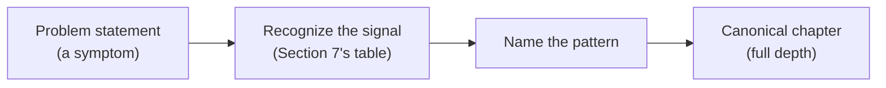
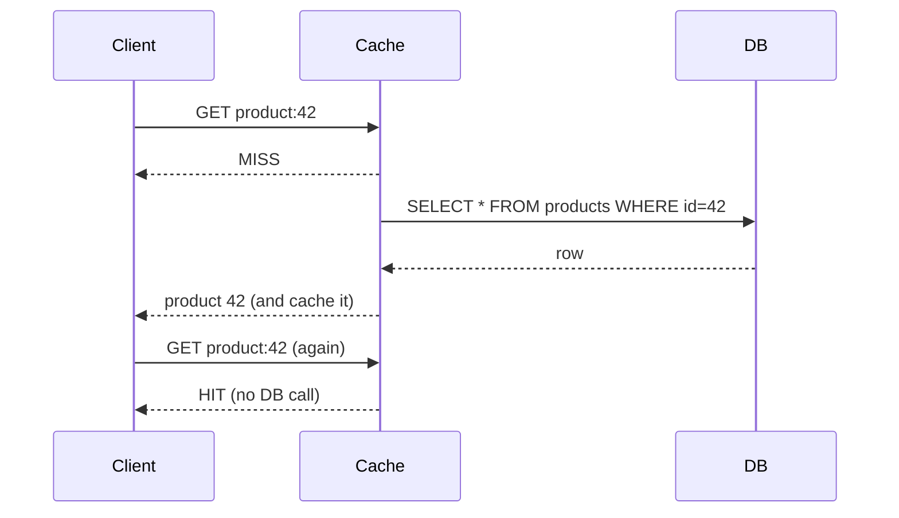
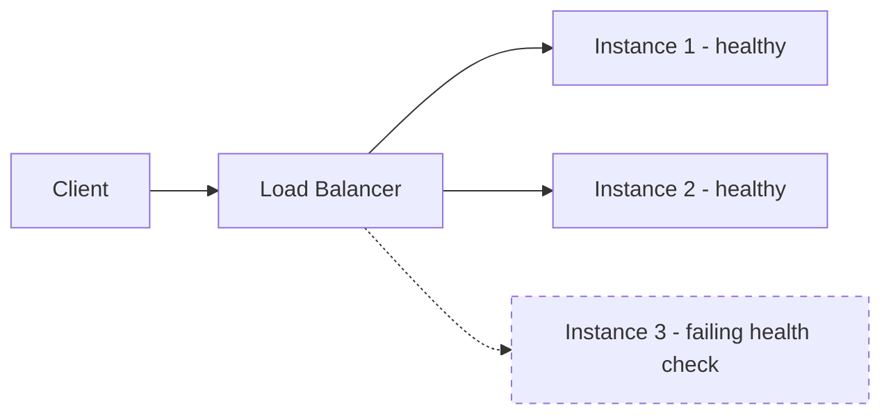
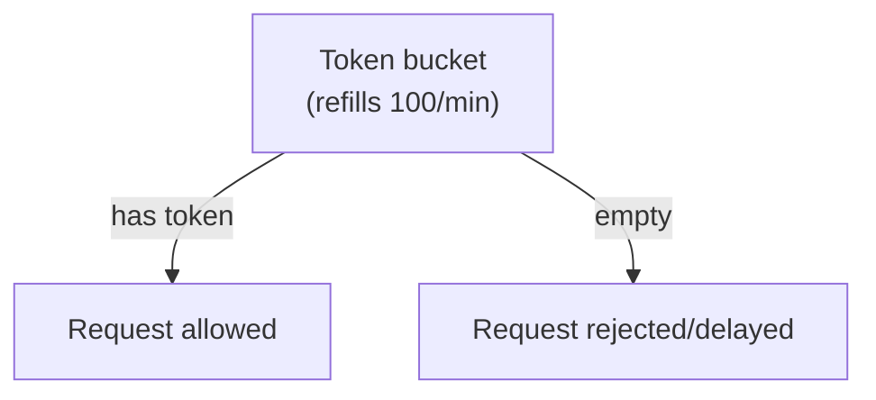
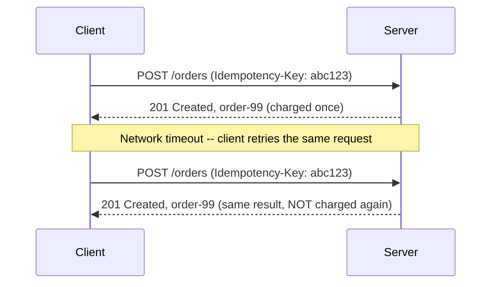
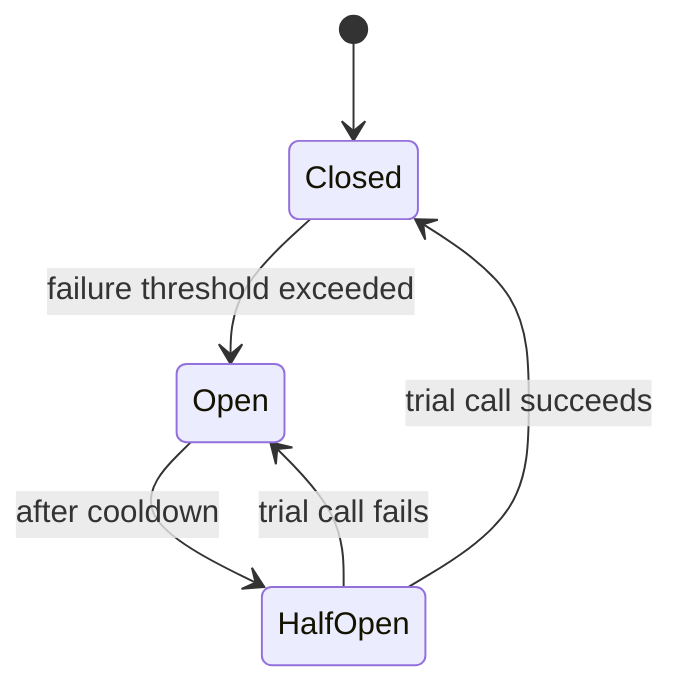
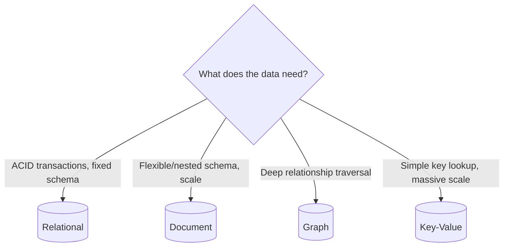
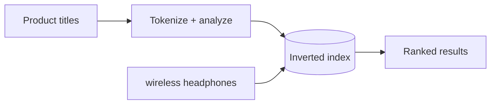
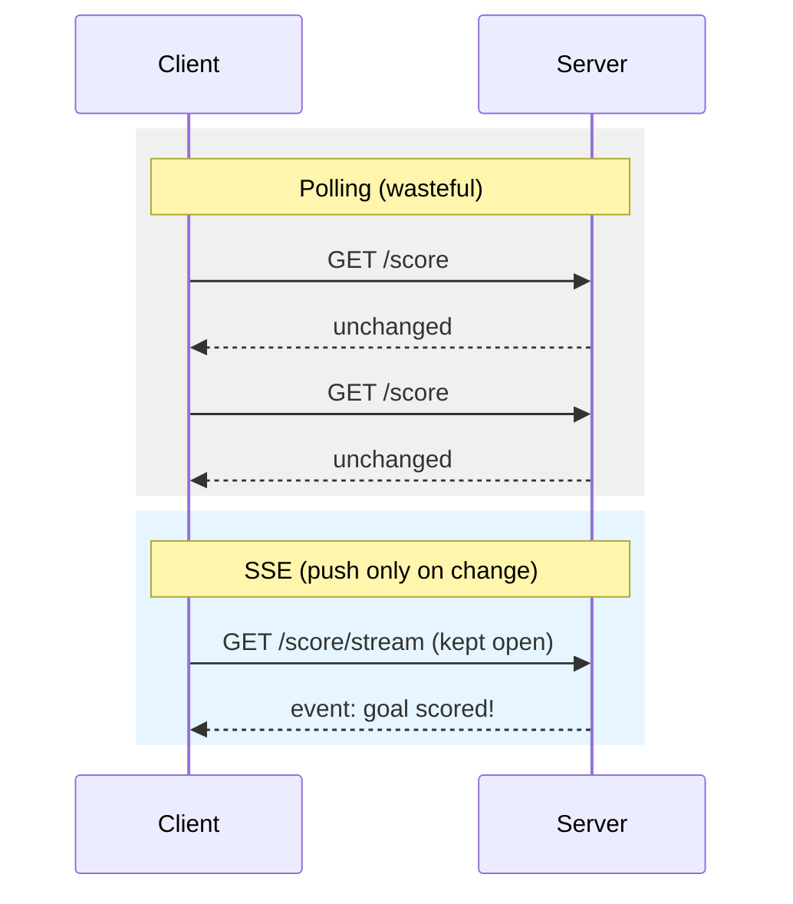

# System Design Patterns: Recognition and Quick-Reference Guide

> **Topic register:** T-2427 · Advanced tier, High interview frequency (new gap-audit topic — no entry in the original Master Topic Register)
> **Why this chapter exists.** This domain has 8 real, deep, pattern-specific chapters, each answering "how does this one pattern work, in full." None of them answers a different, earlier question a reader facing an unfamiliar prompt actually has first: **"which of these 8 patterns even applies here, and what does it look like at a glance?"** This chapter is that missing first step — a real recognition table plus one concrete example and one compact diagram per pattern — and deliberately does not re-explain any pattern already fully covered in its own canonical chapter, per this repository's own no-duplication rule.

## Table of Contents

1. [Learning Objectives](#learning-objectives)
2. [Why This Matters in Interviews](#why-this-matters-in-interviews)
3. [Level 1 — Foundation](#level-1-foundation)
4. [Level 2 — Working Knowledge](#level-2-working-knowledge)
5. [Mental Model](#mental-model)
6. [Definition and Purpose](#definition-and-purpose)
7. [Core Concepts: the Recognition Table](#core-concepts-the-recognition-table)
8. [Pattern Gallery: Examples and Diagrams](#pattern-gallery-examples-and-diagrams)
9. [Production Scenarios](#production-scenarios)
10. [Trade-offs](#trade-offs)
11. [Decision Framework: When Two Patterns Both Seem to Fit](#decision-framework-when-two-patterns-both-seem-to-fit)
12. [Common Mistakes](#common-mistakes)
13. [Anti-Patterns](#anti-patterns)
14. [Best Practices](#best-practices)
15. [Interview Answer Framework](#interview-answer-framework)
16. [Interview Questions](#interview-questions)
17. [Summary](#summary)
18. [Key Takeaways](#key-takeaways)
19. [Cheat Sheet](#cheat-sheet)
20. [Flashcards](#flashcards)
21. [Practice Exercises](#practice-exercises)
22. [Solutions](#solutions)
23. [Additional Reading](#additional-reading)

---

## Learning Objectives

By the end of this chapter you can look at an unfamiliar system-design prompt, spot the specific words and constraints that signal one of this domain's 8 patterns, sketch that pattern's shape from memory in under a minute, and name the exact canonical chapter for the full depth — instead of re-deriving each pattern's mechanics from scratch every time a new prompt uses slightly different wording.

## Why This Matters in Interviews

An interviewer almost never says "use a circuit breaker here." They describe a system — "this endpoint gets hammered by a few misbehaving clients," "this dependency occasionally goes down for a few minutes" — and the candidate who converts that description into a named pattern fast is the one who spends the remaining interview time on trade-offs and depth, not on rediscovering that a pattern applies at all. This domain's own [System Design Method and Estimation](system-design-method-and-estimation.md) teaches the six-phase *process* (Clarify → Estimate → API → Data → Architecture → Bottlenecks); this chapter teaches the *vocabulary* that process draws on once you reach the Architecture and Bottlenecks phases — the same signal-recognition skill [Coding Interview Pattern-Recognition Methodology](../03-data-structures-algorithms/coding-interview-pattern-recognition-methodology.md) (T-2120) already built for algorithmic problems, applied here to system-design prompts instead.

## Level 1 — Foundation

Think of a mechanic diagnosing a car by sound before opening the hood. A specific rattle means a loose heat shield; a specific whine means a failing bearing — the mechanic isn't re-deriving automotive engineering from first principles each time, they're matching a symptom to a known, named cause they've seen before, then opening the hood to confirm and fix it. This chapter is that same symptom-to-cause table for system-design prompts: a specific phrase in the problem ("this database gets read 1000x more than it's written," "one slow client is starving everyone else") maps to a specific, named pattern, and the "opening the hood" step is reading that pattern's own full canonical chapter.

## Level 2 — Working Knowledge

At this level you should be able to do two things without hesitation: read a one-sentence requirement and name the pattern it's pointing at, and sketch that pattern's basic shape (which boxes, which arrows) well enough to start a whiteboard conversation before diving into the canonical chapter's full depth. You should also recognize that real prompts often signal *two* patterns at once — a "handle a traffic spike safely" requirement usually needs both rate limiting (protect the service from more load than it can take) and resilience patterns (survive a downstream dependency that slows down under that same spike) — Section 11 below covers exactly this kind of overlap.

## Mental Model

Treat each pattern below the same way [Coding Interview Pattern-Recognition Methodology](../03-data-structures-algorithms/coding-interview-pattern-recognition-methodology.md) treats an algorithmic pattern: a signal you can spot in plain English, a mechanism you can sketch in one small diagram, and a canonical chapter for the full proof, trade-offs, and production depth. The skill this chapter teaches is the mapping from signal to name — not the mechanism itself, which already has a real, deep home elsewhere in this domain.

## Definition and Purpose

A **system design pattern**, in this chapter's scope, is a named, reusable solution shape to a recurring system-design problem — caching, load balancing, rate limiting, idempotency, resilience (circuit breaker/retry/bulkhead), storage selection, search indexing, and real-time delivery — each already fully covered by its own chapter in this domain. This chapter's own purpose is narrower and different: a fast, visual lookup from problem signal to pattern name, so the reader spends interview or design time applying the pattern, not searching for its name.

## Core Concepts: the Recognition Table

This is the chapter's central deliverable — a real lookup from problem signal to pattern, one-line mechanism, and the exact canonical chapter with full depth, trade-offs, and production scenarios.

| Signal / problem phrase | Pattern | One-line mechanism | Canonical chapter |
|---|---|---|---|
| "read-heavy," "same expensive query repeated," "reduce database load" | Caching | Store a computed or fetched result near the reader; serve it again until it expires or is invalidated | [Caching Strategies and Invalidation](caching-strategies-and-invalidation.md) |
| "multiple identical instances," "route to a healthy backend," "scale horizontally" | Load balancing & service discovery | Distribute requests across instances; stop routing to ones that fail health checks | [Load Balancing, Service Discovery, and Health Checking](load-balancing-service-discovery-and-health-checking.md) |
| "protect from abuse," "fair usage per client/tenant," "X requests per minute" | Rate limiting / throttling | Track request counts per key against a budget; reject or delay once the budget is exceeded | [Rate Limiting and Throttling Algorithms](rate-limiting-and-throttling-algorithms.md) |
| "safe to retry," "duplicate request," "at-least-once delivery," "processed twice" | Idempotency | Key each write by a client-supplied identifier; a retry with the same key returns the original result instead of repeating the effect | [Idempotency at System Edges](idempotency.md) |
| "downstream dependency can fail or slow down," "prevent cascading failure," "graceful degradation" | Resilience (circuit breaker, retry+jitter, timeout, bulkhead) | Stop calling a dependency that's already failing; isolate its failures from the rest of the system | [Resilience Patterns](resilience-patterns.md) |
| "which database," "need transactions vs. flexible schema vs. relationship traversal" | Storage selection | Match the data's actual access pattern (transactional, document, graph, key-value, wide-column) to the storage engine built for it | [Storage Selection Trade-offs](storage-selection-tradeoffs.md) |
| "full-text search," "search by keyword," "autocomplete," "rank by relevance" | Search and indexing | Build an inverted index from tokenized content to ranked matches, instead of scanning rows for a substring match | [Search and Indexing Systems](search-and-indexing-systems.md) |
| "live updates," "push to the client," "chat," "live scoreboard," "server-initiated notification" | Real-time delivery | Keep a live channel open (WebSocket/SSE) or poll efficiently, so the client learns of a change without asking on a fixed schedule | [Real-Time Delivery: WebSocket, SSE, Long-Polling, and Push](realtime-delivery-websocket-sse-and-long-polling.md) |

## Pattern Gallery: Examples and Diagrams

Each pattern below gets one short, concrete example distinct from its canonical chapter's own production scenario, plus one compact diagram showing the pattern's shape at a glance — not the full mechanism (that's the canonical chapter's job), just enough to recognize it on a whiteboard.

### Caching

**Example.** A product-detail page is read roughly 500 times for every one write (a price update). Caching the rendered page for 30 seconds cuts database reads by close to 99%, at the cost of a bounded 30-second staleness window on price changes.

### Load Balancing & Service Discovery

**Example.** A checkout service runs 6 replicas behind a load balancer. One replica starts failing its health check after a bad deploy; traffic reroutes to the other 5 within seconds, with zero client-visible errors.

### Rate Limiting / Throttling

**Example.** A public search API allows 100 requests/minute per API key. A misbehaving client script firing 10,000 requests/second gets throttled down to its own 100/minute budget, while every other tenant's traffic is completely unaffected.

### Idempotency

**Example.** A mobile client's "Place Order" request times out on the network and the app auto-retries. An idempotency key on the request ensures the second attempt returns the original order instead of charging the customer a second time.

### Resilience (Circuit Breaker, Retry+Jitter, Bulkhead)

**Example.** A recommendations service calls a third-party ML API that starts timing out. A circuit breaker trips after 5 consecutive failures and serves a cached fallback list instead of piling up threads waiting on a dependency that's already down.

### Storage Selection

**Example.** A social network's "who follows whom" query needs to traverse relationships 3–4 hops deep. A relational join across millions of rows is slow at that depth; a graph database answers the same traversal in milliseconds because it's built for exactly this access pattern.

### Search and Indexing

**Example.** An e-commerce catalog needs the query "wireless headphones" to match a product titled "Bluetooth Wireless Over-Ear Headphones." A SQL `LIKE '%wireless%headphones%'` scan doesn't rank by relevance or tolerate word order; an inverted index does both.

### Real-Time Delivery

**Example.** A live sports-score widget needs updates the instant a goal is scored, for thousands of simultaneously connected viewers. Polling every 5 seconds wastes a request on every idle interval; Server-Sent Events push an update only when the score actually changes.

## Production Scenarios

No new production scenario is invented here — an honest gap, not a placeholder. This chapter is a recognition-and-routing synthesis over the domain's 8 pattern chapters, each of which already carries its own real, worked production scenario (a cache-cluster failover outage, a round-robin overload, a retry-storm cascade, and so on) — inventing a ninth here would duplicate rather than add, contradicting `production-cookbook/README.md`'s rule against a scenario that wasn't first worked out from real practice.

## Trade-offs

**Speed of recognition vs. certainty.** Naming a pattern within the first thirty seconds of hearing a requirement is fast but risks the overlapping-signal trap (Section 11); methodically checking a requirement against all 8 rows of Section 7's table is more certain but costs real interview time. In practice, state your first-guess pattern out loud immediately, then confirm or revise it against the requirement's specific constraints — narrating the guess is itself a Senior-level signal (Section 15), not something to hide until certain.

## Decision Framework: When Two Patterns Both Seem to Fit

A real requirement often signals more than one pattern at once. Three concrete, frequently-confused pairs:

- **"Reduce repeated read load" — Caching vs. a database read replica.** Reach for caching when the same computed or fetched value is read far more often than it changes and a bounded staleness window is acceptable. Reach for a [read replica](../06-databases/replication-read-replicas-and-replica-lag.md) instead when the reader needs real SQL query flexibility (arbitrary filters, joins) against data that's only slightly stale — a cache can't answer an arbitrary new query, only the exact key it was populated with.
- **"Protect a downstream service" — Rate limiting vs. circuit breaker.** Rate limiting is proactive and caller-side: it bounds how much load *this* client sends, regardless of whether the callee is currently healthy. A circuit breaker is reactive and caller-side too, but triggered by *observed* failures from the callee — it doesn't stop you from sending traffic a healthy dependency can handle, only from continuing to hammer one that's already failing. A robust system frequently needs both, at different layers.
- **"Handle duplicate requests" — Idempotency vs. consumer-side message deduplication.** Idempotency (this domain) is enforced at a synchronous API/write boundary, keyed by a client-supplied identifier. Message deduplication is enforced by an asynchronous consumer reading an at-least-once broker, and typically keyed by the broker's own message ID or offset — see [Event-Driven Architecture: Integration Styles](../09-messaging-event-driven/event-driven-architecture-integration-styles.md) for the messaging-side version of the same underlying concern.

## Common Mistakes

Conceptual: assuming every "handle more load" requirement needs the same single pattern, rather than checking which of Section 7's 8 rows the *specific* stated constraint actually matches. Conceptual: treating a pattern name as the end goal rather than the start of the real conversation — naming "circuit breaker" and stopping, instead of continuing into its actual failure-threshold and fallback trade-offs (in the canonical chapter). Communication: jumping straight into a canonical chapter's full depth (e.g., three cache-invalidation strategies) before confirming with the interviewer that caching is even the right pattern for their specific constraint.

## Anti-Patterns

Memorizing this chapter's table as a fixed keyword-to-pattern mapping and pattern-matching on surface wording alone, without checking whether the requirement's actual constraints (read/write ratio, staleness tolerance, failure mode) genuinely support that pattern. Reaching for the most recently-discussed pattern out of momentum rather than because the current requirement's signals actually point there — the same "recently practiced pattern" anti-pattern [Coding Interview Pattern-Recognition Methodology](../03-data-structures-algorithms/coding-interview-pattern-recognition-methodology.md) already names for algorithmic problems.

## Best Practices

State your first-guess pattern out loud as soon as you spot a signal, then confirm it against the requirement's specific constraints before committing significant design time to it. When two patterns both plausibly apply (Section 11), say so explicitly and name the deciding factor, rather than silently picking one. Always land in the canonical chapter's actual depth once the pattern is named — this chapter's table is a fast start, not a substitute for the real trade-off discussion.

## Interview Answer Framework

### 30-Second Answer

System-design prompts rarely name a pattern directly — they describe a symptom ("read-heavy," "downstream can fail," "needs live updates"), and recognizing which of a handful of named patterns (caching, load balancing, rate limiting, idempotency, resilience, storage selection, search indexing, real-time delivery) that symptom points to, fast, is what separates spending interview time on trade-offs versus spending it rediscovering the pattern's existence.

### 2-Minute Answer

Add: most of these patterns are pairwise confusable on surface wording alone — "reduce read load" could mean caching or a read replica; "handle duplicates" could mean idempotency or message deduplication — the deciding factor is always in the requirement's specific constraints (staleness tolerance, query flexibility, sync vs. async boundary), not the surface phrase.

### 10-Minute Deep Dive

Walk through Section 7's recognition table, then pick one ambiguous pair from Section 11 and narrate the actual deciding factor out loud, the way a Senior candidate would when an interviewer's requirement plausibly matches two patterns at once. Connect to [System Design Method and Estimation](system-design-method-and-estimation.md) for where in the six-phase method this recognition skill actually gets applied (Architecture and Bottlenecks phases).

### Whiteboard Explanation

Draw the requirement as a single sentence at the top. Below it, sketch the smallest possible shape for your first-guess pattern (a box-and-arrow cache-aside flow, a token bucket, a circuit breaker's three states) — the Section 8 diagrams are deliberately this size. Only after that confirm-and-expand into the full canonical mechanism.

### Production Example

See each canonical chapter's own Production Scenarios section (Section 9 above explains why none is duplicated here) — the load-balancing chapter's round-robin overload and the resilience chapter's retry-storm cascade are two of the strongest real-world groundings for this recognition skill's stakes.

### Trade-offs to Mention

Recognition speed versus certainty (Section 10); the real cost of naming the wrong pattern under time pressure and having to backtrack mid-design versus the real cost of over-verifying every requirement against all 8 rows before committing to one.

### Common Candidate Mistakes

Naming a pattern and stopping there instead of continuing into its real trade-offs. Pattern-matching on a surface keyword without checking the requirement's actual constraints. Missing that a requirement signals two patterns at once (Section 11) and only addressing one.

### Typical Follow-Up Questions

"This requirement could be caching or a read replica — which would you pick, and why?" "What's the actual difference between rate limiting and a circuit breaker, since both 'protect' something?" "How would you tell an interviewer you think two patterns both apply here?"

### Senior-Level Expectations

Name the correct pattern from an indirect, real-world-phrased requirement (not one that already uses the pattern's own name), and state the specific constraint in the requirement that ruled out the nearest plausible alternative.

### Staff-Level Discussion

At Staff level, this same recognition skill scales from "one pattern for one requirement" to "which of these 8 patterns compose correctly across a whole system" — a real production architecture typically layers several of them together (a rate limiter in front of a circuit-breaker-protected call to a cache-fronted, read-replica-backed store), and the Staff-level judgment is sequencing and combining them correctly, not just naming each one in isolation.

## Interview Questions

### Question 1

**Question:** "A search endpoint is getting slow under load. Before proposing a fix, what would you ask, and what pattern would you expect to reach for?"
**Why interviewers ask this:** Tests whether a candidate gathers the actual constraint before pattern-matching on the word "slow" alone — "slow" could signal caching, load balancing, search indexing, or a database issue outside this domain entirely.
**Expected answer:** Ask whether the same queries repeat often (caching), whether load is spread across enough instances (load balancing), or whether the search itself is doing a slow scan rather than using an index (search and indexing) — then name the specific pattern the answer points to.
**Minimum acceptable answer:** Names at least one plausible pattern.
**Strong Senior answer:** Asks a clarifying question first, then names the specific pattern the answer would point to, distinguishing it from the other plausible candidates.
**Staff-level extension:** Notes that a real slow endpoint often needs more than one of these simultaneously (e.g., both an inverted index AND caching of common queries), and discusses how to prioritize which to build first based on measured impact.
**Common mistakes:** Jumping straight to "add a cache" without first checking whether the bottleneck is actually read-repetition versus an unindexed scan.
**Likely follow-ups:** "How would you measure which of these is the actual bottleneck before building anything?"
**Evaluation criteria (1–5):** 1 — proposes a fix with no clarifying question; 3 — asks a clarifying question but names only one candidate pattern; 5 — asks a clarifying question, names multiple candidate patterns, and states the deciding factor between them.

### Question 2

**Question:** "How do rate limiting and a circuit breaker differ, given both exist to 'protect' something under load?"
**Why interviewers ask this:** Tests whether a candidate understands the actual mechanism difference, not just that both are "resilience-adjacent" words.
**Expected answer:** Rate limiting is proactive and bounds how much load a caller sends, regardless of the callee's health; a circuit breaker is reactive, triggered by observed failures from the callee, and stops sending traffic specifically once that dependency is already failing.
**Minimum acceptable answer:** States that both protect a system but can't articulate the mechanism difference precisely.
**Strong Senior answer:** States the proactive-vs-reactive distinction and gives a concrete example of needing both at once (e.g., rate limiting a public API while circuit-breaking calls to an internal dependency that API relies on).
**Staff-level extension:** Discusses where each belongs architecturally in a real request path (rate limiting typically at the edge/gateway, circuit breakers typically at each service-to-service call site).
**Common mistakes:** Treating the two as interchangeable "protection" mechanisms.
**Likely follow-ups:** "Where in the request path would you place each one?"
**Evaluation criteria (1–5):** 1 — can't distinguish the two; 3 — states they're different but not the specific mechanism; 5 — full proactive-vs-reactive distinction with a concrete combined example.

## Summary

This domain's 8 pattern chapters each answer "how does this pattern work, in full depth" — this chapter answers the earlier question of "which pattern, from a plain-English requirement." Section 7's table maps signal to pattern to canonical chapter; Section 8 gives each pattern one concrete example and one compact diagram distinct from its canonical chapter's own deeper treatment; Section 11 covers the three most commonly confused overlapping-signal pairs. None of this duplicates the canonical chapters' own mechanics, trade-offs, or production scenarios — it routes to them, faster.

## Key Takeaways

- A system-design prompt signals a pattern through plain-English symptoms, not the pattern's own name — Section 7's table is the signal-to-pattern lookup.
- Each of this domain's 8 patterns gets one distinct example and one compact diagram here (Section 8), separate from its canonical chapter's own deeper example and diagrams.
- Several requirement pairs are frequently confused on surface wording alone (caching vs. read replica, rate limiting vs. circuit breaker, idempotency vs. message dedup) — the deciding factor is always in the requirement's specific constraints, not the phrase used.
- Naming a pattern is the start of the design conversation, not the end — always continue into the canonical chapter's real trade-offs once the pattern is identified.

## Cheat Sheet

**Mental model:** a mechanic diagnosing a symptom by sound before opening the hood — match the signal to a named pattern, then open the canonical chapter for the full mechanism.
**8 patterns, one line each:** Caching (serve a stored result instead of recomputing/refetching) · Load balancing (route only to healthy instances) · Rate limiting (bound a caller's request volume against a budget) · Idempotency (a retried write returns the original result, not a repeated effect) · Resilience (stop calling, and isolate, a dependency that's already failing) · Storage selection (match the data's access pattern to the right storage engine) · Search/indexing (rank relevance via an inverted index, not a substring scan) · Real-time delivery (push a change to the client instead of polling for it).
**Most confused pairs:** caching vs. read replica (staleness tolerance + query flexibility); rate limiting vs. circuit breaker (proactive caller-side budget vs. reactive callee-health response); idempotency vs. message dedup (sync API boundary vs. async broker/consumer boundary).
**Related:** [System Design Method and Estimation](system-design-method-and-estimation.md) · [Coding Interview Pattern-Recognition Methodology](../03-data-structures-algorithms/coding-interview-pattern-recognition-methodology.md)

## Flashcards

See [`flashcards/system-design-patterns-recognition-and-quick-reference.md`](../../flashcards/system-design-patterns-recognition-and-quick-reference.md).

## Practice Exercises

1. Take a real requirement from any Architecture Atlas entry (e.g., "the URL shortener needs to serve the same popular short links millions of times") and, without opening the canonical chapter, name the pattern Section 7's table points to and sketch its Section 8 diagram from memory.
2. Write one new requirement sentence, in plain English, that deliberately signals two of this chapter's 8 patterns at once (following Section 11's model), and state which pattern you'd design first and why.

## Solutions

Exercise 1: "the same popular short links served millions of times" signals Caching (a read-heavy, repeated-value pattern) — the diagram is Section 8's cache-aside sequence (miss once, hit on every subsequent read), and the full mechanism (cache-aside vs. read-through, TTL vs. explicit invalidation) lives in [Caching Strategies and Invalidation](caching-strategies-and-invalidation.md). Exercise 2 (representative answer): "A checkout API needs to survive a traffic spike from a flash sale without letting any single retailer's storefront starve the others, and without piling up requests against a payment processor that slows down under that same spike" signals both rate limiting (per-retailer fairness) and resilience (surviving the payment processor's slowdown) — rate limiting is usually designed first, since it bounds the problem's scale before resilience patterns have to absorb whatever gets through.

## Additional Reading

- [System Design Method and Estimation](system-design-method-and-estimation.md) — the six-phase process this chapter's recognition skill plugs into.
- [Coding Interview Pattern-Recognition Methodology](../03-data-structures-algorithms/coding-interview-pattern-recognition-methodology.md) (T-2120) — the same recognition-skill approach, applied to algorithmic problems instead of system-design prompts.
- Every row of Section 7's table links to that pattern's own canonical chapter — the natural next read once a requirement has been routed to it.
