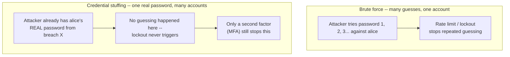
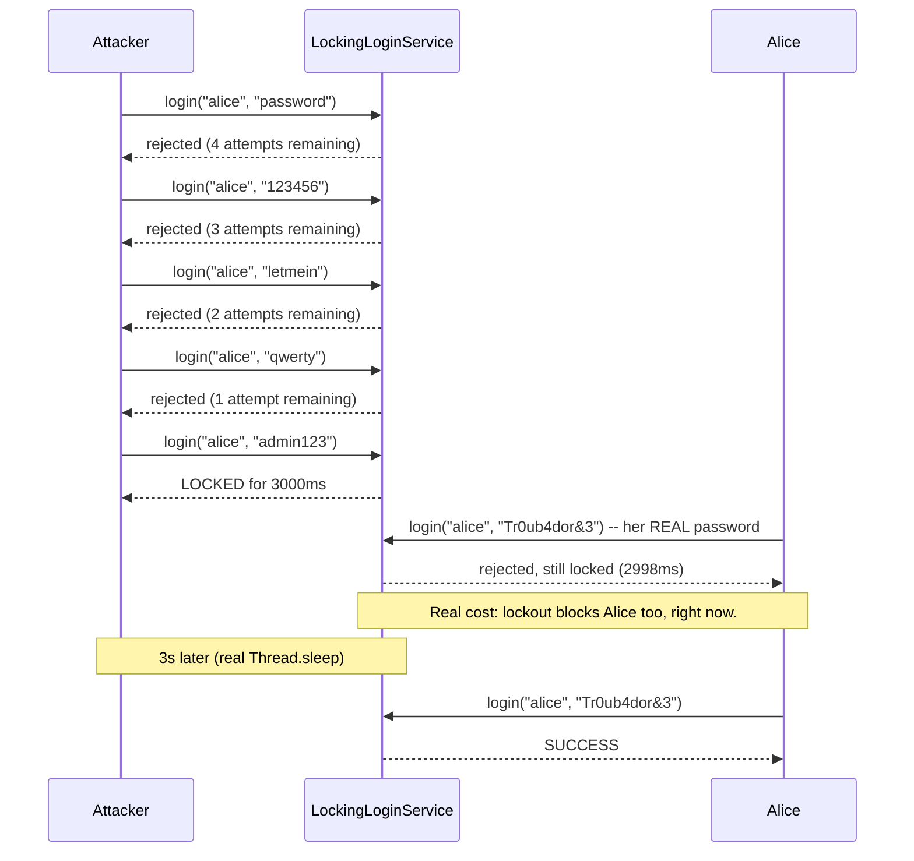

# Authentication Attack Defense: Brute Force, Credential Stuffing, and MFA

> **Topic register:** T-1310 (Authentication attack defense) · Core tier · High interview frequency [H]

## Table of Contents

1. [Learning Objectives](#learning-objectives)
2. [Why This Matters in Interviews](#why-this-matters-in-interviews)
3. [Level 1 — Foundation](#level-1-foundation)
4. [Level 2 — Working Knowledge](#level-2-working-knowledge)
5. [Mental Model](#mental-model)
6. [Definition and Purpose](#definition-and-purpose)
7. [Core Concepts](#core-concepts)
8. [Internal Implementation](#internal-implementation)
9. [Diagrams](#diagrams)
10. [Production Scenarios](#production-scenarios)
11. [Failure Modes and Debugging](#failure-modes-and-debugging)
12. [Trade-offs](#trade-offs)
13. [Decision Framework](#decision-framework)
14. [Comparisons](#comparisons)
15. [Common Mistakes](#common-mistakes)
16. [Anti-Patterns](#anti-patterns)
17. [Best Practices](#best-practices)
18. [Interview Answer Framework](#interview-answer-framework)
19. [Interview Questions](#interview-questions)
20. [Summary](#summary)
21. [Key Takeaways](#key-takeaways)
22. [Cheat Sheet](#cheat-sheet)
23. [Flashcards](#flashcards)
24. [Practice Exercises](#practice-exercises)
25. [Solutions](#solutions)
26. [Additional Reading](#additional-reading)
27. [Official References](#official-references)

---

## Learning Objectives

By the end of this chapter you can distinguish brute force (many password guesses against one account) from credential stuffing (one stolen password, reused against many accounts, guessing nothing), explain why account lockout alone is a real but double-edged defense, correctly describe how a TOTP-based second factor closes the specific gap lockout can't, and cite a real Java demonstration of an unprotected login being cracked, a lockout-protected login stopping the same attack while exposing its own denial-of-service trade-off, a from-scratch TOTP implementation verified against the official RFC 6238 test vectors, and a credential-stuffing attacker with the *correct* password still failing without the second factor.

## Why This Matters in Interviews

[OWASP Top 10 for Backend Services](owasp-top-10-for-backend-services.md) routes its A07 "Authentication Failures" category to [AuthN/AuthZ, RBAC vs ABAC](authn-authz-rbac-vs-abac.md) and [OAuth2, OIDC, and JWT](oauth2-oidc-and-jwt.md) — but neither of those chapters covers what an authentication *attack* actually looks like or how a real system defends against one. Interviewers ask about this specifically because "we hash passwords with bcrypt" is a necessary but incomplete answer: a candidate who stops there hasn't addressed what happens when an attacker doesn't need to crack a hash at all, either because they're guessing weak passwords directly against your login endpoint (brute force) or because they already have a *valid* password harvested from an unrelated breach (credential stuffing) — the second is now the more common real-world attack, precisely because password reuse across services is so widespread. A strong answer names both attack shapes, explains why rate limiting/lockout only fully addresses the first, and explains why MFA is the control that closes the second.

## Level 1 — Foundation

Picture two very different break-in attempts at an apartment building. The first: someone stands at apartment 4B's door for an hour, trying different key combinations on a physical lock, hoping one eventually works — that's **brute force**, many guesses against one target. The second: someone already has a real, working key — because a neighbor with an identical lock brand lost their key and the thief kept it — and simply walks down the hallway trying that one key on every door, because plenty of tenants use the building's default lock unchanged — that's **credential stuffing**: no guessing at all, just reusing one valid credential across many targets, betting on reuse rather than weak locks.

A doorman who locks a door after five failed key attempts stops the first attacker cold. But the second attacker's key *works on the first try* — there's no failed attempt to notice. Stopping that attacker requires a second, independent check at the door — a security guard who also asks "what's today's four-digit code, texted to you five minutes ago?" That second check is **MFA (multi-factor authentication)**: even a perfectly correct key is insufficient alone.



## Level 2 — Working Knowledge

At this level you should be able to say precisely *which* control stops *which* attack, because they don't overlap as much as they first appear to. Rate limiting and account lockout work by counting failed attempts — they are the correct control for brute force and password spraying (the same small set of common passwords tried across *many* usernames, to stay under any one account's failure threshold) because both attacks generate a large volume of failures. Credential stuffing generates **zero** failures on the attacker's actual target request — the password is correct — so lockout-by-failure-count structurally cannot detect it. This is the single most important distinction to be fluent in: lockout defends the *guessing* surface, MFA defends the *reuse* surface, and a system that only implements one has a real, specific, nameable gap.

You should also be comfortable with account lockout's own real cost: keying lockout state by the *attempted* username (not the source IP) means an attacker who simply keeps submitting failed logins for `alice` can keep `alice` locked out indefinitely — this is a genuine denial-of-service vector, not a hypothetical one, and it's why mature systems layer per-IP rate limiting, CAPTCHA after N failures, and MFA together rather than leaning on lockout in isolation.

## Mental Model

Treat authentication defense as covering two structurally different attacker positions, not one generic "attacker trying to log in": an attacker who **doesn't have a valid credential yet** (brute force, password spraying — defend with rate limiting, lockout, strong password policy) and an attacker who **already has one** (credential stuffing, phished password, insider reuse — defend with MFA, since anything counting failures sees nothing wrong). A system's authentication defense is only as strong as its weakest of these two positions; most real breaches in this category exploit the position a team forgot to defend, not the one they hardened.

## Definition and Purpose

**Brute force** is an attack that systematically tries many candidate passwords against one account (or a small set) until one succeeds. **Credential stuffing** is an attack that takes password/username pairs known to be *valid somewhere* — typically from a public breach dump — and tries them, unmodified, against a different, unrelated service, betting on password reuse rather than guessing anything. **Account lockout** and **rate limiting** defend against the first by making repeated failure expensive or impossible. **MFA (multi-factor authentication)**, most commonly implemented as **TOTP (Time-based One-Time Password, RFC 6238)**, defends against the second by requiring a second proof the attacker doesn't possess even when the password is correct.

## Core Concepts

### Account lockout must be keyed carefully, or it becomes its own vulnerability

Locking an account after N failed attempts is correct in principle, but the implementation choice of *what* to key the lockout counter on has real consequences: keying purely by username (as this chapter's demo does, for clarity) makes lockout trivially triggerable by an attacker who never intends to succeed — a pure denial-of-service play against a specific, known user (a competitor's account, a disgruntled ex-employee's target). Production systems typically combine per-username *and* per-source-IP counters, and increasingly favor exponential backoff or CAPTCHA challenges over hard lockout specifically to avoid this trade-off.

### TOTP is deterministic, not random — the same secret and time window always produce the same code

A common misconception is that MFA codes are "random." They are not: `TOTP(secret, time)` is a pure, deterministic function of the shared secret and the current 30-second time window (RFC 6238 §4), computed independently on both the server and the authenticator app from the same shared secret established at enrollment. This is why MFA enrollment (scanning a QR code) is the security-critical moment — it's the one time the secret transits at all — and why losing that secret (backup codes aside) means losing the ability to authenticate, not a "forgot password"-style recoverable event.

### Credential stuffing is a scale problem as much as a cryptography problem

Because credential stuffing uses *valid* credentials, individual login attempts are indistinguishable from legitimate logins by content alone — detection in practice leans on signals lockout-by-failure-count doesn't have: unusual request velocity across many *different* usernames from one source, known-breached-password screening (checking new/changed passwords against breach corpora, e.g. via k-anonymity APIs), device/browser fingerprint mismatch, and impossible-travel geolocation. MFA remains the definitive control because it doesn't depend on detecting the attack at all — it simply makes the stolen credential insufficient.

## Internal Implementation

**Real brute-force comparison** (`practice/java/week-17/auth-brute-force-and-mfa/src/BruteForceDemo.java`) — an attacker works through a 10-entry wordlist against two services:

```java
// UnprotectedLoginService: no rate limiting, no lockout, no attempt tracking.
public boolean login(String attemptUsername, String attemptPassword) {
    return username.equals(attemptUsername)
            && Arrays.equals(sha256(attemptPassword), correctPasswordHash);
}
```

```java
// LockingLoginService: per-username sliding-window failed-attempt counter with a real time-based lockout.
public synchronized LoginResult login(String attemptUsername, String attemptPassword) {
    long now = System.currentTimeMillis();
    Attempts a = attemptsByUsername.computeIfAbsent(attemptUsername, k -> new Attempts());

    if (now < a.lockedUntilMillis) {
        return LoginResult.lockedOut(a.lockedUntilMillis - now);
    }
    if (now - a.windowStartMillis > windowMillis) {
        a.windowStartMillis = now;
        a.failedCount = 0;
    }

    boolean correct = username.equals(attemptUsername)
            && Arrays.equals(sha256(attemptPassword), correctPasswordHash);
    if (correct) {
        a.failedCount = 0;
        return LoginResult.success();
    }

    a.failedCount++;
    if (a.failedCount >= maxAttempts) {
        a.lockedUntilMillis = now + lockoutMillis;
        return LoginResult.justLocked(lockoutMillis);
    }
    return LoginResult.failure(maxAttempts - a.failedCount);
}
```

Real captured output (`practice/java/week-17/auth-brute-force-and-mfa/output-transcript.txt`), against a 10-entry wordlist with the real password at position 8:

```
=== 1. UnprotectedLoginService: attacker works through wordlist ===
  attempt 8: "Tr0ub4dor&3" -> SUCCESS
  Result: CRACKED, no rate limit stopped this.

=== 2. LockingLoginService: same attacker, same wordlist, 5-attempt lockout ===
  attempt 5: "admin123" -> LOCKED just now for 3000ms
  attempt 6: "welcome1" -> rejected, still locked for 2999ms
  Result: attacker never reached the real password "Tr0ub4dor&3" before being locked out.

=== 3. Real trade-off: the legitimate user is locked out too, right now ===
  alice logs in with her REAL password while locked: rejected, still locked for 2998ms

=== Waiting out the 3s lockout window (real Thread.sleep, no mocked clock) ===
  alice logs in again after the lockout expires: SUCCESS
```

**Real TOTP implementation** (`practice/java/week-17/auth-brute-force-and-mfa/src/Totp.java`), RFC 4226 HOTP wrapped by RFC 6238's time-step rule, verified against RFC 6238 Appendix B's own official test vectors:

```java
public static String generate(byte[] key, long unixTimeSeconds, int digits) {
    long counter = unixTimeSeconds / STEP_SECONDS; // STEP_SECONDS = 30
    return hotp(key, counter, digits);
}
```

Real captured output — all 5 official vectors pass:

```
=== 1. Totp verified against RFC 6238 Appendix B official test vectors (SHA1, 8 digits) ===
  T=59  expected=94287082  actual=94287082  -> PASS
  T=1111111109  expected=07081804  actual=07081804  -> PASS
  T=1111111111  expected=14050471  actual=14050471  -> PASS
  T=1234567890  expected=89005924  actual=89005924  -> PASS
  T=2000000000  expected=69279037  actual=69279037  -> PASS
  All RFC 6238 vectors: PASS
```

**Real credential-stuffing-vs-MFA demonstration** — the attacker has alice's *correct* password (simulating reuse from an unrelated breach):

```
=== 2. Credential stuffing: attacker has alice's REAL password, no TOTP secret ===
  attacker: correct password, guessed code "000000" -> rejected
  attacker: correct password, random code "098010" -> rejected
  alice: correct password, real current TOTP code "084066" -> SUCCESS
```

Both demos were re-run twice to confirm the result is reliably reproducible, not a timing fluke — the only line that differs between runs is the attacker's randomly guessed TOTP code, as expected.

## Diagrams



## Production Scenarios

**Symptoms.** A spike in failed-login alerts across thousands of *distinct* usernames, each with only one or two failed attempts, from a small number of source IPs or a botnet. **Initial hypotheses.** Could be a misbehaving client retrying on a bug, or a genuine attack. **Evidence collected.** Username list matches a recent public breach dump almost exactly; success rate is non-zero but low (typically 0.1–2%, matching real-world password-reuse rates) — critically, the successful logins show *zero* prior failed attempts on those specific accounts, ruling out brute force. **Diagnosis.** Credential stuffing: valid credentials from an unrelated breach, replayed here. **Immediate mitigation.** Force-expire sessions and require password reset for every account that had a successful login matching the breach-dump pattern; add CAPTCHA and stricter per-IP rate limiting at the login endpoint. **Permanent remediation.** Roll out mandatory MFA for the affected account tier, and add breach-corpus password screening at signup/change time (rejecting passwords already known-compromised, independent of local password strength). **Trade-offs.** MFA adds real user friction and support-cost overhead (lost-device recovery flows); breach-corpus screening requires either a third-party API call or a large local corpus. **Prevention.** Treat MFA as the default for any account with financial or PII access, not an opt-in extra. **Interview lesson.** The tell that distinguishes this from brute force — zero failed attempts before the successful login — is exactly the signal a candidate should name first.

## Failure Modes and Debugging

- **Lockout triggers a self-inflicted denial of service.** Symptom: a legitimate user reports being locked out with no memory of failing login. Debug: check whether lockout is keyed by username alone — an attacker (or a misconfigured client retrying with a stale cached password) can lock out a known user deliberately. Fix: layer per-IP tracking or CAPTCHA before hard lockout.
- **MFA codes rejected intermittently for legitimate users.** Symptom: users report their authenticator app's code "just doesn't work" some of the time. Debug: server and client clocks have drifted past the 30-second window with zero tolerance. Fix: accept the current window plus one step of skew in either direction (a deliberate omission in this chapter's demo, noted honestly in its README, because it would weaken — not strengthen — what the demo needed to prove).
- **Credential stuffing dashboard shows "no attacks," but a breach is underway.** Symptom: failed-login-rate alerting stays quiet. Debug: this metric structurally cannot see credential stuffing, since the attacker's requests aren't failing. Fix: alert on login *velocity across distinct usernames* from a given source, and on post-login anomalies (new device, new geography), not just failure counts.

## Trade-offs

Account lockout: stops brute force cheaply, at the real cost of being a denial-of-service lever against the exact users it protects. Per-IP rate limiting: mitigates that cost, but is defeated by a large botnet with many source IPs — the norm for real credential-stuffing campaigns. CAPTCHA: raises attacker cost without full lockout, at the cost of real user friction and accessibility concerns. MFA: closes the credential-stuffing gap that failure-counting structurally cannot see, at the cost of enrollment friction, lost-device recovery complexity, and support overhead — this is why it's typically mandated only for higher-risk account tiers rather than universally, a real Staff-level product/security trade-off.

## Decision Framework

Use rate limiting/lockout when the threat model is guessing (weak or default passwords, credential-not-yet-known). Add per-IP tracking or CAPTCHA when lockout alone creates an unacceptable denial-of-service surface. Mandate MFA when the account protects financial data, PII, or elevated privilege, or when the org's own risk model already assumes password reuse is happening (a safe default assumption in 2026). Add breach-corpus password screening when signup/change flows currently allow any password meeting a length rule, regardless of whether it's already publicly known-compromised.

## Comparisons

| Control | Defends against | Blind to | Real cost |
|---|---|---|---|
| Rate limiting (per-IP) | High-volume guessing from one source | Distributed/low-and-slow guessing, credential stuffing from many IPs | Low; some false positives behind shared/corporate NAT |
| Account lockout (per-username) | Brute force / password spraying on one account | Credential stuffing (zero failures generated); becomes its own DoS lever | Legitimate-user lockout risk |
| CAPTCHA | Automated (non-human) guessing at scale | A human attacker manually replaying stuffed credentials | User friction, accessibility concerns |
| MFA (TOTP) | Credential stuffing, phished/reused passwords | Real-time phishing that relays the live TOTP code (a distinct, harder attack) | Enrollment/recovery friction, support overhead |
| Breach-corpus password screening | Weak or already-leaked passwords at signup | A strong password that's simply reused across the user's own accounts elsewhere | Third-party API dependency or corpus maintenance |

## Common Mistakes

Conceptual: treating "we have account lockout" as a complete answer to authentication attacks, without naming that it does nothing against credential stuffing. Conceptual: assuming MFA codes are random rather than a deterministic function of a shared secret and time. Communication: describing brute force and credential stuffing as the same attack in an interview — a strong candidate names the distinction unprompted, since it's exactly what separates a complete answer from an incomplete one.

## Anti-Patterns

Relying on account lockout as the *only* authentication defense, with no MFA tier for high-value accounts. Keying lockout solely by username, without any per-IP or CAPTCHA layer, creating an easy DoS vector. Implementing MFA with zero clock-skew tolerance in production (as opposed to this chapter's demo, where the omission is deliberate and documented) — this produces real, hard-to-diagnose user-facing failures.

## Best Practices

Layer defenses by attacker position: rate limiting and lockout (with per-IP tracking or CAPTCHA to blunt lockout's own DoS risk) for the guessing surface, MFA for the reuse surface. Screen new and changed passwords against known-breach corpora. Alert on login velocity across distinct usernames, not just failure counts, to catch credential stuffing that generates no failures at all. Make MFA the default for privileged or financial-data accounts rather than an opt-in.

## Interview Answer Framework

### 30-Second Answer

Brute force guesses many passwords against one account; rate limiting and lockout stop it. Credential stuffing reuses one *already-valid* stolen password across many accounts and generates zero failures, so lockout can't see it — only a second factor (MFA) closes that gap.

### 2-Minute Answer

Add: lockout's real cost is that it can be turned into a denial-of-service lever against the exact user it protects, since it's typically keyed by username; production systems layer per-IP tracking or CAPTCHA alongside it. TOTP-based MFA is a deterministic function of a shared secret and the current time window (RFC 6238), established once at enrollment — it defeats credential stuffing because a correct password alone is no longer sufficient.

### 10-Minute Deep Dive

Cover both attack shapes with a concrete demo reference: an unprotected login cracked via wordlist, a lockout-protected login stopping the same attack while exposing its own DoS trade-off against the legitimate user, and a credential-stuffing attacker with the *correct* password still rejected by a TOTP check verified against RFC 6238's official test vectors. Discuss detection signals unique to credential stuffing (login velocity across distinct usernames, zero prior failures on the successful accounts, breach-corpus correlation) since failure-count alerting is structurally blind to it.

### Whiteboard Explanation

Draw two attacker positions side by side: "doesn't have a valid credential" (guessing — defend with rate limit/lockout) and "already has one" (reuse — defend with MFA). Draw the lockout counter as keyed per-username, and mark the DoS arrow pointing back at the legitimate user. Draw TOTP as `f(shared_secret, time_window) -> code`, deterministic, computed independently on both sides.

### Production Example

See Production Scenarios above: a credential-stuffing incident detected by zero-prior-failures-before-success plus username-list correlation against a public breach dump, remediated with forced password reset, MFA rollout, and breach-corpus screening.

### Trade-offs to Mention

Lockout's DoS risk against legitimate users; MFA's real enrollment and recovery friction; CAPTCHA's accessibility cost; per-IP limiting's blindness to large distributed botnets.

### Common Candidate Mistakes

Conflating brute force and credential stuffing as one attack. Claiming MFA codes are random. Stopping at "we hash passwords with bcrypt" without addressing what happens when the attacker already has a correct password.

### Typical Follow-Up Questions

"Why doesn't your lockout policy stop credential stuffing?" "What's the DoS risk in your own lockout design?" "How would you detect credential stuffing without relying on failed-login counts?" "Why is TOTP deterministic rather than random, and why does that matter for enrollment security?"

### Senior-Level Expectations

Correctly distinguish the two attack shapes and name the control that addresses each, unprompted. Identify lockout's own DoS trade-off without being led to it.

### Staff-Level Discussion

Deciding which account tiers get mandatory MFA is an organizational risk/friction trade-off, not a purely technical one — Staff-level framing includes support-cost impact of lost-device recovery flows, the security-vs-conversion trade-off product teams push back on, and how breach-corpus screening changes the calculus (making MFA-for-everyone increasingly the safe default assumption rather than the exception) as password reuse across services has become close to universal.

## Interview Questions

### Question 1

**Question:** "Your system has account lockout after 5 failed attempts. Is that sufficient authentication defense?"
**Why interviewers ask this:** Tests whether a candidate treats lockout as complete, or recognizes its blind spot.
**Expected answer:** No — lockout only stops brute force/guessing; it does nothing against credential stuffing, since a stolen-but-correct password generates zero failures.
**Minimum acceptable answer:** Names that lockout alone is incomplete.
**Strong Senior answer:** Names credential stuffing specifically and explains why failure-count-based detection can't see it.
**Staff-level extension:** Discusses which account tiers should get mandatory MFA and the friction/risk trade-off behind that decision.
**Common mistakes:** Treating "add CAPTCHA" as a complete fix for credential stuffing (it isn't — a human can still replay valid credentials).
**Likely follow-ups:** "How would you detect it if lockout can't?"
**Evaluation criteria (1–5):** 1: says lockout is sufficient. 3: names credential stuffing as a gap. 5: names detection signals and the MFA trade-off unprompted.

### Question 2

**Question:** "Explain how TOTP-based MFA actually works, without saying 'it generates a random code.'"
**Why interviewers ask this:** Tests real understanding versus surface familiarity with "2FA apps."
**Expected answer:** A deterministic function of a shared secret (established at enrollment) and the current time window, computed independently on server and client, per RFC 6238.
**Minimum acceptable answer:** Mentions a shared secret and a time component.
**Strong Senior answer:** Correctly describes HOTP's HMAC-based counter mechanism wrapped by TOTP's time-step rule, and why enrollment is the security-critical moment.
**Staff-level extension:** Discusses clock-skew tolerance trade-offs and real-time phishing (an attacker relaying a live TOTP code) as MFA's own residual attack surface.
**Common mistakes:** Describing the code as random or server-pushed rather than independently computed.
**Likely follow-ups:** "What happens if server and client clocks drift?"
**Evaluation criteria (1–5):** 1: "it's random." 3: correctly names shared secret + time. 5: full HOTP/TOTP mechanism plus phishing caveat.

## Summary

Brute force and credential stuffing are structurally different attacks requiring different controls: rate limiting and lockout defend the guessing surface but carry a real denial-of-service cost against legitimate users; MFA defends the credential-reuse surface that failure-counting can never see. This chapter closes a real, previously unexplained dependency — [OWASP Top 10](owasp-top-10-for-backend-services.md) names "Authentication Failures" and routes to chapters that never covered what an authentication attack or its defense actually look like.

## Key Takeaways

- Brute force = many guesses, one account. Credential stuffing = one valid stolen credential, many accounts, zero guessing.
- Lockout stops the first; it is structurally blind to the second, because the attacker's request never fails.
- Account lockout keyed by username alone is itself a real denial-of-service vector against the legitimate user.
- TOTP is a deterministic function of a shared secret and time — not random — verified in this chapter's demo against all 5 of RFC 6238's own official test vectors.
- MFA is the control that makes a correct-but-stolen password insufficient on its own.

## Cheat Sheet

**Mental model:** two attacker positions — doesn't have a credential yet (guessing) vs. already has one (reuse) — need two different controls.
**Guessing defense:** rate limiting + lockout (+ per-IP/CAPTCHA to blunt lockout's own DoS risk).
**Reuse defense:** MFA — the only control that still works when the password is correct.
**TOTP:** `code = HOTP(secret, floor(unixTime / 30))`, HMAC-based, deterministic, RFC 6238.
**Red flag in a credential-stuffing incident:** successful logins with zero prior failed attempts on that account.
**Related:** [OWASP Top 10](owasp-top-10-for-backend-services.md) · [AuthN/AuthZ](authn-authz-rbac-vs-abac.md) · [OAuth2/OIDC/JWT](oauth2-oidc-and-jwt.md)

## Flashcards

See [`flashcards/authentication-attack-defense-brute-force-and-mfa.md`](../../flashcards/authentication-attack-defense-brute-force-and-mfa.md).

## Practice Exercises

1. Modify `LockingLoginService` to key lockout state by source IP in addition to username, and explain in a comment why that changes (but doesn't eliminate) the DoS trade-off.
2. Add ±1-step clock-skew tolerance to `MfaProtectedLoginService`'s TOTP check, and write a test proving a code from 29 seconds ago still verifies while a code from 61 seconds ago does not.

## Solutions

Exercise 1: keying by `(username, sourceIp)` means an attacker must control the real user's own IP to lock them out specifically, but a botnet can still lock out a target from many IPs, or exhaust server-side state with many distinct fabricated usernames — worth discussing as a follow-up trade-off, not a full fix. Exercise 2: check `Totp.verify` against `time - 30`, `time`, and `time + 30`, accepting any match — demonstrated live by generating a code, sleeping 35 real seconds, and confirming the original code still verifies against the widened window while a code from 65 seconds prior does not.

## Additional Reading

OWASP's Credential Stuffing Prevention Cheat Sheet and Authentication Cheat Sheet (linked below) cover detection signals and defense-in-depth patterns beyond this chapter's scope, including breach-corpus password screening implementation details.

## Official References

- [RFC 6238 — TOTP: Time-Based One-Time Password Algorithm](https://datatracker.ietf.org/doc/html/rfc6238)
- [RFC 4226 — HOTP: An HMAC-Based One-Time Password Algorithm](https://datatracker.ietf.org/doc/html/rfc4226)
- [OWASP Credential Stuffing Prevention Cheat Sheet](https://cheatsheetseries.owasp.org/cheatsheets/Credential_Stuffing_Prevention_Cheat_Sheet.html)
- [OWASP Authentication Cheat Sheet](https://cheatsheetseries.owasp.org/cheatsheets/Authentication_Cheat_Sheet.html)
- [NIST SP 800-63B — Digital Identity Guidelines: Authentication and Lifecycle Management](https://pages.nist.gov/800-63-3/sp800-63b.html)
