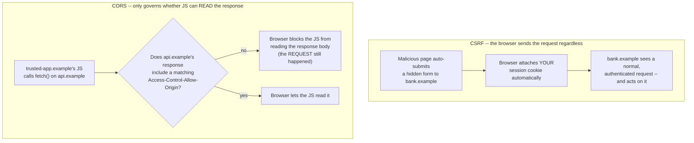

# CSRF, CORS, and Session Security

> **Topic register:** T-1308 (CSRF, CORS, and session security) · Core tier · High interview frequency [H]

## Table of Contents

1. [Learning Objectives](#learning-objectives)
2. [Why This Matters in Interviews](#why-this-matters-in-interviews)
3. [Level 1 — Foundation](#level-1--foundation)
4. [Level 2 — Working Knowledge](#level-2--working-knowledge)
5. [Mental Model](#mental-model)
6. [Definition and Purpose](#definition-and-purpose)
7. [Core Concepts](#core-concepts)
8. [Internal Implementation](#internal-implementation)
9. [Diagrams](#diagrams)
10. [Production Scenarios](#production-scenarios)
11. [Failure Modes and Debugging](#failure-modes-and-debugging)
12. [Trade-offs](#trade-offs)
13. [Decision Framework](#decision-framework)
14. [Comparisons](#comparisons)
15. [Common Mistakes](#common-mistakes)
16. [Anti-Patterns](#anti-patterns)
17. [Best Practices](#best-practices)
18. [Interview Answer Framework](#interview-answer-framework)
19. [Interview Questions](#interview-questions)
20. [Summary](#summary)
21. [Key Takeaways](#key-takeaways)
22. [Cheat Sheet](#cheat-sheet)
23. [Flashcards](#flashcards)
24. [Practice Exercises](#practice-exercises)
25. [Solutions](#solutions)
26. [Additional Reading](#additional-reading)
27. [Official References](#official-references)

---

## Learning Objectives

By the end of this chapter you can explain why a browser's automatic cookie-attachment behavior is the entire mechanism CSRF exploits, correctly distinguish CORS (a server telling browsers which cross-origin *reads* to permit) from CSRF (a cross-origin *write* the browser never needed permission to attempt), and cite a real Java demonstration of a forged cross-site transfer succeeding against a cookie-only endpoint and failing against a synchronizer-token-protected one, real evidence of CORS's origin-allowlist header logic, and real evidence of a session-fixation attack succeeding and being closed by session-ID regeneration on login.

## Why This Matters in Interviews

CSRF, CORS, and session security are three of the most commonly confused topics in web application security — candidates routinely describe CORS as "a security feature that stops attacks," when it is closer to the opposite: a mechanism that *relaxes* a browser's default same-origin restriction, under carefully controlled conditions. Interviewers ask about this cluster specifically to see whether a candidate can hold three separate, precise mental models at once: CORS governs whether a browser lets a page's own JavaScript *read* a cross-origin response; CSRF exploits the fact that a browser *automatically attaches cookies* to a request regardless of which page initiated it, so the attack doesn't need to read anything back — it just needs the request to have a side effect; and session fixation exploits a server trusting a session identifier the server itself never generated. A candidate who explains why a correctly configured CORS policy does nothing to stop CSRF (a classic follow-up trap) demonstrates the precise, non-conflated understanding this topic is actually testing for.

## Level 1 — Foundation

Imagine you're a member of an exclusive club, and your membership card sits in your coat pocket at all times — the coat-check attendant at *this* club's door checks it automatically, every time you walk in, without you doing anything. Now imagine someone tricks you into walking through a *different* door — one that happens to lead back into the same club's members-only area — while you're still wearing that same coat. The attendant at the second door still sees your card in your pocket and lets you through, because the card doesn't know or care which door you approached from. **CSRF (Cross-Site Request Forgery)** is exactly this: your browser automatically attaches your session cookie to any request sent to a site you're logged into, no matter which page on the internet actually triggered that request — so a malicious page can make your browser submit a request to your bank, and your bank sees a perfectly normal, cookie-authenticated request.

**CORS (Cross-Origin Resource Sharing)** solves a completely different problem: by default, a browser won't let a page from `evil.example` read the *response* of a request it makes to `bank.example` — CORS is the mechanism a server uses to say "actually, it's fine, `trusted-app.example` specifically is allowed to read what I send back." CORS is permission to *read a response*; it does nothing about a browser's willingness to *send a request with cookies attached* in the first place — which is exactly why a correctly configured CORS policy provides zero protection against CSRF.



The critical detail in the CORS branch: even when the answer is "no," the request itself was still sent and still executed server-side — CORS blocks the browser from letting the calling page's JavaScript *read the response*, not the request from reaching the server at all. That's precisely why CORS is the wrong tool for stopping CSRF, whose entire attack doesn't need to read anything back.

## Level 2 — Working Knowledge

At this level you should be able to state, precisely, why "we have a strict CORS policy" is a common but incorrect answer to "how are you protected against CSRF." CORS governs a *cross-origin JavaScript read*; a classic CSRF attack is a *same-destination write* triggered from an auto-submitting HTML form or image tag — no JavaScript `fetch()` call is involved at all, so there's no CORS check to even consult. The actual CSRF defense is a **synchronizer token**: a value tied to the victim's own authenticated session, embedded in the legitimate page's own form, that an attacker's page — hosted on a different origin — has no way to read or guess, even though the attacker's forged request still carries the victim's session cookie automatically.

You should also be comfortable with **session fixation** as a distinct, related risk: instead of stealing a session ID, the attacker *pre-selects* one and tricks the victim into authenticating under it — for instance, by sending a link containing `?sessionid=attacker-known-value` to a server naive enough to accept a client-supplied session identifier as valid. Once the victim logs in under that ID, the attacker — who already knows it — is authenticated as the victim too. The fix is a specific server-side discipline: **always issue a brand-new session identifier at the moment of successful authentication**, regardless of whatever session identifier (if any) the client presented beforehand.

Practically, the working habit worth building is checking three separate questions for any authenticated, cookie-based web application: does every state-changing (`POST`/`PUT`/`DELETE`) endpoint require a token the request's cookie alone doesn't provide; does the server ever accept a client-supplied session identifier as valid rather than always minting its own; and are session cookies marked `HttpOnly` (unreadable by page JavaScript, closing off theft via XSS), `Secure` (never sent over plain HTTP), and an appropriate `SameSite` value (further restricting when the cookie is even attached to a cross-site request in the first place).

## Mental Model

Keep three separate boxes. **CSRF** is about *writes the browser will happily send without being asked* — the cookie goes along for the ride to any site it belongs to, regardless of which page triggered the request; the fix is a token the request can't forge because it never had access to read it. **CORS** is about *reads a browser normally refuses* — it's an opt-in relaxation a server grants to specific origins for specific responses, and it says nothing about whether the underlying request was sent or executed. **Session fixation** is about *identity the server trusted from the wrong source* — accepting a session identifier the client supplied, rather than one the server itself generated at the moment of authentication. None of these three substitute for either of the others: a strict CORS policy does not stop CSRF; a CSRF token does not stop session fixation; regenerating session IDs on login does not stop a forged cross-site `POST` that never touches the session ID at all.

## Definition and Purpose

**Cross-Site Request Forgery (CSRF)** is an attack where a malicious site causes a victim's browser to submit an unwanted, state-changing request to a different site the victim is currently authenticated to, exploiting the browser's automatic, origin-agnostic attachment of cookies to any matching request. **Cross-Origin Resource Sharing (CORS)** is a browser-enforced mechanism, driven by response headers a server sends, that selectively permits a page's own JavaScript to read the response of a cross-origin request that the browser's default same-origin policy would otherwise block from being readable. **Session fixation** is an attack where an attacker supplies or predicts a session identifier before a victim authenticates, then uses that same, now-authenticated identifier to impersonate the victim — defended against by having the server always mint a fresh session identifier at the moment of successful login, discarding any pre-existing one.

## Core Concepts

### CSRF exploits a browser default that has nothing to do with authentication being weak

CSRF is not a failure of authentication — the victim's login is entirely legitimate, and the forged request carries a completely valid, correctly issued session cookie. The vulnerability is that the *destination server* has no way to distinguish "a request the victim's own page intentionally sent" from "a request some other page tricked the victim's browser into sending," because the cookie alone doesn't encode which page initiated the request. This is exactly why the fix must add something a forging page cannot access — a token the browser doesn't automatically attach the way it does a cookie.

### CORS relaxes a restriction; it does not add one

It's a common misreading to think CORS exists to *block* cross-origin requests. The browser's default same-origin policy already does that (blocking the calling page's *access to the response*, though — as the real demo below shows — not blocking the request from being sent and executed server-side). CORS headers are how a server *opts back in*, permitting specific origins to read specific responses that would otherwise be blocked from that read. A server with no CORS headers at all is not "protected by CORS" — it simply hasn't opted any other origin in, which is a different thing from having actively blocked anything at the network level.

### Session fixation is about the *source* of a session identifier, not its strength

A cryptographically strong, unguessable session identifier is not protection against fixation, because the attacker doesn't need to guess it — they supply it themselves, before authentication happens. The only real defense is a server-side rule with no exceptions: authentication always produces a freshly generated session identifier, and any identifier presented by the client beforehand is never the one that ends up authenticated.

## Internal Implementation

**Real forged cross-site request, cookie-only endpoint versus synchronizer-token-protected endpoint** (`practice/java/week-17/csrf-cors-session/src/CsrfCorsSessionDemo.java`) — a victim logs in for real, receiving both a session cookie and a per-session CSRF token; the demo then sends a forged request carrying the victim's session cookie (simulating a browser's automatic cross-site cookie attachment) but no CSRF token at all (simulating that an attacker's page has no way to read it):

```
=== Victim logs in for real (GET /login) ===
sessionId=3c500094e78c82975d1a0af9aa0cc583 csrfToken=8f5d8f0060e84d34850facea602a1297

=== Legitimate request: victim's own page submits the real form,
    Cookie AND matching csrfToken both present (VULNERABLE endpoint) ===
status=200 body=TRANSFERRED $500. balance now 500

=== Forged cross-site request (VULNERABLE endpoint): attacker's page
    can't read the victim's csrfToken, but the browser still auto-attaches
    the victim's session cookie to any request to this domain ===
status=200 body=TRANSFERRED $500. balance now 500  <-- forged transfer SUCCEEDED, endpoint never checked for a token

=== Identical forged request against the FIXED endpoint ===
status=403 body=Blocked: missing or invalid csrfToken
```

The vulnerable and fixed endpoints receive an *identical* forged request — same session cookie, same missing token. The only difference is that the fixed endpoint also checks the request body's `csrfToken` against the value tied to that exact session at login time; since the forging page never had a way to read that value, its forged request fails the check even though its cookie is completely genuine.

**Real CORS origin-allowlist header logic** — the identical request, sent twice, differing only in the `Origin` header:

```
=== Request with Origin: https://app.example.com (allowlisted) ===
Access-Control-Allow-Origin: https://app.example.com

=== Identical request with Origin: https://evil.example (NOT allowlisted) ===
Access-Control-Allow-Origin: <absent>
HTTP body was still returned to this Java client either way (body={"balanceUsd":1000})
-- CORS is enforced by the BROWSER reading the missing header, not by the server
   refusing to answer; a non-browser client like this one always sees the body.
```

This is real, measured server-side header logic — but the demo's own printed caveat is the important honest limitation: this Java client, like `curl`, always receives the response body regardless of the `Origin` header, because CORS enforcement (refusing to hand the response to the calling page's JavaScript) happens inside the *browser*, not the server. What this evidence actually proves is that the server produces the correct signal (`Access-Control-Allow-Origin` present only for an allowlisted origin) for a browser to act on — not that this specific test blocked anything itself.

**Real session-fixation attack succeeding, then closed by session-ID regeneration:**

```
=== Session fixation: attacker pre-set SESSIONID=attacker-pre-set-session-id-0001 ===

--- Victim's browser then logs in against the VULNERABLE endpoint,
    already carrying the attacker's pre-set cookie ---
authenticated as session attacker-pre-set-session-id-0001
Set-Cookie: SESSIONID=attacker-pre-set-session-id-0001
attacker's pre-chosen ID is now a REAL authenticated session: true

--- Same attack, DIFFERENT attacker-chosen ID, against the FIXED endpoint ---
authenticated as session 62ac87fd05813b5392169400c8a569d9
Set-Cookie: SESSIONID=62ac87fd05813b5392169400c8a569d9; HttpOnly; Secure; SameSite=Strict
attacker's pre-chosen ID (attacker-pre-set-session-id-0002) is now a REAL authenticated session: false  (server issued a brand-new ID instead, ignoring the presented one)
```

Against the vulnerable endpoint, the exact identifier the attacker chose *before* the victim ever logged in becomes a genuinely authenticated session — the attacker, who already knows that value, is now authenticated as the victim without ever seeing a password or a token. The fixed endpoint ignores whatever identifier the client presented and mints a fresh one at the moment of authentication; the attacker's pre-chosen value is confirmed, directly, to never become authenticated. The fixed endpoint's own `Set-Cookie` header is also real evidence of the three cookie flags this chapter's Comparisons section covers: `HttpOnly`, `Secure`, and `SameSite=Strict`, all present together.

## Diagrams

The CSRF and session-fixation demos above share a structural similarity worth drawing explicitly: both exploit a value the server should have generated or verified itself, but instead trusted from an untrustworthy source:

```mermaid
sequenceDiagram
    participant Attacker
    participant Victim as Victim's Browser
    participant Server

    Note over Attacker,Server: CSRF (vulnerable endpoint)
    Victim->>Server: GET /login (real login)
    Server-->>Victim: Set-Cookie: SESSIONID=... ; csrfToken embedded in the real page only
    Attacker->>Victim: Lures victim to a malicious page with an auto-submitting form
    Victim->>Server: POST /transfer-vulnerable (browser auto-attaches SESSIONID cookie)
    Server-->>Victim: 200 TRANSFERRED -- no csrfToken was ever checked

    Note over Attacker,Server: Session fixation (vulnerable endpoint)
    Attacker->>Victim: Sends a link/cookie pre-setting SESSIONID=attacker-known-value
    Victim->>Server: GET /login-vulnerable (carrying the attacker's pre-set cookie)
    Server-->>Victim: Authenticates AND reuses the attacker's own chosen ID
    Attacker->>Server: Uses that same, now-known-and-authenticated ID directly
    Server-->>Attacker: Treated as the victim -- no credentials needed
```

Both rows show the server accepting a value it did not itself mint or verify at the critical moment — a request lacking a server-issued, unforgeable token (CSRF), and a login accepting a client-supplied rather than server-generated identifier (fixation). Both real fixes in this chapter's demo close that same structural gap: verify a server-issued token (CSRF), or always mint a fresh identifier at authentication (fixation) — never trust a value whose origin the server can't vouch for.

## Production Scenarios

**A single-page application's API only accepts `POST` requests with a custom header (e.g., `X-Requested-With`), and the team believes this alone provides CSRF protection, since a plain HTML form can't set custom headers.** This is real, working protection for exactly this reason — browsers restrict which headers can be set on a simple, non-preflighted cross-site form submission, so a forged form-based CSRF attack genuinely can't add that header. But it's fragile in a specific way: if any endpoint also accepts the same state-changing action via a plain form-encoded `POST` without requiring that header (perhaps for a legacy client, or "just in case"), that endpoint reopens the exact CSRF gap the header-based check elsewhere in the API closed — the protection is only as strong as its least-protected endpoint, not the API's design intent as a whole.

**A security review flags that a password-reset flow accepts a `sessionid` query parameter to "restore your session after clicking the reset link," and a session created this way skips the usual login step.** This is a session-fixation-shaped design flaw even without a classic pre-set-cookie attack: any mechanism that lets a session identifier arrive from outside the server's own generation step — a URL parameter, a pre-set cookie, a value echoed back from a prior response — is a candidate for the same underlying risk. The fix generalizes the same rule this chapter's demo shows: a session that reaches an authenticated state must always do so via a freshly server-generated identifier, regardless of which specific code path led there.

## Failure Modes and Debugging

- **Symptom: a state-changing action occurs that the authenticated user insists they never intentionally performed, with no evidence of credential theft.** Consider CSRF first, especially if the affected endpoint is reachable via a plain `POST` without a verified per-request token — the user's session and credentials may be entirely uncompromised; the forged request simply rode along on a cookie the browser attached automatically.
- **Symptom: an authenticated user's session is later found to have also been used from a location or device they don't recognize, despite no password compromise.** Consider session fixation, especially if any code path allows a session identifier to arrive from a source other than the server's own generation logic (a URL parameter, an externally-set cookie, a value from a prior unauthenticated request) — check specifically whether authentication regenerates the session identifier or merely marks the existing one as authenticated.
- **Anti-pattern to rule out first when a CORS misconfiguration is suspected as the cause of a data leak:** confirm whether the actual attack was CSRF instead — a permissive CORS policy (or its complete absence) affects only whether a cross-origin page's own JavaScript can *read* a response; it has no bearing on a browser's willingness to *send* a cookie-authenticated request to begin with, which is the entire CSRF attack surface.

## Trade-offs

Synchronizer-token-based CSRF protection adds real implementation surface — the token must be generated, embedded in every relevant form or included as a header on every relevant AJAX call, and verified server-side on every state-changing request — and can complicate caching strategies for pages that embed a per-session token. A permissive CORS policy (a broad origin allowlist, or reflecting any requesting origin) simplifies cross-origin API consumption for legitimate clients but expands the set of origins whose JavaScript can read authenticated responses, which matters specifically for endpoints that return sensitive data and rely on `Access-Control-Allow-Credentials`. Regenerating the session identifier on every authentication event is essentially free operationally but requires auditing every code path that could reach an authenticated state to confirm none of them skip it.

## Decision Framework

Require a synchronizer token (or an equivalent, like a custom header a simple cross-site form can't set) on every state-changing endpoint that relies on cookie-based session authentication — treat this as a non-negotiable default, not a case-by-case judgment call, since a single unprotected state-changing endpoint reopens the entire risk regardless of how well-protected its siblings are. Configure CORS with an explicit origin allowlist for any endpoint that returns authenticated, sensitive data — never a wildcard `*` combined with `Access-Control-Allow-Credentials: true` (browsers reject this specific combination outright, but reflecting the request's own `Origin` unconditionally produces the equivalent, permissive effect and should be treated the same way). Regenerate the session identifier at every successful authentication event, with zero exceptions for "convenience" flows that skip the standard login path.

## Comparisons

Three related-sounding controls that are frequently confused for one another, since each governs a genuinely different part of a request's lifecycle:

| Control | Protects against | Enforced by | Does nothing against |
|---|---|---|---|
| CSRF token (synchronizer pattern) | A forged cross-site request causing an unwanted state change | The destination server, checking a value the request itself must carry | A cross-origin script reading a legitimate response (that's CORS's job) |
| CORS allowlist | A cross-origin script reading a response it shouldn't | The browser, based on headers the server sends | The underlying request being sent and executed server-side at all (the CSRF demo's forged request succeeds server-side regardless of any CORS header) |
| Session-ID regeneration on login | An attacker who pre-supplied a session identifier before the victim authenticated | The destination server, at the moment of successful authentication | A cookie stolen *after* a legitimate, correctly-generated session already exists (that's `HttpOnly`/XSS-prevention's job, not fixation defense) |

The `SameSite` cookie attribute deserves a place in this table too, since it's a fourth, complementary layer rather than a substitute for any of the three above:

| `SameSite` value | Cookie sent on a cross-site top-level navigation? | Cookie sent on a cross-site `POST` (the classic CSRF vector)? | Practical effect |
|---|---|---|---|
| `None` (must pair with `Secure`) | Yes | Yes | No cross-site restriction at all — CSRF tokens remain fully necessary |
| `Lax` (most browsers' default) | Yes, for top-level GET navigations | No, for cross-site `POST` | Meaningfully reduces classic form-based CSRF, but is not a complete substitute for a token — some cross-site `GET`-triggered state changes and edge cases remain |
| `Strict` | No | No | Strongest restriction; can break legitimate flows like clicking a link from an external site straight into an authenticated page |

`SameSite=Lax` or `Strict` meaningfully narrows CSRF's attack surface at the browser level, but this chapter's own Decision Framework still calls for an explicit token — `SameSite` support and correct configuration across every client a service must support is not a guarantee strong enough to be the *only* defense for a sensitive, state-changing endpoint.

## Common Mistakes

- Believing a strict CORS policy provides CSRF protection — CORS governs cross-origin reads; CSRF is a same-destination write that never needs to read anything back.
- Treating a strong, random session identifier as sufficient defense against fixation — the identifier's strength is irrelevant if the server accepts one the client supplied rather than always minting its own at authentication.
- Protecting some state-changing endpoints with a CSRF token while leaving others (often older, or added later "just for one integration") reachable via a plain, unprotected form submission — the gap in the least-protected endpoint is the actual attack surface, not the average protection level across the API.
- Assuming `SameSite=Lax` or `Strict` alone is a complete CSRF defense without an explicit token, rather than a valuable, complementary layer with its own edge cases and legacy-client support gaps.

## Anti-Patterns

Configuring CORS to reflect whatever `Origin` header a request presents, unconditionally, paired with `Access-Control-Allow-Credentials: true` — this has the practical effect of a wildcard allowlist for authenticated, credentialed requests (any origin's JavaScript can read the authenticated response), defeating the entire purpose of an origin allowlist while still technically satisfying "we have CORS configured."

## Best Practices

Default every cookie-authenticated, state-changing endpoint to requiring a verified per-session token as part of its implementation template — the same "make the safe thing the path of least resistance" principle this domain's other chapters apply to object-level authorization checks (see [OWASP Top 10](owasp-top-10-for-backend-services.md)'s A01 discussion). Set `SameSite=Lax` or `Strict` on session cookies as a complementary, defense-in-depth layer, never as a substitute for an explicit CSRF token. Mark every session cookie `HttpOnly` (unreadable by page JavaScript) and `Secure` (never sent over plain HTTP) unconditionally, and regenerate the session identifier at every point a request transitions from unauthenticated to authenticated, with no exceptions for alternate or legacy login paths.

## Interview Answer Framework

### 30-Second Answer

CSRF exploits a browser's automatic cookie attachment to trick a victim's authenticated session into making an unwanted state change on a legitimate site; the fix is a synchronizer token the forging page can't access. CORS is a browser-enforced, server-configured mechanism controlling whether a cross-origin script may *read* a response — it does not stop a request from being sent, which is exactly why it provides no CSRF protection. Session fixation is an attacker supplying a session identifier before the victim authenticates; the fix is always regenerating the identifier at login, regardless of what the client presented.

### 2-Minute Answer

Definition: three related but distinct browser/session security concerns. CSRF: a forged cross-site request rides on a victim's automatically-attached cookie to cause an unwanted state change. CORS: a server-granted relaxation of the browser's default same-origin read restriction, for specific origins. Session fixation: an attacker pre-supplying a session identifier that becomes authenticated once the victim logs in. Why the confusion matters: a strict CORS policy is a common but incorrect answer to "how do you prevent CSRF" — CORS never governs whether a request is sent, only whether its response is readable by cross-origin JavaScript. One trade-off: CSRF tokens add real per-request implementation and caching overhead; a broad CORS allowlist simplifies legitimate cross-origin consumption at the cost of a larger read-access surface. One production example: measured directly, an identical forged request (valid session cookie, no CSRF token) succeeded against a cookie-only endpoint and was correctly rejected (403) against a synchronizer-token-protected one — and, separately, an attacker's pre-chosen session identifier became a genuinely authenticated session against an endpoint that reused a client-supplied ID, while an endpoint that always minted a fresh ID at login correctly never authenticated that pre-chosen value.

### 10-Minute Deep Dive

Cover: the precise mechanism each of the three exploits (automatic cookie attachment for CSRF; the browser's default same-origin read restriction for CORS; trusting a client-supplied identifier for fixation); why CORS and CSRF are so often conflated despite governing entirely different parts of a request's lifecycle, illustrated by the real demo's explicit finding that the forged request succeeds server-side regardless of any `Origin`/CORS header; the real synchronizer-token evidence showing an identical forged request behaving differently only because of a token check the forging page had no way to satisfy; the real session-fixation evidence and the specific, no-exceptions fix (regenerate on every authentication event); the `SameSite` cookie attribute as a real, valuable, but non-substitutive complementary layer, with its `Lax`/`Strict`/`None` distinctions and their actual cross-site behavior; the anti-pattern of reflecting `Origin` unconditionally alongside `Access-Control-Allow-Credentials: true`, which silently reduces to a wildcard allowlist for authenticated data.

### Whiteboard Explanation

Draw a browser box with a cookie jar inside it, and two separate destination boxes: "Legitimate site" and "Malicious site." Draw an arrow from the malicious site's page straight to the legitimate site's server, passing *through* the cookie jar (picking up the cookie along the way) — label this "CSRF: the browser sends this regardless of which page triggered it." Separately, draw the legitimate site's own JavaScript making a request to a *third*, API-only origin, with a gate in front of the response labeled "CORS check — Access-Control-Allow-Origin?" — label this gate "only decides if THIS script can READ the response, not whether the request happened." Finally, draw a session-ID box being handed *from* the attacker *to* the server before any login occurs, labeled "fixation — the server should never accept an externally-supplied identifier as valid."

### Production Example

An internal admin tool exposes a `POST /api/users/{id}/promote-to-admin` endpoint, protected only by a session cookie — no CSRF token, since the team assumed "it's an internal tool, CSRF isn't a real risk here." An engineer with an active admin session visits an unrelated, compromised external site containing a hidden auto-submitting form targeting that exact endpoint. The browser, holding the engineer's valid session cookie for the internal tool's domain, submits the forged request exactly as this chapter's demo reproduces — the tool has no way to distinguish it from a legitimate admin action, and a new admin account is silently created. The remediation adds a synchronizer token to every state-changing admin-tool endpoint, closing the same gap the demo's fixed endpoint closes, and the incident review specifically flags "internal-only" as not a valid reason to skip CSRF protection, since the attack targets the *victim's browser*, not the tool's network exposure.

### Trade-offs to Mention

CSRF tokens add real per-endpoint implementation and page-caching overhead but are the only complete defense; `SameSite` cookie attributes are a valuable, low-cost complementary layer with real gaps (legacy client support, cross-site top-level navigation edge cases) that don't substitute for a token; a broad CORS allowlist simplifies legitimate cross-origin API consumption at the direct cost of expanding which origins' JavaScript can read authenticated, sensitive responses.

### Common Candidate Mistakes

Describing CORS as a CSRF defense; treating a strong session identifier as sufficient protection against fixation without addressing whether the server ever accepts a client-supplied one; assuming `SameSite=Lax`/`Strict` alone is a complete CSRF fix.

### Typical Follow-Up Questions

"If an endpoint requires a custom header like `X-Requested-With` on every request, is that sufficient CSRF protection on its own?" → Yes, for exactly that endpoint, since a plain HTML form can't set arbitrary custom headers on a simple cross-site submission — but this protection is only as strong as the *absence* of any alternate code path accepting the same action without that header. "Why does `Access-Control-Allow-Origin: *` get rejected by browsers when paired with `Access-Control-Allow-Credentials: true`?" → because that combination would let literally any origin's JavaScript read an authenticated, credentialed response, which defeats CORS's entire purpose as an origin-scoped relaxation rather than a blanket one — browsers enforce this pairing restriction specifically to prevent that outcome, which is exactly why the "reflect any Origin unconditionally" anti-pattern is dangerous: it achieves the same effect through a loophole the pairing restriction doesn't catch.

### Senior-Level Expectations

Correctly and precisely distinguishes CSRF, CORS, and session fixation as governing different parts of a request's lifecycle, and can explain concretely why a strict CORS policy provides no CSRF protection.

### Staff-Level Discussion

Recognizes that a per-endpoint control's real strength depends on its consistent application across *every* code path that reaches the same effect (every state-changing endpoint needing a token; every authentication path needing session-ID regeneration), not the average or intended coverage — and can identify the "internal tool, CSRF doesn't apply" and "reflect any Origin, it's basically a wildcard" anti-patterns as structural gaps rather than isolated implementation bugs, proposing an organization-wide default (a shared middleware or framework-level requirement) over relying on each new endpoint's author remembering the rule.

## Interview Questions

### Question 1

**A teammate says: "Our API has a strict CORS policy that only allows requests from `https://app.example.com`, so we're protected against CSRF." Evaluate this claim.**

**Expected answer:** this claim is incorrect. CORS governs whether `app.example.com`'s own JavaScript can *read* a cross-origin response — it has no bearing on whether a browser will *send* a cookie-authenticated request from an entirely different, malicious site to this API in the first place. A classic CSRF attack (an auto-submitting HTML form on a malicious page) doesn't use `fetch()` or read any response at all, so there's no CORS check involved anywhere in the attack. The API needs an explicit CSRF defense (a synchronizer token or equivalent) independent of its CORS configuration.

**Common mistakes:** accepting the CORS-as-CSRF-protection claim without probing whether the attack actually requires reading a response.

**Follow-up questions:** "Would a strict CORS policy stop an attacker from reading the *result* of a forged request, even though it doesn't stop the request itself?" (Only if the attacker's own page tried to read the response via `fetch()`/XHR from a non-allowlisted origin — but a classic form-based CSRF attack that only cares about the side effect, not the response body, is entirely unaffected by CORS either way.)

**Senior-level expectations:** correctly identifies that CORS and CSRF govern different parts of the request lifecycle and explains why the claim is wrong.

**Staff-level expectations:** proposes the concrete, correct defense (synchronizer token, applied consistently across every state-changing endpoint) rather than just identifying the misconception.

### Question 2

**Walk through what specifically goes wrong in a session-fixation attack, and what one server-side rule closes it completely.**

**Expected answer:** an attacker obtains or chooses a session identifier and gets the victim to start a session using that specific identifier — for instance, via a crafted link or a pre-set cookie. If the server accepts this externally-supplied identifier and, upon the victim's successful login, simply marks that same identifier as authenticated, the attacker — who already knows the identifier's value — is now also authenticated as the victim, without ever needing the victim's actual credentials. The complete fix is a single, no-exceptions server-side rule: always generate a brand-new session identifier at the moment of successful authentication, discarding whatever identifier (if any) the client presented beforehand.

**Common mistakes:** proposing a stronger or longer session identifier as the fix — this doesn't help, since the attacker supplies the identifier themselves rather than guessing it.

**Follow-up questions:** "Does this fix need to apply to every authentication path, or just the primary login form?" (Every path that can reach an authenticated state — including password-reset flows, SSO callback handlers, or "remember me" token exchanges — since any exception reopens the identical vulnerability via that specific path.)

**Senior-level expectations:** correctly identifies session-ID regeneration at authentication as the fix, and explains why identifier strength is irrelevant to this specific attack.

**Staff-level expectations:** generalizes the fix to every authentication-reaching code path in a real system, not just the obvious primary login form.

## Summary

CSRF, CORS, and session fixation are three distinct risks that get conflated more than almost any other cluster in web application security. CSRF exploits a browser's automatic, origin-agnostic cookie attachment to force an unwanted state change on a site the victim is authenticated to; its real defense is a synchronizer token the forging page cannot access, demonstrated directly by an identical forged request succeeding against a cookie-only endpoint and failing against a token-protected one. CORS is a server-granted relaxation of a browser's default same-origin *read* restriction and provides no CSRF protection whatsoever, since a classic CSRF attack never needs to read a response — demonstrated by the real evidence that a forged request executes successfully server-side regardless of any CORS header. Session fixation exploits a server trusting a client-supplied rather than server-generated session identifier, closed completely and only by regenerating the identifier at every successful authentication event, demonstrated by a real attacker-chosen identifier becoming genuinely authenticated against a vulnerable endpoint and never authenticating against a fixed one.

## Key Takeaways

- CSRF exploits automatic, origin-agnostic cookie attachment — its only complete defense is a token the forging page cannot access, applied consistently to every state-changing endpoint.
- CORS governs whether cross-origin JavaScript may *read* a response; it does nothing to stop the underlying request from being sent and executed, which is why it provides zero CSRF protection.
- Session fixation is defeated by one rule with no exceptions: always mint a fresh session identifier at the moment of successful authentication, regardless of what the client presented beforehand.
- `SameSite=Lax`/`Strict` is a real, valuable, complementary layer against CSRF, but has genuine gaps (legacy client support, edge cases) that make it insufficient as the sole defense.
- Reflecting any `Origin` header unconditionally, paired with `Access-Control-Allow-Credentials: true`, is functionally a wildcard allowlist for authenticated data despite appearing configured.

## Cheat Sheet

| Risk | What it exploits | Correct defense | Wrong tool trap |
|---|---|---|---|
| CSRF | Automatic, origin-agnostic cookie attachment | Synchronizer token, verified server-side on every state-changing request | Believing CORS provides this protection |
| CORS misconfiguration | Reflecting any origin, paired with credentialed access | Explicit origin allowlist | Wildcard `*` with `Access-Control-Allow-Credentials: true` (or its unconditional-reflection equivalent) |
| Session fixation | Server trusting a client-supplied session identifier | Regenerate the session ID at every successful authentication, no exceptions | Relying on identifier strength/randomness alone |

## Flashcards

**Q: Does a strict CORS policy protect against CSRF?**
A: No — CORS only governs whether cross-origin JavaScript can *read* a response; a classic CSRF attack never needs to read anything back, so there's no CORS check involved.

**Q: What's the one rule that completely closes session fixation?**
A: Always generate a brand-new session identifier at the moment of successful authentication, regardless of what identifier (if any) the client presented beforehand.

**Q: Why doesn't a stronger, more random session identifier help against fixation?**
A: The attacker supplies or chooses the identifier themselves before the victim authenticates — they don't need to guess it, so its strength is irrelevant.

## Practice Exercises

1. Reproduce `CsrfCorsSessionDemo.java` and add a third `/transfer` variant that checks the CSRF token but reads it from a custom request header instead of the form body — confirm a forged plain-HTML-form submission (which cannot set custom headers) fails this variant even without checking the token's value at all, illustrating the "custom header" CSRF defense mentioned in this chapter's first Production Scenario.
2. Extend the session-fixation demo so `/login-fixed` also explicitly invalidates (removes from `AUTHENTICATED_SESSIONS`) any prior identifier the client presented, in addition to minting a new one — confirm the attacker's pre-chosen identifier is not just "never authenticated" but actively removed if it happened to already exist as an unauthenticated entry.

## Solutions

1. A header-based check (`ex.getRequestHeaders().getFirst("X-Requested-With") != null`) fails a forged submission from a plain HTML form, since browsers restrict which headers a simple cross-site form submission can set — this works even without validating the header's specific value, because the mere presence of an application-settable header is what a plain form can't forge.
2. Adding `AUTHENTICATED_SESSIONS.remove(presentedId)` before minting and storing the fresh identifier ensures no residual state under the attacker's chosen value remains at all, closing even a narrower edge case where the presented ID had been provisionally created (but not yet authenticated) by an earlier, unrelated request.

## Additional Reading

- [OWASP Cheat Sheet Series — Session Management](https://cheatsheetseries.owasp.org/cheatsheets/Session_Management_Cheat_Sheet.html)
- [MDN — SameSite cookies](https://developer.mozilla.org/en-US/docs/Web/HTTP/Reference/Headers/Set-Cookie/SameSite)

## Official References

- [OWASP Cheat Sheet Series — Cross-Site Request Forgery Prevention](https://cheatsheetseries.owasp.org/cheatsheets/Cross-Site_Request_Forgery_Prevention_Cheat_Sheet.html)
- [MDN — Cross-Origin Resource Sharing (CORS)](https://developer.mozilla.org/en-US/docs/Web/HTTP/Guides/CORS)
