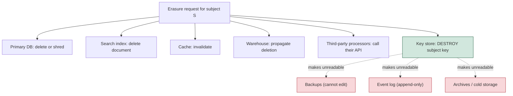
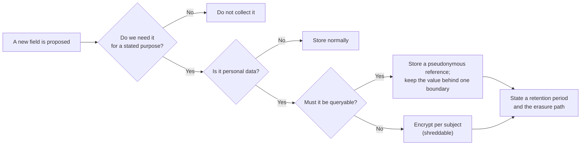

# Data Privacy: PII Handling, Retention, and Erasure

> **Topic register:** T-2437 · Core tier · Moderate-to-high interview frequency [M/H]
> **Provenance:** the techniques below are demonstrated by real, executed code at
> [`practice/java/security/data-privacy/`](../../practice/java/security/data-privacy/README.md)
> (OpenJDK 21.0.12) — including a recovered identity from an "anonymised"
> unsalted hash, and a real crypto-shredding run where destroying one key made
> two independently-stored ciphertexts permanently unreadable.
> **Not legal advice.** This chapter covers the engineering obligations that
> privacy regulation creates. Whether a specific system is compliant is a
> question for counsel; whether it is *buildable* is the question here.

## Table of Contents

1. [Learning Objectives](#learning-objectives)
2. [Why This Matters in Interviews](#why-this-matters-in-interviews)
3. [Level 1 — Foundation](#level-1-foundation)
4. [Level 2 — Working Knowledge](#level-2-working-knowledge)
5. [Mental Model](#mental-model)
6. [Definition and Purpose](#definition-and-purpose)
7. [Core Concepts](#core-concepts)
8. [Internal Implementation](#internal-implementation)
9. [Diagrams](#diagrams)
10. [Java Examples](#java-examples)
11. [Production Scenarios](#production-scenarios)
12. [Trade-offs](#trade-offs)
13. [Decision Framework](#decision-framework)
14. [Common Mistakes](#common-mistakes)
15. [Anti-Patterns](#anti-patterns)
16. [Best Practices](#best-practices)
17. [Interview Answer Framework](#interview-answer-framework)
18. [Interview Questions](#interview-questions)
19. [Summary](#summary)
20. [Key Takeaways](#key-takeaways)
21. [Cheat Sheet](#cheat-sheet)
22. [Flashcards](#flashcards)
23. [Practice Exercises](#practice-exercises)
24. [Solutions](#solutions)
25. [Additional Reading](#additional-reading)
26. [Official References](#official-references)

---

## Learning Objectives

By the end of this chapter you can:

- Distinguish pseudonymisation from anonymisation precisely, and explain why only one of them takes data out of scope.
- Explain why "delete the row" is not an erasure strategy in a system with backups, replicas, event logs, and analytics copies.
- Design crypto-shredding, and state the operational cost it introduces.
- Reason about retention as a schema-level design decision rather than a cleanup script.
- Answer "how would you support a deletion request?" with an architecture, not a `DELETE` statement.

## Why This Matters in Interviews

This topic separates engineers who have built a system under a real deletion requirement from those who have not, and it does so quickly. The naive answer to "how do you handle a delete-my-data request?" is `DELETE FROM users WHERE id = ?`. The follow-up — "what about your backups, your read replicas, your event log, your search index, your data warehouse, and the CSV someone exported last quarter?" — is where the real conversation starts.

It is also one of the few areas where a design decision made at schema time determines whether a later requirement is a config change or a six-month project. A system that stored personal data inline in twelve tables and three event streams cannot cheaply become erasable; one that stored a reference and kept the values behind a single boundary can.

Companies handling payments, health data, or European users ask about this directly. Everyone else asks about it indirectly, through questions about logging, backups, and multi-tenancy.

## Level 1 — Foundation

**Personal data** is any information relating to an identifiable person. That is broader than most engineers expect: obviously a name, email, or national ID number; but also an IP address, a device identifier, a precise location, or a user ID that can be connected back to a person through some other data you hold.

The obligations that follow are, in engineering terms, four:

1. **Collect only what you need** (data minimisation) — every extra field is a liability with no upside if nothing reads it.
2. **Keep it only as long as you need it** (storage limitation) — retention is a *limit*, not a default of "forever."
3. **Protect it** — encryption in transit and at rest, access control, audit.
4. **Be able to produce it, correct it, and delete it on request** — the access, rectification, and erasure rights.

Point 4 is the one with architectural consequences, because "delete it" means *everywhere*, and a mature system has copies in places nobody enumerated: the primary database, read replicas, nightly backups, an event log, a search index, a cache, a data warehouse, log files, and an analytics vendor.

The single most useful habit follows directly: **know where personal data lives before you need to delete it.** An inventory built during an incident is built too late.

## Level 2 — Working Knowledge

Three techniques do most of the work, and the differences between them matter.

**Pseudonymisation** replaces an identifier with a reference: records carry `user_ref = "u-1001"`, and the mapping to the real identity lives in one controlled system. It reduces blast radius — a leaked analytics table full of `u-1001` is much less damaging than one full of email addresses — and it keeps joins working, because the reference is stable. But it is explicitly **still personal data**, because re-identification is possible by design; the mapping exists.

**Anonymisation** means the subject cannot be re-identified *by anyone*, which usually requires losing row-level granularity: aggregation, k-anonymity, or genuine noise. Done properly, anonymised data falls outside the regulation. Done as a column transformation, it almost never is.

That second point is where the most common mistake lives. Hashing an email is not anonymisation, and the demo proves it by recovering the identity:

```text
Stored 'anonymised' value: ff8d9819fc0e12bf0d24892e45987e24...
  guess bob@example.com        -> no match
  guess carol@example.com      -> no match
  guess alice@example.com      -> MATCH -- identity recovered
```

The value space of email addresses is small enough to enumerate, or simply to test against a customer list you already have. A keyed hash (HMAC with a secret the attacker lacks) raises the bar considerably and is still pseudonymisation, because whoever holds the key can re-identify.

**Crypto-shredding** is the technique that makes erasure tractable. Encrypt each subject's data with a per-subject key; to erase, destroy the key. The ciphertext can remain in immutable backups and append-only logs forever and is permanently unreadable. Real, executed:

```text
Erasure request received. Destroying the subject's key (NOT chasing the copies):
  backup -> unrecoverable: no key for subject u-1001
  archive -> unrecoverable: no key for subject u-1001
```

Two independently-stored ciphertexts, one key destroyed, both unreadable — without touching either storage system.

## Mental Model

Think of personal data as a **hazardous material with a licence and an expiry date**. You may hold it for a stated purpose, for a stated time, in a controlled location, with an inventory of where it is. Everything follows from that framing: minimisation is not collecting hazardous material you have no use for; retention is the expiry date; the inventory is what makes disposal possible; and crypto-shredding is the trick of making the material inert where you cannot physically remove it.

The corollary engineers underuse: **the cheapest personal data to protect, retain, and erase is the data you never collected.**

## Definition and Purpose

The obligations in this chapter come principally from GDPR and its relatives (CCPA/CPRA, LGPD, and others), which differ in detail and agree on the engineering shape:

- **[Article 5](https://gdpr-info.eu/art-5-gdpr/)** — principles including purpose limitation, data minimisation, storage limitation, integrity and confidentiality.
- **[Article 17](https://gdpr-info.eu/art-17-gdpr/)** — the right to erasure ("right to be forgotten"), with conditions and exemptions.
- **[Article 32](https://gdpr-info.eu/art-32-gdpr/)** — security of processing, explicitly naming pseudonymisation and encryption as appropriate measures.

These exist because the prior default — collect everything, keep it forever, in as many systems as convenient — produced harm that no individual engineering decision caused and no individual user could avoid. Whatever one thinks of the regulation, the engineering discipline it forces (know your data, minimise it, bound its lifetime, be able to remove it) is the same discipline that limits the blast radius of a breach, so it is worth doing on its own merits.

## Core Concepts

### What each technique actually buys

| Technique | Gives you | Still personal data? |
|---|---|---|
| Pseudonymisation (stable reference) | Smaller blast radius; joins still work | **Yes** |
| Unsalted hash of an identifier | Very little — enumerable, as measured | **Yes** |
| Keyed hash (HMAC) | A pseudonym an attacker cannot reverse | **Yes** |
| Encryption at rest | Protection against media theft and some operator access | **Yes** |
| Crypto-shredding | Erasure where deletion is impossible | Until the key is destroyed |
| Aggregation / k-anonymity | Genuine anonymisation | **No**, if done properly |

Only the last row leaves the regulation's scope, and it costs row-level detail. Everything above it is risk reduction — valuable, and not the same thing. Being able to state this table is most of a strong answer.

### Erasure is a distributed problem

A deletion request must reach every copy, and the copies have very different capabilities:

| Location | Can you delete a row? | Practical approach |
|---|---|---|
| Primary database | Yes | Delete or crypto-shred |
| Read replicas | Follows the primary | Nothing extra |
| Backups | Usually **no** (immutable, or restoring to edit is absurd) | Crypto-shred, or let retention expire the backup |
| Event log / event store | **No** by design (append-only) | Crypto-shred, or keep personal data out of events |
| Search index | Yes | Delete document; verify |
| Cache | Yes, or wait for TTL | Invalidate explicitly |
| Data warehouse | Usually yes, expensively | Propagate deletion; often the slowest path |
| Log files | Rarely selectively | Do not log it in the first place; bound retention |
| Third-party processors | Their API, their timeline | Contract plus an actual deletion call |

Two design conclusions fall out. First, **backups and event logs are the hard cases**, and crypto-shredding exists mainly for them. Second, the cheapest row in that table is the one that says "do not log it in the first place" — which is the same conclusion [Structured Logging, Correlation IDs, and Log Hygiene](../13-observability/structured-logging-correlation-ids-and-log-hygiene.md) reaches from the observability side.

### Retention is a schema decision, not a cron job

A retention policy that exists only as a cleanup script is a policy with no enforcement: the script gets disabled during an incident, misses a new table added last quarter, and nobody notices because nothing fails when it does not run.

The durable version puts retention in the data model:

- Every table holding personal data has an explicit retention period and a column the policy can act on (`created_at`, `last_active_at`, or an explicit `expires_at`).
- Deletion runs continuously and is monitored — the absence of deletions is an alert condition, not a silence.
- New tables require a stated retention period at review time, so the default is "someone decided" rather than "forever."
- The warehouse and the event log have their own stated retention, because they will otherwise outlive the primary by years.

### Data classification makes the rest possible

You cannot apply different rules to different data without labelling it. A workable minimum is three tiers: **public**, **internal**, and **personal/sensitive** — with the last carrying mandatory encryption at rest, access logging, a stated retention period, and inclusion in the erasure path. Classification at the *column* level is what allows a schema review to ask the right question automatically: "this column is classified personal, what is its retention and how does erasure reach it?"

## Internal Implementation

**Crypto-shredding, concretely.** Generate a data encryption key (DEK) per subject; encrypt that subject's personal fields with it; store the DEK in a key management system, itself wrapped by a key encryption key. Erasure destroys the DEK. Ciphertext elsewhere becomes undecryptable.

The demo implements exactly this with AES-256-GCM and a per-subject key, writing two ciphertexts to separate "systems" and then removing the key:

```java
// Erasure: destroy the key, not the copies.
KEYS.remove(subject);
// Both stored ciphertexts are now permanently unreadable.
```

Three real costs come with it, and naming them is what distinguishes a designed answer from a remembered one:

1. **Key management becomes availability-critical.** Losing a key is indistinguishable from erasing a subject. Key backup, rotation, and access control now carry the weight the data used to.
2. **Key cardinality.** One key per subject means millions of keys, with a lookup on every read. Per-tenant or per-cohort keys reduce that and coarsen the erasure granularity to the group.
3. **Encrypted columns are not queryable.** You cannot index, range-scan, or `LIKE` an encrypted field. Anything you need to search on must stay plaintext — which means it must not be the personal part, which pushes the design back toward pseudonymisation for anything queryable.

**Encryption at rest is not the same control.** Full-disk or volume encryption protects against stolen media and little else: a compromised application, a leaked backup file that includes the key, or an over-privileged operator all read plaintext. Column-level or per-subject encryption is what actually narrows access, and only the per-subject variant supports shredding.

**Deletion propagation.** A robust implementation emits an internal `subject_erasure_requested` event, and each system that holds personal data subscribes and acknowledges. That gives an auditable record of who deleted what and when, and — more usefully — makes it visible when a system has *not* acknowledged. A deletion path with no acknowledgement is a deletion path nobody can prove works.

## Diagrams



The three red boxes are the systems you cannot delete from. The green box is the single action that neutralises all three at once — which is the entire argument for crypto-shredding.



## Java Examples

Full runnable source at [`practice/java/security/data-privacy/`](../../practice/java/security/data-privacy/README.md).

**Pseudonymisation — the reference is stable, so joins survive:**

```java
private static final Map<String, String> PSEUDONYMS = new HashMap<>();

private static String pseudonymFor(String email) {
    return PSEUDONYMS.computeIfAbsent(email, e -> "u-" + (++counter));
}
// Records carry u-1001. The mapping lives in ONE system with its own
// access control and audit trail.
```

**Crypto-shredding — per-subject key, AES-GCM:**

```java
SecretKey key = KEYS.computeIfAbsent(subject, s -> {
    KeyGenerator gen = KeyGenerator.getInstance("AES");
    gen.init(256);
    return gen.generateKey();
});
Cipher cipher = Cipher.getInstance("AES/GCM/NoPadding");
cipher.init(Cipher.ENCRYPT_MODE, key, new GCMParameterSpec(128, iv));
byte[] ciphertext = cipher.doFinal(plaintext.getBytes(UTF_8));

// ... later, on an erasure request:
KEYS.remove(subject);   // every stored ciphertext for S is now inert
```

**The check that makes a hash-based claim honest** — run it before calling anything anonymised:

```java
// If you can recover the input by guessing from a plausible value space,
// it is pseudonymisation at best. The demo does exactly this and succeeds.
boolean reidentified = sha256(candidateEmail).equals(storedValue);
```

## Production Scenarios

### Scenario: an erasure request cannot be completed because the data is in an event log

**Symptoms.** A user exercises their right to erasure. The row is deleted from the primary database in seconds. Then someone points out that the same personal data is inside twelve months of events in an append-only event store that the order, billing, and analytics services all replay.

**Initial hypotheses.** Delete the events; compact the topic; rewrite history.

**Evidence collected.** The event store is append-only by design and is the source of truth for rebuilding read models. Deleting events would corrupt state derived from them. Log compaction retains the latest value per key, which does not help when the personal data is in the *body* of historical events.

**Diagnosis.** A design decision made years earlier: personal data was embedded directly in event payloads. The event log's greatest strength — immutability — is exactly what makes erasure impossible.

**Immediate mitigation.** Crypto-shred: re-encrypt or, where the data is already encrypted per subject, destroy the key. Where it is not, the honest short-term answer is a documented gap plus a plan, not a claim of completion.

**Permanent remediation.** Keep personal data *out* of events: events carry `user_ref`, and the personal values live behind one service that can delete or shred. This is a genuine migration — new event schema, dual-write, backfill of read models — and it is the price of not having designed for erasure originally. See [Zero-Downtime Schema Migration](../06-databases/zero-downtime-schema-migration.md) for the mechanics.

**Trade-offs.** Referencing rather than embedding makes events less self-contained: a consumer replaying history must call the reference service, which reintroduces a runtime dependency that event sourcing was partly chosen to avoid. That is a real cost, and it is smaller than being unable to honour a legal obligation.

**Interview lessons.** This is the strongest available answer to "how would you support deletion?", because it demonstrates knowing which systems cannot delete and what you do about it.

### Scenario: an "anonymised" analytics dataset is re-identified

**Symptoms.** An analytics export, approved on the basis that it contained no names or emails — only a hashed user identifier, timestamps, and coarse location — is shown to identify specific individuals.

**Diagnosis.** Two failures compounding. The hash was unsalted and unkeyed, so anyone holding a customer list could hash each entry and match — exactly the recovery the demo performs. And even without that, the *combination* of quasi-identifiers (timestamp patterns plus coarse location) is frequently unique to one person, which is the classic re-identification result that k-anonymity exists to address.

**Remediation.** Treat the export as personal data, because it is. If genuine anonymisation is needed, aggregate to a level where every combination covers many subjects, or add calibrated noise — and validate by attempting re-identification, rather than assuming.

**Interview lessons.** "We hashed it" is the single most common wrong answer on this topic, and having a concrete recovery demonstration makes the point in one sentence.

## Trade-offs

| Choice | Gains | Costs |
|---|---|---|
| Collect less | Less to protect, retain, and erase; smaller breach impact | Product features you cannot build later without re-collecting |
| Pseudonymisation | Smaller blast radius; joins still work | Still personal data; the mapping system becomes critical |
| Per-subject encryption | Shreddable erasure; narrow access | Key management burden; encrypted fields are not queryable |
| Crypto-shredding | Erasure in immutable stores | Losing a key = erasing a subject; key cardinality at scale |
| True anonymisation | Out of scope entirely | Loss of row-level granularity; genuinely hard to verify |
| Short retention | Less exposure, lower cost | Lost analytics history; debugging window shrinks |
| Long retention | Analytics and forensics | Growing liability, growing erasure surface |

## Decision Framework

1. **Do we need this field at all?** If nothing reads it, not collecting it removes every downstream obligation.
2. **Is it personal data?** Remember the breadth — IP address, device ID, precise location, and any identifier joinable to a person.
3. **Must it be queryable?** Yes → pseudonymous reference with values behind one boundary. No → per-subject encryption, which is shreddable.
4. **Where will copies land?** Enumerate them *now*: replicas, backups, events, search, cache, warehouse, logs, processors. The list is the erasure plan.
5. **Which copies cannot delete?** Those are the crypto-shredding cases, and they decide the encryption design.
6. **What is the retention period, and what enforces it?** A period with no enforcing mechanism and no monitoring is a wish.
7. **How would we prove erasure worked?** Acknowledgement per system, and an audit record. Unprovable deletion is indistinguishable from none.

## Common Mistakes

- **Treating a hash as anonymisation.** Demonstrably recoverable for small value spaces.
- **`DELETE FROM users` as the erasure design**, ignoring backups, events, warehouse, and logs.
- **Confusing encryption at rest with access control.** It protects against stolen media, not a compromised application.
- **Retention as a cron job** nobody monitors, applied only to tables that existed when it was written.
- **Logging personal data** and hoping redaction catches it downstream.
- **Forgetting third-party processors**, whose copies are still your obligation.
- **Assuming pseudonymised data is out of scope.** It is explicitly not.

## Anti-Patterns

- **Personal data embedded in event payloads**, which makes an append-only log an unerasable store.
- **One encryption key for everything**, which protects against media theft and supports no shredding at all.
- **"We will add deletion later."** Retrofitting erasure into a system that scattered personal data is a migration, not a feature.
- **An undocumented data inventory**, which means the erasure path is whatever one engineer remembers.
- **Copying production data into staging** and applying none of the same controls.

## Best Practices

- Classify at the column level, and make classification a schema-review question.
- Default to a pseudonymous reference in every system except the one that owns the value.
- Keep personal data out of events, logs, and analytics; carry references instead.
- Give every personal-data store an explicit retention period, enforced continuously and monitored — alert on the *absence* of deletions.
- Use per-subject keys where erasure must reach immutable storage, and treat key management as availability-critical.
- Make erasure an event with per-system acknowledgement, so completion is provable.
- Attempt re-identification before calling a dataset anonymised.

## Interview Answer Framework

### 30-Second Answer

Personal data needs to be minimised, bounded by a retention period, protected, and removable on request. The removal part is the hard one, because copies live in backups, event logs, warehouses, and logs that cannot delete a single row. The technique that makes it tractable is crypto-shredding — encrypt per subject, and erase by destroying the key — plus keeping personal data out of the places you cannot delete from in the first place.

### 2-Minute Answer

Add the precision that separates the terms. Pseudonymisation replaces an identifier with a stable reference and reduces blast radius, but it is still personal data because the mapping exists. Anonymisation means nobody can re-identify, which normally costs row-level granularity — and hashing is *not* anonymisation: I have demonstrated recovering an email address from an unsalted SHA-256 by guessing against a plausible value space. For erasure, I enumerate the copies — primary, replicas, backups, event log, search, cache, warehouse, logs, processors — and note that backups and event logs cannot delete a row, which is exactly what crypto-shredding solves: two independently-stored ciphertexts became permanently unreadable when one per-subject key was destroyed. The costs are real: key management becomes availability-critical, key cardinality grows with subjects, and encrypted fields are not queryable.

### 10-Minute Deep Dive

Cover: what counts as personal data and why the breadth surprises people; the technique table and which row actually leaves scope; erasure as a distributed problem with a per-system capability table; crypto-shredding mechanics with DEK/KEK and its three costs; why retention belongs in the schema with monitored enforcement; data classification as the enabler; the event-log scenario as the canonical hard case and the reference-not-embed fix; and proving erasure through per-system acknowledgement.

### Whiteboard Explanation

Draw a box per data location — primary, replica, backup, event log, search, warehouse, logs, vendor. Cross out "delete a row" on backup and event log. Draw one key icon beside them and label it "destroy this." That single icon covering the crossed-out boxes is the whole crypto-shredding argument, and it takes fifteen seconds to draw.

### Production Example

The erasure request that could not be completed because personal data was embedded in twelve months of append-only events: shredded as mitigation, migrated to reference-not-embed as the fix.

### Trade-offs to Mention

Encrypted fields cannot be queried, which pushes queryable data toward pseudonymisation. Per-subject keys make key loss equivalent to erasure. Referencing instead of embedding in events reintroduces a runtime dependency. Short retention costs analytics history.

### Common Candidate Mistakes

`DELETE FROM users` as the whole answer; hashing called anonymisation; forgetting backups, event logs, and third parties; treating pseudonymised data as out of scope.

### Typical Follow-Up Questions

"What about your backups?" → "Your event log is append-only — now what?" → "Is a hashed email anonymous?" → "How would you prove deletion happened?" → "What breaks if you lose a key?" → "How do you stop this happening in the next new table?"

### Senior-Level Expectations

Enumerates copies without prompting, knows which cannot delete, proposes crypto-shredding with its costs stated, and puts retention in the schema rather than a script.

### Staff-Level Discussion

The controlling insight is that **erasability is an architectural property, not a feature**, and it is decided at schema-design time. A system that embedded personal data across twelve tables and three event streams cannot cheaply become erasable; the remedy is a migration measured in quarters. So the Staff-level intervention is upstream: a schema-review gate that asks, for every new column classified as personal, what its retention is and how erasure reaches it. That gate costs minutes per review and saves the quarters.

Second, this is a place where the organisation must decide who *owns* the data inventory. In its absence, the erasure path is whatever one engineer remembers, which fails silently the moment that engineer changes team — and it fails in a way no test detects, because nothing errors when a system is quietly missed.

Third, the honest position on residual risk: no large system can prove that no copy of a subject's data exists anywhere, so the defensible posture is a documented inventory, per-system acknowledgement, monitored retention, and a written record of known gaps — rather than an unqualified claim of completeness that a single forgotten CSV export makes false. Engineering leadership's job is to make that posture explicit, because the alternative is an implicit claim that nobody has verified.

## Interview Questions

### Question 1 — A user requests erasure of their data. Walk me through what actually has to happen.

**Why interviewers ask it.** The naive answer is one SQL statement, and the distance between that and a real design is the signal.

**Expected answer.** Enumerate the copies: primary database, read replicas, backups, event log or event store, search index, caches, data warehouse, log files, and third-party processors. Delete where deletion is possible; recognise that backups and append-only event logs cannot delete a single record; use crypto-shredding for those — destroying the per-subject key renders existing ciphertext permanently unreadable, demonstrated with two independently-stored ciphertexts and one key removal. Record per-system acknowledgement so completion is provable.

**Minimum acceptable answer.** Deletes from the primary and recognises that other copies exist.

**Strong Senior answer.** Names backups and event logs specifically as the systems that cannot delete, and proposes the structural fix — keep personal data out of events, carry a reference — while acknowledging that referencing makes events less self-contained and reintroduces a runtime dependency.

**Staff-level extension.** Frames erasability as an architectural property decided at schema time, argues for a schema-review gate asking retention and erasure path for every personal column, and states the honest residual-risk posture: documented inventory, acknowledgements, monitored retention, and written known gaps rather than an unqualified completeness claim.

**Common mistakes.** Stopping at `DELETE`; assuming backups can be edited; forgetting processors.

**Likely follow-ups.** "What if the data is in a Kafka topic?" (Compaction does not help when the data is in event bodies; shred or migrate to references.) "How do you prove it worked?" (Per-system acknowledgement plus audit record.)

**Evaluation criteria.** Enumerates copies unprompted, identifies the undeletable ones, and gives a concrete mechanism rather than an intention.

### Question 2 — We hashed the email addresses, so the dataset is anonymous. Is it?

**Why interviewers ask it.** It is the most common wrong answer in this area and has a crisp, demonstrable refutation.

**Expected answer.** No. An unsalted hash of a value drawn from a small, enumerable space is reversible by guessing — demonstrated directly, recovering `alice@example.com` from its stored SHA-256 by testing candidates. Hashing an identifier is pseudonymisation at best, so the data remains personal data. A keyed hash (HMAC) prevents an attacker without the key from doing this, and is still pseudonymisation because the key holder can re-identify.

**Minimum acceptable answer.** Knows hashing is reversible for small value spaces.

**Strong Senior answer.** Adds the quasi-identifier problem: even with a perfect pseudonym, combinations such as timestamps plus coarse location are frequently unique to one individual, which is what k-anonymity addresses. Concludes that genuine anonymisation usually costs row-level granularity and must be validated by attempting re-identification rather than assumed.

**Staff-level extension.** Points out the governance consequence — if "anonymised" exports leave the erasure and retention path on a claim nobody validated, the organisation has an unmanaged copy of personal data — so the export decision needs the same review as the schema.

**Common mistakes.** Suggesting a salt makes it anonymous (a per-record salt breaks joins; a fixed salt is just a keyed hash); ignoring quasi-identifiers entirely.

**Likely follow-ups.** "What would make it genuinely anonymous?" (Aggregation to a level where every combination covers many subjects, or calibrated noise, validated by a re-identification attempt.) "Is pseudonymised data in scope?" (Yes, explicitly.)

**Evaluation criteria.** Refutes the claim with a mechanism, distinguishes pseudonymisation from anonymisation, and mentions quasi-identifiers.

### Question 3 — How would you design retention so it actually holds?

**Why interviewers ask it.** Retention is where good intentions and real systems most visibly diverge.

**Expected answer.** Put it in the data model rather than in a script: every table holding personal data has an explicit retention period and a column the policy can act on; deletion runs continuously; the *absence* of deletions is an alert condition; new tables must state a retention period at review time; and the warehouse and event log carry their own stated periods, because they otherwise outlive the primary by years.

**Minimum acceptable answer.** Proposes scheduled deletion based on a timestamp column.

**Strong Senior answer.** Explains why a cleanup script fails in practice — disabled during an incident, missing tables added later, silent when it does not run — and makes monitoring the deletion *rate* the enforcement mechanism. Connects retention to breach blast radius, not only compliance.

**Staff-level extension.** Ties it to the review gate and to inventory ownership: retention only holds if every new personal column acquires a period at creation and someone owns the inventory, otherwise the policy silently decays as the schema grows.

**Common mistakes.** A monthly cron with no monitoring; applying retention only to the primary database.

**Likely follow-ups.** "What about data you are legally required to keep?" (Retention rules conflict; the longer obligation wins for that specific data, and it should be isolated so it does not extend everything else's lifetime.) "How do you handle a table added last week?" (The review gate is the answer; without it, you find out during an audit.)

**Evaluation criteria.** Moves retention from script to schema, makes non-execution visible, and covers the non-primary stores.

## Summary

Personal data is a liability with a licence and an expiry date: collect less, keep it for a stated time, protect it, and be able to remove it. Removal is the architecturally interesting part, because a mature system's copies live in backups, append-only event logs, warehouses, and log files that cannot delete a single record — which is what crypto-shredding solves by making key destruction the erasure act, demonstrated here with one key removal rendering two independently-stored ciphertexts permanently unreadable. Pseudonymisation reduces blast radius and keeps data in scope; hashing is not anonymisation, demonstrated by recovering an identity from a stored digest; and genuine anonymisation costs row-level granularity. Retention belongs in the schema with monitored enforcement, and erasability is decided at schema-design time, which is why the highest-leverage intervention is a review question rather than a cleanup script.

## Key Takeaways

- The cheapest personal data to protect, retain, and erase is the data you never collected.
- Pseudonymisation reduces risk; it does **not** take data out of scope.
- Hashing an identifier is not anonymisation — measured, the identity was recovered by guessing.
- Backups and append-only event logs cannot delete a row; crypto-shredding is the answer for both.
- Destroying a key is erasure — and losing one is indistinguishable from it.
- Encrypted fields are not queryable, which pushes queryable data toward references.
- Retention belongs in the schema, enforced continuously, with the absence of deletions alerting.

## Cheat Sheet

Condensed version: [`cheat-sheets/data-privacy-pii-handling-and-retention.md`](../../cheat-sheets/data-privacy-pii-handling-and-retention.md).

## Flashcards

Review deck: [`flashcards/data-privacy-pii-handling-and-retention.md`](../../flashcards/data-privacy-pii-handling-and-retention.md).

## Practice Exercises

1. Run the demo and confirm the identity recovery from the stored hash. Then change it to an HMAC with a secret and explain precisely what improved and what did not.
2. Take a service you know and enumerate every place a user's email address exists. Mark each as deletable or not.
3. Implement crypto-shredding for one entity: per-subject key, encrypt on write, decrypt on read, destroy on erasure. Then write down what happens if the key store loses a key.
4. Design the retention policy for a table of support transcripts, including the enforcement mechanism and the alert that fires when it stops running.
5. Attempt re-identification on a dataset you consider anonymous, using only data you already hold.

## Solutions

1. HMAC prevents an attacker without the key from enumerating; it does not change the classification — whoever holds the key can still re-identify, so it is pseudonymisation.
2. Most engineers find between six and a dozen locations, and are surprised by the log files, the warehouse, and a third party. The surprise is the exercise's point.
3. Losing a key is indistinguishable from erasing that subject, which is why key backup and rotation become availability-critical rather than merely security concerns.
4. The alert that matters is on the *absence* of deletions — a policy that silently stops running looks identical to a policy with nothing to delete.
5. If quasi-identifiers such as timestamps plus coarse location single out individuals, the dataset is not anonymous regardless of what was done to the identifier column.

## Additional Reading

- [Applied Cryptography: Hashing, Signing, TLS](applied-cryptography-hashing-signing-tls.md) — the primitives underneath.
- [Secrets Management and Key Rotation](secrets-management-and-key-rotation.md) — the key-management burden crypto-shredding creates.
- [Multi-Tenancy Isolation Models](multi-tenancy-isolation-models.md) — per-tenant boundaries and per-tenant keys.
- [Structured Logging, Correlation IDs, and Log Hygiene](../13-observability/structured-logging-correlation-ids-and-log-hygiene.md) — keeping personal data out of logs.
- [Zero-Downtime Schema Migration](../06-databases/zero-downtime-schema-migration.md) — the mechanics of moving personal data behind a boundary.

## Official References

- [GDPR Article 5 — Principles relating to processing of personal data](https://gdpr-info.eu/art-5-gdpr/)
- [GDPR Article 17 — Right to erasure](https://gdpr-info.eu/art-17-gdpr/)
- [GDPR Article 32 — Security of processing](https://gdpr-info.eu/art-32-gdpr/)
