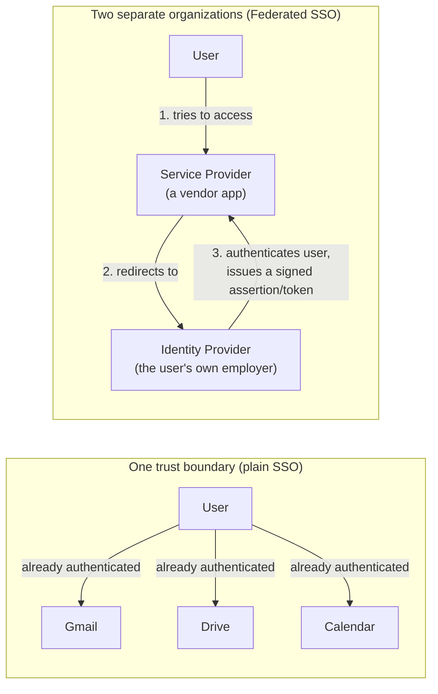
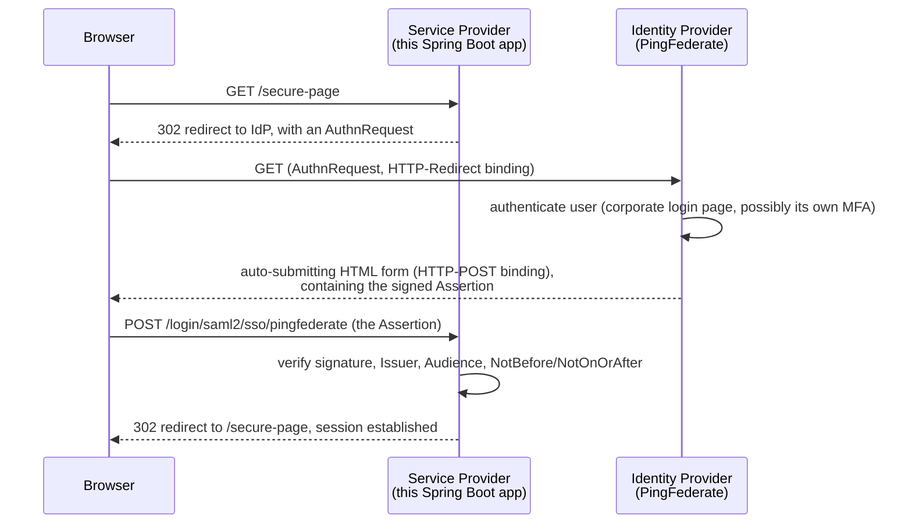

# Enterprise SSO: SAML, Federated Identity, and Commercial IAM Integration

> **Topic register:** T-1309 · Advanced tier · Common in enterprise/regulated-industry (finance, insurance, healthcare) backend roles specifically
> **Provenance:** the Spring Security configuration in this chapter (`spring-security-saml2-service-provider` dependency, the `spring.security.saml2.relyingparty.registration.*` property structure, `.saml2Login()`) is real, accurate, and verified live against Spring Security's own current reference documentation — not a locally executed multi-party demo. A faithful end-to-end demo would require standing up a real SAML Identity Provider (PingFederate, Keycloak, or an equivalent), which was out of scope for this project's practice budget; that's stated explicitly here rather than presented as executed, the same honesty discipline [OAuth2, OIDC, and JWT](oauth2-oidc-and-jwt.md)'s own OAuth2/OIDC flow section already uses for the identical reason.

## Table of Contents

1. [Learning Objectives](#learning-objectives)
2. [Why This Matters in Interviews](#why-this-matters-in-interviews)
3. [Level 1 — Foundation](#level-1-foundation)
4. [Level 2 — Working Knowledge](#level-2-working-knowledge)
5. [Mental Model](#mental-model)
6. [Definition and Purpose](#definition-and-purpose)
7. [Core Concepts](#core-concepts)
8. [The Commercial IAM Landscape](#the-commercial-iam-landscape)
9. [Spring Integration: Where This Goes in a Real Project](#spring-integration-where-this-goes-in-a-real-project)
10. [Internal Implementation](#internal-implementation)
11. [Diagrams](#diagrams)
12. [Production Scenarios](#production-scenarios)
13. [Failure Modes and Debugging](#failure-modes-and-debugging)
14. [Trade-offs](#trade-offs)
15. [Decision Framework](#decision-framework)
16. [Comparisons](#comparisons)
17. [Common Mistakes](#common-mistakes)
18. [Anti-Patterns](#anti-patterns)
19. [Best Practices](#best-practices)
20. [Interview Answer Framework](#interview-answer-framework)
21. [Interview Questions](#interview-questions)
22. [Summary](#summary)
23. [Key Takeaways](#key-takeaways)
24. [Cheat Sheet](#cheat-sheet)
25. [Flashcards](#flashcards)
26. [Practice Exercises](#practice-exercises)
27. [Additional Reading](#additional-reading)
28. [Official References](#official-references)

---

## Learning Objectives

By the end of this chapter you can:

- Precisely distinguish SSO from Federated SSO, and explain why the distinction matters the moment more than one organization is involved.
- Explain SAML 2.0's assertion-based federation model, name its core artifacts (Assertion, Metadata, Bindings), and correctly compare it to OAuth2/OIDC on purpose, format, and era.
- Name the commercial/enterprise IAM landscape (PingFederate, Okta, Azure AD/Entra ID, Keycloak) and what role each typically plays in a real enterprise deployment.
- Configure a real Spring Boot application as a SAML2 Service Provider against an enterprise IdP (PingFederate or equivalent), and state exactly which files in a real project each piece of configuration belongs in.

## Why This Matters in Interviews

"Strong understanding of the I&AM landscape — SSO, Federated SSO, SAML, OAuth2, OIDC — and experience with commercial IAM solutions like PingFederate" is a real, recurring line in enterprise backend job postings, especially at banks, insurers, healthcare companies, and any large organization that federates authentication against a corporate identity provider rather than owning its own user database. It tests something [OAuth2, OIDC, and JWT](oauth2-oidc-and-jwt.md) doesn't: whether a candidate has actually worked inside an *enterprise* identity landscape, where the application almost never *is* the identity provider — it's a Service Provider trusting an IdP someone else (often a separate security team, sometimes a separate company) operates and controls. A candidate who can only describe OAuth2's authorization code flow, without knowing what SAML is, what a Service Provider vs. Identity Provider actually means operationally, or why a Fortune 500 company still runs PingFederate in 2026, reads as someone who has only ever built greenfield API-first systems — a real, meaningful gap for this specific role shape.

## Level 1 — Foundation

**Single Sign-On (SSO)** means logging in once and getting access to multiple applications without being asked to authenticate again for each one. The simplest, everyday version: logging into your Google account once, then having Gmail, Google Drive, and Google Calendar all already "know who you are" — no separate login screen for each. This works because all three applications live inside the *same* trust boundary (Google's own systems), typically sharing a session cookie or an equivalent token scoped to that one boundary.

**Federated SSO (Federated Identity)** is SSO extended *across* separate organizational or security boundaries, via an explicit, configured trust relationship rather than a shared session. When you click "Log in with your company account" on a third-party vendor's app (a expense-reporting tool, a benefits portal), and it redirects you to your own employer's login page instead of asking you to create a new password — that's federation. Your employer's identity system (the **Identity Provider**, or **IdP**) authenticates you and vouches for who you are; the vendor's application (the **Service Provider**, or **SP** — also called the **Relying Party**, or **RP**, in OIDC terminology) trusts that vouching because of a pre-established, cryptographically-secured trust relationship, not because it shares a session with your employer's systems.



## Level 2 — Working Knowledge

At this level you should be able to answer, concretely: **who is the IdP and who is the SP in a given integration, and what does the SP actually receive from the IdP?** In a SAML federation, the SP receives a signed XML **Assertion** — a document the IdP cryptographically signs, stating "I, the IdP, confirm this user is who they claim to be, and here are some attributes about them (email, group membership, employee ID)." The SP never sees the user's password, never talks to the IdP's user database directly — it only ever validates a signed document the IdP handed back via the user's own browser.

You should also be comfortable with the working distinction between **SP-initiated** and **IdP-initiated** flows. SP-initiated: the user starts at the application (the SP), which redirects them to the IdP to authenticate, then receives the assertion back — this is the more common, more secure shape, since the SP controls exactly what it's requesting. IdP-initiated: the user starts at the IdP's own portal (a corporate app launcher, for instance) and clicks a tile that sends them, already-authenticated, straight to the SP with an assertion in hand — convenient for a corporate intranet, but a real, historically-documented target for certain replay-style attacks if the SP doesn't validate the assertion's freshness and intended audience carefully (Section 12 covers this).

Finally, know the practical signal for *why* an enterprise still uses SAML in 2026 rather than pure OIDC: SAML predates OIDC by roughly a decade, and a very large number of enterprise IdPs, legacy internal applications, and commercial SaaS vendor integrations were built against it long before OIDC existed — migrating hundreds of already-integrated applications off SAML is a real, multi-year organizational undertaking, not a weekend's work, which is exactly why SAML remains a genuinely live, commonly-asked-about protocol rather than a purely historical one.

## Mental Model

**Treat a signed SAML assertion (or an OIDC ID token) as a sealed, notarized letter, not a phone call.** The Service Provider never calls the Identity Provider directly to ask "is this really true?" during the critical moment of the exchange — the user's own browser physically carries the sealed letter (the assertion/token) from the IdP to the SP, and the SP's entire job is verifying the seal (the cryptographic signature) is genuine and unbroken, that the letter was addressed specifically to *this* SP (audience restriction), and that it hasn't expired. This is precisely the same mental model [OAuth2, OIDC, and JWT](oauth2-oidc-and-jwt.md)'s own "JWT verification is a pure computation" Core Concept already establishes for JWTs — SAML assertions and JWTs are different envelope formats (XML vs. JSON/base64) carrying the same underlying idea: a portable, self-contained, signed statement of trust, verified locally rather than by a live round-trip to its issuer.

## Definition and Purpose

**SAML (Security Assertion Markup Language) 2.0** is an XML-based standard, published by OASIS in 2005, for exchanging authentication and authorization data between an Identity Provider and a Service Provider — the foundational protocol behind enterprise Federated SSO for nearly two decades before OIDC existed. It exists to solve one specific problem: letting a user authenticate once, with one identity system their organization controls, and have that authentication trusted by many separate applications (some run by the same organization, some run by entirely separate vendor companies) without each application needing its own copy of the user's credentials.

**Federated identity**, more broadly, is the general pattern SAML, OIDC, and (to a lesser extent for pure authentication) OAuth2 all implement in different technical shapes: separating *who authenticates the user* (the IdP) from *who relies on that authentication* (the SP/RP), connected by a standards-based trust relationship — a shared signing certificate, a registered redirect URI, a pre-exchanged metadata document — rather than a shared database or a shared session.

## Core Concepts

### SAML's core artifacts: Assertion, Metadata, and Bindings

- **Assertion** — the actual XML document the IdP produces and signs, containing an `<AuthnStatement>` (confirming the user authenticated, and how/when), and typically an `<AttributeStatement>` (carrying claims about the user — email, groups, employee ID) the SP can use for authorization decisions once the user is inside the application.
- **Metadata** — an XML document each party (IdP and SP) publishes describing its own endpoints (where to send authentication requests, where assertions should be POSTed back to) and its signing/encryption certificates. Exchanging metadata (often as a one-time setup step between an enterprise's identity team and the application team) is how the trust relationship is actually established — this is the SAML equivalent of registering an OAuth2 client and getting back a `client_id`/`client_secret`.
- **Bindings** — the specific HTTP mechanism used to transport a SAML message. `HTTP-Redirect` (the request, appended to a URL query string, used for the *initial* authentication request since it's small) and `HTTP-POST` (the response/assertion, sent as a hidden auto-submitting HTML form field, used because a signed assertion is too large and sensitive for a URL) are the two bindings that matter for nearly every real integration.

### SAML vs. OAuth2 vs. OIDC — the precise distinction

These three are routinely conflated, and a candidate who can state the precise distinction (not just recite the acronym expansions) signals real depth:

| | SAML 2.0 | OAuth2 | OIDC |
|---|---|---|---|
| **Actually solves** | Federated *authentication* (who is this user, across organizations) | Delegated *authorization* (can this app access this resource, on the user's behalf) — originally not about authentication at all | Federated *authentication*, built as a thin identity layer directly on top of OAuth2 |
| **Format** | XML | Opaque or structured tokens (format-agnostic; often JWT in practice) | JSON / JWT (the ID Token specifically) |
| **Published** | 2005 (OASIS) | 2012 (RFC 6749) | 2014 (OpenID Foundation) |
| **Primary era/use case** | Enterprise/browser-based SSO, still dominant in large regulated enterprises | API access delegation (mobile apps, SPAs, third-party integrations requesting scoped access) | Modern consumer and enterprise login (mobile/SPA-friendly, unlike SAML's browser-form-post model) |
| **Trust artifact** | Signed XML Assertion | Access Token (authorization only — proves nothing about identity by itself) | ID Token (a JWT, specifically designed to prove identity) |

The single most common real confusion this table resolves: **plain OAuth2 was never designed to answer "who is this user" at all** — an access token only proves "this bearer is allowed to call this API," which is exactly the gap OIDC was built to close by adding a proper, standardized identity layer (the ID Token) on top of OAuth2's existing authorization machinery.

## The Commercial IAM Landscape

Real enterprise backend work rarely means building an identity provider — it means *integrating against one a separate team or vendor already operates*. Knowing the landscape by name is a real, practical part of the "I&AM experience" this role shape expects:

| Product | Vendor | Deployment model | Protocols | Typical role in a real enterprise |
|---|---|---|---|---|
| **PingFederate** | Ping Identity | On-premise or hybrid, self-hosted federation server | SAML 2.0, OAuth2, OIDC, WS-Federation | The classic large-regulated-enterprise (banking, insurance, healthcare) federation hub — often paired with **PingDirectory** (the actual user store) and **PingAccess** (a policy enforcement/reverse-proxy layer) in the broader Ping Identity suite |
| **Okta** / **Auth0** (Okta-owned) | Okta | Cloud-hosted (SaaS) | SAML 2.0, OAuth2, OIDC | The dominant cloud-native IDaaS choice — widely used for both workforce SSO (Okta) and customer-facing/embedded auth (Auth0's own developer-first API) |
| **Azure AD / Microsoft Entra ID** | Microsoft | Cloud-hosted, deeply integrated with Microsoft 365/Azure | SAML 2.0, OAuth2, OIDC, WS-Federation | The default choice for any organization already standardized on Microsoft 365 — frequently the IdP an application federates against purely because "that's what the company already runs" |
| **Keycloak** | Red Hat / open-source (CNCF-adjacent) | Self-hosted (on-premise or containerized) | SAML 2.0, OAuth2, OIDC | The standard open-source alternative when a team needs a real IdP for local development, testing, or a genuinely self-hosted production deployment without commercial licensing |
| **ADFS (Active Directory Federation Services)** | Microsoft | On-premise, bundled with Windows Server | SAML 2.0, WS-Federation | Common in older, on-premise-heavy enterprises that federated identity years before moving (or before fully moving) to Azure AD |

**PingFederate specifically** is an enterprise **federation server** — its entire job is being the trust broker between an organization's internal identity systems (an LDAP directory, an internal user database) and every external or internal application that needs to authenticate against them, speaking whichever protocol (SAML, OAuth2, OIDC, WS-Fed) each individual application actually needs. A large bank might have hundreds of applications federating against one central PingFederate cluster — some using SAML because they're 15-year-old internal tools, others using OIDC because they're new, mobile-friendly services — with PingFederate itself unifying all of them against the same underlying identity source.

## Spring Integration: Where This Goes in a Real Project

Continuing directly from [Spring MVC Fundamentals](../05-spring/spring-mvc-fundamentals.md)'s own `pom.xml`/`application.yml` anatomy: here is exactly where SAML2/enterprise-IdP integration adds to a real project, file by file.

**`pom.xml`** — one additional starter, alongside the ones already covered:

```xml
<dependency>
    <groupId>org.springframework.security</groupId>
    <artifactId>spring-security-saml2-service-provider</artifactId>
</dependency>
```

**`application.yml`** — a new `spring.security.saml2.relyingparty.registration.*` block. `pingfederate` here is an arbitrary registration ID your own code chooses — Spring Security supports registering more than one IdP simultaneously under different IDs, useful when an application must accept federation from more than one enterprise partner:

```yaml
spring:
  security:
    saml2:
      relyingparty:
        registration:
          pingfederate:
            assertingparty:
              entity-id: https://idp.example.com/pf                  # the IdP's own issuer identity
              singlesignon:
                url: https://idp.example.com/idp/SSO.saml2           # where the SP sends AuthnRequests
                sign-request: false                                   # PingFederate config decides who signs what
              verification:
                credentials:
                  - certificate-location: classpath:pingfederate.crt  # the IdP's public cert, to verify its signature
            signing:
              credentials:
                - private-key-location: classpath:sp-signing.key      # this app's OWN key, if the SP must sign requests
                  certificate-location: classpath:sp-signing.crt
```

That `certificate-location: classpath:pingfederate.crt` line is a real, concrete instance of [The Twelve-Factor App: Config](../15-cloud/twelve-factor-config.md)'s own precedence story — the IdP's certificate is genuinely static, shared, non-secret metadata (safe to check into the repo as a resource file), while the SP's own *private* signing key must never be checked in at all, following exactly [Secrets Management and Key Rotation](secrets-management-and-key-rotation.md)'s own discipline — loaded from a real secrets manager or an environment-injected path in production, a `classpath:` resource only for local development.

**A `SecurityConfig` class** — where the SAML login flow is wired into the filter chain, alongside (or instead of) `.oauth2Login()`:

```java
@Configuration
@EnableWebSecurity
class SecurityConfig {

    @Bean
    SecurityFilterChain filterChain(HttpSecurity http) throws Exception {
        http
            .authorizeHttpRequests(auth -> auth
                .requestMatchers("/public/**").permitAll()
                .anyRequest().authenticated())
            .saml2Login(withDefaults());   // wires up SAML2 authentication using the registration above
        return http.build();
    }
}
```

**Attribute mapping** — the last piece, and the one most projects get wrong first: a SAML `<AttributeStatement>` (or an OIDC ID Token's claims) needs to be translated into the application's own `Principal`/`User` model, typically via a custom `Converter<Saml2AuthenticatedPrincipal, ...>` (or, for OIDC, a custom `OAuth2UserService`) registered on the same `SecurityFilterChain` — the raw IdP attribute names (`http://schemas.xmlsoap.org/ws/2005/05/identity/claims/emailaddress`, a real, commonly-seen ADFS/PingFederate attribute URI) almost never match an application's own field names directly, and this mapping step is where that translation lives.

## Internal Implementation

**Assertion signature verification, mechanically, mirrors JWT verification's own shape** — [OAuth2, OIDC, and JWT](oauth2-oidc-and-jwt.md#internal-implementation) already walks through JWT's HMAC/RSA signature check in detail; SAML's XML Digital Signature verification is the same underlying idea (recompute a cryptographic digest over the signed content, compare against the signature using the signer's public key) applied to an XML document instead of a compact JWT string, using the IdP's certificate supplied in `verification.credentials` above. The SP never needs the IdP's private key — only its public certificate, exactly the same asymmetric-trust shape RSA-signed JWTs use.

**A correct SP validates four things on every assertion, not just the signature**: (1) the **signature** itself is valid and was produced by the expected IdP certificate; (2) the **Issuer** matches the expected `entity-id`; (3) the **Audience Restriction** names this specific SP (an assertion legitimately issued for a *different* SP must be rejected, even with a perfectly valid signature — this is precisely the control that stops a stolen assertion from one application being replayed against another); (4) the **Conditions** (`NotBefore`/`NotOnOrAfter`) are currently satisfied — an assertion is a short validity-window document, not a long-lived credential. Spring Security's SAML2 support performs all four checks automatically as part of `.saml2Login()`; a hand-rolled SAML integration that skips any one of these is a real, documented vulnerability class, not a theoretical one.

## Diagrams



This is the SP-initiated flow (Level 2) — the user's journey begins at the SP (`GET /secure-page`), not at the IdP's own portal.

## Production Scenarios

### Scenario: intermittent, unreproducible SAML login failures traced to server clock drift

**Symptoms.** A small, inconsistent fraction of federated logins against the enterprise PingFederate IdP fail with a generic "invalid assertion" error. The failures aren't tied to any specific user, browser, or time of day in an obvious pattern, and retrying the exact same login usually succeeds on the second attempt.

**Impact.** A confusing, hard-to-reproduce authentication flakiness that erodes trust in the SSO integration and generates a steady trickle of support tickets, each individually looking like a one-off.

**Initial hypotheses.** A browser-specific cookie/session bug (checked — failures aren't correlated with browser); a network issue dropping the POST (checked — the request arrives intact, with a full assertion body, per access logs); the IdP occasionally issuing a malformed assertion (checked — the assertion's own XML structure and signature are valid every time).

**Evidence.** Logging the exact `NotBefore`/`NotOnOrAfter` values from a failing assertion against the SP server's own system clock at the moment of validation shows the SP's clock is a few seconds ahead of the IdP's — and the failures cluster specifically around assertions validated within a couple of seconds of their `NotBefore` boundary.

**Diagnosis.** The SP and IdP servers' clocks have genuine, if small, drift between them (a real, common condition across independently-managed infrastructure, especially across two separate organizations' data centers). An assertion's validity window is only ever a few minutes wide by design (Internal Implementation) — clock drift of even a few seconds can occasionally push a validation attempt just outside that window at the boundary, especially right at `NotBefore`, before the window has "opened" from the SP's own clock's perspective.

**Immediate mitigation.** Configure Spring Security's SAML2 validation with a small, explicit clock-skew tolerance (a short grace period applied on both sides of the validity window) rather than requiring perfect clock alignment between two independently operated systems.

**Permanent remediation.** Ensure both the SP and IdP infrastructure run NTP (or an equivalent time-sync service) with genuine, monitored clock accuracy — clock-skew tolerance in the validation logic is a legitimate, permanent mitigation for inherent real-world drift, not a substitute for actually keeping both clocks reasonably synchronized.

**Interview lesson.** This is a real, well-known SAML production issue precisely because assertion validation is time-window-based by design (Internal Implementation's fourth check) — a candidate who's actually operated a SAML integration in production will often name clock skew unprompted as a first-suspect cause of intermittent, non-reproducible SAML failures.

## Failure Modes and Debugging

- **Symptom: "no such registration" or a 404 on the SP's own ACS (Assertion Consumer Service) URL.** Check that the registration ID in `application.yml` exactly matches the path segment Spring Security's default endpoint mapping expects (`/login/saml2/sso/{registrationId}`), and that the IdP's own configuration was updated to POST to that exact URL — a mismatch here is the single most common first-integration failure, since it requires both sides (application team and IdP administrator, often on different teams entirely) to agree on the exact URL.
- **Symptom: signature validation fails even though the assertion "looks fine."** Confirm the certificate configured in `verification.credentials` is the IdP's *current, active* signing certificate — enterprise IdPs periodically rotate their signing certificates, and an SP still holding a stale, cached copy of an old certificate is a real, recurring operational failure mode, not a code bug.
- **Symptom: login succeeds but the application can't determine the user's role/group.** Check the actual attribute names in the raw assertion (log it once, in a non-production environment) against what the attribute-mapping `Converter` expects — enterprise IdPs frequently use verbose, namespaced attribute URIs (the ADFS-style `http://schemas.xmlsoap.org/ws/...` pattern) that don't match a naive `attributes.get("role")` lookup.

## Trade-offs

| Choice | Gains | Costs |
|---|---|---|
| SAML for a new integration | Matches an existing enterprise IdP's established, already-trusted federation setup | XML tooling overhead; awkward fit for mobile apps/SPAs (built around full-page browser redirects and form posts, not designed for native app or JS-fetch flows) |
| OIDC for a new integration | JSON/JWT-native, mobile/SPA-friendly, simpler to reason about and debug | The enterprise IdP must actually support OIDC (older on-premise deployments sometimes only offer SAML/WS-Fed) |
| Self-hosted IdP (PingFederate, Keycloak, ADFS) | Full control over the identity source, no per-user cloud licensing cost at scale | Real operational burden: patching, clustering, certificate rotation, uptime — all now the organization's own responsibility |
| Cloud IDaaS (Okta, Azure AD, Auth0) | No infrastructure to operate; vendor handles uptime/patching/scaling | Per-user/per-month licensing cost; less control over the exact protocol/customization surface |

## Decision Framework

1. **Does the organization already operate an enterprise IdP?** If yes, the protocol choice is almost never yours to make freely — integrate against whatever that IdP actually exposes (often SAML for older internal tooling, increasingly OIDC for newer services), rather than picking a "better" protocol in isolation.
2. **Is the client a mobile app or a single-page application?** Strongly favor OIDC — SAML's browser-form-post model is a genuinely awkward, uncommon fit outside a traditional full-page web application.
3. **Does the integration need to trust more than one external partner organization, not just one internal IdP?** Name each partner as its own registration (the `pingfederate`-style registration ID in `application.yml` is exactly built for this) rather than trying to force multiple IdPs through one shared configuration.
4. **Is this a genuinely new, greenfield internal service with no legacy federation requirement at all?** OIDC end to end, with no SAML involved, is the simplest, most maintainable choice — SAML's real value is specifically interoperability with an *already-established* enterprise federation landscape, not a default worth reaching for on a clean slate.

## Comparisons

| Approach | Best fit | Real limitation |
|---|---|---|
| SAML 2.0 | Enterprise workforce SSO against an established IdP; legacy internal application federation | Poor fit for mobile/SPA; XML parsing/signing complexity |
| OAuth2 (alone, no OIDC) | Delegated API access (a third-party app reading a user's calendar, with explicit scoped consent) | Not an authentication protocol by itself — using a bare access token to "identify" a user is a real, documented anti-pattern |
| OIDC | Modern login, mobile/SPA-friendly, both consumer and enterprise | Requires the IdP to actually implement OIDC, not just OAuth2 |
| Self-hosted IdP (PingFederate/Keycloak) | Full protocol flexibility, on-premise/regulatory data-residency requirements | Real, ongoing operational ownership |
| Cloud IDaaS (Okta/Azure AD) | Fast integration, low operational burden | Recurring licensing cost, less deployment-model flexibility |

## Common Mistakes

- **Using "SSO" and "Federated SSO" interchangeably** without distinguishing whether a shared session boundary or a cross-organization trust relationship is actually involved — a real, checkable distinction this chapter's own Level 1 exists to fix.
- **Treating a bare OAuth2 access token as proof of identity** — it proves authorization to call an API, nothing about who the caller is; OIDC's ID Token is the artifact actually designed for that.
- **Validating only the SAML assertion's signature and skipping Audience Restriction/Conditions checks** — a signature alone proves the IdP issued *some* assertion, not that this specific assertion was intended for this specific SP or is still within its valid time window (Internal Implementation).
- **Hardcoding an IdP's signing certificate with no rotation plan** — enterprise IdPs rotate signing certificates on their own schedule, and an SP with no process for updating its trusted certificate will eventually fail validation the moment the IdP rotates, with no warning.

## Anti-Patterns

- **Building a custom, hand-rolled SAML assertion parser/validator instead of using Spring Security's own `spring-security-saml2-service-provider`** — assertion validation has several easy-to-miss correctness requirements (Internal Implementation's four checks); reimplementing this by hand is a real, avoidable security-risk surface with no corresponding benefit.
- **Requesting the broadest possible attribute set from the IdP "just in case"** — mirrors the OAuth2 over-scoping anti-pattern; request only the specific attributes the application actually needs to make its own authorization decisions.

## Best Practices

- Default to OIDC for any new integration where the IdP genuinely supports it; reach for SAML specifically when interoperating with an already-established enterprise federation landscape that requires it.
- Store the SP's own private signing/decryption keys via a real secrets manager (per [Secrets Management and Key Rotation](secrets-management-and-key-rotation.md)), never as a checked-in `classpath:` resource outside local development.
- Build (or configure) a real, monitored process for detecting an upcoming IdP certificate rotation before it causes a hard validation failure in production.
- Log the raw attribute set from a *non-production* IdP integration once during setup, specifically to get real attribute-mapping right the first time, rather than guessing at attribute names.

## Interview Answer Framework

### 30-Second Answer

SSO means logging in once for multiple apps within one trust boundary; Federated SSO extends that across separate organizations via a protocol-based trust relationship — SAML (XML, since 2005) or OIDC (JSON/JWT, since 2014, built on OAuth2). The Service Provider never sees the user's password; it validates a signed assertion/token the Identity Provider issued. Enterprise backends commonly integrate against a commercial IdP like PingFederate, Okta, or Azure AD rather than building identity themselves.

### 2-Minute Answer

Definition: SAML and OIDC both implement federated identity — separating who authenticates the user (IdP) from who relies on that authentication (SP/RP) — in different technical shapes (XML assertions vs. JWTs). Why both still matter: SAML predates OIDC by a decade and remains deeply embedded in enterprise IdPs and legacy application integrations; OIDC is the modern, mobile/SPA-friendly choice for new work. How it works in Spring: `spring-security-saml2-service-provider` plus a `spring.security.saml2.relyingparty.registration.*` block (mirroring `spring.security.oauth2.client.registration.*` for OIDC) and `.saml2Login()` on the `SecurityFilterChain`. One trade-off: SAML's browser-redirect-and-form-post model doesn't fit mobile apps or SPAs well, which is exactly why OIDC exists. Production example: intermittent SAML failures traced to clock drift between the SP and IdP's system clocks, since assertion validity windows are time-boxed by design.

### 10-Minute Deep Dive

Cover, in order: SSO vs. Federated SSO (Level 1); SAML's core artifacts — Assertion, Metadata, Bindings (Core Concepts); the precise SAML/OAuth2/OIDC distinction table; the commercial IAM landscape (PingFederate's specific role as an on-premise federation hub, versus Okta/Azure AD as cloud IDaaS, versus Keycloak as the open-source self-hosted option); the real `pom.xml`/`application.yml`/`SecurityConfig` pieces in a Spring Boot project (Spring Integration section); the four-check assertion validation discipline (Internal Implementation); and close with the clock-skew production scenario as a concrete, real-world SAML operational issue.

### Whiteboard Explanation

Draw the SP-initiated sequence diagram from Diagrams: Browser → SP (initial request) → IdP (redirect, authenticate) → Browser (signed assertion, HTTP-POST binding) → SP (validate: signature, Issuer, Audience, time window) → session established. Annotate the validation step with all four checks explicitly, since "just check the signature" is the single most common incomplete answer.

### Production Example

The clock-skew scenario from Production Scenarios: intermittent, unreproducible SAML login failures traced to a few seconds of drift between the SP and IdP's system clocks, since an assertion's `NotBefore`/`NotOnOrAfter` window is only a few minutes wide by design.

### Trade-offs to Mention

State unprompted: SAML fits an already-established enterprise federation landscape well but is a genuinely awkward protocol for mobile apps and SPAs; a self-hosted IdP (PingFederate, Keycloak) trades real operational burden for full control, versus a cloud IDaaS (Okta, Azure AD) trading recurring licensing cost for near-zero operational burden.

### Common Candidate Mistakes

Using "SSO" and "Federated SSO" interchangeably; treating a bare OAuth2 access token as identity proof; describing SAML assertion validation as "just check the signature" without naming Audience Restriction or the time-window conditions.

### Typical Follow-Up Questions

1. "Why would an enterprise still be running SAML/PingFederate in 2026 instead of migrating everything to OIDC?"
2. "What actually goes wrong if an SP only validates a SAML assertion's signature and skips the audience check?"

### Senior-Level Expectations

Correctly distinguishes SAML from OAuth2/OIDC on purpose (not just format); names at least one real commercial IAM product and its typical deployment model; correctly states that a bare OAuth2 access token doesn't prove identity.

### Staff-Level Discussion

Frames a SAML-vs-OIDC or self-hosted-vs-cloud-IdP decision as a real organizational trade-off (existing federation landscape, regulatory data-residency requirements, operational capacity to run infrastructure) rather than a purely technical preference, and can reason about the real multi-year cost of migrating an established base of federated applications off one protocol onto another.

## Interview Questions

### Question 1 — What's the actual difference between SSO and Federated SSO, and why does it matter which one you're building?

**Why interviewers ask it.** Tests whether a candidate has a precise mental model or is using both terms loosely as synonyms.

**Expected answer.** SSO is logging in once for multiple applications inside one shared trust boundary (often a shared session). Federated SSO extends that across separate organizational or security boundaries via a protocol-based trust relationship (SAML or OIDC) — no shared session, only a cryptographically-verified, portable assertion or token. It matters because a federated integration requires an explicit, negotiated trust setup (exchanging metadata/certificates, registering a client) with a party outside your own organization's direct control, which plain intra-organization SSO never needs.

**Minimum acceptable answer.** States that Federated SSO crosses organizational boundaries and plain SSO doesn't, even without the shared-session-vs-signed-artifact mechanism detail.

**Strong Senior answer.** Names the actual mechanism difference (shared session/cookie vs. a portable signed assertion/token validated independently) and gives a concrete real-world example of each.

**Staff-level extension.** Connects the distinction to a real integration-planning decision: federating against an external partner requires a genuine security review and a formal trust-establishment process (exchanging and verifying metadata/certificates) that internal SSO never does — a real timeline and process difference, not just a technical one.

**Common mistakes.** Treating the two terms as fully interchangeable; describing Federated SSO as "SSO but with more apps," missing the cross-organization trust-boundary distinction entirely.

**Follow-up questions.** "How is the trust relationship in a SAML federation actually established, mechanically?" (Exchanging metadata documents containing each party's endpoints and public certificates — Core Concepts.)

**Evaluation criteria.** Correct core distinction (3), correct mechanism detail (2).

### Question 2 — How would you integrate a Spring Boot application with an enterprise SAML identity provider like PingFederate?

**Why interviewers ask it.** A direct, practical check for whether "I&AM experience" is real hands-on knowledge or resume language — this is exactly the kind of question a candidate who has actually done this integration answers fluently and a candidate who hasn't cannot fake.

**Expected answer.** Add the `spring-security-saml2-service-provider` dependency; configure a `spring.security.saml2.relyingparty.registration.<id>` block in `application.yml` with the IdP's entity ID, SSO URL, and verification certificate (obtained from the IdP's own metadata, typically via a one-time exchange with the identity team operating PingFederate); wire `.saml2Login()` into the `SecurityFilterChain`; and build an attribute-mapping layer translating the IdP's raw assertion attributes into the application's own user/principal model.

**Minimum acceptable answer.** Knows Spring Security has SAML2 support and that it involves exchanging certificates/metadata with the IdP, even without exact property names.

**Strong Senior answer.** Names the real dependency and the real `application.yml` structure (registration ID, `assertingparty` block) without needing to look it up.

**Staff-level extension.** Discusses the operational side beyond initial setup: monitoring for an upcoming IdP certificate rotation, clock-skew tolerance for assertion validation, and the real coordination cost of an integration that spans two separate teams (application engineering and enterprise identity/security).

**Common mistakes.** Describing only the OIDC/OAuth2 flow when specifically asked about SAML, revealing the candidate doesn't actually know SAML has different configuration surface at all.

**Follow-up questions.** "What four things does a correct SP need to validate on an incoming assertion, beyond just the signature?" (Signature, Issuer, Audience Restriction, `NotBefore`/`NotOnOrAfter` — Internal Implementation.)

**Evaluation criteria.** Correct dependency/config shape (3), correct four-check validation answer on follow-up (2).

## Summary

SSO means one login for multiple applications inside one trust boundary; Federated SSO extends that across organizations via a protocol-based trust relationship, implemented today primarily as SAML 2.0 (XML assertions, since 2005, still dominant in established enterprise federation landscapes) or OIDC (JSON/JWT, since 2014, the modern mobile/SPA-friendly choice built on OAuth2). Real enterprise backend work means integrating against a commercial or self-hosted Identity Provider — PingFederate, Okta, Azure AD/Entra ID, or Keycloak — rather than building identity from scratch, using Spring Security's `spring-security-saml2-service-provider` (for SAML) alongside its existing OAuth2 Client support (for OIDC), configured via `application.yml`'s `relyingparty.registration.*` block and wired into the `SecurityFilterChain` with `.saml2Login()`/`.oauth2Login()`.

## Key Takeaways

- SSO = one trust boundary, often a shared session; Federated SSO = across organizations, via a signed, portable assertion/token, no shared session.
- SAML predates OIDC by a decade and remains genuinely live in enterprise federation landscapes — not a purely legacy concern.
- A bare OAuth2 access token proves authorization, not identity; OIDC's ID Token (or a SAML Assertion) is the artifact actually designed to prove who the user is.
- A correct SP validates four things on an incoming assertion: signature, Issuer, Audience Restriction, and the time-window Conditions — not just the signature alone.
- PingFederate is an on-premise/hybrid enterprise federation server; Okta/Azure AD are cloud IDaaS; Keycloak is the standard open-source self-hosted alternative — each a different point on the same operational-burden-vs-control trade-off.

## Cheat Sheet

| Situation | What to know |
|---|---|
| SSO vs. Federated SSO | SSO = one trust boundary; Federated = across organizations, via a signed assertion/token |
| SAML's core artifacts | Assertion (signed XML claim), Metadata (endpoints + certs), Bindings (HTTP-Redirect for requests, HTTP-POST for assertions) |
| SAML vs. OAuth2 vs. OIDC | SAML = federated authN (XML, 2005); OAuth2 = delegated authZ, not identity (2012); OIDC = federated authN on top of OAuth2 (JSON/JWT, 2014) |
| Spring dependency for SAML | `spring-security-saml2-service-provider` |
| Spring config block | `spring.security.saml2.relyingparty.registration.<id>.assertingparty.*` |
| Wiring it in | `.saml2Login(withDefaults())` on the `SecurityFilterChain` |
| Validating an assertion | Signature + Issuer + Audience Restriction + `NotBefore`/`NotOnOrAfter` — all four, not just the signature |
| Commercial IAM landscape | PingFederate (on-prem/hybrid), Okta/Azure AD (cloud IDaaS), Keycloak (open-source self-hosted) |

## Flashcards

### Card: SSO vs. Federated SSO

**Prompt:**
What's the precise difference between SSO and Federated SSO?

**Answer:**
SSO is one login for multiple applications inside one shared trust boundary (often a shared session). Federated SSO extends that across separate organizations via a protocol-based trust relationship (SAML or OIDC) — no shared session, only a signed, portable assertion or token validated independently by each Service Provider.

**Why it matters:**
The two terms are routinely used interchangeably despite describing genuinely different trust mechanisms.

**Common trap:**
Treating Federated SSO as just "SSO with more applications" rather than a genuinely different, cross-organization trust model.

**Related:**
[[enterprise-sso-saml-and-federated-identity]]

### Card: What a SAML Assertion actually is

**Prompt:**
What is a SAML Assertion, mechanically?

**Answer:**
A signed XML document the Identity Provider produces, containing an authentication statement (confirming the user authenticated) and typically an attribute statement (claims about the user) — the Service Provider validates its signature and never sees the user's actual password.

**Why it matters:**
The concrete artifact underlying every SAML federation — knowing its two real parts (authentication statement, attribute statement) separates a real understanding from reciting "SAML uses XML."

**Common trap:**
Describing a SAML Assertion as if it were a session token rather than a one-time, signed proof document with its own short validity window.

**Related:**
[[enterprise-sso-saml-and-federated-identity]]

### Card: Why a bare OAuth2 access token isn't identity proof

**Prompt:**
Why can't a bare OAuth2 access token be used to reliably identify a user?

**Answer:**
OAuth2 was designed for delegated authorization ("can this app access this resource"), not authentication — an access token proves the bearer is allowed to call an API, nothing about who that bearer actually is. OIDC exists specifically to add a standardized identity layer (the ID Token) on top of OAuth2 for exactly this reason.

**Why it matters:**
A real, common architectural mistake — using access-token possession as a login mechanism — that OIDC's ID Token was purpose-built to prevent.

**Common trap:**
Assuming any OAuth2 integration automatically also answers "who is this user."

**Related:**
[[enterprise-sso-saml-and-federated-identity]], [[oauth2-oidc-and-jwt]]

### Card: The four-check assertion validation discipline

**Prompt:**
Beyond checking the signature, what else must a Service Provider validate on an incoming SAML assertion?

**Answer:**
The Issuer (matches the expected IdP), the Audience Restriction (the assertion was issued specifically for this SP, not a different one), and the Conditions (`NotBefore`/`NotOnOrAfter` — the assertion is currently within its valid time window).

**Why it matters:**
A signature alone only proves the IdP issued *some* assertion — it says nothing about whether this specific assertion was intended for this SP or is still valid, both real, exploitable gaps if skipped.

**Common trap:**
Answering "check the signature" as if that's the complete validation story.

**Related:**
[[enterprise-sso-saml-and-federated-identity]]

## Practice Exercises

1. Stand up a local Keycloak instance (Docker: `quay.io/keycloak/keycloak`) as a real, self-hosted SAML/OIDC Identity Provider, configure a realm and a client, and wire a small Spring Boot application against it using both `.saml2Login()` and `.oauth2Login()` — compare the two `application.yml` configuration blocks directly against each other.
2. Write a custom `Converter<Saml2AuthenticatedPrincipal, YourAppUser>` that maps a realistic set of enterprise attribute URIs (mirroring ADFS/PingFederate's own verbose namespaced style) into a clean internal user model, and write a unit test asserting the mapping is correct for both a present and a missing optional attribute.
3. Design (on paper) the metadata-exchange process a real application team and an enterprise identity team would need to complete before a new SAML integration can go live — list every piece of information each side needs to hand the other.

## Additional Reading

- [Spring Security Reference — SAML 2.0 Login](https://docs.spring.io/spring-security/reference/servlet/saml2/index.html) — the official, current documentation for `spring-security-saml2-service-provider` and the `application.yml` configuration structure this chapter uses.
- [OAuth2, OIDC, and JWT](oauth2-oidc-and-jwt.md) — this chapter's own direct sibling; read together for the complete modern-vs-enterprise-legacy identity picture.

## Official References

- [SAML 2.0 Core Specification (OASIS)](https://docs.oasis-open.org/security/saml/v2.0/saml-core-2.0-os.pdf)
- [Spring Security Reference — SAML 2.0](https://docs.spring.io/spring-security/reference/servlet/saml2/index.html)
- [Introduction to PingFederate (Ping Identity official docs)](https://docs.pingidentity.com/pingfederate/13.1/introduction_to_pingfederate/pf_intro_to_pf.html)
