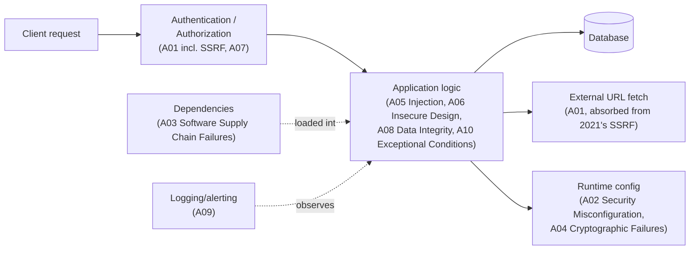
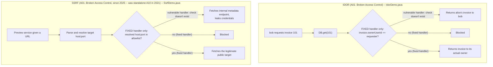

# OWASP Top 10 for Backend Services

> **Topic register:** T-1301 (OWASP Top 10 for backend services, IWI 6.35) · Core tier · High interview frequency [H]

## Table of Contents

1. [Learning Objectives](#learning-objectives)
2. [Why This Matters in Interviews](#why-this-matters-in-interviews)
3. [Level 1 — Foundation](#level-1-foundation)
4. [Level 2 — Working Knowledge](#level-2-working-knowledge)
5. [Mental Model](#mental-model)
6. [Definition and Purpose](#definition-and-purpose)
7. [Core Concepts](#core-concepts)
8. [Internal Implementation](#internal-implementation)
9. [Diagrams](#diagrams)
10. [Production Scenarios](#production-scenarios)
11. [Failure Modes and Debugging](#failure-modes-and-debugging)
12. [Trade-offs](#trade-offs)
13. [Decision Framework](#decision-framework)
14. [Comparisons](#comparisons)
15. [Common Mistakes](#common-mistakes)
16. [Anti-Patterns](#anti-patterns)
17. [Best Practices](#best-practices)
18. [Interview Answer Framework](#interview-answer-framework)
19. [Interview Questions](#interview-questions)
20. [Summary](#summary)
21. [Key Takeaways](#key-takeaways)
22. [Cheat Sheet](#cheat-sheet)
23. [Flashcards](#flashcards)
24. [Practice Exercises](#practice-exercises)
25. [Solutions](#solutions)
26. [Additional Reading](#additional-reading)
27. [Official References](#official-references)

---

## Learning Objectives

By the end of this chapter you can name all ten OWASP Top 10:2025 categories (the edition that superseded 2021 in 2025), explain which ones this handbook covers as their own deep-dive chapter versus which are covered only here, and reproduce two real Java demonstrations — an Insecure Direct Object Reference (IDOR) and a Server-Side Request Forgery (SSRF) — showing the exact code-level difference between a vulnerable handler and a fixed one. Both demos now fall under the same 2025 category, **A01: Broken Access Control**, since SSRF lost its standalone 2021 slot and was folded into it — a real, citable taxonomy change worth knowing about in its own right (Core Concepts covers the full 2021→2025 mapping).

## Why This Matters in Interviews

The OWASP Top 10 question rarely means "recite the list." Interviewers use it as a routing question: they want to see whether a candidate can take a category name and immediately produce a concrete, code-level example of how it manifests in a typical backend service, then explain the fix in terms of *where* the defense belongs (input boundary, authorization layer, output boundary, dependency pipeline). A candidate who says "SQL injection is bad, use prepared statements" gets partial credit; a candidate who says "injection is any case where untrusted data crosses into an interpreter's syntax rather than staying data — SQL is the classic case, but so is a shell command built from user input, or an LDAP filter, or a Server-Side Request Forgery where a URL itself is the interpreter's *target* rather than its filter" demonstrates the transferable mental model interviewers are actually screening for.

## Level 1 — Foundation

Think of the OWASP Top 10 as a "most common ways burglars actually get in" list a security consultant hands a homeowner, based on real data from thousands of break-ins — not a complete list of every conceivable way a house could be broken into, but a ranked list of the ones that keep happening in practice: an unlocked back door (broken access control — which, per the 2025 update, now also covers letting a "package delivery" person walk straight into the house without checking they're legitimate, i.e. SSRF), a copied key that was never deactivated (authentication failures), leaving valuables visible through an unlocked window (security misconfiguration), or a smoke alarm that fails silently instead of sounding when something goes wrong (mishandling of exceptional conditions, new in 2025).

One category, **Insecure Design (A06:2025, was A04:2021)**, is different from all the others: it's not "the lock was installed badly," it's "nobody thought to put a lock on this door in the first place." No amount of careful installation fixes a door that was never designed to have a lock — that's a planning problem, not a workmanship problem.



Mapping each category to *where in a real request's path* it actually applies is the practical skill this list is for — most of the ten aren't abstract categories to memorize in order, they're specific places along this exact flow where a real, concrete mistake keeps recurring across real systems, which is why the list is built from actual incident data rather than a theoretical taxonomy.

## Level 2 — Working Knowledge

At this level you should be able to take any of the ten category names and immediately produce a concrete example of how it shows up in an ordinary backend service, rather than just reciting the name. The single most valuable habit to build is recognizing Broken Access Control (A01) specifically: it's usually not a visibly wrong line of code, but a missing one — a handler that fetches an object by ID and forgets to check whether the requester actually owns it. This is why it routinely passes functional testing: functional tests almost always use the "correct" user's credentials, and the bug only appears when someone deliberately supplies a different user's ID.

You should also be comfortable recognizing that "we use a scanner" or "we have a web application firewall" is not the same as "this category is covered" — these tools are a useful additional layer, not a substitute for the actual fix (parameterized queries, an explicit ownership check, a proper allowlist). And you should know to treat any server-side feature that fetches a URL supplied or influenced by a user (a webhook, a URL preview, an image proxy) as a candidate for SSRF review — since 2025, that review sits explicitly under Broken Access Control (A01), not a separate category — even when the feature doesn't look like an obvious "URL parameter" feature at first glance.

Practically, when reviewing a new feature, run through the list not as "does this have a known CVE" but as "does this feature have a shape that matches any of these ten risk categories" — that reframing is what turns the list from a memorization exercise into an actual review tool.

## Mental Model

Treat the OWASP Top 10 not as ten independent bugs to memorize but as three recurring failure shapes, each showing up in multiple categories: **(1) a trust boundary was crossed without a check** (broken access control, including SSRF; insecure design), **(2) untrusted data was treated as code or as an unconditionally-trusted target** (injection, deserialization, some SSRF), and **(3) a security control existed but was misconfigured, outdated, silently absent, or failed open instead of closed** (security misconfiguration, software supply chain failures, cryptographic failures, authentication failures, logging/alerting failures, mishandling of exceptional conditions). Most real incidents are combinations — an SSRF-shaped request (shape 2) that succeeds *because* an internal service assumed any request reaching it was already authorized (shape 1).

## Definition and Purpose

The **OWASP Top 10** is a periodically-updated (roughly every 3–4 years) ranked list of the most critical web-application security risk *categories*, maintained by the Open Web Application Security Project from a combination of large-scale vulnerability-data contributions and an industry practitioner survey. **OWASP Top 10:2025 is the current published edition**, superseding the 2021 edition — this chapter was originally written against 2021 and has been updated to reflect the 2025 renumbering; treat any external material still citing "A03: Injection" or "A10: SSRF" as referring to the 2021 edition, not an error. It exists as a prioritization tool, not an exhaustive checklist — its purpose is to focus limited security review time on the categories most likely to matter for a typical backend service, in rough order of prevalence and impact.

## Core Concepts

### The 2025 list, what changed from 2021, and where each category lives in this handbook

| # (2025) | Category | Was in 2021 | Deep-dive location |
|---|---|---|---|
| A01 | Broken Access Control | A01 (unchanged rank; absorbed 2021's standalone A10 SSRF) | This chapter (IDOR + SSRF demos below); [AuthN/AuthZ, RBAC vs ABAC](authn-authz-rbac-vs-abac.md) for the authorization-model layer |
| A02 | Security Misconfiguration | A05 (moved up #5→#2) | This chapter — cross-cutting; see Production Scenarios |
| A03 | Software Supply Chain Failures | A06 "Vulnerable and Outdated Components" (renamed + widened scope) | [Supply Chain Security, SBOM, and Dependency Risk](supply-chain-security-sbom-and-dependency-risk.md) |
| A04 | Cryptographic Failures | A02 (moved down #2→#4) | [Applied Cryptography](applied-cryptography-hashing-signing-tls.md) |
| A05 | Injection | A03 (moved down #3→#5) | [Injection, Input Validation, Output Encoding](injection-input-validation-output-encoding.md) |
| A06 | Insecure Design | A04 (moved down #4→#6) | This chapter — a design-level, not implementation-level, category (see below) |
| A07 | Authentication Failures | A07 "Identification and Authentication Failures" (renamed only) | [OAuth2, OIDC, and JWT](oauth2-oidc-and-jwt.md); [AuthN/AuthZ](authn-authz-rbac-vs-abac.md) |
| A08 | Software or Data Integrity Failures | A08 "Software **and** Data Integrity Failures" (renamed only) | [Applied Cryptography](applied-cryptography-hashing-signing-tls.md) (signing); [Supply Chain Security](supply-chain-security-sbom-and-dependency-risk.md) (pipeline integrity) |
| A09 | Security Logging & Alerting Failures | A09 "...and Monitoring Failures" (renamed only) | This chapter — cross-cutting; see Production Scenarios |
| A10 | Mishandling of Exceptional Conditions | **New in 2025** — no 2021 equivalent | This chapter — cross-cutting; see Production Scenarios |

**SSRF (2021's standalone A10) no longer exists as its own category** — it was folded into Broken Access Control (A01) in 2025, on the reasoning that an SSRF is fundamentally the server making a request on an attacker's behalf without an authorization check on the *target*, the same underlying failure shape as every other A01 finding. This chapter's SSRF demo (below) stays exactly as valuable a teaching example as before; only its category label changed.

This chapter is deliberately the *survey* chapter: it owns the categories that don't already have a natural home elsewhere in the register (A01 including its former-SSRF angle, A02, A06, A09, A10) and routes everything else to its canonical chapter — per this repository's ownership model, the full explanation lives in exactly one place.

### A06:2025 (was A04:2021), Insecure Design, is a category about missing controls, not broken ones

Every other category in the list describes an implementation defect in a control that exists. Insecure Design is different: it describes the *absence* of a needed control from the design itself — no amount of careful coding fixes a design that never considered, say, rate-limiting a password-reset endpoint, or that trusted a client-supplied price field. This is why it's frequently a Staff-level interview thread: it's a design-review finding, not a code-review finding, and catching it requires threat-modeling before implementation, not testing after.

### SSRF is real and still worth demonstrating — its category label just changed

SSRF entered the Top 10 for the first time in the 2021 edition specifically because cloud metadata endpoints (a well-known example pattern being a link-local address serving instance credentials) turned a previously low-impact bug class ("the server fetched a URL I gave it") into a credential-theft primitive. Any backend feature that fetches a user-influenced URL server-side — webhooks, URL previews, PDF-from-URL generators, image proxies — is a candidate; as of 2025 the risk itself is unchanged, only its taxonomy placement is (folded into A01, above).

### A10:2025, Mishandling of Exceptional Conditions, is the newest category

New in the 2025 edition, covering 24 CWEs around improper error handling, logical errors in exception paths, and — the pattern most relevant to a typical backend service — **failing open instead of closed**: an authorization or validation check that's supposed to deny access on error, but a bug (an uncaught exception, a swallowed `try`/`catch`, a default `return true`) makes it silently allow access instead when something goes wrong. The category exists because this failure shape kept showing up across real incident data as distinct from ordinary Insecure Design or Broken Access Control findings — the control was designed correctly and often implemented correctly for the happy path, and the class of exceptional conditions is what breaks it.

## Internal Implementation

**Real IDOR demonstration** (`practice/java/week-17/owasp-top-10/src/IdorDemo.java`) — a vulnerable handler fetches an object by ID with no ownership check; the fixed handler enforces it:

```
=== VULNERABLE handler: bob requests alice's invoice 101 ===
Result: Invoice[id=101, ownerUserId=alice, amountUsd=4200.0]  <-- bob just read alice's $4,200 invoice

=== FIXED handler: bob requests alice's invoice 101 ===
Blocked: requester 'bob' is not the owner of invoice 101

=== FIXED handler: alice requests her own invoice 101 ===
Result: Invoice[id=101, ownerUserId=alice, amountUsd=4200.0]  <-- legitimate owner, allowed
```

The vulnerable and fixed handlers share the exact same in-memory data access line (`DB.get(invoiceId)`) — the entire vulnerability is the *absence* of one ownership comparison after the fetch, which is precisely why IDOR is so easy to introduce (the "happy path" code works perfectly) and so easy to miss in review (there's no obviously-wrong line, only a missing one).

**Real SSRF demonstration** (`practice/java/week-17/owasp-top-10/src/SsrfDemo.java`) — two local HTTP servers stand in for a legitimate public target and an internal metadata-style endpoint; a "URL preview" service fetches whatever URL it's given:

```
=== VULNERABLE preview service: legitimate request ===
<binary image bytes>

=== VULNERABLE preview service: attacker-supplied internal URL ===
Leaked: AKIA-DEMO-NOT-REAL SecretAccessKey=demo-secret-value-not-real

=== FIXED preview service: same attacker-supplied internal URL ===
Blocked: target host:port not in allowlist: 127.0.0.1:15601
```

The fixed version's defense is a strict **allowlist** of permitted destination hosts, checked against the *resolved* target after parsing the URL — not a denylist of "known-bad" hosts, and not a check on the URL string's syntax alone. Denylists for SSRF are notoriously bypassable (redirects, DNS rebinding, alternate IP representations of loopback addresses); an allowlist of legitimate external destinations is the only defense that doesn't require anticipating every attacker encoding trick.

## Diagrams

Both real demos above share the same shape as the Mental Model's "shape 1" (a trust boundary crossed without a check) — the vulnerable path has no decision point at all where the fixed path has one:



In both cases, the vulnerable path isn't *missing a step in a chain of checks* — it never reaches a decision point at all, which is exactly why the fix is one added condition (`I3`/`S3`), not a rewrite of the surrounding logic.

## Production Scenarios

**A02, Security Misconfiguration — a service exposes verbose stack traces in production error responses.** This is one of the most common real-world findings in this category (and part of why it jumped from #5 to #2 in the 2025 data): a framework's default development error page (full stack trace, sometimes including internal class names, file paths, or SQL fragments) is left enabled after deployment. The fix is configuration, not code — disable detailed error pages outside a development profile — but it requires someone to have explicitly verified production configuration differs from development defaults, which is exactly the kind of check that's easy to skip when "it works" is the only acceptance criterion being tested.

**A09, Security Logging & Alerting Failures — a credential-stuffing attack against a login endpoint runs undetected for weeks.** The application logs successful logins and generic errors, but never logs failed-authentication attempts with enough context (source IP, username attempted, timestamp) to distinguish "a user mistyped their password twice" from "an automated tool is trying 50,000 username/password pairs against this endpoint." The absence isn't a missing feature so much as a missing decision: security-relevant events (auth failures, authorization denials, privilege escalations) need to be logged as a first-class category, separately reviewable from general application logs, with alerting thresholds tuned to the traffic pattern of an actual attack rather than normal usage noise — the 2025 rename from "Monitoring" to "Alerting" specifically emphasizes that logging the event is not enough if nothing acts on it.

**A10, Mishandling of Exceptional Conditions — a payment-authorization check fails open when the fraud-scoring service times out.** The authorization handler calls an external fraud-scoring service and denies the payment if the score is above a threshold; when that service times out, the handler's exception path has a bug — instead of denying the payment (fail closed) on any exception, a catch block defaults to `approved = true` so a "should never happen" downstream error doesn't block legitimate payments. Under normal conditions this is invisible, since the fraud service almost always responds. The moment it degrades (a dependency outage, a slow network path), every request that would have hit the timeout is now silently approved with no fraud check at all — exactly the "improper error handling, failing open" shape this new 2025 category names.

## Failure Modes and Debugging

- **Symptom: an endpoint that "worked in testing" leaks another user's data in production.** Check first for a missing object-level authorization check (IDOR) — this is the single most common real-world A01 finding, and it passes functional testing trivially because functional tests almost always test with the "correct" owner's credentials.
- **Symptom: a server-side URL-fetching feature is abused to reach an unexpected internal address.** Confirm whether the fetch target is validated against an allowlist *after* DNS resolution, not just against the URL string — a denylist-based or string-pattern-based check is bypassable via redirects or alternate address representations.
- **Anti-pattern to rule out first when triaging "how did this vulnerability get through code review":** checking whether the vulnerability was even reviewable from the diff alone — IDOR and insecure-design issues are frequently invisible from a code diff because the defect is an *absence*, not a presence, and requires reviewing the feature's authorization model, not just its new lines.

## Trade-offs

Treating the OWASP Top 10 as a compliance checklist ("we checked all ten boxes") is fast but shallow — it produces coverage of the *named* categories without necessarily catching a service's actual highest-risk exposure, which might be a business-logic flaw the list doesn't name at all (the Top 10 covers common technical categories, not every possible flaw). Treating it as the three recurring failure shapes described in this chapter's Mental Model is slower to apply per-review but transfers to vulnerabilities the list doesn't explicitly name.

## Decision Framework

Use the Top 10 as a starting checklist for a security review's *scope*, not its *completion criteria* — for each category, ask "does this service have a feature shaped like this risk" (does it fetch user-influenced URLs server-side? does it deserialize untrusted input? does it expose object IDs that another user could guess or enumerate?) rather than treating "no known CVE in this category" as sufficient. Escalate straight to a design-level review (Insecure Design's territory) rather than a code-level fix whenever the finding is "this feature has no control for X" rather than "this feature's control for X has a bug."

## Comparisons

Both of this chapter's own demos are, as of 2025, the same category (A01: Broken Access Control — IDOR directly, SSRF since it was folded in) but are each defended by a family of superficially-similar controls that differ sharply in whether they're a real fix or defense-in-depth on top of one:

| Category | Control | Is it the actual fix? | Why |
|---|---|---|---|
| A01 (IDOR) | Explicit ownership/permission check (this chapter's fix) | Yes | Directly answers "may *this* requester access *this* object" |
| A01 (IDOR) | Unguessable/random-looking object IDs | No — defense-in-depth only | An ID still leaks via a shared link, log, or cache; doesn't answer the authorization question at all (see Anti-Patterns) |
| A01 (IDOR) | Rate limiting on the endpoint | No — defense-in-depth only | Slows brute-force ID guessing but does nothing if the attacker already has a valid ID for someone else's object |
| A01 (SSRF) | Allowlist of resolved destination hosts (this chapter's fix) | Yes | Only IPs/hosts explicitly deemed safe can ever be reached, regardless of encoding tricks |
| A01 (SSRF) | Denylist of "known-bad" strings (`169.254`, `localhost`) | No | Bypassable via alternate IP encodings, DNS rebinding, redirects — see Interview Question 2 |
| A01 (SSRF) | Network-level egress firewall rules | Partial — defense-in-depth | Reduces blast radius if the allowlist is ever misconfigured, but doesn't replace an application-level check tailored to the specific feature's legitimate destinations |

The pattern across both: a control that reduces *how likely* an attacker is to succeed (obscure IDs, a denylist, rate limiting) is not the same as a control that makes the attack *impossible by construction* (an explicit authorization check, an allowlist) — interviewers probing this chapter's categories are usually listening for which side of that line a candidate's proposed fix actually falls on.

## Common Mistakes

- Reciting the ten category names without being able to produce a concrete code-level example for at least the top few.
- Treating "we use a web application firewall" as covering Injection (A05:2025) — a WAF is a valuable additional layer, not a substitute for parameterized queries and proper output encoding at the source.
- Missing that SSRF applies to *any* server-side URL fetch, not just an obvious "URL parameter" feature — webhooks, PDF generators, and image proxies are all SSRF-shaped features that don't look like it at first glance, and as of 2025 they fall under Broken Access Control (A01), not a separate SSRF category.
- Assuming IDOR requires a security scanner to find — it's routinely found by manually changing an ID in a request and observing whether authorization is actually enforced.
- Citing "OWASP Top 10:2021" category numbers (A02 Cryptographic Failures, A03 Injection, A06 Vulnerable Components, A10 SSRF) as if they're current — the 2025 edition renumbered most of the list; see Core Concepts' mapping table before citing a number in an interview.

## Anti-Patterns

Relying on "security through obscurity" object identifiers (e.g., long random-looking IDs) as a *substitute* for an object-level authorization check, rather than as defense-in-depth alongside one — an unguessable ID still leaks if a URL is shared, logged, cached, or referenced by another vulnerability (like the SSRF or logging failures described above), and the underlying access-control gap remains exploitable by anyone who does obtain a valid ID through any of those paths.

## Best Practices

Default every object-fetching endpoint to requiring an explicit authorization check as part of its implementation template, rather than treating the check as an add-on to remember — this converts a Broken Access Control finding from "a mistake a developer might make" into "a step the framework or code review structurally requires." For any server-side URL-fetching feature, default to an allowlist-based validation of the resolved destination, applied consistently as shared middleware or a shared utility rather than reimplemented ad hoc per feature. For any exception path guarding a security decision (authorization, fraud scoring, payment approval), default to fail-closed explicitly — treat a bare `catch` that doesn't re-throw or explicitly deny as a design smell (A10:2025's territory).

## Interview Answer Framework

### 30-Second Answer

The OWASP Top 10 is a ranked list of the most critical web-application security risk categories, updated periodically by OWASP from vulnerability data and practitioner surveys — the 2025 edition is current, superseding 2021. It's used as a prioritization and scoping tool for security review, not an exhaustive vulnerability checklist — real backend risk includes business-logic flaws the list doesn't explicitly name.

### 2-Minute Answer

Definition: ten ranked categories of web-application risk, currently the 2025 edition (renumbered several categories from 2021, merged SSRF into Broken Access Control, and added two new categories: Software Supply Chain Failures and Mishandling of Exceptional Conditions). Why it exists: to focus limited security-review time on the highest-prevalence, highest-impact risk categories rather than an unbounded search space. How it works: each category names a *shape* of failure (broken access control, injection, cryptographic failure, etc.) rather than a specific bug, and a real service is reviewed against "does this feature have this shape of risk" for each category. One trade-off: treating it as a compliance checklist gives coverage of the named categories without necessarily catching a service's actual highest risk, which might be an unnamed business-logic flaw. One production example: an IDOR (A01) where a fetch-by-ID handler works perfectly for its "happy path" test (the correct owner requesting their own object) and only fails when a *different* user's ID is substituted — invisible to functional testing that only ever tests with correct credentials.

### 10-Minute Deep Dive

Cover: the three recurring failure shapes (trust-boundary-crossed-without-check, untrusted-data-treated-as-code-or-target, control-present-but-misconfigured-or-fails-open); a walk through the ten 2025 categories, what changed from 2021 (renumbering, SSRF's absorption into A01, the two new categories), and which this handbook covers as its own deep-dive versus which live only here; the real IDOR demonstration showing the vulnerability is a missing comparison, not a wrong one; the real SSRF demonstration showing why allowlists (not denylists) are the correct defense shape; Insecure Design (A06:2025) as a design-review finding distinct from every other implementation-level category; Security Logging & Alerting Failures (A09) as an often-overlooked category that determines whether an incident is caught in minutes or discovered weeks later; Mishandling of Exceptional Conditions (A10:2025, new) as the "fails open instead of closed" failure shape.

### Whiteboard Explanation

Draw three columns labeled "Trust boundary crossed," "Data treated as code/target," and "Control missing, broken, or fails open." Under each, list the 2025 categories that fit (A01 — including former-SSRF — under the first; A05/A08 under the second; A02/A03/A04/A06/A07/A09/A10 under the third, noting several controls-related categories can appear in more than one column depending on the specific incident). Circle A06 (Insecure Design) outside all three columns, labeled "design-level absence, not implementation-level defect," to show why it gets a different review process.

### Production Example

A URL-preview feature (paste a link, see a thumbnail) is added to an internal chat tool. It works correctly in testing against public URLs. Months later, a routine security review notices the feature will fetch *any* URL server-side, including ones targeting the service's own internal network — a textbook SSRF exposure, filed under Broken Access Control (A01) as of 2025, that had nothing to do with a coding bug in the feature itself, only with the feature's design never having considered that "fetch this URL" is a request the server, not the user, actually executes.

### Trade-offs to Mention

The Top 10 is a prioritization tool calibrated to common web-application risk; it is not calibrated to a specific service's actual highest-risk exposure, which may be a business-logic flaw or a category the list doesn't name at all.

### Common Candidate Mistakes

Reciting category names without a concrete example; conflating "we have a WAF/scanner" with "this category is covered"; citing stale 2021 category numbers without knowing the list was renumbered in 2025.

### Typical Follow-Up Questions

"Which category would a leaked API key in a public GitHub repo fall under?" → Cryptographic Failures (A04:2025, if the key itself was mishandled) or Security Misconfiguration (A02:2025), depending on how it was exposed — a good follow-up answer distinguishes the two. "How would an allowlist-based SSRF defense need to change if the service also needs to support user-supplied *internal* URLs for a legitimate reason?" → the allowlist would need to explicitly include those internal destinations rather than blocking all internal addresses categorically, which is a genuinely harder design problem than a blanket internal/external split. "What's new in the 2025 edition that wasn't in 2021?" → two new categories (Software Supply Chain Failures, expanding beyond just vulnerable dependencies; Mishandling of Exceptional Conditions, covering fail-open error handling) and SSRF's demotion from a standalone category into Broken Access Control.

### Senior-Level Expectations

Names several categories with a correct, concrete code-level example each, and correctly distinguishes categories that are implementation defects from A04 (a design-level absence).

### Staff-Level Discussion

Treats the Top 10 as a starting scope for a review process, not the review's completion criteria; can reason about a service's business-logic-specific risks that the list doesn't name; recognizes that Insecure Design (A06) and Security Logging & Alerting Failures (A09) findings typically indicate a process gap (no threat modeling; no security-event logging standard) rather than a single fixable bug, and proposes the process change alongside the immediate fix.

## Interview Questions

### Question 1

**Walk me through how you'd find an IDOR vulnerability in a code review, given that the vulnerable and fixed code differ by only one check.**

**Expected answer:** IDOR is rarely visible from a diff alone if the diff only shows the new feature's "happy path" — the reviewer needs to explicitly ask "what stops a different, authenticated user from supplying a different object ID here" for every object-fetching endpoint, since the vulnerability is an absence, not a suspicious-looking line.

**Common mistakes:** describing IDOR only in terms of automated scanning rather than the manual review question that actually catches it.

**Follow-up questions:** "Would functional tests catch this?" (No, not unless a test specifically supplies a different user's ID — which functional tests, by default, don't.)

**Senior-level expectations:** correctly identifies the review question to ask and why standard functional testing misses it.

**Staff-level expectations:** proposes a structural fix (e.g., a shared authorization-check utility or framework-level enforcement) rather than relying on every reviewer remembering to ask the question every time.

### Question 2

**A teammate proposes defending against SSRF by blocking any URL containing the string "169.254" or "localhost." Is this sufficient?**

**Expected answer:** no — this is a denylist of known-bad string patterns, which is bypassable via alternate IP representations (decimal, octal, IPv6-mapped forms), DNS rebinding (a hostname that resolves to an internal address at request time despite passing a string check earlier), or redirects from an initially-allowed URL to a blocked one. The correct defense is an allowlist of permitted destination hosts, validated against the *resolved* address, not the URL string.

**Common mistakes:** treating denylist string-matching as "good enough" without considering resolution-time bypasses.

**Follow-up questions:** "What about redirects — does validating the initial URL's host cover that case?" (No — the fetch needs to either disable redirect-following or re-validate the destination after each redirect hop.)

**Senior-level expectations:** correctly identifies the denylist as insufficient and names at least one bypass category.

**Staff-level expectations:** proposes the full allowlist-plus-resolved-address-plus-redirect-handling defense and can explain why each individual piece is necessary.

### Question 3

**What changed between the OWASP Top 10:2021 and OWASP Top 10:2025 editions, and why does it matter that you know this?**

**Expected answer:** four real changes — Security Misconfiguration jumped from #5 to #2; SSRF lost its standalone A10 slot and was folded into Broken Access Control (A01); "Vulnerable and Outdated Components" was renamed and widened in scope to "Software Supply Chain Failures" (A03); and a brand-new category, "Mishandling of Exceptional Conditions" (A10:2025), was added covering fail-open error handling. It matters because citing a stale category number ("SQL injection is A03") in an interview is a small but real accuracy miss once the interviewer knows the list moved on.

**Common mistakes:** assuming the Top 10 is a static, rarely-changing reference and citing 2021 numbers from memory without checking; assuming SSRF was removed entirely rather than folded into another category.

**Follow-up questions:** "Why would OWASP fold SSRF into Broken Access Control instead of keeping it separate?" (Both describe the same underlying failure shape: the server acts on a target — an object, or a URL — without properly authorizing that action against the actual requester's intent.)

**Senior-level expectations:** names at least two of the four real changes accurately.

**Staff-level expectations:** explains *why* the reclassification makes sense structurally (same failure shape as A01), not just that it happened, and can reason about what the new "Mishandling of Exceptional Conditions" category implies for how exception-handling code should be reviewed going forward.

## Summary

The OWASP Top 10:2025 (superseding the 2021 edition) is ten ranked categories of web-application security risk, useful as a review-scoping tool rather than an exhaustive checklist. This chapter is the survey entry point for the domain: it fully covers the categories without a natural deep-dive home elsewhere (A01 — including its absorbed former-SSRF angle, A02, A06, A09, A10) with real, working Java demonstrations for IDOR and SSRF, and routes the remaining categories to their dedicated chapters in this handbook.

## Key Takeaways

- The Top 10 is a prioritization tool from vulnerability data and practitioner survey, not an exhaustive vulnerability list.
- The current edition is 2025, not 2021 — Security Misconfiguration moved #5→#2, SSRF was folded into Broken Access Control, "Vulnerable Components" became the wider "Software Supply Chain Failures," and a new category, "Mishandling of Exceptional Conditions," was added.
- Most real incidents fit one of three shapes: trust boundary crossed without a check, untrusted data treated as code or an unconditionally-trusted target, or a control present but misconfigured/outdated/absent from logging/fails open.
- IDOR (A01) is an *absence* of an ownership check, not a visibly-wrong line — this is why it survives functional testing and code review so often.
- SSRF defenses must be allowlist-based and validated against the resolved address, not a denylist of known-bad string patterns — SSRF now falls under A01, not its own category.
- Insecure Design (A06) and Security Logging & Alerting Failures (A09) typically indicate a missing process, not a single fixable code defect.

## Cheat Sheet

| Category (2025) | One-line risk | Primary defense | Deep-dive |
|---|---|---|---|
| A01 Broken Access Control (incl. SSRF) | Object-level authorization check missing, or server-side fetch reaches unintended target | Explicit ownership/permission check on every fetch; allowlist on resolved destination | This chapter + [AuthN/AuthZ](authn-authz-rbac-vs-abac.md) |
| A02 Security Misconfiguration | Insecure default left enabled | Explicit prod-vs-dev config review | This chapter |
| A03 Software Supply Chain Failures | Known-vulnerable dependency or compromised build/distribution step | SBOM + dependency scanning + verified pipelines | [Supply Chain](supply-chain-security-sbom-and-dependency-risk.md) |
| A04 Cryptographic Failures | Weak/absent crypto for data at rest or in transit | Modern algorithms, correct key handling | [Applied Cryptography](applied-cryptography-hashing-signing-tls.md) |
| A05 Injection | Untrusted data parsed as code/syntax | Parameterized queries, output encoding | [Injection](injection-input-validation-output-encoding.md) |
| A06 Insecure Design | Control never designed in | Threat modeling before implementation | This chapter |
| A07 Authentication Failures | Weak auth flow or session handling | Standard OAuth2/OIDC/JWT patterns | [OAuth2/OIDC/JWT](oauth2-oidc-and-jwt.md) |
| A08 Software or Data Integrity Failures | Unsigned/unverified code or data | Signing, verified pipelines | [Applied Cryptography](applied-cryptography-hashing-signing-tls.md) |
| A09 Security Logging & Alerting Failures | Attack undetected due to insufficient logging/alerting | Security-event logging as first-class category, with tuned alerting | This chapter |
| A10 Mishandling of Exceptional Conditions | An error path fails open instead of closed | Explicit fail-closed default on every security-relevant exception path | This chapter |

## Flashcards

**Q: Is the OWASP Top 10 an exhaustive vulnerability checklist?**
A: No — it's a prioritization tool covering the most common/impactful categories; real risk can include business-logic flaws the list doesn't name.

**Q: Why does IDOR routinely pass functional testing?**
A: Because functional tests almost always test with the correct owner's credentials; the vulnerability only appears when a *different* user's object ID is supplied, which standard happy-path tests don't do.

**Q: Why is a denylist insufficient as an SSRF defense?**
A: It's bypassable via alternate address representations, DNS rebinding, and redirects — an allowlist validated against the resolved destination is required instead.

**Q: Is SSRF still its own OWASP Top 10 category?**
A: No — as of the 2025 edition, SSRF was folded into Broken Access Control (A01); it was a standalone A10 only in the 2021 edition.

**Q: What's genuinely new in OWASP Top 10:2025 versus renamed/renumbered from 2021?**
A: Only one category is genuinely new with no 2021 equivalent: Mishandling of Exceptional Conditions (A10, fail-open error handling). "Software Supply Chain Failures" (A03) isn't new either — it's a renamed, widened version of 2021's "Vulnerable and Outdated Components." Everything else in the 2025 list is a renumbering or minor rename of an existing 2021 category.

## Practice Exercises

1. Reproduce `IdorDemo.java` and modify it to add a third user role ("support-agent") that should be allowed to read any invoice for support purposes — implement this as an explicit rule, not by removing the ownership check.
2. Reproduce `SsrfDemo.java` and add a redirect step from the allowed public URL to the internal one; confirm whether the fixed version's defense still holds (it does, since it never validates the initial URL, only ever fetches after `HttpClient` follows a redirect and needs an additional redirect-aware check to be fully robust — a good exercise in seeing the limits of a single-hop allowlist check).

## Solutions

1. The correct implementation adds an explicit `requesterRole.equals("support-agent")` OR-condition alongside the ownership check — never a change that weakens or removes the ownership check itself for other roles.
2. `HttpClient.newHttpClient()`'s default redirect policy is `NEVER`, so the demo as written does not follow redirects automatically — but a production HTTP client configured with automatic redirect-following would need the allowlist check re-applied after each redirect hop, not just on the initial URL, to stay robust.

## Additional Reading

- [OWASP Top 10:2025](https://owasp.org/Top10/2025/) — the current edition (verified live 2026-09-14; supersedes 2021).
- [Serialization Hazards and Alternatives](../02-java/language-core/serialization-hazards-and-alternatives.md) — the real, Java-specific mechanics (with real, byte-level-tampered reproductions) behind this chapter's "untrusted data treated as code" deserialization risk shape.

## Official References

- [OWASP Top 10:2025](https://owasp.org/Top10/2025/)
