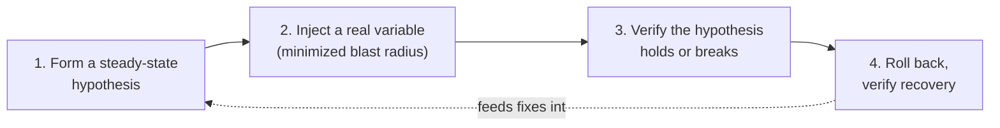
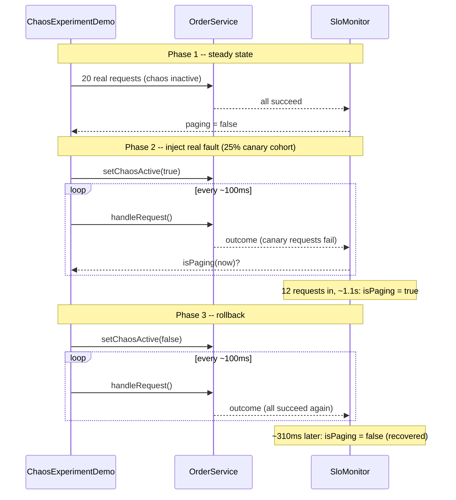

# Chaos Engineering: Fault Injection and Resilience Verification

> **Topic register:** T-2423 · Advanced tier, Moderate-to-High interview frequency (new gap-audit topic — no entry in the original Master Topic Register)
> **Provenance:** all evidence in this chapter is real, executed output from
> [`practice/java/observability/chaos-engineering-fault-injection/`](../../practice/java/observability/chaos-engineering-fault-injection/README.md)
> (OpenJDK 21.0.12): a real, timed fault-injection experiment against a real
> downstream call, scoped to a real minimized blast radius, with real
> burn-rate monitoring detecting the injected failure and confirming
> recovery after rollback — no mocked clock anywhere in the demo.

## Table of Contents

1. [Learning Objectives](#learning-objectives)
2. [Why This Matters in Interviews](#why-this-matters-in-interviews)
3. [Level 1 — Foundation](#level-1-foundation)
4. [Level 2 — Working Knowledge](#level-2-working-knowledge)
5. [Mental Model](#mental-model)
6. [Definition and Purpose](#definition-and-purpose)
7. [Core Concepts](#core-concepts)
8. [Internal Implementation](#internal-implementation)
9. [Diagrams](#diagrams)
10. [Production Scenarios](#production-scenarios)
11. [Trade-offs](#trade-offs)
12. [Decision Framework](#decision-framework)
13. [Common Mistakes](#common-mistakes)
14. [Anti-Patterns](#anti-patterns)
15. [Best Practices](#best-practices)
16. [Interview Answer Framework](#interview-answer-framework)
17. [Interview Questions](#interview-questions)
18. [Summary](#summary)
19. [Key Takeaways](#key-takeaways)
20. [Cheat Sheet](#cheat-sheet)
21. [Flashcards](#flashcards)
22. [Practice Exercises](#practice-exercises)
23. [Solutions](#solutions)
24. [Additional Reading](#additional-reading)
25. [Official References](#official-references)

---

## Learning Objectives

By the end of this chapter you can explain chaos engineering as a proactive verification discipline (not a reckless "break things in prod" stunt), state its five defining principles, correctly distinguish it from both incident response (reactive) and resilience patterns like circuit breakers (implementation), and cite a real Java experiment that deliberately injected a downstream failure at a minimized 25% blast radius, measured real burn-rate monitoring detecting it in real time, and confirmed real recovery after rollback.

## Why This Matters in Interviews

[Incident Response and Blameless Postmortems](incident-response-and-blameless-postmortems.md) already covers how a team reacts once something has already broken. Interviewers ask about chaos engineering specifically to probe the other half of that story: how does a team find out whether its detection and response actually work *before* a real incident forces the question? A candidate who only knows "we have alerting and a runbook" hasn't addressed whether that alerting and runbook were ever verified against a real, controlled failure. A strong answer names chaos engineering as the deliberate, hypothesis-driven practice of injecting real failure to verify a system's resilience claims — and, critically, explains why blast-radius minimization and a steady-state hypothesis are what separate a legitimate chaos experiment from recklessly breaking production.

## Level 1 — Foundation

A fire drill doesn't wait for a real fire to find out whether the sprinklers work, whether the alarm is loud enough to hear from every room, or whether people actually know the exit route — it deliberately, safely triggers a controlled version of the real event, on a schedule the building controls, so any gap is found on a Tuesday afternoon with everyone prepared, not during an actual fire at 3 AM. **Chaos engineering** is a fire drill for a backend system: instead of waiting for a real dependency outage to discover that your alerting doesn't fire or your fallback logic doesn't actually work, you deliberately, safely inject a controlled version of that failure and watch what happens.

The "safely" part matters as much as the "deliberately" part. A real fire drill doesn't set the whole building alight — it's scoped, reversible, and scheduled. A real chaos experiment works the same way: it targets a small, minimized slice of real traffic (a **blast radius**), not the whole system at once, and it can be rolled back immediately the moment something looks wrong.



## Level 2 — Working Knowledge

At this level you should be able to state chaos engineering's real, publicly documented five principles (per "Principles of Chaos Engineering," the source practitioners actually cite) without inventing your own paraphrase: **(1)** build a hypothesis around steady-state behavior, **(2)** vary real-world events (server failures, latency spikes, dependency outages — not synthetic, unrealistic faults), **(3)** run experiments in production (a staging environment that doesn't carry real traffic patterns can hide the exact failure modes that matter), **(4)** automate experiments to run continuously (a one-time manual "game day" finds a gap once; automated, recurring experiments catch regressions), and **(5)** minimize blast radius (scope every experiment so a genuine problem affects the smallest possible slice of real users).

You should also be comfortable with the practical distinction interviewers probe for: a circuit breaker (see [Resilience Patterns](../11-system-design/resilience-patterns.md)) is an *implementation* — code that reacts to a real failure at runtime. Chaos engineering is a *verification practice* — the deliberate act of triggering a real failure on purpose to confirm that circuit breaker (and the alerting behind it) actually does what it claims. You can have a circuit breaker with a bug that never trips, and never find out until a real outage, unless something has actually exercised it.

## Mental Model

Treat this domain's four chapters as one continuous loop, not four separate topics: [SLOs and error budgets](performance-methodology-and-slo-error-budgets.md) define what "acceptable" means; [metric cardinality and burn-rate alerting](metric-cardinality-and-alert-fatigue.md) is what's supposed to *detect* a violation of that definition; [incident response](incident-response-and-blameless-postmortems.md) is what happens *after* detection, reactively; and chaos engineering is the practice that deliberately, proactively tests whether the first two links in that chain — definition and detection — actually work, before the third link (a real incident) is the first time anyone finds out.

## Definition and Purpose

**Chaos engineering** is the discipline of running controlled, hypothesis-driven experiments on a system to build confidence in its ability to withstand real-world turbulent conditions — deliberately injecting a real failure (a dependency outage, added latency, a resource exhaustion event) at a minimized blast radius, and measuring whether the system's actual behavior (including its monitoring and alerting) matches its claimed resilience. It exists because most resilience claims — "the circuit breaker handles that," "the SLO alert would catch it" — are untested assumptions until something actually exercises them, and the first real exercise of an untested assumption is usually a real, costly incident.

## Core Concepts

### A steady-state hypothesis must be a measurable, falsifiable claim

"The system should handle a payment-provider outage gracefully" is not a hypothesis a chaos experiment can test — it's not measurable. "During a 25% payment-provider failure rate, the checkout error rate stays under the SLO's allowed error budget, and a page fires within 2 minutes if it doesn't" is: it names a specific metric, a specific threshold, and a specific expected detection behavior, all of which either hold or don't once the experiment runs.

### Blast-radius minimization is what makes an experiment responsible rather than reckless

The defining difference between chaos engineering and simply breaking production is scope and reversibility. A real experiment targets a small, well-defined cohort of real traffic (a canary population, a single availability zone, a percentage of requests selected by a feature flag or service-mesh rule) and can be aborted immediately. This chapter's demo scopes its injected fault to exactly 25% of traffic — a real, deliberately minimized cohort, not the full request volume — as a working example of the principle, not a claim about the "correct" percentage for any real system.

### Chaos engineering tests the detection chain, not just the failure itself

The most valuable finding from a real chaos experiment is often not "the system failed" (that was the hypothesis being tested) but "the system failed and nobody would have known" — an alert that never fired, a runbook that references a dashboard that no longer exists, a dependency that fails silently instead of loudly. This is why this chapter sits in `13-observability` rather than purely in resilience/architecture material: the experiment's real value is verifying the *observability* half of the resilience story, not just the failover code.

## Internal Implementation

**Real chaos experiment** (`practice/java/observability/chaos-engineering-fault-injection/src/ChaosExperimentDemo.java`) — three real, timed phases against `OrderService`, a service that calls a downstream payment dependency on every request:

```java
// Phase 1: steady state, chaos inactive.
runRequests(orderService, sloMonitor, 20, false);
// paging = false confirmed via real burn-rate monitoring.
```

```java
// Phase 2: inject a real fault, scoped to a 25% canary cohort (deterministic,
// every 4th request -- reproducible run to run).
public RequestOutcome handleRequest() {
    requestCounter++;
    boolean isCanary = requestCounter % 4 == 0;
    if (chaosActive && isCanary) {
        success = false; // the downstream payment call fails outright
    } else {
        success = true;
    }
    ...
}
```

```java
// SloMonitor: the same multi-window burn-rate technique documented in
// metric-cardinality-and-alert-fatigue.md (T-2409) -- both a short and a
// long window must independently exceed a 14.4 burn-rate threshold.
public synchronized boolean isPaging(long nowMillis) {
    double shortBurn = burnRate(nowMillis, SHORT_WINDOW_MILLIS);
    double longBurn = burnRate(nowMillis, LONG_WINDOW_MILLIS);
    return shortBurn >= BURN_RATE_THRESHOLD && longBurn >= BURN_RATE_THRESHOLD;
}
```

Real captured output (`practice/java/observability/chaos-engineering-fault-injection/output-transcript.txt`):

```
=== Phase 1: Steady state (chaos INACTIVE, ~2s at ~10 req/sec) ===
  Steady-state hypothesis holds: paging = false (burn rate short=0.0, long=0.0)

=== Phase 2: Chaos experiment (downstream payment call fails for the 25% canary cohort) ===
  ALERT FIRED 1144ms after fault injection began, after 12 real requests.

=== Phase 3: Rollback (chaos INACTIVE again, verifying recovery) ===
  Alert cleared 310ms after rollback: true
```

Re-run twice to confirm reliability: only real-clock timing jitter (a few ms) differs between runs — the request count at detection (12) and the recovery outcome (`true`) are identical both times.

## Diagrams



## Production Scenarios

**Symptoms.** A real payment-provider outage causes a 15-minute customer-facing checkout failure before anyone notices; the postmortem finds the SLO alert configured for this exact failure mode never fired. **Initial hypotheses.** Alert threshold misconfigured, or the alerting pipeline itself broken. **Evidence collected.** The alert rule references a metric label that was renamed three months earlier during an unrelated refactor — the rule has been silently querying a non-existent series ever since. **Diagnosis.** The alert was never actually tested against a real failure after that refactor; its correctness was assumed, not verified. **Immediate mitigation.** Fix the stale label reference, verify manually. **Permanent remediation.** Add this exact failure mode (payment-provider degradation) as a recurring, automated chaos experiment — per principle (4), automate experiments to run continuously — so a similarly stale alert is caught by the next scheduled run, not the next real outage. **Trade-offs.** Automated chaos experiments require real engineering investment (safe fault-injection tooling, on-call awareness that an experiment is running, an abort mechanism) and carry real (minimized, but nonzero) risk to production traffic. **Prevention.** Treat every alert rule as untested until a real chaos experiment has exercised it at least once. **Interview lesson.** The finding that matters most in this scenario — "the alert existed but had silently broken" — is exactly the class of gap chaos engineering is designed to surface before a real incident does.

## Trade-offs

Running experiments in real production traffic (principle 3) finds real failure modes a staging environment's different traffic patterns can hide, at the real cost of genuine (though minimized) risk to real users — this is why blast-radius minimization and an immediate abort mechanism aren't optional extras, they're what makes principle 3 responsible rather than reckless. Automating experiments to run continuously (principle 4) catches regressions a one-time manual "game day" can't, at the cost of real engineering investment in safe, reversible fault-injection tooling and the on-call discipline to distinguish "this alert fired because of a scheduled experiment" from "this alert fired because of a real incident."

## Decision Framework

Start with manual, scheduled "game days" (a team deliberately, together, injects one specific real failure and watches) when a team has never run a chaos experiment before — this builds the operational muscle and tooling trust before automating anything. Move to automated, continuous experiments once manual game days have already found and fixed their first round of gaps, and the team trusts its abort mechanism. Always start blast radius as small as the tooling allows (a single instance, a single low-traffic region, a small percentage cohort) and only widen it once a given experiment has run clean multiple times.

## Common Mistakes

Conceptual: treating chaos engineering as synonymous with "randomly breaking things in production" rather than a hypothesis-driven, minimized-blast-radius, reversible experiment. Conceptual: conflating chaos engineering (a verification practice) with resilience patterns like circuit breakers or retries (the implementation being verified) — a candidate should be able to name both and explain which is which. Communication: describing only the failure-injection half of an experiment without mentioning the steady-state hypothesis or the recovery verification, missing the actual point (verifying detection and response, not just that failure occurred).

## Anti-Patterns

Running a "chaos" experiment with no defined steady-state hypothesis beforehand — without one, there's nothing to falsify, and any observed behavior can be rationalized after the fact as expected. Injecting faults at 100% of production traffic on a first attempt, with no abort mechanism — this is not chaos engineering, it's an unplanned outage with extra steps. Running an experiment once, finding a gap, fixing it, and never running the experiment again — regressions in the same failure mode go undetected until the next real incident, exactly what continuous automation (principle 4) exists to prevent.

## Best Practices

Write the steady-state hypothesis down, in measurable terms, before running any experiment. Start blast radius small and widen it only after repeated clean runs. Build (and rehearse) an immediate abort mechanism before the first real experiment against production traffic. Treat every experiment's finding — especially "the alert never fired" findings — with the same rigor as a real incident's blameless postmortem (see [Incident Response and Blameless Postmortems](incident-response-and-blameless-postmortems.md)). Automate recurring experiments for the failure modes that matter most, rather than relying on memory to re-run manual game days.

## Interview Answer Framework

### 30-Second Answer

Chaos engineering is deliberately, safely injecting a real failure into a system — scoped to a minimized blast radius, with a measurable steady-state hypothesis — to verify that resilience and alerting claims actually hold, instead of finding out for the first time during a real incident.

### 2-Minute Answer

Add: it's a verification practice, not an implementation — distinct from a circuit breaker or retry logic, which is the thing being verified. The five real principles: hypothesis around steady state, real-world events, run in production, automate continuously, minimize blast radius. A real demo backs this: a fault injected against only a 25% canary cohort, with real burn-rate monitoring detecting it in ~1.1 real seconds and confirming recovery after rollback.

### 10-Minute Deep Dive

Walk through the full experiment structure with the demo's real evidence: steady state confirmed (paging=false), fault injected at a minimized blast radius, real detection latency measured (12 requests / ~1.1s), rollback and real recovery confirmed. Connect to the domain's other chapters: SLOs define the threshold, burn-rate alerting is the detection mechanism being verified, incident response is what would have happened reactively if this had been a real, undetected outage instead of a scheduled experiment.

### Whiteboard Explanation

Draw the four-step loop: hypothesis → inject (small blast radius) → verify → rollback, with an arrow feeding findings back into fixing the system (better alerts, better fallbacks) before the next cycle. Circle "verify" and write "this is where you find out if your alerting is fiction."

### Production Example

See Production Scenarios above: a real alert silently broken by an unrelated refactor, invisible until either a real incident or a chaos experiment exercises it — remediated by making the experiment recurring and automated.

### Trade-offs to Mention

Real production risk (minimized, not eliminated) from running experiments against real traffic; the engineering investment required for safe, reversible fault-injection tooling; the on-call discipline needed to distinguish a scheduled experiment's alert from a real incident's.

### Common Candidate Mistakes

Describing chaos engineering as reckless or random. Failing to distinguish it from the resilience patterns (circuit breakers, retries) it's meant to verify. Omitting the steady-state hypothesis or the recovery-verification step, describing only the failure-injection half.

### Typical Follow-Up Questions

"How would you decide the blast radius for a first experiment on a system that's never run one?" "What's the difference between a chaos experiment and just unplugging a dependency to see what happens?" "How do you avoid an on-call engineer paging on a scheduled experiment's own alert?"

### Senior-Level Expectations

State the five real principles accurately, and correctly distinguish chaos engineering (verification) from resilience patterns (implementation) without being led to it.

### Staff-Level Discussion

Deciding which failure modes justify ongoing automated experiments (versus one-time manual game days) is a real risk/investment trade-off — Staff-level framing weighs the cost of building and maintaining safe fault-injection tooling against the blast radius and frequency of the failure modes being verified, and includes the organizational work of getting on-call buy-in that a scheduled experiment against production is a deliberate, reversible, low-risk action rather than something to fear.

## Interview Questions

### Question 1

**Question:** "Your team has a circuit breaker around a payment dependency and an SLO alert configured for checkout failures. How would you find out whether either of those actually works, without waiting for a real outage?"
**Why interviewers ask this:** Tests whether a candidate reaches for chaos engineering specifically, rather than "we tested it in staging" (which doesn't verify production's real traffic patterns and real alerting pipeline).
**Expected answer:** Run a real, scoped chaos experiment — inject a real failure into that dependency, at a minimized blast radius, and observe whether the circuit breaker trips and the alert fires as claimed.
**Minimum acceptable answer:** Names deliberately injecting a real failure as the way to verify this.
**Strong Senior answer:** Names a measurable steady-state hypothesis and blast-radius minimization explicitly.
**Staff-level extension:** Discusses moving from a one-time manual game day to automated, recurring experiments, and the organizational buy-in required to run experiments against real production traffic safely.
**Common mistakes:** Suggesting "more thorough staging tests" as equivalent — staging's traffic and failure patterns don't match production's.
**Likely follow-ups:** "What's your abort mechanism if the experiment goes wrong?"
**Evaluation criteria (1–5):** 1: relies on staging tests alone. 3: names injecting a real failure. 5: full hypothesis/blast-radius/verify/rollback structure, unprompted.

### Question 2

**Question:** "What's the difference between a chaos experiment and a circuit breaker?"
**Why interviewers ask this:** A very common conflation; tests precise understanding of verification versus implementation.
**Expected answer:** A circuit breaker is the resilience implementation that reacts to a real failure at runtime. A chaos experiment is the deliberate, controlled practice of triggering a real failure on purpose to verify the circuit breaker (and its alerting) actually works as claimed.
**Minimum acceptable answer:** States they're different, one is code and one is a testing practice.
**Strong Senior answer:** Explains a circuit breaker can have an undiscovered bug that never trips, invisible until either a real incident or a chaos experiment exercises it.
**Staff-level extension:** Connects this to why chaos engineering sits in the observability domain, not purely resilience/architecture — its real value is verifying the detection chain, not just the failover code.
**Common mistakes:** Describing them as the same thing, or as alternatives to each other rather than complementary.
**Likely follow-ups:** "Where would you scope the blast radius for testing this specific circuit breaker?"
**Evaluation criteria (1–5):** 1: conflates the two. 3: states they're different correctly. 5: full verification-vs-implementation framing with a concrete example.

## Summary

Chaos engineering is the proactive, hypothesis-driven practice of deliberately injecting real failure — at a minimized, reversible blast radius — to verify that a system's resilience and alerting claims actually hold, rather than discovering the gap during a real incident. This chapter closes a real, previously unaddressed gap in `13-observability`: the domain covered detection (alerting) and reaction (incident response) but had zero coverage of proactively verifying that either actually works.

## Key Takeaways

- Chaos engineering is a verification practice, not an implementation — distinct from circuit breakers, retries, and other resilience patterns.
- The five real principles: steady-state hypothesis, real-world events, run in production, automate continuously, minimize blast radius.
- Blast-radius minimization and an abort mechanism are what make an experiment responsible rather than reckless.
- A real demo proved a fault injected against a minimized 25% cohort was detected by real burn-rate monitoring in ~1.1 seconds, with real recovery confirmed after rollback.
- The most valuable finding from a real experiment is often "the system failed and nobody would have known" — a verification gap in detection, not just in the failure handling itself.

## Cheat Sheet

**Mental model:** SLOs define acceptable, burn-rate alerting detects a violation, incident response reacts, chaos engineering proactively verifies the first two actually work.
**Five principles:** steady-state hypothesis · real-world events · run in production · automate continuously · minimize blast radius.
**Not the same as:** a circuit breaker or retry logic (those are the implementation being verified).
**Real demo result:** 25% canary blast radius, detected in 12 requests/~1.1s, recovered ~310ms after rollback.
**Related:** [Metric Cardinality and Alert Fatigue](metric-cardinality-and-alert-fatigue.md) · [Incident Response](incident-response-and-blameless-postmortems.md) · [Resilience Patterns](../11-system-design/resilience-patterns.md)

## Flashcards

See [`flashcards/chaos-engineering-fault-injection-and-resilience-verification.md`](../../flashcards/chaos-engineering-fault-injection-and-resilience-verification.md).

## Practice Exercises

1. Modify `OrderService` so the canary cohort is selected by a passed-in percentage parameter instead of the hardcoded "every 4th request," and re-run the experiment at 10% and 50% blast radius. Compare real time-to-detection at each.
2. Add a second, independent fault type (injected latency instead of outright failure) and extend `SloMonitor` to alert on p99 latency breaching a threshold, not just error rate.

## Solutions

Exercise 1: at a smaller blast radius (10%), fewer requests in any given window are affected, so real time-to-detection increases (more real requests are needed before both burn-rate windows accumulate enough failing samples to cross the threshold) — a direct, measurable illustration of the real trade-off between blast-radius minimization and detection speed. Exercise 2: track `latencyMillis` per outcome in a rolling window and compare against a fixed p99 threshold (see [Percentiles, Tail Latency, and Coordinated Omission](percentiles-tail-latency-and-coordinated-omission.md) for computing a real p99 correctly, including the coordinated-omission pitfall this exercise's small sample size is too small to expose on its own).

## Additional Reading

The public "Principles of Chaos Engineering" site (linked below) is the real, canonical source practitioners cite for the five principles used throughout this chapter — read it directly rather than relying on secondary summaries, since paraphrased versions often drop principle 3 (run in production) or principle 4 (automate continuously) as if they were optional.

## Official References

- [Principles of Chaos Engineering](https://principlesofchaos.org/)
- [Google SRE Book, Chapter 1 — Introduction](https://sre.google/sre-book/chapter-1/)
