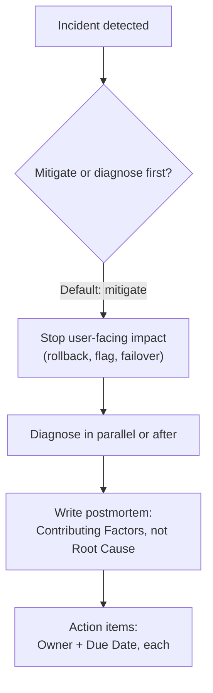
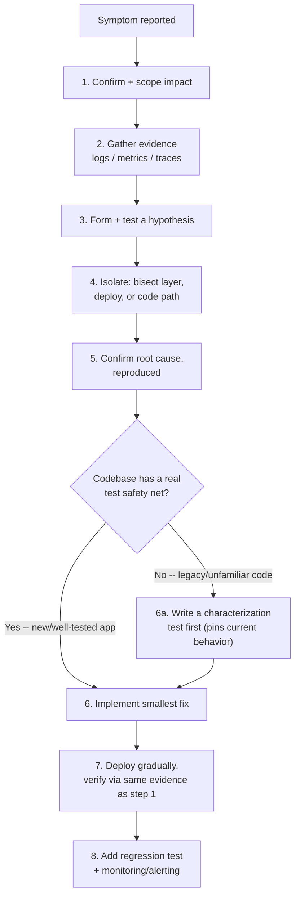

# Incident Response and Blameless Postmortems

> **Topic register:** T-1207 · IWI 7.1 · Staff tier · High interview frequency.
> **Provenance:** the linter results in this chapter are real, executed Python
> output against real, checked-in example documents — a real exit code, real
> quoted offending text, not a description of what the checks would find.
> Reproducible source:
> [`practice/production/postmortem-examples/`](../../practice/production/postmortem-examples/README.md).

> **Scope note.** [Production Incident Narratives](../20-interview-preparation/behavioral/04-production-incident-narratives.md)
> covers how to *tell* an incident story well in a behavioral interview — narrative
> structure, what to emphasize, STAR framing. This chapter covers the actual
> incident-response methodology that story is about: detection, the
> mitigate-before-diagnose ordering decision, blameless analysis, and contributing
> factors over root cause. Read that chapter for interview delivery; read this one for
> the operational substance.

## Table of Contents

1. [Learning Objectives](#learning-objectives)
2. [Why This Matters in Interviews](#why-this-matters-in-interviews)
3. [Level 1 — Foundation](#level-1-foundation)
4. [Level 2 — Working Knowledge](#level-2-working-knowledge)
5. [Mental Model](#mental-model)
6. [Definition and Purpose](#definition-and-purpose)
7. [Core Concepts](#core-concepts)
8. [Internal Implementation](#internal-implementation)
9. [Diagrams](#diagrams)
10. [The Diagnosis Process, Step by Step](#the-diagnosis-process-step-by-step)
11. [Java Examples](#java-examples)
12. [Production Scenarios](#production-scenarios)
13. [Failure Modes and Debugging](#failure-modes-and-debugging)
14. [Trade-offs](#trade-offs)
15. [Organizational Implications](#organizational-implications)
16. [Decision Framework](#decision-framework)
17. [Comparisons](#comparisons)
18. [Common Mistakes](#common-mistakes)
19. [Anti-Patterns](#anti-patterns)
20. [Best Practices](#best-practices)
21. [Interview Answer Framework](#interview-answer-framework)
22. [Interview Questions](#interview-questions)
23. [Summary](#summary)
24. [Key Takeaways](#key-takeaways)
25. [Cheat Sheet](#cheat-sheet)
26. [Flashcards](#flashcards)
27. [Practice Exercises](#practice-exercises)
28. [Solutions](#solutions)
29. [Additional Reading](#additional-reading)
30. [Official References](#official-references)

## Learning Objectives

After this chapter you should be able to:

- Defend, with a concrete example, why mitigation should almost always come before
  full diagnosis during an active incident.
- Write a genuinely blameless postmortem section, not just one that avoids naming
  names.
- Explain why "contributing factors" is the correct frame and "root cause" (singular)
  is the register's own named misconception.
- Design an incident-response process with real detection, escalation, and
  action-item follow-through, not just a document template.
- Distinguish this chapter's operational methodology from the separate skill of
  narrating an incident well in a behavioral interview.

## Why This Matters in Interviews

The register's own follow-up — "mitigate or diagnose first? defend it" — is designed
to catch a specific, common instinct: the urge to fully understand a problem before
acting on it, which under real incident pressure is usually the wrong instinct.
Defending the opposite ordering, with a concrete justification (user impact compounds
every minute a mitigation is delayed; a full diagnosis can proceed in parallel or
afterward, but only if the bleeding has stopped), is a clean Staff-level signal. The
register's named misconception — that postmortems identify a single root cause — is
just as commonly missed: candidates who've absorbed "5 Whys" training sometimes
narrow every incident down to one cause, when real incidents almost always have
several genuinely independent contributing factors, any one of which, changed alone,
would have prevented or shortened the incident.

## Level 1 — Foundation

Imagine your kitchen sink starts leaking badly onto the floor. The first thing you do isn't sit down and carefully diagram exactly which pipe fitting failed and why — you turn off the water valve first, so the flooding stops. *Then* you figure out what actually went wrong. **Incident response** works the same way: stopping the damage (mitigation — a rollback, a feature flag, shutting off traffic) almost always comes before fully understanding the damage (diagnosis), because every extra minute of a real leak costs more, while figuring out the root cause can usually wait until the water's off.

Afterward, when you tell the story of what happened, there's a strong, natural pull to blame one thing — "the pipe fitting was old" — and stop there. A **blameless postmortem** resists that pull. It usually turns out several separate things had to line up for the leak to happen: the fitting was old, nobody had a schedule for checking fittings, and the shutoff valve was hard to find in an emergency. Calling out just one of these as "the" cause means the other two never get fixed, and a similar leak happens again later for a different specific reason. And "blameless" means more than just not naming which family member forgot to check the pipe — it means the writeup focuses on "there was no fitting-inspection schedule" rather than "someone failed to check the fitting," because the second framing quietly stops the investigation the moment a person is identified.

## Level 2 — Working Knowledge

At this level you should be able to defend, concretely, why mitigation should almost always come before full diagnosis: user-facing impact compounds every additional minute it continues, while a mitigation like a rollback is frequently far faster to execute than a genuine root-cause investigation — and diagnosis can almost always continue productively in parallel or immediately afterward, without making things worse for users in the meantime. The one real exception worth naming unprompted: if the fastest available mitigation is itself risky or hard to reverse (an irreversible data migration, say), that calculus shifts, and more diagnosis before acting can be the right call.

You should also be comfortable writing (or recognizing) a genuinely blameless postmortem versus one that merely avoids using anyone's name. The real test isn't "did we name a person" — it's "does the document use blame-coded language at all" ("failed to," "should have caught," "human error"), because that language has the same effect under a different disguise: once a document says someone specifically "failed to" do something, the investigation tends to stop right there, instead of asking why the surrounding process allowed that single action to cause a full incident.

Practically, when reviewing a postmortem draft, the working habit is to check two things: does it list several genuinely independent "Contributing Factors" rather than collapsing everything into one singular "Root Cause," and does every action item have both a named owner and a due date? An action item with neither is not a real commitment — it's the postmortem equivalent of "we'll be more careful next time," and it will almost certainly never actually get done.

## Mental Model

An incident has two, genuinely different jobs happening at once, and conflating them
is the single most common process mistake: **stopping the bleeding** (mitigation) and
**understanding what happened** (diagnosis). They can proceed in parallel with enough
people, but when forced to choose, mitigation wins — every minute of continued
user-facing impact has a real, compounding cost, while diagnosis can almost always
continue productively after the impact has stopped. A postmortem, afterward, resists
the very human urge to compress a messy, multi-factor failure into one satisfying
story with a single villain (a person) or a single cause (a bug) — because that
compression, however emotionally satisfying, throws away the other factors that need
their own, independent fixes.

## Definition and Purpose

**Incident response** is the real-time process of detecting, triaging, and mitigating
an active service disruption. **Mitigation** is any action that stops or reduces
user-facing impact, whether or not it addresses the underlying cause — a rollback, a
feature flag, a manual failover. **Diagnosis** is the process of understanding why the
incident happened, which may extend well past the point of mitigation. A
**blameless postmortem** is a structured, written analysis of an incident that
identifies contributing factors and durable fixes without attributing the incident to
an individual's personal failing. These practices exist because incidents are, almost
by definition, situations where a system behaved in a way its designers didn't fully
anticipate — treating that as an individual's mistake discourages the honest,
detailed self-reporting that's actually needed to find every real contributing factor,
while treating it as a systems-and-process question makes that honest reporting safe.

## Core Concepts

- **Mitigate before diagnose.** The default ordering during an active incident,
  because impact compounds with time and mitigation is frequently much faster than
  full diagnosis — a rollback takes minutes; understanding a subtle race condition
  can take hours.
- **Detection latency as its own metric.** How long an incident ran *before* anyone
  noticed is a real, separate, actionable number from how long it took to mitigate
  once noticed — this chapter's practice example makes both explicit.
- **Contributing factors, not root cause.** The register's central, testable
  distinction: real incidents typically have several genuinely independent
  contributing factors (a sizing assumption, a missing load test, a slow alert
  threshold, a communication gap) — see [Java Examples](#java-examples) for a real,
  checked document distinguishing this from a single-cause narrative.
- **Blameless as a checkable property, not a vibe.** "We didn't name anyone" is
  necessary but not sufficient — this chapter's own linter enforces a stronger,
  concrete standard: no blame-coded language anywhere in the document, checked
  automatically rather than left to a reviewer's subjective read.
- **Action items need an owner and a due date.** An action item with neither is not a
  commitment — it's the postmortem equivalent of "we'll be more careful next time."

## Internal Implementation

This chapter's practice code treats "blameless" and "contributing factors, not root
cause" as automatable, checkable properties of a document, following the same pattern
[Architecture Decision Records](../17-architecture/architecture-decision-records.md)
used for `check_adr_completeness.py`.
[`scripts/check_postmortem_blameless.py`](../../scripts/check_postmortem_blameless.py)
checks three things mechanically: required sections are present, no singular "Root
Cause" heading exists (the register's own named misconception, made structurally
impossible to satisfy by using the wrong template section), and no sentence anywhere
in the document matches a real, if deliberately small, blame-coded-language pattern
list (`"failed to"`, `"should have known/caught/noticed/tested/checked"`, `"human
error"`, `"negligent"`, `"careless"`, `"forgot to"`, `"didn't bother"`) — quoting the
exact offending sentence when it does, rather than a bare pass/fail.

## Diagrams



## The Diagnosis Process, Step by Step

The Mental Model above treats "diagnosis" as one of two jobs happening during an incident, without saying what diagnosis itself actually consists of. That's worth naming explicitly: the same sequence applies to nearly every production bug, incident-scale or not, and "walk me through your process for debugging a production issue" is a standard interview question in its own right, distinct from — but connected to — the mitigate-or-diagnose framing above.

1. **Confirm and scope the impact.** Before investigating anything, confirm the symptom is real (not a flaky monitor's false alarm) and establish its blast radius — which users, which endpoints, how much traffic, since when. This scoping feeds directly into the mitigate-vs-diagnose call above: a symptom hitting 100% of write traffic demands mitigation now; one hitting 0.1% of a rarely-used endpoint may tolerate diagnosing first.
2. **Gather evidence before forming a theory.** Pull logs, metrics, and traces for the affected window (see [Logging, Metrics, Tracing, and OpenTelemetry](logging-metrics-tracing-and-opentelemetry.md)), and correlate the symptom's onset against anything that changed around the same time — a deployment, a config change, a feature-flag flip, a traffic shift, a dependency's own status page. Skipping straight to a guess before checking what actually changed is the single most common time sink at this step.
3. **Form a hypothesis the evidence actually supports, then test it.** A hypothesis earns the right to be acted on by explaining every piece of evidence gathered so far, not just the most convenient one — a theory that explains an error-rate spike but not why it started at the exact minute a deploy shipped is incomplete. Test it with the smallest safe probe available: a targeted log query, one request reproduced outside production, a metric that should move if the theory holds.
4. **Isolate by bisecting the system, not by guessing at random.** Narrow by layer (network, application, database — see [Networking Basics](../01-computer-science-foundations/networking-basics.md)'s own layer-naming approach to this exact skill), by deploy (binary search the timeline if several shipped close together), or by code path (roll back or flag off one change at a time, not several at once, which leaves the actual cause ambiguous even after the symptom disappears).
5. **Confirm root cause with reproducible evidence, not just a plausible story.** Reproduce the failure on demand wherever possible — locally, in staging, or with a targeted, safe probe against production — before writing the fix. A cause that "just correlates" is still a hypothesis; shipping a fix for an unconfirmed cause risks solving the wrong problem while the real one keeps running underneath it.
6. **Implement the smallest fix that addresses the confirmed cause**, reviewed like any other change, resisting the urge to also refactor unrelated code in the same diff — a production fix under time pressure is exactly the wrong moment to widen its blast radius.
7. **Deploy the fix gradually and verify recovery from the same evidence that first showed the symptom.** The metric, log pattern, or trace that flagged the problem in step 1 is also the fastest confirmation the fix actually worked — "the deploy succeeded" is not the same claim as "the symptom is gone."
8. **Close the loop: add a regression test, and — where evidence-gathering took longer than it should have — the monitoring or alert that would have caught this sooner.** The goal is that the same failure shape gets caught before a user notices next time, not re-diagnosed from scratch.



**Legacy code changes step 6, not the whole process.** In a well-tested, well-understood codebase, step 6's fix is usually a direct, confident change. In legacy code — undocumented, sparsely tested, or simply unfamiliar — making a confident change without a safety net risks introducing a second bug while fixing the first, since there's no test suite to catch an unintended side effect. [Working with Legacy Code](../18-engineering-practices/working-with-legacy-code.md)'s own answer to "you need to change a method with no tests, in code you don't fully understand" is the direct continuation of this process for exactly that case: write a **characterization test** first (one that pins the code's actual current behavior, bugs included, as a safety net), *then* make the minimal change, confirm the characterization test plus a new test for the fix both pass, and only then proceed to step 7. The rest of the process — scope, evidence, hypothesis, isolate, confirm — doesn't change whether the codebase is a week old or ten years old; only step 6 gains a mandatory pre-step when a safety net doesn't already exist.

## Java Examples

This chapter's evidence is process/documentation-based rather than Java code — see
[`postmortem-001-checkout-latency-regression.md`](../../practice/production/postmortem-examples/postmortem-001-checkout-latency-regression.md)
for a full worked example with four genuinely independent contributing factors (a
sizing-formula assumption, a missing load test, a slow alert threshold, and a
communication gap), none of which alone is "the" cause.

The real, checkable distinction between a single-cause and a contributing-factors
document:

```markdown
<!-- The register's own named misconception, made structurally checkable -->
## Root Cause
The migration used ALTER TABLE without CONCURRENTLY.

<!-- The correct frame -->
## Contributing Factors
- The migration used ALTER TABLE without CONCURRENTLY.
- No migration review checklist existed to catch missing CONCURRENTLY usage.
- The table was not flagged as "hot" in the schema catalog, so its migration
  wasn't routed through the extra review hot tables require.
```

The real, executed linter output against both a passing and two deliberately-failing
example documents:

```
  PASS   templates/postmortem-template.md
  PASS   practice/production/postmortem-examples/postmortem-001-checkout-latency-regression.md
  FAIL   practice/production/postmortem-examples/bad-example-blaming-language.md
           - blame-coded language "failed to" in: "- The on-call engineer failed to test the config change in staging before deploying"
           - blame-coded language "should have caught" in: "to production, which should have caught the issue."
  FAIL   practice/production/postmortem-examples/bad-example-single-root-cause.md
           - missing required section(s): Contributing Factors
           - uses a singular "Root Cause" section -- incidents rarely have exactly one cause; use "Contributing Factors" instead
           - action item missing Owner/Due: "Use CONCURRENTLY for all future schema migrations on hot tables."
           - action item missing Owner/Due: "Add a migration review checklist item for lock behavior."
```

## Production Scenarios

**Scenario: a postmortem that named an engineer, and the honest cost of that choice.**
*(Representative scenario, following this repository's fictionalized-scenario
labeling convention.)* Symptoms: a postmortem draft for a failed deployment stated,
in its first paragraph, that "the on-call engineer failed to run the pre-deploy
checklist." The engineer named stopped participating actively in the review meeting
and, in a private follow-up, said they felt like the postmortem was building a case
against them rather than trying to understand what happened. Initial hypothesis: the
phrasing was just imprecise, not a real problem. Evidence: reviewing the team's prior
six postmortems found the same "an engineer failed to X" framing in three of them, and
the same three incidents had noticeably thinner "how did this become possible"
analysis than the other three, which used systems-and-process framing throughout —
the blame-framed postmortems consistently stopped investigating once a person could
be identified, rather than continuing to ask why the process allowed that person's
single action to cause a full incident. Diagnosis: blame-coded language wasn't just
an interpersonal problem — it was actively truncating the investigation, because once
a "who" was found, the "why did the system allow this" line of inquiry lost momentum.
Immediate mitigation: the specific postmortem draft was rewritten before publication,
replacing "the engineer failed to run the checklist" with "the deploy pipeline had no
enforced gate requiring the checklist be run" — a systems statement that led directly
to a concrete action item (add the gate) that "be more careful" never would have.
Permanent remediation: adopted this chapter's linter as a real, mandatory CI check on
every postmortem document before it could be merged into the team's incident archive.
Trade-off accepted: a small amount of postmortem-authoring friction (rewriting
flagged sentences) in exchange for postmortems that reliably continue past the first
identifiable person. Prevention: postmortem review now explicitly asks "if this
sentence names a person, what's the systems-level version of the same fact?" as a
standing review question. Interview lesson: this is the real, concrete cost of
non-blameless language — not just team morale, but genuinely shallower incident
investigation, because blame gives an investigation a place to stop early.

## Failure Modes and Debugging

- **Blame-coded language truncating investigation** (the scenario above) — debug
  signal: postmortems that name an individual consistently have shorter,
  less-detailed "contributing factors" sections than ones that don't.
- **Diagnosing before mitigating, extending user-facing impact** — debug signal: a
  postmortem's timeline shows a long gap between detection and any mitigating action,
  filled entirely with diagnostic steps.
- **Action items with no owner or due date, never actually completed** — debug
  signal: a recurring incident whose prior postmortem already identified the same
  contributing factor and proposed the same fix, which was never implemented because
  no one was accountable for it.
- **A single "Root Cause" section that stops the analysis early** — debug signal:
  the same category of incident (e.g., connection pool exhaustion) recurs under
  different proximate triggers, because only the most recent trigger was ever
  documented, never the shared underlying contributing factors.

## Trade-offs

Mitigate-first: user impact stops sooner — at the real cost of sometimes applying a
mitigation (like a rollback) that itself has to be carefully reasoned about,
especially in systems where rolling back is not free (a schema migration, a
data-format change). Full diagnosis before any action: a cleaner understanding before
touching anything — at the real, compounding cost of continued user-facing impact for
however long diagnosis takes, which the register's own scenario framing treats as
the losing default. Blameless, contributing-factors postmortems: more honest,
deeper investigation and, per this chapter's production scenario, action items that
actually address systemic gaps — at the real cost of more writing and review
discipline than a quick "here's what broke" summary.

## Organizational Implications

A blameless postmortem culture is a leadership decision with real teeth, not just a
writing style — it requires leaders to visibly not punish the people named in honest
incident write-ups, or the honesty stops immediately and postmortems become
politically careful documents that hide as much as they reveal. Action-item
follow-through requires the same kind of organizational commitment as the technical
debt fitness-function threshold ownership covered in
[Technical Debt and Evolutionary Architecture](../17-architecture/technical-debt-and-evolutionary-architecture.md):
an action item with an owner and due date that nobody ever checks on is functionally
identical to one with neither.

## Decision Framework

| Question | If yes, lean toward |
|---|---|
| Is there an action available that would stop or reduce user-facing impact right now? | Take it before continuing diagnosis |
| Would the available mitigation itself be risky or hard to reverse (a schema change, a data migration)? | Weigh that risk explicitly — mitigate-first is a default, not an absolute rule |
| Does a postmortem draft name an individual or a team as the cause? | Rewrite as a systems/process statement before it's reviewed |
| Does an incident have more than one plausible independent contributing factor? | List all of them under "Contributing Factors," don't collapse to one |
| Does an action item lack an owner or a due date? | It's not a real commitment yet — assign both before closing the postmortem |

## Comparisons

| Approach | Speed to stop impact | Investigation depth | Recurrence risk |
|---|---|---|---|
| Diagnose fully before acting | Slow — impact continues throughout | Can be thorough | High if impact duration itself isn't tracked as a failure |
| Mitigate first, diagnose after | Fast | Can still be equally thorough, just sequenced later | Lower — mitigation buys time without sacrificing analysis |
| Single "Root Cause" postmortem | N/A | Shallow — stops at first identified cause | High — other contributing factors go unaddressed |
| "Contributing Factors" postmortem | N/A | Deeper by construction | Lower — each factor gets its own action item |

## Common Mistakes

- Diagnosing fully before taking any mitigating action, extending user-facing impact
  unnecessarily — the register's own named follow-up question exists to catch this.
- Believing a postmortem is blameless simply because it doesn't name a person, while
  still using blame-coded language ("the team failed to," "this should have been
  caught") that carries the same effect under different phrasing.
- Collapsing a multi-factor incident into a single "Root Cause" — the register's own
  named misconception.
- Writing action items with no owner or due date, effectively guaranteeing they never
  get done.

## Anti-Patterns

- **A postmortem that stops investigating once a person can be named** — the exact
  mechanism this chapter's production scenario identifies as the real cost of
  blame-coded language, not just an interpersonal one.
- **"5 Whys" applied until it reaches a single, satisfying-sounding cause** — the
  technique is useful for tracing a causal chain, but stopping at the first
  chain traced rather than asking whether other, independent chains also contributed
  reproduces the register's named misconception under a different name.
- **A blameless-postmortem policy with no actual enforcement** — announced but never
  checked, so the same blame-coded phrasing recurs because no one is actually
  reviewing for it (the exact gap this chapter's linter exists to close).

## Best Practices

- Default to mitigation before full diagnosis during any active incident with
  ongoing user-facing impact; treat diagnosis as something that can (and often should)
  continue after mitigation.
- Write "Contributing Factors" (plural), never "Root Cause" (singular) — and actually
  list every factor that independently could have prevented or shortened the
  incident, not just the most proximate trigger.
- Check postmortems for blame-coded language mechanically, not just by editorial
  judgment — this chapter's linter is a real, minimal example of how cheap that check
  can be to automate.
- Require an explicit owner and due date on every action item, and track completion —
  an unowned action item is a wish, not a commitment.

## Interview Answer Framework

### 30-Second Answer

Mitigate before you fully diagnose — user impact compounds every minute, and
diagnosis can usually continue after mitigation. A blameless postmortem lists
contributing factors, plural, not a single root cause, and never uses blame-coded
language, checkable mechanically rather than left to a reviewer's judgment.

### 2-Minute Answer

An active incident has two jobs: stop the impact, and understand what happened. The
default answer to "which first" is mitigate, because impact compounds with time and
a mitigation like a rollback is usually far faster than a full diagnosis — diagnosis
can proceed in parallel or afterward without making the user-facing situation worse.
Afterward, a good postmortem resists collapsing a multi-factor incident into one
satisfying "root cause" — real incidents nearly always have several independent
contributing factors, and naming only one leaves the others unaddressed to cause a
similar incident later. Blameless doesn't just mean not naming a person; it means
avoiding blame-coded language ("failed to," "should have caught") entirely, because
that language has a real, measurable cost beyond morale — it gives an investigation a
place to stop early, once a person can be identified, rather than continuing to ask
why the surrounding system or process allowed that person's action to cause an
incident at all.

### 10-Minute Deep Dive

Cover: the mitigate-vs-diagnose ordering with a concrete justification (impact
compounds, mitigation is usually faster); the real linter demonstration
distinguishing contributing-factors from root-cause documents mechanically; the
production scenario connecting blame-coded language to genuinely shallower
investigation, not just morale; action-item ownership as the difference between a
commitment and a wish; and the organizational leadership commitment blameless culture
actually requires (not punishing honest write-ups) to remain real over time.

### Whiteboard Explanation

Draw a timeline: "incident starts" on the left, "impact stops" and "full
understanding" as two separate points to its right. Draw the mitigate-first path
with "impact stops" landing close to the start, and diagnosis continuing in parallel
past it. Draw the diagnose-first path with "impact stops" pushed far to the right,
after diagnosis completes. The gap between the two "impact stops" points, shaded in,
is the concrete cost of choosing diagnosis first.

### Production Example

Use the blame-language scenario from [Production Scenarios](#production-scenarios):
a postmortem naming an engineer that measurably had a shallower "contributing
factors" analysis than blameless ones on the same team.

### Trade-offs to Mention

Speed of impact reduction (mitigate-first) vs. risk of the mitigation itself (a
schema rollback isn't free); writing discipline of contributing-factors analysis vs.
the recurrence risk of a single-root-cause shortcut.

### Common Candidate Mistakes

Answering "diagnose first, to be thorough" without weighing the compounding cost of
continued impact; believing blameless just means omitting names, missing blame-coded
language entirely; describing a postmortem's action items without owners or dates.

### Typical Follow-Up Questions

"Mitigate or diagnose first? Defend it." "What's wrong with a single Root Cause
section?" "How would you know if your postmortems were actually blameless, not just
name-free?" "What happens to an action item with no owner?"

### Senior-Level Expectations

Correctly defend the mitigate-first default with a concrete justification, and
describe contributing factors (plural) as the correct postmortem frame without
prompting.

### Staff-Level Discussion

Discuss blameless culture as a leadership commitment with real organizational
teeth, not a writing convention; connect action-item ownership to the same governance
discipline required for fitness-function thresholds
(see [Technical Debt and Evolutionary Architecture](../17-architecture/technical-debt-and-evolutionary-architecture.md));
and reason about mitigate-vs-diagnose as a default with real exceptions (an
irreversible or high-risk mitigation genuinely does warrant more diagnosis first).

## Interview Questions

### Question 1: Mitigate or diagnose first? Defend it.

**Why interviewers ask it.** It's the register's own named follow-up, testing
whether the candidate's instinct under pressure is correct, not just their
theoretical knowledge.

**Expected answer.** Mitigate first, by default — user-facing impact compounds with
every additional minute, and a mitigation (rollback, feature flag) is usually far
faster to execute than a full diagnosis; diagnosis can proceed in parallel or
afterward without worsening user impact.

**Minimum acceptable answer.** States a preference for mitigating first without a
concrete justification.

**Strong Senior answer.** States the compounding-impact justification explicitly and
gives a concrete example (a rollback vs. a multi-hour root-cause investigation).

**Staff-level extension.** Names the real exception: when the available mitigation is
itself risky or hard to reverse (an irreversible data migration), the calculus shifts
and more diagnosis before acting can be justified.

**Common mistakes.** Defending diagnose-first as "more thorough" without weighing the
cost of continued impact.

**Likely follow-ups.** "What if the fastest mitigation carries its own real risk?"

**Evaluation criteria.** Correct default (2), concrete justification (2), names the
real exception at Staff level (1).

### Question 2: What's wrong with a postmortem that identifies a single root cause?

**Why interviewers ask it.** It's the register's own named misconception, and tests
whether the candidate has actually run or reviewed real postmortems versus only
knowing the term.

**Expected answer.** Real incidents typically have several genuinely independent
contributing factors; collapsing them into one "root cause" leaves the others
unaddressed, and the same category of incident can recur through a different
proximate trigger.

**Minimum acceptable answer.** States that incidents can have multiple causes without
being specific about the consequence of ignoring that.

**Strong Senior answer.** Gives a concrete example of two independent contributing
factors to the same incident, each worth its own fix.

**Staff-level extension.** Connects this to blameless culture: naming a single root
cause is often, in practice, a proxy for naming a single person or team, since a
technical root cause is frequently easier to isolate to one component or one person's
change than the full, honest set of contributing factors.

**Common mistakes.** Treating "5 Whys" as inherently correct without noting it can
stop at the first satisfying chain rather than considering other, independent chains.

**Likely follow-ups.** "How would you check that a postmortem is really identifying
multiple contributing factors, not just relabeling one cause under a plural
heading?"

**Evaluation criteria.** Correct critique of single-root-cause framing (2), concrete
example (2), connects to blameless culture at Staff level (1).

### Question 3: Walk me through your process for solving a production bug, step by step — and how does that change in a legacy codebase?

**Why interviewers ask it.** It's a broad, practical check for whether a candidate
has a real, repeatable method (scope, evidence, hypothesis, isolate, confirm, fix,
verify, close the loop) versus jumping straight to guessing at a fix — and the
legacy follow-up specifically tests whether they know *why* an unfamiliar,
undertested codebase demands an extra safety-net step before changing anything.

**Expected answer.** Confirm and scope the impact; gather evidence (logs, metrics,
traces) and correlate the symptom's onset against anything that recently changed;
form a hypothesis the evidence actually supports and test it with the smallest safe
probe; isolate further by bisecting layer, deploy, or code path; confirm the root
cause with reproducible evidence, not just a correlation; implement the smallest fix
that addresses it; deploy gradually and verify recovery using the same evidence that
first showed the symptom; add a regression test and any monitoring that would have
caught it sooner. In legacy code specifically, insert a characterization test before
the fix step — it pins the code's actual current behavior as a safety net, since
there's no existing test suite to catch an unintended side effect of the change.

**Minimum acceptable answer.** Names at least gather-evidence, form-a-hypothesis, and
verify-the-fix as distinct steps, even without the full eight-step sequence.

**Strong Senior answer.** Explicitly separates "confirm root cause" from "have a
plausible theory," and names bisection (by layer, deploy, or code path) as the
concrete isolation technique rather than describing isolation vaguely.

**Staff-level extension.** Names the legacy-code branch unprompted — that changing
unfamiliar, undertested code without a characterization test risks introducing a
second bug while fixing the first — and connects "add monitoring that would have
caught this sooner" back to this chapter's own detection-latency metric (Core
Concepts) as a concrete, measurable output of the process, not just a good habit.

**Common mistakes.** Describing the process as "look at the logs and fix it," with no
explicit hypothesis-testing or isolation step; treating legacy code as requiring a
completely different process rather than the same process with one extra
safety-net step before the fix.

**Follow-up questions.** "What's the actual difference between a hypothesis and a
confirmed root cause?" (Reproducibility — a hypothesis explains the evidence but
hasn't been reproduced on demand; a confirmed cause has.) "Why write a
characterization test instead of just being extra careful?" ("Being careful" isn't
checkable or repeatable; a characterization test is a concrete, automatable
safety net that catches an unintended side effect even when the engineer making
the change didn't personally anticipate it.)

**Evaluation criteria.** Correct, ordered sequence covering evidence-before-hypothesis
and confirm-before-fix (2), correct isolation technique named (1), correct legacy-code
branch named unprompted or with one prompt (2).

## Summary

Incident response has two distinct jobs — stop the impact (mitigation) and
understand what happened (diagnosis) — and the default ordering, defended by the
compounding cost of continued impact, is mitigate first. A good postmortem lists
contributing factors, plural, resisting the satisfying but incomplete pull toward a
single root cause, and is genuinely blameless — checked mechanically for blame-coded
language, not just free of named individuals — because blame-coded language has a
real, measurable cost this chapter's production scenario identifies directly:
investigations that stop early once a person can be identified.

## Key Takeaways

- Mitigate before you fully diagnose, by default — impact compounds with time,
  mitigation is usually faster than full diagnosis.
- "Contributing Factors" (plural), never "Root Cause" (singular) — this chapter's own
  real linter enforces this structurally, flagging the singular heading directly.
- Blameless is a checkable property, not a vibe — this chapter's linter caught real
  blame-coded language ("failed to," "should have caught") in a deliberately flawed
  example document, quoting the exact offending sentence.
- An action item without an owner and a due date is a wish — checked and flagged
  directly in this chapter's real example output.
- Diagnosis itself is a repeatable eight-step process — scope, evidence, hypothesis,
  isolate, confirm, fix, verify, close the loop — not an unstructured search; legacy
  code adds exactly one mandatory pre-step (a characterization test) before the fix,
  nothing more.

## Cheat Sheet

- **Mitigate before diagnose**, by default — impact compounds with time.
- **Contributing Factors**, not Root Cause — real incidents rarely have exactly one
  cause.
- **Blameless** means no blame-coded language anywhere, not just no named
  individuals — check mechanically.
- **Action items** need an explicit owner and due date, always.
- **Detection latency** is its own metric, separate from mitigation time.
- **The diagnosis process, in order:** scope impact → gather evidence → form +
  test a hypothesis → isolate (bisect layer/deploy/code path) → confirm root cause
  (reproduced, not just correlated) → implement smallest fix → deploy gradually +
  verify via the same evidence that showed the symptom → regression test + monitoring.
- **Legacy code:** insert a characterization test before the fix step — the same
  process otherwise, just with a safety net added where none already exists.
- **This chapter's scope** is the methodology; see
  [Production Incident Narratives](../20-interview-preparation/behavioral/04-production-incident-narratives.md)
  for how to tell the story in an interview.

## Flashcards

### Card: Mitigate or diagnose first?

**Prompt:**
During an active incident, should you mitigate or fully diagnose first?

**Answer:**
Mitigate first, by default — user-facing impact compounds every minute, and a
mitigation (rollback, feature flag) is usually much faster than full diagnosis, which
can proceed in parallel or afterward.

**Why it matters:**
It's the register's own named follow-up question, testing real incident instinct
under pressure, not just theoretical knowledge.

**Common trap:**
Defending "diagnose first" as more thorough, without weighing the real cost of
continued user-facing impact.

**Related:**
[[incident-response-and-blameless-postmortems]]

### Card: Contributing factors vs. root cause

**Prompt:**
Why is "Contributing Factors" the correct postmortem frame, not "Root Cause"?

**Answer:**
Real incidents typically have several genuinely independent contributing factors —
collapsing them into a single root cause leaves the others unaddressed, and the same
category of incident can recur through a different proximate trigger.

**Why it matters:**
It's the register's own named misconception, and this chapter's real linter enforces
it structurally by flagging a singular "Root Cause" heading directly.

**Common trap:**
Using "5 Whys" until reaching one satisfying-sounding cause, without asking whether
other, independent causal chains also contributed.

**Related:**
[[incident-response-and-blameless-postmortems]]

### Card: Blameless is checkable, not just name-free

**Prompt:**
Is a postmortem blameless simply because it doesn't name an individual?

**Answer:**
No — blame-coded language ("failed to," "should have caught," "human error") carries
the same effect under different phrasing. This chapter's real linter checks for this
mechanically and quotes the exact offending sentence when found.

**Why it matters:**
Blame-coded language has a real, measurable cost beyond morale — this chapter's
production scenario found blame-framed postmortems had measurably shallower
"contributing factors" analysis, because blame gives an investigation a place to
stop early.

**Common trap:**
Treating "we didn't say whose fault it was" as sufficient without checking the
document's actual language.

**Related:**
[[incident-response-and-blameless-postmortems]]

### Card: The eight-step diagnosis process

**Prompt:**
Name the general, repeatable process for diagnosing a production bug, in order.

**Answer:**
Confirm and scope the impact → gather evidence (logs/metrics/traces) → form a
hypothesis the evidence actually supports and test it → isolate by bisecting layer,
deploy, or code path → confirm root cause with reproducible evidence, not just
correlation → implement the smallest fix → deploy gradually and verify via the same
evidence that showed the symptom → add a regression test and any monitoring that
would have caught it sooner.

**Why it matters:**
"Walk me through your debugging process" is a standard interview question testing
for a real, repeatable method versus jumping straight to guessing at a fix.

**Common trap:**
Skipping straight from symptom to a guessed fix, without gathering evidence first or
confirming the root cause is actually reproducible rather than merely plausible.

**Related:**
[[incident-response-and-blameless-postmortems]], [[working-with-legacy-code]]

### Card: What changes in legacy code

**Prompt:**
Does the production-debugging process change in a legacy, undertested codebase?

**Answer:**
Only one step changes: before implementing the fix, write a characterization test
that pins the code's actual current behavior as a safety net — since there's no
existing test suite to catch an unintended side effect of the change. Every other
step (scope, evidence, hypothesis, isolate, confirm, verify, close the loop) is
identical regardless of the codebase's age.

**Why it matters:**
A candidate who claims legacy code needs a "completely different" process usually
hasn't actually reasoned about *why* it's harder — the real answer is one precise,
mandatory pre-step, not a different philosophy.

**Common trap:**
Treating "be extra careful" as a substitute for a characterization test — care isn't
checkable or repeatable; a test is.

**Related:**
[[incident-response-and-blameless-postmortems]], [[working-with-legacy-code]]

## Practice Exercises

1. Extend `check_postmortem_blameless.py`'s `BLAME_PATTERNS` list with at least three
   additional real blame-coded phrases you've encountered (or can construct), and
   verify the linter catches a new deliberately-flawed example document using them —
   note honestly, as this chapter's own README does, what the extended list still
   doesn't catch.
2. Write a real postmortem for a genuine incident you've experienced (or a detailed,
   labeled representative one if none is available), and run it through
   `check_postmortem_blameless.py` — fix every real flag it raises, and note which
   flags required substantive rewriting versus a simple wording change.
3. Extend the linter to check that the Timeline section includes an explicit
   detection timestamp and at least one mitigation timestamp, and compute detection
   latency (mitigation minus incident-start, if stated) as an explicit, printed
   number rather than leaving it implicit in prose.

## Solutions

Exercise 1 is a direct extension of the existing `BLAME_PATTERNS` list in
`scripts/check_postmortem_blameless.py`; left as self-directed practice, since a
good phrase list benefits from being grounded in real language the practitioner has
actually seen, not phrases invented for the exercise. Exercise 2 is intentionally
personal and open-ended — the value is in applying the mechanical check to a real
document, not a fixed answer. Exercise 3 requires parsing the Timeline section's
bullet list for HH:MM timestamps and a small amount of date-math; left as
self-directed practice since the existing script's section-detection regex pattern
generalizes directly to it.

## Additional Reading

- Google's SRE book chapter on postmortem culture (see [Official References](#official-references))
  is the primary source for the blameless-postmortem practice this chapter builds on.
- [Production Incident Narratives](../20-interview-preparation/behavioral/04-production-incident-narratives.md)
  covers the separate skill of narrating an incident well in a behavioral interview,
  deliberately not repeated here.
- A note on this repository's own conventions: the existing Production Cookbook
  entries (see `production-cookbook/`) use a singular "## Root Cause" heading per
  `CLAUDE.md`'s established template — a real, worth-noting tension with this
  chapter's own recommendation. Most existing entries already discuss multiple
  contributing factors in prose under that heading, so the substance is often
  present even where the heading label isn't ideal; revisiting that template's
  heading itself is a separate, larger documentation-standard decision outside this
  chapter's scope, not something this chapter silently changes.

## Official References

- Google SRE, [Postmortem Culture: Learning from Failure](https://sre.google/sre-book/postmortem-culture/)
- Google SRE Workbook, [Postmortem Culture: Learning from Failure](https://sre.google/workbook/postmortem-culture/)
