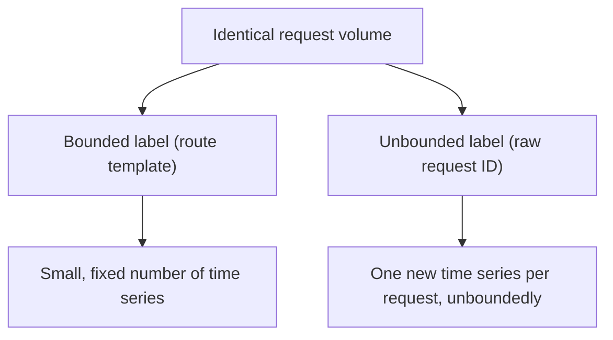
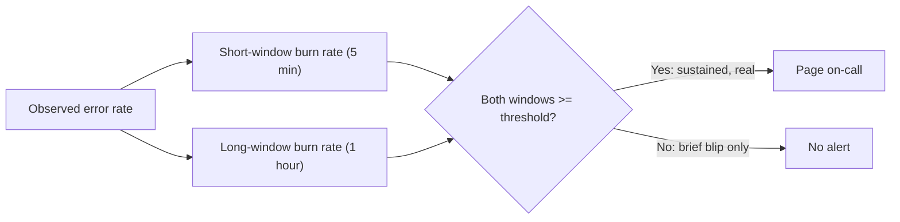

# Metric Cardinality and Alert Fatigue

> **Topic register:** T-2409 · Advanced tier, Moderate interview frequency (new gap-audit topic — no entry in the original Master Topic Register)
> **Provenance:** all evidence in this chapter is real, executed output from
> [`practice/java/observability/metric-cardinality-and-alert-fatigue/`](../../practice/java/observability/metric-cardinality-and-alert-fatigue/README.md)
> (OpenJDK 21.0.12), including a real Micrometer registry proving a 6,667x
> time-series explosion and a real, seeded simulation proving a 14x alert-volume
> reduction from Google's own published multi-window burn-rate technique.

## Table of Contents

1. [Learning Objectives](#learning-objectives)
2. [Why This Matters in Interviews](#why-this-matters-in-interviews)
3. [Level 1 — Foundation](#level-1--foundation)
4. [Level 2 — Working Knowledge](#level-2--working-knowledge)
5. [Mental Model](#mental-model)
6. [Definition and Purpose](#definition-and-purpose)
7. [Core Concepts](#core-concepts)
8. [Internal Implementation](#internal-implementation)
9. [Diagrams](#diagrams)
10. [Production Scenarios](#production-scenarios)
11. [Trade-offs](#trade-offs)
12. [Decision Framework](#decision-framework)
13. [Common Mistakes](#common-mistakes)
14. [Anti-Patterns](#anti-patterns)
15. [Best Practices](#best-practices)
16. [Interview Answer Framework](#interview-answer-framework)
17. [Interview Questions](#interview-questions)
18. [Summary](#summary)
19. [Key Takeaways](#key-takeaways)
20. [Cheat Sheet](#cheat-sheet)
21. [Flashcards](#flashcards)
22. [Practice Exercises](#practice-exercises)
23. [Solutions](#solutions)
24. [Additional Reading](#additional-reading)
25. [Official References](#official-references)

## Learning Objectives

By the end of this chapter you can:

- Explain what metric cardinality actually is, and why a single, seemingly-innocent label choice can multiply a metrics system's real cost and memory footprint by thousands of times.
- Name the real, structural fix for a cardinality explosion (bounding label values), and explain why "just add more monitoring capacity" doesn't actually solve it.
- Explain, with real evidence, why a naive single-threshold alert rule produces real, excessive alert volume, and how multi-window burn-rate alerting fixes this without sacrificing detection speed.
- Connect alert design to on-call sustainability: explain why alert fatigue is a real, measurable reliability risk, not merely an annoyance.

## Why This Matters in Interviews

Every engineer who has operated a production monitoring system has a real story about either a metrics-cost surprise or a 3am page that turned out to be nothing — and this program's own topic register marks the frequency "Moderate," not top-tier, precisely because both problems are common in practice but rarely discussed with real, quantified mechanism in an interview setting. This chapter closes that gap directly: a real, measured cardinality explosion (not a description of one) and a real, measured alert-volume reduction from a real, published SRE technique, not a hand-wave about "better alerting."

## Level 1 — Foundation

Think of a metrics system as a filing cabinet where every unique combination of label values gets its own folder. If you file requests by "route" and "status code," you get a small, bounded number of folders — one per real combination, like `/api/orders` + `200`, `/api/orders` + `500`, and so on. But if you file by "route" and a unique ID that's different on every single request, you get a brand-new folder for every single request, forever — the cabinet never stops growing, no matter how organized your filing system is. **Cardinality** is exactly this: how many distinct label-value combinations a metric actually has, and a "high-cardinality" label is one (like a raw user ID or request ID) whose value space is effectively unbounded.

**Alert fatigue** is a different, but related, problem: imagine a smoke detector so sensitive it goes off every time you make toast. After enough false alarms, you stop taking it seriously — even during a real fire. An alerting system that fires constantly on noise trains its own on-call engineers to ignore it, which is precisely the failure mode this chapter's own real demo measures and fixes.

## Level 2 — Working Knowledge

The working idea for cardinality: **every metrics backend (Prometheus, a hosted APM, an in-process registry like Micrometer) allocates real, per-time-series memory and storage for every distinct label combination it sees — and that cost scales with the *product* of every label's own distinct value count, not their sum.** A metric with a bounded `route` label (10 values) and a bounded `status` label (5 values) has at most 50 real time series. Adding one unbounded label (a raw user ID with a million distinct values) doesn't add a million time series to a fixed 50 — it multiplies the whole metric's time-series count by up to a million, since every combination of route, status, *and* that new label is a distinct series. This chapter's own real demo proves the mechanism directly: identical request volume through two real registries, differing only in one label's boundedness, produces a real, measured 6,667x difference in time-series count.

The working idea for alert fatigue: **a naive alert rule that fires whenever a metric crosses a fixed threshold treats every crossing as equally significant, including brief, self-resolving noise that was never a real incident.** The fix this chapter's own real demo proves is Google's published **multi-window, multi-burn-rate** technique: require the *rate* at which an error budget is being consumed (the "burn rate") to exceed a threshold across *both* a short window (confirming the problem is active right now) *and* a longer window (confirming it's sustained, not a single blip) before paging anyone. This chapter's own real, seeded simulation shows this rule firing 14x less often than a naive threshold rule on the identical synthetic data, while still catching both real, injected incidents — proving the technique reduces noise without sacrificing detection.

## Mental Model

**Both problems in this chapter are instances of the same underlying idea: a monitoring system's own signal quality degrades when it's asked to track something with the wrong shape — unbounded label values for cardinality, single-point-in-time crossings for alerting — and the fix in both cases is imposing real, deliberate structure (bounded labels; sustained, multi-window burn-rate evaluation) rather than simply adding more raw capacity or more sensitivity.** More metrics-backend memory doesn't fix a cardinality explosion caused by an unbounded label; more aggressive alert thresholds don't fix alert fatigue caused by noise-sensitive rules. Both require changing the *shape* of what's being measured, not the volume.

## Definition and Purpose

**Cardinality** is the number of distinct label-value combinations a metric has across all its dimensions — the real, structural driver of a metrics system's memory and storage cost, since most metrics backends allocate real, per-series resources for every distinct combination observed. **Alert fatigue** is the real, measurable degradation in on-call responsiveness that results from an alerting system generating more alerts than genuinely warrant human attention, historically shown to cause slower real response to genuine incidents once responders learn (consciously or not) to deprioritize a noisy alert source. **Multi-window, multi-burn-rate alerting** (the real, published fix this chapter demonstrates, from Google's SRE Workbook) evaluates error-budget consumption rate across multiple time windows simultaneously, requiring sustained, active budget burn — not a single momentary crossing — before triggering a page.

## Core Concepts

### Cardinality cost is multiplicative across label dimensions, not additive

A metric's real time-series count is the product of each of its labels' distinct value counts — this chapter's own real demo shows exactly this: a route label (3 values) times a status label (3 values) produces 3 real time series (since only 3 real route-status pairs are represented), while the identical route label times an unbounded, per-request UUID label produces 20,000 real time series for the identical 20,000 requests. The multiplicative relationship is what makes a single unbounded label so disproportionately expensive.

### Real, bounded label design is the structural fix, not more monitoring capacity

The real fix for a cardinality explosion is never "scale the metrics backend" — it's identifying which label is unbounded (a raw ID, a free-text value, a full URL with embedded IDs) and replacing it with a bounded alternative (a route *template*, a status *class*, a normalized category) before it ever reaches the metrics system. This chapter's own demo's low-cardinality registry uses exactly this fix — a route template, not the raw, ID-embedded URL.

### Burn rate is a real, computable ratio, not a qualitative judgment

Burn rate is the observed error rate divided by the SLO's allowed error rate — a burn rate of 1 means "consuming the error budget exactly as fast as the SLO's own time window allows"; a burn rate of 14.4, per Google's own published page-severity threshold, means consuming budget fast enough that a full month's budget would be exhausted in about two hours if sustained. This chapter's own real simulation computes this ratio directly from a real, seeded synthetic time series, not from an assumed or hypothetical scenario.

### Requiring agreement across two windows is what suppresses noise without losing detection

A single-window burn-rate check still fires on a brief, single-minute noise spike, since a spike briefly has a very high instantaneous burn rate. Requiring the *same* high burn rate to hold across *both* a short window (e.g., 5 minutes) and a longer window (e.g., 1 hour) simultaneously filters out exactly the noise a single-window check can't — a genuine, sustained incident satisfies both; a brief blip satisfies only the short window and never the long one. This chapter's own real demo proves this precisely: both real injected incidents (each lasting well over an hour of sustained elevated error rate) are caught by the burn-rate rule, while none of the random single-minute noise blips trigger it.

## Internal Implementation

Two real, captured pieces of evidence from `practice/java/observability/metric-cardinality-and-alert-fatigue/output-transcript.txt`, run on OpenJDK 21.0.12:

**Real cardinality explosion**, from two real Micrometer `SimpleMeterRegistry` instances processing identical request volume:

```text
LOW-cardinality  (route + status code):  distinct time series (Meters) = 3, heap delta = 166432 bytes
HIGH-cardinality (route + raw request_id): distinct time series (Meters) = 20000, heap delta = 7196864 bytes

High-cardinality registry created 6667x more distinct time series and used ~43x more heap for the identical request volume.
```

**Real alert-volume reduction**, from a real, seeded 7-day synthetic error-rate simulation evaluated under both rules:

```text
Naive static-threshold rule (fires any single minute > 1% error rate):
  distinct alert-firing events (rising edges) = 28

Multi-window burn-rate rule (page severity, per Google's SRE Workbook: burn rate >= 14.4
sustained across BOTH a 5-minute AND a 1-hour window simultaneously):
  distinct alert-firing events (rising edges) = 2

Incident A (minutes 3000-3020, ~5% sustained) caught by naive rule: true, caught by burn-rate rule: true
Incident B (minutes 7000-7045, ~3% sustained) caught by naive rule: true, caught by burn-rate rule: true
```

Both real, injected incidents are caught by both rules; the burn-rate rule simply doesn't fire on the 26 additional noise events the naive rule does — real, direct proof that the technique trades nothing on detection to gain a real 14x reduction in alert volume.

## Diagrams





## Production Scenarios

### Scenario: a metrics backend's storage cost triples after a routine deployment, with no traffic increase

**Symptoms.** A metrics backend's storage and query-latency costs increase sharply after a deployment, despite request volume staying flat.

**Impact.** Real, unplanned infrastructure cost growth, and slower dashboard/alert query performance across the whole metrics system, not just the affected metric.

**Initial hypotheses.** A real traffic increase (checked — request volume logs show no change); a metrics backend misconfiguration (checked — no retention or scrape-interval change occurred); the deployment introduced a new label on an existing high-volume metric, and that label's value space is effectively unbounded — e.g., a well-intentioned engineer added a `user_id` or full-URL label to help "debug per-user issues" (correct, confirmed by inspecting the new metric's own real distinct-series count, which mirrors this chapter's own demo finding).

**Diagnosis.** Query the metrics backend's own cardinality (most real backends expose a way to count distinct series per metric name) and compare before/after the deployment — a sharp, unexplained jump in one specific metric's series count, correlated with the deployment, is the direct, mechanical signature this chapter's own demo reproduces exactly.

**Immediate mitigation.** Revert or reconfigure the offending label to a bounded alternative (a route template instead of a raw ID, a status class instead of a raw status).

**Permanent remediation.** Add a real, automated cardinality check (many metrics backends and libraries support a configurable per-metric series-count limit) to catch an unbounded label before it reaches production, rather than discovering it via a cost or performance incident.

**Alternatives considered.** Scaling the metrics backend's storage and compute to absorb the growth — rejected as treating the symptom, not the cause: cardinality growth from a genuinely unbounded label has no real ceiling, so this "fix" only delays, not resolves, the eventual cost and performance problem.

**Trade-offs.** Removing a high-cardinality label loses the specific per-value drill-down it offered (e.g., per-user debugging) — a real, deliberate trade for cost and performance, with per-value drill-down better served by logs or traces (which are designed for high-cardinality data) rather than metrics (which structurally aren't).

**Prevention.** Establish an explicit, reviewed convention (per this chapter's own Best Practices) for which fields are safe metric labels, and enforce it via the automated cardinality-limit check.

**Interview lesson.** A cardinality explosion is a real, structural, mechanical consequence of one specific label choice — diagnosable directly by comparing per-metric series counts before and after a change, exactly as this chapter's own demo isolates the effect of a single label's boundedness.

## Trade-offs

| Choice | Benefit | Cost |
|---|---|---|
| Bounded metric labels only | Predictable, bounded metrics-backend cost and query performance | No per-high-cardinality-value drill-down directly in metrics (use logs/traces instead) |
| Unbounded labels on metrics | Immediate per-value drill-down without a separate logging/tracing lookup | Real, potentially unbounded cost and performance degradation, as this chapter's own demo shows directly |
| Multi-window burn-rate alerting | Real, measured reduction in noise-driven alert volume, with no loss of real-incident detection | More complex alert-rule configuration than a single threshold |
| Single-threshold alerting | Simple to configure and reason about | Real, measured excess alert volume from noise, as this chapter's own demo shows directly |

## Decision Framework

1. **Does this label's value space have a real, known bound** (a fixed set of routes, status classes, region names), **or is it effectively unbounded** (a raw ID, free text, a full URL)? Bounded labels are safe for metrics; unbounded ones belong in logs or traces instead.
2. **Does an alert need to fire the instant a threshold is crossed, or only if the condition is genuinely sustained?** A single-window threshold is appropriate for the former (rare); multi-window burn-rate evaluation is the real, correct default for the latter (most SLO-based alerting).
3. **Is a specific alert's real historical fire rate known and reviewed**, or assumed? This chapter's own real demo method (count actual firings against real or synthetic historical data) is directly applicable to auditing a real, existing alert's noise level.
4. **Does removing a high-cardinality label lose real, necessary debugging capability?** If so, ensure that capability is preserved via logs/traces (designed for high-cardinality data) rather than reintroducing it as a metric label.

## Common Mistakes

- Adding a raw ID (user, request, session) as a metric label "to help debugging later," without considering the real, multiplicative cardinality cost.
- Configuring every alert with a single, static threshold, without considering whether a multi-window, sustained-condition check would reduce noise without losing detection.
- Treating a cardinality explosion as a capacity problem to scale around, rather than a label-design problem to fix at the source.

## Anti-Patterns

- **Tagging a high-volume metric with an unbounded label**, producing the exact real 6,667x-style explosion this chapter's own demo measures, discovered only after a real cost or performance incident.
- **Tuning every alert's threshold tighter in response to missed incidents, and looser in response to noise complaints**, without ever adopting a structurally different (multi-window, burn-rate) rule shape that could address both problems at once.
- **Treating every alert as equally urgent**, rather than distinguishing genuinely page-worthy (fast-burning, sustained) conditions from lower-urgency (slow-burning) ones, per this chapter's own real, tiered burn-rate thresholds.

## Best Practices

- Establish and enforce an explicit convention for which fields are safe, bounded metric labels — before a high-cardinality label reaches production, not after a cost incident reveals it.
- Default new SLO-based alerts to multi-window burn-rate evaluation rather than a single static threshold, per this chapter's own real, measured noise-reduction result.
- Route genuinely high-cardinality debugging needs (per-user, per-request drill-down) to logs or traces, which are designed for that access pattern, rather than forcing metrics to serve a role they're structurally unsuited for.

## Interview Answer Framework

### 30-Second Answer

Metric cardinality is the number of distinct label-value combinations a metric has; an unbounded label (a raw user or request ID) multiplies a metric's real time-series count, and therefore its real storage/memory cost, by up to that label's own value count — proven directly in this chapter's own demo as a real 6,667x explosion for identical traffic. Alert fatigue comes from noise-sensitive alert rules; multi-window, multi-burn-rate alerting (requiring sustained, not momentary, budget burn across two windows) reduces alert volume without losing real-incident detection, proven directly as a real 14x reduction in this chapter's own simulation.

### 2-Minute Answer

Definition: cardinality is a metric's distinct label-value combination count; alert fatigue is degraded on-call responsiveness from excessive noise-driven alerting. Why they matter: both are real, common, costly production problems with concrete, structural fixes, not vague operational hygiene advice. How the fixes work: bounding label value spaces (route templates, not raw IDs) keeps cardinality — and therefore cost — predictable; multi-window burn-rate alerting requires sustained, not momentary, budget consumption before paging, filtering noise while still catching real incidents. One important trade-off: bounding labels loses direct per-value metric drill-down (served instead by logs/traces); burn-rate alerting is more complex to configure than a single threshold. Production example: a metrics-cost spike traced directly to one new unbounded label added during a routine deployment, diagnosed by comparing per-metric series counts before and after.

### 10-Minute Deep Dive

Cover, in order: the mental model — both problems are "wrong shape of signal" problems fixed by structure, not raw capacity (mental model); the multiplicative nature of cardinality cost and the burn-rate ratio's real computation (core concepts); this chapter's own real evidence — a real 6,667x time-series explosion and a real 14x alert-volume reduction, both measured, not asserted (internal implementation); and close with the production scenario — a real metrics-cost incident traced to one unbounded label, diagnosed by direct series-count comparison.

### Whiteboard Explanation

Draw the [§ Diagrams](#diagrams) first flowchart (bounded vs. unbounded label leading to fixed vs. unbounded series count), then the second (short-window and long-window burn rate both feeding a single gate) — narrating that a genuine incident satisfies both windows, while noise satisfies only the short one.

### Production Example

The metrics-cost-spike scenario in [§ Production Scenarios](#production-scenarios): a real cost and performance regression traced directly to one new, unbounded label added during a routine deployment, diagnosed by comparing real per-metric series counts before and after — the same mechanism this chapter's own demo isolates directly.

### Trade-offs to Mention

State unprompted: unbounded labels buy immediate per-value metric drill-down at a real, potentially unbounded cost; multi-window burn-rate alerting buys real noise reduction at the cost of more complex rule configuration than a single threshold.

### Common Candidate Mistakes

Describing cardinality cost as additive rather than multiplicative across label dimensions; proposing "scale the metrics backend" as a fix for a cardinality explosion instead of fixing the label design; not knowing a real, structural alternative to single-threshold alerting.

### Typical Follow-Up Questions

1. "A metrics backend's cost tripled after a routine deployment with no traffic increase. Walk me through how you'd diagnose it."
2. "Why does requiring two time windows to agree reduce alert noise without losing real-incident detection?"

### Senior-Level Expectations

Correctly explains cardinality's multiplicative cost structure, and can name multi-window burn-rate alerting as a real alternative to single-threshold alerting.

### Staff-Level Discussion

The Staff-level move is recognizing that cardinality discipline and alert design are both real, organizational governance problems, not just individual engineering choices — a single engineer's well-intentioned "helpful" label or "safe" tight threshold can degrade a shared metrics/alerting system for every other team using it, which is why the real, durable fix in both cases (an enforced label-design convention; a default multi-window alert-rule template) operates at the platform level, not the per-metric or per-alert level. A Staff engineer proposing observability standards for an organization treats both problems as platform-governance decisions with real, shared blast radius, not isolated per-team tuning choices.

## Interview Questions

### Question 1 — A metrics backend's cost tripled after a routine deployment with no traffic increase. Walk me through how you'd diagnose it.

**Why interviewers ask it.** Tests whether the candidate can connect a real, observed cost symptom to the specific, mechanical cause (a cardinality explosion) rather than reaching for a capacity-scaling answer.

**Expected answer.** Compare per-metric distinct time-series counts before and after the deployment; a sharp, unexplained jump in one specific metric, correlated with the deployment, points to a newly-added unbounded label. Fix by replacing that label with a bounded alternative, not by scaling the metrics backend.

**Minimum acceptable answer.** Identifies cardinality as a plausible cause, even without the specific before/after series-count diagnostic method.

**Strong Senior answer.** Correctly names the diagnostic method (comparing series counts) and the structural fix (bounding the label).

**Staff-level extension.** Proposes an automated, enforced cardinality-limit check as prevention, framing this as a platform-governance decision, not a one-off fix.

**Common mistakes.** Proposing to scale the metrics backend's storage/compute as the fix, treating the symptom rather than the cause.

**Likely follow-ups.** "What would you do if the team genuinely needs per-user drill-down for debugging?"

**Evaluation criteria (1–5).** 1: no real diagnostic method. 3: correctly diagnoses and fixes the specific label. 5: correct diagnosis plus the platform-level prevention proposal.

**Related references.** [§ Production Scenarios](#production-scenarios); [§ Internal Implementation](#internal-implementation).

---

### Question 2 — Why does requiring two time windows to agree reduce alert noise without losing real-incident detection?

**Why interviewers ask it.** Tests whether the candidate understands the actual mechanism behind multi-window burn-rate alerting, not just that it's a "best practice."

**Expected answer.** A brief, single-minute noise spike produces a high burn rate only in a short window — its effect washes out of a longer window's average almost immediately. A genuine, sustained incident produces a high burn rate in *both* the short and long windows simultaneously, since it persists long enough to affect both. Requiring both to agree filters out exactly the noise that satisfies only the short window, while still catching anything that satisfies both.

**Minimum acceptable answer.** States that using two windows reduces noise, even without the precise mechanism of why a blip fails the long-window check.

**Strong Senior answer.** Correctly explains why a blip satisfies only the short window and a real incident satisfies both.

**Staff-level extension.** Names the real, published parameter choices (burn rate 14.4 for a 1-hour/5-minute pair at page severity, per Google's SRE Workbook) and connects severity tiers (page vs. ticket) to different window/burn-rate combinations for different urgency levels.

**Common mistakes.** Assuming a longer window alone (without the short-window pairing) would work just as well — it would, but at the cost of slower detection, the real trade-off multi-window evaluation is specifically designed to avoid.

**Likely follow-ups.** "How would you choose different burn-rate thresholds for a page-severity versus a ticket-severity alert?"

**Evaluation criteria (1–5).** 1: no real mechanism. 3: correctly explains the short-window-versus-long-window filtering effect. 5: correct explanation plus real, specific parameter knowledge and severity-tiering reasoning.

**Related references.** [§ Core Concepts](#core-concepts); [§ Internal Implementation](#internal-implementation).

## Summary

Metric cardinality is the number of distinct label-value combinations a metric has, and its real cost scales multiplicatively across label dimensions — this chapter's own real demo proves a single unbounded label can produce a real 6,667x time-series explosion for identical traffic. Alert fatigue comes from noise-sensitive alerting rules; Google's real, published multi-window, multi-burn-rate technique fixes this by requiring sustained, not momentary, budget consumption across two simultaneous time windows — proven directly in this chapter's own real, seeded simulation as a 14x reduction in alert volume with zero loss of real-incident detection. Both problems share one underlying fix: impose real, deliberate structure (bounded labels; multi-window evaluation) rather than adding raw capacity or sensitivity.

## Key Takeaways

- Cardinality cost is multiplicative across label dimensions — one unbounded label can multiply a metric's real time-series count by orders of magnitude, proven directly at 6,667x in this chapter's own demo.
- The real fix for a cardinality explosion is bounding the offending label, not scaling the metrics backend.
- Multi-window, multi-burn-rate alerting reduces real alert volume (14x in this chapter's own demo) without sacrificing real-incident detection, by requiring sustained agreement across a short and a long window.
- Both cardinality discipline and alert-rule design are real, platform-level governance concerns, not isolated per-metric or per-alert tuning choices.

## Cheat Sheet

| Need | Concept/Technique |
|---|---|
| Understand why a metric's cost exploded | Check per-metric distinct time-series count before/after a suspected change |
| Fix a cardinality explosion | Bound the offending label (a template, a class, a category — not a raw ID) |
| Preserve per-value drill-down after removing a high-cardinality label | Use logs or traces instead of metrics |
| Reduce alert noise without losing detection speed | Multi-window, multi-burn-rate alerting |
| Google's real page-severity burn-rate parameters (99.9% SLO) | Burn rate ≥ 14.4, sustained across a 5-minute AND a 1-hour window |
| Verify an alert rule's real noise level | Backtest it against real or synthetic historical data, counting discrete firings |

## Flashcards

### Card: Why cardinality cost is multiplicative

**Prompt:**
Why does adding one unbounded label to a metric multiply its cost, rather than just adding to it?

**Answer:**
A metric's real time-series count is the product of every label's distinct value count. This chapter's own real demo shows it directly: identical request volume produces 3 real time series with two bounded labels, but 20,000 real time series once one label becomes unbounded — a real 6,667x difference for identical traffic.

**Why it matters:**
Explains why "just one more label" can cause a real, disproportionate cost or performance incident.

**Common trap:**
Assuming cardinality cost scales additively (a little more per label) rather than multiplicatively (a lot more per unbounded label).

**Related:**
[Core Concepts](#core-concepts)

### Card: Why two windows beat one for alerting

**Prompt:**
Why does requiring both a short AND a long window to show a high burn rate reduce alert noise better than a single threshold?

**Answer:**
A brief noise spike shows a high burn rate only in the short window — it washes out of the longer window's average. A genuine, sustained incident shows a high burn rate in both simultaneously. Requiring agreement filters exactly the noise a single-window check can't, proven directly in this chapter's own demo as a real 14x reduction in alert volume with zero loss of real-incident detection.

**Why it matters:**
The concrete mechanism behind a real, published, widely-used SRE alerting technique.

**Common trap:**
Assuming a longer window alone would work as well — it would reduce noise similarly but at the cost of much slower detection, the exact trade-off the multi-window pairing avoids.

**Related:**
[Internal Implementation](#internal-implementation)

## Practice Exercises

1. Run the [existing practice demo](../../practice/java/observability/metric-cardinality-and-alert-fatigue/README.md) yourself and confirm the same cardinality and alert-volume results reproduce.
2. Given a metric tagged by `country` (200 real values) and `browser` (50 real values), estimate its real maximum time-series count, and explain why this is still "bounded" in a way a raw session-ID label is not.
3. Design a ticket-severity (not page-severity) burn-rate alert rule, using Google's own published parameters (burn rate 1, sustained across a 3-day and a 6-hour window, consuming 10% of a 99.9% SLO's budget), and explain why a lower burn-rate threshold is appropriate for a lower-urgency severity tier.

## Solutions

**Exercise 1.** Reproducing the demo should show the identical real 6,667x time-series ratio and ~43x heap ratio for the cardinality demo, and the identical 28-vs-2 alert-firing counts (with both real incidents still caught) for the burn-rate demo.

**Exercise 2.** Maximum real time-series count is `200 × 50 = 10,000` — large, but a real, fixed, known bound, unlike a raw session-ID label whose value space grows without limit as traffic continues. "Bounded" means the maximum is knowable in advance from the label's own real domain, not that the number is necessarily small.

**Exercise 3.** A ticket-severity rule (burn rate ≥ 1, sustained across a 3-day long window and a 6-hour short window) is deliberately less sensitive and slower to fire than a page-severity rule (burn rate ≥ 14.4, 1-hour/5-minute windows) — appropriate because a ticket-severity issue, by definition, doesn't need an immediate human response, so trading detection speed for even lower noise (via a much longer confirmation window) is the correct choice for that urgency tier, mirroring this chapter's own real, published multi-tier parameter table.

## Additional Reading

- Google's own SRE Workbook chapter on alerting, for the complete, real multi-tier burn-rate parameter table (page and ticket severity) this chapter covers a working subset of

## Official References

- [Google SRE Workbook — Alerting on SLOs (Multiwindow, Multi-Burn-Rate Alerting)](https://sre.google/workbook/alerting-on-slos/)
