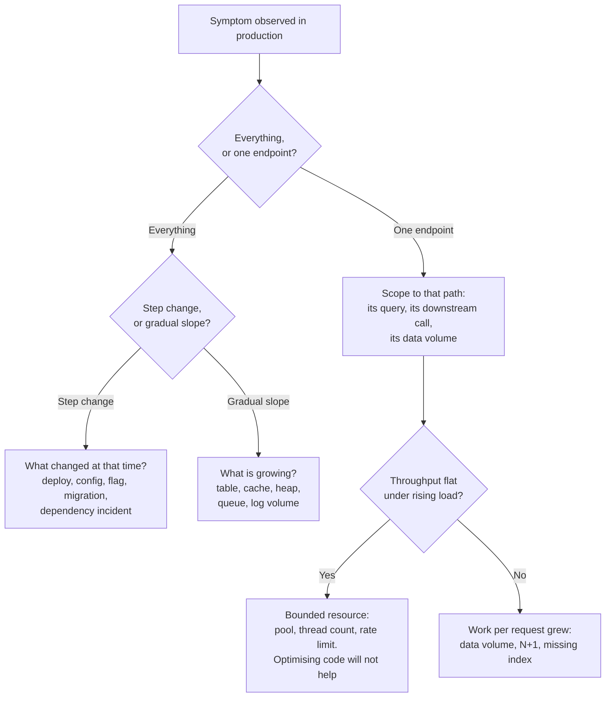
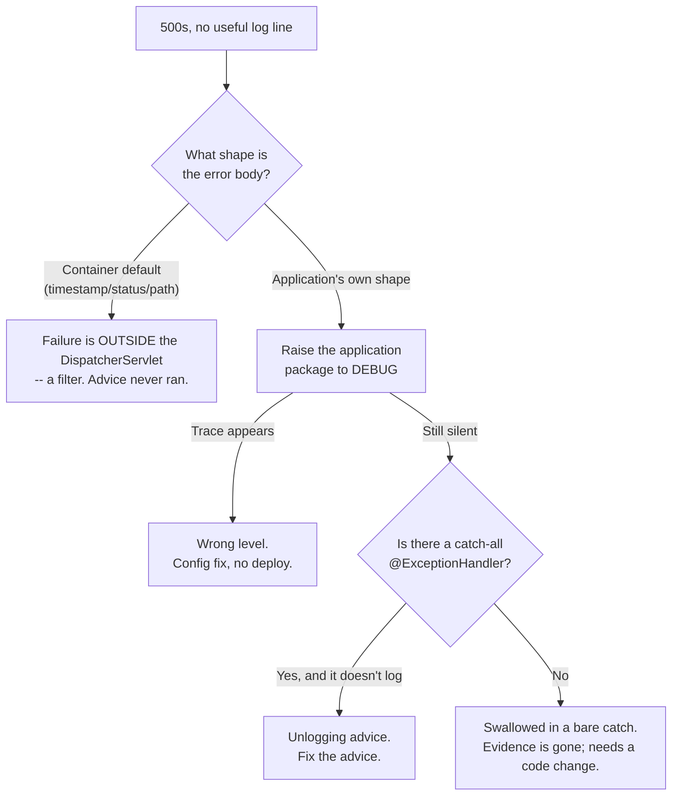

# Production Troubleshooting Methodology

> **Topic register:** T-2442 · Core tier · High interview frequency [H]
> **Provenance:** every number below is real, executed output from
> [`practice/java/observability/production-troubleshooting/`](../../practice/java/observability/production-troubleshooting/README.md)
> — a Spring Boot 3.5.16 app that returns HTTP 500 four different ways (three of
> them silent at the default log level), and a load-profile harness measuring
> the same code at four data volumes and five concurrency levels, on OpenJDK
> 21.0.12 with 10 cores.

## Table of Contents

1. [Learning Objectives](#learning-objectives)
2. [Why This Matters in Interviews](#why-this-matters-in-interviews)
3. [Level 1 — Foundation](#level-1-foundation)
4. [Level 2 — Working Knowledge](#level-2-working-knowledge)
5. [Mental Model](#mental-model)
6. [Definition and Purpose](#definition-and-purpose)
7. [Core Concepts](#core-concepts)
8. [Internal Implementation](#internal-implementation)
9. [Diagrams](#diagrams)
10. [Java Examples](#java-examples)
11. [Production Scenarios](#production-scenarios)
12. [Trade-offs](#trade-offs)
13. [Decision Framework](#decision-framework)
14. [Common Mistakes](#common-mistakes)
15. [Anti-Patterns](#anti-patterns)
16. [Best Practices](#best-practices)
17. [Interview Answer Framework](#interview-answer-framework)
18. [Interview Questions](#interview-questions)
19. [Summary](#summary)
20. [Key Takeaways](#key-takeaways)
21. [Cheat Sheet](#cheat-sheet)
22. [Flashcards](#flashcards)
23. [Practice Exercises](#practice-exercises)
24. [Solutions](#solutions)
25. [Additional Reading](#additional-reading)
26. [Official References](#official-references)

---

## Learning Objectives

By the end of this chapter you can:

- Turn an open-ended production symptom into a small, ordered set of candidate causes instead of a list of things you happen to know.
- Choose the next diagnostic step by which hypotheses it eliminates, not by which tool you are most comfortable with.
- Work the two hardest symptoms end to end: "slow in production, fine in development" and "500 errors with nothing in the logs."
- Explain why a dev environment is structurally incapable of revealing certain classes of bug, with measured evidence.
- Answer a scenario-style troubleshooting question in an interview with a method rather than a guess.

## Why This Matters in Interviews

Every other chapter in this repository is organised by *cause*: the N+1 problem, connection pool sizing, GC tuning, lock ordering. An interview question is organised by *symptom*. You are told "the API got slow" and asked what you would do — and the whole point of the question is that the cause is exactly what you do not yet know.

This is the single most common shape of senior-level technical question, and it is the one candidates prepare for least, because it cannot be studied by memorising more causes. A candidate who lists twelve possible reasons an application might be slow has demonstrated recall. A candidate who says "first I'd establish whether this is everything or one endpoint, because that splits the candidate list in half" has demonstrated the thing being tested.

Interviewers also use these questions because they are almost impossible to fake. A rehearsed answer runs out after the first follow-up, and the follow-up is always some version of "okay, you checked that and it looked normal — now what?"

## Level 1 — Foundation

When something breaks in production you have two kinds of information, and they are not equally useful.

The first is **what you can observe**: error rates, latency, log lines, the shape of the response a client received. This is evidence. It is true whether or not you understand it.

The second is **what you believe is happening**: "it's probably the database," "the cache must have gone cold." This is a hypothesis. It might be right, but believing it does not make it true, and the most common way debugging goes wrong is that someone starts *acting* on a hypothesis — restarting things, changing settings, adding indexes — before any evidence has distinguished it from four other equally plausible ones.

The method is therefore always the same shape:

1. **Describe the symptom precisely.** "The API is slow" is not precise. "The `GET /orders` endpoint's p99 went from 200 ms to 5 s at 14:20, while `GET /users` is unchanged" is.
2. **List the candidate causes that would produce exactly that symptom.** Not everything that could cause slowness — everything that could cause *this* slowness, on *this* endpoint, starting at *that* time.
3. **Pick the check that eliminates the most candidates**, not the one that confirms your favourite.
4. **Repeat** until one candidate is left.

Step 3 is the part that separates people. Checking a thing that would be consistent with six of your seven hypotheses teaches you almost nothing even when it succeeds.

## Level 2 — Working Knowledge

Three questions, asked in this order, eliminate most of the candidate space for almost any production symptom. They are cheap, they need no special tooling, and each one splits the remaining possibilities roughly in half.

**1. Is it everything, or one thing?** If every endpoint degraded simultaneously, the cause is shared: the JVM (GC, heap), the host (CPU, memory, disk), a shared pool (connections, threads), or a shared dependency. If one endpoint degraded and its neighbours did not, the cause is in that endpoint's specific path — its query, its downstream call, its data.

**2. Did it change, or was it always like this?** A step change at a specific time points at a discrete event: a deploy, a config change, a feature flag, a data migration, a dependency's own incident. A gradual slope over days or weeks points at something growing: a table, a cache, a heap, a log directory, a queue.

**3. What changed around that time?** If the answer to (2) was "it changed at 14:20," this is the highest-yield question in all of production debugging, and it is frequently answered by a deploy pipeline rather than by any observability tool.

Only after those three does it make sense to reach for a profiler, a heap dump, or a thread dump. Those tools answer "what exactly," and they are expensive and slow to interpret; the three questions above answer "where," and narrowing the where is what makes the what tractable.

## Mental Model

Think of it as **a doctor, not a mechanic**.

A mechanic who is told "it makes a noise" can open the hood and look at everything, because the whole system is in front of them and it will hold still. A doctor cannot open the patient to browse. They work from symptoms to a differential diagnosis — a ranked list of conditions consistent with what is observed — and then order the test that best discriminates between the top candidates. A test that comes back normal is not a wasted test if it eliminated three conditions.

Production is the patient. The system will not hold still, you cannot look at all of it, and the expensive tests (heap dump, profiler, thread dump) are the invasive ones you order once the differential is short enough to justify them.

The model also predicts the classic failure: a clinician with one favourite diagnosis orders only the test that confirms it, and when it comes back normal, orders it again.

## Definition and Purpose

**Production troubleshooting methodology** is the discipline of converting an observed symptom into a ranked list of candidate causes, and then choosing diagnostic actions by their discriminating power rather than by familiarity.

It exists because production systems have three properties that make ad-hoc debugging fail: you cannot reproduce the conditions on demand, the expensive diagnostics perturb the system you are measuring, and the pressure to *do something* actively rewards acting before understanding. A method is what keeps those three from compounding.

It is distinct from [Incident Response and Blameless Postmortems](incident-response-and-blameless-postmortems.md), which owns the organisational process — roles, comms, severity, the write-up afterwards. This chapter owns the technical reasoning inside that process.

## Core Concepts

### A dev environment is structurally incapable of revealing some bugs

"It works on my machine" is usually treated as a joke about configuration drift. The more important version is not about configuration at all: some bugs are *invisible at development scale by construction*, and no amount of care in dev will surface them.

Measured directly. The same two implementations of one endpoint — one with an N+1 access pattern, one batched — at four data volumes:

```text
rows            naive (N+1)          batched      ratio
10                  2809 us           510 us         6x
100                25798 us           512 us        50x
1000              255640 us           514 us       497x
5000             1283121 us           507 us      2531x
```

At 10 rows — a normal seed dataset — the two are 2.8 ms and 0.5 ms. Both are instant. No developer notices, no test fails, no code review flags it, because at that size there is nothing to notice. At 5,000 rows the identical code takes **1.28 seconds**.

The reason this is structural rather than careless is that the two implementations have **different curves**, not different constants. The naive one is linear in row count; the batched one is flat. A dev dataset sits at the one point on those curves where they look alike. Buying a faster machine moves both curves down and changes nothing about the gap.

The practical consequence for troubleshooting: when a symptom is "fine in dev, slow in prod," the first hypothesis class is not "the production machine is worse." It is "something in production is larger" — data volume, concurrency, cardinality, or request rate — and the question becomes *which*.

### Throughput ceilings and latency are different symptoms of the same bounded resource

The second reason identical code behaves differently in production is concurrency. Measured on the same harness, with a pool of 10 and five round trips per request:

```text
concurrency           p50          p95          p99     throughput
1                    1 ms         1 ms         1 ms      668 req/s
5                    1 ms         1 ms         1 ms     3857 req/s
10                   1 ms         1 ms         1 ms     7623 req/s
50                   1 ms        23 ms        36 ms     7345 req/s
200                  1 ms       140 ms       152 ms     7538 req/s
```

Two things happen at once past the pool size, and recognising them as one phenomenon is the skill.

**Throughput stops climbing.** It plateaus around 7,600 req/s from concurrency 10 onward and is no better at 200. Once you see a flat throughput line under rising load, "optimise the code" is the wrong fix — the code is not what is limiting. Adding more application instances behind the *same* pool would not help either.

**The median never moves.** p50 is 1 ms at every concurrency level including 200, while p99 climbs from 1 ms to **152 ms**. The extra time is entirely queueing, distributed unevenly because the semaphore is unfair and some waiters get overtaken repeatedly. A dashboard showing average or median latency reports this system as perfectly healthy while one request in a hundred takes 152 times longer than the rest.

That last point is why "check the average latency" is a near-useless diagnostic step, and it is the measured version of the argument in [Percentiles, Tail Latency, and Coordinated Omission](percentiles-tail-latency-and-coordinated-omission.md).

### "Nothing in the logs" is a symptom with distinguishable causes

The instinct on hearing "we return 500s and there's nothing in the logs" is that the logging is broken. Usually it is not. Four endpoints, measured, all returning byte-identical responses to the client:

```text
$ curl -s -w " <- HTTP %{http_code}\n" http://localhost:8080/silent/swallowed
{"error":"internal error"} <- HTTP 500
$ curl -s -w " <- HTTP %{http_code}\n" http://localhost:8080/silent/wrong-level
{"error":"internal error"} <- HTTP 500
$ curl -s -w " <- HTTP %{http_code}\n" http://localhost:8080/silent/unlogged-advice
{"error":"internal error"} <- HTTP 500
$ curl -s -w " <- HTTP %{http_code}\n" http://localhost:8080/visible/logged
{"error":"internal error"} <- HTTP 500
```

They fail for three genuinely different reasons, with three different fixes and — critically — three different answers to "can we recover the evidence without a deploy?"

| Cause | Mechanism | Evidence recoverable? |
|---|---|---|
| Swallowed | `catch (Exception ignored) {}` | **No.** Never written anywhere. Needs a code change. |
| Wrong level | Logged at `DEBUG`, production runs at `INFO` | **Yes, cheaply.** A config change, often without a deploy. |
| Unlogged advice | A catch-all `@ExceptionHandler` standardises the response and logs nothing | **Yes**, but needs a change to the advice. |

And the discriminating step is a log-level change. Re-running the identical build with the application package at `DEBUG` recovered the second cause and **only** the second:

```text
DEBUG demo.SilentFailureController : payment step failed
java.lang.IllegalStateException: payment tokenisation rejected: expired merchant key
```

`/silent/swallowed` and `/silent/unlogged-advice` stayed silent. That is what makes raising the log level a *diagnostic step* rather than a hopeful guess: it does not just produce more output, it partitions the hypothesis space. Output appears → wrong-level. Nothing appears → the exception is being destroyed, not merely unprinted, and you are now looking for either a bare `catch` or an unlogging handler.

Note also which layer is reachable at all. An exception thrown in a servlet filter never reaches `@ControllerAdvice` and produces the container's error body instead — a fourth cause with a visibly different response shape, covered in [Request Filters, Interceptors, and the Servlet Chain](../05-spring/request-filters-interceptors-and-the-servlet-chain.md). Reading the *shape* of the error body is therefore a free first check.

### An unconditional access log converts an unbounded problem into a bounded one

In the measured run, the only proof that three of the four failures occurred at all was a filter that logs every request and its status regardless of what the application code did:

```text
INFO access : method=GET uri=/silent/swallowed status=500 duration_ms=23 escaped_exception=none
INFO access : method=GET uri=/silent/wrong-level status=500 duration_ms=1 escaped_exception=none
INFO access : method=GET uri=/silent/unlogged-advice status=500 duration_ms=2 escaped_exception=none
```

This does not tell you *why* anything failed. It tells you that it failed, on which route, and how often — which converts "we think something is wrong somewhere" into "this specific route returns 500 at this rate," and that is the difference between a search and an investigation.

One honest detail from the same transcript: every line records `escaped_exception=none`, including the failing ones. None of those exceptions escaped the `DispatcherServlet` — each was converted to a 500 inside it. A filter only sees what escapes it, which is exactly why the filter must record the **status** and not rely on catching a throwable.

## Internal Implementation

The tools that answer "what exactly," and what each one actually costs:

**Thread dump** (`jcmd <pid> Thread.print`, or `jstack`). Prints every thread's stack. Answers "what is the application doing right now" and is the correct first tool for a hang, a deadlock, or a thread-pool exhaustion. Deadlocks are reported explicitly by the JVM, with the lock cycle named. Taking one requires a safepoint, which briefly pauses the application — normally negligible, but see `production-cookbook/jstack-triggered-safepoint-pause-misdiagnosed-via-gc-logs.md` for a real case where the diagnostic was mistaken for the problem.

**Heap histogram** (`jcmd <pid> GC.class_histogram`). Object counts and bytes by class. Far cheaper than a full dump and often enough to identify a leak's retained type. The right first step for suspected memory growth.

**Heap dump** (`jcmd <pid> GC.heap_dump`, or `-XX:+HeapDumpOnOutOfMemoryError`). A complete snapshot. Expensive: it pauses the application for the duration and produces a file the size of the heap. Necessary for finding *what retains* the leaking objects, which a histogram cannot tell you. See [Memory Leak Diagnosis and Heap Dump Analysis](../02-java/jvm-internals/memory-leak-diagnosis-and-heap-dump-analysis.md).

**GC logs** (`-Xlog:gc*`). Always worth enabling in production; the overhead is small and the data is otherwise unrecoverable after the fact. Distinguishes "slow because of GC pauses" from "slow for some other reason" immediately, which is a high-value split early in a latency investigation.

**Continuous profiling** (JFR, async-profiler). Answers "where is time actually going" with a flame graph. See [Profiling with JFR and Flame Graphs](../16-performance-jvm/profiling-jfr-and-flame-graphs.md). JFR's default profile is designed to be safe to leave on in production.

**Distributed tracing.** For a latency problem spanning services, this is the only tool that answers "which hop" without correlated guessing across several dashboards. See [Logging, Metrics, Tracing, and OpenTelemetry](logging-metrics-tracing-and-opentelemetry.md).

The ordering principle: use the cheap, always-available signals (access logs, metrics, GC logs, traces) to narrow the where; use the expensive, perturbing ones (heap dump, profiler) once the where is narrow enough that you know what you are looking at.

## Diagrams

The triage order, as a decision tree:



The "nothing in the logs" partition:



## Java Examples

The unconditional access log — the smallest change that makes an invisible failure visible:

```java
// Java 21, Spring Boot 3.5.x
class AccessLogFilter extends OncePerRequestFilter {

    private static final Logger log = LoggerFactory.getLogger("access");

    @Override
    protected void doFilterInternal(HttpServletRequest request, HttpServletResponse response,
                                    FilterChain chain) throws ServletException, IOException {
        long start = System.nanoTime();
        try {
            chain.doFilter(request, response);
            emit(request, response.getStatus(), start, null);
        } catch (Exception ex) {
            // Record the throwable here rather than inferring failure from the
            // status: a container-generated error sets the status AFTER this
            // frame has unwound, so the status read here would still be 200.
            emit(request, 500, start, ex);
            throw ex;
        }
    }

    private void emit(HttpServletRequest request, int status, long startNanos, Exception ex) {
        log.info("method={} uri={} status={} duration_ms={} escaped_exception={}",
                request.getMethod(), request.getRequestURI(), status,
                (System.nanoTime() - startNanos) / 1_000_000,
                ex == null ? "none" : ex.getClass().getSimpleName());
    }
}
```

The catch-all advice, in the form that causes the symptom and the form that does not:

```java
@RestControllerAdvice
class ErrorAdvice {

    private static final Logger log = LoggerFactory.getLogger(ErrorAdvice.class);

    // WRONG: standardises the response and destroys the diagnostic trail.
    // @ExceptionHandler(Exception.class)
    // ResponseEntity<Map<String, String>> handle(Exception ex) {
    //     return ResponseEntity.status(500).body(Map.of("error", "internal error"));
    // }

    // RIGHT: the client still learns nothing useful; the operator learns everything.
    @ExceptionHandler(Exception.class)
    ResponseEntity<Map<String, String>> handle(Exception ex) {
        log.error("unhandled exception reached the catch-all advice", ex);
        return ResponseEntity.status(500).body(Map.of("error", "internal error"));
    }
}
```

The two goals people believe are in tension — not leaking internals to clients, and keeping the stack trace — are not in tension at all. They are two different destinations for two different pieces of information.

Commands worth knowing by heart, because you will be asked to name them:

```bash
jcmd <pid> Thread.print                 # thread dump: hangs, deadlocks, pool exhaustion
jcmd <pid> GC.class_histogram           # cheap: what types dominate the heap
jcmd <pid> GC.heap_dump /tmp/heap.hprof # expensive: what RETAINS them
jcmd <pid> VM.native_memory summary     # off-heap growth invisible to heap tooling
jcmd <pid> JFR.start duration=60s filename=/tmp/rec.jfr   # where time goes

kubectl logs <pod> --previous           # the crashed container's output, not the new one
kubectl describe pod <pod>              # Events and Last State -- usually the real answer
```

## Production Scenarios

### Scenario: an endpoint's p99 goes from 200 ms to 5 s with no deploy

**Symptoms.** `GET /orders` p99 moved from ~200 ms to ~5 s over roughly twenty minutes, starting at 14:20. Error rate unchanged. Other endpoints unaffected. No deploy that day.

**Initial hypotheses.** A slow downstream dependency; a database problem; GC pauses; a cache that went cold; increased traffic.

**Evidence collected, in discriminating order.** *Is it everything or one thing?* One endpoint — which immediately eliminates GC, host CPU, and anything else shared, because those would degrade `GET /users` identically. *Did it change or was it always?* A step change at 14:20, which points at a discrete event rather than gradual growth. *What changed at 14:20?* No deploy, but a marketing campaign went live, and request volume on that one endpoint tripled. *Is throughput flat?* Yes — requests per second plateaued despite the offered load continuing to rise. *What do the percentiles look like?* p50 essentially unchanged; p95 and p99 badly degraded.

**Diagnosis.** A bounded resource, not slow code. The flat throughput line plus an unmoved median is the exact signature measured in [Core Concepts](#core-concepts): past the pool size, additional load becomes queueing, and queueing lands on the tail rather than the middle. The connection pool was sized for the pre-campaign traffic.

**Immediate mitigation.** Raise the pool size to the measured saturation point, while checking the database's own connection limit so the fix does not simply relocate the exhaustion. Note that this is mitigation: it moves the ceiling, it does not remove it.

**Permanent remediation.** Size the pool from measured concurrency with headroom, per [Connection Pooling and Sizing](../06-databases/connection-pooling-and-sizing.md), and alert on pool-wait time rather than on pool size. Pool-wait time is the signal that goes bad *before* user-visible latency does.

**Trade-offs.** A bigger pool is not free — each connection costs memory on the database side, and an oversized pool can make things worse under CPU saturation rather than better (`production-cookbook/doubling-the-connection-pool-made-latency-worse-under-cpu-saturation.md` is exactly this case). The real fix is often to reduce time *held* per request rather than to raise the count.

**Prevention.** Alert on p99, not on the average — the measured data shows the median is blind to this entire failure mode. Load-test to saturation rather than to the expected peak, so the ceiling is a known number rather than a discovery.

**Interview lessons.** The whole answer is reconstructible from the three triage questions plus one percentile check, without naming a single tool. That is the shape an interviewer is listening for.

### Scenario: an endpoint returns 500s and no stack trace exists anywhere

**Symptoms.** Support reports intermittent failures on checkout. The client receives `{"error":"internal error"}` with HTTP 500. A search of the application logs for the affected time window returns no `ERROR` lines at all.

**Initial hypotheses.** The log shipper is dropping records; the logging configuration is wrong; the failure is in a different service; the exception is being swallowed.

**Evidence collected.** First, the free check: the error body has the *application's* shape, not the container's `timestamp`/`status`/`path` shape — so the failure is inside the `DispatcherServlet`, and a filter-level failure is eliminated. Second, the access log shows the requests arriving and returning 500, which eliminates both "log shipping is broken" (these lines arrived) and "it is a different service" (this service produced the status). Third, the application package is raised to `DEBUG` in the affected environment; the failures continue and still produce no trace.

**Diagnosis.** The measured partition applies directly. Output at `DEBUG` would have meant a level problem; silence means the exception is being destroyed rather than merely unprinted. A code search for the route's call path finds a catch-all `@ExceptionHandler` that maps every exception to a standard 500 body and logs nothing — added months earlier, in good faith, to stop stack traces leaking to clients.

**Immediate mitigation.** Add an `ERROR` log with the throwable to the catch-all handler and deploy. This does not fix the failure; it makes the failure diagnosable, which is the actual blocker.

**Permanent remediation.** Treat "an unhandled exception reached the catch-all" as an alertable event in its own right, with a metric, since by definition it is a case nobody anticipated. Add a lint or review rule against bare `catch` blocks that neither log nor rethrow.

**Trade-offs.** Logging every exception that reaches a catch-all can be noisy for expected-but-unhandled cases such as client disconnects, and noise is its own failure mode — see [Metric Cardinality and Alert Fatigue](metric-cardinality-and-alert-fatigue.md). The answer is to handle the expected cases explicitly at a lower level, not to make the catch-all quieter.

**Prevention.** An unconditional access log means this symptom can never again be "we don't know if anything is happening." It is the cheapest possible insurance against a whole class of investigation.

**Interview lessons.** The strong answer never says "I'd check the logging config." It says the symptom has three causes that a single log-level change tells apart, and names which of them can be recovered without a deploy — which is what an on-call engineer actually needs to know first.

## Trade-offs

| Diagnostic | Cost | Answers | When it is the wrong first step |
|---|---|---|---|
| Access log / metrics | Free (already on) | Is it happening, where, how often | Never — this is always first |
| GC logs | Very low | Is the JVM pausing | When one endpoint is affected and others are not |
| Thread dump | Brief safepoint pause | What threads are doing *now* | For a gradual leak — it shows a moment, not a trend |
| Heap histogram | Low | Which types dominate | When the problem is latency, not memory |
| Heap dump | Pauses the app; file the size of the heap | What *retains* the leaking objects | Before a histogram has narrowed the type |
| Profiler / JFR | Low with defaults | Where time actually goes | Before you know which endpoint or service |
| Distributed tracing | Sampling overhead | Which hop is slow | For a single-service problem |

The general shape: cheap and always-on narrows the *where*; expensive and perturbing identifies the *what*. Reaching for the second before the first is the most common way an investigation becomes a long one.

## Decision Framework

1. **Write the symptom down precisely** — which endpoint, which metric, which percentile, starting when. If you cannot, the first task is to find out, not to start hypothesising.
2. **Everything or one thing?** Shared cause versus scoped cause. This is the highest-yield single question.
3. **Step change or gradual slope?** Discrete event versus something growing.
4. **What changed at that time?** Deploys, config, flags, migrations, dependency incidents, traffic. Usually answered by the deploy pipeline, not by observability tooling.
5. **For latency: is throughput flat under rising load?** Flat means a bounded resource and optimising the code will not help. Rising means work per request grew.
6. **For latency: check percentiles, not the average.** The measured data shows a system whose p50 is unchanged while p99 is 152x worse.
7. **Only now reach for the expensive tools**, and pick the one that discriminates between your top two hypotheses.
8. **If the fix is not obvious, make it observable first.** Shipping a log line or a metric is a legitimate and often optimal next step when the evidence does not exist yet.

## Common Mistakes

- Starting with a tool instead of a hypothesis — taking a heap dump for a latency problem because heap dumps are the thing you know how to read.
- Checking the average latency. The measured data has a median that never moves through a 152x tail regression.
- Treating "nothing in the logs" as a logging-infrastructure problem without first checking whether the requests appear in the access log at all.
- Acting on the first plausible hypothesis — restarting, resizing, adding an index — before any evidence has distinguished it from the alternatives.
- Concluding "the production machine is slower" when the real difference is data volume or concurrency, both of which have measured, structural effects that a faster machine does not touch.
- Reproducing in dev, failing to reproduce, and concluding the report is wrong. Some bugs are invisible at dev scale by construction.
- Forgetting `kubectl logs --previous` after a container restart and reading the *new* container's empty log.
- Changing more than one thing at a time during an investigation, which destroys the ability to attribute any improvement.

## Anti-Patterns

- **Restart-first debugging.** Restarting frequently clears the symptom and always destroys the evidence — the heap, the thread state, the in-memory queue. If a restart is operationally necessary, capture a thread dump and a heap histogram first; they take seconds.
- **The one-hypothesis investigation.** Repeatedly testing a favourite theory, and when the check comes back clean, testing it again in a slightly different way.
- **Dashboard tourism.** Opening every dashboard and scanning for something that looks unusual, rather than asking a specific question whose answer eliminates candidates.
- **Silent catch-all handlers.** A `@ControllerAdvice` that standardises responses and logs nothing converts every unanticipated failure into an uninvestigable one.
- **Alerting only on user-visible symptoms.** By the time p99 is bad, the pool has already been saturated for a while. Pool-wait time, queue depth, and error-budget burn are all earlier.

## Best Practices

- Log every request and its status unconditionally, in a filter, independent of application error handling.
- Propagate a correlation ID so a single user's failing request can be followed across services — see [Structured Logging, Correlation IDs, and Log Hygiene](structured-logging-correlation-ids-and-log-hygiene.md).
- Never write a `catch` block that neither logs nor rethrows. If an exception is genuinely expected and ignorable, say so in a comment and log it at `DEBUG` with the reason.
- Always log the throwable at the catch-all, and alert on it reaching there at all.
- Enable GC logging and JFR's default profile in production. Both are cheap and both are unrecoverable after the fact.
- Alert on p99 and on leading indicators (pool-wait, queue depth), not on averages.
- Load-test to the saturation point, not to the expected peak, so the ceiling is a known number.
- Seed a realistic data volume in at least one pre-production environment, since a 10-row dataset provably cannot reveal a 2531x regression.
- Change one thing at a time, and write down what you changed and when.

## Interview Answer Framework

### 30-Second Answer

I would establish three things before touching a tool: whether it affects everything or one endpoint, whether it was a step change or a gradual slope, and what changed around that time. Those three answers eliminate most causes — a shared cause looks different from a scoped one, and a deploy looks different from a table that has been growing for a month. Only then would I pick a diagnostic, and I would pick the one that best separates my top two hypotheses rather than the one I am most comfortable with.

### 2-Minute Answer

Add the specific splits and what they mean. Everything degraded at once points at the JVM, the host, or a shared pool; one endpoint points at that endpoint's own path. A step change points at a discrete event; a slope points at something growing.

For a latency problem specifically, add the two checks that are worth more than any tool: is throughput flat under rising load — which means a bounded resource, and means optimising the code will not help — and what do the percentiles say rather than the average. Mention that a measured system can hold a 1 ms median through a 152 ms p99, so an average-latency dashboard reports it as healthy.

Close with the honest bit: if the evidence does not exist yet, shipping a log line or a metric is a legitimate next step, not a failure to diagnose.

### 10-Minute Deep Dive

Cover, in order:

1. Evidence versus hypothesis, and why acting before discriminating is the common failure.
2. The three triage questions and what each one eliminates.
3. The two structural reasons dev cannot reveal some bugs — data volume and concurrency — with the measured curves.
4. Flat throughput as the signature of a bounded resource.
5. Percentiles versus averages, with the measured p50/p99 divergence.
6. The "nothing in the logs" partition and why a log-level change is a *discriminating* step.
7. Tool costs and the cheap-narrows-where, expensive-identifies-what ordering.
8. When making it observable is the correct next action.

### Whiteboard Explanation

Draw the triage tree: one box at the top for the symptom, then the everything/one-thing split, then step-change/slope under it. Narrate that each split halves the candidate list. Then, to the side, draw two curves against data volume — one flat, one rising — and mark where the dev dataset sits, on the part where they overlap. That single picture answers "why didn't we catch this in dev" better than any list.

### Production Example

Use the p99 scenario above. It is concrete, it needs no tool names, and the reasoning — flat throughput plus an unmoved median equals queueing on a bounded resource — is the part that demonstrates method rather than recall.

### Trade-offs to Mention

Every expensive diagnostic perturbs the system being measured; a heap dump pauses the application, and a thread dump requires a safepoint. Restarting clears symptoms and destroys evidence simultaneously. Raising a pool size relocates a bottleneck as often as it removes one.

### Common Candidate Mistakes

Listing causes instead of describing a method. Naming a tool as the first step. Saying "check the logs" without saying what you expect to find or what its absence would mean. Not distinguishing average from tail latency.

### Senior-Level Expectations

Discriminating checks rather than confirming ones. Knows what a flat throughput line means. Knows that a dev environment cannot reveal certain bugs and can say why structurally. Treats "make it observable" as a legitimate step.

### Staff-Level Discussion

Frame the recurring version of these symptoms as a platform problem rather than a debugging problem. If three teams have each independently hit "500s with no stack trace," the defect is not in three codebases; it is that the default service template permits a silent catch-all. The Staff-level move is to make the correct behaviour the default — an access-log filter, correlation-ID propagation, and a logged catch-all in the shared starter — so that the absence of observability becomes a deliberate choice someone has to make, rather than the path of least resistance.

The same argument applies to the dev-versus-prod gap. "Seed realistic data volumes" as advice to individual engineers will decay; a pre-production environment with production-scale row counts is infrastructure, and it either exists or it does not. The measured 2531x regression is the argument for funding it: the cost of the environment is bounded and known, and the cost of discovering that class of bug in production is neither.

Worth naming explicitly as a risk: a methodology can itself become ritual. The three triage questions are valuable because they discriminate, not because they are a checklist, and an engineer who works through them on a symptom that obviously points elsewhere is performing the method rather than using it.

## Interview Questions

### Question 1 — Your Java application is fine in development but extremely slow in production. How would you find the actual root cause?

**Why interviewers ask it.** It is deliberately unbounded. There is no fact that answers it, so the answer necessarily reveals whether the candidate has a method.

**Expected answer.** Start by narrowing, not by tooling. Is every endpoint slow or one — shared cause versus scoped cause. Was it a step change or a gradual slope — discrete event versus something growing. What changed around then. For a latency problem, two further checks are worth more than any profiler: whether throughput is flat under rising load, which indicates a bounded resource rather than slow code, and what the percentiles say rather than the average. Only then reach for GC logs, a profiler, or a thread dump, chosen to separate the top two hypotheses.

Crucially, "production is slower" is usually the wrong frame. The two structural differences are **data volume** and **concurrency**, and both have effects a faster machine does not fix: identical code with an N+1 pattern measured 2.8 ms at 10 rows and **1.28 s at 5,000** — a 2531x gap — because the two implementations have different curves, and the dev dataset sits where they overlap.

**Minimum acceptable answer.** Names several plausible causes (GC, database, N+1, pool exhaustion) without an ordering principle.

**Strong Senior answer.** The expected answer, with each check justified by what it eliminates rather than what it might confirm, and with the dev-scale-invisibility point made structurally rather than as "we should test with more data."

**Staff-level extension.** Treats a production-scale pre-production environment as infrastructure to be funded rather than discipline to be exhorted, and uses the measured regression as the cost argument. Also raises that a methodology can decay into ritual if applied without regard to what it discriminates.

**Common mistakes.** Opening with a tool. Assuming the production hardware is the difference. Proposing to reproduce in dev, failing, and concluding the report is wrong.

**Likely follow-ups.** "You checked GC and it's fine — now what?" "How would you tell a slow query from a slow downstream call?" "Throughput is flat as you add load. What does that tell you?" (A bounded resource; optimising the code will not help, and neither will more application instances behind the same pool.)

**Evaluation criteria (1–5).** 1: a list of causes. 3: a sensible order of checks. 5: checks chosen for discriminating power, plus the structural explanation of why dev could not have caught it.

### Question 2 — Your Spring Boot application returns 500s, but the logs show no obvious exception. Walk me through your troubleshooting approach.

**Why interviewers ask it.** The naive reading is "logging is broken," which is usually wrong, and the question rewards anyone who knows the symptom has distinguishable causes.

**Expected answer.** Three causes produce byte-identical 500 responses, and they differ in whether the evidence can be recovered without a deploy: the exception was **swallowed** in a bare `catch` (gone permanently — needs a code change); it was logged at a level production does not emit (**recoverable by config alone**); or a catch-all `@ExceptionHandler` standardised the response and logged nothing (needs a change to the advice).

The discriminating step is a log-level change, because it *partitions* rather than merely producing more output — verified directly: raising the application package to `DEBUG` recovered the wrong-level case and only that one, leaving the other two silent. Before even that, reading the **shape** of the error body is free: a container-default body (`timestamp`/`status`/`error`/`path`) means the failure happened outside the `DispatcherServlet`, in a filter, where `@ControllerAdvice` never runs at all.

**Minimum acceptable answer.** Suspects a swallowed exception somewhere and proposes searching for empty `catch` blocks.

**Strong Senior answer.** The above, plus the observation that an unconditional access-log filter is what turns this from "we don't know if anything is happening" into "this route returns 500 at this rate" — and that it should exist before the incident, not be added during it.

**Staff-level extension.** Argues that three teams hitting this symptom independently is a platform defect, not three codebases' defect, and that the fix is a service template whose default catch-all logs and whose access-log filter is not optional.

**Common mistakes.** Blaming the log shipper first. Proposing to add logging everywhere rather than partitioning the hypotheses. Not distinguishing "unprinted" from "destroyed," which is the difference between a config fix and a deploy.

**Likely follow-ups.** "You raised the level and still nothing. What now?" "How would you know the requests are even reaching this service?" "What stops this from happening again?"

**Evaluation criteria (1–5).** 1: "check the logging config." 3: identifies a swallowed exception as a candidate. 5: names all three causes, uses the level change as a discriminator, and distinguishes recoverable from destroyed evidence.

### Question 3 — Your application works with 100 users and falls over at 10,000. How do you find the bottleneck?

**Why interviewers ask it.** It separates candidates who reach for "add more instances" from those who can identify *what* is saturated.

**Expected answer.** Measure the shape rather than guessing the cause. Run increasing concurrency and watch throughput and percentiles together. If throughput **plateaus** while offered load keeps rising, a bounded resource is the ceiling — a connection pool, a thread pool, a rate limit, a downstream's own capacity — and neither faster code nor more application instances behind that same resource will help. Measured on a pool of 10: throughput flattened at roughly 7,600 req/s from concurrency 10 onward and was no better at 200.

Watch *where* the pain lands. In the same measurement, p50 stayed at 1 ms at every concurrency level including 200, while p99 went from 1 ms to **152 ms**. The additional time is queueing, and it lands on the tail rather than the middle — so a mean-latency dashboard reports the saturated system as healthy. Alert on p99 and on pool-wait time, which degrades before user-visible latency does.

**Minimum acceptable answer.** Proposes load testing and horizontal scaling without identifying what saturates.

**Strong Senior answer.** Names the flat-throughput signature explicitly, and notes that more instances behind the same bounded resource do not help — often the decisive point.

**Staff-level extension.** Reframes it as capacity planning: the saturation point should be a known number from load testing to saturation rather than to expected peak, and headroom should be an explicit decision. Connects it to [Capacity Planning and Headroom](../16-performance-jvm/capacity-planning-and-headroom.md) and notes that raising a pool relocates a bottleneck as often as it removes one.

**Common mistakes.** Assuming horizontal scaling is always the answer. Reporting mean latency. Load-testing only to the expected peak, which leaves the ceiling unmeasured.

**Likely follow-ups.** "Throughput is flat. Where do you look first?" "You doubled the pool and latency got worse. Why?" (CPU saturation — more concurrent work on a saturated CPU increases context switching and queueing; see `production-cookbook/doubling-the-connection-pool-made-latency-worse-under-cpu-saturation.md`.)

**Evaluation criteria (1–5).** 1: "scale horizontally." 3: proposes load testing and identifies a pool as a candidate. 5: names the flat-throughput signature, reads percentiles rather than averages, and knows that scaling out behind the same bounded resource does not help.

## Summary

Production troubleshooting is the skill of moving from a symptom to a cause without first knowing the cause — which is exactly the situation every scenario-style interview question puts you in, and exactly the one that cannot be prepared for by learning more causes.

The method is small: describe the symptom precisely, list the causes that would produce *that* symptom, and pick the check that eliminates the most candidates. Three questions carry most of the weight — everything or one thing, step change or slope, what changed then — and they cost nothing.

Two measured facts do more work than any tool. A flat throughput line under rising load means a bounded resource, so optimising the code will not help. And the median can be completely blind to a severe tail regression: the demo's p50 held at 1 ms while p99 went to 152 ms. Meanwhile "nothing in the logs" is not one problem but three, and a single log-level change tells them apart — including which of them can be recovered without a deploy.

## Key Takeaways

- Evidence and hypothesis are different things; acting on a hypothesis before a check has discriminated it is the most common way investigations go long.
- Three cheap questions eliminate most candidates: everything or one thing, step change or gradual slope, what changed around that time.
- A dev environment cannot reveal some bugs by construction — the same code measured 2.8 ms at 10 rows and 1.28 s at 5,000, because the implementations have different curves and the dev dataset sits where they overlap.
- Flat throughput under rising load means a bounded resource. Neither faster code nor more instances behind that resource will help.
- Check percentiles, not averages: a measured p50 of 1 ms coexisted with a p99 of 152 ms.
- "Nothing in the logs" has three causes — swallowed, wrong level, unlogging catch-all — and they differ in whether the evidence is recoverable without a deploy.
- Raising the log level is a *discriminating* step: output means wrong level, silence means the exception is being destroyed.
- Cheap always-on signals narrow the *where*; expensive perturbing tools identify the *what*. In that order.
- When the evidence does not exist, shipping a log line or a metric is a legitimate next step.

## Cheat Sheet

See [Production Troubleshooting Cheat Sheet](../../cheat-sheets/production-troubleshooting-methodology.md).

## Flashcards

### Card: The three triage questions

**Prompt:**
Before reaching for any tool, what three questions narrow a production symptom the most?

**Answer:**
Is it everything or one endpoint (shared cause versus scoped cause)? Was it a step change or a gradual slope (discrete event versus something growing)? What changed around that time (deploy, config, flag, migration, traffic)?

**Why it matters:**
Each one roughly halves the candidate list, costs nothing, and needs no special tooling. Reaching for a profiler before answering them means profiling without knowing what you are looking for.

**Common trap:**
Answering a scenario question with a list of possible causes instead of an order of checks.

**Related:**
[Level 2 — Working Knowledge](#level-2-working-knowledge)

### Card: What a flat throughput line means

**Prompt:**
Under rising load, throughput plateaus while latency climbs. What does that tell you, and what will not fix it?

**Answer:**
A bounded resource is the ceiling — a connection pool, a thread pool, a rate limit, or a downstream's own capacity. Measured: with a pool of 10, throughput flattened at roughly 7,600 req/s from concurrency 10 onward and was no better at 200. Optimising the code will not help, and neither will adding application instances behind the *same* bounded resource.

**Why it matters:**
It redirects the whole investigation away from the code, which is where most people look first.

**Common trap:**
Answering "scale horizontally" without identifying what is saturated — more instances behind one shared pool change nothing.

**Related:**
[Core Concepts](#core-concepts)

### Card: Why the median can be blind

**Prompt:**
A system is badly saturated. What did its p50 and p99 actually do in the measured run?

**Answer:**
p50 stayed at **1 ms** at every concurrency level including 200, while p99 went from 1 ms to **152 ms**. The extra time is queueing, distributed unevenly, so it lands entirely on the tail.

**Why it matters:**
A dashboard showing average or median latency reports this system as perfectly healthy while one request in a hundred is 152 times slower. It is the concrete reason to alert on p99.

**Common trap:**
"Check the average latency" as a diagnostic step.

**Related:**
[Percentiles, Tail Latency, and Coordinated Omission](percentiles-tail-latency-and-coordinated-omission.md)

### Card: Why dev could not have caught it

**Prompt:**
Why is "we should have tested with more data" an incomplete explanation of a dev-versus-prod performance gap?

**Answer:**
Because the two implementations have different **curves**, not different constants. Measured: naive N+1 versus batched was 2,809 us versus 510 us at 10 rows (6x, both instant) and 1,283,121 us versus 507 us at 5,000 rows (**2531x**). The naive version is linear in row count; the batched one is flat. A dev dataset sits at the one point where they look alike, and a faster machine moves both curves down without closing the gap.

**Why it matters:**
It makes production-scale pre-production data an infrastructure decision with a measurable cost argument, not a matter of individual discipline.

**Common trap:**
Concluding "the production hardware is slower."

**Related:**
[Core Concepts](#core-concepts)

### Card: The three causes of "nothing in the logs"

**Prompt:**
A Spring Boot app returns 500s with no log line. Name the three causes and what distinguishes them.

**Answer:**
Swallowed in a bare `catch` (evidence **gone** — needs a code change); logged at a level production does not emit (**recoverable by config alone**); or a catch-all `@ExceptionHandler` that standardises the response and logs nothing (needs a change to the advice). Raising the application package to `DEBUG` discriminates: verified directly, it recovered the wrong-level case and **only** that one.

**Why it matters:**
The three differ in whether the evidence can be recovered without a deploy — which is the first thing an on-call engineer needs to know.

**Common trap:**
Blaming the log shipper or the logging configuration before checking whether the requests appear in the access log at all.

**Related:**
[Core Concepts](#core-concepts)

## Practice Exercises

1. Run the demo's four failing endpoints at the default log level, then at `DEBUG`. Before running the second time, write down which endpoints you expect to change and why. Verify.
2. Add a fifth cause to the demo: a servlet `Filter` that throws. Predict what the client receives and whether `@RestControllerAdvice` runs, then check both against the response body's shape.
3. Run `LoadProfileDemo` and identify the concurrency at which throughput stops improving. Then change the pool size and predict, before re-running, where the new plateau will be.
4. Take one symptom from the [Production Cookbook](../../production-cookbook/README.md)'s symptom index and, without reading the entry, write down your three triage answers and your first diagnostic. Then read it.
5. Give yourself the p99 scenario cold and answer it aloud in two minutes, without naming a tool.

## Solutions

**Exercise 1.** Only `/silent/wrong-level` changes: its `DEBUG` line and stack trace appear. `/silent/swallowed` and `/silent/unlogged-advice` stay silent at any level, because in one case the exception was never written and in the other the handler does not write it. That asymmetry is exactly what makes the level change diagnostic rather than hopeful.

**Exercise 2.** The client receives the container's default body — `{"timestamp":...,"status":500,"error":"Internal Server Error","path":...}` — and the advice never runs, because it is a `HandlerExceptionResolver` inside the `DispatcherServlet` and a filter sits outside it. The body's *shape* is therefore a free first check that distinguishes a filter-level failure from every in-servlet cause. See [Request Filters, Interceptors, and the Servlet Chain](../05-spring/request-filters-interceptors-and-the-servlet-chain.md).

**Exercise 3.** Throughput stops improving at concurrency 10, the pool size: 7,623 req/s at 10, 7,345 at 50, 7,538 at 200 — flat within noise. Doubling the pool moves the plateau to roughly twice the throughput *only while some other resource is not the next ceiling*; in a real system the database's own CPU or connection limit usually becomes the binding constraint, which is why raising a pool relocates a bottleneck as often as it removes one.

**Exercise 4.** The value of this exercise is in the gap between your first diagnostic and the entry's. If they match, your method is calibrated for that class of problem; if the entry's investigation eliminated something you would have assumed, that is the reusable lesson — not the root cause itself.

**Exercise 5.** A complete two-minute answer needs only: the three triage questions, the flat-throughput check, and the percentile check. If you named a tool, you probably started too deep.

## Additional Reading

- [Incident Response and Blameless Postmortems](incident-response-and-blameless-postmortems.md) — the organisational process around this technical reasoning.
- [Percentiles, Tail Latency, and Coordinated Omission](percentiles-tail-latency-and-coordinated-omission.md) — why the median is blind to the failure measured here.
- [Performance Methodology and SLO Error Budgets](performance-methodology-and-slo-error-budgets.md) — USE and RED as a systematic way to pick which signals to look at.
- [Memory Leak Diagnosis and Heap Dump Analysis](../02-java/jvm-internals/memory-leak-diagnosis-and-heap-dump-analysis.md) — the deep dive for the memory branch of the tree.
- [JPA Entity Lifecycle and the N+1 Problem](../06-databases/jpa-entity-lifecycle-and-the-n1-problem.md) — the deep dive for the data-volume branch.
- [Deadlock, Race Conditions, and Thread Diagnostics](../02-java/concurrency/deadlock-race-conditions-and-thread-diagnostics.md) — the deep dive for the thread-dump branch.
- [Production Cookbook](../../production-cookbook/README.md) — 200+ worked incidents, indexed by symptom.
- [Mock Interview: Production Debugging Round](../../practice/mock-interviews/production-debugging-round.md) — this chapter's material as a timed, scored drill.

## Official References

- [Java Platform, Standard Edition Troubleshooting Guide (Java 21)](https://docs.oracle.com/en/java/javase/21/troubleshoot/index.html) — `jcmd`, thread dumps, heap dumps, native memory tracking.
- [JDK Troubleshooting Tools](https://docs.oracle.com/javase/8/docs/technotes/guides/troubleshoot/tooldescr.html) — tool-by-tool reference.
- [Spring Boot — Logging](https://docs.spring.io/spring-boot/reference/features/logging.html) — log levels and per-package configuration.
