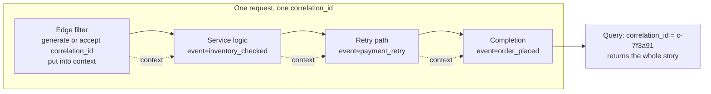
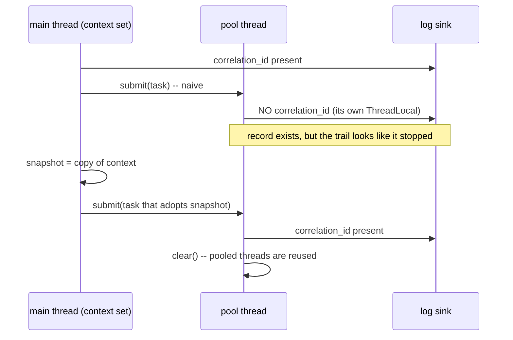

# Structured Logging, Correlation IDs, and Log Hygiene

> **Topic register:** T-2436 · Core tier · High interview frequency [H]
> **Provenance:** every log record shown below is real executed output from
> [`practice/java/observability/structured-logging/`](../../practice/java/observability/structured-logging/README.md)
> (OpenJDK 21.0.12), including a genuinely reproduced context loss across a
> thread-pool boundary and a working redaction pass.
> **Scope:** [Logging, Metrics, Tracing, and OpenTelemetry](logging-metrics-tracing-and-opentelemetry.md)
> owns the three-signal model and distributed tracing. This chapter owns the
> discipline *inside* the logging signal: record shape, context propagation,
> level semantics, sensitive data, and volume.

## Table of Contents

1. [Learning Objectives](#learning-objectives)
2. [Why This Matters in Interviews](#why-this-matters-in-interviews)
3. [Level 1 — Foundation](#level-1-foundation)
4. [Level 2 — Working Knowledge](#level-2-working-knowledge)
5. [Mental Model](#mental-model)
6. [Definition and Purpose](#definition-and-purpose)
7. [Core Concepts](#core-concepts)
8. [Internal Implementation](#internal-implementation)
9. [Diagrams](#diagrams)
10. [Java Examples](#java-examples)
11. [Production Scenarios](#production-scenarios)
12. [Trade-offs](#trade-offs)
13. [Decision Framework](#decision-framework)
14. [Common Mistakes](#common-mistakes)
15. [Anti-Patterns](#anti-patterns)
16. [Best Practices](#best-practices)
17. [Interview Answer Framework](#interview-answer-framework)
18. [Interview Questions](#interview-questions)
19. [Summary](#summary)
20. [Key Takeaways](#key-takeaways)
21. [Cheat Sheet](#cheat-sheet)
22. [Flashcards](#flashcards)
23. [Practice Exercises](#practice-exercises)
24. [Solutions](#solutions)
25. [Additional Reading](#additional-reading)
26. [Official References](#official-references)

---

## Learning Objectives

By the end of this chapter you can:

- Convert a prose log line into a structured record and explain what querying becomes possible as a result.
- Explain what MDC actually is, and why context silently disappears when work crosses a thread boundary — including why clearing it matters as much as setting it.
- Give each log level a decidable definition, so two engineers reviewing the same code agree on which to use.
- Keep sensitive data out of logs by design rather than by redaction, and explain why the design version is the one that matters.
- Reason about log volume and retention as a cost and a signal-to-noise problem, not just a storage line item.

## Why This Matters in Interviews

Every candidate says "we had good observability." The follow-up that separates answers is "walk me through how you found the cause." A candidate who logs prose describes grepping; a candidate who logs structured records describes querying — filtering by `correlation_id`, then by `duration_ms > 400`, then grouping by `event`. The second answer is shorter and obviously faster, and it is a direct consequence of a decision made long before the incident.

The topic also probes judgment about things that are cheap to get wrong and expensive to fix. Sensitive data in logs is a real breach class, because logs are replicated to places the access-control review never covers. Log volume is a real cost line. Level discipline decides whether anyone believes an ERROR at 3 a.m. None of these are technically hard; all of them are organizational, which is exactly why they come up in Senior and Staff interviews.

## Level 1 — Foundation

A log is a record of something that happened. Most services emit them as sentences:

```text
2026-09-28 10:15:30.123 INFO  OrderService - Order ORD-1001 placed successfully in 412ms
```

That is readable by a human reading one line and nearly useless to a machine reading a million. To find slow orders, you need a regular expression that extracts a number from the middle of an English sentence — and it breaks the day someone rewords the message.

A **structured** log is the same event emitted as data:

```text
{"ts":"2026-09-28T10:15:30.123Z","level":"INFO","logger":"OrderService","thread":"main","event":"order_placed","order_id":"ORD-1001","duration_ms":"412"}
```

Same information, different shape. Now "orders that took more than 400 ms" is a filter (`duration_ms > 400`), not a regex. Two changes did that work:

1. The values became **named fields** rather than positions in a sentence.
2. The message became a **stable event name** (`order_placed`) rather than prose. Prose gets reworded; `order_placed` is an identifier, and dashboards built on it keep working.

Both real records above came from the same demo, printing the same event twice.

## Level 2 — Working Knowledge

A single record is rarely enough. One request touches several components and emits several records, and you need them tied together. That is a **correlation ID**: an identifier generated (or accepted from an inbound header) at the edge and attached to every record for that request.

```text
{"...","event":"request_received","correlation_id":"c-7f3a91","user_id":"u-2048","path":"/orders","method":"POST"}
{"...","event":"inventory_checked","correlation_id":"c-7f3a91","user_id":"u-2048","sku":"SKU-1","available":"true"}
{"...","event":"payment_retry","correlation_id":"c-7f3a91","user_id":"u-2048","attempt":"2","reason":"gateway_timeout"}
{"...","event":"order_placed","correlation_id":"c-7f3a91","user_id":"u-2048","order_id":"ORD-1002","duration_ms":"980"}
```

No call site passed `correlation_id`. It lives in a per-thread context map — **MDC** (Mapped Diagnostic Context) in SLF4J/Logback, and in the demo a plain `ThreadLocal<Map<String,String>>`, because that is precisely what MDC is. Set it once at the edge, and every record on that thread inherits it.

That inheritance is also the trap. MDC is per-*thread*, and the moment work moves to another thread the context does not follow. Real, executed:

```text
{"...","thread":"main","event":"before_async_dispatch","correlation_id":"c-aa0102"}
{"...","thread":"pool-1-thread-1","event":"inside_pool_naive"}
{"...","thread":"pool-1-thread-2","event":"inside_pool_propagated","correlation_id":"c-aa0102"}
```

The middle record has **no** `correlation_id`. Nothing threw, nothing warned; the pool thread simply has its own `ThreadLocal`. This is the most common reason a request's log trail goes silent halfway through — and because the records still exist, it looks like the work never happened rather than like a logging bug.

The fix is to capture a snapshot on the submitting thread and adopt it inside the task. The other half, easy to forget, is to **clear it afterwards**: pool threads are reused, and a stale context is worse than a missing one, because it attributes the next request's work to the previous request's ID.

## Mental Model

Think of logs as **rows in a table you did not bother to define**. Every record has the same implicit columns — time, level, logger, thread, event, plus whatever context applies — and structured logging is just writing them down so a query engine can see them.

Correlation IDs are the **join key** of that table. Without one, you have rows and no way to relate them. With one, "what happened to this request" is a single `WHERE` clause.

Levels are the table's **priority column**, and they are only useful if everyone fills them in the same way — which is why a decidable definition per level matters more than any individual choice.

## Definition and Purpose

**Structured logging** emits each record as a set of typed key-value fields rather than a formatted sentence, so records can be indexed, filtered, and aggregated without parsing.

**Correlation ID** (sometimes request ID, or `trace_id` under [W3C Trace Context](https://www.w3.org/TR/trace-context/)) is a value that identifies one logical operation across every component and record it touches.

**Log hygiene** covers the rest of the discipline: which levels mean what, what must never be written, how much is written, and how long it is kept.

These exist because the failure mode they prevent is specific and common: an incident where the data needed to explain it was technically emitted but could not be found, correlated, or trusted. Logs that cannot be queried are an archive, not a signal.

## Core Concepts

### The fields every record should carry

| Field | Why |
|---|---|
| `ts` | ISO-8601 with timezone and milliseconds; local formats break ordering across regions |
| `level` | Filtering and routing |
| `service`, `version`, `instance` | Which deployment produced it — essential during a rollout |
| `event` | A stable identifier, not prose |
| `correlation_id` / `trace_id` | The join key |
| `user_ref` / `tenant_id` | A *reference*, never the identifying value itself |
| Domain fields | `order_id`, `sku`, `duration_ms` — whatever the query will filter on |

The discipline is naming: `duration_ms` everywhere beats `durationMs` here and `elapsed` there. A shared vocabulary is what makes cross-service queries possible, and it is cheap at the start and expensive to retrofit.

### Levels, defined so two engineers agree

| Level | Decidable definition | In production |
|---|---|---|
| ERROR | A human must do something; the operation failed and will not self-heal | On, alertable |
| WARN | Heading toward ERROR, or a degraded path was taken | On, trended not paged |
| INFO | The business event trail — what the system did | On |
| DEBUG | Detail for reproducing a specific bug | Off by default |
| TRACE | Firehose | Off |

The demo makes the ERROR/WARN boundary explicit by putting `actionable` in the record itself. The reason this matters is not tidiness: an ERROR nobody acts on trains everyone to ignore ERROR, and the next real one is missed. That dynamic is the same one covered in [Metric Cardinality and Alert Fatigue](metric-cardinality-and-alert-fatigue.md), arriving through a different door.

### Sensitive data: design beats redaction

Real, executed redaction:

```text
Raw message (must never be logged):
  payment failed for alice@example.com using card 4111 1111 1111 1111
Redacted:
  payment failed for <email redacted> using card <card redacted, last4=1111>
```

That works, and it is still the *second-best* answer. Pattern-based redaction only catches shapes you anticipated; a passport number, an internal account ID, or a free-text field a user pasted a secret into will pass straight through.

The primary control is to log **stable references** instead of values: `user_ref: "u-2048"` and `card_last4: "1111"`, never the email or the PAN. A log that never received the value cannot leak it, whatever happens downstream — and logs are replicated widely: a hosted search cluster, cold storage, a laptop during an incident, a vendor's support ticket. Every one of those is a place your access-control review does not reach.

Keep redaction as a safety net at the sink, because someone will eventually log an exception whose message contains a payload. Both layers, in that order.

### Volume is a cost and a signal problem at once

Log volume scales with traffic, so it grows exactly when you can least afford it. The usual levers, in the order worth applying them:

1. **Delete records nobody queries.** Most services emit several per-request records that have never appeared in a single investigation.
2. **Sample the high-volume, low-information ones.** Successful health checks do not need 100% retention; errors always do. Sample by outcome, never uniformly.
3. **Tier retention.** Hot and searchable for days; cold and cheap for months; and be honest that cold storage is for compliance, not for debugging.
4. **Move measurements to metrics.** "How many orders succeeded" is a counter, not a million log lines. Logs answer "what happened to *this* one"; metrics answer "how often."

That last split is the one candidates miss, and it is the cleanest connection back to [Logging, Metrics, Tracing, and OpenTelemetry](logging-metrics-tracing-and-opentelemetry.md).

### Logs and traces are converging

Under OpenTelemetry, a log record can carry `trace_id` and `span_id`, letting a backend pivot from a slow span directly to the records emitted inside it. When tracing is present, prefer propagating the W3C `traceparent` header and using `trace_id` as your correlation field rather than inventing a parallel identifier — two IDs meaning the same thing is a reliable source of confusion during an incident.

## Internal Implementation

**What MDC is.** In Logback, `MDC` is a `ThreadLocal` map that the encoder reads when formatting each record. Nothing magical: the demo reimplements it in six lines. The consequences follow directly from `ThreadLocal` semantics, which is why [ThreadLocal-Mediated Classloader Leaks](../02-java/concurrency/threadlocal-mediated-classloader-leaks.md) is a relevant neighbour — an MDC never cleared on a pooled thread is a retained map entry, small but permanent.

**Why context is lost across a boundary.** `ThreadLocal` is per-thread by definition. `executor.submit(task)` runs `task` on a different thread with a different map. There is no inheritance for pool threads (and `InheritableThreadLocal` only helps at thread *creation*, which a pool does once, long before your request). Hence the naive record above carrying no `correlation_id`.

The propagation pattern, which every framework implements some version of:

```java
Map<String, String> captured = snapshot();      // on the submitting thread
pool.submit(() -> {
    adopt(captured);                            // on the pool thread
    try {
        log("INFO", "inside_pool_propagated");
    } finally {
        clear();                                // mandatory: threads are reused
    }
});
```

Spring's `TaskDecorator`, Micrometer's `ContextSnapshot`, and OpenTelemetry's context propagators are all this, generalized. Java 21's scoped values (see [Scoped Values and ThreadLocal Migration](../02-java/concurrency/scoped-values-and-threadlocal-migration.md)) offer a structured alternative with better semantics for virtual threads, where the per-thread map assumption becomes expensive at scale.

**Cost of a log call.** Building the message is the cost, and it happens *before* the level check unless you avoid it. `log.debug("state: " + expensiveToString())` concatenates and calls `toString()` even when DEBUG is off. Parameterized logging (`log.debug("state: {}", obj)`) defers formatting until the level check passes. On a hot path this is a measurable difference, and it is the reason the guard idiom (`if (log.isDebugEnabled())`) still exists for genuinely expensive arguments.

**Synchronous versus asynchronous appenders.** A synchronous file or network appender puts I/O on the request thread — a slow log sink becomes slow requests. Async appenders hand off to a queue, which introduces the real question nobody asks until an incident: what happens when the queue fills? Logback's `AsyncAppender` *drops* records below a threshold by default. Dropping logs silently during the exact minutes you need them is a trap worth knowing about before you meet it.

## Diagrams





The second diagram is the whole propagation lesson: the failure is silent, the fix is two lines, and the `clear()` is not optional.

## Java Examples

Full, runnable source at [`practice/java/observability/structured-logging/`](../../practice/java/observability/structured-logging/README.md).

**The context map — this is all MDC is:**

```java
private static final ThreadLocal<Map<String, String>> CONTEXT =
        ThreadLocal.withInitial(LinkedHashMap::new);

static void put(String key, String value)      { CONTEXT.get().put(key, value); }
static Map<String, String> snapshot()          { return new LinkedHashMap<>(CONTEXT.get()); }
static void adopt(Map<String, String> context) { CONTEXT.get().putAll(context); }
static void clear()                            { CONTEXT.remove(); }
```

**A real-world edge filter, in Spring terms:**

```java
@Component
public class CorrelationIdFilter extends OncePerRequestFilter {
    @Override
    protected void doFilterInternal(HttpServletRequest request,
                                    HttpServletResponse response,
                                    FilterChain chain) throws ServletException, IOException {
        String id = Optional.ofNullable(request.getHeader("X-Correlation-Id"))
                .filter(s -> !s.isBlank())
                .orElseGet(() -> UUID.randomUUID().toString());
        MDC.put("correlation_id", id);
        response.setHeader("X-Correlation-Id", id);   // so the caller can quote it in a ticket
        try {
            chain.doFilter(request, response);
        } finally {
            MDC.clear();                              // container threads are pooled too
        }
    }
}
```

Accepting an inbound ID rather than always generating one is what makes the identifier work *across* services; echoing it back is what lets a support ticket contain the exact key an engineer needs.

**Logging references, not values:**

```java
// Wrong: the PAN and the email now exist in every log sink you replicate to.
log.error("payment failed for {} using card {}", user.email(), card.number());

// Right: stable references that are useless to an attacker and sufficient for support.
log.error("payment_failed user_ref={} card_last4={} reason={}",
        user.reference(), card.last4(), failure.code());
```

## Production Scenarios

### Scenario: an incident where the logs existed and could not be used

**Symptoms.** A p99 latency regression on checkout. The team has logs from every service. Three hours into the incident nobody can say which downstream call is slow.

**Initial hypotheses.** Database contention; a slow third-party payment call; a GC pause.

**Evidence collected.** Each service logs prose with its own format. Timestamps are local-time in two services and UTC in three. There is no shared identifier, so correlating a checkout across services means matching on user ID and a time window — which produces many candidate matches during peak traffic.

**Diagnosis.** Not a logging *outage* — a logging *design* failure. Every fact needed was written down and none of it was joinable. The team ended up reproducing the issue in staging with extra logging, which took hours and was only possible because the bug was reproducible.

**Immediate mitigation.** Add a correlation ID at the edge, propagate it on outbound calls, and log it everywhere. This is roughly a day of work across services and pays off in the *next* incident, not this one — worth saying plainly, because the temptation mid-incident is to skip it.

**Permanent remediation.** A shared logging library fixing the record shape (UTC ISO-8601, `service`/`version`, `correlation_id`, `event` naming), adopted as the platform default rather than per-service convention.

**Trade-offs.** A shared library is a coupling point and an upgrade burden. The alternative — a written convention each team implements — reliably produces five near-identical, subtly incompatible formats, which is what this team already had.

**Interview lessons.** "We had logs" is not observability. The question is whether the records are joinable and queryable, and that is decided at design time.

### Scenario: an access-token in the logs, found by a customer

**Symptoms.** A customer reports that an error page displayed a correlation ID; investigating it, an engineer finds that a request-logging filter recorded full request headers — including `Authorization` — for all 5xx responses.

**Diagnosis.** A debugging aid added during an earlier incident and never removed. The tokens are in the hot search cluster, the cold archive, and any vendor system logs were shipped to.

**Immediate mitigation.** Revoke the affected tokens, remove the filter, purge what can be purged. Cold archives frequently cannot be selectively purged, which is the part that turns this into a disclosure conversation.

**Permanent remediation.** A deny-list of header and field names at the logging layer (`Authorization`, `Cookie`, `Set-Cookie`, `X-Api-Key`), redaction at the sink as a net, and a review rule that "log the whole request" is never merged. Retention limits reduce the blast radius of the next one.

**Trade-offs.** Deny-lists fail open — anything not listed is logged. An allow-list of loggable headers fails closed and is stricter than most teams accept. For anything handling payments or health data, the allow-list is the defensible choice.

**Interview lessons.** The realistic failure is not a developer deliberately logging a password; it is a temporary debugging aid that outlived its incident. The control has to be structural, because the intent was never the problem.

## Trade-offs

| Choice | Gains | Costs |
|---|---|---|
| Structured (JSON) | Queryable, aggregatable, machine-parseable | Larger records; unreadable raw in a terminal without a pretty-printer |
| Prose | Readable at a glance during local development | Brittle regex parsing; breaks on rewording |
| Rich context on every record | Any record is self-sufficient | Duplication and volume |
| Async appenders | Keeps I/O off the request thread | Records can be *dropped* when the queue fills — during incidents |
| Aggressive sampling | Lower cost | The record you need may be the one sampled away |
| Long retention | Post-hoc investigation and compliance | Cost, and a larger blast radius for anything sensitive that leaked in |
| Shared logging library | One correct implementation, consistent fields | Coupling and an upgrade burden across teams |

## Decision Framework

1. **Will a machine read this?** In production, always. Structured is the default; pretty-printing is a local-development concern.
2. **What will you filter on during an incident?** Those are your fields. Anything you would not filter on is prose, and prose belongs in the `event` name.
3. **Does this value identify a person or grant access?** Then log a reference, not the value. That is the whole rule.
4. **Which level?** Ask "must a human act on this?" Yes → ERROR. Will they soon → WARN. Neither, but it is part of the business trail → INFO. Only useful while chasing a specific bug → DEBUG.
5. **Is this a count or a story?** Counts belong in metrics. Logs answer "what happened to this one."
6. **Is tracing present?** Then use `trace_id` as the correlation field rather than inventing a second identifier.

## Common Mistakes

- **Logging prose and parsing it later.** The regex outlives its author and breaks on the first reword.
- **Assuming MDC follows your work onto a pool thread.** Reproduced above: it does not, and nothing warns you.
- **Setting context without clearing it.** Pooled threads reuse the map; the next request inherits the previous one's ID, which is worse than no ID at all.
- **Logging whole request or response objects.** The fastest route to credentials and PII in a log sink.
- **ERROR for anything unexpected.** If nobody acts on it, it is not an ERROR, and its presence devalues the real ones.
- **String concatenation in a `debug` call.** The work happens even when DEBUG is off; use parameterized logging.
- **Ignoring what an async appender does when its queue fills.** Logback's default drops records — during precisely the load spike you are investigating.

## Anti-Patterns

- **The "log everything, filter later" pipeline.** Cost scales with traffic, signal does not, and sensitive data accumulates.
- **Two identifiers for one request** (`request_id` and `trace_id` meaning the same thing) — guaranteed confusion mid-incident.
- **Per-service log formats.** Makes cross-service queries impossible exactly when you need them.
- **Redaction as the only control.** Pattern matching catches shapes you anticipated and nothing else.
- **Temporary debug logging with no expiry.** The token-leak scenario above, in its most common form.

## Best Practices

- Emit JSON in production with a fixed core field set; keep pretty-printed output for local runs only.
- Generate a correlation ID at the edge, accept an inbound one when present, echo it in the response, and propagate it on every outbound call.
- Capture and adopt context across every thread boundary, and always clear it in a `finally`.
- Log stable references instead of identifying values, with redaction at the sink as a net.
- Use parameterized logging; never concatenate arguments to a `debug` call.
- Give levels decidable definitions and enforce them in review, not in a wiki page.
- Sample by outcome — never sample errors — and tier retention deliberately.
- Move counts to metrics; keep logs for the story of one operation.

## Interview Answer Framework

### 30-Second Answer

Structured logging means each record is key-value data rather than a sentence, so "requests slower than 400 ms" is a filter instead of a regex, and the message becomes a stable event name instead of prose. A correlation ID generated at the edge and carried in MDC ties every record for one request together. The two things people get wrong are that MDC does not follow work onto a pool thread, and that sensitive values should never reach the log in the first place — log references, not values.

### 2-Minute Answer

Add the reproduced failure and the level discipline. I have measured the context loss directly: a task submitted to a thread pool logged with no `correlation_id` at all, because the pool thread has its own `ThreadLocal` — nothing throws, so the request's trail just appears to stop, which reads like the work never happened. The fix is capturing a snapshot on the submitting thread and adopting it in the task, and crucially clearing it afterwards, because pooled threads are reused and stale context attributes work to the wrong request. On hygiene: give each level a decidable definition — ERROR means a human must act — because an ERROR nobody acts on trains everyone to ignore ERROR. And treat sensitive data as a design problem: log `user_ref` and `card_last4`, never the email or the PAN, with pattern redaction only as a safety net, because logs replicate to places your access review never reaches.

### 10-Minute Deep Dive

Structure: the shape of a record and why the event name must be stable; correlation IDs as the join key, accepted inbound and echoed back; MDC as literally a `ThreadLocal` map and the propagation failure that follows, including the `clear()` requirement and the virtual-thread/scoped-values angle; level definitions that two engineers can apply identically; sensitive data as design-then-redaction, with the token-in-logs failure shape; volume and retention as both cost and signal-to-noise, with the logs-versus-metrics split; and the operational details that only appear under load — parameterized logging, and async appenders dropping records when the queue fills.

### Whiteboard Explanation

Write one prose log line. Underneath, write the same event as JSON fields. Circle `duration_ms` and write `> 400` next to it. Then draw three records sharing a `correlation_id` and label it "join key." Finally draw a thread boundary as a vertical line, with the context on the left and nothing on the right, and write "silent" across it. Three drawings, and the third is the one that gets remembered.

### Production Example

The three-hour latency incident where every fact was logged and nothing was joinable: five services, three timestamp formats, no shared identifier, resolved only by reproducing it in staging with extra logging.

### Trade-offs to Mention

Structured records are larger and less readable raw; async appenders trade request latency for the risk of dropped records under load; sampling saves cost and can discard the record you needed; a shared logging library buys consistency at the price of coupling.

### Common Candidate Mistakes

Describing log aggregation tooling instead of record design; not knowing MDC is thread-local; treating redaction as sufficient; using ERROR for anything unexpected.

### Staff-Level Discussion

The technical content here is not hard, which is exactly why it is an organizational topic. Record shape, field vocabulary, and correlation-ID propagation only pay off if every service does them the same way, so the real decision is where that consistency lives: a shared library (one correct implementation, plus coupling and an upgrade burden) or a written convention (no coupling, and reliably five incompatible dialects). Staff-level judgment is picking one deliberately and owning its cost. The second decision is the sensitive-data control: a deny-list of field names fails open, an allow-list fails closed, and anything touching payments or health data should be on the allow-list even though it is stricter than teams like. The third is budget: log spend scales with traffic while signal does not, so retention tiers and outcome-based sampling belong in the same review as SLOs — and the honest framing is that cold storage is a compliance artifact, not a debugging tool. Finally, the failure mode to design against is not malice; it is a temporary debugging aid that outlives its incident, which means the control has to be structural rather than a reminder.

## Interview Questions

### Question 1 — What is structured logging, and what does it let you do that prose logging does not?

**Why interviewers ask it.** It is the entry point, and the quality of the answer predicts the rest of the observability conversation.

**Expected answer.** Each record is emitted as named key-value fields rather than a formatted sentence, so a log backend can index and query them directly. Concretely, `duration_ms` becomes a numeric filter instead of a regex capture, and the message becomes a stable event identifier (`order_placed`) rather than prose that gets reworded. Both forms carry the same information; only one supports aggregation.

**Minimum acceptable answer.** Knows structured means machine-parseable fields, usually JSON.

**Strong Senior answer.** Emphasizes the stable-event-name discipline and the shared field vocabulary — `duration_ms` meaning the same thing in every service — as the part that makes cross-service queries possible, and notes that this is cheap at the start and expensive to retrofit.

**Staff-level extension.** Frames consistency as the actual deliverable and names the trade-off explicitly: a shared logging library gives one correct implementation with coupling and upgrade cost; a written convention avoids coupling and reliably produces several incompatible dialects.

**Common mistakes.** Describing the log aggregation product instead of the record design; keeping prose in the message and adding fields alongside it, so the regex habit survives.

**Likely follow-ups.** "What fields belong on every record?" (Timestamp in UTC ISO-8601, level, service/version/instance, event, correlation ID, domain fields.) "Should local development also emit JSON?" (Pretty-print locally, structure in production.)

**Evaluation criteria.** Names both changes — fields *and* stable event names — and gives a concrete query that becomes possible.

### Question 2 — A request's log trail stops halfway through, with no error anywhere. What happened?

**Why interviewers ask it.** It is a real, silent failure, and the reasoning path goes straight to how MDC actually works.

**Expected answer.** The work crossed a thread boundary. MDC is a `ThreadLocal` map, so a task submitted to an executor runs on a thread with its own empty context; the records are still emitted, but without the `correlation_id`, so a query by that ID stops returning them and it looks like execution stopped. Verified directly: the naive pooled task logged with no correlation ID at all. The fix is to snapshot the context on the submitting thread and adopt it inside the task.

**Minimum acceptable answer.** Connects the gap to asynchronous execution or a thread change.

**Strong Senior answer.** Adds the `clear()` requirement — pooled threads are reused, so leaving context behind attributes the next request's work to the previous request's ID, which is actively misleading rather than merely missing — and names the framework mechanisms that generalize this (`TaskDecorator`, context propagators). Mentions that `InheritableThreadLocal` does not solve it for pools, because inheritance happens at thread creation.

**Staff-level extension.** Points at virtual threads: the per-thread-map assumption gets expensive when threads are cheap and numerous, which is what scoped values address, and any platform-wide logging library needs a position on that before virtual-thread adoption rather than after.

**Common mistakes.** Assuming the records were lost rather than unlabelled; proposing to pass the ID explicitly through every method signature as the primary fix.

**Likely follow-ups.** "Why not just pass it as a parameter?" (It works and pollutes every signature, including third-party call paths.) "What about `@Async` in Spring?" (Same problem; a `TaskDecorator` copies the context.)

**Evaluation criteria.** Identifies the thread-local boundary, proposes snapshot-and-adopt, and mentions clearing without being prompted.

### Question 3 — How do you keep sensitive data out of logs?

**Why interviewers ask it.** It is a real breach class with a tempting wrong answer.

**Expected answer.** Primarily by not logging the values at all: log stable references such as `user_ref` and `card_last4` instead of the email address or the PAN. A log that never received the value cannot leak it. Redaction at the sink — pattern matching for emails, card numbers, tokens — is a safety net for the cases that slip through, such as an exception message containing a payload, not the primary control.

**Minimum acceptable answer.** Says not to log PII or credentials and mentions masking.

**Strong Senior answer.** Explains why redaction alone is insufficient (it only catches anticipated shapes, and free-text fields defeat it) and why the exposure is wide (logs replicate to hot search, cold archives, vendor systems, and engineers' laptops during incidents — none covered by the access review that covers the database). Names the realistic failure: a temporary request-header dump added during an incident and never removed.

**Staff-level extension.** Contrasts deny-list and allow-list controls — deny-lists fail open, allow-lists fail closed — and argues for allow-lists in payment or health-data contexts despite the friction, plus retention limits to bound the blast radius of the next leak.

**Common mistakes.** Treating redaction as sufficient; proposing to encrypt logs, which protects them at rest but not from anyone with legitimate log access.

**Likely follow-ups.** "A token ends up in the archive. What now?" (Revoke first, then purge what is purgeable; cold archives often are not selectively purgeable, which is what escalates it.) "How do you prevent recurrence?" (Structural controls plus a review rule, since intent was never the problem.)

**Evaluation criteria.** Puts design before redaction, knows where logs actually end up, and proposes a structural control rather than developer diligence.

## Summary

A log record is a row in a table nobody defined, and structured logging is the act of defining it: named fields, a stable event name, and a shared vocabulary across services. A correlation ID generated at the edge is the join key that turns scattered records into one request's story — provided it survives every thread boundary, which it does not do by default, as the demo's silently unlabelled pooled record shows. The rest is hygiene with real consequences: levels defined so they can be trusted, sensitive values kept out by design rather than scrubbed out by pattern, and volume managed as both a cost and a signal-to-noise problem. None of it is technically difficult, and all of it has to be consistent across services to be worth anything, which is why it is an organizational decision as much as a technical one.

## Key Takeaways

- Structured records make filtering and aggregation possible; stable event names keep dashboards working after a reword.
- A correlation ID is the join key — generate at the edge, accept inbound, echo back, propagate outbound.
- MDC is a `ThreadLocal`; context does **not** cross a pool boundary, and the failure is silent.
- Always clear context on pooled threads: stale context is worse than missing context.
- Log references, not values. Redaction is a net, not the design.
- ERROR means a human must act; anything else devalues the level.
- Counts belong in metrics; logs answer "what happened to this one."

## Cheat Sheet

Condensed version: [`cheat-sheets/structured-logging-correlation-ids-and-log-hygiene.md`](../../cheat-sheets/structured-logging-correlation-ids-and-log-hygiene.md).

## Flashcards

Review deck: [`flashcards/structured-logging-correlation-ids-and-log-hygiene.md`](../../flashcards/structured-logging-correlation-ids-and-log-hygiene.md).

## Practice Exercises

1. Take a prose log line from a service you work on and rewrite it as a structured record. List every query the structured version makes possible that the original did not.
2. Run the demo and confirm the pooled record has no `correlation_id`. Then remove the `clear()` from the propagated case, submit two tasks with different IDs, and observe what the second one logs.
3. Add a `duration_ms` field to a request-logging filter and write the query for "slowest 1% of `order_placed` events in the last hour."
4. Audit one service for sensitive data in logs: grep for logging calls that pass a whole object, a request, or an exception whose message may carry a payload.
5. Estimate your service's daily log volume, then identify which record types have never appeared in an investigation. Decide what to drop, what to sample, and what to keep.

## Solutions

1. Typically: filter by outcome, aggregate by event, threshold on duration, group by tenant — none of which the sentence supports without a parser that breaks on rewording.
2. Without `clear()`, the second task can inherit the first task's `correlation_id`, because the pool reused the thread. That is worse than a missing ID: the records are attributed to the wrong request, and nothing indicates it.
3. Something equivalent to `event="order_placed" | percentile(duration_ms, 99)` over a one-hour window — trivial with a field, impossible with a sentence.
4. The usual finds are `log.debug("request: {}", request)`, exception messages echoing a payload, and a request-header dump added during a past incident.
5. Most services can drop or sample a substantial share of INFO records with no loss of investigative power, provided errors are never sampled.

## Additional Reading

- [Logging, Metrics, Tracing, and OpenTelemetry](logging-metrics-tracing-and-opentelemetry.md) — the three-signal model and distributed tracing this chapter sits inside.
- [Metric Cardinality and Alert Fatigue](metric-cardinality-and-alert-fatigue.md) — the same trust dynamic on the metrics side.
- [Incident Response and Blameless Postmortems](incident-response-and-blameless-postmortems.md) — where log quality is repaid or regretted.
- [Scoped Values and ThreadLocal Migration](../02-java/concurrency/scoped-values-and-threadlocal-migration.md) — the structured alternative to MDC's per-thread map.
- [OWASP Top 10 for Backend Services](../12-security/owasp-top-10-for-backend-services.md) — sensitive data exposure, of which log leakage is a common instance.

## Official References

- [OpenTelemetry — Logs Specification](https://opentelemetry.io/docs/specs/otel/logs/)
- [W3C — Trace Context](https://www.w3.org/TR/trace-context/)
- [Logback — Mapped Diagnostic Context](https://logback.qos.ch/manual/mdc.html)
