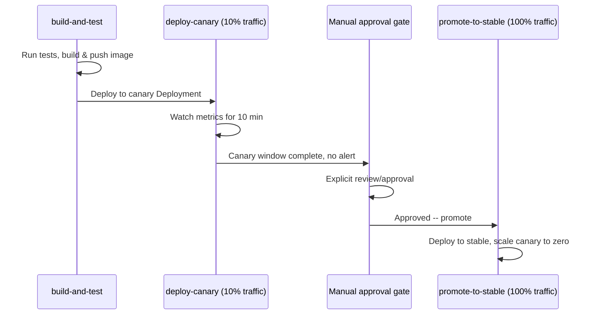

# CI/CD Pipeline Design and Deployment Strategies

> **Topic register:** T-1009 · IWI 5.8 · Core tier, High interview frequency
> **Provenance:** the workflow in this chapter is real, syntactically-valid GitHub Actions YAML at [`practice/k8s/week-15/ci-cd-pipeline.yaml`](../../practice/k8s/week-15/ci-cd-pipeline.yaml), validated via `ruby -ryaml` parsing (confirms all three jobs — `build-and-test`, `deploy-canary`, `promote-to-stable` — parse correctly). Not executed against a live GitHub Actions runner or Kubernetes cluster — stated explicitly, the same scoping discipline applied throughout this week's chapters.

## Table of Contents

1. [Learning Objectives](#learning-objectives)
2. [Why This Matters in Interviews](#why-this-matters-in-interviews)
3. [Level 1 — Foundation](#level-1--foundation)
4. [Level 2 — Working Knowledge](#level-2--working-knowledge)
5. [Mental Model](#mental-model)
6. [Definition and Purpose](#definition-and-purpose)
7. [Core Concepts](#core-concepts)
8. [Internal Implementation](#internal-implementation)
9. [Diagrams](#diagrams)
10. [Production Scenarios](#production-scenarios)
11. [Trade-offs](#trade-offs)
12. [Decision Framework](#decision-framework)
13. [Common Mistakes](#common-mistakes)
14. [Anti-Patterns](#anti-patterns)
15. [Best Practices](#best-practices)
16. [Interview Answer Framework](#interview-answer-framework)
17. [Interview Questions](#interview-questions)
18. [Summary](#summary)
19. [Key Takeaways](#key-takeaways)
20. [Cheat Sheet](#cheat-sheet)
21. [Flashcards](#flashcards)
22. [Practice Exercises](#practice-exercises)
23. [Solutions](#solutions)
24. [Additional Reading](#additional-reading)
25. [Official References](#official-references)

---

## Learning Objectives

By the end of this chapter you can:

- Compare blue-green, canary, and rolling deployment strategies by what each one actually bounds the blast radius of a bad release to.
- Explain why a canary stage's promotion gate should require an explicit approval, not just the absence of an alert.
- Read a real CI/CD pipeline definition and explain each stage's purpose and failure-handling behavior.
- Connect a deployment strategy choice to the specific risk profile of the service being deployed, not a one-size-fits-all default.

## Why This Matters in Interviews

CI/CD questions test whether a candidate treats deployment as a risk-management problem or purely a mechanical "push the button" process. The specific distinction between deployment strategies — what each one actually protects against, and at what cost — is where candidates who've only used a CI system as a black box diverge from those who've designed a pipeline's failure-handling behavior deliberately.

## Level 1 — Foundation

Imagine three different ways to switch a restaurant to a new menu. **Rolling** is swapping menus table by table as guests finish their current meal and leave — at any moment, some tables have the old menu, some have the new one, and it happens gradually with no full stop. **Blue-green** is running the entire new menu in a second, fully-staffed dining room right next door, completely empty of customers, and then one evening simply directing every new guest to the new room at once — if the new menu turns out to be a disaster, you just start directing guests back to the old room immediately, no partial-transition mess to untangle. **Canary** is quietly trying the new menu on just one or two tables first, watching closely how those specific guests react, and only rolling it out further once you're confident it's actually good.

The entire point of the canary approach collapses if nobody actually watches those first couple of tables. If you just wait ten minutes and roll out the new menu to everyone regardless of whether anyone checked on how those first guests reacted, you've paid for the appearance of caution without getting any of its real benefit.

## Level 2 — Working Knowledge

At this level you should be able to compare all three strategies by what they actually bound: rolling deployments bound exposure as a side effect of their gradual mechanism (not a deliberate signal-gathering stage); blue-green trades real, doubled infrastructure cost for an instant, complete rollback (just re-point traffic back); canary deliberately routes a small, monitored slice of real traffic first, specifically to gather genuine signal before wider exposure.

You should also be able to explain, precisely, why "no alert fired during the canary window" is a meaningfully weaker signal than "a person actually looked at the canary's metrics and confirmed they looked healthy." An alert threshold can only ever catch exactly the specific failure pattern it was explicitly designed to catch — a real, visible regression that stays just inside that threshold sails through silently, even though a human glancing at the same dashboard for thirty seconds would likely flag it as worth a second look.

Practically, when reviewing a deployment pipeline, the working question to ask is: does the promotion step from canary to full production require an explicit human approval, or does it promote automatically after a fixed wait with no alert? If it's the latter, that's a real, concrete gap worth raising — not because automation is bad, but because "silence" and "confirmed healthy" are genuinely different levels of evidence, and conflating them is exactly how a subtle, real regression reaches 100% of production traffic before anyone notices.

## Mental Model

**Every deployment strategy answers the same question differently: how much of production is exposed to a bad release before a human or an automated check catches it?** A rolling update exposes a shrinking fraction of *existing* capacity to the new version as the rollout proceeds. Blue-green exposes zero production traffic until an explicit cutover, then all of it at once. Canary exposes a small, deliberately-chosen slice of real traffic first, specifically to get real signal before wider exposure — and the entire value of canary depends on someone (or something) actually looking at that signal before promoting further.

## Definition and Purpose

A **rolling deployment** gradually replaces old-version instances with new-version instances (the mechanism the previous chapter's `maxSurge`/`maxUnavailable` control). A **blue-green deployment** runs the new version ("green") fully alongside the old version ("blue") with zero production traffic on green, then cuts traffic over all at once (and can cut back instantly if something's wrong). A **canary deployment** routes a small percentage of real production traffic to the new version first, monitors it, and only then progressively increases that percentage — the closest of the three to "test in production, deliberately, in a bounded way."

These strategies exist because deploying new code always carries risk, and the strategies differ in exactly how that risk is bounded: by fraction of capacity exposed at once (rolling), by traffic volume before a full cutover decision (blue-green), or by a deliberately small, monitored slice of real traffic before wider exposure (canary).

## Core Concepts

### Rolling deployments bound exposure by capacity fraction, not traffic volume

At any point during a rolling update, some fraction of instances are old, some are new — traffic to each instance is typically proportional to capacity, so the "canary-like" exposure a rolling update provides is a side effect of its mechanism, not a deliberate signal-gathering stage.

### Blue-green trades a resource cost for an instant, complete rollback

Running two full production-sized environments simultaneously (even briefly) costs double the infrastructure during the transition, but the rollback is just re-pointing traffic back to blue — no need to "undo" a partial rollout.

### Canary's entire value depends on someone actually evaluating the signal

Routing 10% of traffic to a canary and monitoring for 10 minutes is only useful if a human (or an automated check with a genuinely reliable, low-false-negative signal) actually evaluates that window before promoting to 100% — automatic promotion after a fixed wait, with no explicit check, defeats the purpose and just adds latency to a rollout that was always going to happen regardless of the canary's actual health.

### A promotion gate should require explicit confirmation, not just the absence of an alert

The absence of an alert firing during the canary window is a much weaker signal than an explicit "yes, this canary looked healthy" confirmation — an alerting threshold that's too insensitive, or a metric that doesn't capture the specific failure mode a given release risks, can produce silence that isn't actually evidence of health.

## Internal Implementation

**A real, syntax-validated three-stage canary pipeline:**

```yaml
jobs:
  build-and-test:
    steps:
      - run: ./mvnw verify
      - run: docker build -t registry.example.com/order-service:${{ github.sha }} .
      - run: docker push registry.example.com/order-service:${{ github.sha }}

  deploy-canary:
    needs: build-and-test
    steps:
      - run: kubectl set image deployment/order-service-canary order-service=...:${{ github.sha }}
      - run: kubectl rollout status deployment/order-service-canary --timeout=120s
      - run: ./scripts/watch-canary-metrics.sh --duration=10m --max-error-rate=0.01

  promote-to-stable:
    needs: deploy-canary
    environment:
      name: production   # <-- GitHub's environment protection rule enforces a manual approval gate here
    steps:
      - run: kubectl set image deployment/order-service-stable order-service=...:${{ github.sha }}
      - run: kubectl rollout status deployment/order-service-stable --timeout=300s
      - run: kubectl scale deployment/order-service-canary --replicas=0
```

Validated for YAML correctness:

```
$ ruby -ryaml -e "d = YAML.load_file('ci-cd-pipeline.yaml'); puts 'Parsed OK. Jobs: ' + d['jobs'].keys.join(', ')"
Parsed OK. Jobs: build-and-test, deploy-canary, promote-to-stable
```

**Reading the pipeline's risk-bounding design precisely:** `build-and-test` gates on real test success before anything is even pushed. `deploy-canary` deploys to a separate `order-service-canary` Deployment (not the stable one) and explicitly watches metrics for a full 10-minute window with a defined error-rate threshold, before the job even completes — this is the canary "exposure" stage. `promote-to-stable` uses GitHub's `environment: production` mechanism specifically so a human approval gate sits between "the canary didn't alert" and "now serving 100% of traffic" — the comment in the manifest states directly why: absence of an alert is not the same as a human confirming the canary looked healthy.

## Diagrams



## Production Scenarios

### Scenario: an automated canary promotion ships a subtle regression that a human reviewer would have caught

**Symptoms.** A team's canary pipeline automatically promotes to 100% traffic after a 10-minute window with no alert fired, with no human approval step. A release with a subtle latency regression (within the alerting threshold, but a real, noticeable degradation) passes the canary window silently and reaches 100% of production traffic, where it's only caught hours later via a broader trend dashboard, not the canary's own alerting.

**Impact.** A regression that a human glancing at the canary's actual metrics (not just "did an alert fire") would likely have caught immediately instead reaches full production exposure and persists for hours.

**Initial hypotheses.** The canary window was too short to catch the regression (checked — even a longer window wouldn't have crossed the alert threshold, since the regression was within it by design of this specific incident); the alerting threshold itself needs tightening (a reasonable but separate finding); the promotion gate had no human review step at all, relying purely on "no alert fired" as sufaverage-quality evidence of health (correct, and the more fundamental gap).

**Evidence.** The canary's actual latency metrics, visible on a dashboard the whole time, showed a real, visually obvious upward shift versus the stable baseline — clearly within the numeric alert threshold, but the kind of shift an engineer glancing at the dashboard for 30 seconds would very likely have flagged as worth investigating before promoting further.

**Diagnosis.** Exactly this chapter's named risk: an alerting threshold (a specific, numeric definition of "unhealthy") is a necessarily incomplete proxy for genuine health, and removing the human review step entirely means the pipeline can only catch what the threshold was explicitly designed to catch — nothing else, including patterns a human would recognize as suspicious even without crossing a defined line.

**Immediate mitigation.** Roll back the stable deployment to the previous version while the regression is investigated.

**Permanent remediation.** Reintroduce an explicit human approval gate between the canary window and full promotion (matching this chapter's own reference pipeline design), specifically for the judgment call a numeric threshold alone can't make, while separately tightening the alerting threshold as a complementary (not substitute) improvement.

**Alternatives considered.** Relying solely on tightening alert thresholds to eventually catch this specific regression pattern — rejected as an endless, reactive game of adding thresholds for every previously-missed pattern, rather than restoring the human judgment step that would have caught this (and likely other, not-yet-seen) patterns generically.

**Trade-offs.** A human approval gate adds latency to every release (waiting for a person to review and approve) — accepted, since the alternative demonstrated cost is a regression reaching full production for hours before a separate, unrelated dashboard caught it.

**Prevention.** Treat "no alert fired" and "a human confirmed this looks healthy" as two genuinely different levels of evidence, and require the stronger one (human confirmation) before any full-production promotion, for any release where the cost of a missed regression is meaningful.

**Interview lesson.** This is the production-scale version of this chapter's own named design principle: absence of an alert is not the same as an explicit confirmation of health, and an automated-only promotion gate can only catch exactly what its thresholds were designed to catch.

## Trade-offs

| Choice | Benefit | Cost |
|---|---|---|
| Rolling deployment | Simple, no extra infrastructure needed | Exposure is a side effect of the rollout mechanism, not a deliberate, monitored signal-gathering stage |
| Blue-green | Instant, complete rollback by re-pointing traffic | Double infrastructure cost during the transition window |
| Canary with automated-only promotion | Fast, no human latency in the pipeline | Can only catch what the alerting threshold was explicitly designed to catch — misses patterns a human would flag |
| Canary with a human approval gate | Catches regressions a numeric threshold alone would miss | Adds real latency to every release, waiting for human review |

## Decision Framework

1. **Can this service tolerate a brief window of double infrastructure cost for an instant, complete rollback option?** Blue-green.
2. **Is the goal to get real production signal on a small, bounded slice of traffic before wider exposure?** Canary — and default to a human approval gate for the promotion decision unless the release's risk is genuinely low and well-covered by existing alerting.
3. **Is the deployment mechanism itself (not a deliberate signal-gathering stage) sufficient risk-bounding for this service's risk profile?** A plain rolling update, accepting that its exposure-limiting behavior is incidental to its actual purpose (avoiding downtime), not a monitored canary stage.
4. **What specifically would an alerting threshold miss that a human reviewer would catch?** If the answer is "nothing meaningful, the alerting is comprehensive and well-tuned," an automated-only gate may be acceptable; if the answer includes any real gap, require human review.

## Common Mistakes

- Treating "no alert fired during the canary window" as equivalent to "a human confirmed this release is healthy."
- Choosing a deployment strategy by habit or default rather than by the specific service's risk tolerance and rollback needs.
- Running blue-green indefinitely (leaving double infrastructure running longer than the transition actually requires) rather than tearing down the old environment promptly after a successful cutover.

## Anti-Patterns

- **Fully automated canary promotion with no human review step**, relying solely on numeric alert thresholds to catch every possible regression.
- **Using the same deployment strategy for every service** regardless of its specific risk profile and rollback-time requirements.
- **A canary window too short to capture the failure mode a specific release actually risks** (e.g., a memory leak that only manifests after tens of minutes, checked against a 5-minute canary window).

## Best Practices

- Require an explicit human approval gate for canary-to-full-production promotion, treating "no alert" and "confirmed healthy" as genuinely different evidence levels.
- Choose the deployment strategy per service, based on its specific risk tolerance and rollback-time requirements, not a single organization-wide default.
- Size the canary window to genuinely capture the failure modes a release realistically risks, not an arbitrary fixed duration.

## Interview Answer Framework

### 30-Second Answer

Rolling, blue-green, and canary deployments bound release risk differently: rolling by shrinking exposure as the rollout proceeds, blue-green by keeping the new version at zero traffic until an instant, reversible cutover, canary by deliberately routing a small, monitored slice of real traffic first. Canary's entire value depends on someone actually evaluating that signal — automatic promotion after a fixed wait with no human review, relying only on "no alert fired," can miss regressions a human would catch immediately.

### 2-Minute Answer

Definition: rolling deployments gradually shift traffic between old and new instance counts; blue-green runs both versions fully but keeps new at zero traffic until an explicit cutover; canary routes a small, deliberate slice of real traffic to the new version first, before wider exposure. Why it exists: every deployment carries risk, and these strategies differ in how that risk is bounded. How it works: a real pipeline gates promotion behind test success, then a monitored canary window, then (ideally) an explicit human approval before full production exposure. One important trade-off: blue-green costs double infrastructure during the transition; canary's automated-only promotion is fast but can miss what its alert thresholds weren't designed to catch. Production example: a real-shaped incident where a subtle latency regression passed a 10-minute canary window silently (within the alert threshold) and reached full production for hours, caught only by an unrelated dashboard — exactly the gap a human approval gate would have closed.

### 10-Minute Deep Dive

Cover, in order: the mental model — every strategy bounds how much of production is exposed before a check catches a bad release (mental model); the real, validated three-stage pipeline and precisely what each stage's failure-handling does (internals, real evidence); the specific principle that "no alert" isn't "confirmed healthy" (core concepts); the decision framework for choosing a strategy per service risk profile (decision framework); and close with the production scenario — a fully-automated canary promotion missing a regression a human reviewer would have caught.

### Whiteboard Explanation

Draw the [§ Diagrams](#diagrams) sequence: build-and-test → deploy-canary (10% traffic, watched for 10 minutes) → a manual approval gate (draw a person icon) → promote-to-stable (100% traffic). Annotate the manual gate explicitly: "this step exists because 'no alert fired' and 'a human looked and confirmed it's healthy' are different levels of evidence."

### Production Example

The silently-promoted regression in [§ Production Scenarios](#production-scenarios): a fully-automated canary promotion (no human gate) let a within-threshold latency regression reach full production, discovered hours later via an unrelated dashboard rather than the canary's own alerting.

### Trade-offs to Mention

State unprompted: blue-green's instant rollback costs double infrastructure during the transition; a human approval gate adds latency to every release in exchange for catching what thresholds alone would miss; canary window duration must match the actual failure modes a release risks, not an arbitrary default.

### Common Candidate Mistakes

Treating deployment strategy choice as a one-size-fits-all default rather than a per-service risk decision; assuming an automated canary with no human gate is sufficient because "the alerting would catch it."

### Typical Follow-Up Questions

1. "Your canary passed with no alerts, but the release still caused a production issue. What's your process gap?"
2. "When would blue-green be the wrong choice despite its instant-rollback benefit?"

### Senior-Level Expectations

Correctly compares rolling, blue-green, and canary by what each bounds risk to, and identifies the human-review gap in fully-automated canary promotion.

### Staff-Level Discussion

The "no alert fired" versus "confirmed healthy" distinction generalizes far beyond deployment pipelines — it's the same gap between a passing automated test suite and genuine code review, or between a clean monitoring dashboard and an actual on-call engineer's judgment during an ambiguous incident. A Staff engineer treats any fully-automated gate (a promotion decision, a merge decision, an escalation decision) as only as good as the specific conditions it was explicitly designed to check, and asks explicitly what it would miss — the same question this chapter's production scenario shows costing real production hours when left unasked.

## Interview Questions

### Question 1 — Your canary passed with no alerts, but the release still caused a production issue. What's your process gap?

**Why interviewers ask it.** A realistic, specific incident scenario testing whether the candidate identifies the process-design gap, not just the specific alert threshold that missed it.

**Expected answer.** The promotion gate relied solely on "no alert fired" as evidence of health, with no human review step — a numeric threshold can only catch exactly what it was designed to catch, and a regression within that threshold but still real (and visible to a human glancing at the actual metrics) would pass silently.

**Minimum acceptable answer.** Proposes tightening the specific alert threshold that missed this incident, even without the broader process-gap framing.

**Strong Senior answer.** Correctly identifies the human-review gap in fully-automated canary promotion.

**Staff-level extension.** Generalizes the "no alert ≠ confirmed healthy" distinction beyond this specific incident, proposing it as a standing principle for any automated gate, not just this one pipeline.

**Common mistakes.** Treating this as purely an alert-tuning problem rather than a process-design gap.

**Likely follow-ups.** "How would you balance the added latency of human review against release velocity?"

**Evaluation criteria (1–5).** 1: proposes only tightening the specific threshold. 3: correctly identifies the missing human-review step. 5: correct identification plus the generalized "no alert ≠ confirmed healthy" principle.

**Related references.** [§ Core Concepts](#core-concepts); [§ Production Scenarios](#production-scenarios).

---

### Question 2 — When would blue-green be the wrong choice despite its instant-rollback benefit?

**Why interviewers ask it.** Tests whether the candidate can name blue-green's actual cost, not just recite its benefit.

**Expected answer.** When the service can't justify running two full production-sized environments simultaneously (cost-sensitive workloads, or ones where "full production size" is itself expensive/large), or when the service holds significant in-flight state that can't cleanly exist in two places during the transition (e.g., a stateful system where blue and green would both be mutating shared state inconsistently).

**Minimum acceptable answer.** States that blue-green costs more infrastructure, even without the stateful-service nuance.

**Strong Senior answer.** Correctly names the double-infrastructure cost as the primary limiting factor.

**Staff-level extension.** Adds the stateful-system nuance — blue-green's clean "two independent full environments" model works best for genuinely stateless or externally-stateful (database-backed, with the database itself not duplicated) services, and gets substantially more complex for anything holding meaningful in-process or instance-local state.

**Common mistakes.** Describing only blue-green's benefits without being able to name a real limiting cost.

**Likely follow-ups.** "How would canary compare for that same scenario?"

**Evaluation criteria (1–5).** 1: names no real cost. 3: correctly names the double-infrastructure cost. 5: correct cost plus the stateful-system complication.

**Related references.** [§ Trade-offs](#trade-offs); [§ Decision Framework](#decision-framework).

## Summary

Rolling, blue-green, and canary deployments each bound release risk differently: rolling by shrinking exposure as the rollout proceeds (a side effect of its mechanism), blue-green by keeping the new version at zero traffic until an instant, reversible cutover (at double infrastructure cost during the transition), and canary by deliberately routing a small, monitored slice of real traffic first. Canary's entire value depends on someone actually evaluating that signal — a real, validated pipeline in this chapter uses an explicit human approval gate specifically because "no alert fired" and "a human confirmed this is healthy" are different levels of evidence, a distinction a real-shaped production incident in this chapter shows mattering directly.

## Key Takeaways

- Rolling, blue-green, and canary bound deployment risk via different mechanisms, with different costs.
- Blue-green's instant rollback comes at the cost of double infrastructure during the transition.
- Canary's value depends entirely on the signal actually being evaluated — "no alert" is not the same as "confirmed healthy."
- Deployment strategy should be chosen per service, based on its specific risk tolerance and rollback needs, not a single organization-wide default.

## Cheat Sheet

| Need | Strategy |
|---|---|
| Simple rollout, no extra infrastructure cost | Rolling |
| Instant, complete rollback option | Blue-green |
| Real production signal on a bounded slice of traffic before wide exposure | Canary, with a human approval gate |
| A release whose risk is well-covered by comprehensive, well-tuned alerting | Canary with automated promotion may be acceptable — but verify the "well-covered" claim explicitly first |

## Flashcards

### Card: How the three strategies bound risk

**Prompt:**
How do rolling, blue-green, and canary deployments each bound release risk?

**Answer:**
Rolling shrinks exposure as the rollout proceeds (incidental to its mechanism); blue-green keeps new at zero traffic until an instant, reversible cutover; canary deliberately routes a small, monitored slice of real traffic first.

**Why it matters:**
Different mechanisms, different costs — the right choice depends on the specific service's risk profile.

**Common trap:**
Treating all three as interchangeable "ways to deploy" without their distinct risk-bounding mechanisms.

**Related:**
[Definition and Purpose](#definition-and-purpose)

### Card: What canary's value depends on

**Prompt:**
What does canary deployment's entire value depend on?

**Answer:**
Someone (or something reliable) actually evaluating the canary's signal before promoting further — "no alert fired" alone is a weaker signal than an explicit confirmation of health.

**Why it matters:**
A fully-automated promotion gate can only catch what its thresholds were explicitly designed to catch.

**Common trap:**
Automatically promoting after a fixed wait with no alert, treating silence as proof of health.

**Related:**
[Production Scenarios](#production-scenarios)

### Card: Blue-green's real cost

**Prompt:**
What's the real cost of blue-green deployment, beyond "it's more complex"?

**Answer:**
Double infrastructure cost during the transition window — both full environments run simultaneously.

**Why it matters:**
The specific, concrete trade-off against blue-green's instant-rollback benefit.

**Common trap:**
Describing only blue-green's benefits without naming this specific cost.

**Related:**
[Trade-offs](#trade-offs)

## Practice Exercises

1. Validate the syntax of [`ci-cd-pipeline.yaml`](../../practice/k8s/week-15/ci-cd-pipeline.yaml) yourself using a YAML parser of your choice.
2. Modify the pipeline to add a second canary metric check (e.g., p99 latency, not just error rate) and explain what specific failure mode this catches that error rate alone would miss.
3. Design the deployment strategy (and justify it against this chapter's decision framework) for a stateful, hard-to-restart batch-processing service versus a stateless, horizontally-scaled API service.

## Solutions

**Exercise 1.** A valid YAML parser should confirm all three jobs (`build-and-test`, `deploy-canary`, `promote-to-stable`) parse correctly, matching this chapter's own `ruby -ryaml` validation output.

**Exercise 2.** A p99 latency check specifically catches performance regressions that don't manifest as outright errors — e.g., a change that makes every request slightly slower but doesn't cause any request to actually fail, which an error-rate-only check would never flag regardless of how severe the slowdown is.

**Exercise 3.** The stateful, hard-to-restart batch service likely favors a more conservative rolling update (or even a manually-gated single-instance-at-a-time approach) since blue-green's "run two full environments" model conflicts with genuinely stateful, non-duplicable processing, and canary's "route a slice of live traffic" model doesn't map cleanly onto batch work at all. The stateless, horizontally-scaled API service is a strong fit for canary with a human approval gate, since it can cleanly support multiple versions serving live traffic simultaneously with no shared-state conflict.

## Additional Reading

- Martin Fowler, ["BlueGreenDeployment"](https://martinfowler.com/bliki/BlueGreenDeployment.html) and ["CanaryRelease"](https://martinfowler.com/bliki/CanaryRelease.html)

## Official References

- [GitHub Actions documentation](https://docs.github.com/en/actions)
