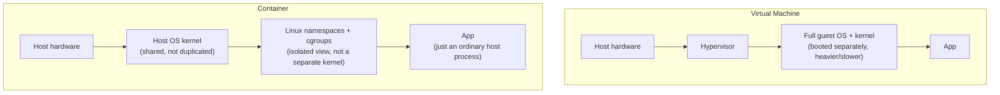

# Docker and Containers Fundamentals

## Table of Contents

1. [Why This Matters](#1-why-this-matters)
2. [Prerequisites](#2-prerequisites)
3. [Foundation (L1)](#3-foundation-l1)
4. [Core Concepts (L2)](#4-core-concepts-l2)
5. [How It Works Internally (L3)](#5-how-it-works-internally-l3)
6. [Practical Usage](#6-practical-usage)
7. [Examples](#7-examples)
8. [Common Mistakes](#8-common-mistakes)
9. [Edge Cases](#9-edge-cases)
10. [Performance Implications](#10-performance-implications)
11. [Trade-offs](#11-trade-offs)
12. [Senior-Level Considerations (L3)](#12-senior-level-considerations-l3)
13. [Staff/System-Level Considerations (L4)](#13-staffsystem-level-considerations-l4)
14. [Production Scenarios](#14-production-scenarios)
15. [Interview Questions](#15-interview-questions)
16. [Coding/Practice Exercises](#16-codingpractice-exercises)
17. [Debugging Exercises](#17-debugging-exercises)
18. [Design Exercises](#18-design-exercises)
19. [Further Reading](#19-further-reading)
20. [Mastery Checklist](#20-mastery-checklist)

## 1. Why This Matters

[Container Image Internals](container-image-internals.md) explains layers, union filesystems, and image composition in depth — but it assumes you already know what a container *is* and have run one before. This chapter is that missing floor, the same role the other Junior Fundamentals chapters play for their own domains. Nearly every backend job today ships its application in a container, and "walk me through what happens when you run `docker run`" is a real, common question at the Junior/Mid boundary — one this repository never actually answered before this chapter, despite using Docker constantly in its own practice labs (`practice/sql/sql-fundamentals/`, and others).

## 2. Prerequisites

None specific to this repository, though basic command-line comfort (running a command, reading its output) is assumed throughout.

## 3. Foundation (L1)

A **container** is a running process (or small group of processes) that has been given its own isolated view of the filesystem, network, and process list — it *looks* to the software inside it like a whole separate machine, but it is actually just an ordinary process on the host's own kernel, isolated using kernel features (Linux namespaces and cgroups) rather than running its own separate kernel or hardware. This is the single biggest conceptual difference from a **virtual machine**, which really does run its own complete guest operating system and kernel on top of virtualized hardware — a VM is heavier and slower to start (booting a real kernel) specifically because it isn't taking this shortcut.



An **image** is a read-only template a container is created from — a packaged filesystem plus metadata (what command to run, what port the app listens on) that never changes once built. A **container** is one running (or stopped) instance created from an image, the same relationship [Java OOP Fundamentals](../02-java/language-core/java-oop-fundamentals-classes-objects-and-interfaces.md) describes between a class and an object: one image, many containers, each with its own independent runtime state.

A **`Dockerfile`** is a plain-text recipe for building an image: `FROM` picks a starting base image (usually a minimal OS or language runtime), `WORKDIR` sets the working directory for later instructions, `COPY` adds files from your machine into the image, and `CMD` states what command runs when a container starts from the finished image.

## 4. Core Concepts (L2)

**`docker build`** reads a `Dockerfile` and produces a new image, executing each instruction in order to construct the image's filesystem. **`docker run`** creates and starts a new container from an image. **`docker ps`** lists running containers; adding `-a` shows stopped ones too. **`docker logs <container>`** shows a container's captured standard output — the primary way to see what a containerized application printed, since there's no visible terminal attached to it by default. **`docker stop`** and **`docker rm`** stop a running container and then permanently remove it.

**Port publishing** (`-p 8080:8080` on `docker run`) is not automatic — a container's network is isolated from the host's by default, and `EXPOSE` in a `Dockerfile` is documentation, not an access grant. Section 7's second demo proves this directly: a container running the identical server, without an explicit `-p` mapping, is completely unreachable from the host (`curl` fails with a real connection-refused error) even though the exact same server is verifiably running and answering requests *inside* the container's own network namespace, confirmed via `docker exec`.

## 5. How It Works Internally (L3)

Two Linux kernel features do the actual isolation work Section 3 describes: **namespaces** give a process its own isolated view of specific kinds of global state — a PID namespace makes a container's own process 1 look like the only process on the "machine" from inside; a network namespace gives it its own network interfaces, routing table, and port space, completely separate from the host's, which is exactly why Section 4's port-publishing behavior exists — the container's port 8080 and the host's port 8080 are, by default, two entirely separate things in two separate namespaces, and `-p` is what explicitly bridges them. **cgroups** (control groups) limit and account for the resources (CPU, memory) a process or group of processes can use, which is how a container's resource limits are actually enforced at the kernel level — covered further in [Kubernetes Resource Limits, Probes, and JVM Sizing](kubernetes-resource-limits-probes-and-jvm-sizing.md).

An image is built as a stack of **layers** — each `Dockerfile` instruction that changes the filesystem produces one new, cached layer, which is why reordering a `Dockerfile` to put rarely-changing instructions (like installing dependencies) before frequently-changing ones (like copying your own source code) makes rebuilds faster: unchanged layers are reused from cache rather than rebuilt. [Container Image Internals](container-image-internals.md) covers this mechanism in full depth.

## 6. Practical Usage

Keep a `Dockerfile`'s early instructions stable and its late instructions volatile, to maximize layer-cache reuse on rebuilds. Always publish ports explicitly with `-p` rather than assuming `EXPOSE` alone makes a service reachable — Section 4's real, verified behavior. Reach for `docker logs` before anything else when a containerized app isn't behaving as expected — it is almost always the fastest way to see what actually happened inside.

## 7. Examples

All output below is real, from Docker Engine 29.6.2 — [`practice/docker-fundamentals/`](../../practice/docker-fundamentals/), full transcript in `docker-transcript.txt`.

**Build and run, with port mapping — reachable from the host:**
```
$ docker build -t docker-fundamentals-demo:1.0 .
... naming to docker.io/library/docker-fundamentals-demo:1.0 done
$ docker run -d --name docker-fundamentals-demo -p 8080:8080 docker-fundamentals-demo:1.0
$ docker ps
CONTAINER ID   IMAGE                          PORTS                    NAMES
fa0f3a3d8fe8   docker-fundamentals-demo:1.0   0.0.0.0:8080->8080/tcp   docker-fundamentals-demo
$ curl -s http://localhost:8080/
Hello from inside a container
$ docker logs docker-fundamentals-demo
Server started on port 8080
```

**The same image, run without `-p` — real network isolation, not a description of it:**
```
$ docker run -d --name docker-fundamentals-demo-noport docker-fundamentals-demo:1.0
$ curl -s --max-time 2 http://localhost:8080/
(connection refused -- curl exit code 7, no route from host to the container's port)
$ docker exec docker-fundamentals-demo-noport curl -s http://localhost:8080/
Hello from inside a container
```
The server is genuinely running and answering requests the entire time — `docker exec` runs `curl` *inside* the container's own network namespace, where `localhost:8080` correctly reaches it. The host's own `localhost:8080` is a completely different address space until `-p` bridges the two.

## 8. Common Mistakes

- **Assuming `EXPOSE` in a `Dockerfile` makes a port reachable from the host** — it's documentation only; `-p` on `docker run` is what actually publishes a port, Section 4/7's real, verified distinction.
- **Confusing a container with a VM** — a container shares the host's kernel and is isolated via namespaces/cgroups (Section 5); it is not running its own separate operating system.
- **Copying an entire project directory into an image with one broad `COPY`**, defeating layer caching — every source-code change invalidates every layer after it, even ones that didn't need to change.
- **Forgetting a stopped container still exists** until explicitly `rm`'d — `docker ps` alone (without `-a`) hides stopped containers, making it easy to accumulate them unnoticed.

## 9. Edge Cases

- **A container's filesystem changes are lost when the container is removed**, unless a volume or bind mount was used to persist specific paths outside the container's own layer — this chapter's own demo writes nothing persistent, deliberately, to keep the isolation demonstration clean.
- **Two containers from the same image are completely independent** — starting a second container does not share in-memory state or filesystem changes with the first, even though both came from the identical image.
- **A container exits the moment its main process (PID 1 inside it) exits** — there is no "container" independent of the process it's running; if that process crashes or completes, the container stops.

## 10. Performance Implications

A container starts in the time it takes to start one process — no kernel boot, no hardware virtualization — while a VM's startup time is dominated by booting a full guest operating system, often measured in seconds to minutes rather than a container's typical sub-second start. This is the direct, practical consequence of Section 5's shared-kernel model, and is a large part of why containers, not VMs, became the default unit of deployment for horizontally-scaled backend services.

## 11. Trade-offs

| Concern | Container | Virtual Machine |
|---|---|---|
| Isolation boundary | Shared host kernel, isolated via namespaces/cgroups | Own full kernel, isolated via hardware virtualization |
| Startup time | Sub-second (starting a process) | Seconds to minutes (booting an OS) |
| Isolation strength | Weaker — a kernel-level exploit can potentially affect the host | Stronger — a separate kernel is a harder boundary to cross |
| Best for | Horizontally-scaled, stateless application workloads | Workloads needing OS-level isolation, or a different kernel/OS entirely |

## 12. Senior-Level Considerations (L3)

A Senior engineer reviewing a `Dockerfile` checks instruction ordering against Section 6's caching rule before anything else — a `Dockerfile` that reinstalls every dependency on every single-line source change is a real, common, and easily fixed source of slow CI pipelines. The same engineer treats "the container isn't reachable" reports by checking `-p` mappings first (Section 8), before assuming the application itself is broken.

## 13. Staff/System-Level Considerations (L4)

At Staff scope, the container-vs-VM trade-off (Section 11) becomes a real infrastructure decision with cost and operational implications at scale: a fleet of lightweight, fast-starting containers scales horizontally far more cheaply and responsively than an equivalent fleet of VMs, which is the underlying reason container orchestration platforms like Kubernetes ([Kubernetes Objects, Scheduling, and Networking](kubernetes-objects-scheduling-and-networking.md)) became the default way large organizations run backend services — this chapter's fundamentals are the floor that entire operational model is built on.

## 14. Production Scenarios

No existing `production-cookbook/` entry has a Docker-fundamentals-specific root cause — the closest adjacent entries are Kubernetes- and resource-limit-scale, not basic container-mechanics-scale.

> Planned reference: a future `production-cookbook/` entry covering a real incident caused by a `Dockerfile`'s poor layer-cache ordering silently degrading CI pipeline speed over months, discovered only once build times became a visible team complaint, would be a natural, non-duplicative addition connecting this chapter's Section 8/12 warning to a genuine production incident.

## 15. Interview Questions

**Q1 (Junior): "What's the difference between a Docker image and a Docker container?"**
Expected answer: an image is a read-only template; a container is one running (or stopped) instance created from that image — the same class/object relationship as in object-oriented programming.

**Q2 (Junior/Mid): "What's the difference between a container and a virtual machine?"**
Expected answer: Section 3's core distinction — a container shares the host's kernel and is isolated via kernel features (namespaces/cgroups); a VM runs its own complete guest kernel on virtualized hardware, making it heavier and slower to start.

**Q3 (Mid): "You ran a container but can't reach it from your browser. What do you check first?"**
Expected answer: whether the container was started with an explicit `-p` port mapping — `EXPOSE` alone in the Dockerfile does not publish a port to the host, Section 4/8's real, common gotcha.

**Q4 (Mid): "Why does Dockerfile instruction order affect build speed?"**
Expected answer: Section 5/6's layer-caching mechanism — each instruction produces a cached layer, and a change invalidates that layer plus every layer after it; ordering stable instructions (dependency installation) before volatile ones (source code) maximizes cache reuse.

**Q5 (Mid/Senior): "Why did the industry largely move to containers over VMs for scaling backend services?"**
Expected answer: Section 10/13's framing — sub-second container startup versus a VM's full-OS-boot startup time makes horizontal scaling faster and cheaper, at the cost of a weaker isolation boundary (shared kernel) that's judged an acceptable trade-off for most application workloads.

## 16. Coding/Practice Exercises

1. Modify `Server.java` to read a greeting message from an environment variable (`System.getenv("GREETING")`), rebuild the image, and run it twice with two different `-e GREETING=...` values, confirming each container serves its own distinct message.
2. Add a second `COPY` instruction and a dependency-like step before copying `Server.class`, then make a change only to `Server.class` and observe (via `docker build`'s own output) which layers are reused from cache and which are rebuilt.
3. Run two containers from the same image simultaneously, mapped to two different host ports (`-p 8080:8080` and `-p 8081:8080`), and confirm both respond independently via `curl`.

## 17. Debugging Exercises

Given this sequence, predict the outcome before running it:

```
docker run -d --name demo -p 8080:8080 docker-fundamentals-demo:1.0
docker stop demo
curl -s http://localhost:8080/
```

The `curl` fails — once a container is stopped, nothing is listening on the mapped port anymore, even though the port mapping was configured correctly and worked before the `stop`. A candidate expecting the `curl` to somehow still succeed is forgetting that a port mapping only routes to a container while it is actually running (Section 9 — a container's lifecycle is tied to its main process).

## 18. Design Exercises

You need to run a small web app and a Redis cache as two separate containers that can talk to each other, with the web app reachable from your laptop's browser but Redis not directly reachable from outside. Describe, at a conceptual level (not exact commands), what port-publishing decisions you'd make for each container and why.

## 19. Further Reading

- [Container Image Internals](container-image-internals.md) — the full layer/union-filesystem mechanism this chapter's Section 5 only summarizes.
- [Kubernetes Objects, Scheduling, and Networking](kubernetes-objects-scheduling-and-networking.md) — what runs many containers, across many machines, once a single `docker run` isn't enough.
- [Kubernetes Resource Limits, Probes, and JVM Sizing](kubernetes-resource-limits-probes-and-jvm-sizing.md) — the cgroups-based resource limiting this chapter's Section 5 references.

## 20. Mastery Checklist

- [ ] Can explain the difference between an image and a container using the class/object analogy.
- [ ] Can explain the core mechanical difference between a container and a VM (shared kernel + namespaces/cgroups vs. a separate guest kernel).
- [ ] Knows that `EXPOSE` alone does not publish a port, and that `-p` is required.
- [ ] Can explain why Dockerfile instruction order affects build cache efficiency.
- [ ] Can correctly predict the Section 17 debugging exercise (a stopped container's port mapping goes with it).
- [ ] Can explain, in Staff-level terms, why containers' fast startup time drove their adoption for horizontally-scaled services.
