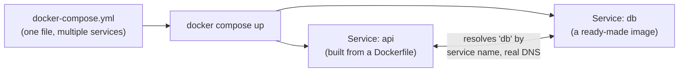
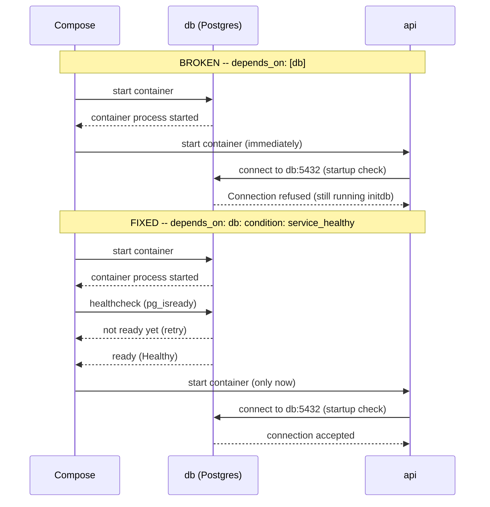

# Docker Compose: Multi-Service Orchestration

> **Topic register:** T-2428 · Advanced tier, High interview frequency (new gap-audit topic — no entry in the original Master Topic Register)
> **Why this chapter exists.** [Docker and Containers Fundamentals](docker-and-containers-fundamentals.md) covers one container at a time; this repository's own practice labs already run 16 real `docker-compose.yml` files across Kafka, Postgres, and RAG demos, but nothing ever taught what that file actually does. A widely-shared social-media infographic naming Docker Compose as its own topic prompted a direct check — confirmed via grep, not assumed: `container-image-internals.md` mentions `docker-compose up` once, in passing; no chapter anywhere teaches multi-service orchestration itself.

## Table of Contents

1. [Learning Objectives](#learning-objectives)
2. [Why This Matters in Interviews](#why-this-matters-in-interviews)
3. [Level 1 — Foundation](#level-1-foundation)
4. [Level 2 — Working Knowledge](#level-2-working-knowledge)
5. [Mental Model](#mental-model)
6. [Definition and Purpose](#definition-and-purpose)
7. [Core Concepts](#core-concepts)
8. [Internal Implementation](#internal-implementation)
9. [Diagrams](#diagrams)
10. [Production Scenarios](#production-scenarios)
11. [Trade-offs](#trade-offs)
12. [Decision Framework](#decision-framework)
13. [Common Mistakes](#common-mistakes)
14. [Anti-Patterns](#anti-patterns)
15. [Best Practices](#best-practices)
16. [Interview Answer Framework](#interview-answer-framework)
17. [Interview Questions](#interview-questions)
18. [Summary](#summary)
19. [Key Takeaways](#key-takeaways)
20. [Cheat Sheet](#cheat-sheet)
21. [Flashcards](#flashcards)
22. [Practice Exercises](#practice-exercises)
23. [Solutions](#solutions)
24. [Additional Reading](#additional-reading)
25. [Official References](#official-references)

---

## Learning Objectives

By the end of this chapter you can write a real `docker-compose.yml` defining two services that talk to each other by service name, explain exactly what `depends_on` does and does not guarantee, and cite real, captured evidence of `depends_on`'s single most common gotcha — a database dependency that "started" but wasn't actually ready yet — plus the specific fix (a health check) that closes it.

## Why This Matters in Interviews

Almost every real backend service depends on at least one other thing — a database, a cache, a message broker — and almost every local development setup, and a large share of real CI pipelines, run that whole stack with Docker Compose. "Why did my app fail to connect to the database on startup, even though the container logs show the database container running?" is a genuinely common, real-world debugging question, and the honest, correct answer (`depends_on`'s real, limited guarantee) separates a candidate who has actually operated a multi-container stack from one who has only read about containers in the abstract.

## Level 1 — Foundation

Think of a restaurant opening for the night. The building's doors unlocking (the container process starting) is not the same event as the kitchen actually being ready to cook a real order (the application inside genuinely accepting connections) — a host who seats customers the instant the doors unlock, before checking whether the kitchen has finished its own setup, is going to take a real order the kitchen can't fulfill yet. **Docker Compose** is the tool that opens multiple restaurants (services) from one single instruction (`docker compose up`), wires them onto the same shared street (network) so they can find each other by name, and — this chapter's central lesson — by default only confirms that each building's doors unlocked, not that each kitchen is actually ready.



## Level 2 — Working Knowledge

At this level you should be able to read a `docker-compose.yml` and correctly predict two things: which hostname one service uses to reach another (always the other service's own name in the file, never `localhost` or a hardcoded IP — Compose gives every service real DNS resolution on its own private network), and what `depends_on` actually guarantees on its own, without a health check — only that the named service's **container process has started**, nothing about whether the application inside it has finished its own startup work and is genuinely ready to accept connections. This second point is the single most consequential thing in this chapter, and Section 8's real, captured evidence proves it directly rather than asserting it.

## Mental Model

Treat `depends_on` without a health check exactly like a manager telling a new hire "wait until Sam clocks in before you start" — clocking in tells you Sam is physically present, not that Sam has finished reading yesterday's handoff notes and is actually ready to take over a task. `depends_on: db: condition: service_healthy` is the difference between "wait until Sam clocks in" and "wait until Sam gives you a thumbs up" — a real, explicit readiness signal, not just a presence check.

## Definition and Purpose

**Docker Compose** is a tool for defining and running a multi-container application from one declarative YAML file (`docker-compose.yml`): each top-level entry under `services:` describes one container — its image (or a `build:` path to a `Dockerfile`), its ports, its environment variables, its volumes, and its `depends_on` relationships to other services in the same file. `docker compose up` builds (if needed) and starts every defined service, on a shared, private network Compose creates automatically, where each service can reach every other service using that service's own name as a hostname.

## Core Concepts

### Service-name networking, not IP addresses

Every service in a `docker-compose.yml` gets a real DNS entry, on Compose's own private network, matching its service name exactly. This chapter's demo proves it directly: the `api` service connects to `db:5432` — the literal string `"db"`, the other service's name in the file — and it resolves correctly every time, with zero manual network configuration, zero hardcoded IP address, and zero reliance on `localhost` (which, inside `api`'s own container, refers to `api` itself, not to `db`).

### `depends_on`'s real, limited default guarantee

In its plain list form (`depends_on: [db]`), Compose starts `db`'s container before starting `api`'s, and nothing more — it does not wait for whatever process is running inside `db` to finish its own initialization or begin accepting connections. For an image like `postgres`, whose very first run performs real, non-instant initialization work (`initdb`) before the database is ready to accept a single connection, this gap between "container started" and "application ready" is real and, on a fresh volume, reliably observable — not a rare edge case.

### The fix: a health check plus an explicit condition

A `healthcheck:` block on a service defines a real command Compose runs repeatedly (here, `pg_isready`, the exact tool Postgres ships for this purpose) to decide whether that service is actually ready, not just running. Pairing it with `depends_on: db: condition: service_healthy` (the map form, not the plain list form) makes Compose genuinely wait for that health check to pass before starting the dependent service — closing the exact gap the previous concept names.

## Internal Implementation

**Real broken-vs-fixed comparison** (`practice/docker-compose-multi-service-orchestration/`) — the identical `api` service, against two `docker-compose.yml` variants, on a genuinely fresh Postgres volume each time:

```yaml
# docker-compose.yml -- BROKEN
services:
  db:
    image: postgres:16-alpine
    environment:
      POSTGRES_PASSWORD: example
    volumes:
      - pgdata:/var/lib/postgresql/data
  api:
    build: ./api
    ports:
      - "8081:8080"
    depends_on:
      - db          # only waits for the db CONTAINER to start
```

```yaml
# docker-compose.fixed.yml -- FIXED
services:
  db:
    image: postgres:16-alpine
    environment:
      POSTGRES_PASSWORD: example
    volumes:
      - pgdata:/var/lib/postgresql/data
    healthcheck:
      test: ["CMD-SHELL", "pg_isready -U postgres"]
      interval: 1s
      timeout: 3s
      retries: 10
  api:
    build: ./api
    ports:
      - "8081:8080"
    depends_on:
      db:
        condition: service_healthy   # waits for db to be genuinely ready
```

Real captured output (`practice/docker-compose-multi-service-orchestration/output-transcript.txt`), each run against a freshly created volume (`docker compose down -v` before each):

```
=== Scenario 1: BROKEN, fresh volume ===
$ docker compose logs api
api-1  | Startup DB check: FAILED to connect to db:5432 after 10ms -- Connection refused
api-1  | ApiServer started on port 8080

$ curl -s http://localhost:8081/db-check   (retried manually, after Postgres finished initializing)
CONNECTED to db:5432 in 0ms

=== Scenario 2: FIXED, fresh volume ===
$ docker compose -f docker-compose.fixed.yml up -d --build
 Container ...-db-1 Started
 Container ...-db-1 Waiting
 Container ...-db-1 Healthy
 Container ...-api-1 Starting

$ docker compose -f docker-compose.fixed.yml logs api
api-1  | Startup DB check: CONNECTED to db:5432 in 9ms
api-1  | ApiServer started on port 8080
```

Re-run twice — the broken scenario's race reproduced identically both times on a fresh volume, not a one-off fluke; the fixed scenario connected on the first attempt both times.

## Diagrams



## Production Scenarios

**A team's local development environment "works on my machine" inconsistently — a fresh clone's first `docker compose up` regularly fails with a database connection error, but a second, immediate retry always succeeds, and no one on the team has ever managed to explain why.** This is exactly this chapter's `depends_on` gap, in production-adjacent form: on a brand-new checkout, the Postgres volume is genuinely fresh, so `initdb` genuinely takes real time, and the application container's own startup-time connection attempt genuinely races it — succeeding by luck once the volume already has data from a prior run (masking the bug, not fixing it), and failing again for the next new team member or CI runner starting from a truly clean state. The fix is exactly Section 7's health check plus `condition: service_healthy`, not a retry loop bolted onto the application as a workaround for an orchestration-level guarantee that was never actually being made.

## Trade-offs

Docker Compose trades production-grade orchestration features (rolling deploys, multi-host scheduling, self-healing — all real strengths of [Kubernetes](kubernetes-objects-scheduling-and-networking.md)) for radical simplicity: one YAML file, one command, a real multi-service environment running locally or in CI in seconds. It is deliberately the right tool for local development and CI, and deliberately the wrong tool for running a production fleet across multiple machines — reaching for Kubernetes only once an application genuinely needs multi-host scheduling or zero-downtime rolling deploys, not by default, keeps this trade-off honest in both directions.

## Decision Framework

Reach for a `healthcheck` plus `condition: service_healthy` any time one service's own startup logic depends on another service being genuinely ready, not just started — a database, a message broker, any dependency with real, non-instant initialization work. Skip it for dependencies that are ready the instant their process starts (a static file server, most caches with no persistent volume) — the ceremony has a real cost (Compose won't start the dependent service until the health check itself passes, adding real startup latency) that isn't worth paying where there's no actual gap to close.

## Common Mistakes

- **Assuming `depends_on`'s plain list form waits for "the database to be ready"** — it waits only for the container process to start, Section 7/8's real, demonstrated distinction.
- **"Fixing" a startup race with a retry loop or a fixed `sleep` in the application**, instead of the health-check-based fix Compose already provides for exactly this purpose — a `sleep` guesses at a duration; a health check checks the actual, real condition.
- **Hardcoding a service's IP address or using `localhost`** to reach another service, instead of the other service's own name — Compose's real DNS resolution (Section 7) makes this unnecessary and actively wrong the moment the network topology changes.
- **Never seeing the bug at all in local development** because a stale volume from a previous run already has initialized data, masking the exact race a genuinely fresh checkout or CI runner will hit — Section 10's real production scenario.

## Anti-Patterns

Copying a `docker-compose.yml` from one project into another without checking whether its `depends_on` entries have the health-check condition the new project's own dependencies actually need — a pattern that "happened to work" in the source project (because its volume was never fresh in practice) can silently reintroduce this chapter's exact race in the new one.

## Best Practices

Add a `healthcheck` to any service another service's startup logic depends on being genuinely ready, and pair it with `condition: service_healthy` on the dependent service's `depends_on` entry — not the plain list form. Always reach another service by its service name from `docker-compose.yml`, never a hardcoded IP or `localhost`. Test a `depends_on` chain against a genuinely fresh volume (`docker compose down -v`) at least once, not just against a warm, already-initialized one that can hide the exact gap this chapter demonstrates.

## Interview Answer Framework

### 30-Second Answer

Docker Compose defines and runs multiple containers from one YAML file, giving each service real DNS resolution by name on a shared network. `depends_on`, in its plain form, only waits for a dependency's container to start, not for the application inside it to be genuinely ready — a real, common gotcha for databases with non-instant startup, fixed with a `healthcheck` plus `condition: service_healthy`.

### 2-Minute Answer

Add: a real demo proves this directly — on a fresh Postgres volume, an application's startup-time connection attempt fails with a real "Connection refused" under plain `depends_on`, and connects successfully on the first attempt once a health check and `condition: service_healthy` are added, because Compose now genuinely waits for `pg_isready` to pass before starting the dependent service.

### 10-Minute Deep Dive

Cover: Compose's service-name DNS resolution and why it removes the need for hardcoded IPs or `localhost`; `depends_on`'s real, limited default guarantee versus what a health check actually adds; the specific, reproducible race on a fresh Postgres volume (real captured logs, not a description); why a stale, already-initialized volume can mask this exact bug in local development while a genuinely fresh CI runner or new team member's checkout still hits it (Section 10); and the trade-off between Compose's local-development simplicity and Kubernetes' production-scale orchestration features.

### Whiteboard Explanation

Draw two boxes, `api` and `db`, inside one larger box labeled `docker-compose.yml`. Draw an arrow from `api` to `db` labeled with the hostname `"db"` — not an IP. Underneath, draw a timeline: `db` container starts at t=0, `db`'s own readiness (Postgres accepting connections) at t=1.2s, and `api`'s container starting at t=0.1s under plain `depends_on` (racing and losing) versus t=1.3s under `condition: service_healthy` (waiting correctly).

### Production Example

See Production Scenarios above: an inconsistent "works on my machine" bug traced to a fresh Postgres volume's real initialization time racing an application's startup-time connection attempt, masked on already-initialized volumes and reappearing for every genuinely fresh checkout or CI run.

### Trade-offs to Mention

Compose's local-development/CI simplicity versus Kubernetes' production-scale orchestration; the small, real startup-latency cost a health check adds versus the cost of a race condition that only fails intermittently and is hard to reproduce once a volume has already been initialized once.

### Common Candidate Mistakes

Believing `depends_on` alone guarantees a dependency is "ready"; proposing a `sleep`-based fix instead of a health check; not knowing that a warm, already-initialized volume can hide this exact bug, leading to "it works on my machine" reports that are real, not user error.

### Typical Follow-Up Questions

"Why might this bug never show up on a developer's own machine, but always show up in CI?" (CI runners typically start from a genuinely fresh volume every time; a developer's local volume is usually already initialized from a previous run.) "What's the actual cost of adding a health check to every service, and when would you skip it?" (Section 12's decision framework.)

### Senior-Level Expectations

Correctly explains `depends_on`'s real, limited guarantee without being led to it, and proposes the health-check-based fix rather than a retry loop or fixed delay.

### Staff-Level Discussion

At Staff scope, this chapter's lesson generalizes past Docker Compose specifically: any orchestration layer's "started" signal and an application's own "ready" signal are two genuinely different events, and conflating them is a recurring, cross-tool failure mode — the same distinction reappears, with higher production stakes, in Kubernetes' own readiness-probe mechanism ([Kubernetes Objects, Scheduling, and Networking](kubernetes-objects-scheduling-and-networking.md)). A Staff engineer reviewing a new service's onboarding into a shared Compose file checks every `depends_on` entry against this exact question — "does this dependency have real startup work, and if so, does it have a health check" — as a matter of course, not only after a bug report surfaces.

## Interview Questions

### Question 1

**Question:** "Your `docker-compose.yml` has `api` depending on `db` via `depends_on: [db]`. On a fresh clone, `api` sometimes fails to connect to the database on startup, but it always works on a retry. Why?"
**Why interviewers ask this:** Tests whether a candidate understands `depends_on`'s real, limited guarantee, rather than assuming it means "wait until ready."
**Expected answer:** `depends_on` in its plain list form only waits for `db`'s container to start, not for Postgres itself to finish initializing (`initdb`) and start accepting connections — on a genuinely fresh volume, that initialization takes real time, and `api`'s own startup connection attempt can race it and lose.
**Minimum acceptable answer:** Recognizes `depends_on` doesn't guarantee full readiness, even if imprecise about why.
**Strong Senior answer:** Names the specific mechanism (`initdb` on a fresh volume) and proposes the health-check-based fix.
**Staff-level extension:** Explains why this bug is invisible on a developer's own already-initialized volume but reliably reappears for a genuinely fresh checkout or CI runner.
**Common mistakes:** Proposing a `sleep`-based fix instead of a real health check.
**Likely follow-ups:** "How would you fix it?" (Section 7/8's `healthcheck` plus `condition: service_healthy`.)
**Evaluation criteria (1–5):** 1: assumes `depends_on` guarantees readiness; 3: recognizes the gap but can't name the mechanism; 5: names the exact mechanism and the exact fix, unprompted.

### Question 2

**Question:** "How does the `api` service in a `docker-compose.yml` know how to reach the `db` service — does it need the database's IP address?"
**Why interviewers ask this:** Tests basic, practical familiarity with Compose networking, a genuinely common point of confusion for candidates who've only run single containers.
**Expected answer:** No IP address needed — Compose creates a private network per project and gives every service real DNS resolution by its own service name; `api` reaches `db` simply by connecting to the hostname `"db"`.
**Minimum acceptable answer:** States that services can reach each other by name, even without explaining the DNS mechanism.
**Strong Senior answer:** Explicitly contrasts this with `localhost`, explaining that `localhost` inside a container refers to that container itself, not to a sibling service.
**Staff-level extension:** Discusses what changes about this mechanism across multiple Compose files or an external network configuration, for services that need to be reachable across project boundaries.
**Common mistakes:** Assuming a hardcoded IP address or `localhost` would work.
**Likely follow-ups:** "What would happen if `api` tried to reach `db` via `localhost` instead?" (It would try to reach itself, not `db` — a real, common misconfiguration.)
**Evaluation criteria (1–5):** 1: assumes an IP or `localhost` is needed; 3: knows service-name resolution works but not why; 5: explains the DNS mechanism and the `localhost` contrast precisely.

## Summary

Docker Compose orchestrates multiple containers from one YAML file, giving each service real DNS resolution by name on a shared, private network — no manual IP configuration required. `depends_on`, in its plain form, only waits for a dependency's container to start, not for the application inside it to be genuinely ready; this real, common gap surfaces most visibly with databases whose first run performs real, non-instant initialization work, and this chapter demonstrated it directly with a reproducible race on a fresh Postgres volume. A `healthcheck` plus `condition: service_healthy` closes the gap by making Compose wait for a real readiness signal, not just a presence check.

## Key Takeaways

- Every service in a `docker-compose.yml` is reachable by its own service name — real DNS on Compose's private network, never a hardcoded IP or `localhost`.
- `depends_on`'s plain list form only waits for a container to *start*, not for the application inside it to be *ready* — a real, reproducible gap on a fresh Postgres volume.
- `healthcheck` plus `condition: service_healthy` (the map form of `depends_on`) closes that gap by waiting for a real readiness signal.
- A stale, already-initialized volume can mask this exact bug in local development — a genuinely fresh checkout or CI runner will still hit it.
- Compose trades Kubernetes' production-scale orchestration features for radical local-development/CI simplicity — a deliberate, honest trade-off in both directions.

## Cheat Sheet

**Mental model:** a restaurant's doors unlocking (container started) is not the same event as the kitchen being ready to cook (application ready) — `depends_on` alone only confirms the doors unlocked.
**Service networking:** every service reachable by its own name in the file — real DNS, never an IP or `localhost`.
**`depends_on` (list form):** waits only for the dependency's container to start.
**`depends_on` (map form + `condition: service_healthy`):** waits for the dependency's own `healthcheck` to pass — genuine readiness.
**Real proof:** a fresh-volume Postgres dependency reproducibly fails a startup connection under plain `depends_on`, and connects on the first attempt once a health check is added.
**Related:** [Docker and Containers Fundamentals](docker-and-containers-fundamentals.md) · [Kubernetes Objects, Scheduling, and Networking](kubernetes-objects-scheduling-and-networking.md)

## Flashcards

### Card: What `depends_on` actually guarantees

**Prompt:**
Does `depends_on: [db]` guarantee that `db` is ready to accept connections before the dependent service starts?

**Answer:**
No — it only guarantees that `db`'s container has started. Whether the application inside it (e.g., Postgres finishing `initdb`) is actually ready is a separate question `depends_on`'s plain form doesn't answer.

**Why it matters:**
This gap is real and reproducible on a fresh volume, not a theoretical edge case — a common source of "works on retry, fails on a fresh clone" bugs.

**Common trap:**
Assuming `depends_on` means "wait until ready" rather than "wait until started."

**Related:**
[Core Concepts](#core-concepts)

### Card: How to actually wait for readiness

**Prompt:**
How do you make Compose wait for a dependency to be genuinely ready, not just started?

**Answer:**
Add a `healthcheck` to the dependency (e.g., `pg_isready` for Postgres) and use the map form of `depends_on` with `condition: service_healthy` on the dependent service.

**Why it matters:**
This is the real, correct fix — not a `sleep` or a retry loop bolted onto the application as a workaround.

**Common trap:**
Reaching for an application-level retry loop or fixed delay instead of the orchestration-level fix Compose already provides.

**Related:**
[Internal Implementation](#internal-implementation)

### Card: Why services use names, not IPs

**Prompt:**
How does one service in a `docker-compose.yml` reach another — by IP address?

**Answer:**
No — Compose creates a private network per project and gives every service real DNS resolution by its own service name; no IP address or `localhost` is needed or correct.

**Why it matters:**
`localhost` inside a container refers to that container itself, not a sibling service — a common, real misconfiguration for anyone new to Compose.

**Common trap:**
Trying to reach a sibling service via `localhost`, which silently reaches the wrong container instead of failing loudly.

**Related:**
[Core Concepts](#core-concepts)

## Practice Exercises

1. Reproduce this chapter's own demo: run `docker-compose.yml` (broken) on a fresh volume (`docker compose down -v` first) and confirm the real "Connection refused" in `docker compose logs api`, then run `docker-compose.fixed.yml` and confirm it connects on the first attempt.
2. Add a third service (a `cache` using `redis:7-alpine`, no health check needed since Redis is ready the instant it starts) to either compose file, and confirm `api` can reach it at the hostname `cache` with zero additional network configuration.

## Solutions

1. On a genuinely fresh volume, `docker-compose.yml`'s `api` logs a real `FAILED to connect to db:5432 ... Connection refused` on startup; `docker-compose.fixed.yml`'s `api` logs `CONNECTED to db:5432` on the very first attempt, because `db-1` reaches `Healthy` (visible in `docker compose up`'s own output) before `api-1` ever starts.
2. Adding `cache: image: redis:7-alpine` under `services:` (no `build:`, no health check) is immediately reachable from `api` at the hostname `cache` — the same automatic DNS resolution this chapter's `db` service already demonstrates, requiring no `depends_on` entry at all if `api` doesn't need to wait for it (Redis has no meaningful non-instant startup work the way Postgres's `initdb` does).

## Additional Reading

- [Docker and Containers Fundamentals](docker-and-containers-fundamentals.md) — the single-container mechanics this chapter's multi-service orchestration builds on.
- [Kubernetes Objects, Scheduling, and Networking](kubernetes-objects-scheduling-and-networking.md) — the production-scale orchestrator to reach for once Compose's local-development simplicity is no longer enough.

## Official References

- [Docker Compose Overview](https://docs.docker.com/compose/)
- [Compose File Reference](https://docs.docker.com/reference/compose-file/)
