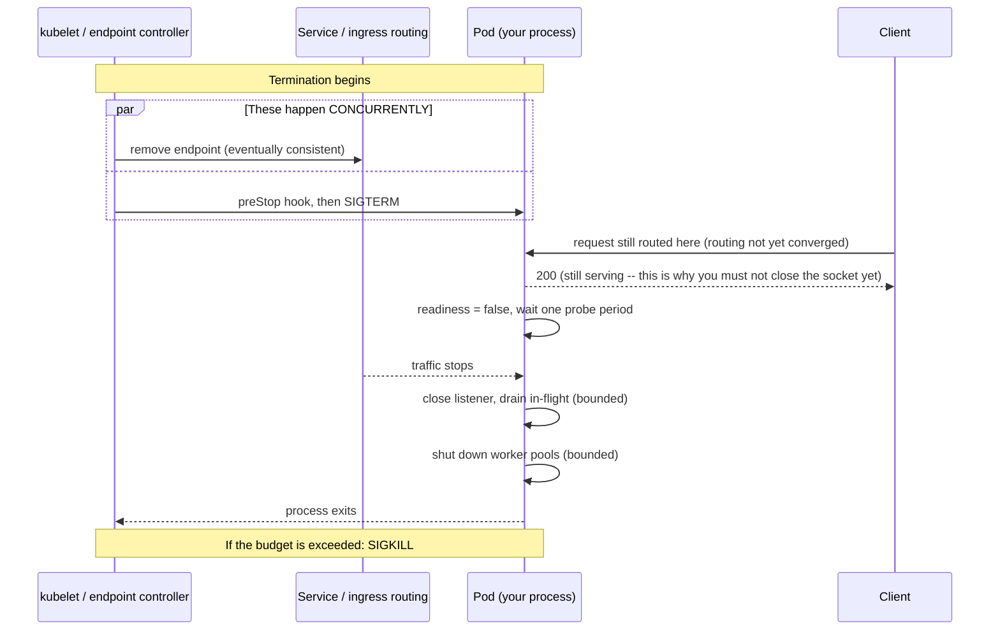
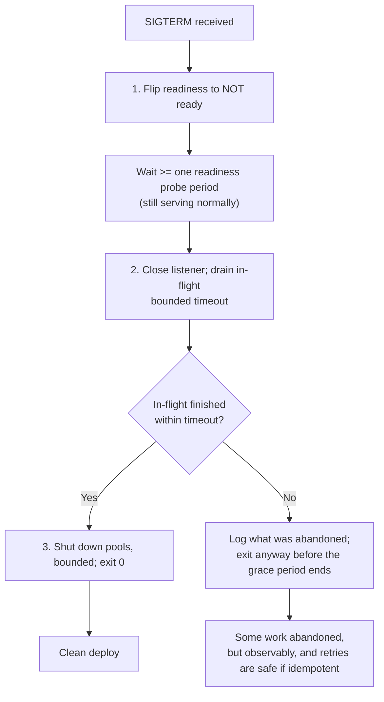

# Graceful Shutdown and Connection Draining

> **Topic register:** T-2434 · Core tier · High interview frequency [H]
> **Provenance:** every behavioral claim below is real, executed output from
> [`practice/java/devops/graceful-shutdown/`](../../practice/java/devops/graceful-shutdown/README.md)
> (OpenJDK 21.0.12) — two servers differing only in their `SIGTERM` handling,
> each sent `SIGTERM` one second into a three-second request. One client got
> `curl: (52) Empty reply from server` and HTTP status `000`; the other got a
> normal `200` and the process exited 2006 ms later.

## Table of Contents

1. [Learning Objectives](#learning-objectives)
2. [Why This Matters in Interviews](#why-this-matters-in-interviews)
3. [Level 1 — Foundation](#level-1-foundation)
4. [Level 2 — Working Knowledge](#level-2-working-knowledge)
5. [Mental Model](#mental-model)
6. [Definition and Purpose](#definition-and-purpose)
7. [Core Concepts](#core-concepts)
8. [Internal Implementation](#internal-implementation)
9. [Diagrams](#diagrams)
10. [Java Examples](#java-examples)
11. [Production Scenarios](#production-scenarios)
12. [Trade-offs](#trade-offs)
13. [Decision Framework](#decision-framework)
14. [Common Mistakes](#common-mistakes)
15. [Anti-Patterns](#anti-patterns)
16. [Best Practices](#best-practices)
17. [Interview Answer Framework](#interview-answer-framework)
18. [Interview Questions](#interview-questions)
19. [Summary](#summary)
20. [Key Takeaways](#key-takeaways)
21. [Cheat Sheet](#cheat-sheet)
22. [Flashcards](#flashcards)
23. [Practice Exercises](#practice-exercises)
24. [Solutions](#solutions)
25. [Additional Reading](#additional-reading)
26. [Official References](#official-references)

---

## Learning Objectives

By the end of this chapter you can:

- Describe what actually happens between `kubectl delete pod` and the container disappearing, in order, and name which step is yours to implement.
- Explain why flipping readiness *before* closing the listening socket is the single most important ordering decision, and what breaks when you reverse it.
- Implement a shutdown hook that drains in-flight work under a bounded timeout, and explain why every wait must be bounded.
- Diagnose a "deploys cause a spike of 502s" report without guessing.
- Extend the same reasoning to workers and consumers, where there is no load balancer to remove you from.

## Why This Matters in Interviews

This is the question that separates "I have deployed to Kubernetes" from "I have been on call for a service deployed to Kubernetes." The symptom — a burst of errors during every rolling deploy, which nobody investigates because the deploy finishes and the graph recovers — is common enough that most interviewers have lived it. They ask it because the correct answer is a *sequence*, not a fact, and a candidate who has only read about it usually produces the steps in the wrong order.

It also probes something broader: whether you think about a process as a participant in a distributed system rather than as a program. A process that exits cleanly from its own point of view can still be destructive from the cluster's, because other components hold state about it — routing tables, connection pools, consumer group assignments — that takes real time to converge.

Finally, it is one of the few operational topics with a crisp, demonstrable cost. You do not have to argue about it; you can measure a dropped request.

## Level 1 — Foundation

When a container needs to stop — a new version is being deployed, a node is being drained, the pod is being rescheduled — the platform does not simply destroy it. It asks first, and then, after a grace period, insists.

The asking is a **signal**: `SIGTERM`, delivered to process 1 in the container. A signal is an operating-system message to a running process. `SIGTERM` means "please stop"; the process is allowed to decide how, and how long to take.

The insisting is `SIGKILL`, delivered after the grace period expires (30 seconds by default in Kubernetes). `SIGKILL` cannot be caught, blocked, or delayed. The process is destroyed where it stands, mid-request, mid-write, mid-anything.

So every process has exactly two behaviors available:

- **Do nothing on `SIGTERM`.** The JVM's default behavior is to exit almost immediately. Anything in flight is lost.
- **Handle `SIGTERM`.** Stop taking new work, finish what you already accepted, then exit — before the grace period runs out.

The difference is measurable. Both servers below are identical except for the handler, and both received `SIGTERM` one second into a three-second request:

```text
[client] curl: (52) Empty reply from server
[client] /work HTTP status: 000, total 1.378310s
```

```text
[server] SIGTERM received
[server] readiness flipped to NOT ready; in-flight requests: 1
[server] no longer accepting new connections; draining up to 10s
[server] request finished
[client] /work HTTP status: 200, total 3.004853s
[server] shutdown complete in 2006ms; completed=1 rejected=0
```

Status `000` is not a server error. It means there was no HTTP response at all — the connection died. A client cannot retry "on 5xx" when there is no status code, and if the request was a payment, nobody knows whether it happened.

## Level 2 — Working Knowledge

The part that surprises people is that handling `SIGTERM` is necessary but not sufficient. A process can drain its in-flight work perfectly and still cause errors, because of *who else* is still sending it traffic.

When Kubernetes terminates a pod, two things happen **concurrently**, not in sequence:

1. The kubelet sends `SIGTERM` to the container.
2. The pod's endpoint is removed from the Service, which eventually propagates to kube-proxy on every node, to any ingress controller, and to any client-side load balancer.

Step 2 is eventually consistent and takes real time — typically hundreds of milliseconds to a couple of seconds, depending on cluster size and controller behavior. During that window, **new requests are still being routed to a pod that has already been told to stop**. If your shutdown hook immediately closes the listening socket, those requests are refused at the TCP level, and the client sees a connection error rather than a retryable response.

Hence the ordering that the demo's hook follows, and the reason it does three separate things:

1. **Stop declaring readiness.** Flip the flag your readiness probe reads, so the platform starts removing you from rotation. Then *wait* — at least one readiness probe period — while still serving normally.
2. **Stop accepting new connections and drain.** Close the listener, let in-flight requests finish, under a bounded timeout.
3. **Shut down worker pools and background tasks**, also bounded, then exit.

The demo's output shows exactly this: the readiness flip is logged while one request is still in flight, then the drain, then the request completing normally, then the clean exit at 2006 ms — which is the remaining 2 seconds of real work plus the readiness pause, not an arbitrary sleep.

## Mental Model

Think of a shop closing. The wrong way is to lock the front door the instant you decide to close, trapping the customers already inside and slamming the door on people mid-step through it. The right way is to **take the "open" sign down first**, keep serving everyone already inside and everyone who walks in during the next minute, and only then lock the door once the flow has stopped.

The sign is your readiness probe. The customers inside are in-flight requests. The minute is the propagation delay you must wait through. `SIGKILL` is the landlord cutting the power at a fixed time regardless of who is still inside — which is why every step of yours must be bounded and must fit inside the grace period.

## Definition and Purpose

**Graceful shutdown** is a process's coordinated response to a termination signal: refuse new work, complete accepted work within a bounded window, release resources, and exit before being killed.

**Connection draining** is the load-balancer-side half: stopping new connections to an instance while allowing established ones to complete.

The two exist because distributed systems have no instantaneous agreement. A process's own knowledge that it is stopping arrives before anyone else's, and everything that goes wrong in this topic comes from acting on that knowledge too aggressively or too late.

Per the [Kubernetes pod lifecycle documentation](https://kubernetes.io/docs/concepts/workloads/pods/pod-lifecycle/#pod-termination), the sequence on deletion is: the pod is marked Terminating, the endpoint controller removes it from Service endpoints, any `preStop` hook runs, `SIGTERM` is sent, and after `terminationGracePeriodSeconds` (default 30) `SIGKILL` follows. The endpoint removal and the `preStop`/`SIGTERM` path proceed in parallel — which is precisely the problem this chapter exists to solve.

## Core Concepts

### The grace period is a budget, and everything must fit inside it

`terminationGracePeriodSeconds` is a hard ceiling on the entire sequence: `preStop` hook plus your drain plus your cleanup. If the sum exceeds it, `SIGKILL` arrives mid-drain and you are back to dropped requests, only later and more confusingly.

Budget it explicitly. If the p99 request takes 4 seconds and you wait 2 seconds for readiness propagation, you need at least 6, plus margin — so a 30-second default is fine, but a service with a 60-second export endpoint needs a raised grace period *and* a drain timeout that is shorter than it.

### `preStop` is how you buy propagation time without touching your code

Kubernetes runs a `preStop` hook *before* sending `SIGTERM`. A hook that simply sleeps is the standard, blunt way to hold the pod open while endpoint removal propagates:

```yaml
lifecycle:
  preStop:
    exec:
      command: ["sh", "-c", "sleep 5"]
```

During that sleep the container is still serving normally, but it has already been removed from the endpoint list, so traffic tapers off. It is crude and it works. The in-process equivalent — flip readiness, then sleep before closing the listener — is better because it does not depend on a pod spec someone might copy without understanding, but you frequently see both.

Note the ordering consequence: the grace period clock starts when termination begins, and the `preStop` sleep spends part of your budget.

### Readiness and liveness answer different questions during shutdown

A readiness probe failing means "stop sending me traffic." A liveness probe failing means "restart me." During shutdown you want the first and emphatically not the second — a liveness probe that fails during a long drain can cause the container to be killed and restarted, which is the opposite of what you asked for. Keep liveness answering `200` until the process actually exits; only readiness flips. This is the same probe distinction covered in [Kubernetes Resource Limits, Probes, and JVM Sizing](kubernetes-resource-limits-probes-and-jvm-sizing.md), applied to the termination path.

### Draining is not only HTTP

An HTTP server is the easy case, because request boundaries are obvious. The harder cases are the ones people forget:

- **Message consumers** have no load balancer to remove them from. Graceful shutdown means: stop polling for new messages, finish processing what you already hold, commit offsets, then leave the consumer group. Leaving without committing means the whole batch is redelivered, which is only safe if consumers are idempotent — see [Idempotency](../11-system-design/idempotency.md) and [Consumer Groups and Rebalancing](../09-messaging-event-driven/consumer-groups-and-rebalancing.md).
- **Scheduled jobs** should not start a new run during shutdown, and a run in progress must either finish or be safely abandonable.
- **Background executors** need `shutdown()` plus a bounded `awaitTermination`, then `shutdownNow()`. Calling only `shutdown()` and waiting forever converts a fast deploy into a `SIGKILL`.
- **Long-lived connections** (WebSocket, SSE, gRPC streams) need an application-level goodbye — a close frame or `GOAWAY` — so clients reconnect deliberately rather than discovering a dead socket. See [Real-Time Delivery: WebSocket, SSE, and Long Polling](../11-system-design/realtime-delivery-websocket-sse-and-long-polling.md).

### Idempotency is what makes the remaining failures survivable

Even a perfect shutdown can lose a request: a node can fail, `SIGKILL` can arrive, a network partition can drop the response after the work committed. The design goal is not "never lose a request" but "a retry is always safe." Graceful shutdown reduces the frequency of forced retries; idempotency makes the retries harmless. A team that has one without the other still has an incident.

## Internal Implementation

**What the JVM does with `SIGTERM`.** The JVM installs a handler that starts the shutdown sequence: it runs all registered shutdown hooks (as threads, concurrently, in unspecified order), then exits. `Runtime.getRuntime().addShutdownHook(Thread)` is the registration point. Hooks also run on normal `System.exit()`. They do **not** run on `SIGKILL`, on a hard JVM crash, or on `Runtime.halt()`.

Two consequences matter. First, because hooks run concurrently and in unspecified order, ordering *within* a single hook is the only ordering you control — which is why the demo does all three phases in one hook rather than registering three. Second, a hook that blocks forever blocks the exit forever, until the platform kills the process; every wait inside a hook must have a timeout.

**What the demo's hook actually does**, in the order that matters:

```java
Runtime.getRuntime().addShutdownHook(new Thread(() -> {
    ACCEPTING.set(false);        // 1. readiness flips; still serving
    sleep(500);                  //    let endpoint removal propagate
    server.stop(10);             // 2. stop accepting; drain in-flight, bounded
    workers.shutdown();          // 3. stop the pool
    workers.awaitTermination(10, TimeUnit.SECONDS);  // bounded
}));
```

`HttpServer.stop(delay)` closes the listening socket immediately and then blocks up to `delay` seconds waiting for active exchanges to complete. The measured result: `shutdown complete in 2006ms; completed=1 rejected=0` — 500 ms of readiness pause plus the ~1500 ms remaining on the in-flight request, with nothing dropped and nothing rejected.

**Why the request that arrives during the drain gets a 503, not a dropped connection.** The demo's handler checks the readiness flag and responds `503 draining` for requests that arrive after the flip. A `503` is a *retryable* response with a status code; a closed connection is not. Failing fast with a real status is strictly better than either accepting work you cannot finish or refusing at the TCP level.

**Spring Boot's built-in version.** `server.shutdown=graceful` plus `spring.lifecycle.timeout-per-shutdown-phase` implements phases 2 and 3 for the embedded server and the application context. It does **not** implement phase 1 — the readiness flip and the wait for propagation — which is why Spring Boot services still drop requests on deploy unless the readiness state is managed too (via `ApplicationAvailability` / the `readiness` actuator group, or a `preStop` sleep). Knowing that the framework covers only two of the three phases is a strong interview detail.

## Diagrams



The parallel block is the entire difficulty of this topic. Your process learns it is stopping before the routing layer does, and the correct response to that head start is to keep serving, not to stop.



## Java Examples

Full, runnable sources at [`practice/java/devops/graceful-shutdown/`](../../practice/java/devops/graceful-shutdown/README.md).

**The readiness flag both the probe and the handler read:**

```java
private static final AtomicBoolean ACCEPTING = new AtomicBoolean(true);

private static void readyz(HttpExchange exchange) throws IOException {
    boolean ready = ACCEPTING.get();
    respond(exchange, ready ? 200 : 503, (ready ? "ready" : "not ready") + "\n");
}

private static void work(HttpExchange exchange) throws IOException {
    if (!ACCEPTING.get()) {
        respond(exchange, 503, "draining\n");   // retryable, with a status code
        return;
    }
    // ... real work ...
}
```

**A consumer's shutdown, where there is no load balancer to leave:**

```java
// Sketch: the same three phases, applied to a polling consumer.
private final AtomicBoolean running = new AtomicBoolean(true);

void consumeLoop() {
    while (running.get()) {
        var records = consumer.poll(Duration.ofMillis(500));
        process(records);
        consumer.commitSync();          // commit before we can be told to stop
    }
    consumer.close(Duration.ofSeconds(10));  // leaves the group; bounded
}

// In the shutdown hook:
running.set(false);                     // 1. stop taking new work
consumerThread.join(15_000);            // 2. let the current batch finish, bounded
```

The commit point is the whole design: stopping between batches with offsets committed means the next consumer starts exactly where this one stopped. Stopping mid-batch without committing means redelivery, which is safe only if processing is idempotent.

## Production Scenarios

### Scenario: every deploy produces a 30-second burst of 502s that nobody has ever investigated

**Symptoms.** During each rolling deploy, the ingress reports a spike of 502s lasting roughly as long as the rollout. Error budget burn is visible on the SLO dashboard but no alert fires, because the burst is short and the service recovers on its own. The team has normalized it as "deploy noise."

**Initial hypotheses.** New version failing health checks; a bad image; connection pool exhaustion during warm-up.

**Evidence collected.** The 502s correlate exactly with pod terminations, not pod starts — visible by comparing the error timestamps with the old pods' termination timestamps rather than the new pods' ready timestamps. Application logs from terminating pods show the process exiting within ~50 ms of `SIGTERM`, with no drain. Ingress logs show requests being sent to those pod IPs for 1–2 seconds *after* the process exited.

**Diagnosis.** No shutdown handling at all, plus the endpoint-propagation window. Both halves contribute: the process drops the requests it already accepted (that is the missing drain), and the routing layer keeps sending new ones to a socket that is already closed (that is the missing readiness flip and wait). The 502s are the ingress's report of connecting to a dead backend.

**Immediate mitigation.** Add a `preStop` hook sleeping 5 seconds. This does not fix the dropped in-flight requests, but it removes the larger half — new requests routed to a dead pod — without a code change or a redeploy of the application image. Measured effect in this class of incident is typically most of the burst.

**Permanent remediation.** Implement the three-phase hook in the application: readiness flip, bounded drain, bounded pool shutdown. Then remove the `preStop` sleep or reduce it, and verify by watching a deploy with the error graph filtered to terminating pods only.

**Trade-offs.** Deploys get slower by roughly the drain window per pod, which for a large deployment with a low `maxUnavailable` is a real increase in rollout duration. That is the correct trade: a slower deploy that drops nothing beats a fast one that drops requests, and if rollout duration matters, raise `maxSurge` rather than shorten the drain.

**Prevention.** A deploy-time check that the error rate during rollout stays within the same band as steady state, and a platform default (a base image entrypoint, or a shared library) so new services inherit the behavior instead of each rediscovering it.

### Scenario: a payment service double-charges a handful of customers after a routine deploy

**Symptoms.** Six duplicate charges, all timestamped within the deploy window.

**Diagnosis.** The client retried on connection failure — correct behavior. The server had accepted the charge, committed it to the payment provider, and was killed before writing its own record and responding. The retry found no record of the first attempt and charged again. The dropped connection is the trigger; the absence of an idempotency key is the actual defect.

**Remediation.** Both halves, in this order: idempotency keys on the charge endpoint so a retry is safe regardless of why it happened, then graceful shutdown so the retries are rarer. Fixing only the shutdown reduces the frequency of an unsafe operation without making it safe — the same failure returns on the next node failure or `SIGKILL`.

**Interview lesson.** This is the answer to "why isn't graceful shutdown enough?" — it is a frequency reduction for an event that will still happen, so correctness has to come from idempotency.

## Trade-offs

| Choice | Gains | Costs |
|---|---|---|
| No handling | Nothing to build or maintain | Dropped requests on every deploy, node drain, and scale-down |
| `preStop` sleep only | One line of YAML, no code change, removes most of the burst | Does not save in-flight work; spends grace-period budget; easy to copy without understanding |
| Full three-phase hook | Correct across deploys, drains, and scale-down | Real code to write and test; slower rollouts; every wait must be bounded and budgeted |
| Long drain timeouts | More work completes | Longer deploys; risk of exceeding the grace period and being `SIGKILL`ed mid-drain |
| Idempotent operations | Retries are always safe, whatever the cause | Requires keys, storage, and deduplication logic |

## Decision Framework

1. **What is the longest request this process can be serving?** That, plus the readiness propagation wait, plus margin, is your minimum grace period. If the answer is "unbounded" (a streaming export), you need a cancellation story, not a longer timeout.
2. **Who routes traffic to it, and how long does that routing take to converge?** Kubernetes Service, ingress controller, client-side load balancer, and service mesh each have their own propagation delay. The slowest one sets your readiness wait.
3. **Is this a server or a consumer?** Servers flip readiness; consumers stop polling and commit. There is no readiness probe for a Kafka consumer.
4. **Can the work be safely retried?** If not, fix that first. Graceful shutdown reduces the number of retries; it does not make an unsafe one safe.
5. **Does the framework already do part of it?** Spring Boot covers drain and context shutdown, not the readiness phase. Know which half you still owe.
6. **How would you notice a regression?** If the answer is "a customer tells us," add the deploy-window error check before you add anything else.

## Common Mistakes

- **Closing the listening socket first.** The intuitive order is exactly backwards; readiness must flip first, and you must keep serving while routing converges.
- **Unbounded waits in a shutdown hook.** `awaitTermination` with no timeout, or a `join()` with no limit, turns a clean shutdown into a `SIGKILL` at the grace-period boundary.
- **Letting liveness fail during the drain.** The container gets restarted mid-shutdown, which is the opposite of the goal.
- **Assuming a drain timeout shorter than p99 is fine.** It quietly abandons the slowest requests, which are disproportionately the expensive ones.
- **Forgetting non-HTTP work** — consumers, schedulers, in-flight async tasks, open streams.
- **Treating `SIGKILL` as a bug.** It is the platform's contract. Your job is to fit inside the budget, not to ask for more time indefinitely.

## Anti-Patterns

- **`Thread.sleep(30_000)` as the entire hook.** Slow, arbitrary, and still drops whatever outlives the sleep.
- **A `preStop` sleep longer than the grace period.** `SIGKILL` then lands during the sleep, and no shutdown logic runs at all.
- **Catching `SIGTERM` and ignoring it** to "protect" long jobs. The platform kills you anyway; you have only removed your own chance to react.
- **Per-service shutdown implementations** that each differ subtly. This belongs in a shared library or base image so it is correct once.
- **Verifying only that the process exits cleanly.** The question is whether *clients* saw errors, which requires looking at the client side, as the demo does.

## Best Practices

- Implement all three phases, in order, and log each transition — the demo's log lines are what make the behavior auditable in production.
- Bound every wait, and make every timeout sum to less than the grace period.
- Return `503` to requests arriving during the drain, rather than closing the connection: a status code is retryable, a dead socket is not.
- Keep liveness healthy until the process actually exits.
- Raise `terminationGracePeriodSeconds` deliberately when p99 demands it, and write down the arithmetic.
- Pair this with idempotency for anything that mutates state.
- Test it the way the demo does: send `SIGTERM` mid-request and assert on what the *client* received.

## Interview Answer Framework

### 30-Second Answer

On `SIGTERM` the process must stop taking new work, finish what it already accepted, and exit before `SIGKILL` arrives at the end of the grace period. The critical ordering detail is that readiness must flip *first*, with the process still serving, because endpoint removal is eventually consistent — closing the socket immediately means new requests are still being routed to a dead listener. Without this, every deploy drops requests.

### 2-Minute Answer

Add the concrete sequence and the measurement. Kubernetes marks the pod Terminating, removes it from Service endpoints, runs `preStop`, and sends `SIGTERM`, with endpoint removal proceeding *in parallel* with the signal — so the process knows before the routing layer does. The correct hook is three phases: flip readiness and keep serving for at least a probe period, then close the listener and drain in-flight work under a bounded timeout, then shut down worker pools, also bounded. I have measured the difference directly: with no handling, a request one second into a three-second call returned `curl: (52) Empty reply from server` with HTTP status `000` — no status code for a client to retry on. With the hook, the same request completed with a `200` and the process exited 2006 ms after `SIGTERM`. Close by noting that Spring Boot's `server.shutdown=graceful` covers the drain but not the readiness phase.

### 10-Minute Deep Dive

Cover: the parallel termination sequence and why it creates the ordering requirement; the grace period as a budget every timeout must fit inside; `preStop` as the blunt way to buy propagation time and what it costs; readiness versus liveness during shutdown; why a `503` beats a closed connection; the non-HTTP cases (consumers committing offsets before leaving the group, schedulers, streams needing an application-level goodbye); the JVM's shutdown-hook semantics including concurrent unspecified order and the fact that hooks do not run on `SIGKILL` or `halt()`; and the closing argument that idempotency is what makes the residual failures survivable.

### Whiteboard Explanation

Draw a timeline. Mark `t=0` as "termination begins" and draw **two parallel arrows**: one to "endpoint removed → routing converges" and one to "preStop → SIGTERM → your hook". Shade the gap between them and label it "requests still arriving at a pod that knows it is dying." Then write the three phases under the second arrow, and mark `SIGKILL` at `t=grace period` as a hard wall. The shaded gap is the whole answer.

### Production Example

The deploy-time 502 burst: errors correlated with pod *terminations* rather than starts, ingress logs showing traffic to a pod 1–2 seconds after its process exited, mitigated same-day with a `preStop` sleep and fixed properly with a three-phase hook.

### Trade-offs to Mention

Slower rollouts in exchange for zero dropped requests; raise `maxSurge` rather than shorten the drain if rollout time matters. Longer drains risk exceeding the grace period, which converts a clean shutdown into `SIGKILL` at the worst possible moment.

### Common Candidate Mistakes

Describing only "add a shutdown hook" with no ordering; not knowing endpoint removal is eventually consistent; unbounded waits; forgetting consumers and background work; never mentioning idempotency.

### Typical Follow-Up Questions

"What if the drain takes longer than the grace period?" → "How does this differ for a Kafka consumer?" → "Does Spring Boot handle this for you?" → "Why a 503 rather than just closing the connection?" → "How would you prove the fix worked?" → "Why isn't graceful shutdown enough on its own?"

### Senior-Level Expectations

States the sequence in the right order with the propagation reason, bounds every wait, covers non-HTTP work, and can describe how they verified it from the client side.

### Staff-Level Discussion

Treats it as a platform default rather than a per-service task. Every service independently rediscovering this produces N subtly different implementations and N chances to get the ordering wrong, so the shutdown sequence belongs in a shared base image, a starter, or a service template, with the grace period and drain timeout exposed as reviewed configuration rather than per-team folklore. The rollout policy is part of the same decision: `maxUnavailable`, `maxSurge`, and the drain window jointly determine both deploy duration and error budget consumption, and tuning one without the others is how teams end up trading an invisible error burst for a slow rollout or the reverse. Finally, the residual-risk framing matters at this level: graceful shutdown is a frequency reduction, not a correctness guarantee, so the organizational requirement is idempotency for state-changing operations — and that is a review standard, not a library.

## Interview Questions

### Question 1 — What happens between `kubectl delete pod` and the container disappearing, and which part is your code's responsibility?

**Why interviewers ask it.** It checks whether the candidate understands the platform contract or has only added a shutdown hook because a blog post said to.

**Expected answer.** The pod is marked Terminating; the endpoint controller removes it from Service endpoints while, **in parallel**, the kubelet runs any `preStop` hook and sends `SIGTERM`; after `terminationGracePeriodSeconds` (default 30) `SIGKILL` follows and cannot be caught. The application's responsibility is everything between `SIGTERM` and exit: flip readiness, keep serving while routing converges, then close the listener and drain in-flight work, then shut down pools — all bounded so the total fits inside the grace period.

**Minimum acceptable answer.** Knows `SIGTERM` comes first, `SIGKILL` follows after a grace period, and the app should finish in-flight work.

**Strong Senior answer.** Emphasizes that endpoint removal is eventually consistent and concurrent with the signal, which is why the process must keep serving after being told to stop, and treats the grace period as a budget every timeout must fit inside.

**Staff-level extension.** Frames it as a platform default: the sequence belongs in a shared base image or service template with reviewed timeouts, because N services implementing it independently produces N chances to get the ordering wrong.

**Common mistakes.** Believing endpoint removal completes before `SIGTERM`; thinking `SIGKILL` can be handled; ignoring that `preStop` spends part of the budget.

**Likely follow-ups.** "What if your drain needs 60 seconds?" (Raise the grace period deliberately and write down the arithmetic; if the work is unbounded, you need cancellation, not a longer timeout.) "Do shutdown hooks always run?" (Not on `SIGKILL`, a JVM crash, or `Runtime.halt()`.)

**Evaluation criteria.** Correct sequence, recognizes the concurrency, and identifies the readiness phase as application responsibility.

### Question 2 — Every deploy produces a burst of 502s. Walk me through the diagnosis and the fix.

**Why interviewers ask it.** It is the real symptom, and the diagnosis requires distinguishing pod starts from pod terminations.

**Expected answer.** Correlate the errors with pod *terminations*, not starts. Two contributing causes: the terminating process drops requests it already accepted (missing drain), and the routing layer keeps sending new requests to it for a second or two after the socket closes (missing readiness flip and wait). Immediate mitigation is a `preStop` sleep of a few seconds, which needs no code change and removes the larger half. The real fix is the three-phase hook, after which the `preStop` sleep can be reduced or removed.

**Minimum acceptable answer.** Connects the errors to shutdown and proposes a shutdown hook.

**Strong Senior answer.** Names the evidence explicitly — ingress logs showing requests to a pod IP after its process exited — and distinguishes the two causes, since fixing only the drain leaves most of the burst in place. Notes the rollout-duration trade-off and that the right lever is `maxSurge`, not a shorter drain.

**Staff-level extension.** Adds the verification and prevention layer: a deploy-time check that error rate during rollout stays within the steady-state band, and moving the behavior into a platform default so new services inherit it.

**Common mistakes.** Blaming the new version's startup; adding a longer `initialDelaySeconds` to the readiness probe of the *new* pods, which addresses a different problem entirely.

**Likely follow-ups.** "Why is a `preStop` sleep not the complete fix?" (It does not save already-accepted in-flight work.) "How would you prove the fix worked?" (Same graph filtered to terminating pods, across a deploy.)

**Evaluation criteria.** Correlates with terminations, separates the two causes, offers a fast mitigation and a real fix, and states how they would verify.

### Question 3 — How does graceful shutdown differ for a Kafka consumer, and why isn't it enough on its own?

**Why interviewers ask it.** Consumers have no readiness probe and no load balancer, so the pattern must be re-derived rather than recalled.

**Expected answer.** There is nothing to remove you from rotation — you remove *yourself* from the consumer group. Stop polling for new records, finish processing what you already hold, commit offsets, then close the consumer with a bounded timeout so it leaves the group promptly and triggers one clean rebalance rather than a session-timeout-driven one. Stopping mid-batch without committing means those records are redelivered to whoever takes the partition.

**Minimum acceptable answer.** Knows to stop polling and finish the current batch before exiting.

**Strong Senior answer.** Identifies the commit point as the design decision, notes that a prompt `close()` produces a faster, cleaner rebalance than letting the session time out, and states that redelivery is safe only if processing is idempotent.

**Staff-level extension.** Points out that graceful shutdown is a *frequency reduction*, not a correctness guarantee — node failures and `SIGKILL` will still happen — so the organizational requirement is idempotency for state-changing operations, enforced as a review standard. Cites the double-charge shape: the client's retry was correct behavior; the missing idempotency key was the defect.

**Common mistakes.** Committing offsets before processing completes; calling `System.exit()` from inside the poll loop; assuming the group rebalances instantly.

**Likely follow-ups.** "What about a scheduled job mid-run?" (Either finish it within budget or make it safely abandonable and resumable.) "What about an open WebSocket?" (Send an application-level close so the client reconnects deliberately.)

**Evaluation criteria.** Re-derives the pattern without a load balancer, identifies the commit point, and connects to idempotency without being led there.

## Summary

Termination is a race between your process learning it is stopping and the rest of the system learning the same thing, and your process always finds out first. The correct response to that head start is to keep serving while flipping readiness, then close the listener and drain in-flight work under a bounded timeout, then shut down pools — all inside the grace period, after which `SIGKILL` ends the discussion. Measured directly, the difference between doing this and not doing it is a client receiving a normal `200` versus receiving no HTTP status at all. Consumers follow the same shape without a load balancer: stop polling, finish, commit, leave. And because some terminations will always be ungraceful, idempotency is what turns the residual failures into harmless retries.

## Key Takeaways

- `SIGTERM` is a request with a deadline; `SIGKILL` at the end of the grace period is not negotiable.
- Endpoint removal is eventually consistent and runs *concurrently* with the signal — so flip readiness first and keep serving.
- Every wait in a shutdown hook must be bounded, and all of them must sum to less than the grace period.
- Prefer `503` over a closed connection during the drain: a status code is retryable, a dead socket is not.
- Spring Boot's graceful shutdown covers the drain, not the readiness phase.
- Consumers have no load balancer: stop polling, finish, commit, leave the group promptly.
- Graceful shutdown reduces forced retries; idempotency is what makes them safe.

## Cheat Sheet

Condensed version: [`cheat-sheets/graceful-shutdown-and-connection-draining.md`](../../cheat-sheets/graceful-shutdown-and-connection-draining.md).

## Flashcards

Review deck: [`flashcards/graceful-shutdown-and-connection-draining.md`](../../flashcards/graceful-shutdown-and-connection-draining.md).

## Practice Exercises

1. Run the demo's two cases and compare the client output. Then change the graceful case's readiness pause to 0 and explain what you would expect to change in a real cluster (and why the local demo cannot show it).
2. Set the drain timeout shorter than the request duration. Observe what the client receives and what the server logs, and decide which is worse: a `503`, or a dropped connection.
3. Add a second request that arrives *after* the readiness flip. Confirm it receives `503 draining` rather than being dropped.
4. Write the shutdown sequence for a consumer that processes batches of 500 messages taking 20 seconds. State your grace period and every timeout, with the arithmetic.
5. Take a service you work on and write down the longest possible request, the routing convergence time, and the grace period. Decide whether the numbers are consistent.

## Solutions

1. Removing the pause makes no visible difference locally, because there is no load balancer holding stale routing — which is exactly why this bug survives local testing and appears only in a cluster.
2. The `503` is strictly better: it carries a status code, so a client retry policy can act on it. A dropped connection gives the client nothing to distinguish "never arrived" from "completed but the response was lost."
3. It should receive `503 draining`. If it is dropped instead, the listener was closed before the flag was checked — the ordering bug this chapter is about, reproduced in miniature.
4. Roughly: 20 s for the in-flight batch, plus commit time, plus margin — so a 30-second grace period is already tight and a batch-size reduction or a mid-batch commit strategy is the better answer than a 60-second grace period.
5. If the longest request plus convergence time exceeds the grace period, you are relying on `SIGKILL` not landing at a bad moment. That is a finding worth writing down.

## Additional Reading

- [Kubernetes Resource Limits, Probes, and JVM Sizing](kubernetes-resource-limits-probes-and-jvm-sizing.md) — readiness versus liveness in normal operation.
- [CI/CD Pipeline Design and Deployment Strategies](cicd-pipeline-design-and-deployment-strategies.md) — rolling, blue-green, and canary, all of which depend on this working.
- [Idempotency](../11-system-design/idempotency.md) — what makes the residual failures survivable.
- [Consumer Groups and Rebalancing](../09-messaging-event-driven/consumer-groups-and-rebalancing.md) — what leaving a group promptly buys you.
- [Resilience Patterns](../11-system-design/resilience-patterns.md) — retries and circuit breaking on the client side of the same failure.

## Official References

- [Kubernetes — Pod Lifecycle: Termination](https://kubernetes.io/docs/concepts/workloads/pods/pod-lifecycle/#pod-termination)
- [Kubernetes — Container Lifecycle Hooks](https://kubernetes.io/docs/concepts/containers/container-lifecycle-hooks/)
- [Spring Boot Reference — Graceful Shutdown](https://docs.spring.io/spring-boot/reference/web/graceful-shutdown.html)
