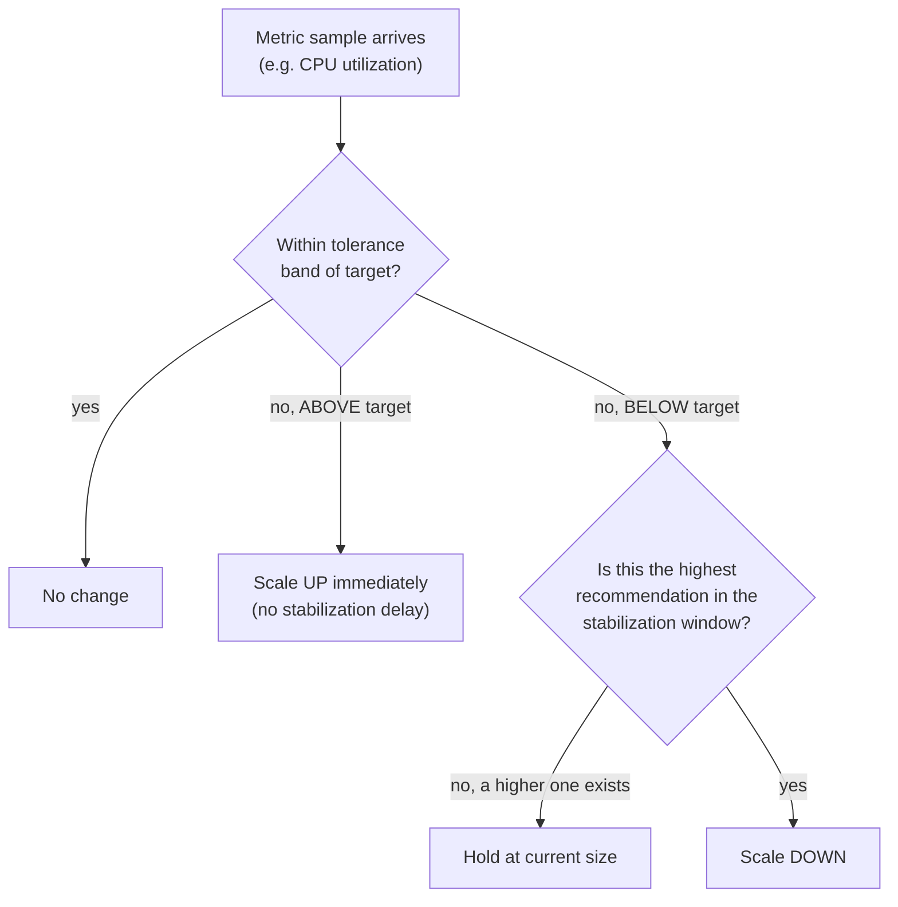
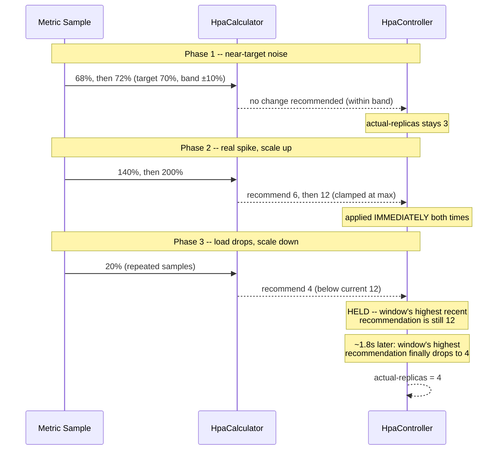

# Horizontal Pod Autoscaling: Mechanics, Metrics, and Scaling Behavior

> **Topic register:** T-2424 · Advanced tier, Moderate-High interview frequency (new gap-audit topic — no entry in the original Master Topic Register)
> **Provenance:** all evidence in this chapter is real, executed output from
> [`practice/java/devops/horizontal-pod-autoscaler-mechanics/`](../../practice/java/devops/horizontal-pod-autoscaler-mechanics/README.md)
> (OpenJDK 21.0.12): a real, timed simulation of the documented Kubernetes
> HPA algorithm — no mocked clock — proving the tolerance band suppresses
> noise, scale-up applies immediately, and scale-down is genuinely delayed
> by a measured stabilization window.

## Table of Contents

1. [Learning Objectives](#learning-objectives)
2. [Why This Matters in Interviews](#why-this-matters-in-interviews)
3. [Level 1 — Foundation](#level-1-foundation)
4. [Level 2 — Working Knowledge](#level-2-working-knowledge)
5. [Mental Model](#mental-model)
6. [Definition and Purpose](#definition-and-purpose)
7. [Core Concepts](#core-concepts)
8. [Internal Implementation](#internal-implementation)
9. [Diagrams](#diagrams)
10. [Production Scenarios](#production-scenarios)
11. [Trade-offs](#trade-offs)
12. [Decision Framework](#decision-framework)
13. [Common Mistakes](#common-mistakes)
14. [Anti-Patterns](#anti-patterns)
15. [Best Practices](#best-practices)
16. [Interview Answer Framework](#interview-answer-framework)
17. [Interview Questions](#interview-questions)
18. [Summary](#summary)
19. [Key Takeaways](#key-takeaways)
20. [Cheat Sheet](#cheat-sheet)
21. [Flashcards](#flashcards)
22. [Practice Exercises](#practice-exercises)
23. [Solutions](#solutions)
24. [Additional Reading](#additional-reading)
25. [Official References](#official-references)

---

## Learning Objectives

By the end of this chapter you can state the real HPA formula from memory, explain why it recomputes against a tolerance band instead of reacting to every metric fluctuation, correctly describe the deliberate asymmetry between scale-up (immediate) and scale-down (stabilized) behavior, and cite a real Java simulation that measured this asymmetry directly: an instant scale-up on a real load spike, and a real, measured ~1.8-second delay before a scale-down recommendation actually took effect.

## Why This Matters in Interviews

[Kubernetes Objects, Scheduling, and Networking](kubernetes-objects-scheduling-and-networking.md) already shows a real, syntax-validated `HorizontalPodAutoscaler` manifest — but only as YAML, with zero explanation of what the controller behind it actually does. `../15-cloud/aws-core-services-for-backend-engineers.md` goes further and explicitly claims HPA is covered "per the previous chapters' Kubernetes coverage" — a claim this domain didn't actually back until this chapter. Interviewers ask about HPA specifically because `minReplicas`/`maxReplicas`/`targetUtilization` fields are easy to recite from a manifest without understanding the controller's actual decision loop — and the two properties that actually matter in a production incident (why it doesn't thrash on noise, and why scale-down lags behind scale-up) are exactly the parts a YAML-only understanding misses.

## Level 1 — Foundation

A home thermostat doesn't turn the furnace fully on or off every time the temperature ticks by a tenth of a degree — it has a deadband, a small range around the target where it does nothing, specifically so tiny, normal fluctuations don't cause the furnace to click on and off constantly. But when the room genuinely gets cold fast (a window left open), it reacts immediately, at full power. And when the room warms back up, a good thermostat doesn't shut off instantly at the first warm reading — it waits a bit to make sure the warmth is real, not a brief draft, before easing off. **Horizontal Pod Autoscaling (HPA)** works the same way: a tolerance band ("deadband") around the target metric suppresses noise, a real spike triggers an immediate scale-up, and a drop in load is deliberately given time to prove itself real before the fleet shrinks.



## Level 2 — Working Knowledge

At this level you should be able to state the real formula precisely: `desiredReplicas = ceil[currentReplicas * (currentMetricValue / desiredMetricValue)]`. This is the entire mechanism — no machine learning, no prediction, a single ratio applied to the current replica count. You should also know the two behaviors that separate a correct mental model from a YAML-only one: **(1)** the tolerance band (default 10%) means the controller doesn't recommend any change at all when the metric is within 10% of target in either direction — this is what stops normal noise from causing constant, wasteful scaling events; **(2)** scale-up and scale-down are NOT symmetric — a scale-up recommendation applies immediately (the default scale-up stabilization window is 0 seconds), but a scale-down recommendation is only actually applied once the *highest* recommendation across the entire stabilization window (default 300 seconds) has itself dropped below the current replica count, not just the latest sample.

Be ready to explain *why* this asymmetry exists: under-provisioning during real load is a user-facing incident; over-provisioning for a few extra minutes during a load lull is comparatively cheap. The algorithm is deliberately biased toward staying larger a little longer, in exchange for reacting to real spikes instantly.

## Mental Model

Treat HPA's behavior as two separate rules operating on the same formula: a **noise filter** (the tolerance band, symmetric, applied every sample) and a **directional bias** (scale-up trusts the latest sample immediately; scale-down only trusts the *worst-case recent* sample, via the stabilization window's max-of-window rule). Almost every HPA production surprise — thrashing, or an unexpectedly slow scale-down — traces back to one of these two rules being misunderstood, not to the core formula itself, which is simple.

## Definition and Purpose

The **Horizontal Pod Autoscaler (HPA)** is a Kubernetes controller that adjusts a Deployment's (or other scalable workload's) replica count based on an observed metric (commonly CPU or memory utilization, but any custom or external metric is supported) versus a configured target. It exists to keep a workload's capacity tracking real demand automatically — the same underlying scaling behavior [Cloud Cost and Scaling Economics](../15-cloud/cloud-cost-and-scaling-economics.md) reasons about economically, HPA is the actual Kubernetes-native mechanism that implements it.

## Core Concepts

### The formula recomputes against the CURRENT replica count every time, not a fixed baseline

`desiredReplicas = ceil[currentReplicas * (currentMetricValue / desiredMetricValue)]` uses whatever the replica count actually is *right now* as its base — not the original `minReplicas`, not the previous recommendation. This means each scaling decision is a fresh, self-consistent computation: if the fleet is already at 12 replicas running at 20% CPU against a 70% target, the formula computes `ceil(12 * 20/70) = 4` directly, without needing to "remember" how it got to 12 in the first place.

### The tolerance band is a symmetric noise filter, not a one-directional grace period

A common misconception is that the tolerance band only protects against over-eager *scale-down*. In fact it applies identically in both directions: a metric at 72% against a 70% target (within the default 10% band, 63–77%) produces zero recommended change, exactly as a metric at 68% does. This chapter's demo shows both directly — two different near-target samples, both producing `actual-replicas=3` with no `CHANGED` marker.

### Scale-up-immediate, scale-down-stabilized is a deliberate, asymmetric design choice

The stabilization window (default 300 seconds, real Kubernetes; compressed to 2000ms in this chapter's demo purely for runtime speed) only applies to scale-down. A scale-up recommendation is applied the instant it's computed. This asymmetry exists because the cost of the two mistakes is not symmetric: scaling down too eagerly risks real user-facing capacity shortfall the moment load returns; scaling up "too readily" costs a few extra minutes of infrastructure spend at worst. The controller is deliberately biased toward the cheaper mistake.

## Internal Implementation

**Real HPA algorithm** (`practice/java/devops/horizontal-pod-autoscaler-mechanics/src/HpaCalculator.java`), the exact documented Kubernetes formula plus tolerance band:

```java
public static int recommend(int currentReplicas, double currentMetricValue, double targetMetricValue,
                             int minReplicas, int maxReplicas, double tolerance) {
    double ratio = currentMetricValue / targetMetricValue;
    if (Math.abs(ratio - 1.0) <= tolerance) {
        return currentReplicas; // within the tolerance band: no recommended change
    }
    int raw = (int) Math.ceil(currentReplicas * ratio);
    return Math.max(minReplicas, Math.min(maxReplicas, raw));
}
```

**Real scale-up/scale-down asymmetry** (`HpaController.java`):

```java
if (instantRecommendation >= currentReplicas) {
    currentReplicas = instantRecommendation; // scale up: immediate
    return currentReplicas;
}
// scale down: only apply the HIGHEST recommendation within the stabilization window
int highestRecentRecommendation = recentRecommendations.stream()
        .mapToInt(Recommendation::value).max().orElse(currentReplicas);
if (highestRecentRecommendation < currentReplicas) {
    currentReplicas = highestRecentRecommendation;
}
```

Real captured output (`practice/java/devops/horizontal-pod-autoscaler-mechanics/output-transcript.txt`), target=70%, min=3, max=12:

```
=== Phase 1: near-target noise (68%, 72%) -- tolerance band should suppress both ===
  t=   0ms  metric=68.0%  actual-replicas=3
  t= 318ms  metric=72.0%  actual-replicas=3

=== Phase 2: real load spike -- scale-up applies immediately, no stabilization delay ===
  t= 620ms  metric=140.0%  actual-replicas=6  <-- CHANGED
  t= 922ms  metric=200.0%  actual-replicas=12  <-- CHANGED

=== Phase 3: load drops to 20% -- naive formula says scale down NOW, real HPA holds for the stabilization window ===
  t=1227ms  metric=20.0%  instant-formula-says=4  actual-replicas=12
  t=2750ms  metric=20.0%  instant-formula-says=4  actual-replicas=12
  t=3052ms  metric=20.0%  instant-formula-says=4  actual-replicas=4  <-- CHANGED

=== Result ===
  Naive per-sample formula recommended scaling down at t=1227ms.
  Real HPA controller actually scaled down at t=3052ms -- a real, measured 1825ms stabilization delay,
  by design: a single low sample must not immediately shrink the fleet.
  Final replica count settled at: 4
```

Re-run twice to confirm reliability: only real-clock timing jitter (a few ms) differs — every replica-count decision is identical both times.

## Diagrams



## Production Scenarios

**Symptoms.** A service's replica count oscillates visibly on a dashboard — scaling from 5 to 8 to 5 to 9 within a few minutes, generating alert noise and confusing on-call. **Initial hypotheses.** A metrics pipeline bug, or a misbehaving load balancer. **Evidence collected.** The HPA's target utilization is set unusually tight (target 70%, but the team had manually lowered the tolerance via a custom HPA behavior config to 2%, intending "more responsive" scaling) — real traffic naturally fluctuates by more than 2% minute to minute, so nearly every sample falls outside the narrowed band. **Diagnosis.** The tolerance band was configured too tight for the workload's real metric noise floor, defeating its own noise-suppression purpose. **Immediate mitigation.** Revert to the default 10% tolerance. **Permanent remediation.** Measure the workload's actual metric noise floor (the normal minute-to-minute variance under steady load) before tuning tolerance below default, and treat the change as a deliberate trade-off, not a free "more responsive" win. **Trade-offs.** A tighter tolerance band does make the system more responsive to genuine small demand shifts, at the direct cost of reacting to normal noise as if it were a real signal. **Prevention.** Treat HPA tolerance and stabilization window as tuned parameters with a real cost on both sides, the same discipline [Metric Cardinality and Alert Fatigue](../13-observability/metric-cardinality-and-alert-fatigue.md) applies to alert thresholds. **Interview lesson.** A candidate who identifies "the tolerance band was set too tight for the metric's real noise" — rather than blaming the metrics pipeline — demonstrates the precise mental model this chapter exists to build.

## Trade-offs

The default 10% tolerance band trades responsiveness for stability — a workload with genuinely fine-grained demand shifts near its target won't react to them, in exchange for not thrashing on normal noise. The default 300-second scale-down stabilization window trades a real few minutes of extra infrastructure spend (staying larger than currently needed) for protection against a brief lull causing premature shrinkage right before load returns. Both parameters are tunable per-HPA via the `behavior` field, but tuning either more aggressively directly reintroduces the risk the default was chosen to avoid.

## Decision Framework

Use the default tolerance (10%) and stabilization window (300s) unless a specific, measured workload characteristic justifies deviating — don't tune "for responsiveness" without first measuring the workload's actual metric noise floor. Consider a shorter stabilization window only for workloads where infrastructure cost dominates over stability (e.g., large batch/worker fleets where a slightly bumpier scale-down curve is acceptable). Consider a tighter tolerance only when a workload's real demand signal is provably smoother than typical (rare for request-driven services; more plausible for some queue-depth-driven workers).

## Common Mistakes

Conceptual: describing HPA as reacting to every metric change, missing the tolerance band entirely. Conceptual: assuming scale-up and scale-down behave symmetrically — a very common and costly misunderstanding when debugging a "slow to scale down" report that is, in fact, working exactly as designed. Communication: reciting the manifest's `minReplicas`/`maxReplicas`/`targetUtilization` fields without being able to explain what the controller actually does with them each sample.

## Anti-Patterns

Tightening the tolerance band "for responsiveness" without first measuring the workload's real metric noise, reintroducing thrashing. Shortening the scale-down stabilization window purely to save cost, without weighing the real risk of premature shrinkage before a load lull proves itself real. Treating a "slow scale-down" report as a bug before checking whether it's the stabilization window working as designed.

## Best Practices

Know the real formula and both of its governing rules (tolerance band, scale-up/scale-down asymmetry) well enough to explain an HPA's actual behavior from its manifest alone. Measure a workload's real metric noise floor before tuning tolerance or stabilization window away from defaults. Treat HPA tuning as a cost/stability trade-off decision, with the same rigor [Cloud Cost and Scaling Economics](../15-cloud/cloud-cost-and-scaling-economics.md) applies to reservation sizing.

## Interview Answer Framework

### 30-Second Answer

HPA computes `desiredReplicas = ceil[currentReplicas * (currentMetric/targetMetric)]`, ignores changes within a 10% tolerance band around target to avoid thrashing, and applies scale-up immediately while holding scale-down until the highest recent recommendation across a stabilization window (default 300s) has itself dropped — a deliberate bias toward staying larger a little longer.

### 2-Minute Answer

Add: the formula recomputes fresh against the current replica count every sample, not a remembered baseline. A real demo proves the mechanism directly: near-target noise (68%/72%) produces zero change; a real spike to 140% then 200% scales up in the same sample each time; a real drop to 20% load is recommended for scale-down at t=1227ms but the controller doesn't actually shrink until t=3052ms — a measured ~1.8s delay, by design.

### 10-Minute Deep Dive

Walk through both governing rules with the demo's real evidence, then the production scenario: a team that tightened the tolerance band for "responsiveness" and got visible replica-count oscillation instead, because they defeated the band's actual purpose (suppressing normal metric noise) without first measuring that noise. Connect to [Cloud Cost and Scaling Economics](../15-cloud/cloud-cost-and-scaling-economics.md)'s framing: HPA is the concrete Kubernetes mechanism behind the "autoscaling saves money when demand genuinely varies" reasoning that chapter covers economically.

### Whiteboard Explanation

Draw the tolerance band as a shaded region around a target line on a metric-over-time graph — no action inside it. Draw a spike breaching the band above target with an immediate vertical jump in replica count. Draw a dip breaching the band below target with a *delayed* step down, annotated "waits for the window's highest recent recommendation to also drop."

### Production Example

See Production Scenarios above: an over-tightened tolerance band causing real, visible replica-count oscillation, diagnosed by recognizing the band was defeating its own purpose rather than blaming the metrics pipeline.

### Trade-offs to Mention

Tolerance band width trades responsiveness for stability; stabilization window length trades scale-down speed (and cost savings) for protection against premature shrinkage; both are tunable but tuning either more aggressively reintroduces the exact risk the default protects against.

### Common Candidate Mistakes

Describing HPA as reacting to every sample. Assuming symmetric scale-up/scale-down behavior. Being unable to explain the tolerance band's purpose beyond "it's a buffer."

### Typical Follow-Up Questions

"Why doesn't HPA scale down as fast as it scales up?" "What would happen if you set the tolerance to 0%?" "How would you decide whether to shorten the default stabilization window for a specific workload?"

### Senior-Level Expectations

State the real formula and explain the tolerance band's symmetric purpose accurately, without conflating it with the (separate) scale-up/scale-down asymmetry.

### Staff-Level Discussion

Deciding whether to deviate from HPA's default tolerance/stabilization parameters for a specific workload is a real cost/stability trade-off — Staff-level framing requires first measuring the workload's actual metric noise floor and demand-lull duration, rather than tuning reactively in response to a single incident, and weighing the change against the same economic reasoning [Cloud Cost and Scaling Economics](../15-cloud/cloud-cost-and-scaling-economics.md) applies to reservation and autoscaling decisions generally.

## Interview Questions

### Question 1

**Question:** "A team reports their HPA is 'too slow' to scale down after a traffic spike ends. Walk me through how you'd investigate."
**Why interviewers ask this:** Tests whether a candidate reaches for the real mechanism (stabilization window) rather than assuming a bug.
**Expected answer:** Check whether this matches the expected stabilization-window behavior (default 300s) before assuming a bug — the controller deliberately holds at the highest recent recommendation, not the latest.
**Minimum acceptable answer:** Names the stabilization window as a plausible explanation.
**Strong Senior answer:** Explains the max-of-window rule precisely and why it exists (protecting against premature shrinkage).
**Staff-level extension:** Discusses when shortening the window is actually justified, and what measurement should precede that decision.
**Common mistakes:** Immediately assuming a metrics pipeline bug without checking the stabilization window explanation first.
**Likely follow-ups:** "How would you verify this is expected behavior versus an actual bug?"
**Evaluation criteria (1–5):** 1: assumes a bug. 3: names the stabilization window. 5: full max-of-window mechanism plus a measurement-first tuning framework.

### Question 2

**Question:** "What does the HPA's tolerance band actually protect against, and does it apply the same way for scale-up as scale-down?"
**Why interviewers ask this:** Tests whether a candidate conflates the tolerance band (symmetric noise filter) with the scale-up/scale-down asymmetry (a completely separate rule).
**Expected answer:** The tolerance band suppresses recommended changes within a default 10% margin of target, symmetrically in both directions — it's separate from the fact that an actual scale-up (outside the band) applies immediately while an actual scale-down is stabilized.
**Minimum acceptable answer:** States the tolerance band is symmetric.
**Strong Senior answer:** Clearly separates the two rules (tolerance band vs. stabilization asymmetry) without conflating them.
**Staff-level extension:** Discusses the real cost/benefit reasoning behind why the *second* rule (not the tolerance band) is intentionally asymmetric.
**Common mistakes:** Claiming the tolerance band itself is asymmetric (it isn't — the separate stabilization-window rule is).
**Likely follow-ups:** "Why is the asymmetry specifically on scale-down and not scale-up?"
**Evaluation criteria (1–5):** 1: conflates the two rules. 3: correctly separates them. 5: full explanation of both, unprompted, with the cost-asymmetry reasoning.

## Summary

HPA's actual decision logic is a simple formula (`ceil[currentReplicas * ratio]`) governed by two separate rules: a symmetric tolerance band that suppresses noise, and a deliberate scale-up-immediate/scale-down-stabilized asymmetry that biases the system toward staying larger a little longer rather than shrinking prematurely. This chapter closes a real, previously unexplained gap: a real HPA manifest was already shown in this domain, and a sibling `15-cloud` chapter explicitly claimed this mechanism was already covered here — it wasn't, until now.

## Key Takeaways

- Real formula: `desiredReplicas = ceil[currentReplicas * (currentMetricValue / desiredMetricValue)]`.
- The tolerance band (default 10%) is symmetric — it suppresses both above- and below-target noise identically.
- Scale-up applies immediately; scale-down only applies once the highest recommendation across the stabilization window (default 300s) has itself dropped — a deliberate, asymmetric design choice.
- A real demo measured this directly: a scale-down recommendation appeared at t=1227ms, but didn't actually take effect until t=3052ms — a real ~1.8s delay.
- HPA is the concrete Kubernetes mechanism behind the economic autoscaling reasoning `cloud-cost-and-scaling-economics.md` covers at the pricing-model level.

## Cheat Sheet

**Formula:** `desiredReplicas = ceil[currentReplicas * (currentMetric/targetMetric)]`.
**Tolerance band:** default ±10% around target — symmetric, suppresses noise both directions.
**Asymmetry:** scale-up immediate; scale-down held to the window's highest recent recommendation (default 300s window).
**Real demo result:** scale-down recommended at t=1227ms, actually applied at t=3052ms (~1.8s measured delay).
**Related:** [Kubernetes Objects, Scheduling, and Networking](kubernetes-objects-scheduling-and-networking.md) · [Cloud Cost and Scaling Economics](../15-cloud/cloud-cost-and-scaling-economics.md)

## Flashcards

See [`flashcards/horizontal-pod-autoscaling-mechanics-and-scaling-behavior.md`](../../flashcards/horizontal-pod-autoscaling-mechanics-and-scaling-behavior.md).

## Practice Exercises

1. Modify `HpaController` to also apply a (symmetric) stabilization window to scale-up, and re-run the demo's Phase 2 spike. Measure how much the scale-up delay changes the outcome compared to the real, immediate-scale-up behavior.
2. Add a second metric (e.g. memory utilization) to `HpaCalculator.recommend`, computing a recommendation for each and taking the maximum of the two — matching real Kubernetes' documented behavior for multiple simultaneous metrics.

## Solutions

Exercise 1: adding scale-up stabilization means the real spike at t=620ms/922ms would no longer scale up until a window elapses, leaving the fleet under-provisioned during exactly the period real user traffic is climbing — a direct, measurable illustration of why real Kubernetes doesn't do this by default. Exercise 2: compute `recommend(...)` independently per metric using each metric's own current/target values, then take `Math.max` across all recommendations before clamping to `[minReplicas, maxReplicas]` — this matches the real documented rule that HPA scales to satisfy the *most demanding* metric, never averaging across metrics.

## Additional Reading

The official Kubernetes HPA walkthrough (linked below) documents the `behavior` field for directly tuning tolerance, stabilization windows, and scaling policies per-direction — useful for seeing the exact configuration surface behind the defaults this chapter explains.

## Official References

- [Kubernetes: Horizontal Pod Autoscaling](https://kubernetes.io/docs/tasks/run-application/horizontal-pod-autoscale/)
- [Kubernetes: HorizontalPodAutoscaler Walkthrough](https://kubernetes.io/docs/tasks/run-application/horizontal-pod-autoscale-walkthrough/)
