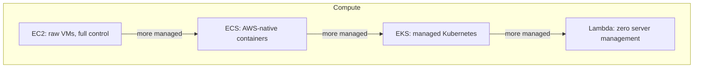

# AWS Core Services for Backend Engineers

> **Topic register:** T-1006 · IWI 5.6 · Core tier, Moderate interview frequency

## Table of Contents

1. [Learning Objectives](#learning-objectives)
2. [Why This Matters in Interviews](#why-this-matters-in-interviews)
3. [Level 1 — Foundation](#level-1--foundation)
4. [Level 2 — Working Knowledge](#level-2--working-knowledge)
5. [Mental Model](#mental-model)
6. [Definition and Purpose](#definition-and-purpose)
7. [Core Concepts](#core-concepts)
8. [Diagrams](#diagrams)
9. [Production Scenarios](#production-scenarios)
10. [Trade-offs](#trade-offs)
11. [Decision Framework](#decision-framework)
12. [Common Mistakes](#common-mistakes)
13. [Anti-Patterns](#anti-patterns)
14. [Best Practices](#best-practices)
15. [Interview Answer Framework](#interview-answer-framework)
16. [Interview Questions](#interview-questions)
17. [Summary](#summary)
18. [Key Takeaways](#key-takeaways)
19. [Cheat Sheet](#cheat-sheet)
20. [Flashcards](#flashcards)
21. [Practice Exercises](#practice-exercises)
22. [Solutions](#solutions)
23. [Additional Reading](#additional-reading)
24. [Official References](#official-references)

---

## Learning Objectives

By the end of this chapter you can:

- Name the correct AWS compute option (EC2, ECS, EKS, Lambda) for a given workload shape and operational-ownership trade-off.
- Distinguish S3, EBS, and EFS by their actual access model, not just "AWS storage."
- Distinguish RDS from DynamoDB using the same access-pattern method this program's storage-selection chapter establishes generally.
- Explain what SQS and SNS each solve, and why they're frequently used together rather than as alternatives.

## Why This Matters in Interviews

This topic tests breadth of real operational exposure to a major cloud provider's core services, applied with judgment rather than recited as a service catalog. Interviewers use it to check whether a candidate can map a described workload to a defensible service choice — the same access-pattern-first discipline this program applies to in-memory collections and storage technology selection, now applied one layer up, at the managed-cloud-service level.

## Level 1 — Foundation

Think about the different ways to get around a city. If you own a car, you handle everything yourself — gas, insurance, maintenance, finding parking — total control, total hassle (that's **EC2**). If you lease a car through a company that also handles the maintenance schedule for you, you still drive it yourself day to day, but you've handed off one specific chunk of the ownership burden (that's **ECS**). If you join a car-sharing cooperative with a standard app that works with any car in a whole network of cities, using a shared, portable system that isn't tied to one company's cars (that's **EKS** — the "network" is the Kubernetes ecosystem, usable across cloud providers). And if you just call a rideshare for one trip, you own no vehicle at all, and you pay only for the ride you actually take (that's **Lambda**). All four get you from A to B — the only real difference is how much of the ownership burden you're carrying yourself, and what control you give up in exchange for handing that burden off.

Storage works the same way but for a different kind of burden. A safe-deposit box at a bank (**S3**) is where you drop things off and retrieve them later by a claim ticket — you never carry the box itself around, you just ask the teller for item #4471. An external hard drive plugged into exactly one laptop (**EBS**) behaves like a real disk, but only one machine can use it at a time. A shared drive on an office network that several computers can open at once (**EFS**) is neither of those — it's built specifically for simultaneous, multi-machine access. And for databases: a vending machine (**DynamoDB**) only ever gives you what's in the exact slot number you punch in — blazing fast, but you must already know the slot; a full grocery store you can wander through and combine anything from any aisle (**RDS**, relational/SQL) is slower per item but lets you ask questions you didn't plan for in advance.

## Level 2 — Working Knowledge

At this level you should be able to place a described workload on each of these spectrums and defend the placement, not just recite what each service does. For compute: ask whether the team wants to *drive* (full control, EC2), *lease with assisted maintenance* (ECS), *use a portable, standardized network* (EKS — valuable specifically when the team already knows Kubernetes elsewhere), or *just call a ride when needed* (Lambda — valuable specifically for short, event-triggered work, not sustained traffic). For storage: ask whether the data is retrieved by a claim ticket and rarely touched again (S3), needs real block-device semantics for exactly one machine (EBS), or must be visible to several machines at once (EFS) — these are different *access models*, not different price tiers of the same thing.

For the database split, the working question is the vending-machine test: **can you name every "slot number" (access pattern) you'll ever need before you build the table?** If yes, DynamoDB's speed and scale are close to free. If the honest answer is "we're not sure yet, and someone will eventually want to slice this data in a way we haven't thought of," that uncertainty itself is evidence for RDS, or at minimum for planning a second, purpose-built store fed by a stream for the not-yet-known queries — exactly the mistake this chapter's own production scenario walks through.

Watch for two grades of the same "confused catalog" mistake, which shows up on both the compute and database sides of this chapter: choosing a service by its reputation ("DynamoDB scales, so we should use it," "Lambda is modern, so we should use it") rather than by actually walking through which access pattern or ownership trade-off the workload needs. A workload description in an interview is really asking you to run that walk-through out loud — naming the AWS service is the least interesting part of the answer.

## Mental Model

**Every AWS service in this chapter exists to remove one specific category of undifferentiated operational work — provisioning servers, managing storage durability, running a database, delivering messages reliably — so a backend team can focus on the parts of their system that are actually differentiated.** The right service isn't "whichever is most popular" — it's whichever removes the specific operational burden this workload would otherwise force the team to own themselves, at a cost (in control, in price, in lock-in) the team has explicitly weighed.

## Definition and Purpose

AWS's core services for backend engineering cluster into a few functional categories relevant to nearly every backend system: **compute** (where code runs), **storage** (where data persists, distinct from a managed database), **database** (managed, purpose-built data stores), **messaging** (asynchronous communication between components), and **networking** (how traffic reaches and moves between the above). Each category typically offers multiple services trading off operational ownership against control and cost — understanding that trade-off, not just each service's feature list, is what this topic actually tests.

## Core Concepts

### Compute: EC2, ECS, EKS, and Lambda trade operational ownership for convenience

**EC2** gives raw virtual machines — full control, full operational ownership (patching, scaling, orchestration all manual or self-built). **ECS** (Elastic Container Service) is AWS's own container orchestrator — less operational ownership than raw EC2, tied to AWS's specific orchestration model. **EKS** (Elastic Kubernetes Service) is managed Kubernetes — the same Kubernetes API and ecosystem this week's earlier chapters cover, with AWS managing the control plane. **Lambda** runs code in response to events with zero server management at all — maximum convenience, at the cost of execution-time limits, cold-start latency, and a fundamentally different programming/deployment model than a long-running server process.

### Storage: S3, EBS, and EFS have different access models, not just different price points

**S3** is object storage — accessed via HTTP-style API calls (put/get by key), not mounted as a filesystem, durable and effectively infinitely scalable, ideal for large, infrequently-modified objects (backups, static assets, data lake storage). **EBS** (Elastic Block Store) is block storage attached to a single EC2 instance at a time — behaves like a regular disk, needed for a traditional database or filesystem that expects real block-device semantics. **EFS** (Elastic File System) is a managed, network-attached filesystem that multiple instances can mount simultaneously — for genuinely shared, POSIX-filesystem-semantics access across many compute instances.

### Database: RDS and DynamoDB follow the same access-pattern method as any storage decision

**RDS** is managed relational database hosting (Postgres, MySQL, etc.) — real SQL, real multi-row transactions, familiar relational modeling, with AWS handling patching/backups/failover. **DynamoDB** is a managed key-value/document NoSQL store — extremely high, predictable throughput and latency at scale, at the cost of a much more restrictive query model (primarily key-based access, with careful upfront access-pattern design required, per this program's own storage-selection chapter's access-pattern-first method).

### Messaging: SQS and SNS solve different problems and are often used together

**SQS** (Simple Queue Service) is a durable, point-to-point queue — one message is processed by (typically) one consumer, providing buffering and backpressure between a producer and a consumer at different rates. **SNS** (Simple Notification Service) is pub/sub — one message fanned out to potentially many independent subscribers. The common "SNS fan-out to multiple SQS queues" pattern combines both: SNS distributes one event to several independent consumer queues, each processed independently and durably.

### Traffic distribution and elasticity: ALB and Auto Scaling turn a fleet of instances into one service

An **Application Load Balancer (ALB)** is a Layer-7 (HTTP/HTTPS-aware) load balancer that distributes incoming requests across a target group of instances or containers, health-checking each target and routing only to ones passing that check — the same conceptual role [Load Balancing, Service Discovery, and Health Checking](../11-system-design/load-balancing-service-discovery-and-health-checking.md) covers generally, with AWS managing the balancer itself. Being Layer-7 (as opposed to a Network Load Balancer's Layer-4) means an ALB can route on path or host header (`/api/orders` to one target group, `/api/payments` to another) and terminate TLS at the balancer, which a plain Layer-4 balancer cannot do. **Auto Scaling** (an Auto Scaling Group, or ASG, for EC2; a Service Auto Scaling policy for ECS; a HorizontalPodAutoscaler for EKS, per the previous chapters' Kubernetes coverage) adds or removes instances/tasks/pods in response to a metric — typically CPU or request-count target tracking — so fleet size tracks real load instead of being sized once for peak and left there. The two compose directly: the ALB's target group membership updates automatically as Auto Scaling adds or removes instances, so a scale-out event is invisible to callers — they keep hitting the same ALB endpoint while the pool of healthy targets behind it grows or shrinks.

## Diagrams

## Production Scenarios

### Scenario: a team chooses DynamoDB by reputation, then can't support a new required query pattern

**Symptoms.** A team migrates a service's primary data store from RDS (Postgres) to DynamoDB, citing DynamoDB's reputation for scale and low operational overhead. Months later, a new reporting feature needs to query records by several different, ad-hoc combinations of attributes — a pattern the team assumed would "just work" the way it did in Postgres.

**Impact.** The new feature can't be built efficiently against the migrated data model at all — DynamoDB's access patterns must be designed in at table/index-design time, and the ad-hoc query need wasn't anticipated during the migration.

**Initial hypotheses.** The team's DynamoDB expertise is simply insufficient and needs training (checked — the team correctly understands DynamoDB's documented model; the gap isn't knowledge, it's a mismatch between the actual need and what was designed for); a missing secondary index would fix it easily (checked — the specific ad-hoc combination wasn't anticipated by any existing or easily-added index, since the query shape varies per report); the original migration decision didn't work through the access-pattern method for this system's FULL set of needs, including future/adjacent ones, before committing (correct).

**Diagnosis.** Exactly the storage-selection principle this program establishes generally: DynamoDB is an excellent fit for access patterns known and designed for in advance, and a poor fit for ad-hoc, varying query shapes — the migration decision evaluated DynamoDB's fit for the *existing* access pattern correctly, but never checked it against the reporting feature's later, different need.

**Immediate mitigation.** Build the ad-hoc reporting feature against a separate, purpose-built store (e.g., exporting DynamoDB data via a stream into a relational or analytical store better suited to ad-hoc queries) rather than forcing it onto the primary DynamoDB table.

**Permanent remediation.** Treat any storage migration decision as requiring the access-pattern method applied not just to current needs, but to reasonably-anticipated future ones (reporting, analytics, ad-hoc operational queries) — the same "next 1-2 anticipated features" discipline this program's storage-selection chapter recommends generally.

**Alternatives considered.** Migrating back to RDS — rejected, since the original access pattern that motivated the DynamoDB migration (high-throughput, predictable-latency point lookups) is still real and still well-served by DynamoDB; the fix is adding a purpose-built secondary store for the new need, not reversing a decision that was correct for its original scope.

**Trade-offs.** Maintaining two data stores (DynamoDB for the primary access pattern, a separate store fed by CDC for ad-hoc reporting) adds real operational complexity — accepted, since forcing an ad-hoc query pattern onto DynamoDB isn't actually achievable at all, not just expensive.

**Prevention.** Apply the access-pattern method explicitly to anticipated future needs, not just the access pattern motivating the immediate decision, before any database migration.

**Interview lesson.** This is the AWS-specific instance of this program's general storage-selection lesson: a correct decision for today's access pattern can become a structural blocker for tomorrow's, and the fix is anticipating that during the original decision, not discovering it later.

## Trade-offs

| Choice | Benefit | Cost |
|---|---|---|
| EC2 | Full control | Full operational ownership (patching, scaling, orchestration) |
| ECS/EKS | Less operational ownership than raw EC2 | Tied to a specific orchestration model (ECS: AWS-native; EKS: Kubernetes, portable but with its own operational learning curve) |
| Lambda | Zero server management | Execution-time limits, cold-start latency, a different deployment/debugging model |
| S3 | Effectively infinite, durable, cheap object storage | Not a mountable filesystem; not suited to random-access, low-latency small reads/writes |
| RDS | Familiar relational modeling, real multi-row transactions | Vertical scaling limits; more operational tuning than a fully-managed NoSQL option |
| DynamoDB | Extremely high, predictable throughput at scale | Restrictive query model requiring upfront access-pattern design |

## Decision Framework

1. **How much operational ownership is the team prepared to take on, versus how much control does the workload genuinely need?** EC2 (most ownership, most control) → ECS/EKS → Lambda (least ownership, least control) as a rough spectrum.
2. **Is the data accessed as discrete objects (S3), as a mounted block device for one instance (EBS), or as a shared filesystem across many instances (EFS)?** Match to the actual access model, not just "we need storage."
3. **Apply the access-pattern method (read/write shape, consistency, transactional scope, volume) from this program's storage-selection chapter** to choose between RDS and DynamoDB — including anticipated future access patterns, not just the current one.
4. **Does this workflow need point-to-point delivery with buffering (SQS), fan-out to multiple independent consumers (SNS), or both** (SNS fan-out to multiple SQS queues)? Match to the actual distribution shape needed.

## Common Mistakes

- Choosing a compute service by reputation/trend rather than the actual operational-ownership-vs-control trade-off the team needs.
- Treating S3/EBS/EFS as interchangeable "AWS storage" without matching to the actual access model required.
- Choosing DynamoDB without applying the access-pattern method to anticipated future query needs, not just the current one.
- Using SNS or SQS alone when the actual need is genuinely both (fan-out plus durable, independent per-consumer processing).

## Anti-Patterns

- **Choosing Lambda for a workload with sustained, predictable, long-running compute needs**, where the cold-start and execution-time-limit trade-offs provide no benefit over a simpler EC2/ECS deployment.
- **Choosing DynamoDB purely for its scale reputation**, without working through the access-pattern method for both current and reasonably-anticipated future needs.
- **Using EBS for data that genuinely needs to be shared across many instances**, fighting its single-attachment model instead of using EFS or S3 as appropriate.

## Best Practices

- Match compute service choice to the team's actual operational-ownership appetite and the workload's actual control needs, not to trend or reputation.
- Apply the same access-pattern-first method to a managed-database choice (RDS vs. DynamoDB) as to any other storage decision, including anticipated future query needs.
- Combine SNS and SQS deliberately when a workflow genuinely needs both fan-out and durable, independent per-consumer processing, rather than forcing one service to do both jobs.

## Interview Answer Framework

### 30-Second Answer

AWS's core backend services cluster into compute (EC2 → ECS/EKS → Lambda, trading control for less operational ownership), storage (S3 for objects, EBS for single-instance block storage, EFS for shared filesystem access), database (RDS for relational/transactional needs, DynamoDB for high-throughput key-based access with upfront-designed access patterns), and messaging (SQS for point-to-point durable delivery, SNS for fan-out, often combined). The right choice in each category depends on matching the actual access/operational model needed, not choosing by reputation.

### 2-Minute Answer

Definition: AWS's core services remove specific categories of undifferentiated operational work (server management, storage durability, database operations, reliable message delivery). Why it exists: lets backend teams focus on differentiated work rather than owning every operational layer themselves. How it works: each category offers a spectrum trading operational ownership for control (compute) or a different access model (storage) or a different query/scale trade-off (database) or a different distribution shape (messaging). One important trade-off: DynamoDB's throughput/scale benefits require access patterns designed in upfront, unlike RDS's flexible ad-hoc querying. Production example: a real-shaped incident where a DynamoDB migration, correct for its original access pattern, became a structural blocker for a later ad-hoc reporting need that wasn't anticipated during the original access-pattern analysis.

### 10-Minute Deep Dive

Cover, in order: the mental model — every service removes a specific category of undifferentiated operational work (mental model); the compute spectrum (EC2 → ECS/EKS → Lambda) and its ownership-vs-control trade-off (core concepts); the storage access-model distinctions (S3/EBS/EFS) (core concepts); the RDS-vs-DynamoDB decision via the access-pattern method, including anticipated future needs (core concepts + decision framework); the SQS/SNS distinction and their common combined pattern (core concepts); and close with the production scenario — a DynamoDB migration correct for its original scope becoming a blocker for a later, unanticipated access pattern.

### Whiteboard Explanation

Draw the [§ Diagrams](#diagrams) compute spectrum, then sketch three parallel spectra alongside it for storage (object/block/filesystem), database (relational/key-value), and messaging (point-to-point/fan-out) — making the point that every category has its own version of the same "which access model does this actually need" question.

### Production Example

The DynamoDB reporting blocker in [§ Production Scenarios](#production-scenarios): a migration correct for its original access pattern couldn't support a later ad-hoc reporting need, because the access-pattern method wasn't applied to anticipated future needs during the original decision.

### Trade-offs to Mention

State unprompted: Lambda's zero-server-management benefit comes with cold-start and execution-time-limit costs; DynamoDB's throughput/scale benefits require upfront access-pattern design, unlike RDS's flexibility; EFS's shared-filesystem convenience costs more than S3 for workloads that don't actually need POSIX semantics.

### Common Candidate Mistakes

Naming AWS services without connecting each to a specific access model or ownership trade-off; choosing DynamoDB by reputation without the access-pattern method; treating SQS and SNS as interchangeable rather than complementary.

### Typical Follow-Up Questions

1. "You migrated to DynamoDB for scale, and a new reporting feature can't be built against it. What happened, and how do you fix it?"
2. "When would you choose EKS over ECS, given both are 'managed containers'?"

### Senior-Level Expectations

Correctly maps each service category to its actual access model or ownership trade-off, not just a feature-list description.

### Staff-Level Discussion

The genuinely Staff-level move on cloud service selection is recognizing that every one of these decisions is a specific instance of the same general access-pattern-first method this program applies to in-memory collections and general storage technology — the specific service names change, but the discipline (state the actual access pattern, including anticipated future ones, before naming a technology) doesn't. A Staff engineer treats a cloud service choice with the same rigor as any other architecturally significant decision: state the access pattern, including what's reasonably anticipated to change, before committing to a technology whose fit is scoped to today's need alone.

## Interview Questions

### Question 1 — You migrated to DynamoDB for scale, and a new reporting feature can't be built against it. What happened, and how do you fix it?

**Why interviewers ask it.** Tests whether the candidate connects a specific AWS service limitation to the general access-pattern-first method, and can propose a real fix.

**Expected answer.** DynamoDB's access patterns must be designed in upfront; an ad-hoc reporting query pattern that wasn't anticipated during the original migration can't be efficiently served by the existing table/index design. Fix: build the reporting feature against a separate, purpose-built store (fed by DynamoDB Streams/CDC), rather than forcing the ad-hoc pattern onto the primary table.

**Minimum acceptable answer.** Recognizes DynamoDB's access-pattern rigidity as the cause, even without a specific fix proposal.

**Strong Senior answer.** Correctly diagnoses the access-pattern mismatch and proposes a separate, CDC-fed store for the new need.

**Staff-level extension.** Connects this explicitly to the general access-pattern method applied to *future*, not just current, needs, and proposes it as a standing practice for any future storage-technology decision.

**Common mistakes.** Proposing to migrate back to RDS entirely, discarding the (still valid) reasons DynamoDB was chosen for the original access pattern.

**Likely follow-ups.** "How would you have caught this during the original migration decision?"

**Evaluation criteria (1–5).** 1: doesn't diagnose the access-pattern mismatch. 3: correctly diagnoses it and proposes a separate store. 5: correct diagnosis plus the general future-access-pattern prevention principle.

**Related references.** [§ Production Scenarios](#production-scenarios); [Storage Selection Trade-offs](../11-system-design/storage-selection-tradeoffs.md).

---

### Question 2 — When would you choose EKS over ECS, given both are "managed containers"?

**Why interviewers ask it.** Tests whether the candidate understands the actual difference beyond "they're both container services."

**Expected answer.** EKS gives you the actual Kubernetes API and ecosystem (portable across cloud providers, matches on-prem/other-cloud Kubernetes experience, access to the broader Kubernetes tooling ecosystem), at the cost of a steeper operational learning curve than ECS's simpler, AWS-native model. ECS is a reasonable choice when the team doesn't need Kubernetes-specific portability or tooling and prefers AWS's simpler native orchestration model.

**Minimum acceptable answer.** States that EKS is Kubernetes-based and ECS is AWS-proprietary, even without the portability/tooling reasoning.

**Strong Senior answer.** Correctly names the portability/ecosystem trade-off as the deciding factor.

**Staff-level extension.** Connects this to an organizational factor: a team already operating Kubernetes elsewhere (on-prem, another cloud) gets real value from EKS's consistency with that existing operational knowledge, while a team with no prior Kubernetes exposure may find ECS's simpler model a better fit despite EKS's theoretical portability advantage.

**Common mistakes.** Describing both as functionally identical "managed container services" with no meaningful distinction.

**Likely follow-ups.** "What operational complexity does EKS add that ECS doesn't have?"

**Evaluation criteria (1–5).** 1: no meaningful distinction offered. 3: correctly names the Kubernetes-portability trade-off. 5: correct trade-off plus the organizational-fit nuance.

**Related references.** [§ Core Concepts](#core-concepts); [Kubernetes Objects, Scheduling, and Networking](../14-devops-containers/kubernetes-objects-scheduling-and-networking.md).

## Summary

AWS's core backend services cluster into compute, storage, database, and messaging, each offering a spectrum trading operational ownership, access model, or distribution shape for convenience or scale. The right choice in every category follows the same access-pattern-first discipline this program applies generally — a real-shaped production scenario in this chapter shows a DynamoDB migration correct for its original access pattern becoming a structural blocker for a later, unanticipated reporting need, precisely because that method wasn't applied to future, not just current, requirements.

## Key Takeaways

- Compute options (EC2 → ECS/EKS → Lambda) trade control for reduced operational ownership.
- S3, EBS, and EFS have genuinely different access models, not just different price points.
- RDS vs. DynamoDB is the same access-pattern-first decision as any storage choice — applied to anticipated future needs, not just current ones.
- SQS (point-to-point, durable) and SNS (fan-out) solve different problems and are frequently combined, not interchangeable.

## Cheat Sheet

| Need | Service |
|---|---|
| Full control over compute | EC2 |
| Managed containers, AWS-native | ECS |
| Managed containers, portable Kubernetes | EKS |
| Event-driven, zero server management | Lambda |
| Durable object storage, not a filesystem | S3 |
| Single-instance block storage | EBS |
| Shared filesystem across instances | EFS |
| Relational, multi-row transactions | RDS |
| High-throughput, key-based access, known query patterns | DynamoDB |
| Point-to-point, durable, buffered delivery | SQS |
| Fan-out to multiple independent consumers | SNS (often with SQS per consumer) |

## Flashcards

### Card: The compute spectrum

**Prompt:**
What does the EC2 → ECS/EKS → Lambda spectrum trade off?

**Answer:**
Control for reduced operational ownership — EC2 gives full control and full ownership; Lambda gives zero server management at the cost of execution limits and a different programming model.

**Why it matters:**
The core organizing principle for AWS compute choices.

**Common trap:**
Choosing a compute service by popularity rather than this actual trade-off.

**Related:**
[Core Concepts](#core-concepts)

### Card: S3 vs EBS vs EFS

**Prompt:**
What's the actual access-model difference between S3, EBS, and EFS?

**Answer:**
S3 is object storage (HTTP-style API, not mounted); EBS is block storage attached to one instance at a time; EFS is a shared, network-attached filesystem multiple instances can mount simultaneously.

**Why it matters:**
Prevents treating all three as interchangeable "AWS storage."

**Common trap:**
Choosing based on price alone without matching to the actual access model needed.

**Related:**
[Core Concepts](#core-concepts)

### Card: SQS vs SNS

**Prompt:**
What's the difference between SQS and SNS, and why are they often combined?

**Answer:**
SQS is point-to-point durable delivery (one message, one consumer); SNS is pub/sub fan-out (one message, many subscribers). Combined via SNS fanning out to multiple SQS queues, each processed independently and durably.

**Why it matters:**
They solve different problems; a workflow needing both fan-out and durable per-consumer processing needs both services together.

**Common trap:**
Treating SQS and SNS as alternatives rather than complementary.

**Related:**
[Core Concepts](#core-concepts)

## Practice Exercises

1. For a new service with unpredictable, spiky traffic and simple, stateless request handling, walk through the compute decision framework and justify a choice.
2. Design the storage architecture (S3, EBS, and/or EFS) for a video transcoding service that ingests large uploaded files, processes them, and serves the results.
3. Apply the access-pattern method to decide between RDS and DynamoDB for a service tracking real-time inventory counts with simple key-based reads/writes but an anticipated future need for ad-hoc inventory analytics.

## Solutions

**Exercise 1.** Spiky, stateless, simple request handling is a strong fit for Lambda — the operational-ownership savings and pay-per-invocation cost model suit unpredictable traffic well, and the stateless simplicity avoids Lambda's execution-time-limit and cold-start concerns becoming a real problem.

**Exercise 2.** S3 for the uploaded source files and the final processed outputs (large, infrequently-modified objects, naturally suited to object storage); EBS attached to the transcoding compute instances for scratch/working space during active processing (needs real block-device semantics for the processing tools); EFS only if multiple transcoding instances genuinely need to share intermediate working files during a single job, which a well-designed pipeline would typically avoid in favor of instance-local EBS scratch space plus S3 for the durable inputs/outputs.

**Exercise 3.** The real-time inventory read/write pattern (simple, key-based, high-throughput) fits DynamoDB well. But the anticipated future ad-hoc analytics need is exactly this chapter's own production-scenario warning sign — apply the access-pattern method to that future need explicitly now: plan for a separate, CDC-fed analytical store (fed by DynamoDB Streams) for the ad-hoc analytics from the start, rather than assuming the primary DynamoDB table will somehow also serve that need later.

## Additional Reading

- AWS's own Well-Architected Framework, Cost Optimization and Reliability pillars, for the organizational framing behind many of these service trade-offs

## Official References

- [AWS documentation](https://docs.aws.amazon.com/)
