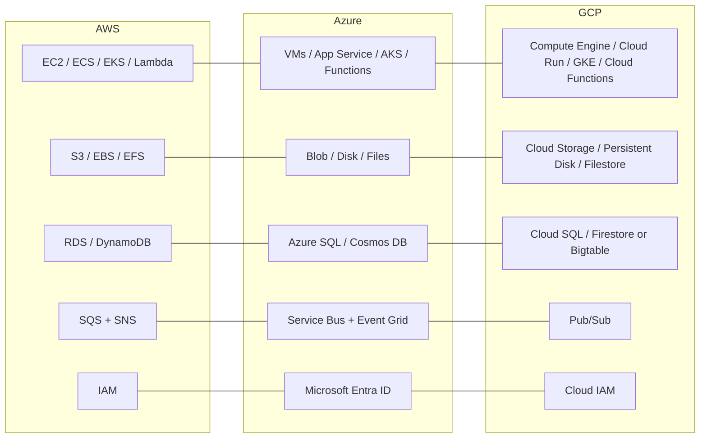

# Azure and GCP for Backend Engineers: Mapping the Same Concepts to a Different Provider

> **Topic register:** T-2404 · Core tier, Moderate interview frequency (increases sharply for candidates interviewing at Microsoft or a GCP-based organization)

## Table of Contents

1. [Learning Objectives](#learning-objectives)
2. [Why This Matters in Interviews](#why-this-matters-in-interviews)
3. [Level 1 — Foundation](#level-1--foundation)
4. [Level 2 — Working Knowledge](#level-2--working-knowledge)
5. [Mental Model](#mental-model)
6. [Definition and Purpose](#definition-and-purpose)
7. [Core Concepts](#core-concepts)
8. [Diagrams](#diagrams)
9. [Production Scenarios](#production-scenarios)
10. [Trade-offs](#trade-offs)
11. [Decision Framework](#decision-framework)
12. [Common Mistakes](#common-mistakes)
13. [Anti-Patterns](#anti-patterns)
14. [Best Practices](#best-practices)
15. [Interview Answer Framework](#interview-answer-framework)
16. [Interview Questions](#interview-questions)
17. [Summary](#summary)
18. [Key Takeaways](#key-takeaways)
19. [Cheat Sheet](#cheat-sheet)
20. [Flashcards](#flashcards)
21. [Practice Exercises](#practice-exercises)
22. [Solutions](#solutions)
23. [Additional Reading](#additional-reading)
24. [Official References](#official-references)

---

## Learning Objectives

By the end of this chapter you can:

- Translate every AWS service in [AWS Core Services for Backend Engineers](aws-core-services-for-backend-engineers.md) to its real Azure and GCP equivalent, by underlying access model or ownership trade-off rather than by name.
- Explain why "what's the Azure/GCP equivalent of X?" is answerable from the access-pattern method this program already teaches, without memorizing three separate service catalogs.
- Name Azure's and GCP's current-as-of-2026 identity and infrastructure-as-code services correctly, including a real recent rename (Azure AD → Microsoft Entra ID) and a real recent deprecation (GCP Deployment Manager → Infrastructure Manager).
- Recognize Kubernetes (EKS/AKS/GKE) as the one compute option that is genuinely, not just conceptually, portable across all three providers.

## Why This Matters in Interviews

A candidate who can only speak AWS is a real liability at Microsoft, at any organization built on GCP, and at any organization running a genuine multi-cloud or cloud-migration strategy — all of which appear on this program's own target-company list. Interviewers at these organizations routinely ask "what's the equivalent of an ALB / IAM role / S3 bucket here?" specifically to check whether a candidate's knowledge is a memorized AWS vocabulary list or a real, transferable model of what cloud services *do*. This chapter exists because [AWS Core Services for Backend Engineers](aws-core-services-for-backend-engineers.md) — and this domain's own top-level description, "AWS core services... cloud cost economics... twelve-factor configuration" — never named Azure or GCP once, despite this program's stated goal of testing judgment "applied with judgment rather than recited as a service catalog." A judgment-based answer should not stop working the moment the provider's name changes.

## Level 1 — Foundation

Recall the AWS chapter's own analogies: a car you own and maintain yourself (EC2), a leased car with assisted maintenance (ECS), a car-sharing network with one standard app across many cities (EKS), and a rideshare you call for one trip (Lambda). Those four *ownership burdens* did not stop existing when you learned they were called EC2/ECS/EKS/Lambda — they are real, provider-independent categories. Microsoft just put different brand names on the same four cars: **Virtual Machines** (own the car), **App Service** (leased, assisted maintenance), **AKS** (the same car-sharing network — literally the same Kubernetes app, since AKS runs real upstream Kubernetes), and **Azure Functions** (rideshare). Google did the same: **Compute Engine**, **Cloud Run**, **GKE**, and **Cloud Functions**. The safe-deposit-box (object storage), single-laptop external drive (block storage), and shared-office-drive (shared filesystem) analogies carry over identically: Azure's **Blob Storage** / **Disk Storage** / **Azure Files** and GCP's **Cloud Storage** / **Persistent Disk** / **Filestore** are the same three boxes with different labels.

## Level 2 — Working Knowledge

At this level, treat every "what's the Azure/GCP name for X" question as a lookup against a category you already understand, not a new thing to learn from scratch. The working method: identify which of the AWS chapter's five categories (compute, storage, database, messaging, networking/access-control) the question is really about, recall *that category's* access-model-or-ownership question from this program's own decision framework, then just supply the provider-specific name that answers it. "What's Azure's equivalent of DynamoDB?" is really "which Azure service is a managed, key-value/document NoSQL store with a restrictive, upfront-designed query model?" — the answer, **Cosmos DB**, follows from recognizing the category, not from having separately memorized Cosmos DB's existence.

The one place this "just relabel it" method needs real care, not just recall, is identity and IaC naming, because both providers have genuinely changed names recently and using a stale one is a real, checkable mistake, not a stylistic slip. **Microsoft renamed Azure Active Directory (Azure AD) to Microsoft Entra ID**, effective in naming from August 2023 (display names from October 2023) — the underlying service, APIs, and login URLs are unchanged, but "Azure AD" is now the *old* name, and a candidate using it in 2026 signals stale knowledge exactly the way "Azure AD" itself would have signaled currency in 2020. Separately, **GCP's Deployment Manager is being superseded by Infrastructure Manager**, which — notably — is not a new proprietary DSL but a managed service that runs real **Terraform** configurations; GCP's own current guidance points new native-IaC users to Infrastructure Manager, not Deployment Manager. Getting either of these wrong in an interview is a small but real signal that a candidate's cloud knowledge is not being kept current.

## Mental Model

**Every major cloud provider offers the same handful of access-model and ownership-trade-off categories this program already teaches for AWS — compute ownership, storage access model, database query-pattern fit, messaging distribution shape, and identity/network boundary control — under different brand names.** Learning a second or third provider is a vocabulary exercise layered on a model you already have, not a new model to build from zero. The one place this analogy breaks down usefully, not confusingly, is Kubernetes: EKS, AKS, and GKE are not three analogous-but-different things like S3/Blob-Storage/Cloud-Storage are — they are three managed control planes for the *same* portable technology, which is exactly why a team already fluent in Kubernetes treats a provider switch as a genuinely smaller lift than a team built on any single provider's proprietary services (Lambda, DynamoDB, Cosmos DB, Firestore).

## Definition and Purpose

Azure and GCP are, for a backend engineer's purposes, alternative implementations of the same functional categories AWS covers: compute, storage, managed database, messaging, and networking/access control, each trading operational ownership, access model, or distribution shape for convenience exactly as AWS's services do. This chapter's purpose is narrow and deliberate: it does not re-teach any category's underlying trade-offs — those are owned by [AWS Core Services for Backend Engineers](aws-core-services-for-backend-engineers.md) and by this program's general storage-selection and access-control chapters — it only maps each AWS name this program already teaches to its real Azure and GCP counterpart, and flags the small number of places (identity naming, native IaC tooling) where the mapping needs a currently-accurate name rather than a historical one.

## Core Concepts

### Compute: the same four-step ownership spectrum, three brand names deep

Azure: **Virtual Machines** (raw VMs, full operational ownership) → **App Service** (managed platform for web apps, less ownership than a raw VM) → **AKS** (managed Kubernetes — real upstream Kubernetes, AWS's EKS is the same underlying technology, not an analogous-but-different one) → **Azure Functions** (event-driven, serverless, zero server management). GCP: **Compute Engine** (raw VMs) → **Cloud Run** (serverless *containers* — GCP's distinct middle step, running a container without managing a cluster at all, closer to Lambda's ownership model than to ECS's) → **GKE** (managed Kubernetes) → **Cloud Functions** (event-driven serverless functions). GCP's Cloud Run is worth naming specifically because it doesn't map one-to-one onto either AWS's ECS or Lambda — it is a genuinely distinct point on the spectrum (a full container, but with Lambda-style zero cluster management), and treating it as "GCP's ECS" understates how little operational ownership it actually requires.

### Storage: the same three access models, six more names

Azure: **Blob Storage** (object storage, S3's direct equivalent) / **Disk Storage** (block storage attached to one VM, EBS's equivalent) / **Azure Files** (shared network filesystem, EFS's equivalent). GCP: **Cloud Storage** (object storage) / **Persistent Disk** (block storage) / **Filestore** (shared filesystem). None of the three access-model distinctions this program already teaches for S3/EBS/EFS need to be re-learned — only the six new names do.

### Database: the same access-pattern method decides between a relational and a key-value-style option

Azure: **Azure SQL Database** (managed relational, RDS's equivalent) and **Cosmos DB** (multi-model, but most commonly used as a managed NoSQL document/key-value store — DynamoDB's closest equivalent, though Cosmos DB additionally supports multiple consistency levels tunable per request, a real point of difference worth naming if asked). GCP: **Cloud SQL** (managed relational — Postgres, MySQL, SQL Server, RDS's direct equivalent) and, on the NoSQL side, GCP genuinely splits this into two rather than one: **Firestore** (a managed document database, closer to a smaller-scale operational NoSQL store) and **Bigtable** (a high-throughput, wide-column store built for very large-scale operational or analytical workloads — closer to Cassandra's shape than to DynamoDB's). The access-pattern method from this program's storage-selection chapter still decides the choice; only GCP requires picking between two NoSQL options instead of one, based on the same read/write-shape-and-scale reasoning already taught there.

### Messaging: SNS/SQS's split exists in both providers, under different pairings

Azure: **Service Bus** (durable, point-to-point/topic-subscription queuing, closer to SQS in role, with topic/subscription behavior closer to SNS layered on top natively) and **Event Grid** (event-routing/pub-sub for reacting to Azure resource events and custom events, closer to SNS's fan-out role). GCP: **Pub/Sub** is GCP's single service covering both the SQS point-to-point role (via one subscription per topic) and the SNS fan-out role (via multiple independent subscriptions on the same topic) — GCP did not split this into two services the way AWS and Azure did.

### Traffic distribution, elasticity, networking, and identity: the same boundary questions, three more vocabularies

Azure: **Application Gateway** (Layer-7 load balancer, ALB's equivalent) and **Virtual Machine Scale Sets (VMSS)** (Auto Scaling Group's equivalent); **Virtual Network (VNet)** and **Network Security Groups (NSGs)** (VPC and Security Groups' equivalents); and, for identity, **Microsoft Entra ID** — the current name, as of a 2023 rename, for what was Azure Active Directory (Azure AD); IAM's role-based-access equivalent here is Entra ID's role assignments plus Azure RBAC. GCP: **Cloud Load Balancing** (Layer-7, ALB's equivalent) and **Managed Instance Groups (MIGs)** (Auto Scaling's equivalent); **VPC** (GCP uses the same term as AWS) and **Firewall Rules** (Security Groups' equivalent, though GCP's firewall rules are defined at the VPC level and applied by tag/service-account rather than attached per-instance the way a Security Group is); and **Cloud IAM** for identity and role-based permissions, directly analogous to AWS IAM's role model.

### Infrastructure as Code and observability: two providers, two current-generation answers worth naming precisely

Azure: **ARM templates** (Azure's original native JSON IaC format) and **Bicep** (a newer, more readable DSL that compiles down to ARM templates — Azure's own current recommendation over hand-written ARM JSON); observability is **Azure Monitor**. GCP: **Deployment Manager** was GCP's original native IaC service, but GCP's current guidance points toward **Infrastructure Manager**, a managed service that runs real Terraform configurations rather than a proprietary DSL — worth stating precisely in an interview, since naming Deployment Manager as GCP's current answer is the GCP-side version of saying "Azure AD" in 2026; observability is **Cloud Monitoring** (part of Google Cloud's Operations suite, formerly branded Stackdriver).

## Diagrams

Each row is one category from [AWS Core Services for Backend Engineers](aws-core-services-for-backend-engineers.md)'s own decision framework — the three columns are three labels for the same underlying decision, not three different decisions.

## Production Scenarios

### Scenario: an interview candidate's AWS-only vocabulary is mistaken for AWS-only understanding

**Symptoms.** A Senior candidate, strong on AWS specifics, is asked "your team is being acquired by an org running entirely on GCP — walk me through what changes about your service's architecture." The candidate can only respond in AWS names, visibly translating nothing, and the interviewer cannot tell whether the candidate's underlying reasoning (access patterns, ownership trade-offs) is real or was memorized alongside the AWS names specifically.

**Impact.** A genuinely strong AWS-specific answer reads, to this specific interviewer, as unverifiable — the interviewer has no way to separate "understands the trade-offs" from "memorized AWS's service catalog," because the candidate never demonstrated the distinction.

**Initial hypotheses.** The candidate lacks the underlying trade-off knowledge entirely (checked, in a follow-up debrief — the candidate's AWS reasoning was independently confirmed strong); the candidate simply hasn't been exposed to GCP professionally (true, but not disqualifying on its own); the real gap is that the candidate never practiced *expressing* AWS-independent reasoning, so under interview pressure they defaulted to the only vocabulary they had (correct diagnosis).

**Diagnosis.** The underlying reasoning (this program's access-pattern-first, ownership-trade-off-first method) was real and transferable; what was missing was ever having practiced stating it in a provider-neutral way, or having the second provider's vocabulary on hand to demonstrate the transfer live.

**Immediate mitigation.** In the same interview, the candidate recovers by explicitly naming the category ("this is the same object-storage-versus-block-storage question S3 and EBS represent") before admitting uncertainty on the exact GCP name — partial credit for demonstrating the transferable reasoning even without perfect vocabulary.

**Permanent remediation.** Learn at least one other major provider's names for this chapter's five categories specifically so the underlying reasoning has a second vocabulary to demonstrate itself through, exactly the purpose this chapter serves.

**Alternatives considered.** Deep GCP certification study — rejected as disproportionate; the interview signal being tested is transferable judgment, not GCP depth, so a working map (this chapter's own scope) is the right-sized fix.

**Trade-offs.** Learning a second provider's names in breadth rather than depth means genuine GCP-specific nuances (Bigtable-vs-Firestore's real difference, Cloud Run's real distinctness from both ECS and Lambda) still need their own attention — accepted, since interview-level transferability, not GCP production expertise, is the actual goal here.

**Prevention.** Practice stating any cloud-service trade-off in provider-neutral terms first, naming the specific provider's service second — the same "reasoning first, vocabulary second" order this chapter's own Core Concepts section uses throughout.

**Interview lesson.** A provider-specific vocabulary is not the same thing as provider-independent judgment, and an interviewer who asks a cross-provider question is deliberately testing for the difference.

## Trade-offs

| Choice | Benefit | Cost |
|---|---|---|
| Learning AWS, Azure, and GCP's names for the same categories | Real signal of transferable judgment, not just AWS memorization | Three vocabularies to keep current instead of one |
| Treating Kubernetes (EKS/AKS/GKE) as the portability answer | Genuinely the same technology across all three providers, not just an analogous one | Real Kubernetes operational complexity is still there regardless of which managed control plane runs it |
| Using GCP's Cloud Run instead of forcing an ECS/Lambda label onto it | Names its real, distinct position on the ownership spectrum accurately | Requires accepting the three providers' compute spectrums aren't perfectly 1:1, not just relabeled |

## Decision Framework

1. **Identify which of the five categories (compute, storage, database, messaging, networking/identity) the question is really about** — the same first step [AWS Core Services for Backend Engineers](aws-core-services-for-backend-engineers.md)'s own decision framework uses.
2. **Recall that category's access-model or ownership-trade-off question**, independent of any provider, from this program's own general method.
3. **Supply the specific provider's current name** for the service answering that question — checking, specifically for identity (Microsoft Entra ID, not Azure AD) and GCP native IaC (Infrastructure Manager, not Deployment Manager), that the name is current rather than historical.
4. **For a genuinely cross-provider or migration question**, name Kubernetes (EKS/AKS/GKE) explicitly as the one option that is actually the same technology across providers, distinct from every other category's "same trade-off, different name" relationship.

## Common Mistakes

- Treating "what's the Azure/GCP equivalent of X" as a memorization gap rather than a lookup against a trade-off category already understood.
- Saying "Azure AD" in a 2026 interview, signaling stale rather than current cloud knowledge.
- Labeling GCP's Cloud Run as simply "GCP's ECS" or "GCP's Lambda," understating its genuinely distinct position on the ownership spectrum.
- Assuming Kubernetes's portability claim extends to every other service category (Lambda/Functions/Cloud-Functions, DynamoDB/Cosmos-DB/Firestore are not portable the way EKS/AKS/GKE workloads are).

## Anti-Patterns

- **Building an entire second mental model from scratch for a second cloud provider**, instead of recognizing the same five categories and access-pattern method already apply.
- **Assuming any two providers' "equivalent" services are feature-identical** (Cosmos DB's tunable per-request consistency levels, GCP's Firestore-vs-Bigtable split, and Cloud Run's distinct ownership position are all real differences, not naming variance).
- **Citing a deprecated or renamed service name in an interview** (Azure AD, Deployment Manager) as if it were still the provider's current answer.

## Best Practices

- Learn a second provider's names for this chapter's five categories specifically, rather than deep-diving one provider and staying silent on the others.
- State cloud-service reasoning in provider-neutral terms first, then supply the specific provider's current service name second.
- Name Kubernetes explicitly, and only Kubernetes, as the genuinely portable answer when a migration or multi-cloud question is asked.

## Interview Answer Framework

### 30-Second Answer

Azure and GCP offer the same functional categories AWS does — compute ownership spectrum, storage access models, relational-vs-NoSQL database trade-offs, point-to-point-vs-fan-out messaging, and networking/identity boundaries — under different names (Azure: VMs/App Service/AKS/Functions, Blob/Disk/Files, Azure SQL/Cosmos DB, Service Bus/Event Grid, Microsoft Entra ID; GCP: Compute Engine/Cloud Run/GKE/Cloud Functions, Cloud Storage/Persistent Disk/Filestore, Cloud SQL/Firestore-or-Bigtable, Pub/Sub, Cloud IAM). Kubernetes (EKS/AKS/GKE) is the one option that's genuinely, not just conceptually, the same technology across all three.

### 2-Minute Answer

Definition: Azure and GCP are alternative implementations of the same compute/storage/database/messaging/networking categories AWS covers. Why it exists as its own topic: interviewers at non-AWS-centric organizations test whether a candidate's cloud knowledge is transferable judgment or an AWS-specific vocabulary list. How it works: every AWS service this program already teaches has a real Azure and GCP counterpart, reachable by recalling the underlying trade-off category rather than memorizing three catalogs separately. One important trade-off: the mapping isn't always perfectly 1:1 — GCP's Cloud Run sits at a genuinely distinct point on the ownership spectrum, and GCP splits NoSQL into Firestore and Bigtable rather than offering one DynamoDB-equivalent. Production example: a candidate whose real AWS-based trade-off reasoning was mistaken for AWS-only knowledge specifically because they never demonstrated it in provider-neutral terms.

### 10-Minute Deep Dive

Cover, in order: the mental model — same categories, different brand names, with Kubernetes as the one genuine exception (mental model); the compute mapping including GCP Cloud Run's distinct position (core concepts); storage, database, and messaging mappings, including Cosmos DB's tunable consistency and GCP's Firestore/Bigtable split (core concepts); the two real currency traps — Microsoft Entra ID vs. Azure AD, Infrastructure Manager vs. Deployment Manager (core concepts, level 2); and close with the production scenario, where AWS-specific vocabulary was mistaken for AWS-only understanding until the candidate demonstrated provider-neutral reasoning.

### Whiteboard Explanation

Draw the [§ Diagrams](#diagrams) three-column table (AWS / Azure / GCP rows), then point at each row in turn and say the underlying trade-off question out loud before naming any of the three services — demonstrating live that the reasoning, not the vocabulary, is the answer.

### Production Example

The interview scenario in [§ Production Scenarios](#production-scenarios): real AWS-based trade-off reasoning read as unverifiable specifically because it was never demonstrated in provider-neutral terms, until the candidate explicitly named the underlying category before admitting a vocabulary gap.

### Trade-offs to Mention

State unprompted: the three providers' categories map cleanly in four of five cases, but GCP's Cloud Run and Firestore/Bigtable split are genuine, not just nominal, differences; Kubernetes is the only category offering real, not just conceptual, cross-provider portability.

### Common Candidate Mistakes

Treating a second provider as requiring an entirely new mental model; using a stale service name (Azure AD, Deployment Manager) as if current; claiming full portability for non-Kubernetes services.

### Typical Follow-Up Questions

1. "Your team is being acquired by an org running entirely on GCP. Walk me through what changes about your service's architecture."
2. "Why might Cosmos DB be a better fit than a straight DynamoDB-equivalent read in some cases?"

### Senior-Level Expectations

Correctly maps AWS services this program teaches to their real Azure/GCP counterparts by underlying trade-off, using current (not renamed/deprecated) service names.

### Staff-Level Discussion

The Staff-level move is recognizing that multi-cloud or cloud-migration readiness is itself an organizational risk-and-cost decision, not a technical exercise in service-name translation: real portability exists only where the underlying technology is genuinely shared (Kubernetes), and every other category's "equivalent" service still carries real, non-cosmetic differences (Cosmos DB's tunable consistency, GCP's NoSQL split) that a migration plan must account for explicitly rather than assuming a clean one-to-one swap. A Staff engineer evaluating a real multi-cloud strategy states which categories are genuinely portable and which merely have same-shaped names, before any migration-cost estimate is trusted.

## Interview Questions

### Question 1 — Your team is being acquired by an org running entirely on GCP. Walk me through what changes about your service's architecture.

**Why interviewers ask it.** Tests whether a candidate's AWS-based reasoning is transferable judgment or AWS-specific memorization, and whether they can reason about migration risk rather than just service-name translation.

**Expected answer.** Map each AWS service currently in use to its GCP equivalent by category (compute, storage, database, messaging, networking/identity), explicitly calling out where the mapping is clean (S3→Cloud Storage) versus where it requires a real decision (DynamoDB's single-store model against GCP's Firestore/Bigtable split), and naming Kubernetes-based compute as the lowest-migration-risk piece if already in use via EKS.

**Minimum acceptable answer.** Names at least the storage and database GCP equivalents correctly, even without deep migration-risk discussion.

**Strong Senior answer.** Correctly maps every category and explicitly flags the DynamoDB→Firestore-or-Bigtable decision as requiring real access-pattern analysis, not a blind swap.

**Staff-level extension.** Frames the whole migration as an organizational risk/cost decision — which categories are genuinely low-risk (Kubernetes-based compute) versus which carry real re-architecture risk (any proprietary managed service without a clean equivalent) — before committing to a migration timeline or cost estimate.

**Common mistakes.** Assuming every AWS service has an exact, risk-free GCP equivalent.

**Likely follow-ups.** "Which piece of this migration would you de-risk first, and why?"

**Evaluation criteria (1–5).** 1: cannot map categories at all. 3: correctly maps most categories. 5: correct mapping plus explicit migration-risk framing distinguishing genuine portability (Kubernetes) from same-shaped-but-different services.

**Related references.** [§ Production Scenarios](#production-scenarios); [AWS Core Services for Backend Engineers](aws-core-services-for-backend-engineers.md).

---

### Question 2 — Why might Cosmos DB be a better fit than a straight DynamoDB-equivalent read in some cases?

**Why interviewers ask it.** Tests whether the candidate treats "equivalent" services as feature-identical or understands real, provider-specific differences.

**Expected answer.** Cosmos DB supports multiple selectable consistency levels tunable per request (from strong to eventual, with intermediate options), a real point of difference from DynamoDB's more fixed consistency model — a workload needing that specific per-request tunability is a genuinely better fit for Cosmos DB, not merely "the Azure one instead of the AWS one."

**Minimum acceptable answer.** States that Cosmos DB and DynamoDB are not feature-identical, even without naming the specific consistency-tuning difference.

**Strong Senior answer.** Names the tunable-consistency-level difference specifically as the deciding factor.

**Staff-level extension.** Generalizes this to the broader principle that "equivalent" services across providers are a starting point for research, not a guarantee of identical behavior, and that any cross-provider architecture decision should verify the specific guarantees needed rather than assuming category-level equivalence is feature-level equivalence.

**Common mistakes.** Treating Cosmos DB and DynamoDB as fully interchangeable because both are "the managed NoSQL option."

**Likely follow-ups.** "What GCP service would you consider instead, and why might you pick Firestore over Bigtable, or vice versa?"

**Evaluation criteria (1–5).** 1: treats all NoSQL managed stores as interchangeable. 3: correctly names a real Cosmos DB-specific difference. 5: correct difference plus the general "verify, don't assume, category-level equivalence" principle.

**Related references.** [§ Core Concepts](#core-concepts); [Storage Selection Trade-offs](../11-system-design/storage-selection-tradeoffs.md).

## Summary

Azure and GCP offer the same compute, storage, database, messaging, and networking/identity categories AWS does, under different names — a candidate who understands this program's access-pattern-first, ownership-trade-off-first method already has the reasoning needed for all three providers, and only needs the vocabulary mapping this chapter provides. The one place true, not just conceptual, portability exists is Kubernetes (EKS/AKS/GKE); everywhere else, "equivalent" services carry real, non-cosmetic differences (Cosmos DB's tunable consistency, GCP's Firestore/Bigtable split, Cloud Run's distinct ownership position) that a genuine migration or multi-cloud decision must verify rather than assume.

## Key Takeaways

- Every AWS service this program teaches has a real Azure and GCP counterpart, reachable via the same access-pattern/ownership-trade-off reasoning, not separate memorization.
- Two names changed recently and matter for interview currency: Azure AD → Microsoft Entra ID (2023); GCP's native IaC direction is now Infrastructure Manager (Terraform-based), not Deployment Manager.
- Kubernetes (EKS/AKS/GKE) is the one category offering genuine, not just conceptual, cross-provider portability.
- "Equivalent" does not mean feature-identical — Cosmos DB's tunable consistency and GCP's Firestore-vs-Bigtable split are real differences a migration decision must account for.

## Cheat Sheet

| Category | AWS | Azure | GCP |
|---|---|---|---|
| Raw VM | EC2 | Virtual Machines | Compute Engine |
| Managed containers (native) | ECS | App Service / Container Apps | Cloud Run |
| Managed Kubernetes | EKS | AKS | GKE |
| Serverless functions | Lambda | Azure Functions | Cloud Functions |
| Object storage | S3 | Blob Storage | Cloud Storage |
| Block storage | EBS | Disk Storage | Persistent Disk |
| Shared filesystem | EFS | Azure Files | Filestore |
| Managed relational DB | RDS | Azure SQL Database | Cloud SQL |
| Managed NoSQL | DynamoDB | Cosmos DB | Firestore / Bigtable |
| Point-to-point queue | SQS | Service Bus | Pub/Sub |
| Pub/sub fan-out | SNS | Event Grid | Pub/Sub |
| L7 load balancer | ALB | Application Gateway | Cloud Load Balancing |
| Auto-scaling instance group | Auto Scaling Group | VMSS | Managed Instance Group |
| Virtual network | VPC | VNet | VPC |
| Instance-level firewall | Security Group | NSG | Firewall Rules |
| Identity/access | IAM | Microsoft Entra ID (was Azure AD) | Cloud IAM |
| Native IaC | CloudFormation | ARM templates / Bicep | Infrastructure Manager (Terraform-based; supersedes Deployment Manager) |
| Monitoring | CloudWatch | Azure Monitor | Cloud Monitoring |

## Flashcards

### Card: The rename that matters right now

**Prompt:**
What was Azure Active Directory (Azure AD) renamed to, and when?

**Answer:**
Microsoft Entra ID, effective in naming from August 2023 (display names October 2023). The underlying service, APIs, and login URLs are unchanged — only the name is current versus stale.

**Why it matters:**
Using "Azure AD" in a 2026 interview signals stale cloud knowledge the same way it would have signaled currency in 2020.

**Common trap:**
Assuming a rename this recent hasn't fully propagated into interview expectations yet.

**Related:**
[Core Concepts](#core-concepts)

### Card: GCP's NoSQL split

**Prompt:**
DynamoDB is one AWS service. What are its two GCP counterparts, and how do they differ?

**Answer:**
Firestore (managed document database, smaller-scale operational NoSQL) and Bigtable (high-throughput wide-column store for very large-scale operational or analytical workloads, closer to Cassandra's shape). GCP splits what AWS covers with one service into two, based on scale and data shape.

**Why it matters:**
Prevents assuming every "equivalent" service maps one-to-one across providers.

**Common trap:**
Naming Firestore as "GCP's DynamoDB" without checking whether Bigtable is the actual fit for the workload's scale.

**Related:**
[Core Concepts](#core-concepts)

### Card: The one genuinely portable category

**Prompt:**
Of everything in this chapter's cheat sheet, which category is genuinely, not just conceptually, the same across all three providers?

**Answer:**
Kubernetes — EKS, AKS, and GKE are three managed control planes for the same underlying Kubernetes technology, unlike every other row, where the three providers' services are analogous but independently implemented.

**Why it matters:**
The real basis for "Kubernetes gives us portability" claims in a multi-cloud or migration discussion.

**Common trap:**
Extending the portability claim to non-Kubernetes services (Lambda/Functions/Cloud-Functions are not portable the way a Kubernetes workload is).

**Related:**
[Mental Model](#mental-model)

## Practice Exercises

1. A team currently on AWS (EC2 + RDS + S3 + SQS) is evaluating a move to Azure. Name the direct Azure equivalent for each of the four services, and identify which one deserves the most scrutiny before assuming a clean swap.
2. A candidate is asked "what's GCP's equivalent of DynamoDB?" Walk through how to answer this using the access-pattern method rather than a memorized lookup, including when the honest answer is "it depends."
3. Explain, in provider-neutral terms first, why Kubernetes-based compute is lower migration risk than a workload built directly on Lambda, before naming EKS/AKS/GKE specifically.

## Solutions

**Exercise 1.** EC2 → Virtual Machines; RDS → Azure SQL Database; S3 → Blob Storage; SQS → Service Bus. RDS→Azure SQL Database deserves the most scrutiny of these four specifically because it's the most likely to have accumulated engine-specific (e.g., Postgres extension) behavior that doesn't transfer cleanly — the other three are closer to name-level swaps of genuinely equivalent access models.

**Exercise 2.** State the category first: DynamoDB is a managed, key-value/document NoSQL store with a restrictive, upfront-designed query model. GCP's answer depends on scale and data shape: Firestore for smaller-scale operational document access, Bigtable for very large-scale, high-throughput workloads. The honest "it depends" answer — naming both and the deciding factor between them — is a stronger interview answer than confidently naming only one.

**Exercise 3.** Provider-neutral framing: a workload built on a provider-specific serverless function service is tied to that provider's specific event model, runtime constraints, and deployment tooling, none of which transfer; a workload built on Kubernetes is tied to a portable API and ecosystem that multiple providers implement identically at the control-plane level. Naming specifically: moving a Lambda-based workload to Azure Functions or Cloud Functions requires real re-implementation; moving an EKS-based workload to AKS or GKE requires re-pointing the same Kubernetes manifests at a different managed control plane — a genuinely smaller lift.

## Additional Reading

- Microsoft's own "New name for Azure Active Directory" guidance, for the full 2023 Azure AD → Microsoft Entra ID rename and terminology glossary
- Google Cloud's Infrastructure Manager documentation, for GCP's current Terraform-based native IaC direction

## Official References

- [Azure products by category — Compute](https://azure.microsoft.com/en-us/products/category/compute)
- [Google Cloud Platform services overview](https://cloud.google.com/docs/overview/cloud-platform-services)
- [Microsoft Entra — new name for Azure Active Directory](https://learn.microsoft.com/en-us/entra/fundamentals/new-name)
- [Google Cloud Infrastructure Manager overview](https://docs.cloud.google.com/infrastructure-manager/docs/overview)
