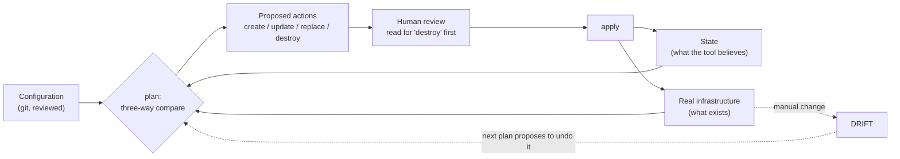
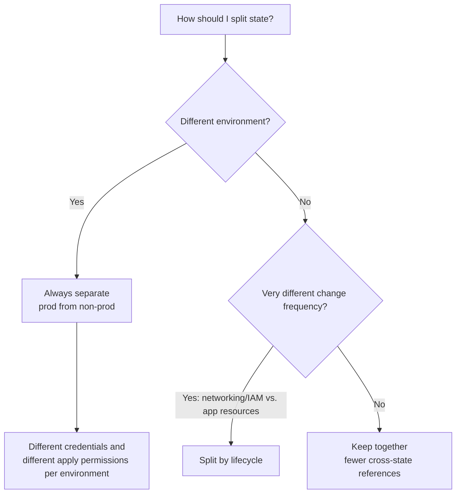

# Infrastructure as Code: Declarative State, Drift, and Safe Change

> **Topic register:** T-2438 · Core tier · Moderate-to-high interview frequency [M/H]
> **Scope note:** this chapter is a *concepts and decisions* chapter. Unlike most
> chapters in this repository it carries **no measured demo**, because the
> behaviour being described belongs to tools that provision real cloud resources
> — running them honestly would mean creating billable infrastructure, and
> simulating them would produce output that looks measured and is not. Every
> behavioural claim is therefore sourced to official documentation and cited
> inline. What the chapter will not do is print invented `terraform plan` output
> and present it as evidence.

## Table of Contents

1. [Learning Objectives](#learning-objectives)
2. [Why This Matters in Interviews](#why-this-matters-in-interviews)
3. [Level 1 — Foundation](#level-1-foundation)
4. [Level 2 — Working Knowledge](#level-2-working-knowledge)
5. [Mental Model](#mental-model)
6. [Definition and Purpose](#definition-and-purpose)
7. [Core Concepts](#core-concepts)
8. [Internal Implementation](#internal-implementation)
9. [Diagrams](#diagrams)
10. [Configuration Examples](#configuration-examples)
11. [Production Scenarios](#production-scenarios)
12. [Trade-offs](#trade-offs)
13. [Decision Framework](#decision-framework)
14. [Common Mistakes](#common-mistakes)
15. [Anti-Patterns](#anti-patterns)
16. [Best Practices](#best-practices)
17. [Interview Answer Framework](#interview-answer-framework)
18. [Interview Questions](#interview-questions)
19. [Summary](#summary)
20. [Key Takeaways](#key-takeaways)
21. [Cheat Sheet](#cheat-sheet)
22. [Flashcards](#flashcards)
23. [Practice Exercises](#practice-exercises)
24. [Solutions](#solutions)
25. [Additional Reading](#additional-reading)
26. [Official References](#official-references)

---

## Learning Objectives

By the end of this chapter you can:

- Explain what a state file is, why it exists, and why it is the single most sensitive artifact in an IaC setup.
- Define drift precisely and describe what happens when a plan meets a manually-changed resource.
- Choose between declarative and imperative provisioning with a real argument rather than a preference.
- Explain why `plan` is a review artifact rather than a formality, and what it cannot tell you.
- Reason about blast radius, state splitting, and who is allowed to apply.

## Why This Matters in Interviews

Infrastructure as code is where "we automated it" gets tested for depth. Most candidates can say they use Terraform. The questions that separate them are about the parts that bite: what is in the state file and who can read it, what happens when someone fixes something by hand in the console, why a plan that looked clean destroyed a database, and how you would split state so one mistake cannot take out an entire environment.

It also connects directly to topics interviewers already care about. IaC is the mechanism behind reproducible environments, disaster recovery that has been tested rather than hoped for, and change review for infrastructure — and the failure modes are the same shape as any other state-synchronisation problem, which makes it a good proxy for how a candidate thinks about distributed state generally.

## Level 1 — Foundation

**Infrastructure as code** means the servers, networks, databases, and permissions your system runs on are defined in files that live in version control, and created or changed by running a tool against those files — rather than by clicking in a web console.

Two consequences do most of the work:

- **Reproducibility.** The same definitions can build a second, identical environment. Without IaC, "staging is like production" is a claim nobody can verify and everybody's incidents eventually disprove.
- **Reviewability.** An infrastructure change becomes a diff, with an author, a reviewer, and a history. "Who opened this security group to the world, and when?" becomes a `git log` question instead of an archaeology project.

Most tools are **declarative**: you describe the desired end state ("one database of this size, with these settings") and the tool works out the actions needed to get there — create, modify, or destroy. This is the same idea as a Kubernetes manifest, and a useful bridge for anyone who has written one: you declare what should exist, and a reconciler makes reality match.

The alternative, **imperative**, is a script of steps ("create this, then attach that"). Scripts are easy to start and hard to re-run safely, because running them twice usually is not the same as running them once.

## Level 2 — Working Knowledge

A declarative tool needs to know which real resources correspond to which definitions. That is what **state** is: a record mapping each declared resource to the actual cloud object it created, stored in a **state file** (Terraform) or managed for you by the provider (CloudFormation stacks).

State is what makes the central operation possible. Per the [Terraform plan documentation](https://developer.hashicorp.com/terraform/cli/commands/plan), a plan compares three things:

1. the **configuration** (what you declared),
2. the **state** (what the tool believes it created), and
3. the **real infrastructure** (what actually exists),

and produces the set of actions that would reconcile them. That three-way comparison is why a plan can say "this will be destroyed and recreated" — it has noticed a change that the provider cannot apply in place.

Two facts about state matter more than any syntax:

- **State frequently contains secrets.** Per [Terraform's state documentation](https://developer.hashicorp.com/terraform/language/state), values such as generated passwords and keys are stored in state in plaintext. A state file in a public bucket, or committed to a repository, is a credential leak.
- **State must be shared and locked.** Two engineers applying simultaneously against the same state can corrupt it. Remote state with locking is the baseline, not an optimisation.

**Drift** is the difference between the real infrastructure and what the state file says. It happens whenever someone changes something outside the tool — the classic 3 a.m. console fix. The next plan notices and proposes to undo it, which is either exactly what you want or a nasty surprise, depending entirely on whether the manual change was a mistake or an undocumented necessity.

## Mental Model

Think of IaC as **double-entry bookkeeping for infrastructure**. The configuration is what you intend to own; the state file is your ledger of what you believe you own; the cloud account is the physical inventory. A plan is the reconciliation, and drift is the discrepancy it finds.

The analogy carries the right intuitions: the ledger is worthless if it is out of date, catastrophic if someone else can read it (it has the account numbers in it), and dangerous if two bookkeepers write at once. And reconciling frequently is how you keep discrepancies small, while reconciling once a quarter is how you discover a large one at the worst time.

## Definition and Purpose

IaC exists to make infrastructure change **repeatable, reviewable, and recoverable**. The prior default — configuring by hand — produced environments nobody could rebuild, differences between staging and production that surfaced only during incidents, and changes with no author or history.

The main families:

- **Declarative, provider-agnostic:** Terraform / OpenTofu. You declare resources; the tool plans and applies.
- **Declarative, provider-native:** AWS CloudFormation, Azure Resource Manager, Google Deployment Manager. Tighter provider integration, no separate state file to protect (the provider holds it), less portable.
- **Programmatic:** AWS CDK, Pulumi. Real programming languages that *generate* declarative definitions — loops, types, and unit tests, at the cost of the abstraction making the resulting diff harder to read.
- **Configuration management:** Ansible, Chef, Puppet. Historically for configuring servers after provisioning; much less central now that servers are replaced rather than updated.

The distinction between provisioning and configuration matters less than it used to, because of **immutable infrastructure**: rather than updating a running server, you build a new image and replace it. That removes an entire class of "the servers have drifted apart" problems and is why container images plus IaC largely displaced configuration management for new systems.

## Core Concepts

### The state file is the crown jewel

Everything about operating IaC safely follows from what state is:

| Property | Consequence |
|---|---|
| Maps declarations to real resources | Losing it means the tool no longer knows it owns anything |
| Contains secrets in plaintext | It is a credential store; encrypt it and restrict access accordingly |
| Must be shared across engineers and CI | Remote backend, not a laptop |
| Must not be written concurrently | Locking is mandatory, not optional |
| Is versioned history of your infrastructure | Versioned storage buys you recovery from a bad apply |

The worst outcomes in IaC are state outcomes: a lost state file, a state file someone read, or two applies racing. Syntax mistakes are caught by a plan; state mistakes are not.

### Plan is a review artifact, and it has limits

A good workflow makes the plan the thing reviewers actually read: a pull request changes the configuration, CI runs `plan`, and the proposed actions are attached to the review. That surfaces the important signal — **which resources will be replaced or destroyed** — before anyone applies.

What a plan does *not* tell you is equally important, and knowing the limits is a Senior-level signal:

- It does not predict the **behaviour** of the change — a plan showing "modify security group" does not say "this will sever a production dependency."
- It is **point-in-time**: infrastructure can change between plan and apply, which is why applying a saved plan is safer than re-planning at apply time.
- It cannot see **outside its own state**: resources managed elsewhere, or by hand, are invisible to it.

Read every plan for one word first: `destroy`. Recreation of a stateful resource is the single most common way IaC causes an outage rather than preventing one.

### Drift, and what to do about it

Drift is not a moral failing; it is a signal. The useful questions are *why* it happened and *what it says*:

| Cause | The right response |
|---|---|
| Emergency console fix during an incident | Codify it afterwards — the fix was correct, the record is missing |
| A resource the tool does not manage | Import it, or explicitly document it as out of scope |
| Another tool or team also managing it | Fix the ownership overlap; two reconcilers fighting is worse than neither |
| Provider-side automatic change | Ignore it in the configuration, deliberately and with a comment |

The failure mode to avoid is a plan that always shows noise. When every plan proposes changes nobody intends, reviewers stop reading plans, and the one that says `destroy` on a database slips through. A clean plan is a safety mechanism, not tidiness.

### Blast radius and state splitting

One state file for an entire organisation means every change plans against everything, every apply locks everyone, and one bad apply can damage everything. Splitting state by **blast radius** is the standard remedy — typically by environment first (production separate from everything else), then by lifecycle: long-lived foundations (networking, DNS, IAM) separate from frequently-changing application resources.

The trade is real: more state files mean more cross-state references, more plumbing, and more places to look. The usual heuristic is to split where the *change frequency* differs sharply, because that is where coupling hurts most — a weekly application change should not require planning against a network that changes twice a year.

### GitOps applies the same idea with a controller

[GitOps](https://opengitops.dev/) keeps the declarative definitions in git and has a controller *continuously* reconcile the cluster toward them, rather than a human running apply. Drift is corrected automatically and continuously rather than discovered at the next plan.

The gain is that the repository is genuinely the source of truth. The cost is that a running controller with permission to change production is itself a serious piece of security surface, and "just fix it by hand" stops working — the controller will put it back, which is the point and is also surprising the first time it happens during an incident.

## Internal Implementation

**How a plan is computed.** The tool refreshes its knowledge of real resources (querying provider APIs), compares that against state and against the configuration, and builds a dependency graph of resources. It then determines, per resource, whether to create, update in place, replace, or destroy — and orders the actions so dependencies are satisfied. Replacement is chosen when a changed attribute is not updatable in place, which is a *provider* property, not a tool property: the same logical change may be updatable on one resource type and force replacement on another.

That last point is the origin of most IaC outages, and it is why the plan output must be read rather than skimmed. A one-character change to an identifier can mean "destroy the database and create a new empty one," and the tool will say so plainly if anyone reads it.

**Why locking matters.** State is read, modified, and written. Two concurrent applies interleave those steps and can produce a state file describing neither reality nor intent — from which recovery means manual surgery against a live account. Remote backends implement locking (DynamoDB for S3-backed Terraform state, or the provider's own mechanism) precisely to make this impossible rather than unlikely.

**Import and removal.** Existing resources can be brought under management by importing them into state; resources can be removed from state without destroying them. These two operations are how you migrate an existing estate into IaC incrementally, and they are also the sharpest tools available: removing the wrong resource from state orphans it (it exists and nothing manages it), and importing the wrong one makes the next apply reshape a resource someone else owns.

**Modules and versioning.** Reusable modules are the unit of sharing. Pinning module versions matters for the same reason pinning dependency versions matters: an unpinned module that changes upstream turns a no-op configuration change into an unexpected plan. This is the same discipline as [Branching Strategy, Versioning, and Release Management](../18-engineering-practices/branching-strategy-versioning-and-release-management.md), applied to infrastructure components.

## Diagrams



The dotted path is the entire drift story: reality moves without the ledger, and the next reconciliation wants to move it back — which is correct when the manual change was a mistake and dangerous when it was an undocumented necessity.



## Configuration Examples

Illustrative HCL, not run against a real provider (see the scope note).

**Remote state with locking and encryption — the baseline, not an optimisation:**

```hcl
terraform {
  backend "s3" {
    bucket         = "acme-tfstate-prod"
    key            = "platform/network.tfstate"
    region         = "eu-west-1"
    encrypt        = true              # state contains secrets in plaintext
    dynamodb_table = "acme-tfstate-locks"   # prevents concurrent applies
  }
}
```

**A guard against the failure mode that actually causes outages:**

```hcl
resource "aws_db_instance" "orders" {
  identifier     = "orders-prod"
  instance_class = "db.r6g.large"
  # ...

  lifecycle {
    prevent_destroy = true   # an apply that would destroy this fails instead
  }
}
```

`prevent_destroy` turns "the plan said destroy and nobody read it" into a failed apply. It is the cheapest available protection for stateful resources and is routinely omitted.

**Pinned versions, for the same reason application dependencies are pinned:**

```hcl
terraform {
  required_version = "~> 1.9"
  required_providers {
    aws = {
      source  = "hashicorp/aws"
      version = "~> 5.60"    # unpinned providers make plans non-reproducible
    }
  }
}

module "network" {
  source  = "app.terraform.io/acme/network/aws"
  version = "3.2.1"          # exact, so an upstream change cannot surprise a plan
}
```

## Production Scenarios

### Scenario: a routine apply destroys a production database

**Symptoms.** A small change — renaming a resource for clarity — is merged and applied. The production database is destroyed and recreated empty. Recovery takes hours from backup.

**Initial hypotheses.** A tool bug; a provider bug.

**Evidence collected.** The plan output, attached to the pull request, plainly stated that the resource would be destroyed and recreated. Nobody read past the summary line. The renamed attribute was one the provider cannot change in place, so replacement was the only path — and the tool said so.

**Diagnosis.** A process failure, not a tooling failure. The information needed to prevent it was produced and not consumed.

**Immediate mitigation.** Restore from backup, and add `prevent_destroy` to every stateful resource, which converts this class of mistake into a failed apply.

**Permanent remediation.** Require plans to be attached to reviews *and* make destructive actions explicit — CI that fails the check when a plan contains destroy actions on protected resource types, forcing a deliberate override with a second reviewer.

**Trade-offs.** The guard adds friction to legitimate destroys, which are rare and should be deliberate anyway. That is the correct asymmetry.

**Interview lessons.** "The plan told us and we did not read it" is the most common real IaC incident, which is why the strongest answer to "how do you review infrastructure changes?" is about making the destructive signal impossible to skim past, not about reviewing more carefully.

### Scenario: drift that turns out to be load-bearing

**Symptoms.** A plan proposes to remove an inbound rule from a security group. It is applied. A batch integration with a partner breaks.

**Diagnosis.** Someone added the rule by hand months earlier to unblock the partner, and never codified it. The configuration never knew about it, so reconciliation correctly removed it — the tool did exactly what it was told.

**Remediation.** Codify the rule with a comment explaining who needs it and why. Then reduce the class of problem: make manual console changes to production require the same review as code (by removing standing write access), so the only path to a change is the one that leaves a record.

**Trade-offs.** Removing console write access slows emergency response, which is a genuine cost — the mitigation is a documented break-glass path that is logged and reviewed afterwards, not permanent standing access.

**Interview lessons.** Drift is a *signal*. Asking "why did someone need to do this by hand?" surfaces either a missing capability or a missing access path, and both are more useful findings than "someone broke the rules."

## Trade-offs

| Choice | Gains | Costs |
|---|---|---|
| Declarative (Terraform/CFN) | Reproducible; plan before apply; drift visible | State to protect; replacement semantics to understand |
| Programmatic (CDK/Pulumi) | Loops, types, tests, real abstraction | The generated diff is further from what you wrote |
| Provider-native (CloudFormation) | No state file to secure; tight integration | Provider lock-in; slower to support new features |
| One state file | Simple; no cross-state plumbing | Huge blast radius; every apply locks everyone |
| Split state | Small blast radius; parallel work | Cross-state references; more places to look |
| GitOps controller | Continuous reconciliation; git really is truth | A controller with production write access; manual fixes get reverted |
| Immutable infrastructure | No configuration drift on servers | Rebuild-and-replace cycle for every change |

## Decision Framework

1. **Is this environment reproducible today?** If you could not rebuild it from a repository, that is the problem to fix first — before tool choice.
2. **Declarative or programmatic?** Prefer declarative unless you genuinely need generation (many near-identical stacks, computed topologies). Programmatic abstraction makes reviews harder, and reviews are the point.
3. **Where does state live?** Remote, encrypted, locked, versioned, access-restricted. Never a laptop, never a repository.
4. **How is state split?** Production separate always; then split where change frequency differs sharply.
5. **Who may apply, and how?** Ideally only CI, from a reviewed merge, with human apply as a break-glass path that is logged.
6. **What protects stateful resources?** `prevent_destroy` plus a CI check on destructive plans.
7. **How is drift detected?** A scheduled plan that alerts on differences, so drift is found on a Tuesday rather than during the next change.

## Common Mistakes

- **Committing state to git**, or leaving it in an unencrypted bucket — it contains secrets in plaintext.
- **No locking**, so two applies eventually corrupt state.
- **Skimming the plan** and missing a destroy on a stateful resource.
- **Unpinned providers and modules**, making plans non-reproducible and surprises inevitable.
- **One state file for everything**, so every change plans against the world.
- **Treating drift as noise** rather than asking why someone needed to change something by hand.
- **Keeping standing console write access to production**, which guarantees drift.

## Anti-Patterns

- **"IaC for new things, console for fixes."** Guarantees permanent drift and makes the repository a partial fiction.
- **Copy-pasted environments.** Three near-identical directories that have silently diverged; modules with variables exist for this.
- **Plan output nobody reads**, attached to the PR as a ritual.
- **Applying from laptops**, with different tool versions and no audit trail.
- **Secrets in configuration files** rather than a secret manager referenced at apply time — see [Secrets Management and Key Rotation](../12-security/secrets-management-and-key-rotation.md).

## Best Practices

- Remote, encrypted, locked, versioned state with tight access control — this is the baseline.
- Plan in CI on every pull request and attach the output to the review.
- Fail the build on destroy actions against protected resource types; require a deliberate override.
- `prevent_destroy` on every stateful resource.
- Pin provider and module versions exactly; upgrade deliberately.
- Split state by environment, then by change frequency.
- Apply from CI, not laptops; make human apply a logged break-glass path.
- Run a scheduled drift check and alert on it.
- Codify emergency fixes the next working day, and treat repeated drift as a signal about missing capability or access.

## Interview Answer Framework

### 30-Second Answer

Infrastructure as code means the infrastructure is defined in version-controlled files and applied by a tool, so environments are reproducible and changes are reviewable. Declarative tools keep a state file mapping declarations to real resources; a plan compares configuration, state, and reality and proposes actions. The two things that bite are the state file — it holds secrets and must be remote, encrypted, and locked — and drift, when reality changes outside the tool.

### 2-Minute Answer

Add the operational judgement. The plan is the review artifact, and the word to look for first is `destroy`: replacement happens when a provider cannot update an attribute in place, so a one-character change can mean "recreate this database empty." That is the most common real IaC incident and it is a process failure, since the plan said so — which is why `prevent_destroy` on stateful resources plus a CI check that fails on destructive plans is worth more than asking people to review carefully. On structure, split state by blast radius: production always separate, then split where change frequency differs sharply, so a weekly application change does not plan against a network that changes twice a year. And treat drift as a signal rather than a violation — asking why someone had to fix something by hand usually surfaces a missing capability or a missing access path.

### 10-Minute Deep Dive

Cover: reproducibility and reviewability as the two reasons; declarative versus imperative and where programmatic tools fit; state as the crown jewel, with its five properties and their consequences; the three-way comparison a plan performs and the three things a plan cannot tell you; replacement semantics as a provider property and the outage it causes; drift with its four causes and four responses, plus why a noisy plan is a safety problem; blast radius and state splitting by environment then lifecycle; GitOps as continuous reconciliation with its own security surface; and the operating model — apply from CI, break-glass logged, scheduled drift detection.

### Whiteboard Explanation

Draw three boxes: Configuration, State, Reality. Draw arrows from all three into a diamond labelled `plan`, and from the diamond to a list: create / update / replace / destroy. Circle `destroy`. Then draw a dotted arrow from Reality back to itself labelled "manual change = drift." Those three boxes and one dotted arrow are the entire model.

### Production Example

The routine rename that destroyed a production database: the plan said `destroy`, the review skimmed it, the fix was `prevent_destroy` plus a CI gate on destructive plans rather than an exhortation to read more carefully.

### Trade-offs to Mention

Splitting state reduces blast radius and adds cross-state plumbing. Programmatic IaC buys abstraction and costs diff readability. GitOps buys continuous reconciliation and costs a controller with production write access.

### Common Candidate Mistakes

Naming tools without describing state; not knowing state contains secrets; no answer for drift; treating the plan as a formality.

### Staff-Level Discussion

The decisions that outlast any tool choice are **who may change production and through what path**, and **how blast radius is bounded**. Standing console write access guarantees drift, so the meaningful control is removing it and providing a logged break-glass path — which is an organisational change with an on-call cost, not a technical one, and it is where most IaC programmes actually succeed or fail.

Second, IaC quietly becomes a platform product. Modules are shared, versioned, and depended upon, which means they need owners, changelogs, and deprecation paths, exactly like any internal library. Teams that skip this end up with copy-pasted environments that have diverged, and the divergence is invisible until an incident makes it visible.

Third, the honest scope limit: IaC makes infrastructure reproducible; it does not make *recovery* tested. A repository that can rebuild the environment is necessary and not sufficient — data restoration, DNS, certificates, and third-party configuration are frequently outside it. The defensible position is a periodically rehearsed rebuild with the gaps written down, rather than a claim of recoverability that rests on a repository nobody has ever restored from.

## Interview Questions

### Question 1 — What is in a Terraform state file, and why does it matter operationally?

**Why interviewers ask it.** It separates people who have run IaC from people who have written some.

**Expected answer.** State maps declared resources to the real cloud objects the tool created, and it is what makes a plan's three-way comparison possible (configuration versus state versus reality). Operationally it matters for four reasons: it contains secrets such as generated passwords in plaintext, so it is a credential store; it must be shared between engineers and CI, so it lives in a remote backend rather than a laptop; it must be locked, because concurrent applies can corrupt it; and it should be versioned, so a bad apply is recoverable.

**Minimum acceptable answer.** Knows state tracks what the tool created and should not be committed to git.

**Strong Senior answer.** Names the plaintext-secrets property explicitly and the concurrency hazard, and knows that losing state does not destroy infrastructure — it orphans it, leaving resources running that nothing manages, which is recoverable by import but tedious.

**Staff-level extension.** Treats state access as a production-credential-grade control with audit, and connects state splitting to blast radius: one state for everything means one lock, one plan against the world, and one mistake with unbounded reach.

**Common mistakes.** Thinking state is a cache that can be regenerated; not knowing it holds secrets.

**Likely follow-ups.** "What if two people apply at once?" (Locking prevents it; without locking, state can end up describing neither reality nor intent.) "What if you delete the state file?" (Resources keep running, unmanaged; re-import.)

### Question 2 — Someone fixed a security group by hand during an incident. What happens at the next apply, and what should you do?

**Why interviewers ask it.** Drift is the everyday reality of IaC, and the reasoning reveals whether the candidate treats tooling as policy or as a servant.

**Expected answer.** The next plan compares reality against state and configuration, sees a rule the configuration does not declare, and proposes to remove it — correctly, by its own rules. Applying blind reverts the fix and can break whatever it unblocked. The right response is to codify the change with an explanation, so the configuration reflects the real requirement.

**Minimum acceptable answer.** Knows the tool will try to revert the manual change.

**Strong Senior answer.** Frames drift as a signal with several possible causes — an emergency fix, an unmanaged resource, an ownership overlap with another tool, or a provider-side automatic change — each with a different correct response, and points out that chronic drift noise is a safety problem, because reviewers who see meaningless changes every time stop reading the plan that matters.

**Staff-level extension.** Addresses the root cause: standing console write access to production guarantees this, so the durable fix is removing it and providing a logged break-glass path, accepting the slower emergency response as the cost. Adds scheduled drift detection so drift is found on a quiet Tuesday rather than mid-change.

**Common mistakes.** Treating it purely as a rules violation; proposing to ignore the resource permanently without documenting why.

**Likely follow-ups.** "How would you detect drift earlier?" (Scheduled plan with alerting.) "When is ignoring drift correct?" (Provider-managed attributes that change on their own — ignore deliberately, with a comment.)

### Question 3 — A one-line change destroyed a production database. How does that happen, and how do you prevent it?

**Why interviewers ask it.** It is the archetypal IaC outage, and the good answer is about process design rather than care.

**Expected answer.** Some attributes cannot be updated in place, so the provider requires replacement — destroy and create. The plan states this explicitly; the failure is that nobody read past the summary. Prevention: `prevent_destroy` on stateful resources, which turns the mistake into a failed apply; a CI check that fails when a plan contains destroy actions on protected types, requiring a deliberate override; and attaching plan output to the review so the signal is in front of the reviewer.

**Minimum acceptable answer.** Knows some changes force replacement and the plan shows it.

**Strong Senior answer.** Notes that replacement is a *provider* property, so the same logical change is safe on one resource type and destructive on another — which is precisely why the plan must be read rather than reasoned about from first principles. Prefers mechanisms over exhortation, because "review more carefully" has no failure mode that anyone notices until it is too late.

**Staff-level extension.** Generalises to the asymmetry argument: destructive operations are rare and catastrophic, so adding friction to them is correct even though it slows legitimate work. Adds that applying a *saved* plan rather than re-planning at apply time removes the window in which reality changes between review and execution.

**Common mistakes.** Blaming the tool; proposing more careful review as the only fix.

**Likely follow-ups.** "How do you legitimately destroy something then?" (Deliberate override with a second reviewer.) "Does this apply to modules?" (Yes, and unpinned module versions can introduce replacement without any local change.)

## Summary

Infrastructure as code turns environments into reviewable, reproducible artifacts, and its operational reality is governed by state: a ledger mapping declarations to real resources, which holds secrets, demands locking, and must be split to bound blast radius. A plan reconciles configuration, state, and reality — and the single most important habit is reading it for `destroy`, because replacement is a provider property and a one-character change can mean recreating a database empty. Drift is the gap between reality and the ledger, and it is a signal worth diagnosing rather than a violation worth punishing. This chapter carries no measured demo on purpose: the behaviour belongs to tools that provision billable infrastructure, and printing invented plan output would be fabrication dressed as evidence.

## Key Takeaways

- State maps declarations to reality, contains secrets in plaintext, and must be remote, encrypted, locked, and versioned.
- A plan is a three-way comparison; read it for `destroy` first.
- Replacement is a provider property, which is why the plan must be read rather than predicted.
- `prevent_destroy` plus a CI gate on destructive plans beats "review more carefully."
- Split state by environment, then by change frequency.
- Drift is a signal — diagnose the cause rather than just reverting it.
- Standing console write access to production guarantees drift; a logged break-glass path is the durable fix.

## Cheat Sheet

Condensed version: [`cheat-sheets/infrastructure-as-code.md`](../../cheat-sheets/infrastructure-as-code.md).

## Flashcards

Review deck: [`flashcards/infrastructure-as-code.md`](../../flashcards/infrastructure-as-code.md).

## Practice Exercises

1. Take an environment you work with and list every resource that exists but is not in code. That list is your drift baseline.
2. Write the backend configuration for remote state with encryption, locking, and versioning, and explain what each line protects against.
3. Find a resource in your configuration whose replacement would be destructive and add `prevent_destroy`. Then attempt a change that would trigger replacement and observe the failure.
4. Design the CI check that fails a build when a plan contains destroy actions on protected resource types, including the override path.
5. Propose a state split for a system you know, by environment and then by change frequency, and list the cross-state references it would require.

## Solutions

1. Most teams find more than they expect, and the interesting entries are the ones someone needed and never codified — each is a missing capability or a missing access path.
2. Encryption protects the secrets state contains; locking prevents concurrent-apply corruption; versioning is what makes a bad apply recoverable.
3. The apply fails rather than destroying, which is the entire point: the guard converts an irreversible mistake into a blocked pipeline.
4. The override must be deliberate and attributable — a second reviewer or an explicit label — otherwise it becomes a checkbox and the gate stops meaning anything.
5. The cross-state references are the cost of the split; if there are very many, the split line is probably in the wrong place.

## Additional Reading

- [AWS Core Services for Backend Engineers](aws-core-services-for-backend-engineers.md) — the resources being declared.
- [Twelve-Factor Config](twelve-factor-config.md) — configuration versus code, the same discipline one layer up.
- [CI/CD Pipeline Design and Deployment Strategies](../14-devops-containers/cicd-pipeline-design-and-deployment-strategies.md) — where plan and apply belong.
- [Branching Strategy, Versioning, and Release Management](../18-engineering-practices/branching-strategy-versioning-and-release-management.md) — version pinning and release discipline for modules.
- [Secrets Management and Key Rotation](../12-security/secrets-management-and-key-rotation.md) — why secrets belong outside configuration files.

## Official References

- [Terraform — State](https://developer.hashicorp.com/terraform/language/state)
- [Terraform — `plan` command](https://developer.hashicorp.com/terraform/cli/commands/plan)
- [AWS CloudFormation — Change Sets](https://docs.aws.amazon.com/AWSCloudFormation/latest/UserGuide/using-cfn-updating-stacks-changesets.html)
- [OpenGitOps — Principles](https://opengitops.dev/)
