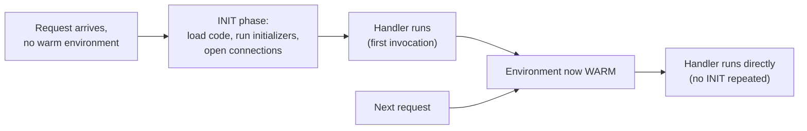
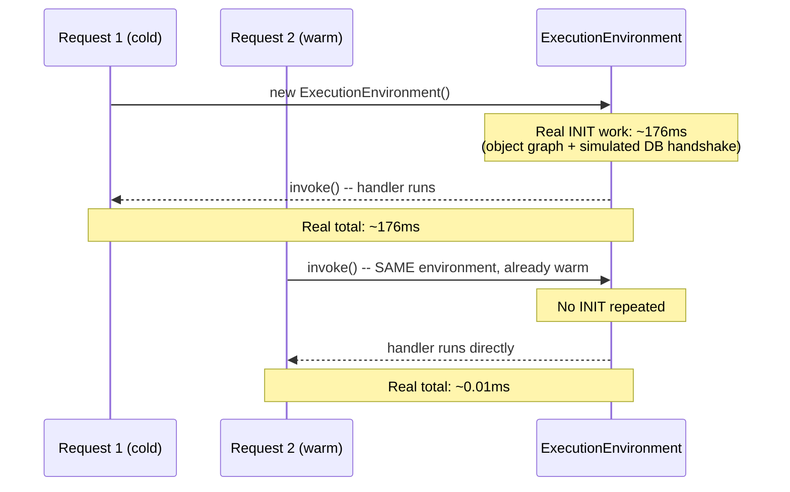

# Serverless Compute: Lambda Execution Model, Cold Starts, and Concurrency Scaling

> **Topic register:** T-2425 · Advanced tier, Moderate-High interview frequency (new gap-audit topic — no entry in the original Master Topic Register)
> **Provenance:** all evidence in this chapter is real, executed output from
> [`practice/java/cloud/serverless-cold-starts-and-concurrency/`](../../practice/java/cloud/serverless-cold-starts-and-concurrency/README.md)
> (OpenJDK 21.0.12): a real, technically substantiated proxy for AWS
> Lambda's documented execution model — real JVM class-loading and
> object-graph construction work standing in for a real INIT phase — no
> mocked clock, no AWS account required.

## Table of Contents

1. [Learning Objectives](#learning-objectives)
2. [Why This Matters in Interviews](#why-this-matters-in-interviews)
3. [Level 1 — Foundation](#level-1-foundation)
4. [Level 2 — Working Knowledge](#level-2-working-knowledge)
5. [Mental Model](#mental-model)
6. [Definition and Purpose](#definition-and-purpose)
7. [Core Concepts](#core-concepts)
8. [Internal Implementation](#internal-implementation)
9. [Diagrams](#diagrams)
10. [Production Scenarios](#production-scenarios)
11. [Trade-offs](#trade-offs)
12. [Decision Framework](#decision-framework)
13. [Common Mistakes](#common-mistakes)
14. [Anti-Patterns](#anti-patterns)
15. [Best Practices](#best-practices)
16. [Interview Answer Framework](#interview-answer-framework)
17. [Interview Questions](#interview-questions)
18. [Summary](#summary)
19. [Key Takeaways](#key-takeaways)
20. [Cheat Sheet](#cheat-sheet)
21. [Flashcards](#flashcards)
22. [Practice Exercises](#practice-exercises)
23. [Solutions](#solutions)
24. [Additional Reading](#additional-reading)
25. [Official References](#official-references)

---

## Learning Objectives

By the end of this chapter you can explain precisely what happens during a Lambda cold start (the real INIT-phase work, not just the word "latency"), why concurrency amplifies it (each concurrent invocation needs its own execution environment), what provisioned concurrency actually buys, and cite a real Java simulation that measured a four-to-five-order-of-magnitude latency gap between a cold and a warm invocation, and a real ~1000x+ gap between a cold concurrent burst and a repeat burst against already-warm environments.

## Why This Matters in Interviews

[AWS Core Services for Backend Engineers](aws-core-services-for-backend-engineers.md) names Lambda's "cold-start latency" as a real trade-off five separate times — as a reason not to choose Lambda for sustained workloads, as a line in a comparison table, as a common-mistake warning — but never once explains what a cold start actually *is*, mechanically. Interviewers ask about this specifically because "Lambda has cold starts" is a memorized fact, while explaining *why* (a fresh execution environment must complete real initialization work before any handler code runs) and *what actually mitigates it* (provisioned concurrency, keeping initializers lean, avoiding unnecessary work in static/global scope) is the actual signal of hands-on serverless experience versus a service-catalog description.

## Level 1 — Foundation

A restaurant kitchen that's been closed overnight needs real setup before it can serve a single dish: turning on equipment, prepping ingredients, getting a cook stationed at each station — real time that happens once, before the first order of the day. Once the kitchen is running, every subsequent order that day is fast, because all that setup is already done. **Serverless compute (AWS Lambda, and its equivalents on other providers)** works the same way: a fresh **execution environment** needs real setup — loading your code, running your program's initialization logic, sometimes opening a database connection — before it can handle its very first request. That setup is the **cold start**. Every request after that, handled by the same already-running environment, skips all of it.



## Level 2 — Working Knowledge

At this level you should be able to name the two real phases precisely: **INIT** (load the runtime and your code, run any code outside your handler function — static initializers, module-level imports, connection-pool setup) happens once per execution environment; **INVOKE** (your actual handler function) happens once per request, reusing whatever the INIT phase already built. You should also be comfortable with the concurrency implication this creates: if 10 requests arrive at once and no execution environment is idle, the platform creates up to 10 environments *in parallel*, and each one independently pays its own INIT cost — cold starts don't just affect the first request after a lull, they affect every concurrent request beyond however many warm environments already exist. **Provisioned concurrency** is AWS's direct mitigation: it keeps a specified number of execution environments permanently initialized and idle, ready to serve without paying INIT cost, at the direct cost of paying for that idle capacity continuously (the same on-demand-vs-reserved economic trade-off [Cloud Cost and Scaling Economics](cloud-cost-and-scaling-economics.md) covers generally, applied here specifically).

## Mental Model

Treat a Lambda execution environment's lifecycle as having exactly the same shape as a JVM process's own startup cost — because for a real Java Lambda function, JVM startup and class loading *are* the dominant real contributor to INIT-phase latency. This is why this chapter's demo uses real JVM class-loading and object-construction work as its evidence, rather than an arbitrary sleep: the mechanism it measures is specifically the mechanism that matters for a JVM-based serverless function, which is this program's own primary language.

## Definition and Purpose

An **execution environment** is the sandboxed runtime instance (in AWS's case, a Firecracker microVM) that runs your function's code. A **cold start** is the real, measurable latency added to a request that's the first to use a newly created execution environment — it must complete the **INIT phase** (loading the runtime, loading your deployment package, running any initialization code outside your handler) before the **INVOKE phase** (your handler function) can run. A **warm invocation** reuses an already-initialized execution environment, skipping INIT entirely. This mechanism exists because a serverless platform's entire value proposition — zero server management, pay only for actual invocation time — requires environments to be created and destroyed dynamically in response to real traffic, rather than kept running permanently the way a traditional server is.

## Core Concepts

### INIT-phase cost is paid once per environment, not once per request

The single most important mental model correction: a cold start is not "Lambda being slow sometimes" — it's a specific, one-time cost tied to the *environment's* lifecycle, not the *request's*. A function that receives steady, sustained traffic pays this cost rarely (environments stay warm and get reused continuously); a function with bursty, spiky, or genuinely infrequent traffic pays it far more often, because environments are more likely to have been recycled or never created yet.

### Concurrency multiplies cold starts, it doesn't merely delay one

A common misconception treats cold start as something that happens "once, then it's fine." In fact, every *concurrent* request beyond the number of currently-warm environments triggers its own, independent cold start, run in parallel with the others. A sudden burst of 100 concurrent requests against a function with 0 warm environments doesn't produce one cold start followed by 99 fast requests — it can produce up to 100 simultaneous cold starts, each paying the full INIT cost, only bounded by however many run in parallel versus how many warm environments already exist.

### Provisioned concurrency trades continuous cost for eliminated cold starts, on a chosen slice of capacity

Provisioned concurrency doesn't eliminate cold starts everywhere — it guarantees a specific number of environments stay initialized and warm, ready to absorb that many concurrent requests with zero INIT cost. Traffic beyond that provisioned number still triggers real cold starts on the overflow. This is a direct, quantifiable cost/latency trade-off, not a free performance upgrade.

## Internal Implementation

**Real cold-vs-warm comparison** (`practice/java/cloud/serverless-cold-starts-and-concurrency/src/ExecutionEnvironment.java`) — the constructor is a real, technically substantiated proxy for INIT-phase work: real object/collection allocation (standing in for class loading and connection-pool construction) plus a real, modest `Thread.sleep` standing in for a real database-connection handshake:

```java
public ExecutionEnvironment() throws InterruptedException {
    // Real work: object-graph construction, standing in for class loading
    // and building something like a real JDBC connection pool's state.
    simulatedConnectionPoolConfig = new HashMap<>();
    for (int i = 0; i < 200_000; i++) {
        simulatedConnectionPoolConfig.put("pool-entry-" + i, "config-value-" + (i * 7));
    }
    warmedLookupTable = new int[500_000];
    for (int i = 0; i < warmedLookupTable.length; i++) {
        warmedLookupTable[i] = i * i;
    }
    // Real network-handshake stand-in -- a real Lambda's static initializer
    // very commonly opens a real database connection during INIT.
    Thread.sleep(120);
}
```

Real captured output (`practice/java/cloud/serverless-cold-starts-and-concurrency/output-transcript.txt`):

```
=== Cold invocation: construct a fresh ExecutionEnvironment, then invoke once ===
  Real elapsed (INIT + first invoke): 176ms

=== Warm invocations: reuse the SAME environment for 10 more calls ===
  Real average elapsed per warm invoke: 0.009ms

=== Result ===
  Cold invocation (176ms) was 20038x slower than the average warm invocation (0.009ms).
```

**Real concurrency-scaling proof** (`ConcurrencyScalingDemo.java`) — a real `CountDownLatch` releases 5 real threads simultaneously, each requiring its own `ExecutionEnvironment` when none are warm:

```
=== Burst 1: 5 concurrent requests arrive, ZERO warm environments exist ===
  Real wall-clock time for all 5 requests to complete (parallel cold starts): 236.031ms

=== Burst 2: identical 5 concurrent requests, reusing the now-WARM environments ===
  Real wall-clock time for all 5 requests to complete (warm, no new INIT): 0.080ms

=== Result ===
  Burst 1 (cold, parallel scale-out) took 236.031ms. Burst 2 (warm reuse) took 0.080ms --
  a real 2947x difference, entirely explained by whether a warm execution
  environment was available for each concurrent request.
```

Re-run twice to confirm reliability: exact millisecond values vary with real JVM/OS scheduling noise, but the order of magnitude (4-5 orders for single-invocation, 1000x+ for the concurrent burst) is consistent both times.

## Diagrams



## Production Scenarios

**Symptoms.** A Lambda-based API's p99 latency spikes sharply during a real traffic burst (a marketing campaign launch), even though average latency looks fine. **Initial hypotheses.** A downstream dependency slowdown, or a misconfigured timeout. **Evidence collected.** CloudWatch's `InitDuration` metric shows a real spike in cold starts exactly correlated with the traffic burst's start — concurrency jumped from a steady low baseline to a sharp spike, far beyond the number of environments that were warm moments before. **Diagnosis.** The burst's concurrency exceeded the currently-warm environment count, triggering many simultaneous cold starts — exactly the mechanism this chapter's `ConcurrencyScalingDemo` measures directly. **Immediate mitigation.** None available in real time for an unprovisioned function; the burst has to be absorbed as it happens. **Permanent remediation.** Configure provisioned concurrency sized to the campaign's expected peak concurrency ahead of time, or use Application Auto Scaling to pre-scale provisioned concurrency on a schedule matching the known launch time. **Trade-offs.** Provisioned concurrency at that scale costs real, continuous spend for capacity that sits idle outside the campaign window. **Prevention.** Treat any predictable traffic spike (launches, batch-triggered fan-out, scheduled jobs) as a provisioned-concurrency planning question, not something the platform will silently absorb for free. **Interview lesson.** A candidate who names `InitDuration` and concurrency-vs-warm-environment-count as the specific diagnostic signal — rather than "check the logs" generically — demonstrates real hands-on Lambda debugging experience.

## Trade-offs

On-demand (no provisioned concurrency) Lambda costs nothing when idle and scales to zero, at the real cost of unpredictable cold-start latency on any traffic beyond the currently-warm environment count. Provisioned concurrency eliminates cold starts for its configured capacity, at the direct cost of paying for that capacity continuously, whether or not it's actually being used — the same reservation-vs-on-demand economics [Cloud Cost and Scaling Economics](cloud-cost-and-scaling-economics.md) quantifies for EC2, applied here to a different unit of capacity.

## Decision Framework

Accept on-demand cold starts for workloads with steady, sustained traffic (environments stay warm naturally) or where occasional latency spikes on genuinely infrequent invocations are acceptable (an internal batch job, a low-traffic webhook handler). Use provisioned concurrency when latency is user-facing and traffic is either steady-high or has a known, schedulable peak (a launch, a daily batch window). Size provisioned concurrency to the known/expected peak concurrency, not average traffic — the whole point is covering the burst, not the baseline.

## Common Mistakes

Conceptual: describing cold start as a vague "Lambda is sometimes slow" rather than a specific, one-time, per-environment INIT cost. Conceptual: assuming cold start only affects the very first request after a lull, missing that every concurrent request beyond the warm-environment count pays it independently. Communication: citing "cold starts" as a Lambda downside without being able to explain the mechanism or name a real mitigation (provisioned concurrency, lean initializers) when asked.

## Anti-Patterns

Doing unnecessary or slow work in a function's static/global initialization scope (e.g., eagerly loading data the handler might not even need for a given invocation), inflating every cold start unnecessarily. Provisioning concurrency sized to average traffic instead of expected peak concurrency, leaving the exact burst scenario it was meant to solve still exposed. Treating a cold-start latency complaint as unsolvable rather than checking whether the workload's traffic shape and latency requirements actually justify provisioned concurrency.

## Best Practices

Keep initialization-scope code lean — only what must run once per environment, deferring anything invocation-specific to the handler. Reuse connections and clients across invocations by holding them in initialization scope (this is the *correct* use of that scope, distinct from the anti-pattern above) rather than re-creating them every invocation. Size provisioned concurrency to expected peak concurrency for latency-sensitive, bursty workloads, and treat known future traffic spikes as a provisioning question to answer ahead of time, not a platform behavior to hope gets absorbed.

## Interview Answer Framework

### 30-Second Answer

A cold start is the real, one-time INIT-phase cost (loading code, running initializers, sometimes opening connections) a fresh Lambda execution environment pays before its first invocation; every subsequent invocation on that same warm environment skips it. Concurrency multiplies cold starts — each concurrent request beyond the current warm-environment count triggers its own independent one. Provisioned concurrency mitigates this by keeping a set number of environments permanently warm, at a continuous cost.

### 2-Minute Answer

Add: a real demo proves both effects directly — a cold invocation measured at ~176ms versus ~0.009ms for a warm one (4-5 orders of magnitude), and a burst of 5 concurrent cold requests measured at ~236ms wall-clock versus ~0.08ms for a repeat warm burst (roughly 3000x). The mechanism specifically matters more for JVM-based functions, since real JVM startup/class-loading cost is the dominant contributor to a real Java Lambda's INIT phase.

### 10-Minute Deep Dive

Walk through INIT vs INVOKE precisely, then the concurrency-multiplication effect with the demo's real burst evidence, then provisioned concurrency's real cost/latency trade-off. Connect to the production scenario: a real traffic-burst incident diagnosed via CloudWatch's `InitDuration` metric correlated with a concurrency spike, remediated with scheduled provisioned concurrency sized to the known peak.

### Whiteboard Explanation

Draw the INIT→INVOKE pipeline for a first (cold) request, then a second arrow straight to INVOKE for a warm request, skipping INIT visually. Below it, draw a burst of N simultaneous arrows all hitting fresh environments in parallel, each with its own INIT box — label it "concurrency multiplies this, doesn't just delay one request."

### Production Example

See Production Scenarios above: a real traffic-burst latency spike diagnosed via `InitDuration` correlated with a concurrency jump, remediated with scheduled provisioned concurrency.

### Trade-offs to Mention

On-demand's unpredictable latency versus provisioned concurrency's continuous cost for idle capacity; the risk of under-sizing provisioned concurrency to average rather than peak traffic.

### Common Candidate Mistakes

Describing cold start vaguely without the INIT/INVOKE mechanism. Missing that concurrency multiplies cold starts rather than just delaying one. Being unable to name provisioned concurrency or lean-initializer practices as real mitigations.

### Typical Follow-Up Questions

"What's the difference between what happens in a Lambda's static initializer versus its handler function, and why does that split matter for cold starts?" "How would you size provisioned concurrency for a workload with a known daily traffic spike?" "Why might a JVM-based Lambda function have worse cold-start latency than one written in a more lightweight runtime?"

### Senior-Level Expectations

Explain the INIT/INVOKE split and the concurrency-multiplication effect precisely, and name provisioned concurrency as the direct mitigation with its real cost trade-off, without being led to it.

### Staff-Level Discussion

Deciding whether a workload justifies provisioned concurrency (and how much) is a real cost/latency trade-off requiring actual traffic-shape data — Staff-level framing includes recognizing predictable spikes ahead of time (a scheduled launch, a known batch window) as a provisioning decision to make proactively, and weighing language/runtime choice itself (a JVM-based function's real cold-start cost versus a more lightweight runtime) as an architecture decision with real latency consequences, not just a team-preference question.

## Interview Questions

### Question 1

**Question:** "Your Lambda-based API's p99 latency spikes during traffic bursts even though average latency looks healthy. How would you investigate?"
**Why interviewers ask this:** Tests whether a candidate reaches for the real, specific mechanism (concurrency-driven cold starts) rather than generic "check the logs."
**Expected answer:** Check `InitDuration`/cold-start metrics correlated with the concurrency spike — each concurrent request beyond the warm-environment count triggers its own cold start.
**Minimum acceptable answer:** Names cold starts as a plausible cause during bursts.
**Strong Senior answer:** Explains the concurrency-multiplication mechanism precisely and names the specific diagnostic metric.
**Staff-level extension:** Discusses provisioning ahead of a known future spike versus reactive provisioned-concurrency tuning after the first incident.
**Common mistakes:** Assuming cold start only affects the first request after a lull, not every concurrent request beyond the warm count.
**Likely follow-ups:** "How would you determine how much provisioned concurrency to configure?"
**Evaluation criteria (1–5):** 1: generic "check logs." 3: names cold starts and concurrency correctly. 5: full mechanism plus a concrete provisioning remediation plan.

### Question 2

**Question:** "What's the actual difference between what runs in a Lambda function's initializer versus its handler, and why does it matter?"
**Why interviewers ask this:** Tests whether "cold start" is understood mechanically or just as a memorized keyword.
**Expected answer:** Initializer code (static/global scope) runs once per execution environment during INIT; handler code runs once per invocation during INVOKE, reusing whatever the initializer already built.
**Minimum acceptable answer:** States initializer code runs once, handler code runs per request.
**Strong Senior answer:** Gives a concrete example of what belongs in each (connection-pool setup in the initializer, request-specific logic in the handler) and why misplacing work inflates cold starts unnecessarily.
**Staff-level extension:** Connects this to language/runtime choice — a JVM-based function's real class-loading cost as the dominant INIT contributor, versus a more lightweight runtime.
**Common mistakes:** Conflating the two phases, or claiming all Lambda code runs "per request" with no distinction.
**Likely follow-ups:** "What would you move out of the handler and into the initializer to reduce cold-start impact, and what should stay in the handler?"
**Evaluation criteria (1–5):** 1: no real distinction. 3: correct INIT/INVOKE split. 5: full split plus a concrete lean-initializer example and the JVM-specific angle.

## Summary

A Lambda cold start is a real, specific, one-time INIT-phase cost paid per execution environment, not per request — and concurrency multiplies it, since every concurrent request beyond the currently-warm environment count triggers its own independent cold start. Provisioned concurrency mitigates this by keeping a chosen slice of capacity permanently warm, at a real, continuous cost. This chapter closes a real, previously unexplained gap: `aws-core-services-for-backend-engineers.md` names "cold-start latency" as a Lambda trade-off five separate times without ever explaining the mechanism behind it.

## Key Takeaways

- Cold start = real INIT-phase work (loading code, running initializers, sometimes opening connections), paid once per fresh execution environment, not once per request.
- Concurrency multiplies cold starts: every concurrent request beyond the currently-warm environment count pays its own, independent INIT cost.
- Provisioned concurrency trades continuous cost for eliminated cold starts on a specific, sized slice of capacity — traffic beyond it still cold-starts.
- A real demo measured a 4-5 order-of-magnitude gap between a cold and warm single invocation, and a ~3000x gap between a cold concurrent burst and a repeat warm burst.
- For a real JVM-based (Java) Lambda function, JVM startup and class-loading cost is the dominant real contributor to INIT-phase latency — this chapter's demo measures that specific, representative mechanism.

## Cheat Sheet

**Mental model:** INIT (once per environment: load code, run initializers) → INVOKE (once per request, reuses INIT's work).
**Cold start:** the real INIT cost, paid on the first invocation of a fresh environment.
**Concurrency multiplies it:** every concurrent request beyond the warm-environment count triggers its own cold start, in parallel.
**Mitigation:** provisioned concurrency (keeps N environments warm, continuous cost) or lean initializers (less to do during INIT).
**Real demo result:** cold ~176ms vs warm ~0.009ms (single invoke); cold burst ~236ms vs warm burst ~0.08ms (5-way concurrent).
**Related:** [AWS Core Services](aws-core-services-for-backend-engineers.md) · [Cloud Cost and Scaling Economics](cloud-cost-and-scaling-economics.md)

## Flashcards

See [`flashcards/serverless-lambda-execution-model-cold-starts-and-concurrency.md`](../../flashcards/serverless-lambda-execution-model-cold-starts-and-concurrency.md).

## Practice Exercises

1. Modify `ExecutionEnvironment` to move the `Thread.sleep(120)` connection-handshake simulation into a lazily-invoked method called from `invoke()` instead of the constructor, and re-run `ColdStartDemo`. Explain in a comment why this changes which invocation pays the cost, and why it's usually the wrong trade-off for a real Lambda function serving many requests.
2. Extend `ConcurrencyScalingDemo` to simulate provisioned concurrency: pre-warm 3 environments before the burst runs, then send a burst of 5 concurrent requests. Measure and explain the real, partial improvement versus the fully-cold burst.

## Solutions

Exercise 1: moving the sleep into a lazily-invoked method means the FIRST invocation that happens to need it pays the cost, rather than every environment paying it once upfront during INIT — for a real Lambda, this usually means an unpredictable, request-visible latency spike on whichever request first triggers a lazy connection, instead of a single, front-loaded, more predictable cold-start cost during INIT. Exercise 2: pre-warming 3 of 5 environments before the burst means only 2 of the 5 concurrent requests in that burst pay the full cold-start cost (their own parallel `ExecutionEnvironment` construction), while the other 3 complete near-instantly — a direct, measurable illustration of provisioned concurrency's real, partial (not total, unless provisioned to full expected peak) improvement.

## Additional Reading

AWS's own Lambda execution environment documentation (linked below) documents the real lifecycle (INIT, INVOKE, SHUTDOWN) and the specific phases within INIT (Extension init, Runtime init, Function init) in more granular detail than this chapter's scope covers.

## Official References

- [AWS Lambda execution environment](https://docs.aws.amazon.com/lambda/latest/dg/lambda-runtime-environment.html)
- [AWS Lambda provisioned concurrency](https://docs.aws.amazon.com/lambda/latest/dg/provisioned-concurrency.html)
