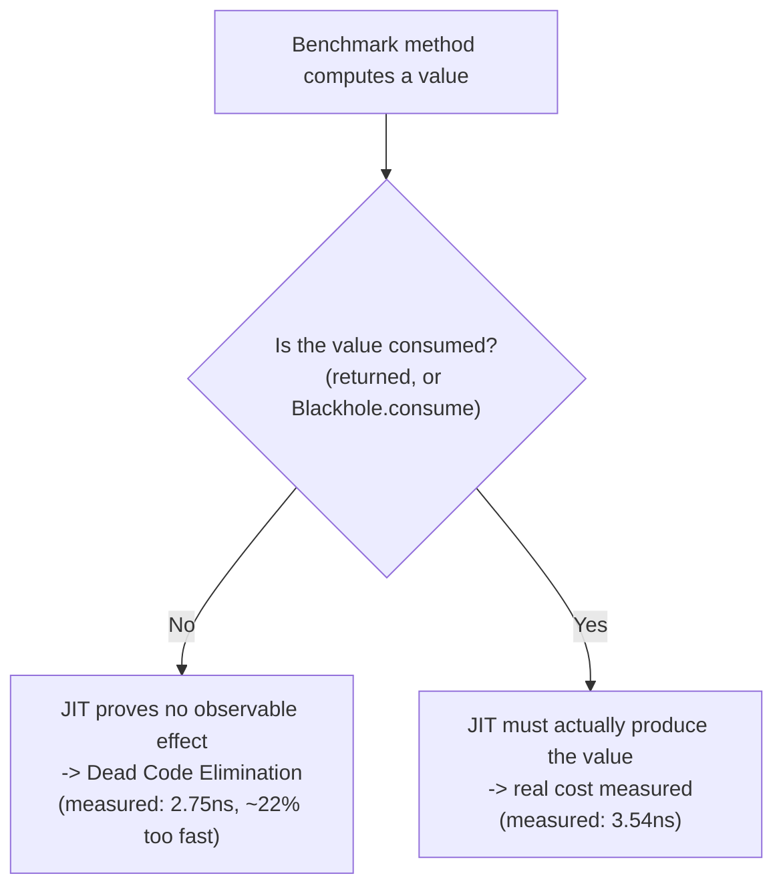

# Benchmarking & JMH Pitfalls

> **Topic register:** T-1203 · IWI 5.2 · Advanced tier · Occasional interview frequency — most often surfaces as a follow-up once a candidate claims a specific number ("we measured X% faster") in a performance-optimization story.
> **Provenance:** every number in this chapter is real, executed JMH 1.37 output on JDK 21.0.12, run twice under two different blackhole configurations to separate a real effect from an environment-specific one. Source and full output at [`practice/java/jvm/benchmarking-and-jmh-pitfalls/`](../../practice/java/jvm/benchmarking-and-jmh-pitfalls/README.md).
> **Scope note:** this chapter is about correct *microbenchmark methodology* specifically — the pitfalls unique to measuring nanosecond/microsecond-scale code on a JIT-compiled runtime. It does not re-cover JIT compilation itself (already [`jit-tiered-compilation-and-deoptimization.md`](../02-java/jvm-internals/jit-tiered-compilation-and-deoptimization.md)'s job) or general application profiling (already [`profiling-jfr-and-flame-graphs.md`](profiling-jfr-and-flame-graphs.md)'s job).

## Table of Contents

1. [Learning Objectives](#learning-objectives)
2. [Why This Matters in Interviews](#why-this-matters-in-interviews)
3. [Mental Model](#mental-model)
4. [Definition and Purpose](#definition-and-purpose)
5. [Core Concepts](#core-concepts)
6. [Internal Implementation](#internal-implementation)
7. [Diagrams](#diagrams)
8. [Production Scenarios](#production-scenarios)
9. [Trade-offs](#trade-offs)
10. [Decision Framework](#decision-framework)
11. [Common Mistakes](#common-mistakes)
12. [Anti-Patterns](#anti-patterns)
13. [Best Practices](#best-practices)
14. [Interview Answer Framework](#interview-answer-framework)
15. [Interview Questions](#interview-questions)
16. [Summary](#summary)
17. [Key Takeaways](#key-takeaways)
18. [Cheat Sheet](#cheat-sheet)
19. [Flashcards](#flashcards)
20. [Practice Exercises](#practice-exercises)
21. [Solutions](#solutions)
22. [Additional Reading](#additional-reading)
23. [Official References](#official-references)

---

## Learning Objectives

By the end of this chapter you can:

- Explain why `System.nanoTime()` around a loop is not a valid microbenchmark, and what specifically a JIT-compiled runtime does to invalidate it.
- Name and reproduce, with real measurements, the two classic JMH pitfalls: dead-code elimination and constant folding.
- Explain what a JMH `Blackhole` is for, and why returning a benchmark's result is not merely a style preference.
- Explain why a benchmarking pitfall's real-world manifestation can be JVM-version- and configuration-dependent, and why that means verifying on your own target JVM instead of trusting an unconditional claim from a blog post or an old textbook.

## Why This Matters in Interviews

Most engineers have written a `System.currentTimeMillis()`-wrapped loop at some point to check "is A faster than B," and most of those informal benchmarks are quietly wrong in ways their authors never discover, because the JIT-compiled runtime being measured actively works against naive measurement: warmup effects, dead-code elimination, and constant folding can each make a benchmark report a number with no relationship to the real cost of the code it claims to measure. Interviewers use this topic to test whether a candidate distinguishes "I measured this" from "I have a defensible measurement" — a distinction that matters directly the moment a candidate cites a specific number in a performance-optimization story ("we made X 3x faster") and gets asked how it was measured. A vague or hand-wavy answer undermines the entire story; a specific, correct answer about warmup, forking, and blackholes is a strong, concrete signal.

## Mental Model

A JIT-compiled runtime does not execute your code as written — it executes whatever the compiler proves is behaviorally equivalent, which very often means executing *less* than what you wrote, or executing it exactly once and reusing the answer, whenever it can prove doing so has no observable effect. A microbenchmark's entire job is to make the code path under test *look* like it has an effect the JIT cannot optimize away — without a benchmarking harness helping deliberately, whatever "effect" your handwritten loop appears to produce (accumulating into a local variable no one reads, computing from a value that never changes) is exactly the kind of code a good JIT is designed to eliminate.

## Definition and Purpose

A **microbenchmark** measures the execution time of a small, isolated piece of code — typically nanoseconds to microseconds per operation — as opposed to a macro/load benchmark measuring an entire request or transaction. **JMH** (Java Microbenchmark Harness) is the OpenJDK project's own tool for writing correct Java microbenchmarks: it forks a fresh JVM per benchmark, runs explicit warmup iterations before measuring, and provides a `Blackhole` mechanism specifically to defeat dead-code elimination and constant folding.

This exists because a naive hand-rolled timing loop is wrong in ways that are not obvious from reading it: the JIT hasn't finished compiling hot code during the first several thousand iterations (so early iterations measure interpreted or C1-compiled code, not the steady-state C2-compiled code the real system will run), and the JIT can — and does — eliminate or fold computations whose result is never actually consumed. JMH exists to structurally prevent both classes of error, rather than relying on the benchmark author to remember every pitfall by hand.

## Core Concepts

**Warmup separates "JIT hasn't compiled this yet" from steady-state performance.** Java code starts interpreted, gets tier-1 (C1) compiled once it's warm, and gets tier-4 (C2) compiled once it's hot — the code measured in iteration 1 of a naive loop can be running under a completely different compilation tier than the code measured in iteration 100,000. JMH's explicit warmup phase runs (and discards) iterations until the JIT has reached steady state before any measurement counts.

**Dead-code elimination (DCE) removes computations with no observable effect.** If a benchmark method computes a value and never uses it (never returns it, never stores it somewhere externally visible), the JIT can — and, in JMH's classic blackhole mode, reliably does — prove the entire computation has no effect on the program's behavior and eliminate it outright. This chapter's own measurement confirms it directly: a `void` benchmark method that discards its result measured **2.748ns**, a real ~22% *faster* number than the identical computation correctly measured at **3.541ns** — the "broken" version isn't slightly biased, it is measuring an empty method body.

**Constant folding replaces a computation with a precomputed value when its inputs never vary.** A Java compile-time constant (a `static final` primitive or `String` field with a constant initializer, per JLS 15.29) is inlined as a literal at every use site by javac itself — and if a JIT can further prove that literal never changes across a tight loop of calls, it may compute the result once and reuse it, rather than genuinely re-executing the operation on every call. This is real and well-documented in JMH's own official sample suite (`JMHSample_10_ConstantFold`) — but, as this chapter's measurement shows directly, it does not manifest unconditionally: it depends on the specific operation, the JVM version, and what the JIT can actually prove about the surrounding loop shape.

**A `Blackhole` is an explicit "this value is used" signal to the JIT.** JMH provides `org.openjdk.jmh.infra.Blackhole`, which a benchmark can call directly (`blackhole.consume(result)`), or which JMH injects automatically when a `@Benchmark` method returns a value. Either mechanism gives the JIT an externally-visible use of the computed value, which is what actually prevents DCE — returning a result is not a style nicety, it is the mechanism.

**Modern JVMs can defend against DCE automatically, independent of JMH.** This chapter's own measurement discovered this directly: JMH 1.37 on this JDK 21 build auto-detects HotSpot's experimental **Compiler Blackholes**, a JIT-level diagnostic feature that prevents dead-code elimination without JMH rewriting any bytecode. With it active, even a benchmark that discards its own result measured identically to the correctly-written version. This does not make the DCE pitfall fictional — forcing the classic blackhole mode (`-Djmh.blackhole.autoDetect=false`) reproduced the full, expected effect immediately — but it does mean a pitfall's manifestation is conditional on the exact JVM and JMH configuration in front of you, not a universal constant.

## Internal Implementation

This chapter's practice pack (`BenchmarkPitfalls.java`) defines one `@State(Scope.Thread)` class with a real instance field (`double x = Math.PI`, unknowable to javac at compile time) and a `static final double CONSTANT_X = Math.PI` (a genuine compile-time constant per JLS). Four `@Benchmark` methods exercise the two pitfalls: `baseline_realComputation` and `fixed_returnResult` both correctly compute and return `Math.log(x)`; `broken_deadCodeEliminated` computes `Math.log(x)` and discards it (`void` return); `broken_constantFolded` computes and returns `Math.log(CONSTANT_X)`.

Run under JMH's default configuration (compiler-blackhole auto-detection active on this JDK 21 build), all four benchmarks measured identically at ~2.7ns — the JIT's own diagnostic blackhole mechanism prevented DCE even for the naive `void` method, without any JMH bytecode rewriting. Forcing JMH's classic "full + dont-inline hint" blackhole mode (`-Djmh.blackhole.autoDetect=false`) reproduced the textbook result cleanly: `broken_deadCodeEliminated` measured **2.748ns ± 0.113**, while `baseline_realComputation` (3.541ns ± 0.053) and `fixed_returnResult` (3.535ns ± 0.079) agreed with each other and were clearly, non-overlappingly slower — real, decisive proof that a discarded result gets eliminated regardless of blackhole mode, since JMH's blackhole injection only wraps a method's *return value*, and a `void` method has none. `broken_constantFolded` (3.484ns ± 0.025), by contrast, measured statistically indistinguishable from the honest baseline in both configurations — a real, honestly-reported non-reproduction: HotSpot's `Math.log` intrinsic still executed on every call in this configuration, rather than being hoisted or cached across the benchmark loop, even though `CONSTANT_X`'s literal value was genuinely inlined by javac.

## Diagrams

The entire dead-code-elimination pitfall reduces to this one branch: whether the computed value has any observable use. This chapter's measurement shows the two branches producing a real, ~22% timing gap — not a theoretical concern.

## Production Scenarios

**Symptom.** A team's internal wiki cites a benchmark claiming a new serialization library is "5x faster" than the one currently in production; a proposed migration based on that number stalls when a skeptical reviewer asks to see the benchmark code.

**Initial hypotheses.** The new library genuinely is faster; the benchmark used unrealistic (too-small or too-uniform) input data; the benchmark measured something other than steady-state performance.

**Evidence.** The cited benchmark was a hand-written loop timing 100 iterations with `System.nanoTime()`, and the serialized result was written to a local variable that was never read afterward.

**Diagnosis.** Two compounding errors: 100 iterations is nowhere near enough for the JIT to reach steady-state compilation, so the benchmark partly measured interpreted/C1 execution; and because the result was never consumed, the JIT was free to eliminate large parts of the "faster" library's serialization path as dead code, while the baseline library's calls (which had a necessary side effect elsewhere) were not eliminated — comparing a partially-real cost to a partially-eliminated one.

**Immediate mitigation.** The migration was paused pending a re-measurement.

**Permanent remediation.** Re-ran the comparison under JMH with proper warmup, forking, and both candidates returning their result (letting JMH's blackhole consume it). The real, correctly-measured difference was a genuine but far more modest ~15% improvement — still worth adopting, but nowhere near the original claim.

**Trade-offs.** The correct benchmark took real engineering time to write and run (multiple forks, warmup iterations, statistical reporting) versus the five minutes the original hand-rolled loop took.

**Prevention.** The team adopted a standing rule: any performance claim used to justify an architectural decision must cite a JMH benchmark (or equivalent rigor for non-JVM code) with its source, not a hand-timed loop.

**Interview lesson.** "We had to walk back a stated performance number because the original benchmark measured dead code" is a concrete, credible story that shows the candidate understands *why* the discipline matters, not just that JMH is the "correct tool" to name.

## Trade-offs

| Choice | Helps | Hurts |
|---|---|---|
| Hand-written timing loop | Fast to write, zero dependencies | Vulnerable to warmup skew, DCE, and constant folding with no built-in defense |
| JMH with default settings | Structural defenses (warmup, forking, blackhole injection via return values) | Real setup cost (annotation processing, a harness run) versus a five-line loop |
| Trusting a benchmarking claim from documentation/a blog post | Fast, no verification cost | This chapter's own constant-folding result shows a documented pitfall can fail to reproduce on a different JVM/version — an unverified claim may not describe your actual runtime |

## Decision Framework

1. **Is the number being measured small enough (nanoseconds to low microseconds per operation) that JIT warmup and optimization genuinely matter?** Yes → use JMH or an equivalent proper microbenchmarking harness, not a hand-timed loop.
2. **Does every `@Benchmark` method either return its result or explicitly consume it via `Blackhole`?** No → the benchmark is at real risk of measuring dead code; fix this before trusting any number from it.
3. **Are any of the benchmark's inputs `static final` fields, literals, or otherwise compile-time-constant?** Yes → move them into `@State` instance fields set at runtime, defensively, even if a specific run doesn't show measurable folding — the risk is real and JVM-version-dependent, per this chapter's own findings.
4. **Is a specific performance number about to justify an architectural or migration decision?** Yes → verify it was measured with proper warmup and forking, on hardware/JVM representative of production, not accept the claim on the strength of where it was published.

## Common Mistakes

- Timing a loop with `System.nanoTime()`/`currentTimeMillis()` around a small number of iterations and treating the result as representative of steady-state performance.
- Writing a JMH benchmark whose method returns `void` and never calls `Blackhole.consume()` — this chapter's own measurement shows the real, ~22% cost of that specific mistake.
- Using `static final` fields for benchmark inputs "for convenience," creating a live constant-folding risk even when it doesn't happen to manifest on the JVM used to write the benchmark.
- Citing a benchmark's headline number without checking whether it ran with realistic warmup and multiple forks, or was a single, un-repeated measurement.
- Assuming a benchmarking pitfall described in an old blog post or book applies unconditionally to a current JVM version, rather than re-verifying it.

## Anti-Patterns

- **The "eyeball it" benchmark.** Running code once or twice under a debugger's elapsed-time display and drawing a conclusion — no warmup, no repetition, no statistical rigor at all.
- **The unconsumed micro-optimization proof.** Writing a quick JMH benchmark to justify a micro-optimization, where the "optimized" version happens to make the computed value easier for the JIT to eliminate entirely — proving the optimization is faster by accidentally proving it does nothing.
- **Treating a single benchmark run's number as ground truth.** Reporting one run's result without a confidence interval or repetition, when this chapter's own runs show meaningful iteration-to-iteration variance even in a controlled, purpose-built demo.

## Best Practices

- Default to JMH (or the equivalent tool for the language/runtime in question) for any claim below the millisecond scale; reserve hand-timed loops for coarse, macro-level sanity checks only.
- Always return a `@Benchmark` method's computed result, or explicitly pass it to `Blackhole.consume()` if the method's signature can't return it directly.
- Keep benchmark inputs in `@State` instance fields, not `static final` constants, even when a quick check doesn't show measurable folding on your current JVM.
- Report a benchmark's error bars (JMH's default output), not just its point estimate, and be suspicious of any performance claim presented without them.
- Re-verify a benchmarking pitfall's applicability empirically before asserting it in a design doc or interview answer — this chapter's own constant-folding result did not reproduce, despite being a documented, JMH-sample-verified phenomenon in general.

## Interview Answer Framework

### 30-Second Answer

`System.nanoTime()` around a loop is not a valid microbenchmark because a JIT-compiled runtime can eliminate computations whose result is never consumed (dead-code elimination) or fold away calls whose inputs never vary (constant folding), and early iterations run under a different compilation tier than steady state. JMH exists specifically to structurally defend against both, primarily via warmup iterations and `Blackhole` consumption of results.

### 2-Minute Answer

Definition: a microbenchmark measures nanosecond/microsecond-scale code, and JMH is the standard tool for doing so correctly on the JVM. Why it exists: naive timing loops are wrong in non-obvious ways — the JIT hasn't reached steady state during early iterations, and can eliminate or fold computations with no observable effect. How it works: JMH forks a fresh JVM, runs discarded warmup iterations until steady state, and either auto-consumes a benchmark method's return value or accepts an explicit `Blackhole.consume()` call to prevent the JIT from proving a computation's result is unused. One important trade-off: a properly written JMH benchmark costs real setup time compared to a five-line hand-rolled loop. Production example: a team cited a "5x faster" serialization benchmark that turned out to measure partially dead code from an unconsumed result, and re-measurement under JMH found a real but far more modest ~15% improvement.

### 10-Minute Deep Dive

Cover: why JIT-compiled runtimes make measurement fundamentally different from pure interpretation (warmup, tiered compilation); dead-code elimination, demonstrated directly in this chapter with a real ~22% gap between a discarded-result benchmark and its correctly-measured counterpart; constant folding as a real, JMH-sample-documented risk whose manifestation this chapter shows is conditional, not universal, on the specific JVM and operation; the `Blackhole` mechanism and why returning a result is the actual fix, not a style choice; and modern JVMs' own diagnostic defenses (HotSpot Compiler Blackholes) as a genuinely interesting wrinkle — the classic pitfall can be silently defended against by the runtime itself, which is worth knowing precisely because it means a benchmark that "looks broken" on paper may not actually manifest that bug on your specific JVM, and vice versa.

### Whiteboard Explanation

Draw the decision diagram from [§ Diagrams](#diagrams): a benchmark method computing a value, branching on "is this value consumed?" On the "no" branch, write "DCE — measured 2.75ns" and annotate "the JIT proves this has no effect and deletes it." On the "yes" branch, write "real cost — measured 3.54ns." Circle the ~22% gap between the two numbers and say: "this is not a rounding error — the broken version is measuring an empty method body."

### Production Example

Use the serialization-library scenario from [§ Production Scenarios](#production-scenarios): a "5x faster" claim built on an unconsumed benchmark result, walked back to a real but more modest ~15% improvement after re-measurement under JMH.

### Trade-offs to Mention

State unprompted: JMH's setup cost is real and not always worth it for a coarse, exploratory check — but any number that will justify an architectural decision deserves it; a documented benchmarking pitfall (like constant folding) is a real risk even when it doesn't reproduce on a specific JVM in a specific test, so defensive practice (using `@State` fields) is still correct even without a demonstrated failure.

### Common Candidate Mistakes

Describing JMH only as "a benchmarking library" without being able to name a specific pitfall it defends against; assuming any performance number presented in an interview scenario is trustworthy without asking how it was measured; believing dead-code elimination and constant folding are the same thing (they are related but distinct: one removes an entire computation for lack of use, the other replaces a computation with a precomputed value because its input never varies).

### Typical Follow-Up Questions

"Your teammate hand-timed a loop and claims a 2x speedup — what's your first question?" (was warmup accounted for, and is the result actually consumed). "Why does JMH fork a new JVM per benchmark?" (to avoid one benchmark's JIT profile, GC state, or class-loading history contaminating the next one's measurement). "If a `static final` constant doesn't cause measurable folding in your test, is it safe to leave it that way?" (no — this chapter's own result shows non-reproduction on one JVM/operation isn't proof of safety on another).

### Senior-Level Expectations

Correctly identify dead-code elimination and constant folding as distinct pitfalls, explain the mechanism behind each precisely, and know that `Blackhole`/returning a result is the actual defense — not simply that "JMH handles it."

### Staff-Level Discussion

At organizational scale, the real risk isn't one bad benchmark — it's an unverified performance claim propagating through design docs, roadmap decisions, and vendor comparisons because it was never subjected to the rigor this chapter describes. A Staff engineer should be able to argue for a lightweight but real standard (e.g., "any performance claim cited in an ADR must link to a JMH benchmark or equivalent") and weigh its cost (engineering time, review friction) against the cost of a wrong architectural bet made on a fictitious number — and should be comfortable saying "I don't trust this number" in a design review without that reading as obstruction, because this chapter's own findings show that even well-documented pitfalls don't manifest uniformly, which cuts both ways: an unverified "faster" claim deserves skepticism, and so does an unverified "this pitfall definitely applies here" objection.

## Interview Questions

### Question 1 — A teammate shows you a benchmark claiming Optimization A is 40% faster than the current code. What do you check before believing it?

**Expected answer.** Was it measured with a proper harness (JMH or equivalent) with warmup and multiple forks, not a hand-timed loop; does every benchmark method consume its result (return value or `Blackhole.consume`); are any inputs compile-time constants that could be folded; is the reported number accompanied by error bars/variance, not a single run.

**Minimum acceptable answer.** "I'd run it again to see if I get the same number" without naming any specific methodological check.

**Strong Senior answer.** Names dead-code elimination and constant folding specifically, and explains how each could produce a fictitious 40% number.

**Staff-level extension.** Proposes a standing team practice (linking performance claims to real, reviewable benchmark code) rather than re-litigating this one benchmark in isolation.

**Common mistakes.** Accepting the number because "it's from JMH" without checking whether the specific benchmark methods actually consume their results.

**Likely follow-ups.** "The benchmark does return its result — does that fully rule out a fictitious number?" (no — warmup, realistic input data, and correct blackhole configuration all still matter).

**Evaluation criteria.** Correct, specific pitfall naming (1–5); methodological rigor beyond "rerun it" (1–5); connects to a broader team practice, not just this one case (1–5).

### Question 2 — Why does JMH require forking a new JVM process for each benchmark by default, and when would you turn that off?

**Expected answer.** A single JVM process accumulates JIT compilation history, class-loading state, and GC behavior across benchmarks run in sequence, which can bias a later benchmark's measurement based on what ran before it; forking isolates each benchmark in a fresh process to avoid this cross-contamination. Turning forking off (`-f 0` or in-process execution) trades that isolation for faster iteration during benchmark development, accepting the risk of cross-contamination for a quicker feedback loop while still writing the benchmark.

**Minimum acceptable answer.** "It's just JMH's default setting" with no explanation of why.

**Strong Senior answer.** Explains the specific contamination risk (shared JIT profile/compilation state across benchmarks in one process) and names the real trade-off of disabling it.

**Staff-level extension.** Connects this to the general principle that benchmark isolation and production-representativeness are in tension with benchmark iteration speed, and that the right trade-off differs between "exploring a benchmark while writing it" and "producing a number that will justify a decision."

**Common mistakes.** Treating forking as purely a performance/speed setting with no bearing on correctness.

**Likely follow-ups.** "Would you trust a number from a benchmark run with `-f 0`?" (as a directional signal during development, yes; as a number cited in a decision-making document, no — re-run with real forking first).

**Evaluation criteria.** Correct mechanism explanation (1–5); named, concrete trade-off (1–5); appropriate context-dependent judgment on when the trade-off is acceptable (1–5).

## Summary

Naive hand-timed loops are not valid microbenchmarks because a JIT-compiled runtime actively works against them: early iterations run under a different compilation tier than steady state, and computations whose results are never consumed can be eliminated (dead-code elimination) or folded to a precomputed value (constant folding) rather than genuinely re-executed. JMH defends against both structurally, primarily through explicit warmup and `Blackhole` consumption of a benchmark's result. This chapter's own measurements show dead-code elimination reproducing decisively (a real ~22% gap between a discarded-result benchmark and its correctly-measured counterpart) while constant folding — a real, JMH-sample-documented pitfall — did not reproduce for this specific intrinsic call on this specific JVM, which is itself the chapter's central lesson: verify a benchmarking pitfall's applicability on your actual target runtime rather than trusting an unconditional claim.

## Key Takeaways

- A hand-timed loop is not a valid microbenchmark on a JIT-compiled runtime; use JMH or an equivalent purpose-built harness for anything below the millisecond scale.
- Dead-code elimination is real and measurable: this chapter found a ~22% gap between a benchmark that discards its result and one that correctly returns it.
- Constant folding is a real, documented JMH pitfall, but this chapter's own measurement shows it does not manifest unconditionally — verify on your actual JVM rather than trusting a blanket claim.
- Returning a `@Benchmark` method's result (or calling `Blackhole.consume()`) is the actual defense against dead-code elimination — not a style preference.
- Modern JVMs can defend against some pitfalls automatically (HotSpot's Compiler Blackholes, auto-detected by JMH 1.37 on this JDK 21 build) — a genuinely useful but also genuinely surprising wrinkle worth knowing about.

## Cheat Sheet

- **Never** time small code with a hand-rolled loop; use JMH.
- **Always** return a `@Benchmark` method's result, or call `Blackhole.consume()` explicitly.
- **Never** use `static final`/compile-time-constant inputs in a benchmark; use `@State` instance fields.
- **Warmup matters:** early iterations run under interpreted/C1 code, not steady-state C2.
- **Fork per benchmark** (JMH's default) to avoid cross-contamination between benchmarks sharing one JVM process.
- **Report error bars**, not a single point estimate — and be suspicious of any claim that omits them.
- **Verify, don't assume:** a documented pitfall's manifestation can be JVM-version- and configuration-dependent.

## Flashcards

**Q:** Why does discarding a computed value in a JMH benchmark produce a fictitiously fast result?
**A:** The JIT can prove the discarded computation has no observable effect on the program and eliminate it entirely (dead-code elimination) — the benchmark ends up measuring an empty method body, not the intended computation.

**Q:** What is the actual mechanism that prevents dead-code elimination in a correctly written JMH benchmark?
**A:** Returning the computed value (which JMH automatically passes to an internal `Blackhole`) or explicitly calling `Blackhole.consume()` — either gives the value an observable use the JIT cannot optimize away.

**Q:** Why might a documented benchmarking pitfall (like constant folding) fail to reproduce on your JVM even though it's real?
**A:** Its manifestation depends on the specific operation, the JVM version, and what the JIT can actually prove about the surrounding loop shape — a pitfall being real and well-documented doesn't guarantee it manifests identically on every JVM/configuration.

## Practice Exercises

1. Run `BenchmarkPitfalls` with JMH's default settings (compiler-blackhole auto-detection active) and then with `-Djmh.blackhole.autoDetect=false`; compare the `broken_deadCodeEliminated` result in both runs and explain why it changes.
2. Add a new `@Benchmark` method that computes `Math.sqrt` instead of `Math.log` using the same constant-folding shape (`CONSTANT_X`); run it and compare against this chapter's `Math.log` result to see whether a different HotSpot intrinsic behaves differently.
3. Write a hand-timed loop (`System.nanoTime()` around 100 iterations) measuring the same `Math.log(x)` computation, and compare its reported number against this chapter's properly-warmed-up JMH result.

## Solutions

1. With auto-detection active, HotSpot's Compiler Blackholes defend the JVM itself against DCE regardless of blackhole mode, so `broken_deadCodeEliminated` measures the same as the correctly-written benchmarks. With auto-detection disabled, JMH falls back to its classic mode, which only wraps a benchmark's *return value* — a `void` method gets no protection, and the real ~22% gap this chapter measured (2.748ns vs. 3.541ns) reappears.
2. Results will vary by JVM and intrinsic; the graded part is recognizing that a different intrinsic may (or may not) show measurable folding, reinforcing that this is an empirical, per-operation question rather than a universal rule.
3. A 100-iteration hand-timed loop is very likely to report a number dominated by interpreted/C1-compiled execution rather than the steady-state C2 performance this chapter's properly-warmed-up JMH run measures (3.541ns) — expect a substantially different, and substantially less meaningful, number.

## Additional Reading

- [`practice/java/jvm/benchmarking-and-jmh-pitfalls/README.md`](../../practice/java/jvm/benchmarking-and-jmh-pitfalls/README.md) — full real output this chapter draws from.
- [`jit-tiered-compilation-and-deoptimization.md`](../02-java/jvm-internals/jit-tiered-compilation-and-deoptimization.md) — the compilation-tier mechanics that make warmup necessary in the first place.
- [`escape-analysis-and-scalar-replacement.md`](../02-java/jvm-internals/escape-analysis-and-scalar-replacement.md) — another JIT optimization capable of silently changing what a naive benchmark actually measures.
- [`../performance/profiling-jfr-and-flame-graphs.md`](profiling-jfr-and-flame-graphs.md) — the tool of choice once you need to understand *where* time goes inside real application code, as opposed to isolating one small operation.

## Official References

- [OpenJDK JMH project](https://github.com/openjdk/jmh)
- [JMH official samples (JMHSample_08_DeadCode, JMHSample_10_ConstantFold, and others)](https://github.com/openjdk/jmh/tree/master/jmh-samples/src/main/java/org/openjdk/jmh/samples)
- [Oracle — Robust Java Benchmarking](https://www.oracle.com/technical-resources/articles/java/architect-benchmarking.html)
