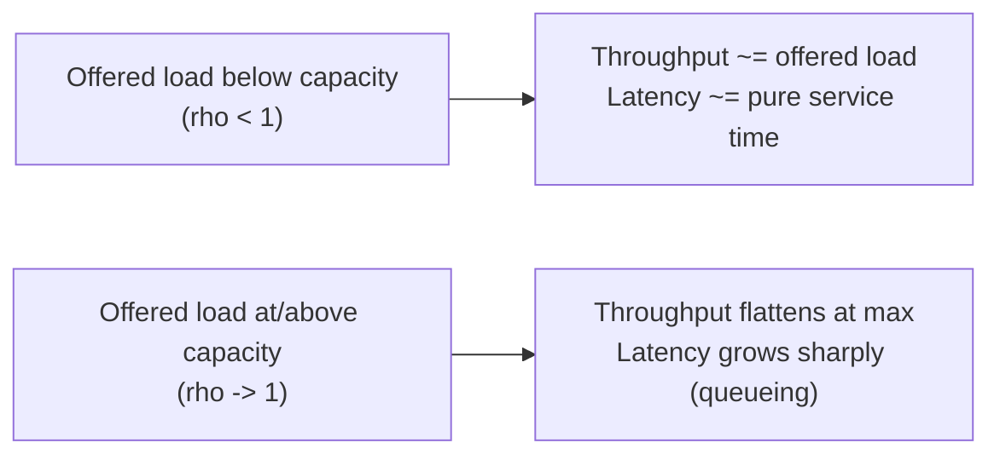
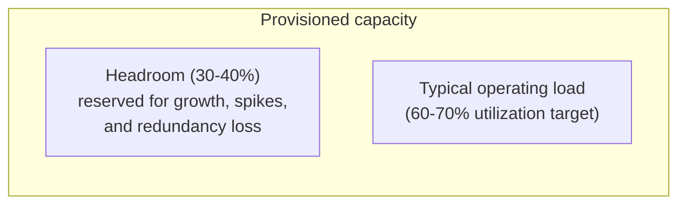

# Capacity Planning & Headroom

> **Topic register:** T-1208 · IWI 6.1 · Staff tier · Moderate interview frequency — most often surfaces as "how much headroom do you need before the next traffic spike" inside a broader system-design or incident-postmortem conversation.
> **Provenance:** every number in this chapter is real, measured output from two real Java programs — a bounded `ExecutorService` worker pool under controlled real load, no mocked timing. Source and full output at [`practice/java/performance/capacity-planning-and-headroom/`](../../practice/java/performance/capacity-planning-and-headroom/README.md).
> **Scope note:** this chapter is about *provisioning* — deciding how much capacity a system needs before it is under load. It does not re-cover percentile measurement itself (already [`percentiles-tail-latency-and-coordinated-omission.md`](../13-observability/percentiles-tail-latency-and-coordinated-omission.md)'s job) or SLO/error-budget policy (already [`performance-methodology-and-slo-error-budgets.md`](../13-observability/performance-methodology-and-slo-error-budgets.md)'s job) — it uses both as inputs to a provisioning decision.

## Table of Contents

1. [Learning Objectives](#learning-objectives)
2. [Why This Matters in Interviews](#why-this-matters-in-interviews)
3. [Level 1 — Foundation](#level-1--foundation)
4. [Level 2 — Working Knowledge](#level-2--working-knowledge)
5. [Mental Model](#mental-model)
6. [Definition and Purpose](#definition-and-purpose)
7. [Core Concepts](#core-concepts)
8. [Internal Implementation](#internal-implementation)
9. [Diagrams](#diagrams)
10. [Production Scenarios](#production-scenarios)
11. [Trade-offs](#trade-offs)
12. [Decision Framework](#decision-framework)
13. [Common Mistakes](#common-mistakes)
14. [Anti-Patterns](#anti-patterns)
15. [Best Practices](#best-practices)
16. [Interview Answer Framework](#interview-answer-framework)
17. [Interview Questions](#interview-questions)
18. [Summary](#summary)
19. [Key Takeaways](#key-takeaways)
20. [Cheat Sheet](#cheat-sheet)
21. [Flashcards](#flashcards)
22. [Practice Exercises](#practice-exercises)
23. [Solutions](#solutions)
24. [Additional Reading](#additional-reading)
25. [Official References](#official-references)

---

## Learning Objectives

By the end of this chapter you can:

- State Little's Law and use it to reason about how queue depth, throughput, and latency relate to each other, backed by a real, independently-cross-checked measurement.
- Explain why a system's throughput and its latency are not the same signal, and why a dashboard that only shows throughput can hide an imminent latency blowup.
- Find a real system's saturation point empirically, and translate that into a concrete headroom recommendation with a stated safety margin.
- Defend a specific target utilization (e.g., provisioning for 70% of measured capacity) against the two failure modes it trades off: wasted spend versus latency risk.

## Why This Matters in Interviews

Capacity planning rarely appears as its own interview question; it appears as a follow-up nobody expects: "you said this service handles 10,000 requests per second — how did you decide to provision for that, and what happens at 15,000?" A candidate who has only ever *reacted* to load (autoscaling, alerts, firefighting) often has no framework for the question and reaches for hand-waving ("we'd just add more pods"). A candidate who can name a target utilization, explain why 100% utilization is never the right target, and connect that to a measured saturation point signals they've actually been responsible for a system's provisioning, not just its code. It is a common Staff-level differentiator specifically because it requires connecting queueing behavior, cost, and risk into one coherent recommendation — not just knowing a formula.

## Level 1 — Foundation

Think about a call center with a fixed number of agents. When call volume is comfortably below the number of agents, a new caller gets picked up almost immediately — average hold time stays low and roughly flat no matter how busy the day gets, right up until every agent is on a call simultaneously. Past that point, a new caller doesn't just wait a little longer — she waits behind every other caller who arrived after the agents became fully busy, and that backlog compounds: hold time doesn't creep up, it explodes. A call center that only tracks "calls answered per hour" can look perfectly healthy right up until the moment the explosion happens, because "calls answered" simply cannot rise past the number of agents times how fast each call gets handled — it flatlines exactly when the real problem starts, and a flat line is not the same evidence as "everything's fine."

Headroom, in this picture, is simply choosing not to schedule every single agent to be busy 100% of the time — deliberately keeping some capacity in reserve so that when call volume spikes (a product recall, a marketing blast) or an agent calls in sick, the remaining team can still absorb the extra load without every caller's hold time collapsing into the explosion described above.

## Level 2 — Working Knowledge

At this level you should be able to state Little's Law in call-center terms and use it directly: the average number of callers on hold or being served (`L`) equals the rate calls arrive (`λ`) times the average time each caller spends in the system, hold plus talk time (`W`). This isn't a rough approximation — this chapter's own measurement shows two completely independent ways of computing it (directly counting callers in the system live, versus multiplying arrival rate by measured time-in-system) agreeing within 0.8%, precisely because the law holds for any stable system regardless of how call arrivals are distributed.

The working question when reviewing a capacity plan is never "what's our average load," but "how close to our measured ceiling does our typical load sit, and have we actually measured that ceiling with something resembling real load?" A call center staffed for "average call volume" with zero headroom is one unusually busy afternoon away from the hold-time explosion described above — the working discipline is choosing a deliberate utilization target (a common one is 60–70% of measured maximum) precisely because the cost of that reserved capacity is real but small compared to the cost of the explosion when it isn't there.

Finally, watch for the specific reasoning trap this chapter's own production scenario walks through: "calls answered per hour is fine" is not proof there's no problem — once every agent is occupied, that number necessarily plateaus, and a plateaued throughput number during a real traffic spike is itself the warning sign, not reassurance that things are under control.

## Mental Model

Every system with finite capacity and incoming work behaves like a queue, whether or not anyone modeled it as one. As offered load approaches the system's maximum service rate, waiting time does not grow *linearly* — it grows sharply, because each request now waits behind an ever-larger backlog left by the requests before it. The practical consequence: throughput can look perfectly healthy right up until the moment it doesn't, because throughput measures what got *done*, not what's *waiting*. Capacity planning is the discipline of finding where that cliff actually is, before load finds it for you, and then deliberately choosing to operate a safe distance back from the edge.

## Definition and Purpose

**Capacity planning** is the practice of determining, ahead of time, how much of a resource (compute, connections, threads, database capacity) a system needs to handle its expected load — including growth and traffic spikes — while staying within an acceptable latency and error budget. **Headroom** is the deliberately unused capacity kept in reserve: the gap between a system's provisioned capacity and its typical operating load, sized to absorb spikes, failures of redundant capacity (one instance of three dies), and organic growth between planning cycles.

This exists because provisioning decisions are made *before* the load that will test them arrives, and the two failure directions are asymmetric in how they're discovered: under-provisioning fails loudly and immediately (latency blowup, errors, an incident) the first time real load exceeds what was planned for; over-provisioning fails quietly and continuously (wasted infrastructure spend, never surfaced as an incident, easy to ignore for years). Capacity planning exists to make that trade-off a deliberate, evidence-based decision rather than a default in either direction.

## Core Concepts

**Little's Law connects three measurable quantities: `L = λW`.** `L` is the average number of requests in a system (queued plus being served) at any instant. `λ` (lambda) is the average arrival/throughput rate. `W` is the average time a request spends in the system, from arrival to completion. The law holds for any stable queueing system, regardless of the arrival process's statistical distribution or the number of servers — which is exactly why it's useful for capacity planning: it lets you reason about any of the three quantities from the other two without knowing the system's internal queueing discipline.

**Utilization (`ρ`, "rho") is the fraction of maximum capacity actually being used: `ρ = λ/μ`**, where `μ` (mu) is the maximum service rate (for `c` identical servers each with service rate `μ_1`, the system's maximum is `c × μ_1`). As `ρ` approaches 1 (100% utilized), queueing theory's basic result for typical queueing systems is that average wait time grows roughly proportional to `ρ/(1-ρ)` — which explodes toward infinity as `ρ → 1`. This is not a linear relationship, and treating it as one is the single most common capacity-planning mistake.

**Throughput and latency are independent signals that diverge exactly at saturation.** Below the saturation point, throughput tracks offered load and latency stays roughly flat at the pure service time. At and beyond the saturation point, throughput flattens (the system physically cannot go faster) while latency grows sharply, because excess requests now queue rather than complete. This chapter's own measurement (§ Internal Implementation) shows this divergence directly: throughput plateaus around 148 req/s against an 8-worker, 50ms-per-request pool, while p99 latency grows from 55ms to 1373ms (a 25× increase) as offered load rises from 140 to 200 req/s.

**Headroom is a chosen safety margin against a measured (not assumed) ceiling.** A common rule of thumb targets 60–70% utilization for latency-sensitive services (leaving 30–40% headroom), reserving that margin for organic growth between planning cycles, traffic spikes, and the loss of redundant capacity (e.g., one of three availability zones failing over onto the remaining two). The *specific* target percentage is a business/risk decision, not a universal constant — but it must be chosen relative to a real, measured saturation point, not guessed.

**Capacity forecasting extrapolates from measured growth trends, with explicit uncertainty.** Linear extrapolation from recent growth is the simplest starting point; real forecasting also accounts for known seasonal patterns (e.g., end-of-year retail traffic) and planned business events (a marketing campaign, a new market launch) that historical data alone won't predict. A forecast without a stated confidence interval or a stated re-evaluation cadence tends to calcify into a number nobody revisits until an incident forces it.

## Internal Implementation

`LittlesLawDemo` (see the practice pack) runs a real, bounded `ExecutorService` (6 workers, each a real 30ms `Thread.sleep` per task) fed a real, controlled arrival rate of 100 requests/second via `ScheduledExecutorService.scheduleAtFixedRate`, well below the pool's ~200 req/s theoretical capacity so the system reaches a genuine steady state. Two independent measurements are taken over an 8-second steady-state window (after a 1-second warmup, discarded): `L` is computed by sampling a live `AtomicInteger` in-flight counter every 2ms and averaging the samples (a direct, time-average measurement); `λ × W` is computed by measuring real completions-per-second and the real average time-in-system per completed request, then multiplying. The two independently-derived numbers — `3.264` (direct sampling) and `3.290` (`λ × W`) — agree within 0.8%, which is Little's Law holding in a real, running system, not merely asserted from theory.

`SaturationPointDemo` runs the identical shape of experiment (a bounded worker pool, real fixed service time) across six real offered-load levels, both below and above the pool's theoretical maximum throughput (8 workers × 50ms service time = 160 req/s). Below the ceiling, completed throughput tracks offered load almost exactly and p50/p99/max latency stay within a few percent of the pure 50ms service time. At and beyond the ceiling, completed throughput flattens near 148 req/s (measurement overhead accounts for the small gap from the theoretical 160) while p50 latency rises from 54ms to 701ms and p99 from 55ms to 1373ms as offered load rises from 140 to 200 req/s — the empirical version of the `ρ/(1-ρ)` blowup, measured directly rather than taken on faith.

## Diagrams

The two regimes measured directly in `SaturationPointDemo`: below the 160 req/s ceiling, the system behaves predictably; at and beyond it, throughput and latency decouple exactly as queueing theory predicts.

Headroom is not idle waste sitting on top of a system — it is deliberately reserved capacity, sized against a measured ceiling, for the specific known risks (growth, spikes, partial-capacity loss) a provisioning decision must account for.

## Production Scenarios

**Symptom.** A checkout service's p99 latency jumped from 80ms to 4 seconds during a flash sale, while its throughput dashboard showed a modest, unremarkable increase from typical daily peak.

**Initial hypotheses.** A downstream dependency (payment gateway) slowing down; a database connection pool exhaustion; a deployed regression coinciding with the sale.

**Evidence.** CPU and connection-pool utilization on the checkout service's own instances were pinned near 100% for the duration of the incident; the downstream payment gateway's own latency was unaffected; no deployment had occurred in the preceding 48 hours.

**Diagnosis.** The service had never been load-tested past its typical daily peak, and its instance count had been sized against average traffic rather than a measured saturation point. The flash sale's real offered load exceeded the service's actual maximum throughput — exactly this chapter's `SaturationPointDemo` regime — and the "modest increase" the throughput dashboard showed was throughput *flattening at its ceiling*, not tracking the much larger offered load; the dashboard's shape looked healthy specifically because it couldn't show the requests that were now queueing instead of completing.

**Immediate mitigation.** Emergency horizontal scale-out, plus a temporary request-shedding rule (reject a percentage of low-priority requests) to bring `ρ` back under 1 for the requests still being admitted.

**Permanent remediation.** A real load test (of the kind this chapter's demos simulate) established the service's actual saturation point; capacity was re-provisioned to keep typical peak load at roughly 65% of that measured ceiling, with autoscaling configured to trigger well before that threshold rather than in response to already-elevated latency.

**Trade-offs.** The re-provisioned baseline costs more to run year-round for a spike that happens a few times a year; the team judged that cost acceptable against the cost of the incident (lost sales, on-call escalation, a public-facing outage during a marketing-driven traffic event).

**Prevention.** A standing calendar reminder to re-run the load test before each known high-traffic event, rather than relying on the previous test's numbers indefinitely as load and code both change.

**Interview lesson.** "Throughput looked fine, latency didn't" is the single most diagnostic sentence in a capacity-related incident story — it demonstrates the candidate understands the two signals decouple exactly at saturation, not that they always move together.

## Trade-offs

| Choice | Helps | Hurts |
|---|---|---|
| High target utilization (e.g., 90%) | Lower infrastructure cost | Little headroom for spikes or redundancy loss; tail latency risk grows sharply near saturation |
| Low target utilization (e.g., 40%) | Large safety margin, resilient to spikes | Higher steady-state cost for capacity that's rarely used |
| Reactive autoscaling only, no capacity planning | Simple, no forecasting effort | Scale-out often lags the load spike itself (instance startup time, warm-up); doesn't prevent the initial latency blowup |
| Load testing before every major event | Ceiling is measured, not guessed | Real engineering time and infrastructure cost to run realistic load tests repeatedly |

## Decision Framework

1. **Has this system's actual saturation point ever been measured** (not estimated from a spec sheet or a vendor's stated maximum)? No → measure it before setting any capacity target; every other step below depends on a real number.
2. **What is the cost asymmetry between under- and over-provisioning for this specific service?** A payment or checkout path facing a public traffic event should skew toward more headroom; an internal batch job with a flexible deadline can tolerate less.
3. **Does autoscaling react fast enough relative to how quickly load can spike?** If new capacity takes minutes to become useful and load can spike in seconds, autoscaling alone is not a substitute for static headroom.
4. **Is there a known future event (product launch, marketing campaign, seasonal peak) that historical growth trends won't predict?** Yes → forecast that event specifically and provision ahead of it, rather than relying on organic-growth extrapolation alone.

## Common Mistakes

- Assuming throughput and latency always move together — this chapter measures the exact point where they decouple.
- Treating utilization-to-latency as a linear relationship, leading to provisioning decisions that look fine on paper (e.g., "we're only at 85% CPU") but sit dangerously close to the queueing cliff.
- Never actually measuring a saturation point, and instead provisioning against a vendor spec sheet, a guess, or "what we've always used."
- Relying entirely on reactive autoscaling without accounting for its own reaction latency (instance startup, connection warm-up, cache priming).
- Setting a single blanket utilization target across every service regardless of its actual criticality or traffic-spike profile.

## Anti-Patterns

- **The "throughput dashboard is green" false confidence.** As this chapter's production scenario shows, a flattening throughput graph during a spike looks calm precisely because it's saturated — the absence of a throughput increase should itself be treated as a possible saturation signal, not blanket reassurance.
- **Provisioning purely from average load.** Averages hide the peak-to-average ratio that actually determines whether a system survives its worst five minutes of the month.
- **"We'll just autoscale" as the entire capacity strategy.** Ignores reaction latency and gives no answer for what happens during the gap between load arriving and new capacity becoming useful.

## Best Practices

- State a specific target utilization per service, chosen deliberately against that service's cost/risk profile, not copied uniformly across the fleet.
- Re-measure the saturation point periodically and before known high-traffic events — code changes, dependency changes, and data growth all shift where the real ceiling is.
- Use Little's Law explicitly when reasoning about queue-depth-related incidents: a growing queue means either arrivals increased or time-in-system increased (often because the system is nearing saturation) — there is no third option.
- Pair headroom targets with autoscaling triggers set well below the measured ceiling, so scale-out begins before saturation, not in response to it.
- Document the measured ceiling and the chosen safety margin together, so the reasoning survives past the person who ran the original load test.

## Interview Answer Framework

### 30-Second Answer

Capacity planning means measuring a system's real saturation point and deliberately provisioning below it — typically 60–70% utilization — because latency doesn't grow linearly with load; it grows sharply as utilization approaches 100%, per Little's Law and basic queueing theory. Throughput and latency decouple exactly at that ceiling, so a healthy-looking throughput graph can hide an imminent latency blowup.

### 2-Minute Answer

Definition: capacity planning determines how much capacity a system needs ahead of the load that will test it; headroom is the deliberate gap kept between provisioned capacity and typical load. Why it exists: under-provisioning fails loudly and immediately when load exceeds it; over-provisioning fails quietly as wasted spend — capacity planning makes that trade-off deliberate. How it works: Little's Law (`L = λW`) relates queue depth, throughput, and latency for any stable system; utilization (`ρ = λ/μ`) approaching 1 causes wait time to grow roughly as `ρ/(1-ρ)`, not linearly. One important trade-off: higher target utilization saves cost but leaves less margin for spikes and redundancy loss. Production example: a checkout service whose throughput dashboard looked merely "elevated" during a flash sale while p99 latency went from 80ms to 4 seconds, because throughput was flattening at its real ceiling rather than tracking the actual offered load.

### 10-Minute Deep Dive

Cover: Little's Law and its real, independently-cross-checked verification (two measurement methods agreeing within 0.8%); utilization and the `ρ/(1-ρ)` non-linearity; the measured divergence between throughput and latency at saturation (148 req/s plateau, p99 growing 25× as offered load rises past the ceiling); headroom as a deliberate safety margin against a measured (not assumed) ceiling, and the specific risks it's sized against (growth, spikes, redundancy loss); capacity forecasting with explicit seasonal/event adjustments and stated confidence; and the production scenario where a throughput dashboard's apparent calm was itself the saturation signal, missed because nobody had ever load-tested past typical peak.

### Whiteboard Explanation

Draw a graph with offered load on the x-axis and two lines: throughput (rises linearly, then flattens at a ceiling) and latency (stays flat, then rises sharply near and past that same ceiling point). Mark the ceiling with a vertical dashed line labeled "saturation point (measured)," and mark a second vertical line to its left labeled "provisioned operating point (60–70% of ceiling)" — the gap between the two lines is the headroom. Narrate while drawing: "everything to the left of the ceiling looks calm on both metrics; the entire risk lives in that gap between typical load and the ceiling, which is exactly why headroom is a number, not a feeling."

### Production Example

Use the flash-sale checkout scenario from [§ Production Scenarios](#production-scenarios): a throughput dashboard that looked merely elevated was actually already flattened at the service's real, never-previously-measured ceiling, while p99 latency went from 80ms to 4 seconds.

### Trade-offs to Mention

State unprompted: a specific target utilization is a business/risk decision, not a universal constant, and should differ by service criticality; reactive autoscaling alone doesn't solve the problem if its reaction time is slower than the load spike; over-provisioning is a real, continuous cost even though it never generates an incident to justify revisiting it.

### Common Candidate Mistakes

Treating utilization-to-latency as linear; assuming a healthy throughput graph rules out a capacity problem; proposing "just add more servers" without a measured target or a stated headroom percentage; never mentioning Little's Law or any quantitative framework at all.

### Typical Follow-Up Questions

"Your throughput graph looks fine during the incident — why?" (it's flattened at the ceiling, which looks superficially calm). "How would you decide the target utilization for this specific service?" (criticality, spike profile, autoscaling reaction time, cost tolerance). "You have three redundant instances and one fails — does your headroom account for that?" (it should: losing 1-of-3 capacity means the remaining two must absorb the load within their own headroom). "How often should this ceiling be re-measured?" (whenever code, dependencies, or data volume materially change, and before known high-traffic events).

### Senior-Level Expectations

Explain Little's Law and the utilization/latency relationship correctly, and use them to interpret a real incident's throughput-vs-latency divergence rather than reciting the formula in the abstract.

### Staff-Level Discussion

At organizational scale, capacity planning becomes a portfolio decision: which services get dedicated headroom budgets, which share a pool of elastic capacity, and how a shared-infrastructure incident (one team's traffic spike consuming capacity another team assumed was available) gets prevented through quota and isolation rather than discovered during an outage. A Staff engineer should be able to argue for a standard load-testing cadence and a standard headroom policy across a platform, while acknowledging the real cost of that standardization (infrastructure spend that never shows up as a feature) against the real cost of leaving it to each team's individual judgment (inconsistent risk exposure, and no shared vocabulary when an incident crosses team boundaries).

## Interview Questions

### Question 1 — A service's throughput dashboard looks healthy, but users are reporting slow page loads. How do you investigate?

**Expected answer.** Check latency percentiles directly (not just throughput) — a flattening throughput curve during elevated offered load is itself a saturation signal. Check utilization on the bottleneck resource (CPU, connection pool, thread pool). If utilization is near 100%, the system has likely hit its real capacity ceiling, and throughput's apparent stability is actually evidence of that ceiling, not evidence against a capacity problem.

**Minimum acceptable answer.** Jumps straight to "scale up" without first confirming the diagnosis via latency percentiles and utilization.

**Strong Senior answer.** Explicitly names the throughput/latency divergence and checks utilization on the specific bottleneck resource before recommending a fix.

**Staff-level extension.** Proposes a standing load-testing practice and a specific headroom target going forward, not just a one-time fix for this incident.

**Common mistakes.** Treating "throughput isn't dropping" as proof there's no capacity issue.

**Likely follow-ups.** "What's the fastest immediate mitigation, versus the permanent fix?" (shed load or scale out immediately; re-provision with real headroom and load-test before the next known spike as the permanent fix).

**Evaluation criteria.** Correct diagnostic order (latency/utilization before throughput-only conclusions) (1–5); recognizes the throughput-plateau-as-saturation-signal (1–5); connects to a concrete headroom recommendation (1–5).

### Question 2 — How would you decide how much headroom to provision for a new service before it launches?

**Expected answer.** Load-test the service to find its real saturation point (or the closest practical proxy pre-launch); choose a target utilization based on the service's criticality and spike profile (e.g., 60–70% for a latency-sensitive, spike-prone service); account for redundancy loss (N-1 or N-2 capacity still covering typical load within its own headroom); revisit after real production data replaces the pre-launch estimate.

**Minimum acceptable answer.** A guessed instance count with no stated ceiling or utilization target behind it.

**Strong Senior answer.** Explicitly separates "finding the ceiling" from "choosing the safety margin," and gives a concrete utilization number with a stated reason for that specific number.

**Staff-level extension.** Discusses re-evaluation cadence and the organizational cost of getting the target wrong in either direction (over-provisioning as invisible waste, under-provisioning as a launch-day incident risk).

**Common mistakes.** Picking an instance count from a vendor's stated maximum capacity rather than a measured one; forgetting to account for the loss of one redundant instance/zone.

**Likely follow-ups.** "Real traffic comes in 3x higher than forecast in month one — what do you do?" (re-measure, re-provision, and treat the original forecast's error as input to tightening the next forecast, not as a one-off surprise).

**Evaluation criteria.** Measurement-first approach (1–5); explicit utilization target with reasoning (1–5); redundancy-loss awareness (1–5).

## Summary

Capacity planning provisions ahead of load by finding a system's real saturation point and deliberately operating a safety margin (headroom) below it. Little's Law (`L = λW`) — verified directly in this chapter via two independent measurements agreeing within 0.8% — connects queue depth, throughput, and latency for any stable system. Below saturation, throughput tracks offered load and latency stays flat; at and beyond it, throughput flattens at its ceiling while latency grows sharply, measured directly here as a 25× p99 increase. Headroom is a chosen safety margin against that measured ceiling, sized against growth, spikes, and redundancy loss — not a universal constant, and never a substitute for actually measuring the ceiling in the first place.

## Key Takeaways

- Little's Law (`L = λW`) holds for any stable queueing system and is a real, verifiable tool, not just a formula to recite.
- Throughput and latency decouple exactly at saturation — a flat or flattening throughput graph during rising load is itself a saturation signal, not reassurance.
- Wait time grows roughly as `ρ/(1-ρ)` near saturation — sharply, not linearly — which is why "we're only at 85% utilization" can still be dangerously close to the cliff.
- Headroom must be sized against a measured saturation point, chosen deliberately per service based on criticality, spike profile, and redundancy-loss risk.
- Reactive autoscaling alone doesn't solve capacity risk if its reaction time is slower than the load spike it's meant to absorb.

## Cheat Sheet

- **Little's Law:** `L = λW` — number in system = throughput × time-in-system.
- **Utilization:** `ρ = λ/μ` — offered rate over max service rate; wait time grows roughly as `ρ/(1-ρ)`.
- **Saturation signal:** throughput flattens while latency grows — not "throughput drops."
- **Headroom rule of thumb:** target 60–70% utilization for latency-sensitive services; adjust by criticality.
- **Never provision from a spec sheet** — measure the real ceiling with a real load test.
- **Account for redundancy loss:** N-1 (or N-2) capacity must still cover typical load within its own headroom.
- **Re-measure before known events**, not just once at launch.

## Flashcards

**Q:** What does Little's Law state, and what makes it broadly useful for capacity planning?
**A:** `L = λW` (average number in system = throughput × average time-in-system). It holds for any stable queueing system regardless of arrival distribution or server count, so any one quantity can be reasoned about from the other two.

**Q:** Why can a throughput dashboard look "healthy" during a real capacity incident?
**A:** At saturation, throughput flattens at the system's maximum service rate — it cannot show demand beyond that ceiling, so a flat or slowly-rising throughput line can actually indicate the system is already maxed out, not that load is under control.

**Q:** Why is utilization-to-latency non-linear near saturation?
**A:** Wait time grows roughly as `ρ/(1-ρ)` as utilization `ρ` approaches 1 — the denominator shrinks toward zero, so small increases in utilization near the ceiling produce disproportionately large latency increases.

## Practice Exercises

1. Modify `SaturationPointDemo`'s `POOL_SIZE` or `SERVICE_TIME_MILLIS` and predict the new theoretical ceiling before rerunning; confirm the measured plateau lands close to your prediction.
2. Using `LittlesLawDemo`, raise `OFFERED_RATE_PER_SEC` toward the pool's capacity and observe how `L` and `W` both grow as the system approaches saturation, even though the demo still measures a stable system.
3. Using this chapter's saturation data, propose a specific instance count and target utilization for a hypothetical service that must handle a forecast peak of 130 req/s with N-1 redundancy across 2 instances.

## Solutions

1. The theoretical ceiling is `POOL_SIZE / (SERVICE_TIME_MILLIS / 1000)`; the measured plateau in this chapter's data (148 req/s against a 160 req/s theoretical ceiling) ran about 8% below theoretical due to real scheduling and measurement overhead — expect a similar small gap, not an exact match.
2. As offered rate approaches the pool's ~200 req/s capacity (6 workers × 30ms), both `L` and `W` grow together — visible directly as rising sampled `L` and rising measured `W` — while the system is still technically stable (arrivals not exceeding capacity), which is the early warning this chapter's Little's Law tool provides before an actual saturation incident occurs.
3. With 2 instances needing to individually absorb full load if the third fails (N-1 redundancy across what's actually a 3-instance fleet), each surviving instance must handle the full 130 req/s alone within its own headroom target — e.g., at a 65% target utilization, each instance's provisioned capacity should be `130 / 0.65 ≈ 200` req/s, sized and load-tested per instance, not assumed from a spec sheet.

## Additional Reading

- [`practice/java/performance/capacity-planning-and-headroom/README.md`](../../practice/java/performance/capacity-planning-and-headroom/README.md) — full real output this chapter draws from.
- [`percentiles-tail-latency-and-coordinated-omission.md`](../13-observability/percentiles-tail-latency-and-coordinated-omission.md) — how to measure the latency side of this chapter's throughput/latency divergence correctly.
- [`performance-methodology-and-slo-error-budgets.md`](../13-observability/performance-methodology-and-slo-error-budgets.md) — how a measured ceiling and headroom target feed into SLO-driven decisions.
- [`../testing/performance-and-load-testing-methodology.md`](../08-testing/performance-and-load-testing-methodology.md) — the load-testing practice this chapter's saturation measurement is a small, self-contained instance of.

## Official References

- [Little's Law — overview](https://en.wikipedia.org/wiki/Little%27s_law)
- [Brendan Gregg — The USE Method](https://www.brendangregg.com/usemethod.html)
- [Google SRE Book — Monitoring Distributed Systems](https://sre.google/sre-book/monitoring-distributed-systems/)
