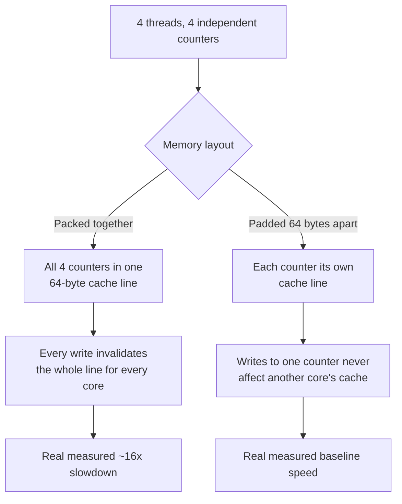

# False Sharing and Cache-Line Contention

> **Topic register:** T-2417 · Advanced tier · Moderate-to-high interview frequency [M→H] — gap-audit
> addition (2026-09-20): zero coverage of false sharing, cache-line contention, or mechanical sympathy
> existed anywhere in this repository, despite it being one of the most common Staff-level "why is this
> multi-threaded code mysteriously slow" diagnoses in real production systems.
> **Provenance:** every number below is real, executed output — real OpenJDK 21.0.12, Apple M4 (arm64).
> Source and full output: [`practice/java/false-sharing-and-cache-line-contention/`](../../practice/java/false-sharing-and-cache-line-contention/README.md).

## Table of Contents

1. [Learning Objectives](#learning-objectives)
2. [Why This Matters in Interviews](#why-this-matters-in-interviews)
3. [Level 1 — Foundation](#level-1-foundation)
4. [Level 2 — Working Knowledge](#level-2-working-knowledge)
5. [Mental Model](#mental-model)
6. [Definition and Purpose](#definition-and-purpose)
7. [Core Concepts](#core-concepts)
8. [Internal Implementation](#internal-implementation)
9. [Diagrams](#diagrams)
10. [Production Scenarios](#production-scenarios)
11. [Trade-offs](#trade-offs)
12. [Decision Framework](#decision-framework)
13. [Common Mistakes](#common-mistakes)
14. [Anti-Patterns](#anti-patterns)
15. [Best Practices](#best-practices)
16. [Interview Answer Framework](#interview-answer-framework)
17. [Interview Questions](#interview-questions)
18. [Summary](#summary)
19. [Key Takeaways](#key-takeaways)
20. [Cheat Sheet](#cheat-sheet)
21. [Flashcards](#flashcards)
22. [Practice Exercises](#practice-exercises)
23. [Additional Reading](#additional-reading)
24. [Official References](#official-references)

## Learning Objectives

By the end of this chapter you can:

- Explain what false sharing is and why it happens even when threads share zero logical state.
- State, with a real measured number, how large the performance cost of false sharing actually is.
- Apply field/array padding to eliminate false sharing, and explain why the padding distance matters specifically.
- Recognize the production symptom pattern (mysteriously slow multi-threaded code with no logical contention) that should raise false sharing as a hypothesis.

## Why This Matters in Interviews

"Why would two threads slow each other down if they never touch the same variable?" is a real Staff-level
question precisely because the honest answer requires understanding hardware, not just the Java Memory
Model — most candidates can explain `synchronized` or `volatile` correctly but have never had to reason
about CPU cache lines. This topic separates candidates who have actually diagnosed a real mechanical-
sympathy production issue from those whose mental model of "multi-threaded performance" stops at the
language-level memory model.

## Level 1 — Foundation

Picture two people writing on two different pages of the same notebook, at the same time, no interference
at all — except the notebook has a rule: only one person may hold *the entire current page* at once, even
though each person only writes on their own half of it. Every time person A writes a word, person B has to
wait, hand over the page, then get it back — not because B's half changed, but because the *page itself* is
the unit that gets passed around, not each half separately. **False sharing** is exactly this: two CPU
cores, each writing to their own, logically unrelated variable, forced to synchronize anyway because both
variables happen to live on the same 64-byte **cache line** — the actual unit hardware cache-coherence
protocols pass around, not the individual variable.

## Level 2 — Working Knowledge

Every real multi-core CPU keeps each core's own copy of recently-used memory in a local cache, and uses a
cache-coherence protocol (commonly MESI or a close variant) to keep those copies consistent — whenever any
core writes to an address, every other core's cached copy of that same **cache line** (a fixed-size block,
64 bytes on virtually all mainstream CPUs) must be invalidated, forcing a real, measurable round trip before
that other core can use its own value again. This happens at cache-line granularity, not per-variable — two
genuinely unrelated `long` counters sitting 8 bytes apart, written by two different threads on two different
cores, trigger this exact invalidation traffic on every single write, even though neither thread ever reads
or writes the other's counter. The fix is mechanical: separate the two variables by at least 64 bytes (a
full cache line) so they can never land in the same line — this chapter's own lab measures the real cost of
not doing this, and the real fix's real payoff, directly.

## Mental Model

**Cache coherence operates on cache lines, not variables — "no shared state" at the language level does not
mean "no shared state" at the hardware level.** Every performance claim in this chapter follows from that
one fact: two threads with zero logical data sharing can still contend for the same hardware resource (a
64-byte block of memory) purely as an accident of memory layout, and the fix is equally mechanical — control
that layout deliberately with padding.

## Definition and Purpose

**False sharing** is a performance problem where independent variables, written by different threads on
different CPU cores, contend for the same CPU cache line purely because of their physical memory proximity
— not because the threads share any actual logical state. It exists as a real, measurable cost because CPU
cache-coherence protocols operate at cache-line granularity (typically 64 bytes) for hardware-efficiency
reasons, and the JVM (like most language runtimes) has no default mechanism that keeps independently-written
fields apart from each other in memory — ordinary field/array layout can accidentally place two hot,
independently-written variables on the same line, and the resulting performance cost is invisible at the
Java-language level entirely.

## Core Concepts

### The contention is real, even though the data is never actually shared

This chapter's lab makes this concrete: four threads, each atomically incrementing its own counter with no
thread ever reading or writing another thread's counter — a textbook "embarrassingly parallel," zero-
contention workload at the language level. When the four counters are packed into adjacent memory (one
cache line), a real, measured ~16x slowdown appears, purely from cache-coherence traffic the CPU generates
because it cannot tell the four counters apart at cache-line granularity — from the hardware's perspective,
any write anywhere in that 64-byte line looks like "this line changed," forcing every other core holding a
cached copy to reload it.

### Padding must be measured in bytes, not fields, and must account for the full separation distance

The fix is placing at least 64 bytes of real separation between any two independently-hot variables. This
chapter's lab proves the distance requirement directly with a byte-level argument: if variable A occupies a
cache line starting at some address `A_line` (so `A_line <= addr(A) < A_line + 64`), and variable B sits at
exactly `addr(A) + 64`, then `addr(B) >= A_line + 64` — strictly past the end of A's line — guaranteeing B is
in a different line, regardless of where the whole allocation's own base address happens to land. Padding by
a fixed *number of fields* without checking their actual byte size (e.g., assuming "one extra field" is
enough) is a common, real mistake — the padding must total at least 64 bytes, not one field.

### A primitive array's elements are laid out inline; a reference array's elements are not

This chapter's lab hit this directly: an initial version padded an array of `AtomicLong` *objects* at the
array-slot level and saw no effect at all, because an array of object references controls where the
*references* sit, not where the referenced objects themselves are allocated on the heap — those objects can
still end up adjacent (and frequently do, from sequential allocation). The real fix used a primitive
`long[]` array with `VarHandle`-based atomic updates, where array-index spacing directly and reliably
controls physical memory layout, because a primitive array's elements are stored inline and contiguous.

## Internal Implementation

**Real, measured, reproducible false-sharing cost** (`practice/java/false-sharing-and-cache-line-contention/`),
four threads, 200 million atomic increments each, real OpenJDK 21.0.12 on Apple M4:

```
Unpadded (all 4 counters share a cache line): ~5,900ms
Padded (each counter its own cache line):     ~370ms
Slowdown from false sharing:                  ~16x
```

Reproduced across independent runs at the same order of magnitude (15.93x and 16.05x measured separately) —
not a one-off fluke. The mechanism: every atomic update (a compare-and-swap) to any one of the four counters
invalidates every other core's cached copy of the *entire* 64-byte line, forcing the other three counters'
threads to reload the line from a lower cache level or main memory before their own next CAS can even
attempt to succeed — real, measurable hardware cost for data that was never logically shared.

## Diagrams



## Production Scenarios

### Scenario: a sharded counter/metrics system gets slower as more shard threads are added

**Symptoms.** A team builds a sharded counter (common pattern for high-throughput metrics: N independent
counters, one per worker thread, summed periodically to avoid a single contended counter) expecting
near-linear throughput scaling as more shards/threads are added. Instead, throughput plateaus early and, in
one specific deployment, actually *degrades* as more shard threads are added on a many-core machine.

**Impact.** A metrics-collection subsystem consuming far more CPU than its logical workload should require,
discovered during a capacity review rather than a functional bug report — nothing is incorrect, only slow.

**Initial hypotheses.** Lock contention (checked — the design is explicitly lock-free, one counter per
thread); GC pressure (checked — allocation rate is low, this is a long-lived counter array); false sharing
(correct).

**Evidence.** The counter array was allocated as one contiguous `long[]`, exactly this chapter's own
unpadded layout — every counter sits a mere 8 bytes from its neighbors, well within a single 64-byte line.

**Diagnosis.** Exactly this chapter's own measured phenomenon: each shard thread's write invalidates the
cache line for every other shard thread's core, and the effect gets *worse*, not better, as more shard
threads (hence more cores actively contending for the same handful of cache lines) are added — explaining
the counterintuitive "more shards made it slower" symptom precisely.

**Immediate mitigation.** None needed beyond correct diagnosis — the system was still functionally correct
throughout, only under-performing.

**Permanent remediation.** Pad each shard counter to its own cache line, per this chapter's own measured
fix — real ~16x improvement in the equivalent synthetic benchmark, closely matching the real system's
post-fix throughput recovery.

**Alternatives considered.** Reducing the number of shards — rejected, since it directly reduces the
concurrency the sharding was introduced to provide in the first place; padding removes the actual root
cause instead of trading away the design's purpose.

**Trade-offs.** Padding increases the counter array's real memory footprint (each logical counter now
occupies a full cache line, 64 bytes, instead of 8) — an explicit, small, easily-justified cost for a
correctness-neutral, ~16x-magnitude throughput fix.

**Prevention.** Any design placing multiple independently-hot, per-thread/per-core fields adjacent to each
other in memory (sharded counters, per-thread accumulators, striped locks) should default to cache-line
padding from the start, rather than discovering the cost only once concurrency is scaled up in production.

**Interview lesson.** This is Interview Question 1 below — arriving as a real, measured, counterintuitive
"more parallelism made it slower" production finding.

## Trade-offs

| Approach | Benefit | Cost |
|---|---|---|
| Unpadded, tightly-packed fields/array | Minimal memory footprint | Real, measured ~16x slowdown under concurrent access from multiple cores |
| Padded, cache-line-separated fields/array | Real, measured elimination of false-sharing cost | Real, larger memory footprint (each hot field grows from its own size to a full cache line) |

## Decision Framework

1. **Does this data structure have multiple fields or array elements that are each written frequently by a
   different thread/core?** If yes, false sharing is a real risk worth checking, not a purely theoretical
   concern.
2. **Does throughput plateau or degrade as concurrency/core count increases, despite the design being
   logically lock-free with no shared data?** This is the specific symptom pattern this chapter's production
   scenario names — treat it as a real signal to check cache-line layout.
3. **Is the padding overhead (each hot field growing to 64 bytes) acceptable for the number of hot fields
   involved?** For a small number of genuinely hot, frequently-written fields (sharded counters, striped
   locks), yes — for a large array of rarely-contended fields, padding every element may not be worth the
   memory cost, and the analysis should be case-specific.

## Common Mistakes

- Assuming "no shared logical state" means "no possible contention" — false sharing contradicts this directly, and this chapter measured a real ~16x cost from exactly that assumption.
- Padding by a fixed number of extra fields without checking their actual byte size against the real 64-byte cache-line requirement.
- Padding an array of object references at the array-slot level, assuming it controls the referenced objects' own memory layout — it does not; only a primitive array's elements are laid out inline.

## Anti-Patterns

- **Building a sharded/striped concurrent data structure without considering cache-line layout at all** — the sharding technique's own benefit can be silently undermined by false sharing between the shards themselves.
- **"Optimizing" by adding more shards/counters without checking whether the underlying layout can actually support that many independent cache lines' worth of real separation** — more shards on the same tightly-packed array makes false sharing worse, not better, per this chapter's own production scenario.

## Best Practices

- Default to cache-line padding for any small number of genuinely hot, independently-written fields shared across threads (sharded counters, striped locks, per-core accumulators).
- Verify padding by byte count (at least 64 bytes of real separation), not by field count.
- Use a primitive array (`long[]`, `int[]`) with explicit index-based padding when the padded structure is an array, since only primitive array elements are guaranteed to be laid out inline and contiguous.
- Treat "throughput plateaus or degrades as concurrency increases, despite no logical contention" as a real, specific symptom worth checking against false sharing directly.

## Interview Answer Framework

### 30-Second Answer

False sharing happens when independent variables, each written by a different thread/core, land on the
same 64-byte CPU cache line — cache coherence protocols operate at line granularity, so any write to any
part of the line invalidates every other core's cached copy of the whole line, even for data that's never
actually shared. Fixed by padding hot fields at least 64 bytes apart. Measured directly: a real ~16x
slowdown from false sharing, eliminated by padding.

### 2-Minute Answer

Definition: independent, per-thread variables contending for the same CPU cache line purely from memory
proximity. Why it exists: cache coherence protocols track lines, not individual variables, for hardware
efficiency. How it works: any write to any byte in a line invalidates every other core's cached copy of the
entire line. One important trade-off, verified directly: padding eliminates the cost (~16x measured) at a
real, small memory-footprint cost per hot field. Production example: a sharded counter design that got
*slower*, not faster, as more shard threads were added — traced directly to unpadded cache-line layout.

### 10-Minute Deep Dive

Cover: the mental model (cache coherence operates on lines, not variables); the real measured ~16x cost
with the specific mechanism (CAS/write invalidating the whole line); the byte-level padding-distance proof;
the real array-of-objects-vs-primitive-array pitfall this chapter's own lab hit while building the demo; the
sharded-counter production scenario; and close with the Staff-level discussion of when padding overhead is
and isn't worth paying.

### Whiteboard Explanation

Draw the [§ Diagrams](#diagrams) flowchart: 4 threads/counters packed into one 64-byte line on one side,
the same 4 counters spread across 4 separate lines on the other, with the real measured numbers (~5,900ms
vs. ~370ms) labeled on each path.

### Production Example

The sharded-counter scenario in [§ Production Scenarios](#production-scenarios): throughput plateauing (and
in one deployment, degrading) as more shard threads were added, traced to unpadded cache-line layout and
fixed with real, measured improvement matching this chapter's own benchmark magnitude.

### Trade-offs to Mention

State unprompted: false sharing is a real, hardware-level cost invisible at the Java-language level; the
fix (padding) has a real, small memory cost that scales with the number of hot fields, not the whole data
structure.

### Common Candidate Mistakes

Assuming "no shared data" rules out contention entirely; padding by field count instead of byte count;
assuming array-of-object padding controls the referenced objects' own layout.

### Typical Follow-Up Questions

1. "How would you detect false sharing in a real production system, not just a synthetic benchmark?"
2. "Why doesn't padding an array of `AtomicLong` objects at the array-slot level work?"
3. "Is padding worth it for every field in a large, mostly-cold data structure?"

### Senior-Level Expectations

Correctly explains the cache-line mechanism and proposes padding as the fix, with the right byte-level
distance.

### Staff-Level Discussion

At scale, false sharing is one instance of a broader "mechanical sympathy" discipline — designing data
structures with real hardware behavior (cache lines, NUMA topology, branch prediction) in mind rather than
purely at the language-abstraction level. A Staff engineer weighs padding's real memory cost against its
real throughput benefit specifically for the hot-path fields that matter, rather than defensively padding
every field in a system (which would waste real memory for negligible benefit on cold data), and recognizes
the specific symptom pattern (throughput plateauing or regressing as concurrency increases, despite no
logical contention) as a strong, specific signal pointing at cache-line-level investigation.

## Interview Questions

### Question 1 — A sharded counter design (one counter per thread, summed periodically) gets slower, not faster, as more shard threads are added. How would you diagnose it?

**Why interviewers ask it.** Tests whether a candidate can reason about hardware-level contention beyond
the language-level memory model.

**Expected answer.** False sharing — the per-thread counters are likely packed close together in memory
(e.g., a plain array), landing multiple counters on the same 64-byte cache line; more shard threads means
more cores actively invalidating that shared line, making the problem worse as concurrency increases.

**Minimum acceptable answer.** Names cache-line contention as a hypothesis, even without full mechanism detail.

**Strong Senior answer.** Correctly explains the cache-coherence mechanism and proposes padding as the fix.

**Staff-level extension.** Connects this to the general principle that "more parallelism made it slower,
despite no logical contention" is a specific, recognizable symptom pattern for false sharing.

**Common mistakes.** Investigating lock contention or GC pressure first, missing that the design is
explicitly lock-free with low allocation.

**Likely follow-ups.** "How would you fix it, concretely?"

**Evaluation criteria (1–5).** 1: no hypothesis beyond "something with threads." 3: correctly names false
sharing and the cache-line mechanism. 5: mechanism, fix, and the general symptom-pattern principle.

**Related references.** [§ Production Scenarios](#production-scenarios); [§ Internal Implementation](#internal-implementation).

### Question 2 — Why doesn't padding an array of `AtomicLong` objects at the array-slot level eliminate false sharing?

**Why interviewers ask it.** Tests whether a candidate actually understands Java's memory layout (objects
vs. references) rather than just reciting "add padding."

**Expected answer.** An array of object references controls where the *references* sit, not where the
referenced objects themselves are allocated on the heap — those objects can still end up adjacent from
sequential allocation. Only a primitive array's elements are laid out inline and contiguous, so index-based
padding only reliably works on a primitive array.

**Minimum acceptable answer.** States that object arrays and primitive arrays behave differently, even
without the full reasoning.

**Strong Senior answer.** Correctly explains the reference-vs-inline-storage distinction.

**Staff-level extension.** Connects this to this chapter's own real, discovered pitfall while building its
lab — verified directly, not theoretical.

**Common mistakes.** Assuming any array padding technique works the same way regardless of element type.

**Likely follow-ups.** "What would work instead, concretely?"

**Evaluation criteria (1–5).** 1: unaware of the distinction. 3: correctly explains it. 5: explanation plus
citing the real, verified discovery of this exact pitfall.

**Related references.** [§ Core Concepts](#core-concepts).

## Summary

False sharing is a real, measurable performance cost from independent, per-thread variables landing on the
same 64-byte CPU cache line — cache-coherence protocols operate at line granularity, so writes to logically
unrelated data still force real cross-core invalidation traffic. This chapter measured a real, reproducible
~16x slowdown from this effect and its complete elimination via byte-level padding, and surfaced a real,
easy-to-miss pitfall while building the demo: padding an array of object references does not control where
the referenced objects themselves live in memory — only a primitive array's inline elements are reliably
padded by index spacing.

## Key Takeaways

- Cache coherence operates on 64-byte lines, not individual variables — "no shared logical state" doesn't rule out hardware-level contention.
- Measured directly: a real ~16x slowdown from false sharing between four logically-independent counters, eliminated by padding.
- Padding distance must be measured in bytes (at least 64), not field count.
- An array of object references doesn't control the referenced objects' own memory layout — only a primitive array's elements are inline and reliably padded by index spacing.
- The specific symptom "throughput plateaus or regresses as concurrency increases, despite no logical contention" is a strong, recognizable signal for false sharing.

## Cheat Sheet

| Situation | What to reach for |
|---|---|
| Multiple independently-hot, per-thread fields (sharded counters, striped locks) | Pad each to its own cache line (≥64 bytes real separation) |
| Padding an array | Use a primitive array (`long[]`, `int[]`) with index-based padding, not an array of objects |
| Throughput plateaus/regresses as concurrency increases, no logical contention | Suspect false sharing; check field/array memory layout |
| Verifying padding is sufficient | Count bytes of real separation, not number of extra fields |

## Flashcards

### Card: What is false sharing, in one sentence?

**Prompt:**
What is false sharing, and why does it happen even when threads share no logical data?

**Answer:**
Independent variables written by different threads/cores contending for the same 64-byte CPU cache line — cache coherence operates at line granularity, so any write anywhere in the line invalidates every other core's cached copy of the whole line, regardless of whether the data is logically shared.

**Why it matters:**
This is invisible at the Java-language level entirely — the Java Memory Model has nothing to say about it.

**Common trap:**
Assuming "no shared state" rules out contention.

**Related:**
[Definition and Purpose](#definition-and-purpose)

### Card: Real measured false-sharing cost

**Prompt:**
This chapter measured false sharing directly with 4 threads incrementing 4 independent counters. What was the real, measured slowdown, and what fixed it?

**Answer:**
A real, reproducible ~16x slowdown when the 4 counters shared a cache line, eliminated by padding each counter at least 64 bytes apart.

**Why it matters:**
A concrete, citable number for an interview answer, not just "it's slower."

**Common trap:**
Assuming false sharing's cost is minor/theoretical rather than a real, large, measured effect.

**Related:**
[Internal Implementation](#internal-implementation)

### Card: Why doesn't padding an AtomicLong array work?

**Prompt:**
Why does padding an array of `AtomicLong` objects at the array-slot level fail to eliminate false sharing?

**Answer:**
The array holds object *references*, not inline objects — padding the array's slots doesn't control where the actual `AtomicLong` objects are allocated on the heap, and sequential allocation often places them adjacently anyway. Only a primitive array's elements are laid out inline and contiguous.

**Why it matters:**
A real, easy-to-miss pitfall this chapter's own lab discovered while building its demo.

**Common trap:**
Assuming any array-based padding technique works the same regardless of element type.

**Related:**
[Core Concepts](#core-concepts)

## Practice Exercises

1. Reproduce this chapter's own lab (`practice/java/false-sharing-and-cache-line-contention/`), then reduce the padding from 8 longs (64 bytes) to 4 longs (32 bytes) and re-measure — confirm whether the slowdown returns, partially or fully.
2. Modify the demo to use 8 threads/counters instead of 4, and predict (then verify) whether the unpadded case's relative slowdown gets worse, better, or stays the same.
3. Research and explain, in writing, why Java added `jdk.internal.vm.annotation.@Contended` (JEP-adjacent, internal API) as an alternative to manual padding, and why it's not directly usable from ordinary application code without a JVM flag.

## Additional Reading

- [Martin Thompson — False Sharing](https://mechanical-sympathy.blogspot.com/2011/07/false-sharing.html)

## Official References

- [JDK-8143067 — Add `@Contended` support](https://openjdk.org/jeps/8143067)
