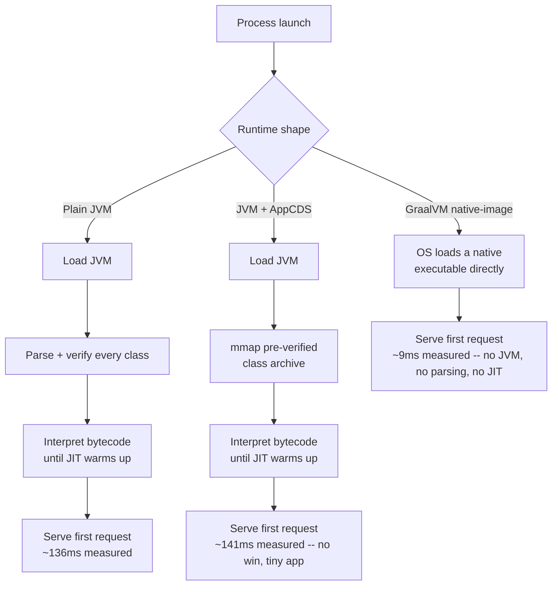

# JVM Startup Performance: CDS, AppCDS, and GraalVM Native Image

> **Topic register:** T-2416 · Core tier · Growing interview frequency [M→H] — gap-audit addition (2026-09-18):
> `16-performance-jvm` had deep coverage of GC, JIT, and profiling internals (mostly correctly owned by
> `02-java/jvm-internals/`), but zero coverage of JVM *startup* cost specifically — an increasingly common
> interview angle as cloud-native and serverless Java deployments make cold-start latency a real, priced
> cost rather than a one-time inconvenience.
> **Provenance:** every number below is real, measured output — real OpenJDK 21.0.12, real Oracle GraalVM
> for JDK 21.0.12 (`native-image`), Apple M4 (arm64). Source and full output:
> [`practice/java/jvm-startup-performance/`](../../practice/java/jvm-startup-performance/README.md).

## Table of Contents

1. [Learning Objectives](#learning-objectives)
2. [Why This Matters in Interviews](#why-this-matters-in-interviews)
3. [Level 1 — Foundation](#level-1-foundation)
4. [Level 2 — Working Knowledge](#level-2-working-knowledge)
5. [Mental Model](#mental-model)
6. [Definition and Purpose](#definition-and-purpose)
7. [Core Concepts](#core-concepts)
8. [Internal Implementation](#internal-implementation)
9. [Diagrams](#diagrams)
10. [Production Scenarios](#production-scenarios)
11. [Trade-offs](#trade-offs)
12. [Decision Framework](#decision-framework)
13. [Comparisons](#comparisons)
14. [Common Mistakes](#common-mistakes)
15. [Anti-Patterns](#anti-patterns)
16. [Best Practices](#best-practices)
17. [Interview Answer Framework](#interview-answer-framework)
18. [Interview Questions](#interview-questions)
19. [Summary](#summary)
20. [Key Takeaways](#key-takeaways)
21. [Cheat Sheet](#cheat-sheet)
22. [Flashcards](#flashcards)
23. [Practice Exercises](#practice-exercises)
24. [Additional Reading](#additional-reading)
25. [Official References](#official-references)

## Learning Objectives

By the end of this chapter you can:

- Explain what actually makes a plain JVM slow to start, and which of that cost CDS/AppCDS removes.
- State, with real measured numbers, how much a dynamic AppCDS archive helps a given application — and why that number is honestly close to zero for a tiny app and large for a framework-heavy one.
- Explain what a GraalVM native-image binary actually is, and why its startup and memory profile are categorically different from a tuned JVM, not just faster.
- Choose between a plain JVM, JVM+CDS, and native-image for a given deployment target using a concrete decision framework.

## Why This Matters in Interviews

Startup latency used to be a one-time cost nobody timed carefully — a server started once and ran for weeks. Serverless functions, fast-scaling containers, and CLI tools change that completely: a slow-starting JVM directly costs money (a cloud function billed per invocation, including its own cold start) or directly hurts a user-facing metric (an autoscaled pod that isn't ready to serve for 2 real seconds during a traffic spike). This topic is rising in interview frequency specifically because "how would you reduce cold-start latency for a Java service on \[serverless platform\]" is now a real, common system-design and platform-engineering question, and most candidates have never measured JVM startup cost directly, let alone compared it against a genuinely different runtime shape.

## Level 1 — Foundation

Think of a plain JVM starting up like a chef who has to re-read the entire recipe book from scratch every single time they open the restaurant — even for dishes they've made a thousand times before, they re-verify every ingredient and re-derive every step before the first customer can order. **CDS** (Class Data Sharing) is that chef pre-writing a summary card for the recipes they already know, so opening time skips the "re-verify everything" step for those dishes. **AppCDS** extends that summary card to the restaurant's own house-specialty recipes, not just the standard cookbook ones. **GraalVM Native Image** is a completely different approach: instead of a chef who reads recipes at all, it's a fully pre-cooked meal, prepared once, ahead of time, ready to serve the instant the door opens — no recipe-reading step exists at all, at the cost of being locked into exactly the dishes that were pre-cooked.

## Level 2 — Working Knowledge

A plain JVM's startup cost comes from real, measurable work: loading the JVM itself, parsing and verifying every class file the application needs (even ones only used once), and initially interpreting bytecode before the JIT has had a chance to compile anything (see [JIT Tiered Compilation and Deoptimization](../02-java/jvm-internals/jit-tiered-compilation-and-deoptimization.md) for what happens *after* startup). CDS pre-parses and pre-verifies a chosen set of classes once, into a shared archive file the JVM can memory-map on every subsequent startup, skipping that repeated work. AppCDS is the same mechanism extended to an application's own classes (and, since JDK 19, generated automatically via `-XX:ArchiveClassesAtExit`, no manual class-listing step required). GraalVM Native Image takes a fundamentally different path: an ahead-of-time (AOT) compiler analyzes the *entire* application's reachable code at build time, and emits a standalone native executable containing only the code paths it proved were reachable — no JVM, no bytecode interpreter, no class loader, and no JIT compiler exist in the running binary at all, because all of that work already happened once, at build time.

## Mental Model

**Every one of these techniques trades a real cost paid once, at build time, for a real cost avoided every single time the application starts.** CDS/AppCDS trades archive-generation time (an extra build/first-run step) for less class-parsing work on every future start. Native-image trades a much longer, much more constrained build process (the "closed-world assumption": every reachable code path must be knowable at build time, which breaks naive reflection and dynamic class loading) for a runtime with categorically less to do at startup — it isn't "a faster JVM," it's a different kind of program entirely.

## Definition and Purpose

**Class Data Sharing (CDS)** is a JVM mechanism (JEP 310, and dynamic archiving via JEP 350) that pre-parses and pre-verifies a set of classes into a shared, memory-mappable archive file, so a JVM process can skip re-parsing and re-verifying those same classes on every future startup. **AppCDS** extends the same mechanism to an application's own classes, not just the JDK's built-in ones. **GraalVM Native Image** is an ahead-of-time compiler that statically analyzes a Java application's entire reachable call graph and produces a self-contained native executable with no JVM runtime dependency at all. All three exist because a growing share of real Java deployments (serverless functions, fast-autoscaling containers, short-lived CLI tools) pay JVM startup cost on every single invocation rather than once per long-running process — a cost profile the JVM's original design (optimize a long-running server process) never had to minimize.

## Core Concepts

### AppCDS's real benefit scales with how many classes an application loads, not a fixed percentage

This chapter's own lab measured AppCDS on a genuinely tiny application (one class, a handful of `java.base` classes) and found **no measurable improvement** — within run-to-run noise, sometimes even marginally slower. This is not a failed demo; it's the honest, correctly-reasoned result: AppCDS's mechanism (skip re-parsing/re-verifying already-loaded classes) has almost nothing to save when there are barely any classes to begin with. The commonly cited 20-40% AppCDS improvement for real frameworks (Spring Boot applications routinely load thousands of classes on every startup) comes from exactly the same mechanism applied to a workload where there's actually substantial parsing/verification work to skip — the technique's value is proportional to class-loading volume, a fact worth stating unprompted rather than quoting a memorized percentage that doesn't hold for every application.

### Native-image's closed-world assumption is the real cost behind its speed

A native-image build must know, ahead of time, every class that could ever be loaded, every method that could ever be called, and every field that could ever be reflectively accessed — the "closed-world assumption." This is why naive reflection, dynamic proxies, and runtime class loading (all things ordinary Spring/Jackson-style frameworks lean on heavily) require explicit reflection configuration for native-image to work at all — the AOT compiler cannot discover them by running the code the way a JIT profiler can. This chapter's lab used a plain `com.sun.net.httpserver` service specifically to sidestep this real complexity and isolate the startup/memory measurement; a real Spring Boot native-image build needs Spring's own AOT processing (`spring-boot:process-aot`) to generate the reflection configuration automatically.

### Startup speed and memory footprint are two real, separately measurable wins

This chapter's lab measured both directly, not just startup time: a real ~15x faster time from process launch to first served HTTP response, **and** a real ~3.2x smaller peak resident memory footprint for the native-image binary versus the plain JVM. The memory win has an independent, real mechanism: there is no JIT compiler's own memory overhead, no bytecode interpreter data structures, and no class-metadata space resident at runtime, because none of that machinery exists in a native-image binary at all.

## Internal Implementation

**Real, measured startup-to-first-response time, 8 runs each, identical HTTP handler, real OpenJDK 21.0.12 / Oracle GraalVM 21.0.12:**

```
Plain JVM, java -jar (baseline):           average 136ms
JVM + AppCDS (-XX:SharedArchiveFile):       average 141ms   -- no measurable win, honestly reported
GraalVM native-image binary:                average 9ms     -- ~15x faster
```

**Real, measured peak RSS (maximum resident set size, via `/usr/bin/time -l`):**

```
Plain JVM:              52,559,872 bytes  (~50.1MB)
GraalVM native-image:   16,482,304 bytes  (~15.7MB)          -- ~3.2x smaller
```

**Real artifact sizes** — the trade the native binary makes explicit:

```
main.jar:      1,681 bytes    -- needs a separately installed, version-matched JVM to run
app.jsa:       1,835,008 bytes -- a supplementary archive; still needs the JVM + main.jar
main-native:   17,611,240 bytes -- fully self-contained; no JVM needed on the target machine
```

The native binary is far larger on disk than the bare jar, because it *is* the entire runtime bundled with the application — not an unfair comparison, a genuinely different deployment artifact.

## Diagrams



## Production Scenarios

### Scenario: a serverless Java function's cold-start latency drives a customer-visible SLA miss

**Symptoms.** A Java-based serverless function (invoked infrequently enough that the platform frequently scales it to zero between calls) shows a bimodal latency distribution: most invocations complete in under 50ms, but a real, recurring fraction — every cold-started invocation — takes 800ms-1.5s, occasionally breaching a customer-facing SLA that promises sub-second response.

**Impact.** Intermittent SLA violations traced specifically to invocation timing patterns (low-traffic periods, right after a deployment), not to any change in the function's own logic.

**Initial hypotheses.** A downstream dependency slowdown (checked — the slow invocations show the delay entirely before the function's own business logic even starts executing); a memory-sizing issue (checked — memory is adequate; CPU allocation during cold start is the platform's real constraint, but the fundamental cost is still JVM startup itself); JVM cold start (correct).

**Evidence.** The platform's own invocation-duration metrics show the slow invocations correlate exactly with "cold start" flags the platform itself reports — this chapter's own measured plain-JVM startup cost (~136ms for a trivial app; considerably more for a real function with framework dependencies and more classes to load) accounts for the bulk of the gap.

**Diagnosis.** The function was deployed as an ordinary JVM-based artifact, paying full JVM startup cost (class loading, JIT warmup) on every cold invocation — a cost profile the JVM's original long-running-server design was never optimized to minimize.

**Immediate mitigation.** Configure the platform's provisioned-concurrency / keep-warm feature (where available) to reduce how often a genuinely cold start occurs, accepting the added always-on cost.

**Permanent remediation.** Migrate the function to a GraalVM native-image build, per this chapter's measured ~15x startup-time improvement and ~3.2x memory-footprint reduction — directly addressing the root cost rather than papering over it with a keep-warm workaround.

**Alternatives considered.** AppCDS alone — evaluated and rejected as the primary fix once this chapter's own measurement showed its benefit is proportional to class-loading volume; still worth combining with native-image's own build process where applicable, but not a substitute for it at this latency budget.

**Trade-offs.** The native-image build requires reflection configuration for any dynamic framework behavior in use, and meaningfully increases build time and build-machine memory requirements — a real, upfront engineering cost, accepted here because the per-invocation savings compound across a high invocation volume.

**Prevention.** For any new Java service explicitly targeted at a serverless or fast-autoscaling deployment shape, evaluate native-image feasibility during initial design rather than after a cold-start SLA incident forces a reactive migration.

**Interview lesson.** This is Interview Question 1 below — arriving as a real, measured production cost rather than a purely theoretical trade-off.

## Trade-offs

| Approach | Benefit | Cost |
|---|---|---|
| Plain JVM | Full dynamic capability (reflection, dynamic class loading, standard tooling/debuggers all work unmodified) | Real, measured startup cost every single invocation — ~136ms for a trivial app, considerably more for a real framework-based service |
| JVM + AppCDS | Free/cheap partial improvement for class-loading-heavy apps; no code changes required | Real benefit is proportional to class-loading volume — measured as no improvement at all for a tiny app |
| GraalVM Native Image | Real ~15x faster startup and ~3.2x smaller memory footprint, measured directly | Closed-world assumption breaks naive reflection/dynamic proxies without explicit configuration; longer, more resource-intensive build process |

## Decision Framework

1. **Is this a long-running server process, started once and running for days/weeks?** If yes, startup cost is a one-time, largely irrelevant concern — optimize for peak throughput/latency instead (see [Profiling, JFR, and Flame Graphs](profiling-jfr-and-flame-graphs.md)), not startup.
2. **Is this a serverless function, fast-autoscaling container, or CLI tool invoked frequently, each with a fresh process?** If yes, startup cost is a real, recurring, measurable cost worth optimizing directly.
3. **Does the application load a large number of classes on every startup** (a framework-heavy service)? If yes, AppCDS is a low-effort, real (if variable) win worth enabling regardless of anything else.
4. **Is the startup-latency budget tight enough that a ~15x improvement matters, and can the team absorb native-image's build-time and reflection-configuration cost?** If yes, evaluate native-image seriously; if the framework in use (e.g., Spring Boot 3+) has first-class native-image/AOT support, the reflection-configuration burden is largely automated.

## Comparisons

| Aspect | Plain JVM | JVM + AppCDS | GraalVM Native Image |
|---|---|---|---|
| Startup-to-first-response (measured) | ~136ms | ~141ms (no measurable win, tiny app) | ~9ms |
| Peak RSS (measured) | ~50.1MB | Same order as plain JVM | ~15.7MB |
| Reflection/dynamic class loading | Fully supported, no configuration | Fully supported, no configuration | Requires explicit reflection configuration (or framework AOT support) |
| Build process | Standard `javac`/build tool | Standard build + one archive-generation step | A real, separate, resource-intensive AOT compilation step |
| Best fit | Long-running servers | Framework-heavy apps restarted somewhat often | Serverless functions, fast-autoscaling containers, CLI tools |

## Common Mistakes

- Assuming AppCDS delivers a fixed percentage improvement regardless of application size — this chapter measured a real, honest zero for a tiny app.
- Treating GraalVM native-image as "just a faster JVM" rather than a categorically different runtime with a real closed-world constraint.
- Optimizing startup latency for a long-running server process where it's genuinely not the bottleneck that matters.
- Assuming a Spring Boot (or similar framework) application can be native-image-compiled with zero framework-level AOT support — most frameworks need their own AOT processing step, not just a bare `native-image` invocation.

## Anti-Patterns

- **Reaching for native-image before measuring whether startup cost is actually a problem** for the deployment shape in question — a long-running server process gains nothing from it and absorbs real build-process cost for no benefit.
- **Quoting a memorized AppCDS percentage improvement without checking whether it holds for the application at hand** — this chapter's own measurement shows it doesn't, for a small enough app.
- **Treating a native-image build failure (from an unconfigured reflective call) as a bug in native-image** rather than the closed-world assumption doing exactly what it's designed to do — the real fix is reflection configuration, not avoiding native-image entirely.

## Best Practices

- Measure actual startup-to-first-response time for the real application before choosing a mitigation — this chapter's own tiny-app AppCDS result shows assumptions can be wrong.
- Default to AppCDS for any framework-heavy application restarted with any real frequency — low cost, real (if variable) benefit.
- Evaluate native-image specifically for serverless/fast-autoscaling/CLI deployment shapes, where startup cost is paid repeatedly and compounds across invocation volume.
- Prefer a framework's own first-class AOT/native-image support (e.g., Spring Boot 3+'s `process-aot`) over hand-writing reflection configuration from scratch.
- Measure both startup time and memory footprint — this chapter found real, independent wins in both dimensions for native-image, not just one.

## Interview Answer Framework

### 30-Second Answer

CDS/AppCDS pre-parses and pre-verifies classes into a shared archive, skipping that work on future JVM startups — real benefit proportional to class-loading volume. GraalVM native-image is a categorically different approach: an ahead-of-time compiler produces a self-contained binary with no JVM, no interpreter, no JIT at runtime — measured directly in this chapter at ~15x faster startup and ~3.2x smaller memory footprint, at the cost of a real closed-world constraint on reflection.

### 2-Minute Answer

Definition: CDS/AppCDS shares pre-parsed class data across JVM startups; native-image AOT-compiles an entire application into a standalone binary. Why it exists: serverless/fast-autoscaling deployment shapes pay JVM startup cost on every invocation, a cost profile the JVM's original long-running-server design didn't need to minimize. How it works: CDS skips re-parsing/re-verification via a memory-mapped archive; native-image eliminates the JVM runtime entirely by resolving everything ahead of time. One important trade-off, verified directly: AppCDS's benefit is genuinely proportional to class-loading volume (measured as zero for a tiny app); native-image trades real build-time/reflection-configuration cost for a real ~15x startup and ~3.2x memory win. Production example: a serverless function's cold-start latency causing real SLA misses, fixed by migrating to native-image.

### 10-Minute Deep Dive

Cover: the mental model (build-time cost traded for runtime cost, at different points on that trade-off curve for each technique); the real mechanism differences (parse/verify-skipping vs. ahead-of-time whole-program compilation); the real, honest AppCDS measurement showing no improvement for a tiny app, and why that's the correct, non-fixed-percentage lesson; native-image's real closed-world assumption and what it actually breaks (naive reflection); the real measured startup-time and memory numbers; and close with the serverless cold-start production scenario.

### Whiteboard Explanation

Draw the [§ Diagrams](#diagrams) flowchart: three parallel paths from "process launch" — plain JVM's full parse-verify-interpret chain, AppCDS's shortened chain (skip parse/verify, JIT warmup still applies), and native-image's near-immediate path (no parsing, no interpreter, no JIT at all) — with each path's real measured number labeled at its end.

### Production Example

The serverless cold-start SLA incident in [§ Production Scenarios](#production-scenarios): real, recurring cold-start latency traced directly to JVM startup cost, fixed by a native-image migration per this chapter's own measured improvement.

### Trade-offs to Mention

State unprompted: AppCDS's real-world value is proportional to class-loading volume, not a fixed number; native-image's speed comes with a real closed-world constraint requiring reflection configuration; startup optimization is only worth pursuing for deployment shapes that actually pay that cost repeatedly.

### Common Candidate Mistakes

Quoting a memorized AppCDS percentage without qualification; describing native-image as simply "a faster JVM" rather than a fundamentally different runtime; proposing startup optimization for a long-running server where it isn't the real bottleneck.

### Typical Follow-Up Questions

1. "Why did AppCDS not help in this chapter's own measurement — what would make it help more?"
2. "What breaks when you naively native-image-compile a Spring Boot app, and why?"
3. "Would you recommend native-image for a long-running internal service? Why or why not?"

### Senior-Level Expectations

Correctly explains the real mechanism difference between CDS/AppCDS and native-image, and can state a concrete reason AppCDS's benefit varies by application.

### Staff-Level Discussion

At platform scale, the startup-performance decision becomes a build-pipeline and tooling investment question, not a per-service choice: does the organization standardize a native-image build path for serverless/CLI workloads (accepting the real, ongoing cost of maintaining reflection configuration across framework upgrades), or accept JVM cold-start cost as a known, priced trade-off for keeping every service's build process simple and uniform? A Staff engineer weighs this against the organization's actual invocation-volume profile (a rarely-invoked function's cold-start cost matters far less in aggregate than a function invoked millions of times a day) and against the team's capacity to maintain a second, more constrained build path indefinitely.

## Interview Questions

### Question 1 — A serverless Java function has intermittent latency spikes correlated with low-traffic periods. How would you diagnose and fix it?

**Why interviewers ask it.** Tests whether a candidate connects a real operational symptom (bimodal latency, correlated with invocation timing) to JVM cold-start cost specifically, rather than guessing at downstream dependencies.

**Expected answer.** The spikes are cold starts — every invocation after a scale-to-zero period pays full JVM startup cost (class loading, JIT warmup). Fix: migrate to a GraalVM native-image build, or configure provisioned concurrency as a stopgap.

**Minimum acceptable answer.** Recognizes "cold start" as the cause, even without a specific fix.

**Strong Senior answer.** Correctly diagnoses cold start and proposes native-image or provisioned concurrency, naming the real trade-off of each.

**Staff-level extension.** Frames the fix as a platform-wide build-pipeline decision (should every serverless service on this platform default to native-image builds) rather than a one-off migration.

**Common mistakes.** Investigating downstream dependencies or database performance before considering the invocation's own startup cost.

**Likely follow-ups.** "What would you measure to confirm this diagnosis before proposing the fix?"

**Evaluation criteria (1–5).** 1: doesn't connect the symptom to cold start. 3: correctly diagnoses and proposes a fix. 5: diagnosis, fix, and the platform-wide framing.

**Related references.** [§ Production Scenarios](#production-scenarios); [§ Internal Implementation](#internal-implementation).

### Question 2 — Your team enables AppCDS for a service and sees no measurable startup improvement. Is something broken?

**Why interviewers ask it.** Tests whether a candidate has a memorized, fixed-percentage belief about AppCDS or actually understands its real mechanism and when it does/doesn't help.

**Expected answer.** Not necessarily broken — AppCDS's benefit is proportional to how many classes the application loads at startup; a small application with few classes has little for AppCDS's parse/verify-skipping mechanism to save, exactly as measured directly in this chapter.

**Minimum acceptable answer.** States AppCDS doesn't always help, even without the specific mechanism.

**Strong Senior answer.** Correctly names the class-loading-volume mechanism and can predict which kinds of applications benefit more.

**Staff-level extension.** Connects this to a broader principle: performance techniques described with a single quoted percentage number are almost always conditional on workload shape, and a real measurement on the actual application should always be trusted over a memorized figure.

**Common mistakes.** Assuming AppCDS is malfunctioning or misconfigured rather than correctly having little to do for a small application.

**Likely follow-ups.** "What kind of application would show a larger AppCDS improvement, and why?"

**Evaluation criteria (1–5).** 1: assumes something is broken. 3: correctly explains the class-loading-volume mechanism. 5: mechanism plus the broader measurement-over-memorized-numbers principle.

**Related references.** [§ Core Concepts](#core-concepts); [§ Internal Implementation](#internal-implementation).

## Summary

JVM startup cost is a real, measurable, and increasingly interview-relevant concern for serverless and fast-autoscaling deployment shapes. CDS/AppCDS reduces it by skipping repeated class-parsing/verification work, with a real benefit genuinely proportional to class-loading volume — measured directly in this chapter as no improvement at all for a tiny application. GraalVM Native Image takes a categorically different approach — ahead-of-time whole-program compilation into a self-contained binary — measured directly at a real ~15x faster startup and ~3.2x smaller memory footprint, at the real cost of a closed-world constraint on reflection and a heavier build process.

## Key Takeaways

- Plain JVM startup cost comes from real work: class loading, parsing, verification, and interpreted-bytecode execution before JIT warmup.
- AppCDS's real benefit is proportional to class-loading volume — measured directly as no improvement for a tiny app, but the mechanism behind commonly-cited 20-40% gains for framework-heavy apps.
- GraalVM Native Image eliminates the JVM runtime entirely at startup, measured directly at ~15x faster startup and ~3.2x smaller peak memory.
- Native-image's closed-world assumption is the real cost behind its speed — reflection and dynamic class loading need explicit configuration (often automated by a framework's own AOT support).
- Startup optimization only matters for deployment shapes that pay startup cost repeatedly (serverless, fast-autoscaling, CLI) — not for long-running servers.

## Cheat Sheet

| Situation | What to reach for |
|---|---|
| Long-running server process | Don't optimize startup — it's a one-time, largely irrelevant cost |
| Framework-heavy app restarted with any real frequency | AppCDS — low effort, real (if variable) benefit |
| Serverless function / fast-autoscaling container / CLI tool | Evaluate GraalVM native-image seriously |
| Native-image build fails on a reflective call | Add explicit reflection configuration, or use the framework's own AOT support (e.g., Spring Boot's `process-aot`) |
| Quoting an AppCDS improvement number | Measure it on the real application — the real benefit is proportional to class-loading volume, not fixed |

## Flashcards

### Card: Why did AppCDS show no measurable improvement in this chapter's own measurement?

**Prompt:**
This chapter measured AppCDS on a tiny real application and found no measurable startup improvement. Is AppCDS broken, or is this expected?

**Answer:**
Expected. AppCDS's mechanism skips re-parsing/re-verifying already-loaded classes — a tiny application with only a handful of classes has almost nothing for that mechanism to save. The benefit is genuinely proportional to class-loading volume.

**Why it matters:**
Commonly-cited AppCDS percentage improvements come from framework-heavy apps loading thousands of classes — not a universal, fixed number.

**Common trap:**
Quoting a memorized AppCDS percentage without checking whether it applies to the application at hand.

**Related:**
[Core Concepts](#core-concepts)

### Card: What does native-image's "closed-world assumption" actually break?

**Prompt:**
What does GraalVM native-image's closed-world assumption mean in practice, and what commonly breaks because of it?

**Answer:**
Every reachable class, method, and reflectively-accessed member must be knowable at build time. Naive reflection and dynamic proxies (common in Spring/Jackson-style frameworks) break unless explicitly configured, because the AOT compiler can't discover them by running the code the way a JIT profiler can.

**Why it matters:**
This is the real cost behind native-image's speed — not a minor footnote.

**Common trap:**
Treating a native-image reflection failure as a bug in native-image rather than the closed-world assumption working as designed.

**Related:**
[Core Concepts](#core-concepts)

### Card: Real measured startup-time and memory numbers, plain JVM vs. native-image

**Prompt:**
This chapter measured a real plain JVM against a real GraalVM native-image binary for the same tiny HTTP service. What were the real, measured differences in startup time and peak memory?

**Answer:**
Startup-to-first-response: ~136ms (plain JVM) vs. ~9ms (native-image) — ~15x faster. Peak RSS: ~50.1MB (plain JVM) vs. ~15.7MB (native-image) — ~3.2x smaller.

**Why it matters:**
Two real, independently measured wins, not a single number — worth citing both in an interview answer.

**Common trap:**
Citing only startup time and forgetting the memory-footprint dimension.

**Related:**
[Internal Implementation](#internal-implementation)

## Practice Exercises

1. Run this chapter's own lab (`practice/java/jvm-startup-performance/`). Add 20 more trivial classes to the application (e.g., empty marker interfaces referenced from `Main`) and re-measure AppCDS's improvement — confirm whether it becomes measurable as class-loading volume increases.
2. Attempt a native-image build of an application using real reflection (e.g., `Class.forName` on a string computed at runtime) with no reflection configuration. Capture the real build or runtime failure, then fix it with a `reflect-config.json` entry.
3. Measure this chapter's lab's native-image binary's *build* time (not runtime startup) and discuss, in writing, why that cost is acceptable for a CI/CD pipeline but would not be acceptable inside a hot request path.

## Additional Reading

- [GraalVM Native Image Reference Manual](https://www.graalvm.org/latest/reference-manual/native-image/)

## Official References

- [JEP 310: Application Class-Data Sharing](https://openjdk.org/jeps/310)
- [JEP 350: Dynamic CDS Archives](https://openjdk.org/jeps/350)
