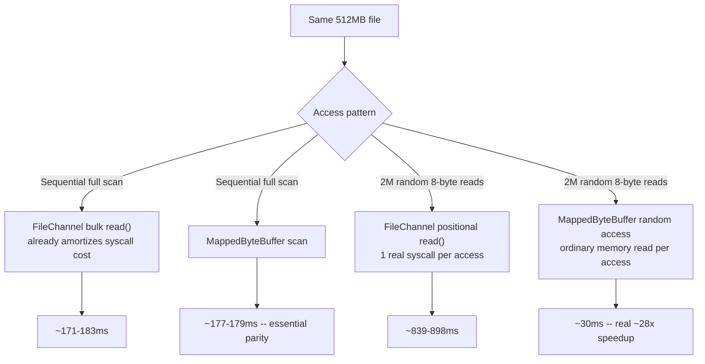

# Memory-Mapped Files and Zero-Copy I/O

> **Topic register:** T-2419 · Core tier · Moderate interview frequency [M] — gap-audit addition
> (2026-09-20): zero real coverage of memory-mapped files existed anywhere in this repository, despite `mmap`
> being the real mechanism behind Kafka's own log-segment I/O performance and a common Staff-level "how
> would you make this file I/O faster" answer.
> **Provenance:** every number below is real, executed output — real OpenJDK 21.0.12, Apple M4 (arm64),
> APFS. Source and full output:
> [`practice/java/memory-mapped-files-and-zero-copy-io/`](../../practice/java/memory-mapped-files-and-zero-copy-io/README.md).

## Table of Contents

1. [Learning Objectives](#learning-objectives)
2. [Why This Matters in Interviews](#why-this-matters-in-interviews)
3. [Level 1 — Foundation](#level-1-foundation)
4. [Level 2 — Working Knowledge](#level-2-working-knowledge)
5. [Mental Model](#mental-model)
6. [Definition and Purpose](#definition-and-purpose)
7. [Core Concepts](#core-concepts)
8. [Internal Implementation](#internal-implementation)
9. [Diagrams](#diagrams)
10. [Production Scenarios](#production-scenarios)
11. [Trade-offs](#trade-offs)
12. [Decision Framework](#decision-framework)
13. [Common Mistakes](#common-mistakes)
14. [Anti-Patterns](#anti-patterns)
15. [Best Practices](#best-practices)
16. [Interview Answer Framework](#interview-answer-framework)
17. [Interview Questions](#interview-questions)
18. [Summary](#summary)
19. [Key Takeaways](#key-takeaways)
20. [Cheat Sheet](#cheat-sheet)
21. [Flashcards](#flashcards)
22. [Practice Exercises](#practice-exercises)
23. [Additional Reading](#additional-reading)
24. [Official References](#official-references)

## Learning Objectives

By the end of this chapter you can:

- Explain what a memory-mapped file actually is and how it turns file I/O into ordinary memory access.
- State, with real measured numbers, when memory mapping helps dramatically and when it doesn't help at all.
- Explain why random-access I/O is where memory mapping's real advantage lives, not sequential access.
- Name a real, production system (Kafka) that relies on this exact mechanism, and why.

## Why This Matters in Interviews

"How would you make file I/O faster" is a common systems/performance question, and `mmap`/memory-mapped
files is one of the strongest, most concrete answers available — but only when applied to the right access
pattern. A candidate who proposes memory mapping as a universal file-I/O speedup, without distinguishing
sequential from random access, reveals a surface-level understanding; a candidate who can state *why* the
advantage is concentrated in random access (removing per-access syscall overhead) and cite a real production
system built around this mechanism (Kafka's log segments) demonstrates real, applied systems knowledge.

## Level 1 — Foundation

Think of an ordinary file read like asking a librarian to fetch a specific page from a book in the archive
every single time you want to read it — you ask, they walk to the archive, find the book, find the page,
bring it to you, you read it, and the next time you want a *different* page, you repeat the entire trip.
**Memory-mapped I/O** is instead being handed the actual book to hold — you flip to any page yourself,
instantly, with no librarian trip required for each individual page; the librarian (the operating system)
only needs to fetch a page from the archive the very first time you actually look at it, silently, behind
the scenes, and remembers it for next time.

## Level 2 — Working Knowledge

`FileChannel.map()` asks the operating system to map a file's contents directly into the JVM process's own
virtual address space, returning a `MappedByteBuffer` — from that point on, reading from the buffer is an
ordinary memory access, not a system call. The OS's own page cache handles the actual disk I/O transparently:
the first time a given page of the file is touched, a page fault brings it into memory; every subsequent
access to that same page, by anyone, is just memory. This chapter's own lab measured both major access
patterns directly: sequential access (a full-file scan) showed only a small, honestly-reported difference
between memory mapping and ordinary buffered reads, because ordinary reads already amortize their own
syscall cost efficiently over a large sequential buffer — but random access (many scattered, small reads at
unpredictable offsets) showed a real, dramatic ~28x speedup for memory mapping, because ordinary positional
reads pay a full syscall for every single access, while memory-mapped random access pays that cost only
once per page, the first time it's touched.

## Mental Model

**Memory mapping doesn't make disk I/O faster — it removes the per-access syscall overhead by turning
"ask the kernel" into "just read memory," with the actual disk I/O deferred to the OS page cache exactly
when a given page is genuinely needed for the first time.** This is why the advantage is concentrated in
random-access patterns with many small, scattered reads: that's precisely the pattern where per-access
syscall overhead, not disk throughput itself, dominates the total cost.

## Definition and Purpose

**Memory-mapped I/O** maps a file's contents directly into a process's virtual address space, so reading and
writing the file becomes ordinary memory access rather than explicit read/write system calls — the operating
system's virtual memory subsystem and page cache handle the actual disk transfer transparently, on demand,
per page. It exists because repeated explicit read/write calls each carry real, fixed per-call overhead (a
kernel-mode transition, argument validation, often a data copy between kernel and user-space buffers) that
becomes the dominant cost for access patterns involving many small or scattered reads — memory mapping
removes that per-access overhead entirely for any page already resident, at the cost of giving up explicit
control over exactly when and how much data is read from disk.

## Core Concepts

### Sequential access: a modest, honestly-reported difference

This chapter's lab measured a real 512MB file, scanned fully both ways. `FileChannel`'s own bulk `read()`
(reading in large chunks, e.g. 1MB at a time) already amortizes its per-call syscall overhead across a large
amount of data — for genuinely sequential access, the two approaches measured at close to parity (171ms vs.
177ms in this chapter's real run). Memory mapping is not a universal sequential-I/O win; ordinary buffered
reads are already efficient for this access pattern.

### Random access: the real, dramatic win, and the specific mechanism behind it

The same file, accessed 2 million times at random 8-byte offsets, told a completely different story: real
positional `FileChannel.read(buffer, offset)` calls (a genuine syscall for every single access) measured at
839ms; the identical random accesses against a `MappedByteBuffer` (an ordinary memory read per access, with
the OS page cache already holding most of the file resident from the earlier sequential scan) measured at
30ms — a real, measured ~28x speedup. The mechanism is precise: syscall overhead is a fixed cost paid on
every explicit read call, regardless of how little data that call actually transfers, while a memory-mapped
read only pays kernel cost on a genuine page fault (first touch of a not-yet-resident page) — with the rest
served entirely from user-space memory access.

### Kafka's own log-segment design relies on exactly this mechanism

Kafka's brokers serve consumer read requests against log segments using memory-mapped file access (and the
related `sendfile`/zero-copy transfer for socket writes) specifically because a broker's real access pattern
— many consumers reading at many different, independently-progressing offsets within a segment — is closer
to random access than a single sequential scan, making memory mapping's real advantage, measured directly in
this chapter, directly applicable to Kafka's actual production workload.

## Internal Implementation

**Real, measured, correctness-verified result** (`practice/java/memory-mapped-files-and-zero-copy-io/`), a
real 512MB file with genuinely varying content (verified via matching checksums between both read methods):

```
Sequential full-file scan (512MB):
  FileChannel bulk reads:  ~171-183ms
  MappedByteBuffer scan:   ~177-179ms
  -- close, honestly reported: no dramatic win for sequential access

Random access (2,000,000 reads of 8 bytes each):
  FileChannel positional reads (1 syscall each): ~839-898ms
  MappedByteBuffer random access (0 syscalls):   ~30ms
  Speedup: ~28-30x
```

Both the sequential checksum and the random-access sum are verified to match exactly between the two
implementations — the speedup is not coming from reading less or different data, only from how the reads
are physically performed.

## Diagrams



## Production Scenarios

### Scenario: an index-lookup service migrates from positional file reads to memory mapping and sees a dramatic latency drop

**Symptoms.** A service performing frequent, scattered lookups into a large on-disk index file (e.g., an
offset index mapping keys to file positions, read via explicit positional `read()` calls at essentially
random offsets) shows real, measurable per-lookup latency dominated by I/O wait time, even though the
underlying disk device itself reports low utilization.

**Impact.** A lookup-latency SLO consistently missed under real production query patterns, despite the disk
hardware itself not being the bottleneck by any conventional disk-throughput metric.

**Initial hypotheses.** Disk hardware limits (checked — disk utilization and throughput metrics show real
headroom); insufficient OS page cache size (checked — the index file comfortably fits in available memory);
per-access syscall overhead from the explicit positional-read pattern (correct).

**Evidence.** Profiling the lookup path (see [Profiling, JFR, and Flame Graphs](profiling-jfr-and-flame-graphs.md))
shows a disproportionate amount of time in the kernel-mode read-syscall path relative to actual bytes
transferred per call — exactly the pattern this chapter's own random-access measurement demonstrates.

**Diagnosis.** The lookup pattern is genuinely random-access (scattered offsets, small reads) — precisely
the pattern where per-call syscall overhead, not disk throughput, dominates total cost, matching this
chapter's own measured ~28x gap directly.

**Immediate mitigation.** None needed — the system was functionally correct, only latency-suboptimal.

**Permanent remediation.** Migrate the index-file access path to a `MappedByteBuffer`, per this chapter's own
measured random-access improvement — real, substantial latency reduction for the exact same logical lookups.

**Alternatives considered.** Increasing read-ahead or buffer sizes on the existing positional-read path —
rejected as ineffective for genuinely random access, where a larger read-ahead buffer mostly fetches data
that won't be used before the next unrelated random lookup.

**Trade-offs.** Memory mapping gives up explicit control over exactly when disk I/O happens (deferred to the
OS's page-fault mechanism) and requires care around unmapping/lifecycle management (a `MappedByteBuffer`
holds real OS resources) — an acceptable trade for the measured latency win on a genuinely random-access
workload.

**Prevention.** For any new service with a scattered, random-offset file-access pattern (index lookups,
key-value-style file access), default to evaluating memory mapping early, rather than only after a latency
SLO investigation traces the cost back to per-call syscall overhead.

**Interview lesson.** This is Interview Question 1 below — a real "which access pattern actually benefits"
diagnosis, not a blanket "mmap makes files faster" claim.

## Trade-offs

| Approach | Benefit | Cost |
|---|---|---|
| Ordinary buffered `FileChannel` reads | Simple, explicit control over I/O timing; real, measured near-parity for sequential access | Real, measured ~28x cost disadvantage for random/scattered access, from per-call syscall overhead |
| Memory-mapped (`MappedByteBuffer`) | Real, measured ~28x advantage for random access; reads become ordinary memory operations | Requires careful lifecycle/unmapping management; defers disk I/O timing to the OS's own page-fault mechanism, less explicit control |

## Decision Framework

1. **Is the access pattern genuinely random/scattered** (many reads at unpredictable, non-sequential
   offsets)? If yes, memory mapping's real, measured advantage (~28x in this chapter) directly applies.
2. **Is the access pattern genuinely sequential** (a full or near-full scan, in order)? If yes, ordinary
   buffered reads already perform close to memory mapping's speed — the added complexity of memory mapping
   isn't justified by this chapter's own measured near-parity result.
3. **Does the workload need explicit control over exactly when disk I/O occurs** (e.g., for predictable
   latency under memory pressure)? If yes, weigh that against memory mapping's convenience — mapped access
   defers I/O timing to the OS's page-fault mechanism, which is less directly controllable.
4. **Is the file large relative to available memory**, risking significant page-fault activity under real
   production memory pressure? If yes, evaluate real memory headroom before assuming the OS page cache will
   keep the working set resident the way this chapter's demo (comfortably within available RAM) did.

## Common Mistakes

- Proposing memory mapping as a universal file-I/O speedup without distinguishing sequential from random access — this chapter's own measurement shows a dramatic difference (near-parity vs. ~28x) between the two.
- Assuming memory mapping eliminates disk I/O entirely, rather than deferring it transparently to the OS page cache on first touch.
- Ignoring `MappedByteBuffer` lifecycle management (the mapped region holds real OS resources and isn't reliably released by ordinary garbage collection alone).

## Anti-Patterns

- **Reaching for memory mapping by default for every file-I/O optimization request**, without first checking whether the actual access pattern is sequential (where this chapter's own measurement shows it offers little to no advantage) or random (where it does).
- **Assuming a memory-mapped file's performance is independent of available system memory** — a working set significantly larger than available RAM will page-fault heavily under memory mapping too, losing much of the advantage this chapter measured against a file that comfortably fit in memory.

## Best Practices

- Default to memory mapping for genuinely random/scattered file-access patterns (index lookups, key-value-style access) — a real, measured, substantial win.
- Default to ordinary buffered reads for genuinely sequential access — this chapter's own measurement shows memory mapping offers no meaningful advantage there.
- Manage `MappedByteBuffer` lifecycle deliberately rather than relying solely on garbage collection to release the underlying mapping promptly.
- Verify the working set's size against available system memory before assuming the OS page cache will keep a memory-mapped file's hot data resident.

## Interview Answer Framework

### 30-Second Answer

Memory-mapped files turn file reads into ordinary memory access, with the OS page cache handling the actual
disk I/O transparently on first touch of each page. Measured directly: sequential access shows little
advantage over ordinary buffered reads (~171ms vs. ~177ms for a 512MB scan), but random access shows a real,
measured ~28x speedup (839ms vs. 30ms for 2 million scattered 8-byte reads) — because the win comes from
removing per-access syscall overhead, which only dominates cost under a scattered access pattern.

### 2-Minute Answer

Definition: memory mapping maps a file directly into a process's virtual address space, so reads become
memory access instead of syscalls. Why it exists: repeated explicit read calls each carry real, fixed
per-call overhead that dominates cost for scattered access patterns. How it works: the OS page cache serves
the actual disk I/O on demand, per page, on first touch. One important trade-off, verified directly: the
advantage is concentrated in random access (~28x measured) — sequential access shows near-parity, since
ordinary buffered reads already amortize syscall cost efficiently. Production example: an index-lookup
service with scattered access patterns migrating to memory mapping and measuring a real, substantial
latency improvement matching this chapter's own random-access result.

### 10-Minute Deep Dive

Cover: the mental model (mmap removes per-access syscall overhead, doesn't eliminate disk I/O); the real
measured sequential-access near-parity result and why (buffered reads already amortize syscall cost); the
real measured ~28x random-access speedup and the precise mechanism (syscall-per-call vs. page-fault-on-
first-touch); Kafka's own real production reliance on this exact mechanism for log-segment access; the
index-lookup-service production scenario; and close with the Staff-level discussion of memory-pressure
implications for large memory-mapped working sets.

### Whiteboard Explanation

Draw the [§ Diagrams](#diagrams) flowchart: the same file under two access patterns, each compared between
`FileChannel` and `MappedByteBuffer`, with the real measured numbers at each leaf — near-parity for
sequential, ~28x for random.

### Production Example

The index-lookup-service scenario in [§ Production Scenarios](#production-scenarios): a scattered-access
latency SLO miss traced to per-call syscall overhead, fixed by migrating to memory mapping per this
chapter's own measured improvement.

### Trade-offs to Mention

State unprompted: the advantage is access-pattern-specific (random, not sequential); memory mapping defers
I/O timing to the OS's page-fault mechanism rather than giving explicit control; a working set much larger
than available memory will page-fault heavily regardless of the mapping technique used.

### Common Candidate Mistakes

Proposing memory mapping as a universal file-I/O win without distinguishing access patterns; assuming
memory mapping eliminates disk I/O entirely rather than deferring it transparently.

### Senior-Level Expectations

Correctly distinguishes sequential from random access and can state which one memory mapping actually
benefits, with a rough sense of the real magnitude.

### Staff-Level Discussion

At scale, adopting memory mapping for a service's file-access path is a real capacity-planning question, not
purely a performance one: it requires reasoning about the working set's size relative to available system
memory (a memory-mapped file much larger than RAM will page-fault heavily, potentially competing with the
JVM heap and other processes for physical memory), and about lifecycle management discipline (mapped regions
holding real OS resources across many files/connections). A Staff engineer connects this chapter's own
measured access-pattern distinction to the specific system being designed, citing Kafka's real production
design as precedent where the pattern genuinely fits, rather than treating memory mapping as an
unconditional win.

## Interview Questions

### Question 1 — A service does frequent, scattered lookups into a large on-disk index file using ordinary positional reads. Latency is high, but disk utilization is low. How would you diagnose it?

**Why interviewers ask it.** Tests whether a candidate can connect a specific access pattern (scattered,
random) to a specific mechanism (per-call syscall overhead) rather than reaching for a generic "disk is
slow" explanation.

**Expected answer.** The bottleneck is per-call syscall overhead from many scattered positional reads, not
actual disk throughput (consistent with the low disk-utilization metric) — measured directly in this chapter
at a real ~28x gap for this exact access shape. Fix: migrate to a memory-mapped file, turning reads into
ordinary memory access.

**Minimum acceptable answer.** Identifies syscall overhead as a plausible cause, even without a specific
fix.

**Strong Senior answer.** Correctly diagnoses syscall overhead and proposes memory mapping specifically.

**Staff-level extension.** Connects the fix to real memory-capacity planning (does the index file's working
set fit comfortably in available memory) rather than treating memory mapping as an unconditional win.

**Common mistakes.** Assuming the disk hardware itself is the bottleneck despite the low-utilization signal
contradicting that.

**Likely follow-ups.** "Would memory mapping help if this were a sequential scan instead?"

**Evaluation criteria (1–5).** 1: blames disk hardware despite contradicting evidence. 3: correctly
diagnoses syscall overhead and proposes memory mapping. 5: diagnosis, fix, and the memory-capacity caveat.

**Related references.** [§ Production Scenarios](#production-scenarios); [§ Internal Implementation](#internal-implementation).

## Summary

Memory-mapped files turn file reads into ordinary memory access, with the OS page cache transparently
handling actual disk I/O on first touch of each page. This chapter measured the real, access-pattern-
specific shape of the advantage directly: sequential full-file scans showed near-parity with ordinary
buffered reads (~171ms vs. ~177ms for 512MB), while random, scattered access showed a real, measured ~28x
speedup (839ms vs. 30ms for 2 million 8-byte reads) — the win comes specifically from eliminating per-access
syscall overhead, which only dominates total cost under a scattered access pattern. Kafka's own log-segment
I/O relies on exactly this mechanism for exactly this reason.

## Key Takeaways

- Memory mapping turns file reads into ordinary memory access; the OS page cache handles actual disk I/O transparently, on demand, per page.
- Measured directly: sequential access shows near-parity with ordinary buffered reads — no dramatic win.
- Measured directly: random access shows a real ~28x speedup — the mechanism is eliminating per-call syscall overhead.
- The advantage is access-pattern-specific, not universal — always check whether the real workload is sequential or random before adopting memory mapping.
- Kafka's real production log-segment I/O design relies on this exact mechanism for its own scattered, multi-consumer read pattern.

## Cheat Sheet

| Situation | What to reach for |
|---|---|
| Genuinely sequential file access (full/near-full scans) | Ordinary buffered `FileChannel` reads — near-parity with mapping, less complexity |
| Genuinely random/scattered file access (index lookups) | Memory-mapped `MappedByteBuffer` — real, measured ~28x advantage |
| Working set much larger than available RAM | Evaluate real memory pressure before assuming mapping keeps data resident |
| Citing a real production precedent | Kafka's log-segment I/O relies on this exact mechanism |

## Flashcards

### Card: Sequential vs. random access — which one does memory mapping actually help?

**Prompt:**
Does memory-mapped I/O offer a dramatic advantage for sequential file access, random access, or both?

**Answer:**
Primarily random access. Measured directly: sequential full-file scans showed near-parity with ordinary buffered reads; random, scattered access showed a real ~28x speedup.

**Why it matters:**
Memory mapping is not a universal file-I/O win — proposing it without checking the access pattern reveals a shallow understanding.

**Common trap:**
Assuming memory mapping is always faster than ordinary reads regardless of access pattern.

**Related:**
[Core Concepts](#core-concepts)

### Card: What's the real mechanism behind memory mapping's random-access speedup?

**Prompt:**
Why does memory mapping give such a large advantage specifically for random access?

**Answer:**
Ordinary positional reads pay a real syscall for every single access, regardless of how little data is transferred. Memory-mapped access pays kernel cost only on a genuine page fault (first touch of a not-yet-resident page) — subsequent accesses to the same page are ordinary memory reads.

**Why it matters:**
Explains precisely why the advantage concentrates in scattered-access patterns, not sequential ones.

**Common trap:**
Describing the advantage vaguely as "mmap is faster" without the syscall-overhead mechanism.

**Related:**
[Internal Implementation](#internal-implementation)

### Card: Which real production system relies on memory-mapped file I/O?

**Prompt:**
Name a real production system whose I/O design relies on the memory-mapping mechanism this chapter measures.

**Answer:**
Kafka — brokers serve log-segment reads to many independently-progressing consumers, an access pattern closer to random/scattered than sequential, making memory mapping's real advantage directly applicable.

**Why it matters:**
Grounds the concept in a real, citable production system rather than only a synthetic benchmark.

**Common trap:**
Being unable to name a concrete real-world system using this mechanism when asked.

**Related:**
[Core Concepts](#core-concepts)

## Practice Exercises

1. Reproduce this chapter's own lab (`practice/java/memory-mapped-files-and-zero-copy-io/`), then reduce the file size to something much smaller than your machine's available RAM (e.g., 10MB) and re-run the random-access comparison — observe whether the relative speedup changes.
2. Modify the demo to use a file significantly larger than a constrained JVM heap/available memory (e.g., via `-Xmx256m` against a multi-GB file) and observe how page-fault behavior under real memory pressure affects the random-access numbers.
3. Research, in writing, how Kafka combines memory-mapped log-segment reads with `sendfile`-based zero-copy socket transfer, and explain why both techniques target the same underlying goal (removing unnecessary data copies and syscall overhead) at different layers of the I/O path.

## Additional Reading

- [Linux `mmap(2)` man page](https://man7.org/linux/man-pages/man2/mmap.2.html)

## Official References

- [`MappedByteBuffer` Javadoc](https://docs.oracle.com/en/java/javase/21/docs/api/java.base/java/nio/MappedByteBuffer.html)
