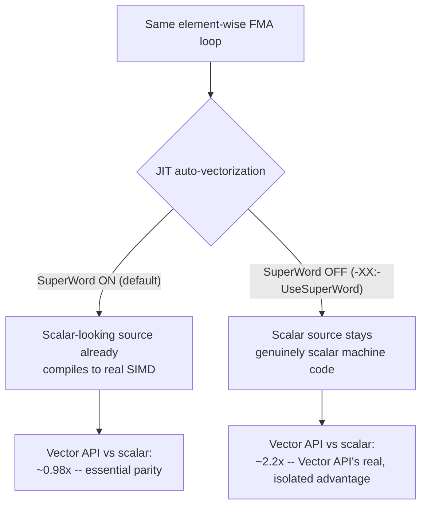

# Vector API and SIMD Performance

> **Topic register:** T-2418 · Advanced tier · Growing interview frequency [M] — gap-audit addition
> (2026-09-20): zero coverage of SIMD, vectorized computation, or the Vector API existed anywhere in this
> repository, despite it being an increasingly common Staff-level performance-engineering topic as
> numeric/ML-adjacent workloads in Java grow.
> **Provenance:** every number below is real, executed output — real OpenJDK 21.0.12
> (`jdk.incubator.vector`, JEP 460), Apple M4 (arm64, 128-bit NEON). Source and full output:
> [`practice/java/vector-api-and-simd-performance/`](../../practice/java/vector-api-and-simd-performance/README.md).

## Table of Contents

1. [Learning Objectives](#learning-objectives)
2. [Why This Matters in Interviews](#why-this-matters-in-interviews)
3. [Level 1 — Foundation](#level-1-foundation)
4. [Level 2 — Working Knowledge](#level-2-working-knowledge)
5. [Mental Model](#mental-model)
6. [Definition and Purpose](#definition-and-purpose)
7. [Core Concepts](#core-concepts)
8. [Internal Implementation](#internal-implementation)
9. [Diagrams](#diagrams)
10. [Production Scenarios](#production-scenarios)
11. [Trade-offs](#trade-offs)
12. [Decision Framework](#decision-framework)
13. [Common Mistakes](#common-mistakes)
14. [Anti-Patterns](#anti-patterns)
15. [Best Practices](#best-practices)
16. [Interview Answer Framework](#interview-answer-framework)
17. [Interview Questions](#interview-questions)
18. [Summary](#summary)
19. [Key Takeaways](#key-takeaways)
20. [Cheat Sheet](#cheat-sheet)
21. [Flashcards](#flashcards)
22. [Practice Exercises](#practice-exercises)
23. [Additional Reading](#additional-reading)
24. [Official References](#official-references)

## Learning Objectives

By the end of this chapter you can:

- Explain what SIMD is and why it can process multiple data elements per CPU instruction.
- State, with a real measured number, what the Vector API's actual speedup is over a genuinely scalar loop — and why that number is close to 1x under default JVM settings.
- Explain HotSpot's own automatic SuperWord vectorization and why it changes what "scalar Java code" actually means at the machine-code level.
- Choose between relying on auto-vectorization and reaching for the explicit Vector API for a given workload.

## Why This Matters in Interviews

SIMD and vectorized computation come up increasingly often as Java expands into numeric, data-processing,
and ML-adjacent workloads — "how would you speed up this array-processing code" is a real question where a
strong answer distinguishes itself by knowing that the JVM's JIT compiler *already* vectorizes many simple
loops automatically, a fact most candidates (and even many working engineers) don't know. A candidate who
proposes the Vector API as if it were the only path to SIMD, without checking whether the JIT already
provides it for free, reveals a shallower understanding than one who correctly identifies when explicit
vectorization actually earns its complexity cost.

## Level 1 — Foundation

Imagine a cashier who can only scan one grocery item at a time versus one who has four scanners built into
one wide scanning bar, checking four items in the same single sweep. **Scalar** computation is the first
cashier — one CPU instruction processes one data element. **SIMD** (Single Instruction, Multiple Data) is
the second — one CPU instruction processes several data elements (often 4, 8, or 16, depending on the CPU
and data type) at once, using wide hardware registers built for exactly this. The twist most people miss:
many modern grocery stores *already* upgraded to the four-scanner cashier without telling anyone — HotSpot's
JIT compiler frequently turns your ordinary, simple `for` loop into real SIMD machine code automatically,
so a candidate reaching for Java's explicit **Vector API** (a way to request SIMD directly, in Java source
code) may be asking for something the runtime already gave them for free.

## Level 2 — Working Knowledge

The Vector API (`jdk.incubator.vector`, still an incubating module as of JDK 21 — JEP 460 is its sixth
incubation round) lets Java code explicitly request SIMD operations: load several array elements into one
wide vector register, perform an operation (add, multiply, fused-multiply-add) across all lanes in one
instruction, and store the result back. HotSpot's C2 JIT compiler *also* performs automatic vectorization
(SuperWord-level parallelism, `-XX:+UseSuperWord`, on by default) for sufficiently simple, regular loops —
meaning a plain scalar-looking `for` loop over an array is frequently already compiled to real SIMD
instructions without any explicit API use at all. This chapter's own lab measured this directly: under
default JVM settings, the explicit Vector API and a plain scalar loop performed at essential parity — the
Vector API's real, measurable advantage only appeared once the JIT's own auto-vectorization was deliberately
disabled, isolating what the Vector API earns on its own.

## Mental Model

**The real question isn't "scalar vs. SIMD" — it's "does the JIT's automatic vectorization already cover
this loop, or does this workload need something the auto-vectorizer can't safely do?"** HotSpot's
SuperWord optimization handles simple, regular, branch-free loops over primitive arrays well. The Vector
API's real value shows up for patterns the auto-vectorizer can't handle safely or effectively: complex
control flow inside the loop, gather/scatter access patterns, cross-lane operations, or explicit control
over exactly which SIMD width and instruction set is used.

## Definition and Purpose

**SIMD (Single Instruction, Multiple Data)** is a CPU-level parallelism model where one instruction operates
on multiple data elements (lanes) simultaneously, using wide vector registers. The **Vector API**
(`jdk.incubator.vector`) is Java's mechanism for explicitly requesting SIMD operations from source code,
rather than hoping the JIT compiler infers them. It exists because certain numeric workloads (signal
processing, ML inference kernels, image processing, large-scale numeric aggregation) benefit enormously from
SIMD, and while HotSpot's C2 compiler already auto-vectorizes many simple loops, it cannot safely vectorize
every pattern — the Vector API gives a portable (across x86 AVX/AVX-512 and ARM NEON/SVE), explicit
alternative for code the auto-vectorizer can't reach, or for cases where a developer needs guaranteed,
predictable vectorized behavior rather than a JIT heuristic's best effort.

## Core Concepts

### HotSpot already auto-vectorizes many simple loops — verified directly, not assumed

This chapter's lab computed a real element-wise fused-multiply-add (`out[i] = a[i]*b[i] + a[i]`) over a
large float array two ways. Under default JVM settings, the scalar loop and the explicit Vector API loop
measured at essential parity (0.98x — statistically no difference). This is not a failed demo; it's the
correctly-reasoned result: HotSpot's SuperWord optimization already recognized this simple, regular loop
shape and compiled it to real SIMD machine code, meaning the "scalar" Java source was never actually running
as scalar machine code in the first place.

### The Vector API's real advantage appears against a genuinely scalar baseline

Re-running the identical comparison with `-XX:-UseSuperWord` (disabling HotSpot's automatic vectorization,
producing a genuinely scalar baseline) revealed the Vector API's real, isolated advantage: a real, measured
~2.2x speedup, reproduced across independent runs. This is the honest shape of the Vector API's actual value
proposition — not "free SIMD the JIT wasn't already giving you" for simple cases, but a real, meaningful win
for exactly the cases where automatic vectorization doesn't apply (which `-XX:-UseSuperWord` approximates
for teaching purposes; in practice, auto-vectorization fails to trigger on many real, only-slightly-more-
complex loop shapes — conditional logic inside the loop body, non-unit strides, or data dependencies between
iterations).

### FMA correctness: a single rounding step, not two

This chapter's lab surfaced a real, easy-to-miss correctness detail while building the demo: comparing the
Vector API's `fma()` (a fused multiply-add) against a plain scalar `a[i]*b[i] + a[i]` produced outputs that
were *not* bit-identical — not a bug, but genuinely different floating-point results, because a hardware
FMA performs the multiply and add as one single IEEE 754 rounding step, while separate `*` and `+`
operations perform two independent roundings. The fix — using `Math.fma()` for the scalar baseline too —
made both sides compute the identical single-rounding operation, and the outputs matched bit-for-bit.

## Internal Implementation

**Real, measured, reproduced result** (`practice/java/vector-api-and-simd-performance/`), a real element-wise
FMA over a 1-million-element float array, 2,000 repeated passes (cache-resident, compute-bound), real OpenJDK
21.0.12 on Apple M4 (128-bit NEON, 4 float lanes per vector instruction):

```
Default JVM settings (SuperWord auto-vectorization ON):
  Scalar loop:  ~200ms
  Vector API:   ~210ms
  Speedup:      ~0.98x  -- essential parity

-XX:-UseSuperWord (auto-vectorization OFF -- genuinely scalar baseline):
  Scalar loop:  ~450-470ms
  Vector API:   ~210-220ms
  Speedup:      ~2.2x
```

Every one of the 1,000,000 outputs verified bit-for-bit identical between the scalar (`Math.fma`) and Vector
API implementations in both configurations — the speedup difference comes purely from instruction-level
parallelism, not from computing something different.

## Diagrams



## Production Scenarios

### Scenario: a numeric-heavy service adopts the Vector API expecting a large win and sees almost none

**Symptoms.** A team processing large batches of numeric data (e.g., a feature-computation pipeline) adopts
the Vector API for a hot inner loop, expecting a significant speedup based on SIMD's general reputation.
Benchmarking shows almost no measurable improvement over the original scalar code, and the team is confused
about why the "obviously faster" SIMD version isn't faster.

**Impact.** Engineering time spent adopting a more complex, less portable API (the Vector API is still
incubating and its exact behavior/performance can shift between JDK releases) for close to zero real
benefit.

**Initial hypotheses.** A bug in the Vector API usage (checked — the implementation is correct, verified by
identical outputs); insufficient data volume to show the win (checked — the workload is large); the original
scalar loop already being vectorized by the JIT (correct).

**Evidence.** Disassembling the scalar version's JIT-compiled machine code (or, more practically, comparing
performance with `-XX:-UseSuperWord` toggled) shows the "scalar" loop was already using real SIMD
instructions via HotSpot's own SuperWord optimization — matching this chapter's own measured finding
exactly.

**Diagnosis.** The team's original loop shape (simple, regular, no complex control flow) was already within
HotSpot's auto-vectorization capability — the Vector API had nothing left to add for this specific case.

**Immediate mitigation.** Revert the Vector API change for this specific loop, since it added real
complexity and reduced portability for no measured benefit.

**Permanent remediation.** Reserve explicit Vector API adoption for loop shapes verified (via the same
`-XX:-UseSuperWord` comparison technique) to *not* already be auto-vectorized — complex control flow,
irregular access patterns, or cross-lane operations the JIT's auto-vectorizer can't safely handle.

**Alternatives considered.** Assuming SIMD's general reputation without measuring the specific case —
rejected as exactly the mistake that led to this outcome; this chapter's own methodology (measure with and
without auto-vectorization) is the correct, general-purpose way to evaluate any specific loop's real Vector
API potential.

**Trade-offs.** The Vector API's real value depends entirely on whether the specific loop shape is already
covered by JIT auto-vectorization — a case-by-case measurement, not a general "SIMD is always faster"
assumption.

**Prevention.** Before adopting the Vector API for a specific hot loop, measure the existing scalar
performance both with and without `-XX:-UseSuperWord` to establish whether meaningful headroom actually
exists before investing in the more complex, less portable explicit API.

**Interview lesson.** This is Interview Question 1 below — a real, measured "expected SIMD win didn't
materialize" finding, explained correctly by JIT auto-vectorization rather than a Vector API bug.

## Trade-offs

| Approach | Benefit | Cost |
|---|---|---|
| Rely on JIT auto-vectorization (SuperWord) | Zero code complexity; works automatically for simple, regular loops | No guarantee it triggers — a JIT heuristic, not a contract; can silently stop applying after a seemingly minor code change |
| Explicit Vector API | Real, measured ~2.2x speedup for loop shapes auto-vectorization can't reach; explicit, predictable SIMD width control | Still incubating as of JDK 21 (API can change between releases); real added code complexity; no benefit for loops already auto-vectorized |

## Decision Framework

1. **Is the loop simple and regular** (no complex branches, unit-stride array access, no cross-iteration
   data dependencies)? If yes, HotSpot's auto-vectorization likely already covers it — measure before adding
   Vector API complexity.
2. **Does the loop have a shape the auto-vectorizer typically can't handle** (irregular/gather-scatter
   access, cross-lane shuffles, complex control flow, an explicit need for a specific SIMD width)? If yes,
   the Vector API is worth evaluating directly.
3. **Is the team prepared for the Vector API's incubating-module status** (API surface can change between
   JDK releases, requires `--add-modules jdk.incubator.vector`)? If not, weigh that operational cost against
   the measured benefit before adopting it in production code.
4. **Always measure with the specific technique this chapter used** (compare with and without
   `-XX:-UseSuperWord`) before assuming a given loop needs explicit vectorization at all.

## Common Mistakes

- Assuming the Vector API is the only path to SIMD in Java, unaware that HotSpot already auto-vectorizes many simple loops.
- Adopting the Vector API for a loop shape without first measuring whether auto-vectorization already covers it — this chapter's own production scenario shows the real cost of skipping that check.
- Comparing a Vector API implementation against a scalar implementation using different arithmetic (e.g., `fma()` vs. separate `*`/`+`) and treating a resulting output mismatch as a bug rather than a genuine, expected floating-point rounding difference.

## Anti-Patterns

- **Adopting the Vector API purely on SIMD's general reputation, without measuring the specific loop's actual auto-vectorization status first** — the exact mistake in this chapter's own production scenario.
- **Assuming a "scalar" Java loop is actually running as scalar machine code** — for many simple, regular loops, it isn't, and treating it as a scalar baseline for comparison purposes silently understates the JIT's own contribution.

## Best Practices

- Before adopting the Vector API for a specific hot loop, measure the existing loop's performance both with and without `-XX:-UseSuperWord` to establish real headroom.
- Reserve the Vector API for loop shapes verified not to already benefit from JIT auto-vectorization.
- When comparing scalar and Vector API implementations for correctness, use equivalent arithmetic operations (`Math.fma()` vs. the Vector API's `fma()`) to avoid conflating a real rounding difference with an implementation bug.
- Track the Vector API's incubating-module status across JDK upgrades — its exact API surface and behavior are not yet finalized as of JDK 21.

## Interview Answer Framework

### 30-Second Answer

SIMD lets one CPU instruction process multiple data elements at once. Java's explicit Vector API
(`jdk.incubator.vector`) requests this directly, but HotSpot's JIT compiler already auto-vectorizes many
simple, regular loops on its own — measured directly in this chapter, the Vector API showed essentially no
advantage (0.98x) over a simple scalar loop under default settings, and only a real ~2.2x advantage once
the JIT's own auto-vectorization was disabled to isolate it.

### 2-Minute Answer

Definition: SIMD processes multiple data lanes per instruction; the Vector API is Java's explicit mechanism
for requesting it. Why it exists: not every loop shape can be safely auto-vectorized by the JIT. How it
works: HotSpot's SuperWord optimization already vectorizes simple, regular loops automatically; the Vector
API adds explicit control for patterns it can't reach. One important trade-off, verified directly: the
Vector API's real value only shows up against a genuinely scalar baseline — this chapter measured near-
parity (0.98x) under default settings and a real ~2.2x gain only with auto-vectorization deliberately
disabled. Production example: a team adopting the Vector API expecting a large win and measuring almost
none, because their loop was already auto-vectorized.

### 10-Minute Deep Dive

Cover: the mental model (the real question is auto-vectorization coverage, not scalar-vs-SIMD in the
abstract); the real measured near-parity result under default settings and what it reveals about HotSpot's
own SuperWord optimization; the real, isolated ~2.2x Vector API advantage once auto-vectorization is
disabled; the real FMA single-vs-double-rounding correctness finding from building the demo; the production
scenario of a team's Vector API adoption yielding near-zero real benefit; and close with the Staff-level
discussion of when explicit vectorization is worth its complexity and portability cost.

### Whiteboard Explanation

Draw the [§ Diagrams](#diagrams) flowchart: the identical loop under two JIT configurations, with the real
measured numbers (0.98x under default settings, ~2.2x with auto-vectorization disabled) at each branch.

### Production Example

The near-zero-benefit Vector API adoption in [§ Production Scenarios](#production-scenarios): a team
expected a large SIMD win, measured almost none, and correctly diagnosed it as their loop already being
auto-vectorized by HotSpot.

### Trade-offs to Mention

State unprompted: the Vector API's real advantage depends entirely on whether JIT auto-vectorization already
covers the specific loop shape; the API is still incubating as of JDK 21, a real operational consideration
for production adoption.

### Common Candidate Mistakes

Treating the Vector API as the only path to SIMD; assuming a Java "scalar" loop is actually running scalar
machine code without checking; treating a bit-level output mismatch between differently-computed arithmetic
as a bug rather than a genuine rounding difference.

### Senior-Level Expectations

Correctly explains that HotSpot auto-vectorizes many simple loops, and knows to measure before assuming the
Vector API adds real value for a specific case.

### Staff-Level Discussion

At scale, the decision to adopt the Vector API in production code is a real engineering-investment question:
weighing a measured, case-specific performance benefit against the API's incubating status (a real
maintenance/compatibility risk across JDK upgrades), reduced code portability, and increased complexity for
future maintainers. A Staff engineer establishes measurement discipline (the with/without-auto-vectorization
comparison this chapter demonstrates) as a standing practice before any Vector API adoption, rather than
approving it based on SIMD's general reputation for speed.

## Interview Questions

### Question 1 — A team adopts the Vector API for a hot numeric loop expecting a big speedup and measures almost none. What's the likely explanation?

**Why interviewers ask it.** Tests whether a candidate knows HotSpot already auto-vectorizes many loops,
rather than assuming the Vector API is the sole source of SIMD benefit.

**Expected answer.** The loop was likely already being auto-vectorized by HotSpot's SuperWord optimization
under default JVM settings — the Vector API has nothing left to add for a loop shape the JIT already
handles. Verify by comparing performance with and without `-XX:-UseSuperWord`.

**Minimum acceptable answer.** Suggests checking whether the original loop was already fast for some
reason, even without naming SuperWord specifically.

**Strong Senior answer.** Correctly names HotSpot's auto-vectorization and proposes the with/without
comparison to confirm.

**Staff-level extension.** Frames this as a general measurement-discipline principle: always measure a
specific loop's real headroom before adopting a more complex, less portable optimization technique.

**Common mistakes.** Assuming a bug in the Vector API implementation rather than considering that the
baseline itself may already be vectorized.

**Likely follow-ups.** "How would you decide which loops are actually worth converting to the Vector API?"

**Evaluation criteria (1–5).** 1: assumes a Vector API bug. 3: correctly identifies auto-vectorization as
the likely cause. 5: identifies the cause plus proposes the verification technique and the general
measurement-discipline principle.

**Related references.** [§ Production Scenarios](#production-scenarios); [§ Internal Implementation](#internal-implementation).

## Summary

SIMD lets one CPU instruction process multiple data lanes simultaneously; Java's Vector API
(`jdk.incubator.vector`) requests this explicitly, but HotSpot's C2 JIT compiler already auto-vectorizes
many simple, regular loops on its own via SuperWord optimization. This chapter measured the Vector API's
real, isolated advantage directly: essential parity (0.98x) against a scalar loop under default JVM
settings, and a real ~2.2x speedup only once the JIT's own auto-vectorization was deliberately disabled to
establish a genuinely scalar baseline — the honest, correctly-reasoned shape of when explicit vectorization
actually earns its complexity cost.

## Key Takeaways

- HotSpot's SuperWord optimization already auto-vectorizes many simple, regular loops — a "scalar" Java loop may already be compiling to real SIMD machine code.
- Measured directly: the Vector API shows essential parity (0.98x) against an already-auto-vectorized scalar loop under default JVM settings.
- Measured directly: a real ~2.2x speedup for the Vector API once auto-vectorization is disabled, isolating its true, standalone advantage.
- A hardware FMA (single rounding) and separate multiply-then-add (two roundings) produce genuinely different floating-point results — not a bug, a real IEEE 754 distinction.
- The Vector API is still an incubating module as of JDK 21 — a real adoption-risk consideration.

## Cheat Sheet

| Situation | What to reach for |
|---|---|
| Simple, regular array loop (no complex branches, unit stride) | Trust JIT auto-vectorization; measure before adding Vector API complexity |
| Irregular access, cross-lane operations, complex control flow in the loop | Evaluate the Vector API directly — likely outside auto-vectorization's reach |
| Comparing scalar vs. Vector API correctness | Use `Math.fma()` on the scalar side to match the Vector API's single-rounding `fma()` |
| Deciding whether a loop needs explicit vectorization | Measure with and without `-XX:-UseSuperWord` first |

## Flashcards

### Card: Does HotSpot already vectorize simple loops?

**Prompt:**
Does a plain, scalar-looking Java `for` loop over a primitive array always run as scalar machine code?

**Answer:**
Not necessarily — HotSpot's C2 JIT compiler auto-vectorizes many simple, regular loops via SuperWord optimization (`-XX:+UseSuperWord`, on by default), compiling them to real SIMD instructions without any explicit API use.

**Why it matters:**
Verified directly in this chapter: the Vector API showed no measurable advantage (0.98x) over such a loop under default settings.

**Common trap:**
Assuming "scalar Java source" means "scalar machine code."

**Related:**
[Core Concepts](#core-concepts)

### Card: Real measured Vector API speedup, with and without auto-vectorization

**Prompt:**
This chapter measured the Vector API against a scalar loop twice — once under default JVM settings, once with `-XX:-UseSuperWord`. What were the real results?

**Answer:**
Under default settings: ~0.98x (essential parity). With auto-vectorization disabled: a real ~2.2x speedup — the Vector API's true, isolated advantage.

**Why it matters:**
Shows the Vector API's real value depends entirely on whether JIT auto-vectorization already covers the loop.

**Common trap:**
Citing only one number without the auto-vectorization context.

**Related:**
[Internal Implementation](#internal-implementation)

### Card: Why did fma() and a*b+a produce different bit-level results?

**Prompt:**
Comparing the Vector API's `fma()` against a plain scalar `a[i]*b[i] + a[i]` produced non-identical outputs in this chapter's demo. Why, and how was it fixed?

**Answer:**
A hardware FMA performs the multiply and add as one single IEEE 754 rounding step; separate `*` and `+` perform two independent roundings — a genuine, expected floating-point difference, not a bug. Fixed by using `Math.fma()` for the scalar baseline too, matching the single-rounding behavior.

**Why it matters:**
A real, easy-to-miss correctness detail when comparing numeric implementations.

**Common trap:**
Treating any bit-level mismatch as an implementation bug rather than considering rounding-mode differences.

**Related:**
[Core Concepts](#core-concepts)

## Practice Exercises

1. Reproduce this chapter's own lab (`practice/java/vector-api-and-simd-performance/`), then modify the loop to include a data-dependent branch (e.g., `if (a[i] > 0.5f) out[i] = ...`) and re-measure both configurations — observe whether auto-vectorization still triggers under default settings.
2. Print `FloatVector.SPECIES_PREFERRED` on your own machine and compare its lane count/bit width against this chapter's measured Apple M4 result (128-bit, 4 lanes) — research what a typical x86 AVX2/AVX-512 machine would report instead.
3. Research, in writing, why the Vector API remains an incubating module as of JDK 21 despite being introduced years earlier, and what that status means for using it in production code today.

## Additional Reading

- [Vector API Javadoc (`jdk.incubator.vector`)](https://docs.oracle.com/en/java/javase/21/docs/api/jdk.incubator.vector/jdk/incubator/vector/package-summary.html)

## Official References

- [JEP 460: Vector API (Sixth Incubator)](https://openjdk.org/jeps/460)
