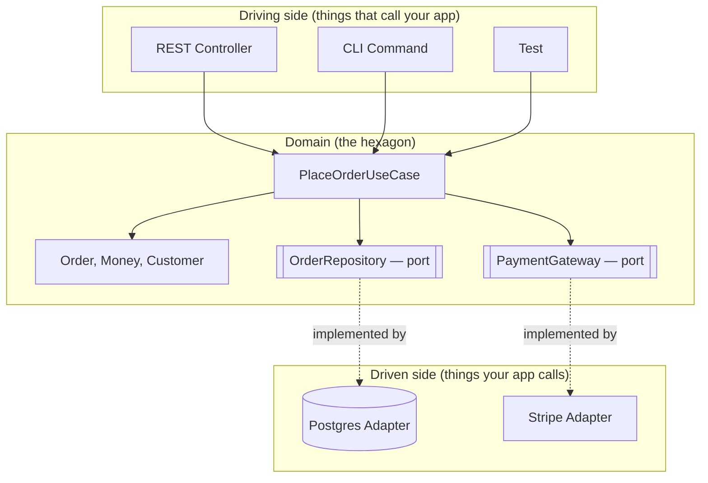
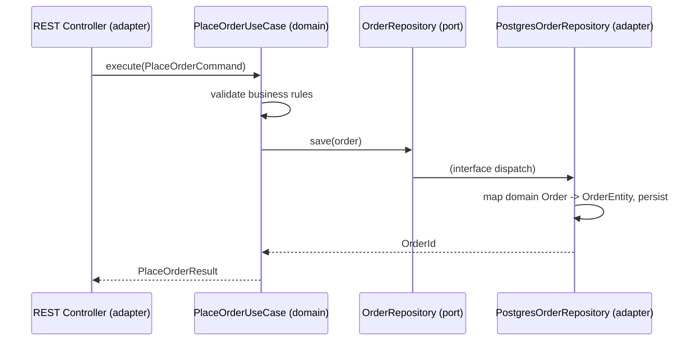

# Clean and Hexagonal Architecture

> **Topic register:** T-901 · IWI 7.25 · Advanced tier · Prerequisite for: [DDD Tactical Design — Aggregates](ddd-tactical-design-aggregates.md) (T-903), T-912 (technology replacement boundaries)

## Table of Contents

1. [Learning Objectives](#learning-objectives)
2. [Why This Matters in Interviews](#why-this-matters-in-interviews)
3. [Mental Model](#mental-model)
4. [Definition and Purpose](#definition-and-purpose)
5. [Historical Context](#historical-context)
6. [Core Concepts](#core-concepts)
7. [Internal Implementation](#internal-implementation)
8. [Diagrams](#diagrams)
9. [Java Examples](#java-examples)
10. [Production Scenarios](#production-scenarios)
11. [Trade-offs](#trade-offs)
12. [Performance, Memory, and Concurrency Implications](#performance-memory-and-concurrency-implications)
13. [Decision Framework](#decision-framework)
14. [Common Mistakes](#common-mistakes)
15. [Anti-Patterns](#anti-patterns)
16. [Best Practices](#best-practices)
17. [Interview Answer Framework](#interview-answer-framework)
18. [Interview Questions](#interview-questions)
19. [Summary](#summary)
20. [Key Takeaways](#key-takeaways)
21. [Cheat Sheet](#cheat-sheet)
22. [Flashcards](#flashcards)
23. [Practice Exercises](#practice-exercises)
24. [Additional Reading](#additional-reading)
25. [Official References](#official-references)

---

## Learning Objectives

By the end of this chapter you can:

- State the one rule hexagonal/Clean/Onion architecture all share, and explain why layered architecture typically inverts it in practice.
- Define a port and an adapter precisely, and place a repository interface in the correct package.
- Name the real cost of domain purity (mapping code) honestly, without overselling it as free.
- Answer "would you use this on every project?" with a concrete criterion — the single most differentiating question on this topic.

## Why This Matters in Interviews

This is one of the highest-leverage architecture topics precisely because most candidates can describe the pattern but very few can say, unprompted, when *not* to use it. Interviewers use the "would you use this on every project" question specifically to separate candidates who've memorized the pattern from those who've actually weighed its cost against a real system's needs — an unconditional "yes" is the single most common failure on this topic.

## Mental Model

**Draw an arrow from every dependency in your codebase. If any arrow from your business logic points outward — toward a database, a framework, an SDK — you don't have this pattern, no matter what your folders are named.** The entire pattern is one rule: dependencies point inward, always. Ports are how the domain states what it needs without depending on who provides it; adapters are the "who."

## Definition and Purpose

Hexagonal architecture (Alistair Cockburn, 2005, "Ports and Adapters") organizes a system around one rule: **the domain — your business logic — has no compile-time dependency on anything outside it.** Not the database, not the web framework, not the message broker, not the cloud SDK.

The domain defines **ports**: interfaces stating what it needs (`OrderRepository`, `PaymentGateway`) or what it offers (`PlaceOrderUseCase`). Everything outside the domain — a Postgres repository, a Stripe client, a REST controller — is an **adapter** that implements or calls a port. Dependencies point in exactly one direction: inward, toward the domain.

Layered architecture (`Controller → Service → Repository → Database`) looks similar but inverts the actual dependency: the "domain" logic living in the service layer typically imports JPA entities, transaction annotations, and framework types directly. The dependency points *outward*, toward infrastructure, even though the diagram is drawn as if it points down. This matters concretely at the moment infrastructure changes: swapping ORMs, moving from REST to gRPC, or extracting a bounded context into its own service. In a layered system with a leaky service layer, that change touches every class that imported the old framework type — often the majority of the codebase. In a hexagonal system, it touches only the adapters implementing the affected port; the domain and use cases don't move.

## Historical Context

Cockburn's original motivation was testability: he was trying to solve the specific problem of tests that could only run against a live database or a live UI, making TDD impractical for anything beyond trivial logic. A domain with no infrastructure dependency can be unit-tested with plain object construction — no `@SpringBootTest`, no Testcontainers, no mocks of framework classes.

Robert Martin's Clean Architecture (2012) generalizes the same idea into concentric rings — Entities, Use Cases, Interface Adapters, Frameworks & Drivers — with the **Dependency Rule**: source code dependencies point only inward, and nothing in an inner ring knows anything about an outer ring. Jeffrey Palermo's Onion Architecture (2008) is a third name for the same shape. Whichever term an interviewer uses, the mechanism being tested is identical: inversion of the dependency between domain and infrastructure.

## Core Concepts

### Primary vs. secondary ports

**Primary (driving) ports** are interfaces the outside world calls *into* the domain — `PlaceOrderUseCase.execute(command)`. **Secondary (driven) ports** are interfaces the domain calls *out through* — `OrderRepository.save(order)`. Primary ports are typically one-per-use-case (small, task-shaped) while secondary ports are typically one-per-resource (broader, CRUD-shaped or narrower, depending on interface segregation choices).

### Where JPA entities live: three defensible answers, in increasing order of purity

1. **Separate persistence models + mappers** — an `Order` domain class and a distinct `OrderEntity` JPA class, converted at the repository adapter boundary. Maximum purity, real mapping-code cost.
2. **Annotated domain objects, pragmatic compromise** — the domain class carries `@Entity`/`@Id` annotations directly. The domain "knows about" JPA as a dependency, but no framework *behavior* leaks in. Common in practice; defensible if stated as a deliberate trade-off.
3. **Domain depends on ORM types directly in its methods** — this is the leak the pattern exists to prevent, not a valid option.

### Transactions live at the application-service level

The layer that orchestrates a use case, sitting just inside the primary port. The domain itself does not know transactions exist; it operates on already-loaded aggregates and returns new state.

## Internal Implementation

**Sketch — illustrates the shape, not compiled standalone** (real, compiled Java for this pattern's domain-modelling prerequisite lives in [`practice/java/week-01/`](../../practice/java/week-01/); this hexagonal-architecture sketch has no equivalent runnable build, since it's a structural pattern, not an algorithm):

```java
// domain/order/OrderRepository.java — the port, owned by the domain
package domain.order;

public interface OrderRepository {
    Order findById(OrderId id);
    void save(Order order);
}

// infrastructure/persistence/PostgresOrderRepository.java — the adapter
package infrastructure.persistence;

import domain.order.Order;
import domain.order.OrderId;
import domain.order.OrderRepository;

public class PostgresOrderRepository implements OrderRepository {
    private final EntityManager em;
    private final OrderMapper mapper;

    @Override
    public Order findById(OrderId id) {
        OrderEntity entity = em.find(OrderEntity.class, id.value());
        return mapper.toDomain(entity);
    }

    @Override
    public void save(Order order) {
        em.merge(mapper.toEntity(order));
    }
}
```

## Diagrams





## Java Examples

```java
// Port owned by the domain -- an interface, never a concrete class.
public interface PaymentGateway {
    PaymentResult charge(CustomerId customer, Money amount);
}

// Adapter -- infrastructure implements the port; the domain never
// references StripeClient directly.
public class StripePaymentGateway implements PaymentGateway {
    private final StripeClient stripeClient;

    @Override
    public PaymentResult charge(CustomerId customer, Money amount) {
        var response = stripeClient.createCharge(customer.value(), amount.cents());
        return PaymentResult.from(response);
    }
}

// Anti-example: a domain-facing method returning an ORM type directly --
// this is the leak the pattern exists to prevent.
public interface BadOrderRepository {
    Optional<OrderEntity> findById(OrderId id); // OrderEntity is a JPA type
}
```

**Complexity note:** this is a compile-time/organizational pattern; there is no algorithmic complexity to analyze — the cost is in mapping code and indirection, covered in [§ Performance, Memory, and Concurrency Implications](#performance-memory-and-concurrency-implications).

## Production Scenarios

### Scenario: a "quick" ORM migration takes three months instead of the estimated two weeks because the domain wasn't actually clean

**Symptoms.** A team estimates two weeks to migrate a service's persistence layer from Hibernate to a lighter-weight JDBC-based mapper, based on the assumption that the service follows hexagonal architecture and only the adapter layer needs to change. The migration takes over three months, touching a large fraction of the codebase.

**Impact.** A migration planned and communicated to stakeholders as a low-risk, two-week effort becomes a multi-month project, eroding trust in future architecture-driven time estimates.

**Initial hypotheses.** The new persistence library is harder to use than expected (checked — the library itself is straightforward); the team underestimated testing time (checked — testing was a small fraction of the overrun); the domain layer had accumulated direct JPA dependencies over time, despite the `domain/`, `application/`, `infrastructure/` folder structure (correct).

**Evidence.** A dependency-direction audit (using a tool like ArchUnit, run for the first time during the migration) finds dozens of domain classes directly importing `javax.persistence` annotations and, in several cases, calling `EntityManager` methods directly from what were labeled "domain services" — the folder structure existed, but the dependency rule it was supposed to enforce had eroded silently over time with no automated check catching it.

**Diagnosis.** The team had hexagonal-shaped folders but no enforcement of the dependency rule itself — exactly this chapter's named anti-pattern of believing the pattern is a folder layout rather than a verified dependency direction. The estimate assumed the pattern was actually in effect; it wasn't, and nobody had checked.

**Immediate mitigation.** Scope the migration down to the adapters that were genuinely clean first, delivering partial value while the domain-layer cleanup for the rest proceeds separately.

**Permanent remediation.** Add an automated ArchUnit (or equivalent) dependency-direction check to the build pipeline, failing any future domain-layer import of an infrastructure type, so the pattern's actual guarantee — not just its folder appearance — is continuously verified going forward.

**Alternatives considered.** Trusting code review alone to catch future violations — rejected, since the original erosion happened gradually across many individually-small, individually-reviewed changes; only an automated, continuously-enforced check catches this class of drift.

**Trade-offs.** Adding the ArchUnit check requires an upfront cleanup of every existing violation before it can be turned on — a real, one-time cost accepted in exchange for preventing the same estimate-shattering surprise on the next infrastructure swap.

**Prevention.** Any team claiming hexagonal architecture should verify the claim with an automated dependency-direction check from the start, not rely on folder naming or code review discipline alone — this is the concrete version of Interview Question 6's "which files change, and which must not" question, discovered the hard way.

**Interview lesson.** This is the production-scale version of the "believing hexagonal architecture is a folder layout" common mistake — a real estimate built on an unverified architectural claim, and the concrete cost of that gap.

## Trade-offs

| Benefit | Cost |
|---|---|
| Domain testable with plain unit tests, no framework bootstrap | Extra interfaces and (often) mapping code for every port |
| Infrastructure swap touches only adapters | More files, more indirection to navigate for a newcomer |
| Enforces a single direction of dependency, catchable in code review or with `ArchUnit` | Temptation to leak framework types through ports if not disciplined |
| Domain logic reads as business rules, not persistence mechanics | Overkill for a small CRUD service with no meaningful domain logic |

**When NOT to use it:** a thin CRUD service that is, in substance, a typed wrapper over a single table with no business rules beyond validation. Applying hexagonal architecture unconditionally to that service adds indirection with no corresponding payoff — there is no domain logic to protect from infrastructure, so the domain/infrastructure boundary is drawn around nothing. A Staff-level answer says this explicitly; it is one of the most differentiating things a candidate can volunteer.

## Performance, Memory, and Concurrency Implications

Hexagonal architecture is a compile-time/organizational pattern, not a runtime one — by itself it adds no meaningful latency (an extra interface dispatch is not measurable next to I/O). The indirect cost is at the mapping boundary: converting between a persistence model and a domain model on every read/write is allocation and CPU work that is easy to make expensive by mapping eagerly and completely when only a projection is needed. In a hot read path, mapping the entire aggregate graph to serve a summary view is the actual, measurable cost — not the architecture. This is why option 2 above (annotated domain objects) is sometimes the correct trade-off for a hot path: it removes the mapping cost at the price of purity.

**Concurrency implication:** because the domain has no framework dependency, it also has no implicit thread-confinement guarantee that a framework (e.g., a request-scoped Spring bean) would otherwise provide for free. A domain object shared across threads by an adapter (a cache, a batch processor) needs its own explicit thread-safety reasoning — the pattern doesn't add a concurrency problem, but it does remove a source of accidental protection.

## Decision Framework

| Signal | Lean toward hexagonal | Lean toward simpler layering |
|---|---|---|
| Business-rule density | High — real domain logic to protect | Low — mostly CRUD + validation |
| Expected system lifetime | Years, multiple infra generations likely | Short-lived, prototype, or throwaway |
| Team size / parallel work | Multiple teams need a stable contract | Single small team, low coordination cost |
| Testing requirement | Fast, framework-free unit tests required | Integration tests are acceptable |

## Common Mistakes

- **Believing hexagonal architecture is a folder layout.** `domain/`, `application/`, `infrastructure/` packages with zero enforcement of the dependency rule is theater — a domain class can still `import javax.persistence.Entity` inside those folders. The rule is about dependency direction, verifiable with a tool like ArchUnit, not naming convention.
- **Anemic use cases that just forward to the repository** — if every "use case" is `repository.save(mapper.toEntity(dto))`, there is no domain logic being protected and the pattern is providing zero value.
- Claiming the mapping-code cost is negligible without having actually estimated it.

## Anti-Patterns

- **Leaking a framework exception through a port** — e.g., a repository interface method that can throw `org.hibernate.LazyInitializationException`. The port's contract is now coupled to the adapter's implementation detail.
- **One port per method** rather than one port per cohesive capability — produces dozens of single-method interfaces and defeats the readability the pattern is meant to provide.
- **Answering "would you use this on every project?" with an unconditional yes** — the single most common failure on this topic, reading as memorized rather than understood.
- **Trusting folder structure alone as evidence of dependency inversion**, with no automated check.

## Best Practices

- Enforce the dependency rule with an automated tool (e.g., ArchUnit) in the build pipeline, not just code review or naming convention.
- Choose the JPA-entity-placement option (separate models, annotated domain, or neither) deliberately and state it as a trade-off, not a default.
- Place transactions at the application-service level, never inside domain code.
- State explicitly, unprompted, when this pattern is *not* worth its cost for a given service.

## Interview Answer Framework

### 30-Second Answer

Hexagonal/Clean/Onion architecture is one rule under three names: dependencies point inward, always. The domain defines ports (interfaces); infrastructure provides adapters implementing them. The payoff is a testable, infrastructure-swappable domain; the cost is mapping code and indirection — and the honest answer to "use this everywhere?" is no, with a stated criterion (business-rule density, system lifetime, team size).

### 2-Minute Answer

Definition: the domain has no compile-time dependency on infrastructure; it defines ports that adapters implement. Why it exists: layered architecture looks similar but typically inverts the real dependency, since the service layer imports framework types directly — Cockburn's original motivation was making unit testing possible without a live database. How it works: primary ports are called into the domain, secondary ports are called out from it; transactions live at the application-service layer, not inside the domain. One important trade-off: purity costs real mapping code between persistence and domain models. Production example: a two-week ORM migration estimate that took three months because the domain layer had silently accumulated direct JPA dependencies with no automated check catching the drift.

### 10-Minute Deep Dive

Cover, in order: the mental model — draw the dependency arrows, inward is the only rule (mental model); the historical motivation (testability, Cockburn 2005) and the three equivalent names (historical context); primary vs. secondary ports and the three JPA-entity-placement options (core concepts); the trade-off table and the explicit "when not to use it" case (trade-offs); the decision framework's four signals (decision framework); and close with the production scenario — an estimate that assumed dependency-rule enforcement that had silently eroded, discovered only during a real migration.

### Whiteboard Explanation

Draw the [§ Diagrams](#diagrams) hexagon graph: driving adapters on the left pointing into the domain, the domain's ports as small connector shapes, driven adapters on the right implementing those ports. Draw every arrow pointing inward toward the domain, then ask "what would this diagram look like if the service layer imported JPA types directly?" — draw that arrow pointing the wrong way to make the layered-architecture inversion visually explicit.

### Production Example

The migration-estimate blowup in [§ Production Scenarios](#production-scenarios): a two-week ORM swap estimate assumed the domain layer was clean; an ArchUnit audit run mid-migration revealed it wasn't, and the actual migration took three months — fixed going forward with an automated dependency-direction check in the build pipeline.

### Trade-offs to Mention

State unprompted: the pattern adds no runtime cost by itself, but the mapping boundary does, and can be expensive if mapped eagerly on a hot read path; folder structure alone doesn't prove the dependency rule is being followed; the pattern is a deliberate trade-off, not a universal default.

### Common Candidate Mistakes

Answering "would you use this on every project?" with an unconditional yes; describing folder structure instead of dependency direction; claiming the mapping cost is negligible without having estimated it.

### Typical Follow-Up Questions

1. "Draw me a layered architecture where the service layer imports JPA types directly. Which layer is actually depending on which?"
2. "What if the DynamoDB single-table design doesn't map cleanly onto your existing aggregate boundaries — what breaks first, the port or the domain model?"
3. "How do you pick which module to start with when retrofitting this into an existing codebase?"

### Senior-Level Expectations

States the dependency inversion precisely and can point to a concrete leaky-layered example; answers "would you use this everywhere" with "no" and at least one concrete reason.

### Staff-Level Discussion

At Staff scope, hexagonal boundaries are team boundaries as much as code boundaries — a well-drawn port is a contract two teams can develop against in parallel without a shared merge conflict. The migration cost of retrofitting the pattern into a legacy system is itself a planning artifact: it should be scoped per bounded context (start with the highest-change-rate module, not the whole system at once), and the "would I actually do this" judgment becomes an organizational cost/benefit call, not just a technical one — indirection has a real cost in onboarding time and code-review overhead that has to be weighed against the swap-cost benefit for a system that may never actually swap its database.

## Interview Questions

### Question 1 — What problem does hexagonal architecture solve that layered architecture does not?

**Why interviewers ask it.** Layered architecture also claims "separation of concerns," so the differentiator has to be more precise than that.

**Expected answer.** Names the *direction* of the dependency, not just "separation of concerns."

**Minimum acceptable answer.** Names dependency direction as the distinguishing factor, even without a concrete example.

**Strong Senior answer.** States the inversion precisely and can point to a concrete leaky-layered example.

**Staff-level extension.** Connects the inversion to a real organizational cost (team coupling, migration cost) rather than stopping at the technical definition.

**Common mistakes.** Describing folder structure instead of dependency direction; conflating the two patterns as identical with different names.

**Likely follow-ups.** "Draw me a layered architecture where the service layer imports JPA types directly. Which layer is actually depending on which?"

**Evaluation criteria (1–5).** 1: describes folder structure only. 3: states the dependency-direction inversion with an example. 5: correct statement plus a real organizational-cost connection.

**Related references.** [§ Definition and Purpose](#definition-and-purpose).

---

### Question 2 — What exactly is a port, and what is an adapter? Give one of each.

**Why interviewers ask it.** Tests precise vocabulary, not vague familiarity.

**Expected answer.** Port = interface owned by the domain; adapter = concrete implementation living in infrastructure.

**Minimum acceptable answer.** Gives a roughly correct definition of both, even if imprecise.

**Strong Senior answer.** Correctly distinguishes primary (driving) vs. secondary (driven) ports when asked.

**Staff-level extension.** Discusses interface segregation trade-offs — one broad repository port vs. several narrow, single-capability ports — and when each is appropriate.

**Common mistakes.** Placing the interface in the infrastructure package "for convenience"; calling a concrete class a "port."

**Likely follow-ups.** "Is a port a class or an interface? Why does that matter?"

**Evaluation criteria (1–5).** 1: conflates port and adapter. 3: correctly defines both with an example. 5: correct definitions plus interface-segregation trade-off discussion.

**Related references.** [§ Core Concepts](#core-concepts).

---

### Question 3 — Where does the repository interface live, and why not next to its implementation?

**Why interviewers ask it.** Tests whether the candidate understands the deliberate inversion of normal Java package convention.

**Expected answer.** Domain package, not infrastructure — because the domain owns the contract it depends on.

**Minimum acceptable answer.** States the interface belongs in the domain package.

**Strong Senior answer.** States the package structure correctly without hesitation.

**Staff-level extension.** Connects this to the Dependency Inversion Principle (the "D" in SOLID) explicitly, by name.

**Common mistakes.** "Next to the implementation, like normal Java convention" — this is the standard convention inverted deliberately, and missing that is the most common miss.

**Likely follow-ups.** "What Java package would `OrderRepository` sit in versus `PostgresOrderRepository`?"

**Evaluation criteria (1–5).** 1: places the interface next to the implementation. 3: correctly places it in the domain package. 5: correct placement plus names Dependency Inversion Principle explicitly.

**Related references.** [§ Internal Implementation](#internal-implementation).

---

### Question 4 — Your domain model must not depend on JPA. What does that cost you, concretely?

**Why interviewers ask it.** Tests honesty about trade-offs rather than overselling purity as free.

**Expected answer.** Names the mapping layer and its maintenance cost honestly, doesn't oversell purity as free.

**Minimum acceptable answer.** Acknowledges some cost exists, even without a concrete estimate.

**Strong Senior answer.** Gives an honest, reasoned cost estimate.

**Staff-level extension.** Discusses when the annotated-domain-object option is the better trade-off specifically to avoid this cost, and why that's not "cheating."

**Common mistakes.** Claiming there is no cost, or that the cost is negligible without having actually estimated it.

**Likely follow-ups.** "How much mapping code, roughly, for a moderately complex aggregate?"

**Evaluation criteria (1–5).** 1: claims zero cost. 3: gives an honest cost estimate. 5: correct estimate plus the annotated-domain-object trade-off discussion.

**Related references.** [§ Core Concepts](#core-concepts).

---

### Question 5 — Would you use this on every project?

*This is the Staff-differentiating question.*

**Why interviewers ask it.** The single most common failure on this topic is an unconditional "yes," revealing memorization rather than understanding.

**Expected answer.** No, with a concrete criterion (business-rule density, expected system lifetime, team size) — not "yes, always" and not "it depends" without the criterion.

**Minimum acceptable answer.** Says "no" with at least a vague reason.

**Strong Senior answer.** Answers "no" with at least one concrete reason.

**Staff-level extension.** Produces a specific counter-example and reasons about the cost/benefit in terms a business stakeholder would recognize, not just a technical one.

**Common mistakes.** Answering "yes" unconditionally — this is the single most common failure on this topic and the fastest way to read as memorized rather than understood.

**Likely follow-ups.** "Give me an example of a service where you specifically would NOT use it."

**Evaluation criteria (1–5).** 1: "yes, always." 3: "no," with a concrete reason. 5: correct answer plus a specific counter-example with business-stakeholder framing.

**Related references.** [§ Decision Framework](#decision-framework).

---

### Question 6 — You are replacing PostgreSQL with DynamoDB. Which files change, and which must not?

**Why interviewers ask it.** Tests whether the candidate correctly scopes the blast radius of an infrastructure swap.

**Expected answer.** Only the adapter (and possibly the port, if the access pattern genuinely can't be expressed the same way) changes; the domain and use cases do not.

**Minimum acceptable answer.** States that changes are scoped to infrastructure/adapter code.

**Strong Senior answer.** Correctly scopes the blast radius to adapters.

**Staff-level extension.** Acknowledges that a sufficiently different storage model can force a port redesign, and that hexagonal architecture doesn't make every infrastructure swap free — only cheaper and better-contained than the layered alternative.

**Common mistakes.** Assuming zero changes anywhere, ignoring that a radically different data model can force a port-signature change too.

**Likely follow-ups.** "What if the DynamoDB single-table design doesn't map cleanly onto your existing aggregate boundaries — what breaks first, the port or the domain model?"

**Evaluation criteria (1–5).** 1: assumes zero changes anywhere. 3: correctly scopes to adapters. 5: correct scoping plus the port-redesign caveat.

**Related references.** [§ Production Scenarios](#production-scenarios).

---

### Question 7 — Isn't this a lot of mapping code?

**Why interviewers ask it.** Tests whether the candidate denies an obvious cost or engages with it honestly.

**Expected answer.** Yes, and states when that cost is and isn't worth paying.

**Minimum acceptable answer.** Acknowledges the cost is real.

**Strong Senior answer.** Gives a genuine trade-off answer.

**Staff-level extension.** Ties the answer back to the Question 5 criterion — the mapping cost is exactly what's being weighed against the domain-protection benefit.

**Common mistakes.** Denying the cost exists.

**Likely follow-ups.** "At what point would you stop writing separate mapper classes and just annotate the domain object directly?"

**Evaluation criteria (1–5).** 1: denies the cost. 3: acknowledges it with a genuine trade-off answer. 5: correct answer plus ties back to the Question 5 sizing criterion.

**Related references.** [§ Trade-offs](#trade-offs).

---

### Question 8 — How do you handle transactions across the port boundary?

**Why interviewers ask it.** Tests whether the candidate knows exactly where transaction management belongs in this pattern.

**Expected answer.** Application-service level; domain has no awareness transactions exist.

**Minimum acceptable answer.** States transactions don't belong in the domain, even without naming the exact layer.

**Strong Senior answer.** Places the transaction boundary correctly and explains why.

**Staff-level extension.** Discusses what happens when the two repositories belong to different bounded contexts — the honest Staff answer is that this is exactly the seam where a single transaction may no longer be appropriate.

**Common mistakes.** Putting `@Transactional` on domain methods, or on the repository adapter instead of the orchestrating service.

**Likely follow-ups.** "What happens if the use case needs to call two repositories in one transaction?"

**Evaluation criteria (1–5).** 1: puts transactions in the domain. 3: correctly places transactions at the application-service level. 5: correct placement plus the cross-bounded-context caveat.

**Related references.** [§ Core Concepts](#core-concepts).

---

### Question 9 — What about queries that don't fit the repository abstraction — a complex report, a dashboard aggregate?

**Why interviewers ask it.** Tests whether the candidate has a real answer for read-heavy access patterns that don't fit the write-side abstraction.

**Expected answer, Staff-level.** A CQRS-lite read model that bypasses the domain/repository entirely for reads, stated as a deliberate, scoped exception rather than a crack in the architecture.

**Minimum acceptable answer.** Recognizes the tension exists.

**Strong Senior answer.** Recognizes the tension and proposes some form of read-side shortcut.

**Staff-level extension.** Names it as CQRS-lite explicitly and explains why it doesn't violate the dependency rule.

**Common mistakes.** Forcing every read through the same repository port regardless of shape, producing a bloated interface.

**Likely follow-ups.** "Doesn't that break the 'domain has no infrastructure dependency' rule?"

**Evaluation criteria (1–5).** 1: forces every read through one bloated port. 3: proposes a read-side shortcut. 5: correct proposal plus names CQRS-lite and explains why it's not a rule violation.

**Related references.** [§ Anti-Patterns](#anti-patterns).

---

### Question 10 — How would you introduce this into an existing, tangled codebase without a rewrite?

**Why interviewers ask it.** Tests whether the candidate can propose an incremental, realistic migration path rather than a big-bang rewrite.

**Expected answer, Staff-level.** Incrementally, starting at a single seam (usually the highest-change-rate module), using the Strangler Fig pattern — extract one use case behind a port, prove the pattern, expand.

**Minimum acceptable answer.** Proposes an incremental approach in general terms.

**Strong Senior answer.** Proposes an incremental approach in general terms.

**Staff-level extension.** Names the Strangler Fig pattern explicitly and gives a concrete prioritization criterion (change frequency, or highest pain point).

**Common mistakes.** Proposing a big-bang rewrite, or "we'd just refactor it all at once."

**Likely follow-ups.** "How do you pick which module to start with?"

**Evaluation criteria (1–5).** 1: proposes a big-bang rewrite. 3: proposes an incremental approach. 5: correct approach plus names Strangler Fig and a concrete prioritization criterion.

**Related references.** [§ Production Scenarios](#production-scenarios).

## Summary

Hexagonal architecture inverts the dependency between domain and infrastructure by making the domain define ports (interfaces) that infrastructure adapters implement, rather than the domain depending on infrastructure directly. The payoff is a testable, infrastructure-swappable domain; the cost is mapping code and indirection. It is a deliberate trade-off, not a universal default — the Staff-level signal is knowing precisely when *not* to apply it.

## Key Takeaways

- Dependencies point inward, always — this is the one rule everything else derives from.
- A port is an interface owned by the domain; an adapter is infrastructure implementing it.
- Transactions live at the application-service layer, never inside the domain.
- The pattern has a real cost (mapping code, indirection) — naming that cost unprompted is a Senior/Staff signal.
- "Would you use this on every project?" — the honest answer is no, with a stated criterion.

## Cheat Sheet

See [§ Decision Framework](#decision-framework)'s table.

## Flashcards

### Card: What a port is

**Prompt:**
What is a port?

**Answer:**
An interface owned by the domain, stating what it needs or offers.

**Why it matters:**
The core mechanism that lets the domain avoid depending on infrastructure directly.

**Common trap:**
Placing the interface in the infrastructure package "for convenience."

**Related:**
[Core Concepts](#core-concepts)

### Card: What an adapter is

**Prompt:**
What is an adapter?

**Answer:**
A concrete implementation of a port, living in infrastructure.

**Why it matters:**
The thing that changes on an infrastructure swap, while the domain doesn't.

**Common trap:**
Calling a concrete class a "port."

**Related:**
[Core Concepts](#core-concepts)

### Card: When NOT to use hexagonal architecture

**Prompt:**
When should you NOT use hexagonal architecture?

**Answer:**
A thin CRUD service with no real business rules to protect.

**Why it matters:**
The single most differentiating thing a candidate can volunteer on this topic.

**Common trap:**
Answering "use it everywhere" unconditionally.

**Related:**
[Trade-offs](#trade-offs)

## Practice Exercises

1. Take one real aggregate from a system you know. Identify: is its "domain" logic actually free of framework imports today? List every framework type it touches.
2. Design the `OrderRepository` port for an order-placement use case. Write the interface only — no implementation.
3. Given a class `OrderService` that calls `entityManager.persist()` directly inside a method named `placeOrder`, rewrite it behind a port, and name exactly which file becomes the adapter.
4. Argue the anti-case: describe a real or plausible system where introducing this pattern would be a mistake, and say why.

*(Solutions are not provided here by design — Exercise 1 in particular only has value worked against your own system.)*

## Additional Reading

- Jeffrey Palermo, "The Onion Architecture" (blog series, 2008) — same shape, different name; useful for recognizing the pattern under any label an interviewer uses.
- Vaughn Vernon, *Implementing Domain-Driven Design* — Ch. 4, "Architecture," for how hexagonal composes with DDD's bounded contexts. See [DDD Tactical Design — Aggregates](ddd-tactical-design-aggregates.md).

## Official References

- Alistair Cockburn, ["Hexagonal Architecture"](https://alistair.cockburn.us/hexagonal-architecture/) (original article, 2005)
- Robert C. Martin, *Clean Architecture*, Ch. 22 "The Clean Architecture", Ch. 23 "Presenters and Humble Objects"
