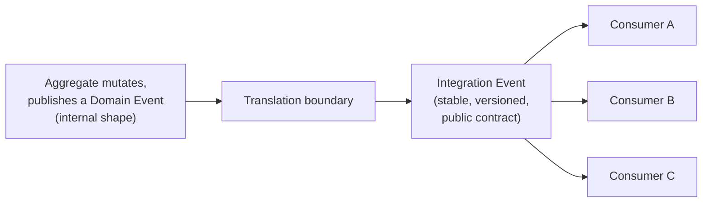
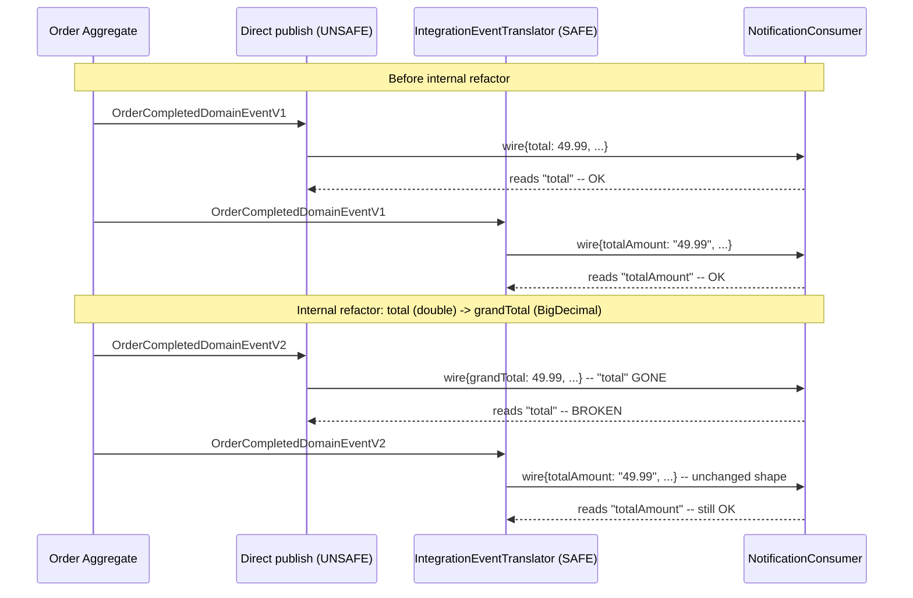

# Domain Events vs. Integration Events: Contract Boundaries and Translation

> **Topic register:** T-2426 · Advanced tier, Moderate-High interview frequency (new gap-audit topic — no entry in the original Master Topic Register)
> **Provenance:** all evidence in this chapter is real, executed output from
> [`practice/java/architecture/domain-events-vs-integration-events/`](../../practice/java/architecture/domain-events-vs-integration-events/README.md)
> (OpenJDK 21.0.12), fully deterministic (no timing, no randomness) — a
> real consumer genuinely breaks when a domain event is published
> directly and an internal refactor happens, and does not break when the
> same refactor is absorbed by a translated integration-event contract.

## Table of Contents

1. [Learning Objectives](#learning-objectives)
2. [Why This Matters in Interviews](#why-this-matters-in-interviews)
3. [Level 1 — Foundation](#level-1-foundation)
4. [Level 2 — Working Knowledge](#level-2-working-knowledge)
5. [Mental Model](#mental-model)
6. [Definition and Purpose](#definition-and-purpose)
7. [Core Concepts](#core-concepts)
8. [Internal Implementation](#internal-implementation)
9. [Diagrams](#diagrams)
10. [Production Scenarios](#production-scenarios)
11. [Trade-offs](#trade-offs)
12. [Decision Framework](#decision-framework)
13. [Common Mistakes](#common-mistakes)
14. [Anti-Patterns](#anti-patterns)
15. [Best Practices](#best-practices)
16. [Interview Answer Framework](#interview-answer-framework)
17. [Interview Questions](#interview-questions)
18. [Summary](#summary)
19. [Key Takeaways](#key-takeaways)
20. [Cheat Sheet](#cheat-sheet)
21. [Flashcards](#flashcards)
22. [Practice Exercises](#practice-exercises)
23. [Solutions](#solutions)
24. [Additional Reading](#additional-reading)
25. [Official References](#official-references)

---

## Learning Objectives

By the end of this chapter you can distinguish a domain event (internal, free to change with the domain model) from an integration event (a stable, versioned public contract), explain why publishing a domain event directly as an external message is a real architectural mistake, and cite a real Java demo proving a downstream consumer genuinely breaks when a domain event is published directly and an internal refactor happens — and does not break when the same refactor is absorbed by a translation boundary.

## Why This Matters in Interviews

[CQRS: Read/Write Separation](cqrs-read-write-separation.md) and [DDD Tactical Design — Aggregates](ddd-tactical-design-aggregates.md) both use "domain event" extensively — an aggregate publishes one describing what changed, a projector folds it into a read model — and [Event-Driven Architecture: Integration Styles](../09-messaging-event-driven/event-driven-architecture-integration-styles.md) covers publishing events across service boundaries. None of the three ever names the specific, common mistake that sits at their intersection: treating a domain event's internal shape as if it were also the public contract other services depend on. Interviewers ask about this because it's a real, frequently-made mistake with a real, delayed cost — it looks correct at first (why maintain two classes for "the same event"?) and only breaks once someone makes an unrelated, perfectly reasonable internal refactor and discovers, often in production, that three other teams' services were silently depending on the internal shape.

## Level 1 — Foundation

Think of a company's internal engineering design docs versus its public API documentation. The design docs can change freely — a team renames an internal variable, restructures a diagram, adds a note only they need — because only that team reads them and only that team needs them to stay stable. The public API documentation is a promise to everyone else: if a field disappears or gets renamed there, every external integration that reads it breaks, on a schedule the API owner doesn't control. A **domain event** is the design doc — free to reshape whenever the internal model does. An **integration event** is the public API documentation — a deliberate, stable promise, changed only on purpose, with everyone who depends on it in mind.



## Level 2 — Working Knowledge

At this level you should be able to name precisely what changes and what doesn't across this boundary. A domain event is scoped to the bounded context that raised it — it can reference internal value objects, use whatever types are convenient for the domain model (a `BigDecimal`, an enum, a nested entity reference), and is expected to change the moment the domain model does, because it's describing the domain model's own state transitions, not a contract with anyone external. An integration event is scoped to everyone *outside* that bounded context who needs to know the fact occurred — it should use simple, stable, self-describing types (a formatted string, a primitive, an ISO date string), be explicitly versioned, and change only through a deliberate compatibility process, never as a side effect of an unrelated internal refactor.

You should also be comfortable with the specific failure mode this produces when the boundary is skipped: a consuming service written against the domain event's *current* shape works fine — until the publishing team, with zero visibility into who's consuming their internal event, makes a perfectly reasonable internal change (renaming a field for clarity, changing a type for correctness, splitting one field into two) and breaks every downstream consumer simultaneously, with no warning and no versioning to fall back on.

## Mental Model

Treat this exactly like the [API Versioning](../07-api-design/api-versioning-strategies.md) discipline applied one layer earlier: a REST API's response DTO is deliberately not the same class as its internal entity, for the same reason a public integration event is deliberately not the same class as an internal domain event — an internal representation is free to change; anything published as a promise to someone else is not, and conflating the two means every internal refactor is secretly also a breaking public API change nobody reviewed as one.

## Definition and Purpose

A **domain event** is a message describing something that happened inside a bounded context, published for consumers *within* that same context (a projector building a read model, a saga coordinator, another aggregate) — its shape is owned by, and free to evolve with, the domain model that raised it. An **integration event** is a deliberately separate, stable, versioned message describing the same real-world fact, published specifically for consumers *outside* that bounded context — its shape is a contract, changed only through explicit compatibility discipline (see [Schema Registry and Compatibility Evolution](../09-messaging-event-driven/schema-registry-and-compatibility-evolution.md)). The **translation boundary** between them — a mapper, adapter, or anti-corruption layer — is what makes it possible for the internal model to evolve freely without every such change silently becoming a breaking external contract change.

## Core Concepts

### The same real-world fact can and should be represented two different ways

A common misconception treats "the event" as one thing with one true shape. In fact, "order completed" is a real-world fact; the *domain* event describing it and the *integration* event describing it are two separate, independently-evolvable representations of that same fact, built for two different audiences with two different stability requirements.

### Skipping the translation boundary is invisible until an internal refactor happens

This mistake doesn't fail code review or break a test the day it's introduced — publishing a domain event directly works correctly, today. The cost is deferred and delayed: it surfaces only once someone makes an internal-only change, with zero reason to suspect it's externally visible, and discovers downstream consumers were silently depending on internal representation details no one documented as a contract.

### The translation boundary is where internal-only fields get dropped, not just renamed

A well-built integration event doesn't just rename internal fields to stable public names — it deliberately excludes internal-only details that never should have been externally visible in the first place (this chapter's demo drops a `loyaltyPointsEarned` field the domain event carries but no external consumer has any business depending on), reducing the public contract's surface area to exactly what's actually being promised.

## Internal Implementation

**Real unsafe-vs-safe comparison** (`practice/java/architecture/domain-events-vs-integration-events/`) — a domain event published directly (`OrderCompletedDomainEventV1.publishDirectlyAsWireMessage()`), versus the same fact translated through a stable contract:

```java
// UNSAFE: the domain event's own internal fields become the wire message.
public Map<String, Object> publishDirectlyAsWireMessage() {
    Map<String, Object> wire = new HashMap<>();
    wire.put("orderId", orderId);
    wire.put("total", total);
    wire.put("customerId", customerId);
    return wire;
}
```

```java
// SAFE: a translation boundary absorbs the internal shape into a stable contract.
public static OrderCompletedIntegrationEvent translate(OrderCompletedDomainEventV2 domainEvent) {
    String formattedTotal = domainEvent.grandTotal.setScale(2, RoundingMode.HALF_UP).toString();
    // loyaltyPointsEarned is deliberately NOT carried onto the public contract.
    return new OrderCompletedIntegrationEvent(domainEvent.orderId, formattedTotal, domainEvent.customerId);
}
```

Real captured output (`practice/java/architecture/domain-events-vs-integration-events/output-transcript.txt`) — after a real internal refactor (`double total` → `BigDecimal grandTotal`, plus a new internal-only field):

```
=== UNSAFE: publishing the domain event directly as the wire message ===
  Before refactor, consumer reads field "total": Notification sent for order order-123: amount=49.99

  --- Internal refactor happens: double total -> BigDecimal grandTotal ---

  After refactor, consumer STILL asks for field "total" (its contract never changed):
  BROKEN, exactly as expected: Consumer expected field "total" but it was not present in the wire message. Actual fields present: [loyaltyPointsEarned, orderId, grandTotal, customerId]

=== SAFE: translating through a stable OrderCompletedIntegrationEvent contract ===
  Before refactor, consumer reads field "totalAmount": Notification sent for order order-123: amount=49.99
  After the SAME internal refactor, consumer reads field "totalAmount": Notification sent for order order-124: amount=49.99
```

Fully deterministic — no timing, no randomness — re-run confirmed byte-identical output.

## Diagrams



## Production Scenarios

**Symptoms.** A notification service's order-completion emails silently stop going out after an unrelated backend deploy — no errors in the publishing service's own logs, no alerts fired there. **Initial hypotheses.** A notification-service outage, or a message broker issue. **Evidence collected.** The notification service's own logs show deserialization failures starting exactly at the backend's deploy timestamp — a field it expects (`total`) is missing from every incoming message since that deploy. **Diagnosis.** The backend team refactored an internal domain event's field (for a legitimate, unrelated reason) and had been publishing that domain event directly as the integration message the whole time — they had no visibility into which other services depended on its exact shape, because there was never an explicit, tracked contract. **Immediate mitigation.** Roll back the backend deploy, or hot-patch the notification service to also accept the new field name. **Permanent remediation.** Introduce a real translation boundary: a stable, versioned integration event, with the backend team free to refactor the domain event's internal shape without it ever again becoming a breaking external change. **Trade-offs.** The translation layer is real, ongoing maintenance — every domain event field a consumer needs must be deliberately mapped, not automatically available. **Prevention.** Treat "is this event consumed outside this bounded context" as the deciding question for whether a translation boundary is required, before the first external consumer is onboarded, not after the first incident. **Interview lesson.** A candidate who names "was the domain event published directly, with no translation boundary" as the first diagnostic question — rather than assuming a broker or infra issue — demonstrates the exact architectural instinct this chapter exists to build.

## Trade-offs

Publishing domain events directly is less code today — no translator to write or maintain, no second class to keep in sync — at the real, deferred cost of turning every future internal refactor into an unreviewed, silent breaking change for anyone consuming it externally. A translation boundary costs real, ongoing maintenance (every field an external consumer needs must be deliberately mapped and kept in sync) in exchange for the internal domain model staying genuinely free to evolve without external coordination.

## Decision Framework

Skip a translation boundary only when an event genuinely has zero external consumers and no plan to gain one — even then, treat that as a decision to revisit the moment a first external consumer appears, not a permanent exemption. Introduce a translation boundary the moment any consumer sits outside the publishing bounded context, before that consumer is onboarded, and apply the same explicit versioning/compatibility discipline [Schema Registry and Compatibility Evolution](../09-messaging-event-driven/schema-registry-and-compatibility-evolution.md) covers for any other cross-service contract.

## Common Mistakes

Conceptual: treating "the event" as one shape with one true representation, rather than two deliberately separate ones for two different audiences. Conceptual: assuming a rename or type change is "just an internal refactor" without first checking whether the changed event is consumed externally. Communication: describing this pattern only as "extra boilerplate" without naming the real, deferred breaking-change risk it exists to prevent.

## Anti-Patterns

Publishing an aggregate's own domain event object directly onto a message broker as the external contract. Including internal-only fields (an internal audit field, a denormalized convenience value) on a public integration event just because they happened to be present on the domain event that inspired it. Treating an integration event's shape as freely renameable the same way an internal domain event is, without applying real compatibility discipline.

## Best Practices

Default to a translation boundary the moment an event crosses a bounded-context boundary, not just when a problem is first noticed. Keep integration events deliberately minimal — only the fields an external consumer actually needs, using stable, simple types. Apply real, tracked versioning to integration event contracts, the same discipline applied to any other public API. Let domain events stay exactly as internally-shaped and freely-evolvable as the domain model itself requires — the fix is never to make domain events more rigid, it's to stop treating them as if they were already the public contract.

## Interview Answer Framework

### 30-Second Answer

A domain event describes an internal state change, free to evolve with the domain model; an integration event is a separate, stable, versioned public contract describing the same fact for outside consumers. Publishing a domain event directly as the external message means every future internal refactor becomes a silent, unreviewed breaking change for anyone consuming it.

### 2-Minute Answer

Add: a real demo proves this directly — a consumer reading a domain-event-shaped field breaks the instant a real internal refactor happens (`total` → `grandTotal`), while the same consumer reading a translated integration event's stable field never notices the same refactor at all. The translation boundary is also where internal-only fields (this chapter's demo drops a `loyaltyPointsEarned` field) get deliberately excluded from the public contract.

### 10-Minute Deep Dive

Walk through the demo's real before/after evidence, then the production scenario — a real notification-service outage traced back to a domain event published directly, diagnosed by checking whether the failing field was ever a tracked, versioned contract. Connect to [Schema Registry and Compatibility Evolution](../09-messaging-event-driven/schema-registry-and-compatibility-evolution.md) for the ongoing compatibility discipline a real integration event contract needs once it exists, and to [API Versioning Strategies](../07-api-design/api-versioning-strategies.md) as the same discipline applied one layer earlier, to REST response DTOs versus internal entities.

### Whiteboard Explanation

Draw an aggregate publishing a domain event inside its own bounded-context box. Draw a translation boundary as a wall at the box's edge, with an integration event crossing it to multiple external consumer boxes. Circle the translation boundary and label it "this is what makes the inside free to change."

### Production Example

See Production Scenarios above: a notification service's silent outage traced to a domain event published directly, broken by a legitimate internal refactor with zero visibility into external consumers.

### Trade-offs to Mention

The translation layer's real ongoing maintenance cost versus the deferred, unreviewed breaking-change risk of skipping it; the judgment call of when an event genuinely has no external consumers yet, and the discipline needed to revisit that the moment one appears.

### Common Candidate Mistakes

Treating "the event" as a single shape rather than two deliberately separate representations. Describing the translation boundary as pure boilerplate without naming the specific risk it prevents. Assuming an internal refactor is automatically safe without checking whether the event crosses a bounded-context boundary.

### Typical Follow-Up Questions

"What's the actual difference in field types/shape you'd expect between a domain event and its integration event?" "How would you detect, today, whether a currently-internal domain event has picked up an external consumer without anyone deciding that on purpose?" "What would you version, and how, once an integration event contract exists?"

### Senior-Level Expectations

State the domain-event/integration-event distinction precisely and name the specific deferred-breaking-change risk of skipping the translation boundary, without being led to it.

### Staff-Level Discussion

Deciding which internal domain events need a translation boundary — and enforcing that decision organizationally (so a team can't accidentally gain an external consumer without anyone deciding to stabilize a contract) — is a real cross-team governance question, not just a code-review checklist item; Staff-level framing includes how a platform team would detect an undocumented external dependency on an internal event before it causes an incident, not just how to fix one after the fact.

## Interview Questions

### Question 1

**Question:** "Your team's aggregate publishes a domain event that another team's service has started consuming directly off the broker. Is that a problem, and if so, what would you do?"
**Why interviewers ask this:** Tests whether a candidate recognizes an undocumented external dependency on an internal representation as a real, specific risk, not just "coupling in general."
**Expected answer:** Yes — the other team is now depending on a shape your team never promised to keep stable; introduce a translation boundary and a real, versioned integration event, and migrate the consumer onto it.
**Minimum acceptable answer:** Recognizes this as a risk in general terms.
**Strong Senior answer:** Names the specific deferred-breaking-change mechanism and proposes the translation-boundary fix precisely.
**Staff-level extension:** Discusses how to detect this pattern organizationally (schema registry access logs, contract-testing coverage) before it causes an incident, not just how to remediate one instance.
**Common mistakes:** Treating it as acceptable since "it works today."
**Likely follow-ups:** "How would you migrate the existing consumer without breaking it during the transition?"
**Evaluation criteria (1–5):** 1: sees no problem. 3: recognizes the coupling risk generally. 5: names the specific mechanism and a concrete remediation plan.

### Question 2

**Question:** "Why might a domain event and its corresponding integration event legitimately have different fields, not just different names for the same fields?"
**Why interviewers ask this:** Tests whether a candidate understands the translation boundary as a deliberate filter, not just a renaming pass.
**Expected answer:** A domain event can carry internal-only details (audit fields, internal identifiers, convenience denormalizations) that no external consumer needs or should see; the integration event should deliberately exclude them, reducing the public contract to exactly what's being promised.
**Minimum acceptable answer:** States that internal fields shouldn't all be exposed externally.
**Strong Senior answer:** Gives a concrete example of a field that should be dropped, and explains why (this chapter's demo: `loyaltyPointsEarned`).
**Staff-level extension:** Connects this to minimizing public API surface area generally, and the cost of accidentally over-exposing internal detail that then becomes de facto load-bearing for external consumers.
**Common mistakes:** Assuming the translation boundary only renames fields, never drops them.
**Likely follow-ups:** "What would you do if you discovered an external consumer WAS already depending on one of those internal-only fields?"
**Evaluation criteria (1–5):** 1: assumes identical fields always. 3: states internal fields shouldn't all be exposed. 5: full filtering rationale with a concrete example.

## Summary

A domain event and an integration event describe the same real-world fact for two different audiences with two different stability requirements — the domain event is free to evolve with the internal model; the integration event is a deliberate, stable, versioned public contract. Skipping the translation boundary between them works correctly today and breaks silently, later, the moment a reasonable internal refactor happens. This chapter closes a real gap: three existing chapters (CQRS, DDD Tactical, Event-Driven Architecture) all use "domain event" and "event" extensively without ever naming this specific, commonly-made mistake.

## Key Takeaways

- A domain event is internal and free to evolve; an integration event is a stable, versioned public contract for external consumers.
- Publishing a domain event directly as the external message works today and breaks later, silently, on the first unrelated internal refactor.
- A real demo proved this directly: a consumer reading a domain event's field broke after a real internal refactor; the same consumer reading a translated integration event's field did not.
- The translation boundary should deliberately drop internal-only fields, not just rename the ones that survive.
- Treat "does this event have external consumers" as the deciding question for whether a translation boundary is needed, before the first external consumer is onboarded.

## Cheat Sheet

**Mental model:** domain event = internal design doc (free to change); integration event = public API documentation (a stable promise).
**Domain event:** internal shape, evolves with the domain model, scoped to consumers inside the same bounded context.
**Integration event:** stable, versioned, minimal public contract, scoped to consumers outside the bounded context.
**The mistake:** publishing a domain event directly as the external message — works today, breaks on the next unrelated internal refactor.
**Real demo result:** consumer reading `"total"` off a direct domain-event publish broke after a real refactor; consumer reading `"totalAmount"` off a translated integration event did not.
**Related:** [CQRS](cqrs-read-write-separation.md) · [DDD Tactical Design](ddd-tactical-design-aggregates.md) · [Event-Driven Architecture](../09-messaging-event-driven/event-driven-architecture-integration-styles.md)

## Flashcards

See [`flashcards/domain-events-vs-integration-events.md`](../../flashcards/domain-events-vs-integration-events.md).

## Practice Exercises

1. Add a third domain event version (`OrderCompletedDomainEventV3`) that splits `customerId` into a `customerId` and a separate `customerRegion`, and extend `IntegrationEventTranslator` to keep `OrderCompletedIntegrationEvent`'s shape unchanged. Confirm the existing consumer still passes without modification.
2. Modify the unsafe path to catch the consumer's exception and fall back to a default value instead of failing loudly, and explain in a comment why this "fix" is actually worse than the loud failure — it silently produces a plausible-looking wrong notification instead of surfacing the contract break.

## Solutions

Exercise 1: `IntegrationEventTranslator.translate(OrderCompletedDomainEventV3)` would combine `customerId` and `customerRegion` into the same `customerId` field the contract already exposes (or deliberately decide NOT to expose the new `customerRegion` at all) — either way, `NotificationConsumer` needs zero changes, directly demonstrating the translation boundary absorbing a THIRD internal reshaping. Exercise 2: silently defaulting a missing field produces a real, wrong notification (e.g., "amount=$0.00" sent to a customer) that looks superficially successful — strictly worse than a loud failure, because it corrupts real business-facing output instead of alerting anyone that the contract broke.

## Additional Reading

Martin Fowler's Domain Event pattern write-up (linked below) is the original source for the domain-event concept this chapter builds on; microservices.io's Domain Event pattern page covers the same distinction from an explicitly microservices-integration angle.

## Official References

- [Martin Fowler — Domain Event](https://martinfowler.com/eaaDev/DomainEvent.html)
- [microservices.io — Domain Event pattern](https://microservices.io/patterns/data/domain-event.html)
