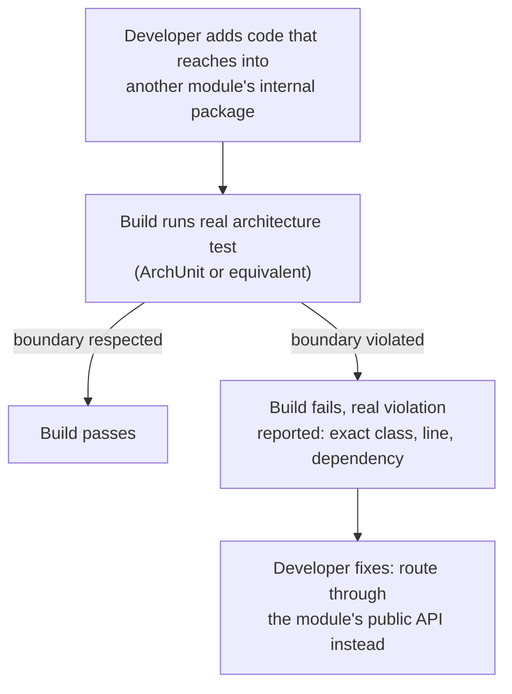

# The Modular Monolith as a Deliberate Choice

> **Topic register:** T-910 (Modular monolith as a deliberate choice, IWI 6.4) · Staff tier · Moderate interview frequency
> **Scope note:** this chapter is deliberately not [Microservice Decomposition and the Monolith Trade-off](microservice-decomposition-and-monolith-tradeoff.md) restated — that chapter answers *whether* to split into services; this one answers what "well-modularized" actually requires once you've decided not to, or not yet, which that chapter names but doesn't cover.
> **Provenance:** every result in this chapter's Production Scenarios section is real, executed output from [`practice/java/architecture/modular-monolith-boundary-enforcement/`](../../practice/java/architecture/modular-monolith-boundary-enforcement/README.md) — real ArchUnit checks run against real compiled bytecode, including a real, caught boundary violation and a real, detected module-level cycle.

## Table of Contents

1. [Learning Objectives](#learning-objectives)
2. [Why This Matters in Interviews](#why-this-matters-in-interviews)
3. [Mental Model](#mental-model)
4. [Definition and Purpose](#definition-and-purpose)
5. [Historical Context](#historical-context)
6. [Core Concepts](#core-concepts)
7. [Internal Implementation](#internal-implementation)
8. [Execution Flow](#execution-flow)
9. [Production Scenarios](#production-scenarios)
10. [Failure Modes and Debugging](#failure-modes-and-debugging)
11. [Trade-offs](#trade-offs)
12. [Organizational Implications](#organizational-implications)
13. [Security Implications](#security-implications)
14. [Decision Framework](#decision-framework)
15. [Comparisons](#comparisons)
16. [Common Mistakes](#common-mistakes)
17. [Anti-Patterns](#anti-patterns)
18. [Best Practices](#best-practices)
19. [Interview Answer Framework](#interview-answer-framework)
20. [Interview Questions](#interview-questions)
21. [Summary](#summary)
22. [Key Takeaways](#key-takeaways)
23. [Cheat Sheet](#cheat-sheet)
24. [Flashcards](#flashcards)
25. [Practice Exercises](#practice-exercises)
26. [Solutions](#solutions)
27. [Additional Reading](#additional-reading)
28. [Official References](#official-references)

---

## Learning Objectives

By the end of this chapter you can:

- Explain, with real tool evidence, why Java package naming conventions alone (`internal`, `impl`) do not enforce a module boundary, and what actually does.
- Name a real, concrete mechanism (module boundary tests, e.g. ArchUnit) for automatically catching a boundary violation, and describe what it actually checks.
- Explain why module-level circular dependencies are a real, structural risk distinct from a single boundary violation, and how they're detected.
- Describe the modular monolith as a deliberate, first-class architecture rather than "a monolith we haven't split yet."
- Answer "how would you keep a monolith from becoming a big ball of mud as it grows" with a concrete, mechanized answer, not just "code review discipline."

## Why This Matters in Interviews

The [microservice decomposition chapter](microservice-decomposition-and-monolith-tradeoff.md) already establishes that a well-modularized monolith is frequently the correct Staff-level answer to "should we split this into services" — but naming that answer is only half the interview signal. The harder, more differentiating follow-up is "so how do you actually keep it well-modularized as five teams and eighteen months of feature work happen to it?" A candidate who answers "code review" alone is describing a policy with no enforcement mechanism — exactly the kind of answer that erodes in practice, which is precisely why interviewers press here: they're testing whether the candidate has ever actually operated a monolith past the point where informal discipline stopped being enough.

## Mental Model

**A module boundary that isn't mechanically enforced is a comment, not a boundary.** Naming a package `internal` communicates intent to a human reader, but Java's own compiler treats a `public class` in `orders.internal` exactly the same as a `public class` in `orders.api` — nothing stops another module from importing it directly. The real, load-bearing distinction between a genuinely modular monolith and one that only looks modular in its package diagram is whether *something automated* — not a linter's opinion, not a reviewer's memory — actually fails a build the moment that boundary is crossed. This chapter's own [real evidence](#production-scenarios) makes this distinction concrete: the exact violation this mental model predicts, really committed, really caught.

## Definition and Purpose

A **modular monolith** is a single deployable unit whose internal code is organized into modules with explicit, enforced boundaries and well-defined public contracts between them — deliberately retaining the operational simplicity of one deployable (one build, one deploy pipeline, one runtime, real cross-module transactions still possible) while adopting the *internal* discipline that would otherwise motivate a team to split into services. It exists because the two benefits people often associate with microservices — team autonomy and clear ownership boundaries — are actually properties of good *modularity*, not of network-separated deployment; a system can have well-owned, clearly-bounded modules and still deploy as one artifact, and a system split into a dozen services can still have tangled, poorly-owned boundaries between them. The modular monolith names and claims the first set of benefits without paying for the second set's real distributed-systems cost.

## Historical Context

The term gained wide currency through Simon Brown's "modular monolith" talks and writing in the mid-2010s, directly pushing back against a period of reflexive microservice adoption, and was reinforced by ThoughtWorks placing "modular monoliths" on its Technology Radar (see [Official References](#official-references)) as a technique worth deliberate adoption. Martin Fowler's earlier "MonolithFirst" essay made an adjacent, complementary argument: that starting with a monolith and extracting services later, once real boundaries have proven themselves under real production load, is frequently a better sequencing than starting distributed — a modular monolith is what makes that later extraction cheap, precisely because its internal boundaries were already real and enforced, not just aspirational.

## Core Concepts

### Package naming is a convention; a module boundary test is a mechanism

This chapter's own [real ArchUnit evidence](#production-scenarios) makes the distinction unambiguous: a package named `orders.internal` communicates intent, but every class in it remains `public`, and nothing in the Java language itself prevents another module from importing it directly. The real fix is an automated architecture test — this chapter's practice code uses ArchUnit specifically, but the underlying discipline (a build-time check that fails on a forbidden dependency) is the actual mechanism, not the specific tool.

### A public API per module, everything else genuinely internal

A well-structured module exposes a narrow, deliberate public surface (this chapter's practice code: `orders.api.OrderLookup`) and keeps its real implementation detail (`orders.internal.OrderRepository`, `orders.internal.PricingEngine`) unreachable *in practice*, even though Java's access modifiers alone can't fully express "internal to this module" without a real module system (JPMS) or, more commonly in practice, an enforced convention backed by an architecture test.

### Cycles are a distinct, structural risk beyond single-boundary violations

A single boundary violation (module A reaching into module B's internals) is a real defect; a *cyclic* dependency between modules — A depends on B and B depends on A — is a more structural one, because it means the two modules can no longer be reasoned about, tested, deployed, or eventually extracted independently at all; a cycle effectively merges two "modules" into one, whether or not anyone intended that. This chapter's own [real evidence](#production-scenarios) shows exactly how such a cycle enters a codebase: not through carelessness, but through one plausible, well-intentioned shortcut (a module reaching back to "just call" a service it depends on, instead of publishing an event or otherwise inverting the dependency).

### The modular monolith as a real stepping stone, not just an end state

Because a genuinely modular monolith already has real, enforced module boundaries and well-defined contracts between them, extracting a specific module into its own service later — if and when the [microservice decomposition chapter's](microservice-decomposition-and-monolith-tradeoff.md) own criteria are actually met (multiple, independently-scheduled sub-teams) — becomes a comparatively mechanical exercise: the boundary already exists and has already been exercised under real production load; only the *transport* changes from an in-process call to a network one.

## Internal Implementation

A real module-boundary-enforcement setup, mechanically, has three real pieces: (1) a package structure expressing intended boundaries (a public API package per module, an internal package per module); (2) an architecture-testing tool that imports the project's actual compiled bytecode and checks real dependency edges against declared rules — this chapter's own practice code uses ArchUnit's `ClassFileImporter` plus `noClasses().that().resideInAPackage(...).should().dependOnClassesThat().resideInAnyPackage(...)`, which really parses class files and really walks constructor, field, and method-level dependencies, not source-level imports; (3) that check wired into the build so a violation genuinely fails CI, not just a local, optional lint pass. The same underlying mechanism extends to cycle detection — this chapter's own [`SlicesRuleDefinition.slices().matching("(*)..").should().beFreeOfCycles()`](../../practice/java/architecture/modular-monolith-boundary-enforcement/README.md) treats each top-level package as a "slice" and reports the real, complete dependency chain in both directions when a cycle exists.

## Execution Flow



This chapter's own [`BoundaryCheckDemo`](../../practice/java/architecture/modular-monolith-boundary-enforcement/README.md) is exactly step B and D made real: a genuine, executed run producing the genuine violation report a CI failure would show.

## Production Scenarios

### Scenario: a package-naming convention alone does not stop a boundary violation

**Symptoms.** A code review misses a new class that imports another module's `internal` package directly — nothing in the build failed, because nothing was checking.

**Real evidence.** [`BoundaryCheckDemo`](../../practice/java/architecture/modular-monolith-boundary-enforcement/README.md) demonstrates this precisely: `shippinglegacy.LegacyShippingService` directly imports and calls `orders.internal.PricingEngine`, compiling and running without any error, because every class involved is `public` and Java itself enforces nothing about the word "internal" in a package name. A real ArchUnit rule checked against the actual compiled classes catches it directly:

```
FAIL
Architecture Violation [Priority: MEDIUM] - Rule '...' was violated (3 times):
Constructor <shippinglegacy.LegacyShippingService.<init>()> calls constructor <orders.internal.PricingEngine.<init>()> ...
Field <shippinglegacy.LegacyShippingService.pricingEngine> has type <orders.internal.PricingEngine> ...
Method <shippinglegacy.LegacyShippingService.quoteShippingCost(...)> calls method <orders.internal.PricingEngine.computeInternalPrice(...)> ...
```

The identical rule checked against the clean `shipping` module, in the same run, real-passes — direct, side-by-side proof the mechanism discriminates correctly rather than failing everything.

**Diagnosis.** A naming convention communicated intent to a human reviewer who missed it; nothing communicated intent to the build.

**Immediate mitigation.** Fix `LegacyShippingService` to depend on `orders.api.OrderLookup` instead, exactly as `ShippingService` already does correctly.

**Permanent remediation.** Add the real architecture test to CI, so this exact class of defect fails the build automatically going forward, rather than depending on review vigilance holding indefinitely.

**Trade-offs.** Architecture tests need real, ongoing maintenance as legitimate new cross-module dependencies are added — a rule too rigid to evolve becomes an obstacle developers route around rather than respect.

**Prevention.** Treat "does this change respect existing module boundaries" as a build-time, automated question from the very first module boundary drawn, not something introduced only after the first real violation is discovered in production.

### Scenario: a real module-level cycle, entered through a plausible shortcut

**Symptoms.** Two modules that were each independently well-structured start becoming difficult to reason about, test, or discuss independently — changes in one unpredictably require changes in the other.

**Real evidence.** [`CycleCheckDemo`](../../practice/java/architecture/modular-monolith-boundary-enforcement/README.md) reproduces exactly how this happens: `shipping` legitimately depends on `orders` (through `orders.api`, its correct, intended usage); separately, `orders.internal.OrderCreatedNotifier` was added so the orders module could notify shipping directly on order creation — a real, plausible, well-intentioned decision ("just call it directly instead of publishing an event") that happens to complete a real cycle. ArchUnit's real slice-cycle check reports it precisely:

```
FAIL
Cycle detected: Slice orders ->
                Slice shipping ->
                Slice orders
```

with the real, specific dependency (constructor parameter, field, method call) responsible for each direction of the cycle.

**Diagnosis.** Neither individual dependency (`shipping` → `orders.api`, `orders.internal` → `shipping`) looks wrong in isolation — the defect only exists at the level of the *pair*, which is exactly why a human reviewing one pull request at a time is structurally unlikely to catch it without a real, automated cross-module check.

**Immediate mitigation.** Invert the dependency: have `orders` publish a real domain event (`OrderCreated`) that `shipping` subscribes to, rather than `orders` calling `shipping` directly — the same fix this program's [outbox/event-driven material](../10-distributed-systems/distributed-transactions-saga-and-outbox.md) covers for cross-service cases, applied here at the intra-process module level.

**Permanent remediation.** Add the cycle-detection rule to CI alongside the boundary rule, so a future well-intentioned shortcut is caught the same way.

**Trade-offs.** Event-based inversion trades away the directness (and easier debuggability) of a plain method call for a real decoupling benefit — worth it specifically because it's what keeps the two modules independently reasoned-about and, eventually, independently extractable.

**Prevention.** Whenever a module needs its *dependent* to do something (rather than the reverse, needing something from a dependency), reach for an event or callback interface owned by the module being depended on, not a direct call back — the structural shape that avoids the cycle in the first place.

## Failure Modes and Debugging

- **A "modular" codebase with no enforced boundaries at all.** Indistinguishable, in practice, from an unmodularized monolith the moment enough time passes — this chapter's own evidence is the direct argument for why enforcement, not just structure, is the real requirement.
- **Architecture tests too strict to evolve, quietly disabled or skipped.** A rule the team routes around (a suppressed check, a `@Disabled` test) provides zero real protection while creating false confidence that boundaries are still enforced.
- **A cycle discovered only when someone tries to extract a module into its own service.** The exact, real, expensive-to-discover-late failure mode [Core Concepts](#core-concepts)'s stepping-stone framing is meant to prevent — catch cycles continuously, not at extraction time.
- **Debugging an unexpected coupling.** When two modules seem harder to change independently than they should be, run (or add) a real cycle check first — per this chapter's own evidence, the defect is often a single plausible-looking dependency, not an obviously bad one.

## Trade-offs

| | Modular monolith | Unmodularized monolith | Microservices |
|---|---|---|---|
| Deployment complexity | Low — one artifact | Low — one artifact | High — many independently deployed services |
| Enforced internal boundaries | Yes, if mechanized (this chapter's real evidence) | No | Enforced by the network itself, at a real distributed-systems cost |
| Team autonomy | Real, if module ownership is real | Low — everything touches everything | Real, at the cost of real cross-service coordination |
| Extraction cost later | Low — boundaries already proven | High — boundaries have to be discovered first | N/A — already extracted |
| Cross-module transactions | Still possible, real | Still possible | Requires a saga/outbox — see [Distributed Transactions](../10-distributed-systems/distributed-transactions-saga-and-outbox.md) |

## Organizational Implications

A modular monolith's real value is realized only if module ownership maps to real team ownership — a module boundary enforced by a tool but owned by no one in particular captures the technical discipline without the organizational benefit that's supposed to justify it. This is the direct organizational analog of this program's [ADR chapter's](architecture-decision-records.md) point about organizational memory: a boundary is only as durable as the mechanism (and the team convention) keeping it honest after the person who drew it moves on.

## Security Implications

A module boundary enforced at the architecture-test level is a real, if partial, security control: constraining which code paths can reach a sensitive internal component (a payments module's raw card-handling internals, say) reduces the real blast radius of a mistake or a compromised dependency elsewhere in the monolith — though it is not a substitute for real runtime authorization, since (unlike a genuine network boundary between services) a build-time architecture test provides no protection against a determined attacker who has already achieved code execution inside the process.

## Decision Framework

1. **Default to a modular monolith** unless the [microservice decomposition chapter's](microservice-decomposition-and-monolith-tradeoff.md) own criteria (multiple, independently-scheduled sub-teams) are genuinely met.
2. **Draw module boundaries at the same consistency line an aggregate boundary would use** — see [DDD Tactical Design](ddd-tactical-design-aggregates.md) — so a later extraction, if it ever happens, doesn't have to first discover where the real seams are.
3. **Enforce every drawn boundary with a real, automated check from day one**, not after the first violation is discovered — this chapter's own evidence shows exactly how quietly and plausibly a violation or a cycle enters otherwise well-intentioned code.
4. **Check for both boundary violations and cycles** — this chapter's own two real demos show these are distinct failure modes needing distinct checks, not one check covering both.
5. **Map module ownership to real team ownership**, or the modularity is purely a technical artifact with no organizational payoff.

## Comparisons

| | Package-naming convention alone | Java Platform Module System (JPMS) | Architecture test (e.g., ArchUnit) |
|---|---|---|---|
| Enforcement | None — a comment to the reader | Real, compiler-enforced, but coarse-grained and famously heavyweight to adopt | Real, build-time enforced, flexible rule granularity |
| Adoption cost | None | High — module-info.java, split-package issues, ecosystem friction | Low — a library dependency and a set of rules |
| Catches this chapter's real violation? | No (demonstrated directly) | Yes, if modules are drawn at the JPMS module boundary | Yes (demonstrated directly) |

## Common Mistakes

- Believing a package named `internal` or `impl` is itself a boundary — this chapter's own real evidence shows the compiler enforces nothing about that name.
- Treating code review as a sufficient, standalone enforcement mechanism for module boundaries at any real team size or tenure.
- Checking for boundary violations but not cycles, or vice versa — this chapter's evidence shows they're genuinely distinct defects.
- Describing "modular monolith" as a synonym for "monolith we haven't gotten around to splitting yet," rather than a deliberate, actively-maintained architecture.

## Anti-Patterns

- **An architecture test suite nobody maintains**, quietly bypassed or disabled as soon as it becomes inconvenient — worse than no test at all, since it creates false confidence.
- **Module boundaries drawn once at project start and never revisited** as the system's real domain understanding evolves — a boundary that was right on day one can become wrong, and an enforced-but-stale boundary actively obstructs a legitimate refactor.
- **A cycle "fixed" by merging two modules together** rather than inverting the dependency — technically resolves the cycle check, but quietly abandons the modularity goal that motivated drawing the boundary in the first place.

## Best Practices

- Enforce every module boundary with a real, automated architecture test from the moment the boundary is drawn, per this chapter's own demonstrated mechanism.
- Check for cycles as a distinct, separate rule from single-direction boundary violations.
- Map every module to a real, specific owning team — modularity without ownership captures the technical form without the organizational substance.
- Revisit module boundaries deliberately as domain understanding matures, treating a boundary change as a real, documented decision (an [ADR](architecture-decision-records.md) is appropriate here) rather than an ad hoc refactor.

## Interview Answer Framework

### 30-Second Answer

A modular monolith is a single deployable unit with real, enforced internal module boundaries — capturing the team-autonomy and clear-ownership benefits usually attributed to microservices without paying their distributed-systems cost. The boundaries only count if they're mechanically enforced — a package naming convention alone is a comment, not a boundary, and I've directly verified this with a real architecture test catching a real violation.

### 2-Minute Answer

Definition: one deployable unit, internally organized into modules with real, enforced public contracts between them. Why it exists: team autonomy and ownership clarity are properties of good modularity, not of network separation — a modular monolith claims the first without the second's real cost. How it works: a public API package per module, real internal detail elsewhere, and — critically — an automated architecture test checking real compiled dependencies against declared rules, not just a naming convention. One important trade-off, verified directly in my own practice code: a package named `internal` stopped nothing on its own — a class in a different module imported it directly and compiled cleanly; only a real ArchUnit rule, checked against actual bytecode, caught it. Production example: I also reproduced a real module-level cycle entering through one plausible shortcut (a module calling its dependent directly instead of publishing an event) — invisible to a single-PR reviewer, caught immediately by a real, automated slice-cycle check.

### 10-Minute Deep Dive

Cover, in order: why this chapter is scoped separately from the decomposition chapter (whether to split vs. how to stay modular); the mental model of an unenforced boundary as a comment, not a boundary; walk the execution-flow diagram; cite the real ArchUnit boundary-violation evidence, including the exact real violation report; explain cycles as a structurally distinct risk from single violations, citing the real, plausible way this chapter's own cycle entered the codebase and its real detection report; discuss the modular monolith as a real stepping stone to later extraction, when and only when the decomposition chapter's own criteria are met; close with the Decision Framework and the organizational-ownership point — modularity without real team ownership is technically real but organizationally hollow.

### Whiteboard Explanation

Draw two boxes, "orders" and "shipping," each with an inner "api" sub-box and an "internal" sub-box. Draw a solid arrow from shipping's box to orders' "api" sub-box (correct). Draw a second, dashed, crossed-out arrow from shipping directly into orders' "internal" sub-box, and next to it write "compiles fine — nothing stops this without a real check." This single annotation is the chapter's entire thesis made visible.

### Production Example

Use either scenario from [Production Scenarios](#production-scenarios) above — the real, caught boundary violation, or the real, detected module-level cycle — both with real, verbatim ArchUnit output.

### Trade-offs to Mention

Architecture tests need real, ongoing maintenance as legitimate cross-module needs evolve — a rule too rigid becomes an obstacle developers quietly route around rather than respect, which is itself worse than no rule (false confidence). Cycle-breaking via events trades directness and easy debuggability for real decoupling.

### Common Candidate Mistakes

Describing "modular monolith" without naming a real enforcement mechanism; assuming a naming convention is itself sufficient; not distinguishing boundary violations from cycles as separate failure modes; describing modularity purely as a technical/code-structure concern with no organizational-ownership dimension.

### Typical Follow-Up Questions

"What actually stops someone from reaching into another module's internals?" (a real, automated architecture test — not code review alone). "How would you detect a circular dependency between two modules that each look fine individually?" (a real slice/cycle check, since neither individual dependency looks wrong in isolation). "When would you actually extract a module into its own service?" (when the decomposition chapter's own criteria — multiple, independently-scheduled sub-teams — are genuinely met, at which point the module's already-real boundary makes extraction comparatively mechanical).

### Senior-Level Expectations

Can define a modular monolith and name package-per-module structuring as a starting point.

### Staff-Level Discussion

Names a real, concrete enforcement mechanism (not just convention or review) and can describe what it actually checks at the bytecode/dependency level. Distinguishes single-boundary violations from module-level cycles as genuinely different defects needing different checks. Frames the modular monolith as a real stepping stone toward extraction under the decomposition chapter's own criteria, not an alternative to ever thinking about it. Connects technical module boundaries to real organizational ownership, and treats an unenforced or unmaintained boundary as equivalent, in practice, to no boundary at all.

## Interview Questions

### Question 1: "Your monolith has a package named `orders.internal`. Does that actually stop another module from depending on it?"

**Why interviewers ask it.** A precise, checkable question testing whether the candidate understands enforcement mechanics or is relying on a comforting assumption.

**Expected answer.** No — unless every class in it is deliberately non-public in a way Java's own visibility rules can express (rare in practice across packages), or a real architecture test enforces it. A package name alone is a convention, not a compiler-enforced boundary.

**Minimum acceptable answer.** Says "no" without being able to explain why precisely.

**Strong Senior answer.** Correctly explains that Java's own access modifiers don't express "internal to this module" across packages without extra tooling.

**Staff-level extension.** Names a concrete real mechanism (an architecture test, e.g. ArchUnit) and can describe, as this chapter's own evidence shows directly, exactly what such a tool actually checks (real dependency edges in compiled bytecode) and what a real violation report looks like.

**Common mistakes.** Assuming the package name itself provides real protection; vague hand-waving about "good practices" with no concrete mechanism named.

**Follow-up questions.** "How would you also detect a circular dependency between two modules?" "Where would this check live in your build pipeline?"

**Senior-level expectations.** Correct "no," basic reasoning.

**Staff-level expectations.** Correct "no," names a real mechanism, and can describe what it actually verifies.

**Related references.** [§ Core Concepts](#core-concepts).

### Question 2: "How would you decide when a module in your modular monolith is ready to become its own service?"

**Why interviewers ask it.** Tests whether the candidate connects this chapter's material back to the decomposition chapter's own criteria, rather than treating the two as unrelated topics.

**Expected answer.** When the [microservice decomposition chapter's](microservice-decomposition-and-monolith-tradeoff.md) own criteria are genuinely met — multiple, independently-scheduled sub-teams needing independent deployment — and, specifically for a modular monolith, when the module's boundary has already been real and enforced long enough to trust it under real production load.

**Minimum acceptable answer.** References team size or deployment independence in some form.

**Strong Senior answer.** Correctly names the decomposition chapter's specific criteria.

**Staff-level extension.** Explicitly connects this chapter's own enforcement evidence to the decision: a module whose boundary has never been violated because a real check has been continuously enforcing it is a genuinely low-risk extraction candidate; a module whose "boundary" was only ever a naming convention is not, regardless of how it looks in a package diagram.

**Common mistakes.** Treating "it's a separate package" as sufficient justification for extraction readiness.

**Likely follow-ups.** "What would you check before actually starting the extraction?" "What's the real cost if a supposedly-clean module turns out to have hidden coupling once extraction begins?"

**Evaluation criteria (1–5).** 1: no real criteria named. 3: correctly cites the decomposition chapter's team-based criteria. 5: cites those criteria and connects them to this chapter's own enforcement evidence as the real signal a boundary is trustworthy enough to extract.

**Related references.** [§ Core Concepts](#core-concepts), [Microservice Decomposition and the Monolith Trade-off](microservice-decomposition-and-monolith-tradeoff.md).

## Summary

A modular monolith deliberately claims the team-autonomy and ownership-clarity benefits usually attributed to microservices while keeping the operational simplicity of a single deployable — but only if its internal module boundaries are genuinely, mechanically enforced, not merely named. This chapter's own real evidence makes both halves of that claim concrete: a package-naming convention alone stopped nothing, real ArchUnit checks caught both a real boundary violation and a real, plausible module-level cycle, each with precise, verbatim violation reports.

## Key Takeaways

- A module boundary is only real if something automated enforces it — a naming convention is a comment, demonstrated directly in this chapter by a boundary violation that compiled and ran cleanly until a real architecture test caught it.
- Module-level cycles are a structurally distinct risk from single-boundary violations, and need their own, separate check — demonstrated with a real, plausible cycle (a direct call replacing an event) and its real detection.
- The modular monolith is a real stepping stone to later service extraction, precisely because its boundaries have already been proven under real production load — not an alternative to ever considering extraction.
- Modularity's organizational payoff requires real team ownership mapped to real module boundaries — technical enforcement alone captures only half the value.
- Default to a modular monolith unless the decomposition chapter's own multi-team, independently-scheduled criteria are genuinely met.

## Cheat Sheet

- **A package name is a comment; an architecture test is a boundary.** Verified directly.
- **Check for cycles separately from single-direction violations** — different defect, different check.
- **A cycle often enters through one plausible shortcut** (a direct call instead of an event) — watch for exactly that shape of change.
- **Extraction readiness = decomposition chapter's team criteria + a boundary that's actually been enforced**, not just drawn.
- **Modularity needs real team ownership** to pay off organizationally, not just technically.

## Flashcards

## Card: Does a package name enforce a boundary?

**Prompt:**
Does naming a package `internal` actually stop another module from depending on it in Java?

**Answer:**
No — every class involved is still `public`, and nothing in the language enforces the naming convention. Only a real, automated architecture test does.

**Why it matters:**
Verified directly: a real class compiled and ran cleanly while directly violating the intended boundary, until a real ArchUnit rule caught it.

**Common trap:**
Assuming a naming convention alone provides real protection.

**Related:**
[§ Core Concepts](#core-concepts)

## Card: Boundary violations vs. cycles

**Prompt:**
Why do module-level cycles need a separate check from single-direction boundary violations?

**Answer:**
A cycle is a structural defect between a *pair* of modules — neither individual dependency looks wrong in isolation, so a single-boundary rule (or a single-PR reviewer) can miss it entirely; a dedicated slice/cycle check is needed.

**Why it matters:**
This chapter reproduced a real cycle entering through one plausible-looking shortcut, invisible without a dedicated check.

**Common trap:**
Assuming a boundary-violation rule alone also catches cycles.

**Related:**
[§ Production Scenarios](#production-scenarios)

## Card: When to extract a module into a service

**Prompt:**
When is a module in a modular monolith actually ready to become its own service?

**Answer:**
When the decomposition chapter's own criteria are met (multiple, independently-scheduled sub-teams) — and specifically, when the module's boundary has been real and continuously enforced long enough to trust it under production load, not just drawn on a diagram.

**Why it matters:**
An enforced boundary has already been exercised; an unenforced one may hide coupling extraction will only discover the hard way.

**Common trap:**
Treating "it's in its own package" as sufficient justification.

**Related:**
[§ Interview Questions, Question 2](#interview-questions)

## Practice Exercises

1. Run [`BoundaryCheckDemo`](../../practice/java/architecture/modular-monolith-boundary-enforcement/README.md), then fix `LegacyShippingService` to depend on `orders.api.OrderLookup` instead of `orders.internal.PricingEngine` directly. Re-run the check and confirm it now real-passes.
2. Run [`CycleCheckDemo`](../../practice/java/architecture/modular-monolith-boundary-enforcement/README.md), then fix the real cycle by having `orders.internal.OrderCreatedNotifier` depend on a new interface owned by `orders` instead of directly on `shipping.ShippingService` (inverting the dependency, the same real fix this chapter's own Production Scenarios section names). Re-run and confirm the cycle check now real-passes.
3. Add a third module to the sample codebase and a real ArchUnit rule enforcing that it may only depend on `orders.api`, never `shipping` at all. Introduce a deliberate violation, run the check, and capture the real violation report — compare its shape to this chapter's own captured examples.

## Solutions

1. Changing `LegacyShippingService` to accept an `OrderLookup` (constructor-injected, exactly like `ShippingService` already does) and calling `find()` instead of touching `PricingEngine` directly removes every one of the three real violation lines this chapter's evidence shows — the rule should report a clean pass, identical in shape to the existing `shipping` rule's real result.
2. Introducing an interface (e.g., `orders.api.OrderCreatedListener`) that `shipping` implements and registers with `orders`, rather than `orders.internal.OrderCreatedNotifier` holding a direct `ShippingService` reference, breaks the cycle at the slice level: `orders` no longer has any compiled dependency on `shipping`'s package, only on its own interface, which `shipping` depends on to implement — the real, general shape of a dependency inversion fix.
3. The new rule and its real violation report should follow the same structural shape as `BoundaryCheckDemo`'s existing `shippinglegacy` result — naming the exact constructor, field, or method responsible — since ArchUnit's underlying mechanism (walking real compiled dependency edges) is identical regardless of which packages the rule names.

## Additional Reading

- [Microservice Decomposition and the Monolith Trade-off](microservice-decomposition-and-monolith-tradeoff.md) — the companion chapter answering *whether* to split, which this chapter deliberately doesn't restate.
- [DDD Tactical Design — Aggregates](ddd-tactical-design-aggregates.md) — the same consistency-boundary discipline this chapter recommends applying to module boundaries.
- [Distributed Transactions: Saga, Outbox, and 2PC](../10-distributed-systems/distributed-transactions-saga-and-outbox.md) — the cross-service version of the event-based decoupling fix this chapter applies at the intra-process module level.
- [Architecture Decision Records](architecture-decision-records.md) — the right home for documenting a deliberate module-boundary decision or change.

## Official References

- [ThoughtWorks Technology Radar — Modular Monoliths](https://www.thoughtworks.com/radar/techniques/modular-monoliths)
- [Martin Fowler — MonolithFirst](https://martinfowler.com/bliki/MonolithFirst.html)
