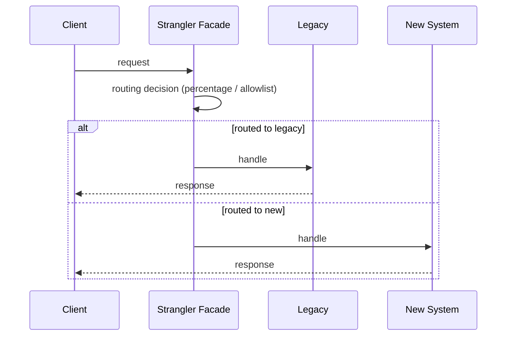
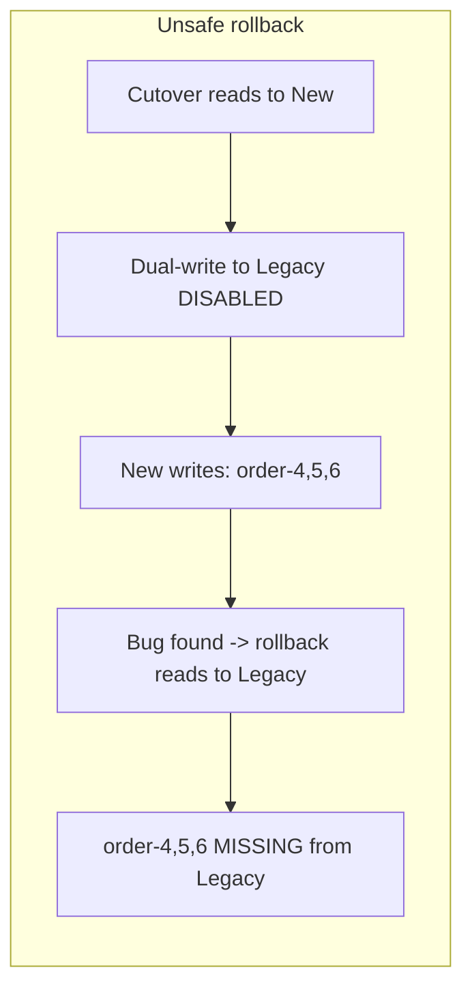
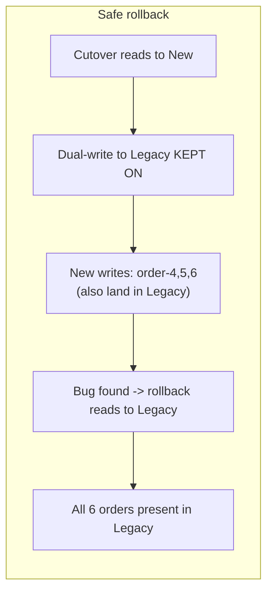

# Strangler Fig, Anti-Corruption Layer, and Migration Patterns

> **Topic register:** T-912 · IWI 7.35 · Staff tier · Moderate interview frequency.
> Dependencies: requires [DDD strategic (bounded contexts)](ddd-strategic-bounded-contexts-and-context-mapping.md)
> and [DDD tactical (aggregates)](ddd-tactical-design-aggregates.md).
> **Provenance:** the rollback-safety result in this chapter is real, executed Java
> 21 output — a real router, two real independent stores, and a real rollback that
> either really loses data or really doesn't, driven by exactly one boolean flag.
> Reproducible source:
> [`practice/java/architecture/strangler-fig-and-migration-patterns/`](../../practice/java/architecture/strangler-fig-and-migration-patterns/README.md).

> **Scope note.** [DDD Strategic Design](ddd-strategic-bounded-contexts-and-context-mapping.md)
> covers the Anti-Corruption Layer as a *steady-state* context-mapping relationship —
> isolating one bounded context from another's ongoing evolution. This chapter covers
> ACL in its other common role: a *temporary* migration tool, isolating new code from
> a legacy system's model specifically during the finite window it takes to extract
> and eventually retire that legacy system. The pattern is the same; the lifecycle and
> the exit criteria are what differ, and this chapter is about the latter.

## Table of Contents

1. [Learning Objectives](#learning-objectives)
2. [Why This Matters in Interviews](#why-this-matters-in-interviews)
3. [Level 1 — Foundation](#level-1--foundation)
4. [Level 2 — Working Knowledge](#level-2--working-knowledge)
5. [Mental Model](#mental-model)
6. [Definition and Purpose](#definition-and-purpose)
7. [Core Concepts](#core-concepts)
8. [Internal Implementation](#internal-implementation)
9. [Execution Flow](#execution-flow)
10. [Diagrams](#diagrams)
11. [Java Examples](#java-examples)
12. [Production Scenarios](#production-scenarios)
13. [Failure Modes and Debugging](#failure-modes-and-debugging)
14. [Trade-offs](#trade-offs)
15. [Decision Framework](#decision-framework)
16. [Comparisons](#comparisons)
17. [Common Mistakes](#common-mistakes)
18. [Anti-Patterns](#anti-patterns)
19. [Best Practices](#best-practices)
20. [Interview Answer Framework](#interview-answer-framework)
21. [Interview Questions](#interview-questions)
22. [Summary](#summary)
23. [Key Takeaways](#key-takeaways)
24. [Cheat Sheet](#cheat-sheet)
25. [Flashcards](#flashcards)
26. [Practice Exercises](#practice-exercises)
27. [Solutions](#solutions)
28. [Additional Reading](#additional-reading)
29. [Official References](#official-references)

## Learning Objectives

After this chapter you should be able to:

- Explain the Strangler Fig pattern precisely: incremental extraction behind a facade,
  not a rewrite.
- Design a real dual-write and backfill strategy for migrating data ownership from a
  legacy system to a new one.
- Answer, with a concrete mechanism, the register's own follow-up: "how do you roll
  back mid-migration?"
- Explain why "a rewrite is faster" is usually false, and name the specific risks a
  big-bang rewrite reintroduces that Strangler Fig avoids.
- Design a facade's incremental cutover strategy (percentage-based, allowlist-based)
  and connect it to real production risk management.

## Why This Matters in Interviews

"How do you extract this incrementally without a rewrite?" is one of the most common
Staff system-design follow-ups to any "design a system" prompt that involves an
existing legacy system, and it specifically probes for real migration experience, not
architectural knowledge in the abstract. The register names the exact misconception
interviewers are listening for: candidates who believe, or say, that "a rewrite would
be faster" — a claim that is almost always false once the legacy system's undocumented
business logic, edge cases, and quiet dependencies are accounted for, and one that
signals a candidate has not actually lived through a real migration. The much harder,
much rarer-to-answer-well follow-up — "how do you roll back mid-migration?" — is this
chapter's central, concretely-answered question.

## Level 1 — Foundation

Imagine renovating a house room by room while you keep living in it, instead of moving everyone out and rebuilding the whole house from scratch. You finish the kitchen first, actually cook in it for a while to make sure it really works, then move on to the living room — at every point, you're still living somewhere real, and if the new kitchen turns out to have a serious problem, you can go back to using the old one because you never demolished it. A facade in the Strangler Fig pattern is exactly the moving-in-stages plan: it decides, room by room (or endpoint by endpoint, tenant by tenant), which version of the house you're currently using, and that decision can move back and forth in small, low-stakes steps.

Now here's the part most renovation plans get wrong: at some point, feeling confident the new kitchen works, you sell the old stove at a garage sale to free up space. That's fine — right up until you discover a gas-line problem in the new kitchen and want to go back to cooking on the old stove for a while. You can't. The "we can always go back" plan quietly stopped being true the moment you sold the stove, and nobody updated the plan to reflect that. That's exactly what disabling dual-write does to a "rollback" option: it looks like the plan is still intact, right up until someone actually tries to use it.

## Level 2 — Working Knowledge

At this level you should connect the stove-selling moment directly to this chapter's own real, measured proof: an identical rollback scenario, with exactly one flag flipped, lost 3 of 6 orders when dual-write (keeping the old stove around) was turned off immediately at cutover, and lost zero when it was kept running through the rollback window. The working discipline is treating "when do we sell the old stove" as a decision made in advance, on a calendar, with a stated minimum duration — never as a decision made in the moment based on how confident the team happens to feel that week, which is exactly the mistake this chapter's own production scenario reproduces: confidence arrived two full weeks before the bug that actually needed the old stove.

The working question to ask about any in-flight migration is simple and concrete: if we needed to go back to the old system right now, this exact minute, would every recent change actually be there, or only some of it? If nobody can answer that with a specific, monitored number (days remaining in the rollback-safety window), the honest status is "we don't currently have a real rollback plan," regardless of what the runbook document claims.

Finally, watch for the specific temptation this chapter names directly: "a full rebuild would just be faster than all this room-by-room fuss" is usually wrong, for the same reason gutting and rebuilding a house from scratch usually underestimates how much of the old wiring, plumbing, and quirks you'd actually need to reproduce correctly on day one — undocumented behavior that the room-by-room approach discovers gradually, safely, one room at a time.

## Mental Model

A big-bang rewrite bets everything on one cutover event: the new system either works
correctly on day one for the entire scope, or the failure is total and hard to
localize. The Strangler Fig pattern instead treats migration as a long series of small,
independently-reversible cutovers: a facade sits in front of both systems, routes each
request to whichever system currently owns it, and that routing decision can move in
small increments — one endpoint, one percentage point, one tenant at a time — with
each increment cheap to observe and cheap to reverse. The name comes from the strangler
fig vine, which grows around a host tree and gradually takes over its structural role
without ever requiring the host tree be cut down first.

## Definition and Purpose

The **Strangler Fig pattern** incrementally replaces a legacy system by routing an
increasing share of traffic to a new system through a facade, until the legacy system
handles nothing and can be retired. **Anti-Corruption Layer (ACL)**, in this migration
context, is the translation layer that lets the new system be built against its own,
clean model while still being able to read and write the legacy system's data during
the transition — isolating the new code from the legacy schema's accumulated
inconsistencies. **Dual-write** is the practice of writing every change to both
systems during the migration window, so that either system has a complete, current
view of the data regardless of which one currently serves reads. These patterns exist
because a legacy system accumulates years of undocumented business rules, and a
rewrite that doesn't reproduce every one of them silently breaks real customer
workflows — the entire point of incremental extraction is that each step's blast
radius is small and each step is independently verifiable against real production
traffic, rather than betting an entire migration on one untested cutover.

## Core Concepts

- **Facade routing.** A single seam (this chapter's `MigrationRouter` /
  `StranglerFacade`) decides, per request, which system handles it — this is what
  makes the migration invisible to callers and adjustable without their involvement.
- **Dual-write and backfill.** During the transition, writes go to both systems
  (dual-write for new data) while a separate batch process copies historical data
  from legacy into the new system (backfill), so the new system eventually holds a
  complete data set, not just data created after migration began.
- **Incremental cutover.** Reads move to the new system gradually — by percentage, by
  tenant, by endpoint — rather than all at once, so a defect in the new system affects
  a bounded, observable slice of traffic rather than everyone simultaneously.
- **Rollback safety window.** The single most commonly-missed concept, and this
  chapter's central proof: a rollback (moving reads back to legacy) is only safe for
  as long as legacy has continued receiving every write. The moment dual-write to
  legacy is disabled, the "rollback" option silently becomes lossy without any error
  or warning at the point it stops being safe.

## Internal Implementation

This chapter's practice code separates the two concerns register calls out —
routing and dual-write — into two purpose-built classes.
[`MigrationRouter.java`](../../practice/java/architecture/strangler-fig-and-migration-patterns/MigrationRouter.java)
holds the write and read-cutover logic: `write()` unconditionally writes to the new
system and conditionally to legacy (`dualWriteToLegacyEnabled`), while `read()` serves
from whichever store `readTarget` currently points at.
[`StranglerFacade.java`](../../practice/java/architecture/strangler-fig-and-migration-patterns/StranglerFacade.java)
demonstrates the complementary, percentage-based routing concern: a deterministic
hash-bucket decides, per request key, which system handles that specific request,
letting the cutover percentage move in small, observable increments.

## Execution Flow



## Diagrams





## Java Examples

The single flag that determines rollback safety:

```java
void write(Order order) {
    newSystem.save(order);
    if (dualWriteToLegacyEnabled) {
        legacy.save(order);
    }
}
```

The real, measured result of the identical rollback sequence with that one flag
flipped:

```
=== Scenario A: UNSAFE -- dual-write disabled immediately at cutover ===
Result: 3 of 6 orders unrecoverable after rollback  <-- UNSAFE rollback, real data loss

=== Scenario B: SAFE -- dual-write kept running through the rollback window ===
Result: 0 of 6 orders unrecoverable after rollback  <-- SAFE rollback, zero data loss
```

The real, measured incremental-cutover result:

```
Configured new-system percentage:   0%  ->  real observed split: new=0 (0.0%) legacy=1000 (100.0%)
Configured new-system percentage:  25%  ->  real observed split: new=251 (25.1%) legacy=749 (74.9%)
Configured new-system percentage: 100%  ->  real observed split: new=1000 (100.0%) legacy=0 (0.0%)
```

## Production Scenarios

**Scenario: a payments migration where "rollback" turned out not to exist by the time
it was needed.** Symptoms: three weeks after cutting over payment reads to the new
system, a subtle currency-rounding bug was discovered affecting a small percentage of
international transactions. The team's runbook said "rollback to legacy if a critical
issue is found," but when they attempted it, historical orders from the prior two
weeks were missing from legacy entirely. Initial hypothesis: a bug in the rollback
procedure itself. Evidence: the actual migration timeline showed dual-write to legacy
had been turned off exactly one week after cutover, once the team felt "confident" —
a full two weeks before the rounding bug was discovered. Diagnosis: the rollback
runbook had never been tested against the actual state of the system at the time it
would realistically be needed; "rollback" had silently stopped being possible the
moment dual-write was disabled, with no monitoring or alert marking that transition.
Immediate mitigation: manually reconstructed the missing two weeks of orders from
application logs and the new system's own database, a slow, error-prone, three-day
effort that a real rollback would have made unnecessary. Permanent remediation:
established a fixed, deliberately conservative rollback-safety window (dual-write
stays on for a minimum of 30 days post-cutover, not "until we feel confident") and
added an explicit dashboard tracking "time remaining in rollback-safety window" so the
option's expiration is visible before it's needed, not discovered when it's already
too late. Trade-off accepted: 30 days of double the write load and double the storage
cost, deliberately, in exchange for a rollback option that's still real when needed.
Prevention: the migration runbook template now requires a named, calendared
rollback-safety window and an explicit sign-off before disabling dual-write, not a
vague "once we're confident" criterion. Interview lesson: this is the concrete,
production form of "how do you roll back mid-migration" — the honest answer is that
you plan the rollback-safety window's duration *before* migration starts, as a
deliberate, monitored commitment, not an ad hoc decision made under pressure after
something has already gone wrong.

## Failure Modes and Debugging

- **Silent rollback expiration** (the scenario above) — the "rollback" option stops
  being real the moment dual-write is disabled, with no error or warning at that
  moment; the failure only becomes visible when someone actually tries to use it.
  Debug signal: a rollback attempt reveals a real, unexplained data gap corresponding
  exactly to the interval since dual-write was disabled.
- **Schema drift during dual-write** — if legacy and new systems have different
  validation rules or defaults, a write that succeeds against one can fail or be
  silently altered against the other, producing a real divergence between the two
  systems' data even while both are supposedly receiving every write.
- **Facade routing rules that drift out of sync with reality** — a percentage-based or
  allowlist-based router whose configuration isn't itself version-controlled and
  auditable becomes a source of "which system is actually serving this request right
  now" confusion during an incident, exactly when that answer matters most.
- **Backfill jobs that silently miss records** — a one-time batch backfill that runs
  once and is assumed complete, with no reconciliation check afterward, can leave
  gaps that only surface later as "missing" records in the new system.

## Trade-offs

Strangler Fig: real, bounded blast radius per increment and a genuinely reversible
migration — at the cost of running two systems simultaneously for an extended
period, with real double infrastructure cost and real engineering effort spent on the
facade and dual-write logic rather than new features. Big-bang rewrite: no facade to
build, no dual-write complexity, no extended dual-running period — at the cost of a
single, high-stakes cutover event where failure is total, hard to localize, and often
discovered only after the legacy system has already been decommissioned and can't be
fallen back to. Dual-write: gives you a real rollback option — for exactly as long as
it's kept running, at a real, ongoing infrastructure and consistency-management cost
that teams are chronically tempted to cut short.

## Decision Framework

| Question | If yes, lean toward |
|---|---|
| Does the legacy system have significant undocumented business logic? | Strangler Fig — a rewrite will silently miss it |
| Is a bounded blast radius per change more valuable than migration speed? | Strangler Fig, incremental cutover |
| Is the legacy system small, well-understood, and low-risk to replace outright? | A rewrite may genuinely be faster and safer here |
| Has a rollback-safety window and its expiration date been explicitly planned? | If no, don't disable dual-write yet — the answer is "not yet safe" |
| Does the new system need to be built against a clean model, not legacy's schema? | Anti-Corruption Layer during the migration window |

## Comparisons

| Approach | Blast radius per step | Rollback option | Real cost |
|---|---|---|---|
| Big-bang rewrite | Entire system, at once | None once cut over | High risk concentrated in one event |
| Strangler Fig, no dual-write | Bounded, but no data safety net | None for data written post-cutover | Lower risk, but false confidence about rollback |
| Strangler Fig, with dual-write | Bounded | Real, for the duration dual-write stays on | Real ongoing infrastructure cost, genuine safety |

## Common Mistakes

- Claiming a rewrite would be faster without accounting for the legacy system's
  undocumented business logic — the register's own named misconception.
- Disabling dual-write as soon as the team "feels confident," rather than against an
  explicit, pre-planned, calendared rollback-safety window.
- Treating "we have a rollback plan" as true indefinitely, rather than recognizing
  that plan silently expires the moment dual-write stops.
- Building the Strangler Fig facade's routing logic as ad hoc conditionals scattered
  through the codebase rather than one auditable, version-controlled seam.

## Anti-Patterns

- **"We'll just turn off dual-write once we're confident"** with no defined,
  calendared threshold — the exact anti-pattern behind this chapter's production
  scenario, where confidence arrived a full two weeks before the bug that needed the
  rollback did.
- **A one-time backfill with no reconciliation check** — silently leaves gaps that
  surface later as unexplained missing records, often much later, since nothing
  monitors backfill completeness continuously.
- **A rewrite pitched as faster without a concrete accounting of legacy behavior
  coverage** — treating the legacy system as if its only value is its code, when its
  actual value is usually the years of edge-case handling embedded in that code that
  nobody wrote down anywhere else.

## Best Practices

- Plan the rollback-safety window's duration *before* migration begins, as an
  explicit, calendared commitment — not a "once we're confident" judgment call made
  under time pressure.
- Make the facade's routing configuration itself version-controlled, auditable, and
  visible during an incident — "which system served this request" should never be a
  question the team has to reconstruct after the fact.
- Reconcile backfilled data against the source system on an ongoing basis during the
  migration window, not as a one-time job assumed complete.
- Move cutover percentage in small, observable increments and hold at each one long
  enough to build real confidence from real production traffic, not synthetic tests
  alone.

## Interview Answer Framework

### 30-Second Answer

Strangler Fig migrates a legacy system incrementally, routing traffic through a facade
that moves in small, reversible steps, rather than betting everything on one rewrite
cutover. Dual-write keeps both systems current during the transition, which is also
what makes rollback possible — but only for as long as dual-write to legacy stays on.

### 2-Minute Answer

A big-bang rewrite concentrates all migration risk into one event, and it almost
always underestimates the legacy system's undocumented business logic — "a rewrite
would be faster" is usually false once that's accounted for. Strangler Fig instead
puts a facade in front of both systems and moves traffic to the new one gradually,
keeping each step's blast radius small and observable. Dual-write during the
transition means both systems stay current, which is what makes a mid-migration
rollback possible — but that safety is not permanent: it only exists for as long as
dual-write to the legacy system is actually running. The single most common mistake in
real migrations is disabling dual-write as soon as the team feels confident, rather
than against an explicit, pre-planned window, which silently turns "we can roll back"
into "we can't" with no warning at the moment it happens.

### 10-Minute Deep Dive

Cover: the real rollback-safety demonstration (identical scenario, one boolean flag
flipped, 3-of-6-lost vs. 0-of-6-lost); the incremental cutover percentage mechanism and
its real measured accuracy; the Anti-Corruption Layer's role specifically during
migration versus its steady-state role covered in the DDD strategic chapter; backfill
and reconciliation as an ongoing concern, not a one-time job; and the production
scenario's central lesson — plan the rollback window's expiration before migration
starts, not after something has already gone wrong.

### Whiteboard Explanation

Draw two boxes, "Legacy" and "New," with a diamond labeled "Facade" between them and
an arrow from "Client" into the facade. Draw a routing percentage as a slider under the
facade, and move it step by step: 0%, 25%, 100%, narrating that each step is
independently observable. Then draw a second, separate arrow from the facade straight
into "Legacy" labeled "dual-write," and explicitly cross it out at some point to show
"the moment this line disappears, rollback stops being real" — this is the single
clearest way to make the rollback-safety-window concept land visually.

### Production Example

Use the payments-migration scenario from [Production Scenarios](#production-scenarios):
a rollback runbook that turned out not to work because dual-write had already been
disabled two weeks before the bug that needed it was found.

### Trade-offs to Mention

Bounded, reversible risk (Strangler Fig) vs. migration speed and simplicity (rewrite);
real rollback safety vs. the real ongoing cost of keeping dual-write running long
enough for that safety to matter.

### Common Candidate Mistakes

Claiming a rewrite is faster without naming what legacy behavior it would need to
reproduce; describing dual-write without connecting it explicitly to rollback safety;
treating cutover as a single event rather than an adjustable percentage.

### Typical Follow-Up Questions

"How do you roll back mid-migration?" "How would you decide when it's safe to turn
off dual-write?" "What happens if the two systems' data actually disagrees during the
dual-write window?" "How do you extract this incrementally without a rewrite?"

### Senior-Level Expectations

Correctly describe the Strangler Fig pattern and dual-write, and connect dual-write to
rollback safety without prompting.

### Staff-Level Discussion

Reason about the rollback-safety window as an explicit, planned, cost-bearing
commitment rather than an emergent property of "how the migration happened to go";
discuss the organizational discipline required to keep a team from prematurely
declaring victory and disabling dual-write early; and connect this pattern's
dependency on [bounded contexts](ddd-strategic-bounded-contexts-and-context-mapping.md)
— you can only safely strangle a legacy system one bounded context's worth of
functionality at a time, not an arbitrary technical slice of it.

## Interview Questions

### Question 1: How do you extract this incrementally without a rewrite?

**Why interviewers ask it.** It's the register's own named standard follow-up to any
legacy-system design question, and it directly tests for real migration experience.

**Expected answer.** The Strangler Fig pattern: a facade routes traffic between legacy
and a new system, moving the split gradually (by percentage, tenant, or endpoint)
rather than cutting over all at once, keeping each step's risk small and observable.

**Minimum acceptable answer.** Names "incremental migration" or "gradual rollout"
without the specific facade/routing mechanism.

**Strong Senior answer.** Names Strangler Fig specifically and describes the facade
routing mechanism concretely.

**Staff-level extension.** Adds dual-write and its connection to rollback safety,
and names why a rewrite is usually the wrong default (undocumented legacy behavior).

**Common mistakes.** Proposing a big-bang rewrite as simpler or faster without
justifying why the legacy system's behavior is fully understood.

**Likely follow-ups.** "How do you roll back mid-migration?"

**Evaluation criteria.** Names Strangler Fig (2), describes routing mechanism (1),
connects to dual-write/rollback at Staff level (2).

### Question 2: How do you roll back mid-migration?

**Why interviewers ask it.** It's the register's harder, less commonly answered
follow-up — most candidates can describe Strangler Fig in the abstract but haven't
thought through what "rollback" actually requires.

**Expected answer.** Rollback means moving reads back to legacy — which only recovers
all data correctly if legacy has continued receiving every write via dual-write.
Rollback safety is bounded by how long dual-write has stayed active since cutover.

**Minimum acceptable answer.** States that dual-write is somehow involved, without
the precise mechanism.

**Strong Senior answer.** Explains that disabling dual-write silently ends the
rollback option, with a concrete example of what's lost.

**Staff-level extension.** Proposes planning a calendared rollback-safety window in
advance, with monitoring on its remaining duration, rather than an ad hoc
"once confident" decision.

**Common mistakes.** Describing rollback as if it's always available, with no
awareness that it has a real expiration tied to dual-write's status.

**Likely follow-ups.** "What would you monitor to know your rollback window has
expired?"

**Evaluation criteria.** Names dual-write as the mechanism (2), explains its
time-boundedness (2), proposes proactive planning at Staff level (1).

## Summary

Strangler Fig replaces a legacy system incrementally, behind a facade whose routing
can move in small, observable, reversible steps — the opposite of a big-bang rewrite's
single, high-stakes cutover. Dual-write keeps both systems current during the
transition and is what makes mid-migration rollback possible, but only for as long as
it's actually running; this chapter proves, with a real identical scenario differing
by one flag, that disabling it early turns a planned safety net into silent, real data
loss the moment it's needed.

## Key Takeaways

- "A rewrite would be faster" is usually false — it discounts the legacy system's
  accumulated, undocumented business logic, which is the register's named
  misconception.
- Rollback safety is bounded by dual-write's active duration, not a permanent
  property of having "a migration plan" — proven directly: an identical scenario with
  one flag flipped goes from 3-of-6 orders lost to 0-of-6 lost.
- Incremental cutover is a real, adjustable percentage (measured here at 25.1% against
  a configured 25%), not an all-or-nothing switch.
- Plan the rollback-safety window's expiration explicitly, before migration begins —
  discovering it has already expired, only when you need it, is this chapter's
  central production lesson.

## Cheat Sheet

- **Strangler Fig**: incremental extraction behind a facade, not a rewrite.
- **Anti-Corruption Layer (migration context)**: isolates new code from legacy's
  model during a *temporary* transition window (contrast with its steady-state use in
  [DDD Strategic Design](ddd-strategic-bounded-contexts-and-context-mapping.md)).
- **Dual-write**: writes go to both systems during migration — the mechanism that
  makes rollback possible.
- **Rollback safety window**: rollback is only safe for as long as dual-write to
  legacy has stayed active. Plan its expiration explicitly.
- **Backfill**: a batch copy of historical data — needs ongoing reconciliation, not a
  one-time "done" assumption.
- **"A rewrite would be faster"**: usually false — accounts poorly for undocumented
  legacy business logic.

## Flashcards

### Card: Why does rollback silently stop being safe?

**Prompt:**
Why can a "we have a rollback plan" migration still lose data on rollback?

**Answer:**
Because rollback safety depends on dual-write to legacy staying active. The moment
dual-write is disabled, every subsequent write exists only in the new system —
rolling reads back to legacy after that point silently loses that data, with no error
at the moment dual-write was turned off.

**Why it matters:**
This chapter's own demo proves it directly: an identical rollback scenario loses 3 of
6 orders with dual-write disabled at cutover, and 0 of 6 with it kept on.

**Common trap:**
Treating "we can roll back" as a permanent property of having built a migration plan,
rather than a time-bounded state tied to dual-write's current status.

**Related:**
[[strangler-fig-and-migration-patterns]]

### Card: Strangler Fig vs. rewrite

**Prompt:**
Why is "a rewrite would be faster" usually the wrong call for a legacy system
migration?

**Answer:**
It discounts the legacy system's accumulated, undocumented business logic and edge
cases. A rewrite that doesn't reproduce all of it silently breaks real workflows at
one high-stakes cutover event, whereas Strangler Fig's incremental extraction
surfaces those gaps in small, observable, reversible steps.

**Why it matters:**
This is the register's own named misconception, and a fast way to fail this specific
follow-up question.

**Common trap:**
Assuming legacy code has no value beyond being "old" and hard to work with.

**Related:**
[[strangler-fig-and-migration-patterns]]

### Card: Migration ACL vs. steady-state ACL

**Prompt:**
How does this chapter's use of Anti-Corruption Layer differ from its use in DDD
strategic design?

**Answer:**
Same pattern, different lifecycle: DDD strategic design's ACL is a permanent,
steady-state relationship isolating one bounded context from another's ongoing
evolution. This chapter's ACL is temporary — it exists specifically for the finite
window of a migration, and is retired once the legacy system it protects against is
gone.

**Why it matters:**
Conflating the two loses precision about exit criteria — a migration ACL should have
a planned end date; a context-mapping ACL generally doesn't.

**Common trap:**
Treating every ACL as permanent infrastructure rather than asking whether this
particular one has a retirement plan.

**Related:**
[[strangler-fig-and-migration-patterns]], [[ddd-strategic-bounded-contexts-and-context-mapping]]

## Practice Exercises

1. Extend `MigrationRouter` with a real reconciliation check: after a batch of writes,
   compare legacy and new system contents for the same set of order IDs and report
   any divergence. Introduce a deliberate bug (e.g., a write that silently fails
   against one store but not the other) and verify the reconciliation check catches
   it.
2. Add a real, calendared rollback-safety window to `MigrationRouter` — track how much
   time has elapsed since cutover and refuse `disableDualWriteToLegacy()` calls made
   before a configured minimum duration has passed. Verify with a real clock (or an
   injectable time source for testability) that the guard actually blocks an early
   call.
3. Extend `StranglerFacade` to route by an explicit tenant allowlist instead of a
   hash-bucket percentage, and measure the real traffic split for a realistic tenant
   size distribution (a few large tenants, many small ones) — does an allowlist
   approach change the risk profile compared to a percentage-based one for
   unevenly-sized tenants?

## Solutions

Exercise 1 is a direct extension of `OrderStore` and `MigrationRouter` — iterate a
known set of order IDs and compare `find()` results between the two stores; left as
self-directed practice since the existing classes provide every piece needed.
Exercise 2 requires introducing a `Clock` or similar injectable time source into
`MigrationRouter` for testability, following the same pattern used for the wall-clock
math in [Rate Limiting and Throttling Algorithms](../11-system-design/rate-limiting-and-throttling-algorithms.md)'s
`FixedWindowCounter`; left as self-directed practice. Exercise 3 is intentionally
open-ended — the answer depends on the real tenant-size distribution assumed, and is
left for the reader to explore with their own realistic numbers.

## Additional Reading

- Martin Fowler's bliki entries on Strangler Fig Application, Anti-Corruption Layer,
  and Branch by Abstraction (see [Official References](#official-references)) are the
  standard concise references for all three patterns discussed in this chapter.
- [DDD Strategic Design — Bounded Contexts and Context Mapping](ddd-strategic-bounded-contexts-and-context-mapping.md)
  covers the Anti-Corruption Layer's steady-state, non-migration use — read it for the
  contrast this chapter's scope note draws.

## Official References

- Martin Fowler, [StranglerFigApplication](https://martinfowler.com/bliki/StranglerFigApplication.html)
- Martin Fowler, [Anti-Corruption Layer](https://martinfowler.com/bliki/AntiCorruptionLayer.html)
- Martin Fowler, [Branch By Abstraction](https://martinfowler.com/bliki/BranchByAbstraction.html)
