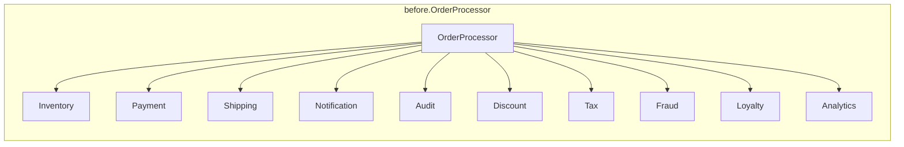
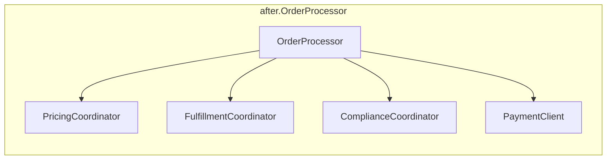

# Technical Debt and Evolutionary Architecture

> **Topic register:** T-913 · IWI 7.25 · Staff tier · High interview frequency.
> **Provenance:** the coupling measurements in this chapter are real, executed
> `java.lang.reflect` output against real compiling classes, not a description of
> expected coupling. Reproducible source:
> [`practice/java/architecture/technical-debt-and-evolutionary-architecture/`](../../practice/java/architecture/technical-debt-and-evolutionary-architecture/README.md).

> **Scope note.** [Technical Debt Advocacy](../20-interview-preparation/behavioral/11-technical-debt-advocacy.md)
> covers how to *tell a STAR story* about arguing for unglamorous work in a behavioral
> interview — the persuasion and narrative skill. This chapter covers the underlying
> technical framework that story is usually about: fitness functions, quantifying
> debt in economic terms, and the mechanics of incremental modernization. Read that
> chapter for interview delivery; read this one for the substance behind it.

## Table of Contents

1. [Learning Objectives](#learning-objectives)
2. [Why This Matters in Interviews](#why-this-matters-in-interviews)
3. [Level 1 — Foundation](#level-1--foundation)
4. [Level 2 — Working Knowledge](#level-2--working-knowledge)
5. [Mental Model](#mental-model)
6. [Definition and Purpose](#definition-and-purpose)
7. [Core Concepts](#core-concepts)
8. [Internal Implementation](#internal-implementation)
9. [Diagrams](#diagrams)
10. [Java Examples](#java-examples)
11. [Production Scenarios](#production-scenarios)
12. [Failure Modes and Debugging](#failure-modes-and-debugging)
13. [Trade-offs](#trade-offs)
14. [Organizational Implications](#organizational-implications)
15. [Decision Framework](#decision-framework)
16. [Comparisons](#comparisons)
17. [Common Mistakes](#common-mistakes)
18. [Anti-Patterns](#anti-patterns)
19. [Best Practices](#best-practices)
20. [Interview Answer Framework](#interview-answer-framework)
21. [Interview Questions](#interview-questions)
22. [Summary](#summary)
23. [Key Takeaways](#key-takeaways)
24. [Cheat Sheet](#cheat-sheet)
25. [Flashcards](#flashcards)
26. [Practice Exercises](#practice-exercises)
27. [Solutions](#solutions)
28. [Additional Reading](#additional-reading)
29. [Official References](#official-references)

## Learning Objectives

After this chapter you should be able to:

- Frame technical debt in delivery-risk and economic terms, not as a code-quality
  aesthetic judgment.
- Define a fitness function precisely, and implement a real, automated one.
- Explain why evolutionary architecture depends on fitness functions specifically,
  not just on "being disciplined" or "doing code review well."
- Design an incremental modernization plan for a concretely over-coupled component.
- Answer "sell this refactor to a skeptical PM" with a business case, not an appeal
  to code quality.

## Why This Matters in Interviews

The register names the exact misconception interviewers are trained to catch:
treating technical debt as a code-quality argument rather than an economic one. A
candidate who says "the code is messy and hard to maintain" is making an aesthetic
claim a skeptical stakeholder can reasonably ignore. A candidate who says "this
component's coupling has grown to the point where the last three features touching it
each took 40% longer than comparable features elsewhere, and that trend is
accelerating" is making a falsifiable, business-relevant claim about delivery risk —
and that reframe is exactly what separates a Senior answer from a Staff one on this
topic. The concrete mechanism this chapter is built around — fitness functions — is
also frequently asked about directly, because it's the answer to "how do you prevent
this from happening again" once a refactor is approved.

## Level 1 — Foundation

Think about a car with worn brake pads. The car still drives fine today — nothing about pressing the pedal feels obviously wrong yet — but the brakes are measurably closer to failing than they were a year ago, and every month of delay makes the eventual repair (or the eventual accident) more expensive, not less. "The brakes feel a little worse than they used to" is a subjective, easy-to-dismiss complaint; "the brake pads are at 2mm, and the legal/safety minimum is 3mm" is an objective measurement nobody can wave away, because it's stated in a currency (a number, a threshold) everyone — not just car people — can understand and act on.

Technical debt works the same way: "this code feels messy" is the subjective complaint a busy stakeholder can reasonably ignore, because it gives them nothing to weigh it against. "This component's last three features each took 40% longer to ship than comparable ones, and the trend is getting worse" is the brake-pad measurement — concrete, falsifiable, and stated in a currency (delivery time, business risk) the stakeholder already reasons in every day.

## Level 2 — Working Knowledge

At this level you should be able to name the mechanism that makes the brake-pad number possible in the first place: a mandatory vehicle inspection, run on a fixed schedule, that measures pad thickness objectively rather than trusting the driver's own feeling that "it's probably fine." A fitness function is exactly that inspection, applied to a codebase: this chapter's own real, executed example measures a class's coupling via nothing more than plain reflection, and fails the build the instant that number crosses a stated threshold (10 collaborators, failing a threshold of 5; 4 collaborators, passing, after a real incremental refactor) — an objective check that runs every time, not a one-off inspection someone remembers to schedule occasionally.

The working reason a single good design review can't substitute for a recurring inspection is exactly why a car doesn't get inspected only once, at the dealership, and never again: brake pads wear down gradually, through many individually-unremarkable trips, none of which alone would justify pulling over. This chapter's own production scenario is precisely that gradual wear: ten separate, individually-reasonable pull requests, each adding "just one more collaborator" to a component, none flagged as risky at review time, until the aggregate coupling had quietly worn down the component's maintainability the way ten years of ordinary driving wears down a brake pad.

Finally, the working move once a real inspection catches a real problem is never to argue the brakes "feel fine" — it's to fix the actual measured issue and keep the inspection running afterward, so the same wear can't silently reaccumulate. A fitness function added once and never revisited is a car inspection sticker nobody ever checks again — technically present, providing zero real ongoing protection.

## Mental Model

Technical debt, like financial debt, is not inherently bad — it's a deliberate or
accidental trade of short-term speed for long-term cost, and the entire question is
whether the "interest rate" (the ongoing tax it imposes on every future change) is
understood and being paid down deliberately, or silently compounding unnoticed.
Evolutionary architecture is the discipline of allowing a system to change
incrementally and continuously while protecting the architectural characteristics
that matter most, using automated, objective checks — fitness functions — instead of
relying on someone remembering to look, or a code reviewer's subjective judgment call.

## Definition and Purpose

**Technical debt** is the accumulated cost of choices — deliberate or accidental —
that made past delivery faster at the expense of making future delivery slower, less
safe, or both. **A fitness function** is any automated, objective, repeatable check
that verifies a system still meets some architectural characteristic that matters
(coupling, cycle time, dependency direction, security posture), run continuously as
the system evolves rather than assessed once during a design review. **Evolutionary
architecture** is the practice of allowing a system's structure to change
incrementally over time, guided by fitness functions that catch regressions in
important characteristics automatically. These concepts exist because architecture
review at a single point in time (an initial design doc, an ADR) cannot, by itself,
prevent gradual erosion across hundreds of individually-reasonable subsequent changes
— each change looks fine in isolation, and the erosion is only visible in aggregate,
which is precisely what an automated, continuously-run check can catch and a
point-in-time review cannot.

## Core Concepts

- **Debt as an economic frame, not a quality frame.** The register's central point:
  "this code is ugly" rarely persuades; "this component's coupling is measurably
  increasing per-feature delivery time, and here's the trend" does, because it's a
  claim about business risk a stakeholder can weigh against other priorities.
- **Fitness functions as automated architecture governance.** A fitness function
  turns "we agreed coupling should stay low" from a one-time agreement into a
  continuously-enforced, objective gate — see [Java Examples](#java-examples) for a
  real, executed one.
- **Incremental modernization.** Paying down debt in small, individually-shippable
  steps (as demonstrated in [Strangler Fig and Migration Patterns](strangler-fig-and-migration-patterns.md))
  rather than a large, high-risk rewrite — the same underlying discipline applied to
  internal structure rather than external system boundaries.
- **Deliberate vs. accidental debt.** Deliberate debt (shipping a known-simplified
  version to hit a deadline, with a plan to revisit) is a legitimate trade-off when
  named explicitly; accidental debt (coupling that crept in unnoticed across many
  small changes, like this chapter's practice code) is the more common and more
  dangerous kind precisely because no one decided to take it on.

## Internal Implementation

This chapter's practice code implements a real, minimal fitness function using only
`java.lang.reflect` — no ArchUnit, no build-tool plugin — specifically to demonstrate
that the *concept* of a fitness function requires no special tooling, only that the
check be automated, objective, and repeatable.
[`CouplingFitnessFunction.java`](../../practice/java/architecture/technical-debt-and-evolutionary-architecture/CouplingFitnessFunction.java)'s
`measureEfferentCoupling()` inspects a class's declared fields via reflection,
counting distinct non-JDK collaborator types, then `checkThreshold()` compares that
real, exact number against a configured limit and reports pass or fail — exactly the
signature of a fitness function meant to run inside a CI pipeline as a build gate.

## Diagrams





## Java Examples

The real, minimal fitness function:

```java
static int measureEfferentCoupling(Class<?> targetClass) {
    Set<String> collaboratorTypes = new LinkedHashSet<>();
    for (Field field : targetClass.getDeclaredFields()) {
        if (Modifier.isStatic(field.getModifiers())) continue;
        Class<?> fieldType = field.getType();
        if (fieldType.isPrimitive()) continue;
        if (fieldType.getName().startsWith("java.")) continue;
        collaboratorTypes.add(fieldType.getSimpleName());
    }
    return collaboratorTypes.size();
}
```

The real, measured result, before and after three incremental extraction steps:

```
[Fitness Function] before.OrderProcessor: efferent coupling = 10 (threshold: <= 5) -> FAIL
[Fitness Function] after.OrderProcessor: efferent coupling = 4 (threshold: <= 5) -> PASS
```

Both versions were also run directly and produced the identical final computed price
and identical set of side effects — the refactor changed only what `OrderProcessor`
itself has to know about, not its behavior.

## Production Scenarios

**Scenario: a "just add one more thing" component that quietly became the slowest
part of every release.** *(Representative scenario, following this repository's
labeling convention for illustrative rather than literally-observed incidents —
grounded in the real coupling mechanics measured directly in this chapter's practice
code.)* Symptoms: over six months, the team noticed that any feature touching the
checkout `OrderProcessor` class took roughly 40% longer to implement and review than
comparable features elsewhere in the codebase, and the gap was widening release over
release. Initial hypothesis: the checkout domain was inherently more complex than
other areas. Evidence: a coupling audit (conceptually identical to this chapter's real
`CouplingFitnessFunction`) found `OrderProcessor` had accumulated ten direct
collaborator dependencies, added one or two at a time across roughly a dozen separate,
individually-reviewed, individually-reasonable pull requests over eighteen months —
"add fraud check," "add loyalty points," "add analytics tracking" — none of which had
been rejected in review because none looked risky in isolation. Diagnosis: the
component's *architectural characteristic that mattered* — bounded coupling — had no
automated check protecting it, so gradual, individually-acceptable erosion had never
been caught until its cumulative cost became visible in delivery velocity data.
Immediate mitigation: none needed beyond acknowledging the pattern — the debt was
already fully accrued. Permanent remediation: the three-coordinator extraction this
chapter's `after/` package demonstrates, done incrementally over three separate,
low-risk pull requests, plus a coupling fitness function added to the CI pipeline with
a threshold of 5, specifically to prevent the same erosion from recurring silently.
Trade-off accepted: the fitness function will occasionally block a legitimately
justified addition, requiring an explicit, reviewed threshold increase rather than a
silent bypass — a deliberate friction, not an oversight. Prevention: any component
identified as "core" or "high-change-frequency" during architecture review now gets at
least one fitness function assigned to it at that review, not retrofitted only after
the cost is already visible. Interview lesson: this is the concrete, economic framing
the register calls for — not "the code is messy," but "measured delivery time on this
component increased 40% and the trend is accelerating," which is the sentence that
actually persuades a skeptical PM.

## Failure Modes and Debugging

- **Debt accrued silently across many individually-reasonable changes** (the scenario
  above) — no single change looks risky, and by the time the aggregate cost is
  visible in delivery metrics, the remediation is larger than any single review could
  have caught early. Debug signal: per-feature delivery time on a specific component
  trending up over multiple releases, without a corresponding increase in that
  component's actual business complexity.
- **A fitness function with no owner or review process for its threshold** — a
  coupling limit that's never revisited either blocks legitimate growth indefinitely
  or gets silently bypassed/deleted the first time it's inconvenient, defeating its
  purpose either way.
- **Advocating for debt paydown as a code-quality argument** — the register's own
  named misconception; a stakeholder without engineering context has no way to weigh
  "the code is ugly" against a competing feature request, but can weigh a measured
  delivery-time cost.

## Trade-offs

Paying down debt incrementally (this chapter's three-coordinator extraction): low
risk per step, real progress measurable at each step — at the cost of taking longer
in wall-clock time than a single large rewrite might, if that rewrite actually worked
on the first attempt (which [Strangler Fig and Migration Patterns](strangler-fig-and-migration-patterns.md)
argues it usually doesn't). Adding a fitness function: real, ongoing protection
against regression — at the real cost of occasionally blocking a legitimately
justified change, requiring a deliberate, reviewed threshold decision rather than
either silent enforcement or silent bypass. Leaving debt unaddressed: zero immediate
cost — at the real, compounding cost this chapter's production scenario measures
directly: increasing per-feature delivery time on the affected component.

## Organizational Implications

Framing debt economically is what makes it possible to prioritize against feature
work in the same conversation, using the same currency (delivery risk, delivery
speed) a product stakeholder already reasons in — this is precisely why "the code is
ugly" fails and "delivery time increased 40% and is trending worse" succeeds. Fitness
functions also have an organizational dimension: a threshold that can be silently
bypassed by whoever finds it inconvenient provides no real governance, so a
functioning fitness-function practice requires an explicit process for reviewing and
deliberately changing thresholds — usually via the same kind of documented decision
covered in [Architecture Decision Records](architecture-decision-records.md), so a
threshold change is a visible, reviewed decision rather than a quiet workaround.

## Decision Framework

| Question | If yes, lean toward |
|---|---|
| Is the debt's cost currently invisible to non-engineering stakeholders? | Reframe it in measured delivery-time/risk terms before asking for remediation time |
| Does a component have an architectural characteristic worth protecting long-term? | Add a fitness function for it now, not after the first regression |
| Is the remediation large enough to carry real rewrite risk? | Break it into incremental steps (see [Strangler Fig and Migration Patterns](strangler-fig-and-migration-patterns.md)) |
| Was this debt taken on deliberately, with a documented plan to revisit? | Track it explicitly (an ADR or ticket with a revisit trigger), don't let it become accidental debt by omission |
| Is a fitness function's threshold currently unowned or unreviewed? | Assign explicit ownership before treating it as real governance |

## Comparisons

| Approach to debt | Cost visibility | Remediation risk | Prevents recurrence |
|---|---|---|---|
| Ignore it | Invisible until it compounds into a visible delivery problem | N/A | No |
| Advocate on code-quality grounds | Low — hard for non-engineers to weigh | Depends on remediation approach | No, by itself |
| Advocate on measured delivery-risk grounds | High — directly comparable to feature costs | Depends on remediation approach | No, by itself |
| Remediate + add a fitness function | High | Low, if remediation is incremental | Yes — this chapter's central mechanism |

## Common Mistakes

- Making the case for debt paydown as a code-quality or aesthetic argument — the
  register's own named misconception, and the single fastest way to lose a skeptical
  stakeholder.
- Treating a design review or ADR as sufficient, permanent protection for an
  architectural characteristic, with no automated check keeping it true as the system
  continues to change.
- Proposing a full rewrite as the remediation by default, without considering
  incremental extraction (see [Strangler Fig and Migration Patterns](strangler-fig-and-migration-patterns.md)).
- Adding a fitness function with a threshold that's never reviewed or revisited,
  turning it into either a permanent blocker or a target for silent bypass.

## Anti-Patterns

- **"We'll clean it up later"** with no ticket, no trigger condition, and no owner —
  functionally identical to never planning to address it, and this is exactly the
  gap a fitness function or an explicit ADR is meant to close.
- **A fitness function nobody remembers exists** — added once, then never referenced
  in onboarding or documentation, so its failures are treated as mysterious build
  breaks rather than a deliberate, understood architectural gate.
- **Debt framed only in engineering-internal language** ("this violates SOLID," "this
  isn't idiomatic") when talking to a non-engineering stakeholder, rather than in
  terms of the delivery-time or reliability cost that stakeholder actually cares
  about.

## Best Practices

- Frame every debt-remediation proposal in terms a non-engineering stakeholder can
  weigh against competing priorities: measured or estimated delivery-time impact,
  defect rate, or on-call burden — not code-quality language.
- Add a fitness function for any architectural characteristic identified as
  important during a design review or ADR, at the time of that review, not after the
  first violation is discovered informally.
- Prefer incremental remediation (see [Strangler Fig and Migration Patterns](strangler-fig-and-migration-patterns.md))
  over a full rewrite whenever the component's behavior is not fully understood or
  documented.
- Give every fitness function's threshold an explicit owner and a documented process
  for revisiting it, so a threshold change is a visible decision, not a quiet
  workaround.

## Interview Answer Framework

### 30-Second Answer

Technical debt is the accumulated cost of past choices that made delivery faster then
and slower now. The persuasive framing is economic — measured delivery-time or risk
impact — not code quality. Fitness functions are automated, objective checks that
protect an important architectural characteristic continuously, which is what makes
evolutionary architecture different from a one-time design review.

### 2-Minute Answer

Debt accrues silently across many individually-reasonable changes — no single pull
request that adds "just one more collaborator" looks risky, but the aggregate cost
compounds and eventually shows up as measurably slower delivery on that component. The
persuasive way to advocate for remediation is economic, not aesthetic: "the code is
messy" doesn't give a stakeholder a way to weigh the request against a competing
feature; "delivery time on this component increased 40% and the trend is
accelerating" does. Once remediation is approved, the way to prevent recurrence is a
fitness function — an automated, objective, continuously-run check (this chapter
demonstrates one measuring coupling via plain reflection, no special tooling
required) that catches the next erosion at the moment it's introduced, rather than
after it's compounded again.

### 10-Minute Deep Dive

Cover: the real fitness-function demonstration (10 vs. threshold 5, failing; 4 vs.
threshold 5, passing, with identical preserved behavior); the economic-framing
reframe as the core interview differentiator on this topic; incremental remediation
connected explicitly to [Strangler Fig and Migration Patterns](strangler-fig-and-migration-patterns.md);
the organizational requirement that a fitness function's threshold have real
ownership, not just existence; and the deliberate-vs-accidental debt distinction as a
framing tool for how a given piece of debt should even be tracked.

### Whiteboard Explanation

Draw a single box labeled "OrderProcessor" with ten arrows radiating out to ten
labeled boxes, then redraw it with the ten collapsed into three coordinator boxes and
one direct dependency. Under the first diagram write "10, no automated check"; under
the second, "4, protected by a fitness function with threshold 5." The visual point
is that the second diagram isn't just cleaner — it has a number attached, and a gate
that keeps that number from silently growing back.

### Production Example

Use the checkout-component scenario from [Production Scenarios](#production-scenarios):
a component whose coupling grew through a dozen individually-reasonable pull requests
until per-feature delivery time on it was measurably 40% slower than comparable
components.

### Trade-offs to Mention

Incremental remediation's low risk per step vs. its longer wall-clock timeline
compared to a (riskier) rewrite; a fitness function's real governance value vs. its
real cost of occasionally blocking a legitimately justified change.

### Common Candidate Mistakes

Framing a debt-remediation pitch in code-quality terms rather than economic ones;
describing fitness functions vaguely ("automated architecture checks") without a
concrete example of what one actually measures and gates; proposing a rewrite as the
default remediation.

### Typical Follow-Up Questions

"Sell this refactor to a skeptical PM." "How do you prevent this kind of coupling
from creeping back in after you fix it?" "How do you decide a fitness function's
threshold, and who owns changing it?" "Is all technical debt bad?"

### Senior-Level Expectations

Correctly define technical debt and fitness functions, and reframe a code-quality
complaint into an economic one without prompting.

### Staff-Level Discussion

Discuss the organizational process required for fitness-function thresholds to be
real governance rather than theater (explicit ownership, a documented review process,
visibility when bypassed); connect incremental modernization explicitly to migration
patterns as the same underlying discipline applied at different scales; and reason
about deliberate vs. accidental debt as a framing choice that changes how each should
be tracked and by whom.

## Interview Questions

### Question 1: Sell this refactor to a skeptical PM.

**Why interviewers ask it.** It's the register's own named follow-up, designed to
test whether a candidate can make an economic case rather than a code-quality
complaint.

**Expected answer.** Reframe the ask in terms the PM already reasons in — measured or
credibly estimated delivery-time impact, defect rate, or on-call burden — rather than
appealing to code aesthetics.

**Minimum acceptable answer.** Attempts a non-technical framing, even if the
specific metric chosen is weak.

**Strong Senior answer.** Uses a concrete, plausible metric (e.g., "the last three
features touching this component took 40% longer than comparable ones") and connects
the ask directly to a business outcome (release velocity, incident risk).

**Staff-level extension.** Proposes the incremental remediation plan alongside the ask
(not just "let us fix it" but "here's the three-step, low-risk plan"), and names the
fitness function that will prevent recurrence.

**Common mistakes.** Leading with "the code is messy" or citing a code-quality
principle (SOLID, DRY) as if it were self-evidently persuasive to a non-engineer.

**Likely follow-ups.** "How would you measure whether the refactor actually helped?"

**Evaluation criteria.** Economic framing (2), concrete metric (1), incremental plan
(1), names prevention mechanism at Staff level (1).

### Question 2: How do you prevent this kind of coupling from creeping back in?

**Why interviewers ask it.** It probes whether the candidate's remediation plan
includes any mechanism for durability, or is a one-time fix that will silently erode
again.

**Expected answer.** A fitness function — an automated, objective, continuously-run
check (e.g., a coupling threshold) wired into the build pipeline, so the next
violation is caught at merge time rather than discovered informally much later.

**Minimum acceptable answer.** Proposes "more code review" or "better documentation"
without an automated mechanism.

**Strong Senior answer.** Names fitness functions specifically and describes a
concrete example (a coupling count, a dependency-direction rule).

**Staff-level extension.** Addresses threshold ownership and the review process for
changing it, so the fitness function remains real governance rather than either a
permanent blocker or something quietly bypassed.

**Common mistakes.** Relying entirely on human vigilance (code review, team norms)
with no automated enforcement.

**Likely follow-ups.** "What happens when the fitness function blocks a legitimately
necessary change?"

**Evaluation criteria.** Names an automated mechanism (2), gives a concrete example
(2), addresses threshold governance at Staff level (1).

## Summary

Technical debt is the accumulated cost of past speed-for-cost trade-offs, and the
persuasive way to advocate for paying it down is economic — measured or credible
delivery-time and risk impact — not code-quality language. Fitness functions turn an
architectural characteristic that matters into an automated, continuously-enforced
gate rather than a one-time design-review agreement, and this chapter proves the
mechanism directly: a real reflection-based coupling check that fails at 10
collaborators and passes at 4, with identical preserved behavior across the refactor
that got it there.

## Key Takeaways

- "The code is ugly" doesn't persuade; "delivery time on this component increased 40%
  and is trending worse" does — the register's central economic-framing point.
- A fitness function is any automated, objective, repeatable architectural check —
  this chapter's real example needs nothing but `java.lang.reflect` and a threshold.
- Debt typically accrues through many individually-reasonable changes, none of which
  look risky in isolation — this is why a point-in-time design review can't catch it
  and a continuously-run fitness function can.
- Incremental remediation (three small extraction steps here) preserves behavior
  exactly while reducing measured coupling from 10 to 4 — proof, not assertion, that
  incremental paydown works without a risky rewrite.

## Cheat Sheet

- **Technical debt**: accumulated cost of past speed-for-cost trade-offs. Not
  inherently bad — the question is whether it's understood and managed.
- **Fitness function**: any automated, objective, repeatable check on an
  architectural characteristic. No special tooling required — just automated and
  repeatable.
- **Evolutionary architecture**: incremental change, guided and protected by fitness
  functions.
- **Economic framing**: measured delivery-time/risk impact, not code-quality
  language — the persuasive currency for a non-engineering stakeholder.
- **Deliberate vs. accidental debt**: deliberate debt is named and tracked; accidental
  debt (this chapter's `before.OrderProcessor`) accrues silently and is the more
  dangerous kind.
- **Incremental remediation** over a rewrite whenever legacy behavior isn't fully
  understood — see [Strangler Fig and Migration Patterns](strangler-fig-and-migration-patterns.md).

## Flashcards

### Card: Economic framing vs. code-quality framing

**Prompt:**
Why does "this code is messy" usually fail to persuade a stakeholder, while "delivery
time on this component increased 40%" usually succeeds?

**Answer:**
Because "messy" is an aesthetic claim a non-engineer has no way to weigh against a
competing feature request, while a measured delivery-time or risk impact is stated in
the same currency (business cost) the stakeholder already reasons in.

**Why it matters:**
This is the register's own named misconception on this topic, and the single fastest
way to lose a skeptical PM in an interview answer.

**Common trap:**
Leading with a code-quality principle (SOLID, DRY) as if it were self-evidently
persuasive outside engineering.

**Related:**
[[technical-debt-and-evolutionary-architecture]]

### Card: What is a fitness function, concretely?

**Prompt:**
Give a concrete, minimal example of a fitness function.

**Answer:**
A reflection-based check that counts a class's distinct non-JDK field types
(efferent coupling) and fails a build if that count exceeds a threshold — this
chapter's real, executed example measured 10 (fail, threshold 5) before a refactor and
4 (pass) after, using nothing but `java.lang.reflect`.

**Why it matters:**
Candidates often describe fitness functions vaguely; a concrete example demonstrates
real understanding of the mechanism, not just the term.

**Common trap:**
Assuming a fitness function requires a specific tool (ArchUnit, a commercial product)
rather than understanding it as a concept any automated, objective, repeatable check
satisfies.

**Related:**
[[technical-debt-and-evolutionary-architecture]]

### Card: Why can't a design review alone prevent this?

**Prompt:**
Why doesn't a good architecture review at project kickoff prevent the kind of
coupling erosion this chapter demonstrates?

**Answer:**
Because the erosion happens gradually, across many individually-reasonable
subsequent changes, each of which looks fine in isolation at the time it's reviewed —
the aggregate cost is only visible in hindsight, which is exactly what a
continuously-run, automated fitness function catches and a one-time review cannot.

**Why it matters:**
It's the core justification for evolutionary architecture as a distinct discipline
from "just do good design reviews."

**Common trap:**
Believing sufficiently rigorous human review process alone (without automation) is
enough to prevent this kind of drift.

**Related:**
[[technical-debt-and-evolutionary-architecture]]

## Practice Exercises

1. Extend `CouplingFitnessFunction` to also measure afferent coupling (how many other
   classes depend on a given class) using reflection over a known set of classes, and
   compare the before/after afferent coupling for `InventoryClient`, which is used
   directly by `OrderProcessor` in the before package and by `FulfillmentCoordinator`
   in the after package.
2. Add a second, independent fitness function measuring method count per class (a
   simple proxy for responsibility count) and run it against both `OrderProcessor`
   versions — does it tell the same story as the coupling fitness function, or does
   it surface something different?
3. Using this repository's own `handbook/` directory as a real target, write a
   fitness function (reflection won't apply to Markdown, so use simple text
   processing) that checks every chapter file has all of CLAUDE.md's required
   sections present, and run it against a sample of five real chapters in this
   repository — compare your result against the existing
   `scripts/check_adr_completeness.py` pattern from
   [Architecture Decision Records](architecture-decision-records.md).

## Solutions

Exercise 1 is a direct extension of `CouplingFitnessFunction` using
`Class.getDeclaredFields()` filtering in the opposite direction — scan a fixed list of
classes and count how many declare a field of the target type; left as self-directed
practice since the existing reflection pattern generalizes directly. Exercise 2 is a
one-line addition (`targetClass.getDeclaredMethods().length`) alongside the existing
coupling measurement, run against both `OrderProcessor` versions; left as
self-directed practice. Exercise 3 is a real, buildable variation on the existing
`scripts/check_adr_completeness.py` script referenced in
[Architecture Decision Records](architecture-decision-records.md) — reuse its
required-headings-via-regex approach against this repository's canonical chapter
template instead of the ADR template, and is left open-ended since the "required
sections" list should be pulled directly from the current `CLAUDE.md` template, not
hard-coded here where it could drift out of sync.

## Additional Reading

- Martin Fowler's writing on technical debt and on quality-versus-cost (see
  [Official References](#official-references)) are the primary sources for the
  economic framing this chapter uses.
- *Building Evolutionary Architectures* (Ford, Parsons, Kua) is the primary source
  for the fitness-function concept and is the standard deeper reference for readers
  who want fitness-function categories and governance models beyond this chapter's
  single worked example.
- [Technical Debt Advocacy](../20-interview-preparation/behavioral/11-technical-debt-advocacy.md)
  covers the STAR-story delivery of the same underlying argument, deliberately not
  repeated here.

## Official References

- Martin Fowler, [TechnicalDebt](https://martinfowler.com/bliki/TechnicalDebt.html)
- Martin Fowler, [Is High Quality Software Worth the Cost?](https://martinfowler.com/articles/is-quality-worth-cost.html)
- ThoughtWorks, [Building Evolutionary Architectures](https://www.thoughtworks.com/en-us/insights/books/building-evolutionary-architectures)
