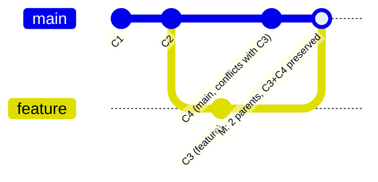
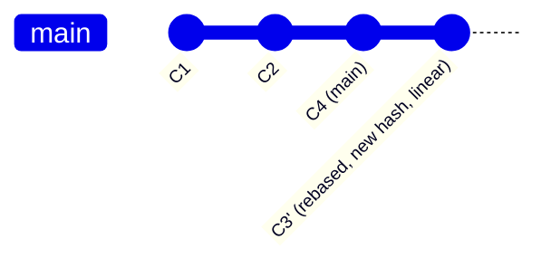

# Git Internals and Collaboration Workflows

> **Topic register:** no blueprint topic ID — this is genuinely out of scope for the original Master Topic Register, which explicitly notes (Phase 2, §14) that the prior knowledge base over-allocated Git relative to its interview weight. It is covered here because it belongs to a distinct, user-identified gap category: baseline engineering-craft topics assumed by Senior/Staff interview loops but never taught as such.
> **Scope note:** this chapter covers Git itself (object model, branching, history rewriting, recovery, and the GitHub PR workflow). It does not re-derive [CI/CD Pipeline Design and Deployment Strategies](../14-devops-containers/cicd-pipeline-design-and-deployment-strategies.md) (T-1009, already covered), which owns pipeline/deployment-strategy content — this chapter cross-links to it for the "what happens after a PR merges" half of the story.
> **Provenance:** every command and every line of output in this chapter is real, captured from actually running git 2.55.0 against scratch repositories in [`practice/git/`](../../practice/git/). Each demo ships as a self-contained, reproducible `setup.sh` plus a `transcript.txt` of one real run.

## Table of Contents

1. [Learning Objectives](#learning-objectives)
2. [Why This Matters in Interviews](#why-this-matters-in-interviews)
3. [Mental Model](#mental-model)
4. [Definition and Purpose](#definition-and-purpose)
5. [Core Concepts](#core-concepts)
6. [Internal Implementation](#internal-implementation)
7. [Diagrams](#diagrams)
8. [Real Command Transcripts](#real-command-transcripts)
9. [Production Scenarios](#production-scenarios)
10. [Trade-offs](#trade-offs)
11. [Decision Framework](#decision-framework)
12. [Common Mistakes](#common-mistakes)
13. [Anti-Patterns](#anti-patterns)
14. [Best Practices](#best-practices)
15. [Interview Answer Framework](#interview-answer-framework)
16. [Interview Questions](#interview-questions)
17. [Summary](#summary)
18. [Key Takeaways](#key-takeaways)
19. [Cheat Sheet](#cheat-sheet)
20. [Flashcards](#flashcards)
21. [Practice Exercises](#practice-exercises)
22. [Solutions](#solutions)
23. [Additional Reading](#additional-reading)
24. [Official References](#official-references)

---

## Learning Objectives

By the end of this chapter you can:

- Explain, with real captured output, what a blob/tree/commit actually is on disk, and why identical content — even across different filenames — is stored exactly once.
- State the structural difference between `git merge` and `git rebase` on the same divergent history (parent count, linearity, and commit-identity implications), demonstrated by running both on the same starting point.
- Recover a branch after a destructive `git reset --hard` using `git reflog`, and explain why the underlying objects were never actually deleted.
- Use `git bisect run` to find the exact commit that introduced a regression via automated binary search, and state its complexity advantage over linear search.
- Describe a typical GitHub PR workflow (protected branches, required checks, review gates) and how it hands off to CI/CD.

## Why This Matters in Interviews

Git rarely gets its own dedicated interview round, but it surfaces constantly as connective tissue: "walk me through how you'd resolve this conflict," "you just force-pushed over a teammate's work, what do you do," "how would you find which commit caused this regression." These are practical-competence checks — they filter for engineers who have actually operated git under pressure versus those who only know `add`/`commit`/`push`/`pull`. At Senior/Staff level, the bar shifts from "can use git" to "can explain *why* a git operation behaves the way it does and can recover calmly when something goes wrong" — exactly the gap this chapter targets, since it's assumed baseline knowledge that's rarely taught with any rigor.

## Mental Model

**Git is a content-addressable object store (blobs, trees, commits, all named by the SHA of their own content) with branches as movable pointers into a directed acyclic graph of commits — nearly every git operation is either "create new objects" or "move a pointer," and almost nothing is ever destructively deleted until an explicit garbage collection.** Once that clicks, `merge` vs `rebase` stops being two arbitrary commands to memorize and becomes an obvious choice: merge creates one new commit with two parents and moves one pointer; rebase creates a run of brand-new commits (same content, new parents, therefore new hashes) and moves one pointer past them. Recovery tools like `reflog` follow directly: if operations mostly just move pointers, then "undo" is often just "move the pointer back," and the reflog is the log of every place a pointer has been.

## Definition and Purpose

**Git** is a distributed version control system built around a content-addressable object database plus a lightweight branching model. Its core design goal, stated by Linus Torvalds at its creation (2005, prompted by the end of free use of BitKeeper for Linux kernel development), was speed and data integrity for a massively distributed, high-commit-volume project — not a small feature set bolted onto centralized version control (CVS/Subversion), which is why its object model and branch-as-pointer design differ so fundamentally from those predecessors. **GitHub** (and equivalents: GitLab, Bitbucket) layers a collaboration workflow on top: pull requests, code review, branch protection, and CI/CD triggering — none of which are part of git itself, which is why the same git history can be pushed through very different platform workflows.

## Core Concepts

### The object model: four object types, one addressing scheme

Every piece of data git tracks is one of four object types, each identified by the SHA-1 (or SHA-256, on repos configured for it — SHA-1 remains the default) hash of its own content:

- **blob** — raw file content, no filename, no metadata.
- **tree** — a directory listing: entries mapping names to blob or tree hashes, plus file mode.
- **commit** — a pointer to one tree, zero or more parent commits, author/committer identity and timestamps, and a message.
- **tag** (annotated) — a named, signable pointer to any object, usually a commit.

`practice/git/object-model/`'s demo proves the content-addressable claim directly: two files with identical content (`file.txt`, `file-copy.txt`) produce the *exact same* blob hash — `3b18e512dba79e4c8300dd08aeb37f8e728b8dad` for `"hello world\n"` — regardless of filename. Git never stores the same content twice; a tree just references the same blob from two different entries.

### Branches are pointers, not containers

A branch (`refs/heads/main`) is a 41-byte text file holding one commit hash. `git checkout`/`git switch` moves `HEAD` to point at a different branch (or commit); `git commit` creates a new commit object and moves the current branch pointer to it; `git reset` moves the current branch pointer directly, with no new commit. This is the single fact that demystifies most of git's more "magical"-seeming behavior.

### Merge vs. rebase: same starting divergence, structurally different results

`practice/git/merge-vs-rebase/` runs both operations starting from the identical divergent history (`main` and `feature`, both modifying the same line — a genuine conflict either way):

- **`git merge feature`** (from `main`): produces one new commit with **two parents**, preserving both branches' original commits (C3, C4) unchanged in history. Result: 5 total commits, a visibly forked-then-rejoined graph.
- **`git rebase main`** (from `feature`): replays C3 as a **brand-new commit object** on top of C4 — same diff content, different parent, therefore a genuinely different hash (`585ef61` versus the original `656a18e` in the captured run). Result: 4 total commits, a fully linear graph, no merge commit.

The conflict occurs on *both* paths — rebase does not avoid conflicts, it just resolves them once per replayed commit instead of once at a single merge point. The practical consequence interviewers actually care about: **rebase rewrites history**, so rebasing a branch that others have already pulled orphans their copy of the old commits — this is the entire justification for the "never rebase shared/published branches" rule, not an arbitrary convention.

### `reflog`: recovery works because git rarely deletes anything

`practice/git/reflog-and-bisect/` Part A demonstrates a `git reset --hard` to an old commit — the kind of command that looks catastrophic (the branch immediately shows fewer commits) but isn't: `git reflog` lists every place `HEAD` has pointed, including the reset itself, and `git reset --hard HEAD@{1}` moves the pointer straight back. The commit, tree, and blob objects were never removed from `.git/objects` — `reset` only moved a ref. Confirmed directly: `git cat-file -t <the "lost" commit hash>` still returns `commit` after the reset, before any recovery step runs.

### `bisect`: regression-hunting as binary search, not a linear scan

`practice/git/reflog-and-bisect/` Part B builds a 5-commit history with a deliberate regression at commit 3, then runs `git bisect start`/`git bisect run ./check.sh` — an automated binary search using a pass/fail script as the oracle. It converges on the exact bad commit in 2 test executions. The complexity win is `O(log n)` versus `O(n)` for manually walking commits one at a time — on a history of 1,000 commits between a known-good and known-bad point, that's roughly 10 tests instead of up to 1,000.

## Internal Implementation

Objects live under `.git/objects/`, addressed by the first 2 hex characters of their hash as a subdirectory and the remaining 38 as the filename, zlib-compressed. New objects accumulate as loose files; git periodically (or via explicit `git gc`) repacks them into **packfiles** — a single file storing many objects delta-compressed against each other, which is what actually gets transferred over the network on `push`/`fetch`/`clone` (this is why cloning a repository with a long, similar-content history is far smaller than the sum of every version of every file would suggest). The **index** (`.git/index`, also called "the staging area") is a separate binary file recording exactly what `git commit` will turn into the next tree — this is the actual mechanism behind `git add`: it doesn't touch history, it stages entries into the index. `git reflog` is stored per-ref under `.git/logs/`, is purely local (never pushed, never fetched), and by default expires unreachable entries after 30 days and reachable ones after 90 (`gc.reflogExpireUnreachable`/`gc.reflogExpire`) — which is why reflog-based recovery has a real time window, not an unlimited one.

## Diagrams

The two diagrams share the same starting two commits and the same logical change on each side — the only difference is which operation produced the tail. This is the exact visual an interviewer expects on a whiteboard: draw the fork, then draw the two possible endings side by side.

## Real Command Transcripts

All demos are real, reproducible shell scripts under [`practice/git/`](../../practice/git/), each with a `transcript.txt` of one genuine, captured run — commit hashes vary run-to-run (they embed timestamps), but the structural facts (conflict occurrence, parent counts, linearity, bisect step count, recovery success) are identical every time:

- [`object-model/setup.sh`](../../practice/git/object-model/setup.sh) / [`transcript.txt`](../../practice/git/object-model/transcript.txt) — blob content-addressing, tree structure, commit-hash derivation, amend changing the hash.
- [`merge-vs-rebase/setup.sh`](../../practice/git/merge-vs-rebase/setup.sh) / [`transcript.txt`](../../practice/git/merge-vs-rebase/transcript.txt) — the identical divergence resolved via merge and rebase, real conflict on both paths.
- [`reflog-and-bisect/setup.sh`](../../practice/git/reflog-and-bisect/setup.sh) / [`transcript.txt`](../../practice/git/reflog-and-bisect/transcript.txt) — hard-reset recovery via reflog, and `git bisect run` finding a deliberately-planted regression.

## Production Scenarios

**Scenario: a teammate force-pushes over your just-pushed commits.** Two engineers push to the same feature branch; the second push is a `git push --force` after a rebase, silently discarding the first engineer's already-pushed commits from the remote branch (their local copy still has them — they just no longer exist on `origin`). Diagnosis: `git reflog` on the *affected engineer's own local clone* still has the pre-force-push commit if they'd fetched it locally; if not, the commits may be recoverable from the force-pusher's own reflog (their local history still contains the old branch tip in `HEAD@{n}` even after force-pushing) within the local reflog expiry window, but only if nobody has run `git gc --prune` in the meantime. Prevention: `git push --force-with-lease` instead of `--force` (refuses the push if the remote branch has moved since your last fetch, catching exactly this race), and branch protection rules requiring PRs (which most platforms can configure to reject force-pushes entirely on protected branches).

## Trade-offs

| Concern | `git merge` | `git rebase` |
|---|---|---|
| History shape | Preserves exact chronology, forked-then-rejoined | Linear, easier to read `git log` on, but rewritten |
| Commit identity | Original commits unchanged, safe on shared branches | New hashes for every replayed commit — unsafe on shared branches |
| Conflict resolution | Once, at the merge point | Once per replayed commit — can mean resolving the same conflict multiple times on a long-diverged branch |
| Best for | Integrating a finished, shared feature branch into main | Cleaning up a personal, not-yet-shared branch before opening a PR |

## Decision Framework

1. **Has anyone else already pulled/based work on this branch?** → don't rebase it; merge instead, or use `git rebase` only with everyone's explicit agreement and a `--force-with-lease` push.
2. **Do you want the exact chronology preserved for audit/compliance reasons?** → merge (a merge commit is itself a permanent record that a merge happened, including its own timestamp and, optionally, a signed commit).
3. **Is the goal a clean, reviewable, linear PR before anyone else has seen the branch?** → interactive rebase (`git rebase -i`) to squash/reorder/reword local-only commits.
4. **Trying to find which commit broke something, across more than a handful of commits?** → `git bisect`, not manual `git log` scanning — especially with `git bisect run` and an automatable test.
5. **Just made a destructive mistake (`reset --hard`, deleted a branch, bad rebase)?** → `git reflog` before anything else; the object is very likely still there.

## Common Mistakes

- Treating `git rebase` as strictly "better" than merge because it produces a cleaner-looking log — cleanliness is a real benefit, but it comes at the cost of rewriting commit identity, which is unsafe the moment a branch is shared.
- Force-pushing with plain `--force` instead of `--force-with-lease`, silently discarding a teammate's concurrent push instead of failing safely.
- Panicking and trying to manually reconstruct lost work after a bad `reset --hard` instead of checking `git reflog` first.
- Assuming `git rm`/`reset`/history rewrites make secrets committed by mistake actually disappear — old commits remain fully recoverable (via reflog, other clones, or forks) until a genuine history rewrite (`git filter-repo` or equivalent) is run *and* propagated to every clone; the only fully reliable fix for a leaked credential is rotating it, not just removing it from history.

## Anti-Patterns

- **Rebasing `main`/shared integration branches** to "clean up" history after other people have already branched from or merged into them — this doesn't just risk conflicts, it silently orphans anyone else's work built on the old commits.
- **Giant, long-lived feature branches** that diverge from `main` for weeks — every day of divergence increases eventual merge/rebase conflict surface and defeats the point of continuous integration; prefer trunk-based development with short-lived branches and feature flags for incomplete work (see [CI/CD Pipeline Design and Deployment Strategies](../14-devops-containers/cicd-pipeline-design-and-deployment-strategies.md) for the deployment-strategy half of this).
- **Committing directly to `main` with no PR/review gate** in a team setting — even where it's technically permitted, it removes the one structural checkpoint (review + required CI checks) most orgs rely on for quality and knowledge-sharing.

## Best Practices

- Use `--force-with-lease`, never plain `--force`, when a force-push is genuinely necessary.
- Keep feature branches short-lived; rebase freely before a branch is shared, stop rebasing the moment it isn't.
- Reach for `git bisect run` with an automated check the first time a regression-hunt would otherwise mean manually testing more than ~4-5 commits.
- Treat `git reflog` as the first move after any destructive-looking mistake, before attempting any manual recovery.
- Configure branch protection (required reviews, required status checks, no force-push) on `main` and any long-lived release branches.

## Interview Answer Framework

### 30-Second Answer

Git stores everything as content-addressed objects (blobs/trees/commits) and branches are just movable pointers into that object graph — which is why most operations are cheap and reversible. Merge creates a two-parent commit preserving both histories; rebase replays commits onto a new base, producing new hashes and a linear history but making it unsafe on shared branches. `reflog` recovers from almost any local mistake because objects aren't actually deleted until garbage collection; `bisect` finds a regression's exact commit via binary search instead of a linear scan.

### 2-Minute Answer

Explain the object model briefly (content-addressable, four object types), then connect it directly to why merge and rebase behave differently — merge moves one pointer and adds a two-parent commit; rebase creates new commit objects with new parents, hence new hashes, hence why rewriting shared history breaks other people's clones. Bring in reflog as the direct consequence of "git rarely deletes": recovery is almost always possible within the local expiry window. Close with a production example: a force-push race between two engineers, and how `--force-with-lease` plus branch protection prevents it structurally rather than relying on discipline.

### 10-Minute Deep Dive

Cover: the object model with the content-addressing proof (identical content, identical hash, regardless of filename); packfiles and delta compression as the actual network-transfer mechanism; the index/staging area as a separate object from history; merge vs. rebase with the two-vs-new-parent distinction and the concrete "who has already pulled this branch" decision rule; `git reflog`'s storage location, local-only scope, and expiry windows; `git bisect run` mechanics and its `O(log n)` complexity advantage; and the "removing a secret from history doesn't actually remove it until rewritten and repropagated" gotcha, tying into why credential rotation — not history editing — is the real fix.

### Whiteboard Explanation

Draw two commits (`C1 -> C2`) as a straight line, then fork into two branches each adding one commit that touches the same line of the same file (`C3` on one, `C4` on the other) — label this "guaranteed conflict, by construction." Draw two separate endings side by side: one with a diamond-shaped merge commit with two arrows converging into it (label "2 parents, C3 and C4 both survive unchanged"), one with a straight continued line where `C3` is relabeled `C3'` with a note "new hash — this is a DIFFERENT commit object." This single two-ending diagram is the fastest way to make the "rebase rewrites identity" point land visually.

### Production Example

A team runs short-lived feature branches off `main`, each requiring a PR with at least one approval and passing CI checks before merge (branch protection enforced on GitHub). An engineer accidentally force-pushes a rebased branch over a coworker's concurrent push; because the team uses `--force-with-lease` by convention (documented in the repo's CONTRIBUTING guide) and `main` itself has force-push disabled entirely, the mistake is caught immediately as a rejected push rather than silently destroying work — the coworker's commits are still on the remote, unaffected.

### Trade-offs to Mention

Merge preserves exact history at the cost of a messier, forked-and-rejoined log; rebase produces a clean linear log at the cost of rewriting commit identity, which is only safe on not-yet-shared history. Long-lived branches reduce merge friction in the short term but increase it sharply the longer they diverge — trunk-based development with short branches trades short-term convenience for lower integration risk.

### Common Candidate Mistakes

Describing rebase as objectively superior to merge with no mention of the shared-history hazard; claiming `git reset --hard` "deletes" commits (it moves a ref; the objects remain until GC); not knowing `git bisect run` can be fully automated with a script rather than manually marking each commit good/bad.

### Typical Follow-Ups

"You just rebased and force-pushed a branch three other people had already pulled — what happens to them, and how do you fix it?" (their local branches now have commits absent from the rewritten remote branch; they need to either reset their local branch to the new remote tip, losing any local-only work, or use `git rebase --onto`/interactively reconcile — the fix depends on whether they have unpushed work of their own). "How would you find which of the last 200 commits introduced a 15% latency regression, if you have a reliable load-test script?" (`git bisect start`, mark current as bad and a known-good commit from before, `git bisect run <script that exits 0/1 based on measured latency>`). "What actually happens on disk when you run `git gc`?" (loose objects get combined into packfiles with delta compression; genuinely unreachable objects past reflog expiry get pruned).

### Senior-Level Expectations

Correctly explains the two-parent-commit vs. new-commit-object distinction between merge and rebase, and can state the shared-history hazard without prompting.

### Staff-Level Discussion

Frame branching strategy as an organizational risk/velocity trade-off, not a technical preference: trunk-based development with short-lived branches and feature flags trades some local convenience for continuous integration and lower merge risk at scale, and is the strategy most large, high-velocity engineering orgs converge on — while GitFlow-style long-lived release branches suit organizations with genuinely infrequent, heavily-gated releases (e.g., regulated industries with mandatory review windows). Connect this to CI/CD strategy directly: branch strategy and deployment strategy are coupled decisions, not independent ones — see [CI/CD Pipeline Design and Deployment Strategies](../14-devops-containers/cicd-pipeline-design-and-deployment-strategies.md) for the canary/blue-green half of that conversation. A Staff-level answer also addresses the organizational side of "someone leaked a secret": the technical fix (rotate the credential) is necessary but insufficient without a process fix (secret-scanning pre-commit hooks or CI gates preventing recurrence), since history rewriting alone gives false confidence.

## Interview Questions

### Question 1

**Question:** "What's actually different about the resulting git history between `git merge` and `git rebase`, and why does that matter for a branch other people have already pulled?"

**Expected answer:** Merge creates one new commit with two parents, leaving the original commits on both branches unchanged; rebase creates entirely new commit objects (same content, different parent, therefore different hash) for every replayed commit, and produces a linear history. Because rebase changes commit identity, anyone who already has the old commits locally now has history that diverges from the rewritten branch — their next pull/push will conflict or duplicate work unless they explicitly reconcile.

**Common mistakes:** Describing the difference purely in terms of "how the log looks" without mentioning that rebase creates genuinely new objects with new hashes.

**Follow-up questions:** "How would you fix it for the people who already pulled the old branch?" "What flag would have prevented the force-push from silently overwriting their work?"

**Senior-level expectations:** States the new-hash consequence unprompted, not just the visual log-shape difference.

**Staff-level expectations:** Frames the choice as a policy decision (branch protection, `--force-with-lease` as a team convention) rather than a per-engineer judgment call.

### Question 2

**Question:** "You ran `git reset --hard` to the wrong commit and lost what looks like two commits of work. What do you actually do?"

**Expected answer:** Run `git reflog`, find the entry showing the branch tip before the reset, and `git reset --hard` to that reflog entry (or `git cherry-pick`/`git branch` it if a full reset back isn't appropriate) — the commits were never deleted, only the branch pointer moved.

**Common mistakes:** Trying to manually recreate the lost commits, or believing the work is unrecoverable and re-doing it from scratch.

**Follow-up questions:** "Is there a time limit on how long this recovery works?" "What if you'd already run `git gc` in between?"

**Senior-level expectations:** Names `git reflog` immediately, without needing to be walked toward it.

**Staff-level expectations:** Mentions the reflog's local-only, expiry-windowed nature, and what that implies for team process (e.g., don't rely on reflog as a substitute for pushing work to a shared remote regularly).

## Summary

Git's entire behavior — what's fast, what's safe, what's recoverable — follows from two facts: objects are content-addressed and almost never deleted, and branches are just movable pointers into the resulting graph. Merge and rebase are two different ways of moving those pointers with very different identity and safety implications; reflog and bisect are direct, practical consequences of the same underlying model, turning "I made a destructive mistake" and "something regressed somewhere in this history" from panic into a systematic, largely mechanical recovery or search process.

## Key Takeaways

- Identical content produces an identical blob hash regardless of filename — verified directly, not asserted.
- `git merge` adds a two-parent commit and preserves original commit identity; `git rebase` creates new commit objects with new hashes for every replayed commit — the reason rebasing shared history is unsafe.
- `git reset --hard` (and most git operations) move refs; they do not delete objects — `git reflog` recovers from nearly any local mistake within its expiry window.
- `git bisect run` with an automatable check finds a regression in `O(log n)` test runs, not `O(n)`.
- Removing a secret from git history requires an actual history rewrite propagated to every clone; the only reliable fix for a leaked credential is rotating it.

## Cheat Sheet

- **Objects**: blob (content) → tree (directory listing) → commit (tree + parents + metadata), all SHA-addressed.
- **Merge**: 2-parent commit, history preserved, safe on shared branches.
- **Rebase**: new commit objects, linear history, unsafe on shared branches once pushed/pulled elsewhere.
- **Reflog**: `git reflog`, local-only, default ~90d reachable / ~30d unreachable expiry — first move after any destructive mistake.
- **Bisect**: `git bisect start`, mark good/bad (or `git bisect run <script>`), `O(log n)` regression search.
- **Force-push safely**: `--force-with-lease`, never plain `--force`, on any branch others might have touched.

## Flashcards

## Card: Merge vs. rebase commit identity

**Prompt:**
Does `git rebase` change the hash of the commits it replays?

**Answer:**
Yes — each replayed commit is a genuinely new object (same diff, different parent, different hash). Merge leaves original commits unchanged.

**Why it matters:**
This is why rebasing a branch others have already pulled breaks their local history.

**Common trap:**
Assuming rebase just "reorders" the same commits in place.

**Related:**
[[git-internals-and-collaboration-workflows]]

## Card: Reflog recovery window

**Prompt:**
Why does `git reflog` recover work after a `git reset --hard`?

**Answer:**
`reset` only moves the branch pointer; the commit/tree/blob objects stay in `.git/objects` until an actual garbage collection prunes genuinely unreachable ones (default ~30-90 day expiry).

**Why it matters:**
Turns "I think I lost my work" into a routine, mechanical recovery step.

**Common trap:**
Believing a hard reset is instantly and permanently destructive.

**Related:**
[[git-internals-and-collaboration-workflows]]

## Practice Exercises

1. Run `practice/git/object-model/setup.sh`, then modify it to also create a third file with content differing by a single character from `file.txt`. Confirm (by inspecting `git cat-file -p HEAD^{tree}`) that it produces a *different* blob hash, and explain why even a one-character change can't share a blob.
2. Run `practice/git/merge-vs-rebase/setup.sh`. Then, in the rebase-path repo, run `git reflog` and locate the entry for `feature`'s state *before* the rebase. Recover it into a new branch and confirm (`git log --oneline`) it still contains the original, pre-rebase commit hash.
3. Run `practice/git/reflog-and-bisect/setup.sh`'s Part B setup, but plant the bug at commit 4 instead of commit 3, and change `check.sh` accordingly. Confirm `git bisect run` still finds it, and count how many test executions it took.

## Solutions

Exercise 1: any single-character change produces a different blob hash because git hashes the exact byte content (plus a `blob <size>\0` header) — SHA-1 has no notion of "similar" content; a one-bit difference produces a completely unrelated-looking hash (the avalanche property of cryptographic hash functions), so no partial sharing is possible at the blob level (delta compression for *storage* efficiency happens later, at the packfile level, and does not change object identity).

Exercise 2: `git reflog show feature` lists, immediately below the `rebase (finish)` entry at `feature@{0}`, an entry `feature@{1}: commit: C3 feature` — that IS the original, pre-rebase commit (confirmed by hash: `git rev-parse feature@{1}` matches the hash printed for `feature` before the rebase ran). `git branch recovered-feature feature@{1}` creates a new branch pointing at it directly.

Exercise 3: moving the bug to commit 4 out of 5 still converges correctly; `git bisect run` needs at most `ceil(log2(5))` = 3 test executions regardless of *where* in the range the bad commit falls — only the total commit count determines the worst case, not the bad commit's position.

## Additional Reading

- [CI/CD Pipeline Design and Deployment Strategies](../14-devops-containers/cicd-pipeline-design-and-deployment-strategies.md) — what happens after a PR merges: build, test, deploy strategy.

## Official References

- [Pro Git Book](https://git-scm.com/book/en/v2) — chapters 2 (Basics), 3 (Branching), 10 (Internals).
- [git-bisect(1)](https://git-scm.com/docs/git-bisect)
- [GitHub Docs: About Pull Requests](https://docs.github.com/en/pull-requests)
