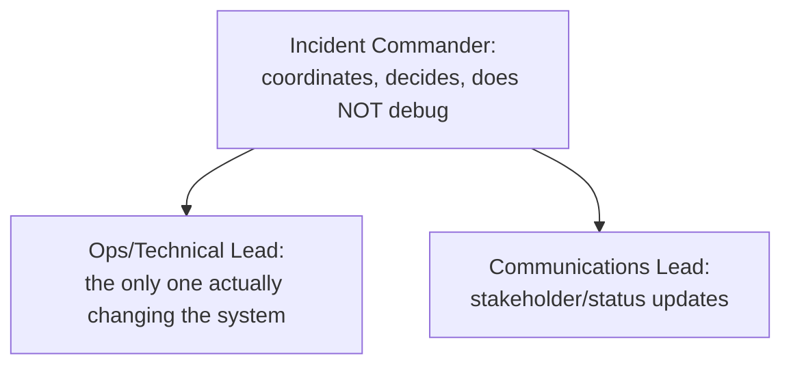

# Incident Command: Roles and Real-Time Coordination

This is the sixth chapter in `19-leadership-staff`, assigned **T-1906** — beyond this domain's own originally-planned five-topic set (T-1901–T-1905, closed 2026-09-04), a gap-audit addition the same way [Sorting Algorithms](../03-data-structures-algorithms/sorting-algorithms.md) extended `03-data-structures-algorithms` beyond its own closed plan. It draws a deliberate, explicit boundary against two existing chapters covering adjacent but genuinely different ground: [Production Incident Narratives](../20-interview-preparation/behavioral/04-production-incident-narratives.md) teaches how to turn an incident experience into a STAR interview answer, not how to actually run one; [Incident Response and Blameless Postmortems](../13-observability/incident-response-and-blameless-postmortems.md) teaches what happens *after* an incident (root-cause analysis, blameless review), not the real-time coordination structure *during* one. This chapter teaches that missing middle piece: who is actually in charge while an incident is live, what distinct roles exist, and why conflating them is a real, common, avoidable failure mode.

## 1. Why This Matters

A major outage doesn't fail to get fixed because no one on the team knows how to fix it — it fails to get fixed *quickly* because no one is clearly coordinating who's doing what, leading to duplicated effort, conflicting changes made to the system simultaneously by different people, and a communications vacuum that erodes stakeholder trust. This is a real, specific, teachable organizational skill, distinct from both individual debugging skill and post-incident process — and it's exactly the skill a Staff engineer is expected to exercise (or explicitly delegate) the moment an incident's severity crosses a real threshold.

## 2. Prerequisites

None — this is a foundational people-process topic, usable independently of this domain's other chapters.

## 3. Foundation (L1)

**Incident command is a real, named organizational structure — not an improvised "whoever's around handles it" arrangement — for coordinating a response while a live incident is still ongoing.** Its core discipline, borrowed from decades of use in emergency response (the Incident Command System, or ICS, originally developed for firefighting) and directly adopted by major tech organizations, is separating a small number of distinct roles that are dangerously easy to collapse into one person during a stressful, urgent situation:



**The single most important, most commonly violated rule: the Incident Commander coordinates; they do not personally debug the system.** Per Google's own SRE book, "the operations team should be the only group modifying the system during an incident" — the IC's job is holding the overall state of the incident, assigning work, and making calls, not being the most senior engineer heads-down in a terminal while everyone else waits for direction that never comes.

## 4. Core Concepts (L2)

**The four canonical incident-command roles** (per Google's SRE book's own naming): the **Incident Commander (IC)** holds overall responsibility for the incident's structure and delegates responsibilities as needed; the **Ops/Operations Lead** is the only person (or tightly-coordinated group) actually making changes to the system, applying fixes under the IC's direction; **Communications** is the single, designated point of contact issuing periodic status updates to stakeholders, deliberately freeing the IC and Ops lead from repeatedly answering "what's the status" during active work; **Planning** handles the incident's longer-term bookkeeping — filing follow-up bugs, arranging shift handoffs for an incident that outlasts one person's working hours — so the IC isn't also tracking that administrative load mid-incident.

**Not every incident needs all four roles activated.** A real, working severity classification (commonly SEV1 through SEV4, or similarly named tiers) determines which roles actually get staffed: a SEV4 (minor, no user impact) might be one engineer fixing something with no formal IC at all; a SEV1 (major outage, real business impact) activates the full role structure immediately. Matching role activation to actual severity — not reflexively invoking full incident command for a minor issue, and not failing to invoke it for a major one — is itself a real judgment call this topic covers.

**Role separation exists specifically because the same person cannot do all of these jobs well simultaneously under real time pressure.** Debugging requires deep, uninterrupted focus; coordinating requires constantly zooming out to track overall state and unblock others; communicating requires context-switching to translate technical state into stakeholder-appropriate language. Collapsing these into one person doesn't just create a bottleneck — it degrades the quality of every one of those jobs at once, exactly when quality matters most.

## 5. How It Works Internally (L3)

**Diffusion of responsibility is the real, specific failure mode incident command structurally prevents.** Without an explicitly named IC, a group of capable engineers responding to the same incident can each individually assume someone else is coordinating — the same well-documented social phenomenon behind the "bystander effect" — leading to real, observed outcomes like two people applying conflicting fixes simultaneously, or no one actually owning the decision to escalate. Naming one person IC removes this ambiguity by construction: there is no longer a question of who's coordinating, only whether that person is doing it well.

**A shift handoff is a real, structured event, not a silent disappearance.** For an incident spanning multiple hours or crossing a shift boundary, the outgoing IC (or Ops lead) must explicitly hand off: current state, what's been tried and ruled out, what's in progress, and who the incoming person should loop in — a real, deliberate transfer of the exact context the "Planning" role (Section 4) exists to have been tracking all along. An incident that silently loses its IC mid-response (the original IC logs off assuming someone else picked it up, and no one explicitly did) is a real, observed instance of the same diffusion-of-responsibility failure this structure exists to prevent, just occurring at a handoff boundary instead of at the start.

**IC authority is temporary and scoped to the incident, not a permanent hierarchy override.** The IC role can be assumed by an engineer who is not the most senior person in the room, and often should be someone with strong coordination skill rather than reflexively defaulting to whoever has the most tenure — the IC's real authority (to assign work, to decide when to escalate, to decide when the incident is resolved) exists only for the duration of the incident and only over how the response is organized, not as a general management authority.

## 6. Practical Usage

- **Name an IC explicitly, out loud, the moment an incident's severity crosses your organization's real threshold for activating command structure** — an unnamed, assumed IC is the single most common way this structure fails to actually engage when it's needed.
- **If you are the most senior or most knowledgeable engineer present, actively resist defaulting into being both IC and the one debugging** — explicitly hand the IC role to someone else, or explicitly hand off the debugging to someone else, but do not silently try to do both.
- **Require an explicit, spoken or written handoff summary before an IC or Ops lead disengages from a still-active incident** — not a "call me if you need me" that leaves ownership genuinely ambiguous.

## 7. Examples

A real, representative IC opening statement at the start of a SEV1 (a labeled, illustrative scenario, not a specific past incident):

```
"I'm taking IC for this. Current state: checkout is returning 500s for
roughly 40% of requests, started 8 minutes ago, no deploy in the last
2 hours so likely not a bad release. [Name] — can you take Ops lead
and start on the database connection-pool metrics? [Name] — can you
take Comms and get a status-page update out in the next 5 minutes
saying we're investigating? I'll check back with both of you in 10
minutes or sooner if anything changes."
```

This single statement performs several real, deliberate functions at once: it names the IC explicitly (removing ambiguity), states the current known facts (so no one has to ask), assigns the two other core roles by name (not "someone should..."), and sets an explicit check-in cadence (preventing the coordination gap that silence during a live incident otherwise creates).

## 8. Common Mistakes

- **The most senior engineer present becomes IC by default and then immediately starts debugging themselves** — collapsing the IC and Ops-lead roles, exactly the anti-pattern Google's own SRE guidance calls out directly.
- **No one explicitly says "I'm IC"** — everyone assumes someone else has it, and coordination never actually happens, a real instance of diffusion of responsibility.
- **Escalating every incident to full command structure regardless of severity**, or the opposite — never escalating even a genuine SEV1 to a real command structure, treating it as one engineer's solo problem.
- **A shift handoff that's just "I'm heading off, good luck"** rather than an explicit state transfer — the incoming person restarts investigation from zero instead of continuing from where the outgoing person left off.

## 9. Edge Cases

- **An incident where the actual root cause spans multiple teams**, each with their own Ops-lead-equivalent — the IC's real job here is cross-team coordination specifically, deciding which team's lead has priority at a given moment, rather than attempting to personally understand every team's internal system deeply enough to direct their work.
- **A SEV1 that turns out, once diagnosed, to be a minor issue** — the IC's real authority includes downgrading the incident's severity and stepping down the activated roles, not treating the initial severity assessment as fixed once made.
- **An IC who realizes mid-incident they are, in fact, the best person to be debugging** — the correct move is an explicit handoff of the IC role to someone else at that moment, not silently doing both, even under real time pressure.

## 10. Performance Implications

Not directly applicable in the runtime-performance sense — this topic's real "performance" metric is time-to-mitigation and time-to-resolution for an incident, and the core, evidence-backed claim (per Google's own SRE guidance) is that clear role separation reduces both by removing coordination overhead and preventing conflicting simultaneous changes to the system, rather than by making any individual engineer's own debugging faster.

## 11. Trade-offs

| Decision | Benefit | Cost |
|---|---|---|
| Activate full incident-command structure for a SEV1 | Real coordination, clear ownership, reduced diffusion of responsibility | Real overhead (multiple people pulled in) inappropriate for a minor issue |
| IC delegates debugging rather than doing it themselves | Both coordination and technical work get real, focused attention | The most knowledgeable person may not be the one directly driving the fix, which can feel slower in the moment even when it isn't |
| Explicit, structured shift handoffs | No silent loss of context or ownership across a long incident | Real time cost to produce a proper handoff summary, paid during an already-stressful situation |

## 12. Senior-Level Considerations (L3)

The Senior-level skill is recognizing, in the moment, when an incident has crossed the threshold that warrants activating explicit command structure — and being willing to either take the IC role themselves or explicitly hand it to someone else, rather than defaulting into an ambiguous, unnamed coordination gap. A Senior engineer who has internalized "IC coordinates, Ops lead fixes, these are not the same job" catches themselves before collapsing the two roles under pressure.

## 13. Staff/System-Level Considerations (L4)

At Staff scope, the real leverage is in the organizational design decision itself: defining the severity tiers, the role activation thresholds, and the handoff protocol *before* a major incident happens, so the structure is a known, rehearsed muscle rather than something invented under pressure for the first time during an actual outage. A Staff engineer's real contribution here is often not personally serving as IC on any given incident, but ensuring the organization has a real, working incident-command convention at all, and that engineers across teams know it well enough to invoke it correctly without hesitation.

## 14. Production Scenarios

No existing `production-cookbook/` entry has an incident-command-structure-specific root cause (the cookbook is technical-incident-shaped by design, per this domain's own established precedent for T-1901 and T-1905 — see this domain's `INDEX.md`).

> Planned reference: a future `production-cookbook/` entry covering a real incident that spiraled specifically because no IC was named (a real diffusion-of-responsibility failure, not a technical root cause) would be a natural, non-duplicative addition connecting this chapter's core claim to a genuine documented incident.

## 15. Interview Questions

### Question 1 — You're the most senior engineer on a call during a major outage. What do you actually do first?

**Why interviewers ask it.** Tests whether the candidate's first instinct is to start debugging personally (a common, understandable, but real anti-pattern) or to establish clear coordination first.

**Expected answer.** Explicitly name an Incident Commander (possibly themselves, possibly someone else) before diving into technical work; if taking IC themselves, explicitly delegate the actual debugging to someone else rather than doing both; assign or confirm a Communications lead so stakeholder updates don't fall on whoever happens to be free.

**Minimum acceptable answer.** States that someone should coordinate, even without the specific IC/Ops/Comms role vocabulary.

**Strong Senior answer.** Correctly names the IC role and explicitly separates it from personally debugging.

**Staff-level extension.** Connects this to severity-based role activation (not every incident needs this) and to establishing this as a standing organizational convention rather than reinventing it live.

**Common mistakes.** Immediately starting to debug personally without addressing coordination at all.

**Likely follow-ups.** "What would you do differently for a much smaller, SEV4-shaped issue?"

**Evaluation criteria (1–5).** 1: no coordination instinct at all. 3: correctly separates coordination from debugging. 5: correct separation plus severity-based judgment and organizational framing.

**Related references.** [§ Foundation](#3-foundation-l1); [§ Core Concepts](#4-core-concepts-l2).

## 16. Coding/Practice Exercises

- Draft a real IC opening statement (per [§ Examples](#7-examples)'s format) for a representative scenario: a payment-processing service returning errors for 15% of transactions, first noticed 3 minutes ago.
- Identify, for your own team or a representative one, what your organization's real (or likely) severity thresholds are, and which roles would realistically be activated at each tier.

## 17. Debugging Exercises

**Symptom:** a real, representative incident retrospective finds that two engineers each independently applied a different fix to the same system within minutes of each other, temporarily making the problem worse before anyone noticed the conflict.

**Diagnose:** this is a real, direct instance of the "operations team should be the only group modifying the system" principle (Section 3) being violated — no single Ops lead had exclusive, coordinated authority over changes, so two well-intentioned engineers acted independently. The fix is procedural, not technical: name an explicit Ops lead (or a tightly coordinated small group with real-time communication) as the *only* source of system changes during the incident, funneling all fix attempts through that single, coordinated point.

## 18. Design Exercises

**Design constraint:** propose a real, concrete severity-tier definition (e.g., SEV1 through SEV4) and role-activation table for an organization that currently has no formal incident-command convention at all.

Design this using the real, worked structure this chapter establishes: define each tier by concrete, observable criteria (user impact percentage, revenue impact, data-loss risk — not vague language like "bad"), and specify exactly which roles (IC, Ops, Comms, Planning) activate at each tier, explicitly stating that lower tiers may need only an implicit single-engineer response while the highest tier requires the full structure immediately. State explicitly why a tier-based system, rather than a single "always activate everything" or "never formally activate anything" policy, correctly matches response overhead to actual incident severity.

## 19. Further Reading

- Google's SRE book, ["Managing Incidents"](https://sre.google/sre-book/managing-incidents/) — the real, canonical source for the four-role structure and the operations-team-exclusivity principle this chapter's Foundation and Core Concepts sections cover a working subset of.
- [Incident Response and Blameless Postmortems](../13-observability/incident-response-and-blameless-postmortems.md) — the direct companion topic covering what happens after the incident this chapter's real-time coordination structure manages.

## 20. Mastery Checklist

| Level | You can... | Verify with |
|---|---|---|
| L1 | Explain what incident command is and why the IC role is distinct from actually fixing the system | [Section 3](#3-foundation-l1) |
| L2 | Name the four canonical roles (IC, Ops, Comms, Planning) and explain when full activation is versus isn't warranted | [Section 4](#4-core-concepts-l2) |
| L3 | Explain diffusion of responsibility as the specific failure mode this structure prevents, and describe a real, structured shift handoff | [Section 5](#5-how-it-works-internally-l3) |
| L4 | Diagnose a real incident that went wrong due to missing role separation (Section 17), and design a real severity-tier/role-activation system for an organization that has none (Section 18) | [Debugging Exercise](#17-debugging-exercises), [Section 13](#13-staffsystem-level-considerations-l4) |
