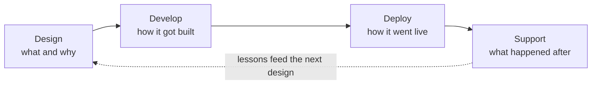

# Project Ownership Narrative: Design, Build, Deploy, Support

> **Topic register:** T-1605 · Interview Craft tier (continues the T-1601–T-1604 cluster) · Near-Certain interview frequency — a version of "walk me through a project you built" opens the overwhelming majority of real interview loops, technical or behavioral

## Table of Contents

1. [Why This Exists](#why-this-exists)
2. [Level 1 — Foundation](#level-1-foundation)
3. [Level 2 — Working Knowledge](#level-2-working-knowledge)
4. [The Four-Phase Structure](#the-four-phase-structure)
5. [The Same Project, Told at Four Seniority Levels](#the-same-project-told-at-four-seniority-levels)
6. [Scope Escalation, Phase by Phase](#scope-escalation-phase-by-phase)
7. [Common Mistakes](#common-mistakes)
8. [Staff-Level Discussion](#staff-level-discussion)
9. [Interview Questions](#interview-questions)
10. [Summary](#summary)
11. [Key Takeaways](#key-takeaways)
12. [Cheat Sheet](#cheat-sheet)
13. [Flashcards](#flashcards)
14. [Practice Exercises](#practice-exercises)
15. [Additional Reading](#additional-reading)

---

## Why This Exists

Nearly every real interview loop opens with some form of "tell me about a project you built" or "walk me through something you own" — and most candidates answer it as a list of technologies used ("I used Spring Boot, Kafka, and Docker") rather than as a story about how the thing actually got built, shipped, and kept running. A widely-circulated Java-developer job-posting checklist puts this precisely: don't stop at naming the stack — *"be prepared to explain how you designed, developed, deployed, and supported applications, not just the technologies you used."* This chapter is that missing structural skill: this repository's other technical-answer chapters teach how to answer one question ([Technical Answer Framework](technical-answer-framework.md)) and how to narrate one decision ([Trade-off Narration and ADRs](trade-off-narration-and-adrs.md)); this one teaches how to narrate an entire project's real lifecycle as a single, coherent story, and — the part most guidance skips — how that same story's scope and ownership framing legitimately changes as you grow from Junior to Staff.

## Level 1 — Foundation

Think about how a junior cook, a sous chef, and a head chef would each describe "the night we launched the new tasting menu" — same restaurant, same night, three genuinely different, equally honest stories. The junior cook describes the one station they ran and the dish they were responsible for plating correctly under pressure. The sous chef describes coordinating the whole kitchen's timing so every course landed together, and catching a supplier substitution that would have broken one dish. The head chef describes deciding the menu concept months earlier, choosing which dishes were ambitious enough to differentiate the restaurant without being too risky to execute at volume, and what changed in the kitchen's standard process after that first, chaotic night. None of the three is exaggerating — each is accurately describing their own real scope of the same project, and an interviewer can tell within seconds which kind of story matches which role.

## Level 2 — Working Knowledge

At this level, the working discipline is picking ONE real project you can speak to across all four phases — Design, Develop, Deploy, Support — even if your own personal role was concentrated in just one or two of them. A candidate who only ever describes the Develop phase ("I wrote the code for X") is giving an incomplete answer at any level above Junior, not because writing the code doesn't matter, but because an interviewer asking this question is specifically checking whether you understand the full lifecycle your code lives inside — the same reason the underlying job-posting tip singles all four phases out by name.

The second working discipline is honesty about scope: describing a Junior-scoped contribution using Staff-scoped language ("I architected the system") is a credibility failure the moment a follow-up question probes one level deeper — Section 6 below and [Common Mistakes](#common-mistakes) cover this failure mode directly, since it's the single most common way this kind of story goes wrong under real interview pressure.

## The Four-Phase Structure

| Phase | The question it answers | What a complete answer names |
|---|---|---|
| **1. Design** | What did we build, and why this way? | The real requirement or constraint, the alternatives considered, and the specific decision (use [Trade-off Narration](trade-off-narration-and-adrs.md)'s four beats here) |
| **2. Develop** | How did it actually get built? | Real implementation challenges, not just "I wrote the code" — a specific bug, a specific design choice made while implementing, a specific piece of testing discipline |
| **3. Deploy** | How did it go live, safely? | The actual rollout mechanism (CI/CD pipeline, feature flag, canary, blue-green), and what would have happened if something had gone wrong |
| **4. Support** | What happened after launch, and what did you learn? | A real production signal (a metric, an alert, an incident, a piece of user feedback) and what changed as a result — this is the phase most answers skip entirely |

Phase 4 is the one most candidates truncate or omit, for the same reason [Trade-off Narration](trade-off-narration-and-adrs.md)'s beat 4 (cost) gets skipped — "we shipped it" feels like the natural end of the story, but an interviewer asking about the full lifecycle is specifically listening for what happened *after* the deploy succeeded, since that's where real, durable engineering judgment shows up (an on-call story, a metric that revealed a wrong assumption, a piece of the design that had to change once real traffic hit it).

## The Same Project, Told at Four Seniority Levels

The example below is a **representative, illustrative project** — not a real person's actual experience — used to show how the *same underlying project* gets narrated differently as scope and ownership genuinely grow. Substitute your own real project when using this structure; the pattern to copy is the scope escalation, not this specific example.

**The project:** a notification service that consumes `OrderCompleted` events from an orders service (via Kafka) and sends the customer a confirmation email or SMS — the same service this program's own [Domain Events vs. Integration Events](../../17-architecture/domain-events-vs-integration-events.md) and [Idempotency at System Edges](../../11-system-design/idempotency.md) chapters use for their own real evidence.

### Junior version

*"I was asked to add SMS as a new notification channel to our existing order-notification service — the channel interface (`NotificationChannel`) already existed, so my job was implementing it correctly for SMS, not designing the abstraction. I wrote `SmsNotificationChannel`, followed the existing `EmailNotificationChannel`'s test pattern, and a reviewer caught that I wasn't handling the provider's rate-limit response — I added a retry-after check based on that feedback. I deployed it myself through our team's existing CI/CD pipeline once review passed, and watched the deploy dashboard for the first hour to confirm nothing broke. The following week I was on the team's support rotation; when an alert fired for a spike in SMS failures, I followed the runbook, which pointed at the SMS provider's own status page — a real outage on their end, not our bug — and I posted the update in the team channel."*

### Mid version

*"I owned adding retry-with-backoff to our notification service after we noticed the SMS provider occasionally times out mid-request. I designed the backoff schedule (exponential, capped, with a dead-letter path after 3 attempts) and the schema change needed to track delivery attempts, coordinating with the database team on the migration. I built it with a real test for the hardest edge case — a timeout that happens after the provider already sent the SMS but before we got a response — and wrote a small integration test using a fake provider that could simulate that exact race. I designed the rollout as a feature flag so we could enable retry-with-backoff for 5% of traffic first, watched the delivery-attempt metrics for a day, then ramped to 100%. Two weeks after full rollout, I noticed our dead-letter rate was higher than expected for one specific carrier — I dug into it, found that carrier's rate limit was stricter than the others, and added a per-carrier backoff configuration instead of one global setting."*

### Senior version

*"I owned the redesign of our order-notification service end to end after our old REST-polling approach couldn't keep up with order volume. I made the call to consume `OrderCompleted` events over Kafka instead, which meant designing for at-least-once delivery — I chose an idempotency key derived from the event's own order ID so a redelivered event never sends a duplicate notification, and I made sure we consumed a translated, stable integration event rather than the orders team's internal domain event directly, specifically so their internal refactors wouldn't silently break us. I built the consumer with structured logging and per-channel delivery metrics from day one, and code-reviewed the two engineers who built the email and SMS channels against that design. For deployment, I set up a canary rollout with an automatic rollback tied to our error-rate SLO, and ran a load test beforehand at 3x our estimated peak. Three months after launch, a downstream SMS provider had a real 40-minute outage — I led the incident response, and the permanent fix was adding a circuit breaker in front of that provider so a slow SMS channel couldn't back up the whole consumer and delay email notifications too. I updated the runbook and our on-call rotation's alert thresholds afterward."*

### Staff version

*"When I looked at how many of our services were independently reinventing 'consume an event, send someone a notification,' I made the case that this shouldn't be a single team's service — it should be a shared notification platform with a versioned event-contract standard other teams could adopt, rather than each team building and operating its own consumer. I didn't write most of the platform's code myself; I set the technical standards it had to meet (the idempotency-key convention, the domain-vs-integration-event boundary, the per-dependency circuit-breaker requirement) based on real incidents we'd already had in the original service, and I worked with three other teams to migrate their own ad hoc notification logic onto the shared platform, which meant negotiating a schema they could all actually commit to. For rollout, I pushed for the canary-plus-automatic-rollback pattern from the original service to become a mandatory standard for the whole platform team, not just a nice-to-have one service happened to build. A year in, when we looked across every incident the platform had, the SMS-provider outage pattern from the original service had recurred twice more for other providers before any one team noticed the systemic gap — I used that pattern to drive an org-wide requirement that any external-dependency call needs a circuit breaker before it ships, not just a recommendation, and I helped write the review checklist that now enforces it."*

## Scope Escalation, Phase by Phase

| Phase | Junior | Mid | Senior | Staff |
|---|---|---|---|---|
| **Design** | Implements one piece of an existing design (a new channel behind an existing interface) | Designs one bounded decision with real trade-offs (a retry/backoff strategy, a schema change) | Designs the service's architecture and its key trade-offs (transport choice, idempotency strategy, contract boundary) | Decides whether the service should exist at all, and sets the technical standard multiple teams design against |
| **Develop** | Writes one class/feature, applies review feedback | Builds a feature plus its hardest edge-case test, coordinates one cross-team dependency | Builds core infrastructure (the consumer itself), instruments it, reviews others' contributions | Rarely writes the code personally; sets conventions, unblocks cross-team dependencies, mentors |
| **Deploy** | Deploys their own change through an existing pipeline, watches the dashboard | Designs a scoped rollout (a feature flag, a percentage ramp) for their own feature | Designs the deployment strategy for the whole service (canary, SLO-tied rollback, pre-launch load test) | Sets the deployment/rollout standard the rest of the org adopts |
| **Support** | Follows the runbook for a known alert, escalates what it doesn't cover | Diagnoses and fixes a real bug using logs/metrics, writes a post-mortem | Owns on-call for the service, leads incident response, drives the permanent fix | Spots a systemic pattern across multiple services' incidents, drives an org-wide fix |

## Common Mistakes

- **Only describing the Develop phase.** "I wrote the code for X" answers one of four phases — at Mid level and above, an interviewer is specifically listening for Design and Support too, since those are exactly the phases the underlying job-posting tip named by name.
- **Claiming a higher level's scope than the story actually supports.** A candidate who says "I architected the system" but, under one follow-up question, reveals they implemented a single class behind an already-existing interface, loses more credibility than if they'd described the Junior-scoped contribution honestly and well.
- **Skipping the Support phase entirely.** The story ending at "and then we deployed it" is the Phase-4 version of [Trade-off Narration](trade-off-narration-and-adrs.md)'s beat-4 omission — it looks complete and isn't, and it's specifically what separates a story that shows durable engineering judgment from one that only shows the ability to ship.
- **Listing every technology touched instead of narrating the lifecycle.** Naming Spring Boot, Kafka, Docker, and Kubernetes in one sentence answers "what did you use," not "how did you design, build, deploy, and support it" — the two are genuinely different questions, and the checklist's own explicit tip is about the second one.

## Staff-Level Discussion

At Staff level, an interviewer evaluating this story is listening for organizational leverage, not individual code volume — a Staff engineer who narrates every phase in terms of "I personally wrote/decided X" for a project that clearly involved a whole team is either overstating their role or hasn't recognized that the higher-value Staff contribution is usually setting a standard, unblocking others, or spotting a pattern across systems, not being the single most productive individual contributor on the team. The Staff version of this chapter's worked example deliberately spends more narrative time on *why the platform decision mattered to multiple teams* and *what systemic pattern the incident history revealed* than on any single line of code — that shift in narrative center of gravity, from "what I built" to "what became possible or safer for others because of a decision I drove," is itself the thing a Staff loop is screening for.

## Interview Questions

### Question 1 — "Walk me through a project you built, from initial design through how you supported it after launch."

**Why interviewers ask it.** This is one of the most common opening questions in any real interview loop, and it's a single question that tests four different things at once: technical depth, ownership, communication structure, and — most revealingly — whether the candidate's described scope actually matches the seniority they're interviewing for.

**Expected answer.** All four phases (Design, Develop, Deploy, Support) present, each with a specific, concrete detail rather than a generic description, and a scope of ownership consistent with the role being interviewed for.

**Minimum acceptable answer.** Covers Design and Develop clearly; Deploy and Support present but thin.

**Strong Senior answer.** All four phases present with specific detail, including a real trade-off in Design and a real production signal in Support, at a scope matching "owned the service."

**Staff-level extension.** Frames the story's highest-value contribution as a decision, standard, or pattern that affected more than the candidate's own individual output — per [Staff-Level Discussion](#staff-level-discussion) above.

**Common mistakes.** Only covering Develop; claiming a scope the follow-up questions can't support; listing technologies instead of narrating the lifecycle.

**Likely follow-ups.** "What would you have done differently in the Design phase, knowing what you learned in Support?" "Who else was involved, and what did they own versus what did you own?"

**Evaluation criteria (1–5).** 1: technology list only, no lifecycle structure. 3: covers Design/Develop/Deploy but Support is thin or missing. 5: all four phases present, specific, honestly scoped, and — at Senior/Staff — connects Support's lessons back to Design.

### Question 2 — "How would this same story sound different if you were interviewing for a more senior role than the one you actually held at the time?"

**Why interviewers ask it.** Tests self-awareness of scope framing directly — this question is deliberately not asking the candidate to fabricate a bigger role, but to demonstrate they understand *what* changes about the same real facts as ownership scope grows (per [Scope Escalation, Phase by Phase](#scope-escalation-phase-by-phase)).

**Expected answer.** Names specifically which parts of the story would shift emphasis (e.g., "I'd spend less time on the specific retry logic I wrote and more time on why we chose Kafka over polling in the first place, since that's the Design-level decision a Senior version of this story would center") without changing the underlying facts.

**Minimum acceptable answer.** Recognizes that scope framing, not the facts, is what would change.

**Strong Senior answer.** Gives a concrete example of a specific narrative shift, grounded in this chapter's own phase structure.

**Staff-level extension.** Explicitly distinguishes "the same facts, told with different emphasis" from "a bigger, embellished version of the same facts" — and can articulate why interviewers can usually tell the difference (the embellished version can't survive a specific follow-up question the honestly-scoped version can).

**Common mistakes.** Interpreting the question as permission to inflate the story rather than to reframe emphasis on the same real facts.

**Likely follow-ups.** "What's the honest limit of how senior a framing this specific project could actually support?"

**Evaluation criteria (1–5).** 1: doesn't distinguish framing from fabrication. 3: recognizes framing changes, vague on specifics. 5: names a specific, concrete emphasis shift and can defend the honest limit of the story's real scope.

## Summary

Nearly every interview loop opens with some form of "tell me about a project," and most candidates answer it as a technology list rather than a lifecycle story. A complete answer names four phases — Design (what and why), Develop (how it got built), Deploy (how it went live safely), and Support (what happened after, and what changed) — and Support is the phase most answers skip, the same way trade-off narration's "cost" beat gets skipped. The same real project can be told honestly at any seniority level; what changes is scope and narrative center of gravity, not the underlying facts, and claiming a higher scope than the story can support is a credibility failure the moment a follow-up question probes one level deeper.

## Key Takeaways

- Four phases, every time: Design, Develop, Deploy, Support — Support is the one most commonly skipped, and the one that shows durable engineering judgment.
- "I used Spring Boot, Kafka, and Docker" answers a different, weaker question than "how did you design, build, deploy, and support it" — the underlying job-posting tip is specifically about the second question.
- The same real project, narrated honestly, escalates in scope from Junior (implemented one piece) to Staff (decided whether it should exist, set the standard others build against) — see the phase-by-phase table.
- Claiming a scope the story can't support under one follow-up question is worse than honestly describing a smaller, well-executed scope.

## Cheat Sheet

**Mental model:** a junior cook, a sous chef, and a head chef describing the same restaurant launch night — three honest, differently-scoped stories about the same real event.
**Four phases:** Design (what/why) → Develop (how built) → Deploy (how shipped safely) → Support (what happened after, what changed).
**Most-skipped phase:** Support — ending the story at "and then we deployed it" is incomplete.
**Scope escalation, one line each:** Junior implements a piece → Mid owns a bounded decision → Senior owns the service's architecture and incidents → Staff decides whether it should exist and sets the standard.
**Related:** [Technical Answer Framework](technical-answer-framework.md) · [Trade-off Narration and ADRs](trade-off-narration-and-adrs.md) · [Production Incident Narratives](../behavioral/04-production-incident-narratives.md)

## Flashcards

### Card: The four phases, in order

**Prompt:**
Name the four phases of a complete project-ownership narrative, in order.

**Answer:**
Design, Develop, Deploy, Support.

**Why it matters:**
Most candidates only narrate Develop ("I wrote the code") — a complete answer covers all four, and Support is the one most commonly skipped entirely.

**Common trap:**
Ending the story at "and then we deployed it," skipping Support.

**Related:**
[The Four-Phase Structure](#the-four-phase-structure)

### Card: What changes across seniority levels, and what doesn't

**Prompt:**
When the same real project is narrated at a higher seniority level, what actually changes?

**Answer:**
Scope and narrative emphasis change — not the underlying facts. A Staff-level telling centers the decision/standard/pattern that affected multiple people; it doesn't fabricate a bigger role.

**Why it matters:**
Claiming a scope the story can't support fails the moment a follow-up question probes one level deeper.

**Common trap:**
Treating "tell it at a more senior level" as permission to embellish rather than to shift emphasis honestly.

**Related:**
[The Same Project, Told at Four Seniority Levels](#the-same-project-told-at-four-seniority-levels)

### Card: Why the Support phase matters most

**Prompt:**
Why is the Support phase the most revealing part of this kind of answer?

**Answer:**
It's the phase most candidates skip, and the one where real, durable engineering judgment shows up — a real production signal (an incident, a metric, user feedback) and what changed as a result, the same way trade-off narration's "cost" beat is the most commonly skipped but most revealing part of a trade-off answer.

**Why it matters:**
An interviewer asking "how did you support it" is specifically checking for this, not asking a throwaway closing question.

**Common trap:**
Treating Support as an optional coda rather than a required, load-bearing phase.

**Related:**
[Staff-Level Discussion](#staff-level-discussion)

## Practice Exercises

1. Pick one real project you've worked on. Write out all four phases explicitly — Design, Develop, Deploy, Support — for your own actual role. If Support is thin or missing, that's the honest gap to close before your next interview, not something to paper over.
2. Take that same project and write the Mid-level and Senior-level version of its story (per [Scope Escalation, Phase by Phase](#scope-escalation-phase-by-phase)), even if your actual role was Junior-scoped — then check honestly which version your real facts can actually support under a specific follow-up question.

## Additional Reading

- [Technical Answer Framework](technical-answer-framework.md) — the nine-layer structure this chapter's phase-by-phase narration plugs into as a real, worked "Production Example" layer.
- [Trade-off Narration and ADRs](trade-off-narration-and-adrs.md) — the four-beat structure for narrating the Design phase's specific decisions in depth.
