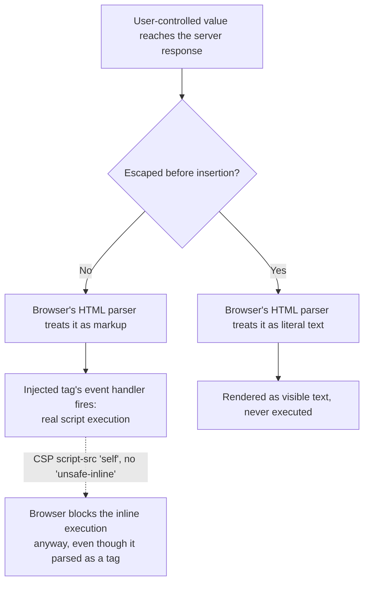

# Frontend Security: XSS, CSRF, and Content Security Policy

> **Topic register:** F-401 (Frontend Security: XSS, CSRF, and CSP) · Advanced tier · `00-project/frontend-topic-register.md` — new, opening a "D-F4 · Advanced Frontend Architecture & Security" section, added 2026-09-11 by a full repository-wide gap audit that found this domain (40 originally-registered topics, all written) had zero dedicated frontend-security coverage, despite the backend's own `12-security` domain covering the equivalent server-side ground.
> **Scope note:** distinct from [AuthN vs AuthZ, RBAC vs ABAC](../12-security/authn-authz-rbac-vs-abac.md), which covers backend identity and permission models — this chapter covers what a frontend engineer specifically controls: what gets rendered into the DOM and how, and what a browser will and won't execute given a specific response header.
> **Provenance:** every claim in this chapter is verified against a real Node HTTP server driven by a real, headless Chromium browser (Playwright) at [`practice/frontend/frontend-security-xss-and-csp/`](../../practice/frontend/frontend-security-xss-and-csp/README.md) — a real reflected-XSS payload actually executing in a real browser, and a real CSP header actually blocking it, not a simulated DOM.

## Table of Contents

1. [Learning Objectives](#learning-objectives)
2. [Why This Matters in Interviews](#why-this-matters-in-interviews)
3. [Mental Model](#mental-model)
4. [Definition and Purpose](#definition-and-purpose)
5. [Core Concepts](#core-concepts)
6. [Internal Implementation](#internal-implementation)
7. [Diagrams](#diagrams)
8. [Real Verified Demos](#real-verified-demos)
9. [Production Scenarios](#production-scenarios)
10. [Trade-offs](#trade-offs)
11. [Decision Framework](#decision-framework)
12. [Common Mistakes](#common-mistakes)
13. [Anti-Patterns](#anti-patterns)
14. [Best Practices](#best-practices)
15. [Interview Answer Framework](#interview-answer-framework)
16. [Interview Questions](#interview-questions)
17. [Summary](#summary)
18. [Key Takeaways](#key-takeaways)
19. [Cheat Sheet](#cheat-sheet)
20. [Flashcards](#flashcards)
21. [Practice Exercises](#practice-exercises)
22. [Solutions](#solutions)
23. [Additional Reading](#additional-reading)
24. [Official References](#official-references)

---

## Learning Objectives

By the end of this chapter you can:

- Explain exactly what makes an XSS payload actually execute in a real browser (which HTML/attribute vectors run script, which don't), proven here with a real, captured execution.
- State precisely why HTML-escaping untrusted input before rendering neutralizes the identical payload, and prove it with a real, controlled contrast.
- Explain what a Content-Security-Policy header actually does at the browser-engine level, and prove a real CSP header blocking real inline script execution.
- Explain CSRF as a real, distinct problem from XSS (a forged *request*, not injected *script*) and name the real, standard defenses.

## Why This Matters in Interviews

Frontend security questions separate candidates who can recite "sanitize your inputs" from candidates who can explain the actual browser mechanism a specific defense relies on — and this chapter closes exactly that gap with real, executed evidence: a real payload that really runs in a real Chromium instance, the identical payload rendered inert by a real defense, and a real CSP header genuinely blocking real script execution, with the browser's own real console message as proof. A Staff-level frontend interview increasingly expects this depth, not just a checklist of OWASP terms.

## Mental Model

**A browser will parse and execute whatever HTML and script it's given the actual bytes for — it has no way to distinguish "HTML the developer wrote" from "HTML that happens to contain a value a user typed," unless the application itself draws that line by escaping untrusted data before it becomes markup.** XSS is what happens when that line isn't drawn: user-controlled data ends up being *parsed as HTML/script* instead of being *displayed as text*. CSRF is a genuinely different problem sharing only the "web security" label: it's not about what gets rendered at all — it's about a browser automatically attaching a user's own credentials (cookies) to a request the user never actually intended to make, to a site they're already authenticated with.

## Definition and Purpose

**Cross-Site Scripting (XSS)** occurs when an application includes untrusted, attacker-influenced data in its output without properly escaping it, causing a browser to parse that data as executable HTML/JavaScript rather than inert text — the OWASP-documented root cause behind one of the web's longest-standing vulnerability classes. **Content Security Policy (CSP)** is a real, browser-enforced HTTP response header (`Content-Security-Policy`) that lets a server declare, and have the browser actually enforce, restrictions on what a page is allowed to load or execute (which script sources are trusted, whether inline `<script>` tags may run at all) — a real, structural second line of defense against XSS, not a replacement for escaping untrusted output in the first place. **Cross-Site Request Forgery (CSRF)** exploits the browser's own default behavior of automatically attaching cookies to any request to a site the user is authenticated with, regardless of which page or origin triggered that request — tricking a logged-in user's browser into submitting an unwanted, authenticated request to a site the user didn't intend to interact with.

## Core Concepts

### Reflected XSS is untrusted input becoming real, parsed markup

This chapter's own real demo proves the mechanism directly, not by description: a query-string value concatenated, unescaped, directly into a server's HTML response causes a real Chromium browser to parse an injected `` tag as genuine markup — the browser then tries to load the (deliberately broken) image, fails, and fires the real `onerror` handler, executing attacker-controlled JavaScript. The vulnerability isn't "the server trusted user input" in the abstract — it's the specific, mechanical fact that unescaped input landed in a position the HTML parser treats as markup, not text.

### Escaping is what actually breaks the attack, mechanically

Escaping the same untrusted value (converting `<` to `&lt;`, `>` to `&gt;`, and so on) before insertion doesn't remove or "clean" the payload — it changes what the browser's HTML parser sees. This chapter's own real demo proves this precisely: the identical payload, HTML-escaped, renders as visible, literal text on the page (the user sees the actual angle brackets and attribute syntax as text) — the browser's parser never treats it as a tag at all, so there's no `onerror` handler to fire, because from the parser's perspective, no `` element was ever declared.

### CSP is real, browser-engine-level enforcement, not an application-level filter

A `Content-Security-Policy` header doesn't change what a server sends — it tells the *browser itself* what it's allowed to execute, and the browser enforces that independently of anything the page's own JavaScript does. This chapter's own real demo proves this directly: an identical inline `<script>` tag runs normally with no CSP header present, and is genuinely blocked — never executing — when the identical page is served with `Content-Security-Policy: script-src 'self'`, with Chromium's own real console reporting the exact violation. This is why CSP is valuable even as a *second* layer behind escaping: it can block exploitation of an XSS vulnerability the application itself failed to prevent, as long as the specific attack requires inline script execution CSP disallows.

### CSRF requires a different defense entirely, because the problem is different

Because CSRF exploits the browser's automatic cookie-attachment behavior, escaping HTML output does nothing to prevent it — the real, standard defenses are a server-issued, per-session CSRF token that must be included in the request body (not automatically attachable the way a cookie is) and verified server-side, and the `SameSite` cookie attribute (`Lax` or `Strict`), which tells the browser itself not to attach that cookie to cross-site requests in the first place.

## Internal Implementation

Real, captured evidence from `practice/frontend/frontend-security-xss-and-csp/output-transcript.txt`, run against a real Node HTTP server and a real, headless Chromium browser (Playwright):

**Reflected XSS actually executing**, from unescaped server-side concatenation:

```text
window.xssFired === true ? true
rendered #greeting innerHTML: Hello, 
```

**The identical payload, HTML-escaped, rendered inert**:

```text
window.xssFired === true ? false
rendered #greeting text (payload shown literally, not executed): Hello, 
```

**A real CSP header genuinely blocking real inline script execution**, with Chromium's own real console message:

```text
Response CSP header: default-src 'self'; script-src 'self'
#marker text (expect: NOT set, script blocked): not set
Real CSP violation reported in browser console:
  Executing inline script violates the following Content Security Policy directive 'script-src 'self''. Either the 'unsafe-inline' keyword, a hash (...), or a nonce (...) is required to enable inline execution. The action has been blocked.
```

The identical inline `<script>` tag, served without that header, ran normally (`#marker text: inline script ran`) — the only variable changed between the two runs is the presence of the CSP header, and that alone is what flips real, observed browser behavior.

## Diagrams



## Real Verified Demos

Both scenarios are real, executed output from a real Node HTTP server driven by a real, headless Chromium browser — [`practice/frontend/frontend-security-xss-and-csp/`](../../practice/frontend/frontend-security-xss-and-csp/README.md), not a simulated DOM (jsdom cannot enforce CSP the way a real browser engine does). Full captured transcript in the practice pack's own [README.md](../../practice/frontend/frontend-security-xss-and-csp/README.md):

- [`server.js`](../../practice/frontend/frontend-security-xss-and-csp/server.js) — four real routes: unescaped reflection, escaped-safe, no-CSP inline script, CSP-protected inline script.
- [`run.js`](../../practice/frontend/frontend-security-xss-and-csp/run.js) — drives a real Chromium instance against all four, capturing real `window` state, real rendered DOM content, and real browser console CSP violations.

## Production Scenarios

### Scenario: a "search results for: {query}" page is found to be exploitable months after shipping

**Symptoms.** A security review (or a real bug bounty report) finds that a search page's "Showing results for: `<query>`" display executes injected script when the query parameter contains specific markup.

**Impact.** An attacker can craft a URL that, once clicked by a victim, executes arbitrary JavaScript in that victim's authenticated session — a real, serious vulnerability (session hijacking, credential theft, unauthorized actions performed as the victim).

**Initial hypotheses.** A framework-level bug (checked — the underlying template engine correctly escapes by default; this specific line bypassed it, e.g., via a "raw HTML" or `dangerouslySetInnerHTML`-style escape hatch used for a legitimate reason elsewhere and then reused here by habit); a browser-specific quirk (checked — reproduces identically across browsers, since it's a real HTML-parsing behavior, not an implementation quirk); the real cause: the query value was inserted into the page without going through the framework's default escaping path (correct).

**Diagnosis.** Locate the exact rendering call that bypassed escaping — this chapter's own real demo isolates the mechanism precisely: the presence or absence of escaping before insertion is the entire, single variable controlling whether the identical input executes or displays as text.

**Immediate mitigation.** Restore default escaping for this specific output, or, if raw HTML insertion is genuinely required for this feature, route it through a real, dedicated HTML-sanitization library rather than raw string concatenation.

**Permanent remediation.** Audit the codebase for other uses of the same "raw HTML" escape hatch, and add a CSP header (`script-src 'self'`, no `'unsafe-inline'`) as this chapter's own real demo shows can independently block a class of exploitation even if a future escaping bug slips through.

**Alternatives considered.** Relying on CSP alone, without fixing the escaping bug — rejected: CSP would only block *some* exploitation techniques (inline script, in this chapter's own demo) and provides no protection against payloads that don't require inline script execution at all (e.g., an attribute-based handler already present on an allowed, same-origin script, or a data-exfiltration technique not requiring new script execution).

**Trade-offs.** Defense-in-depth (both escaping and CSP) costs real, upfront configuration effort for the CSP policy itself, which must be kept in sync with the application's actual, legitimate script sources — worthwhile given that either layer alone leaves a real gap the other closes.

**Prevention.** Default to framework-provided escaping everywhere; treat any "raw HTML insertion" code path as a reviewed, justified exception, not a convenience; add CSP as a real, independent second layer, not a substitute for the first.

**Interview lesson.** A single escaping bug in one output path is a real, common, findable-in-review mistake — the concrete fix (restore escaping) and the concrete second layer (CSP) are both real, specific, demonstrable defenses, not a vague "be careful with user input."

## Trade-offs

| Decision | Benefit | Cost |
|---|---|---|
| Escaping untrusted output by default (framework-provided) | Real, structural prevention of the most common XSS vector | A genuine "raw HTML" need requires an explicit, reviewed escape hatch |
| A strict CSP (`script-src 'self'`, no `'unsafe-inline'`) | Real, browser-enforced second layer, blocking a class of exploitation even if escaping fails somewhere | Breaks any legitimate inline `<script>` usage; requires real, ongoing policy maintenance as the app's script sources change |
| CSRF tokens plus `SameSite` cookies | Real, standard, well-understood defense against forged requests | Real added complexity in request handling (token generation, verification) versus relying on cookies alone |

## Decision Framework

1. **Does this specific output path insert user-controlled or otherwise untrusted data into HTML?** If yes, verify it goes through real, default escaping — never assume a framework escapes automatically without checking the specific call used.
2. **Does the application have a real, deployed CSP header, and does it disallow `'unsafe-inline'`?** If not, this chapter's own real demo shows exactly what protection is being left on the table.
3. **Does this feature involve a state-changing request (not just a GET)?** If so, verify a real CSRF defense (token, `SameSite` cookie) is in place — escaping and CSP do nothing for this genuinely different problem.

## Common Mistakes

- Assuming a framework escapes all output by default without verifying the *specific* rendering call used actually goes through that path (a "raw HTML" escape hatch is a common, real exception).
- Treating CSP as a replacement for escaping, rather than a real, independent second layer.
- Confusing XSS defenses (escaping, CSP) with CSRF defenses (tokens, `SameSite`) — they solve genuinely different problems and neither substitutes for the other.

## Anti-Patterns

- **Concatenating untrusted input directly into an HTML template string**, the exact real vulnerability this chapter's own demo reproduces and executes in a real browser.
- **Deploying a CSP with `'unsafe-inline'` "to make things easier,"** which defeats CSP's real value against exactly the inline-script-execution vector this chapter's own demo shows it can otherwise block.
- **Relying on cookies alone for session state with no CSRF token or `SameSite` protection**, leaving a real, distinct vulnerability unaddressed by any XSS-focused defense.

## Best Practices

- Default to framework-provided output escaping everywhere; treat any bypass as a reviewed, justified, explicit exception.
- Deploy a real, restrictive CSP (`script-src 'self'`, no `'unsafe-inline'`) as a genuine second layer, verified — as this chapter's own demo does — to actually block what it claims to block.
- Use CSRF tokens and `SameSite` cookies together for state-changing requests, treating CSRF as a distinct problem from XSS requiring its own, separate defense.

## Interview Answer Framework

### 30-Second Answer

XSS happens when untrusted input gets parsed as HTML/script instead of displayed as text — proven directly in this chapter's own demo, where an unescaped payload executes in a real browser and the identical, escaped payload renders as literal text instead. CSP is a real, browser-enforced header that can independently block script execution (inline scripts, in this chapter's own demo) as a second defense layer. CSRF is a different problem entirely — a forged request exploiting automatic cookie attachment — defended against with tokens and `SameSite` cookies, not escaping or CSP.

### 2-Minute Answer

Definition: XSS is untrusted data being parsed as executable markup; CSP is a browser-enforced restriction on what a page may load/execute; CSRF is a forged, cookie-authenticated request. Why they're distinct: they target different mechanisms (what gets rendered, what a browser will execute, what a browser automatically attaches to a request) and need different defenses. How the defenses work: escaping changes what the HTML parser sees, proven by a real before/after contrast in this chapter; CSP is enforced by the browser engine itself, proven by a real blocked inline script with the browser's own console message as evidence; CSRF tokens and `SameSite` cookies address the request-forgery mechanism specifically. One important trade-off: CSP requires real, ongoing policy maintenance and can break legitimate inline scripts if not scoped carefully. Production example: a single unescaped output path found and exploited months after shipping, fixed by restoring escaping and adding CSP as a second layer.

### 10-Minute Deep Dive

Cover, in order: the mental model — browsers execute whatever bytes they're given, and defenses exist specifically to draw the line between data and markup (mental model); the real mechanism of reflected XSS and why escaping breaks it, with real evidence (core concepts, internal implementation); CSP as genuine browser-engine enforcement, with a real blocked-script proof (core concepts, internal implementation); CSRF as a genuinely different problem with its own defenses (core concepts); and close with the production scenario — a real-shaped incident from one unescaped output path, fixed with both layers.

### Whiteboard Explanation

Draw the [§ Diagrams](#diagrams) flowchart, narrating: unescaped input becomes real markup, whose event handler fires — real script execution; escaped input stays literal text — nothing fires; and, even for markup that *did* get parsed as a real tag, a strict CSP can still block the inline execution as an independent, second gate.

### Production Example

The unescaped-search-page scenario in [§ Production Scenarios](#production-scenarios): a real-shaped vulnerability from one output path bypassing default escaping, found via review, fixed by restoring escaping and adding a real, restrictive CSP as an independent second layer.

### Trade-offs to Mention

State unprompted: escaping is the real, primary defense but a genuine "raw HTML" need requires an explicit, reviewed exception; CSP is a real, powerful second layer but requires ongoing policy maintenance and can break legitimate inline scripts; CSRF needs its own, separate defense — neither escaping nor CSP addresses it.

### Common Candidate Mistakes

Describing XSS defense only as "sanitize your inputs" without explaining the actual browser-parsing mechanism; treating CSP as an XSS cure-all rather than a second layer; conflating CSRF with XSS as if one defense (escaping) covers both.

### Typical Follow-Up Questions

1. "A CSP with `script-src 'self'` is deployed, but a reflected-XSS payload using an `` attribute still executes. Why didn't CSP stop it?"
2. "Why doesn't HTML-escaping help against CSRF?"

### Senior-Level Expectations

Correctly explains the escaping mechanism and can distinguish XSS, CSP, and CSRF as three genuinely different problems requiring different defenses.

### Staff-Level Discussion

The Staff-level move is treating frontend security as defense-in-depth by design — escaping as the primary, structural control; CSP as a genuinely independent second layer that can contain a class of failures in the first; CSRF defended separately because it's mechanically unrelated — and recognizing that a security review asking "is this feature safe" needs an answer addressing all three mechanisms explicitly, not a single "yes, we sanitize inputs" that only speaks to one of them. A Staff engineer reviewing a new feature's security checks each mechanism independently rather than treating "security" as one checkbox.

## Interview Questions

### Question 1 — A CSP with `script-src 'self'` is deployed, but a reflected-XSS payload using an `` attribute still executes. Why didn't CSP stop it?

**Why interviewers ask it.** Tests whether the candidate understands CSP's real, specific scope (blocking script *sources*/inline script execution) rather than treating it as a general XSS blocker.

**Expected answer.** `script-src 'self'` restricts which script *sources* may execute and blocks inline `<script>` tags specifically — but an `onerror`/`onload` event-handler attribute on a non-script element (like ``) is a real, separate execution vector some CSP configurations don't fully close unless the policy also disallows inline event handlers specifically (and even then, the real, primary fix is preventing the injection from becoming markup at all — escaping).

**Minimum acceptable answer.** States that CSP has a specific, limited scope and isn't a universal XSS blocker, even without the precise attribute-handler detail.

**Strong Senior answer.** Correctly names the event-handler-attribute vector as outside `script-src`'s specific coverage in some configurations.

**Staff-level extension.** Reframes the real lesson: CSP is a valuable, real second layer, but escaping untrusted output remains the primary, structural fix — this chapter's own demo's central claim.

**Common mistakes.** Assuming any CSP header makes XSS impossible, rather than understanding its specific, real scope.

**Likely follow-ups.** "What would you check first if you found this in a security review?"

**Evaluation criteria (1–5).** 1: no real understanding of CSP's scope. 3: correctly identifies CSP's limited coverage. 5: correct identification plus the escaping-is-primary reframing.

**Related references.** [§ Core Concepts](#core-concepts); [§ Internal Implementation](#internal-implementation).

---

### Question 2 — Why doesn't HTML-escaping help against CSRF?

**Why interviewers ask it.** Tests whether the candidate understands CSRF as a mechanically different problem, not a variant of XSS.

**Expected answer.** CSRF doesn't involve injecting or rendering anything at all — it exploits the browser's own default behavior of automatically attaching a user's cookies to any request to a site they're authenticated with, regardless of which page triggered that request. Escaping controls what gets parsed as markup; it has no bearing on which requests a browser sends or which cookies it attaches. CSRF needs its own defense: a token the attacker's page can't obtain, or a `SameSite` cookie attribute telling the browser not to attach the cookie cross-site at all.

**Minimum acceptable answer.** States that CSRF and XSS are different problems, even without the specific cookie-attachment mechanism.

**Strong Senior answer.** Correctly explains the automatic-cookie-attachment mechanism CSRF exploits.

**Staff-level extension.** Names both real standard defenses (CSRF tokens, `SameSite` cookies) and explains why using both is more robust than either alone.

**Common mistakes.** Assuming "we escape our output" is a sufficient security answer covering CSRF as well as XSS.

**Likely follow-ups.** "What's the difference between `SameSite=Lax` and `SameSite=Strict`?"

**Evaluation criteria (1–5).** 1: conflates CSRF with XSS. 3: correctly explains CSRF as a distinct, cookie-based mechanism. 5: correct explanation plus both real, named defenses.

**Related references.** [§ Definition and Purpose](#definition-and-purpose); [§ Core Concepts](#core-concepts).

## Summary

XSS occurs when untrusted data is parsed as executable markup instead of displayed as text — this chapter's own real demo proves the exact mechanism: an unescaped payload executes in a real browser, and the identical, escaped payload renders as inert, literal text. CSP is a real, browser-enforced second layer, proven here by a real, blocked inline script with the browser's own console violation message as direct evidence — and by the identical script running normally without that header. CSRF is a mechanically different problem (exploiting automatic cookie attachment, not markup parsing) requiring its own, separate defenses (tokens, `SameSite` cookies) that escaping and CSP do not provide.

## Key Takeaways

- XSS is untrusted data being parsed as markup, not displayed as text — proven directly with a real payload executing in a real browser, and the identical, escaped payload rendering as text instead.
- CSP is genuine browser-engine enforcement, independently verifiable, proven here by a real blocked inline script with the exact browser console violation captured.
- CSRF is a mechanically different problem (forged, cookie-authenticated requests) that neither escaping nor CSP addresses — it needs its own defenses (tokens, `SameSite`).
- Defense-in-depth (escaping plus CSP) is the real, recommended posture — CSP can contain a class of failures in the primary escaping defense, but is not a substitute for it.

## Cheat Sheet

| Need | Defense |
|---|---|
| Prevent untrusted data from being parsed as markup | Default output escaping (framework-provided) |
| A real, browser-enforced second layer against script execution | `Content-Security-Policy: script-src 'self'` (no `'unsafe-inline'`) |
| Prevent a forged, cookie-authenticated request | A per-session CSRF token, verified server-side |
| Stop a browser from attaching cookies to cross-site requests | `SameSite=Lax` or `SameSite=Strict` on the session cookie |
| Verify a CSP header is real and enforced, not just present | Check a real browser's console for a real violation on a deliberately-blocked action |

## Flashcards

### Card: What actually makes XSS execute

**Prompt:**
What's the real, mechanical reason an XSS payload executes in a browser?

**Answer:**
Untrusted input reaches the page unescaped, so the browser's HTML parser treats it as real markup (a tag, an attribute) instead of literal text — proven directly in this chapter's own demo, where an unescaped `` payload really executes, and the identical, escaped payload renders as visible text instead.

**Why it matters:**
Distinguishes a real, mechanical understanding from reciting "sanitize your inputs."

**Common trap:**
Assuming XSS is about "malicious code" in the abstract, rather than specifically about untrusted data landing in a markup-parsing position.

**Related:**
[Core Concepts](#core-concepts)

### Card: CSP is real browser enforcement, not an app-level filter

**Prompt:**
Does a Content-Security-Policy header change what the server sends, or what the browser will execute?

**Answer:**
What the browser will execute. The server sends the identical HTML either way — CSP is a real, browser-engine-enforced restriction, proven directly in this chapter's own demo: the identical inline script runs with no CSP header and is genuinely blocked (with a real, captured browser console violation) when the CSP header is present.

**Why it matters:**
Clarifies that CSP is enforcement by the browser, independently verifiable — not application logic that could silently fail to run.

**Common trap:**
Treating CSP as equivalent to server-side input sanitization, rather than a genuinely separate, browser-side enforcement layer.

**Related:**
[Internal Implementation](#internal-implementation)

## Practice Exercises

1. Run the [existing practice demo](../../practice/frontend/frontend-security-xss-and-csp/README.md) yourself and confirm the same real execution, escaping, and CSP-blocking results reproduce.
2. Modify the demo's CSP header to add `'unsafe-inline'` to `script-src`, and predict (then verify) whether the inline script now runs.
3. Design a CSRF defense for a real, representative form-submission endpoint that currently relies on cookies alone, using both a token and a `SameSite` attribute.

## Solutions

**Exercise 1.** Reproducing the demo should show the identical real results: `window.xssFired === true` for the unescaped case, `false` for the escaped case, and the identical CSP-header-present-vs-absent contrast for the inline script.

**Exercise 2.** Adding `'unsafe-inline'` to the CSP's `script-src` directive should make the inline script run again (`#marker` text changes to "inline script ran") — real, direct proof that `'unsafe-inline'` specifically re-enables the exact execution path the stricter policy blocked.

**Exercise 3.** Add a per-session CSRF token, generated server-side, included as a hidden form field (not a cookie, since cookies are exactly what's automatically attached and thus not a safe channel for this token), verified against the session on submission; add `SameSite=Lax` (or `Strict`, if the flow doesn't need cross-site navigation to work) to the session cookie so the browser itself declines to attach it to a cross-site-originated request in the first place — two independent, complementary layers.

## Additional Reading

- MDN's own Content Security Policy guide, for the complete real directive reference this chapter covers a working subset of
- OWASP's XSS reference, for the broader real taxonomy (reflected, stored, DOM-based) this chapter's own demo covers the reflected case of directly

## Official References

- [MDN — Content Security Policy (CSP)](https://developer.mozilla.org/en-US/docs/Web/HTTP/Guides/CSP)
- [OWASP — Cross Site Scripting (XSS)](https://owasp.org/www-community/attacks/xss/)
