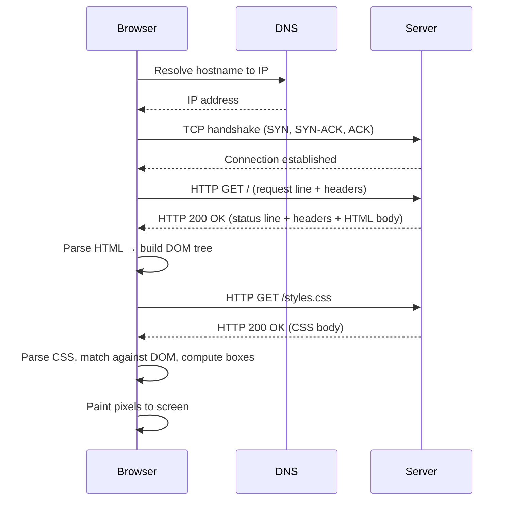
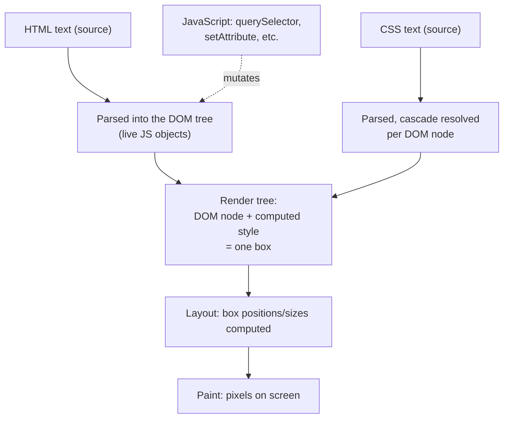

# How the Web Works: HTML, CSS, the DOM, and HTTP

> **Topic register:** F-001, the first entry of a new "D-F0 · Web & Language Fundamentals" register section, BEG tier — `00-project/frontend-topic-register.md` (register text pending a centralized update by another workstream; this chapter is written to be F-001 in that section regardless of exact wording). This is the true starting point of the entire frontend domain: every other chapter, from [React Fundamentals](react-fundamentals-jsx-components-props-and-state.md) onward, assumes everything in this one.
> **Scope note:** an audit of `syllabus/21-frontend-web/` (32 chapters, spanning Beginner through Expert React/Next.js) found zero chapters explaining HTML semantics, the CSS box model, the DOM, or HTTP — every one of them assumes this literacy already exists. This mirrors a gap already found and fixed on the Java backend side (`syllabus/06-databases/sql-and-relational-database-fundamentals.md`, written because the databases domain assumed relational-modeling literacy). This chapter is that missing floor for the frontend domain: it exists so a reader who has never built a web page can start here and read forward through the entire domain without a silent assumption gap.
> **Provenance:** every HTML/CSS/DOM claim in this chapter is backed by a real, served static site at [`practice/frontend/web-fundamentals/`](../../practice/frontend/web-fundamentals/) (`index.html`, `styles.css`, `app.js`). Every HTTP claim is backed by a real, captured `curl -v` transcript against that page — [`curl-transcript.txt`](../../practice/frontend/web-fundamentals/curl-transcript.txt) — with one disclosed limitation: this environment blocks TCP connections to `127.0.0.1`, so the transcript was captured over a Unix domain socket instead of TCP (see that file's capture note and the demo's `README.md` for the standard TCP-based reproduction and why the HTTP semantics are identical either way). There is no GUI browser in this environment; DOM/box-model claims are honest, precise instructional narration about what a reader would see in real DevTools, not a claimed screenshot.

## Table of Contents

1. [Learning Objectives](#learning-objectives)
2. [Why This Matters in Interviews](#why-this-matters-in-interviews)
3. [Mental Model](#mental-model)
4. [Definition and Purpose](#definition-and-purpose)
5. [Core Concepts](#core-concepts)
6. [Internal Implementation](#internal-implementation)
7. [Diagrams](#diagrams)
8. [Real Verified Demos](#real-verified-demos)
9. [Production Scenarios](#production-scenarios)
10. [Trade-offs](#trade-offs)
11. [Decision Framework](#decision-framework)
12. [Common Mistakes](#common-mistakes)
13. [Anti-Patterns](#anti-patterns)
14. [Best Practices](#best-practices)
15. [Interview Answer Framework](#interview-answer-framework)
16. [Interview Questions](#interview-questions)
17. [Summary](#summary)
18. [Key Takeaways](#key-takeaways)
19. [Cheat Sheet](#cheat-sheet)
20. [Flashcards](#flashcards)
21. [Practice Exercises](#practice-exercises)
22. [Solutions](#solutions)
23. [Additional Reading](#additional-reading)
24. [Official References](#official-references)

---

## Learning Objectives

By the end of this chapter you can:

- Explain what an HTML element, tag, and attribute actually are, and why semantic elements (`<header>`, `<nav>`, `<main>`, `<article>`, `<section>`, `<footer>`) are preferable to generic `
`/`` for structure that has real meaning.
- Explain the CSS box model (content, padding, border, margin) and enough of the cascade/specificity to debug "why isn't my style applying."
- Explain what the DOM actually is — a live, in-memory tree the browser builds from HTML, not the HTML text itself — and why that distinction is the exact thing React exists to manage for you.
- Trace, at a conceptual level, everything that happens between typing a URL and seeing a rendered page: DNS lookup, TCP/TLS handshake, HTTP request/response, render.
- Read a real HTTP request/response transcript and identify what each header and status code communicates.

## Why This Matters in Interviews

A frontend interview loop — even one focused entirely on React — routinely opens with "what happens when you type a URL into the address bar and press Enter," precisely because it's the fastest way to check whether a candidate's React fluency sits on top of real understanding or on top of memorized component patterns. A candidate who can explain `useEffect` fluently but cannot say what a DOM node is, why a `
` soup fails an accessibility audit, or what a `Content-Length` header is for will visibly stall the moment an interviewer asks one layer below the framework. This chapter is that layer, and it is assumed, not taught, by every other chapter in this domain — including [React Fundamentals](react-fundamentals-jsx-components-props-and-state.md), which opens by explaining what React does *to* the DOM without ever explaining what the DOM *is*.

## Mental Model

**A web page is the result of a browser doing four genuinely separate jobs, in sequence, each producing the input to the next: fetch some bytes over the network (HTTP), parse those bytes into two trees (HTML → DOM, CSS → a style structure applied to that tree), combine the trees into a picture of boxes with computed styles, and paint that picture to the screen.** Almost every confusing beginner question ("why isn't my CSS applying," "why does `document.getElementById` return `null`," "why is my page blank until this script runs") is really a confusion about which of these four stages the reader is currently reasoning about. HTML is not the page; it is the *input* to building the DOM, which *is* the page, in memory, as the browser currently understands it — and CSS is not decoration bolted onto HTML, it is a second input, cascaded and resolved against that same DOM tree to decide how each node's box is drawn.

## Definition and Purpose

**HTML (HyperText Markup Language)** is a markup language: plain text with a small, fixed vocabulary of **tags** (`
`, `
`, ``, ...) that mark up spans of that text with structural or semantic meaning. **CSS (Cascading Style Sheets)** is a separate language whose sole job is to describe how HTML's structure should be *presented* — color, spacing, layout — deliberately kept out of HTML itself so the same structural document can be restyled without touching its content. **The DOM (Document Object Model)** is the browser's live, in-memory, object-oriented representation of a page — a tree of node objects, each with properties and methods, that JavaScript can read and mutate directly; it exists because a static block of HTML text is not something a running program can efficiently query or change, but a tree of real objects is. **HTTP (HyperText Transfer Protocol)** is the application-layer protocol that defines the plain-text request/response exchange a browser and a server use to move HTML, CSS, JavaScript, images, and API data between them — it exists so any client and any server, regardless of implementation language or platform, can exchange this content by agreeing to one shared, simple text format. [Networking Basics](../01-computer-science-foundations/networking-basics.md) covers what sits underneath HTTP (TCP's byte-stream and connection-handshake guarantees) in full; this chapter treats HTTP mechanically, from the browser's side, and defers to [REST API Fundamentals](../07-api-design/rest-api-fundamentals.md) for the deeper semantics of individual methods and status codes.

## Core Concepts

### HTML: elements, tags, attributes, and document structure

An **element** is a structural unit of a page — a paragraph, a heading, an image. A **tag** is the markup notation that delimits an element in the source text: `
` (opening tag) and `
` (closing tag) together mark up everything between them as one paragraph element; some elements (``, ` `) are "void" elements with no closing tag and no content between tags. An **attribute** is a named piece of extra information attached to an opening tag — `<a href="https://example.com">` attaches an `href` attribute to an anchor element, telling the browser where that link actually goes; `` attaches both a source and an accessible text description.

Every HTML document has one required top-level structure: a `<html>` root element containing exactly one `<head>` (metadata the page doesn't display directly — the `<title>`, linked stylesheets, character encoding) and one `<body>` (everything the page actually renders). [`practice/frontend/web-fundamentals/index.html`](../../practice/frontend/web-fundamentals/index.html) follows this shape exactly: a `<head>` with `<meta charset>`, a `<title>`, and a `<link rel="stylesheet">`, and a `<body>` containing everything visible.

### Semantic HTML vs. generic containers

`
` and `` are **generic containers** — they carry no meaning beyond "a block-level box" or "an inline box" respectively. **Semantic elements** — `<header>`, `<nav>`, `<main>`, `<article>`, `<section>`, `<footer>`, among others — communicate what a region of the page *is*, not just that it exists. This distinction is not stylistic preference; it has two concrete, measurable consequences this domain's later chapters build directly on:

- **Accessibility**: a screen reader exposes semantic landmarks (`<nav>`, `<main>`) as a navigable outline a visually-impaired user can jump between directly ("skip to main content"); a page built entirely of `
`s has no such outline, regardless of how it looks visually. [`react-accessibility.md`](react-accessibility.md) assumes this floor and builds ARIA roles on top of it.
- **SEO**: search engine crawlers use semantic structure (an `<article>`, a `<h1>`) as a strong signal of what content actually matters on a page, distinct from navigation chrome or decoration. [`nextjs-metadata-api-and-seo.md`](nextjs-metadata-api-and-seo.md) assumes this same floor.

[`practice/frontend/web-fundamentals/index.html`](../../practice/frontend/web-fundamentals/index.html) uses `<header>`, `<nav>`, `<main>`, `<section>`, `<article>`, and `<footer>` throughout, specifically so this claim is demonstrated in a real file rather than only asserted.

### The CSS box model

**Every element the browser renders is a rectangular box, and every box has exactly four layers, from the inside out: content, padding, border, margin.** Content is the actual text or replaced content (an image); padding is transparent space *inside* the border, between the content and the border line; border is a visible (or invisible) line around the padding; margin is transparent space *outside* the border, separating this box from its neighbors. [`practice/frontend/web-fundamentals/styles.css`](../../practice/frontend/web-fundamentals/styles.css)'s `.card` rule sets all four explicitly (`padding: 20px`, `border: 2px solid #2a2a4a`, `margin-bottom: 8px`) specifically so a reader can map each declaration to one named layer.

One practical wrinkle every beginner hits: by default, an element's declared `width`/`height` applies to the *content* box only — padding and border are added *on top of* that width, so a `width: 200px` element with `padding: 20px` and a `2px` border actually occupies `244px`. `box-sizing: border-box` (set globally via `* { box-sizing: border-box; }` in the demo's stylesheet) changes this so the declared width includes padding and border, which is why nearly every modern CSS reset sets it globally — without it, adding padding to an element silently changes its total footprint in a way that surprises most people the first time they hit it.

### The cascade and specificity, practically

CSS is "cascading" because more than one rule can match the same element, and the browser needs a deterministic way to decide which declaration wins when they conflict. Practically, for debugging "why isn't my style applying," three factors matter, roughly in this order of power: **`!important`** (overrides normal specificity entirely — a last resort, not a first tool), **specificity** (an ID selector like `#nav` beats a class selector like `.nav`, which beats a plain element selector like `nav`; a selector combining more of these, like `.nav .active`, beats a single class alone), and **source order** (when two rules have identical specificity, whichever rule appears later in the stylesheet — or in a later `<link>` — wins). The single most common beginner debugging path — "I set a style and nothing changed" — is almost always one of: a more specific selector elsewhere overriding it, a typo in the property or selector name (which fails silently, with no error), or the element the reader thinks they're targeting not actually matching that selector at all.

### Flexbox and Grid, conceptually

**Flexbox is a one-dimensional layout model**: it lays child elements out along a single axis (a row or a column) and is the right tool whenever a layout problem is fundamentally "arrange these items in a line, and handle what happens when they don't all fit." [`practice/frontend/web-fundamentals/styles.css`](../../practice/frontend/web-fundamentals/styles.css)'s `.card-grid` uses `display: flex; flex-wrap: wrap` to lay three cards out in a row that wraps onto new lines as the viewport narrows — a one-dimensional "arrange in a line, wrap when needed" problem.

**Grid is a two-dimensional layout model**: it lays elements out along *both* a row axis and a column axis simultaneously, and is the right tool whenever rows and columns both matter — a photo gallery, a dashboard, a calendar. `.grid-demo` in the same stylesheet declares an explicit `grid-template-columns: repeat(2, 1fr)` and `grid-template-rows: repeat(2, 100px)`, producing a genuine 2×2 arrangement where each item's row *and* column position are both meaningful — something Flexbox alone cannot express directly, since Flexbox has no concept of an item belonging to "row 2, column 1" simultaneously.

The practical decision rule this chapter's Decision Framework expands on: if the layout question is "how do these items flow along one line," reach for Flexbox; if the question is "how do these items align across both rows and columns," reach for Grid. Most real layouts use both — Grid for the page's overall regions, Flexbox for arranging items within one of those regions.

### The DOM: a live tree, not the HTML text

**The DOM is not the HTML source — it is a tree of live JavaScript objects the browser constructs by parsing that HTML**, and once built, it can diverge from the original HTML text arbitrarily: JavaScript can add, remove, or modify nodes, and none of those changes are reflected back into the original HTML file or its text at all. "View Page Source" in a browser shows the original HTML text the server sent; the DevTools "Elements" panel shows the *live DOM*, which is why the two can show different content for a page that ran any JavaScript after loading — a distinction that has no real analogue until a reader has seen both side by side.

`document.querySelector(selector)` returns the first live DOM element matching a CSS selector, or `null` if none matches; `document.getElementById(id)` is the older, narrower equivalent for ID lookups specifically; `document.querySelectorAll(selector)` returns all matches as a static `NodeList`. [`practice/frontend/web-fundamentals/app.js`](../../practice/frontend/web-fundamentals/app.js) uses both patterns directly: `document.querySelector(".site-header h1")` finds one element, `document.querySelectorAll(".card")` finds all three cards, and the script then mutates each one directly (`setAttribute`, `.dataset`) — genuine, imperative DOM manipulation, the exact class of code [React Fundamentals'](react-fundamentals-jsx-components-props-and-state.md) entire mental model (describe the tree declaratively, let React patch the DOM) exists to replace for anything beyond a handful of one-off mutations.

### HTTP: the request/response cycle

An HTTP exchange is always exactly one **request** followed by exactly one **response**, both plain text (over HTTP/1.x — later versions like HTTP/2 and HTTP/3 use binary framing for the same logical exchange, transparently to a browser-based reader at this level). A request has a **request line** (`GET /styles.css HTTP/1.1`), a set of **headers** (`Host:`, `User-Agent:`, `Accept:`), and an optional **body**. A response mirrors this shape: a **status line** (`HTTP/1.0 200 OK`), **headers**, and an optional **body**. This chapter deliberately does not re-explain what each HTTP method (`GET`/`POST`/`PUT`/`DELETE`) means or the full status code taxonomy — [REST API Fundamentals](../07-api-design/rest-api-fundamentals.md) (`T-2205`) already covers that depth well; this chapter's job is only to make sure the reader has actually *seen* a real request and response before that chapter's verb semantics are layered on top.

[`practice/frontend/web-fundamentals/curl-transcript.txt`](../../practice/frontend/web-fundamentals/curl-transcript.txt) is a real, captured transcript of four such exchanges. Two headers worth naming explicitly because they answer a genuinely common confusion: **`Content-Type`** tells the client how to interpret the body's bytes (`text/html`, `text/css`, `text/javascript`) — a browser uses this, not the URL's file extension, to decide how to parse a response; **`Content-Length`** tells the client exactly how many bytes of body to expect, which matters because HTTP is layered over TCP's raw byte stream (see [Networking Basics](../01-computer-science-foundations/networking-basics.md) §4), which has no concept of "message boundaries" on its own — without a declared length (or `Transfer-Encoding: chunked`), a client reading the stream has no way to know where the response body actually ends.

## Internal Implementation

**What actually happens between typing a URL and seeing a rendered page, at a conceptual level (not deep networking internals — see [Networking Basics](../01-computer-science-foundations/networking-basics.md) for the TCP-handshake mechanics this section only summarizes):**

1. **DNS lookup.** The browser resolves the URL's hostname (`example.com`) to an IP address — a separate lookup, typically cached, that has to complete before any connection to the actual server can be attempted.
2. **TCP handshake.** The browser opens a TCP connection to that IP address on the target port (`443` for HTTPS, `80` for plain HTTP) — a three-way `SYN`/`SYN-ACK`/`ACK` exchange that must complete before any HTTP bytes can be sent, as [Networking Basics §4](../01-computer-science-foundations/networking-basics.md) covers in full.
3. **TLS handshake** (HTTPS only). A further negotiation establishes an encrypted channel over that TCP connection before any HTTP request is sent in the clear — this chapter does not cover TLS's cryptographic mechanics, only that this step exists and adds its own round trip(s) before step 4.
4. **HTTP request/response.** The browser sends a text request (as in Core Concepts above); the server sends back a text response with a status line, headers, and a body.
5. **Parse.** The browser parses the response body as HTML, building the DOM tree incrementally as it reads; whenever it encounters a `<link rel="stylesheet">` or a `<script>`, it may issue *additional* HTTP requests (repeating steps 1–4, though DNS and TCP connection reuse can skip steps 1–2 for the same host) to fetch those resources.
6. **Style and layout.** The browser parses fetched CSS, matches its selectors against the DOM tree, and computes a box (Core Concepts' box model) for every visible node, resolving the cascade wherever multiple rules match the same element.
7. **Render (paint).** The browser paints the computed boxes to the screen as actual pixels.

This sequence is exactly why a page can appear to "hang" waiting on a slow stylesheet or a `<script>` placed in `<head>` without `defer`/`async` — the browser's parser can block on step 5's additional requests before it ever reaches step 7 for content further down the page.

## Diagrams

## Real Verified Demos

All claims above are backed by real files and a real captured transcript at [`practice/frontend/web-fundamentals/`](../../practice/frontend/web-fundamentals/):

- [`index.html`](../../practice/frontend/web-fundamentals/index.html) — semantic structure (`<header>`, `<nav>`, `<main>`, `<section>`, `<article>`, `<footer>`), served as-is.
- [`styles.css`](../../practice/frontend/web-fundamentals/styles.css) — a real box-model demonstration on `.card` (explicit padding/border/margin), a real `display: flex` layout (`.card-grid`, wrapping), and a real `display: grid` layout (`.grid-demo`, an explicit 2×2 track arrangement).
- [`app.js`](../../practice/frontend/web-fundamentals/app.js) — real `querySelector`/`querySelectorAll` usage that mutates the live DOM (`setAttribute`, `.dataset`) after the page loads, independent of the original HTML text.
- [`curl-transcript.txt`](../../practice/frontend/web-fundamentals/curl-transcript.txt) — a real, captured `curl -v` transcript against this page, served locally: four requests (`GET /`, `GET /styles.css`, `GET /app.js`, `GET /nonexistent-page`), with real captured status lines, headers (`Content-Type`, `Content-Length`, `Server`, `Date`, `Last-Modified`), and bodies (including a real 404 error page). **Disclosed limitation, stated in the transcript's own capture note:** this environment blocks TCP connections to `127.0.0.1`, so the transcript was captured over a Unix domain socket instead of plain TCP — the HTTP request/response semantics captured are identical to a normal TCP-based exchange; only the underlying transport differs. See [`README.md`](../../practice/frontend/web-fundamentals/README.md) for the exact commands, both as captured here and as they'd run on an unrestricted machine.
- **DOM/box-model inspection**: this environment has no GUI browser, so the box-model and DOM-divergence claims above are precise, honest instructional narration (see `README.md`'s "Reproducing this" section for exact DevTools steps) rather than a captured screenshot — stated explicitly rather than implied, per this repository's standard for what "verified" means.

## Production Scenarios

**Scenario: a marketing page passes every visual QA check and still fails an accessibility audit before a compliance deadline.** A team builds a landing page entirely out of `
`s with CSS classes doing all visual differentiation — a `
` instead of `<h1>`, a `
` instead of `<nav>`. Visually, sighted QA testers see no problem: fonts, colors, and spacing all look correct. When a scheduled accessibility audit (required ahead of a public-sector contract) runs a screen reader against the page, the audit fails outright — there is no navigable landmark structure at all, so a screen-reader user has no way to jump to the main content or skip repeated navigation, and heading-based screen-reader navigation returns nothing, since no real `<h1>`–`<h6>` elements exist anywhere on the page. The fix (swapping generic containers for the semantically correct elements they were already visually styled to look like) touches no CSS and takes an afternoon; the actual cost is that the gap was invisible to every visual review that ran before the audit, because "looks right" and "is semantically correct" are different, unrelated properties of the same markup.

**Scenario: an API integration silently truncates responses under load.** A frontend team's `fetch` calls to a backend service start intermittently returning incomplete JSON under high server load, causing `JSON.parse` to throw. Initial hypotheses focus on the frontend's parsing code. The actual cause, found by capturing the same kind of `curl -v` transcript this chapter builds (a real header inspection, not a guess): the backend, under load, was occasionally emitting a `Content-Length` header that didn't match the body it actually sent — a body-generation race under concurrent load — causing the client to read exactly `Content-Length` bytes and stop mid-JSON-object. Understanding what `Content-Length` is actually *for* (telling a byte-stream-based client exactly where the message ends) was the difference between debugging the real cause and debugging the wrong layer entirely.

## Trade-offs

| Concern | Semantic HTML (`<nav>`, `<article>`, ...) | Generic containers (`
`, ``) |
|---|---|---|
| Accessibility (screen readers, landmark navigation) | Built-in, free | None — requires manual ARIA roles to recover any of it |
| SEO signal | Strong, built-in | Weak — crawlers infer structure from content alone |
| Default visual styling | None (both are unstyled by default in most cases) | None |
| When it's actually fine to use a `
` | Purely presentational wrapper with no semantic meaning (a styling hook) | Same — this is exactly the correct, intended use case for `
`/`` |

| Concern | Flexbox | Grid |
|---|---|---|
| Dimensionality | One axis (row or column) | Two axes (rows and columns) simultaneously |
| Best for | Arranging items in a line, wrapping, distributing space along one axis | Aligning content across both rows and columns (page regions, galleries, dashboards) |
| Item sizing model | Items can grow/shrink to fill the line (`flex-grow`/`flex-shrink`) | Items are placed into explicit or implicit tracks |
| Common mistake | Reaching for Grid when the layout is genuinely one-dimensional (unnecessary complexity) | Reaching for Flexbox when both rows and columns need to align (fights the model) |

## Decision Framework

1. **Does this piece of markup carry real structural or navigational meaning (a page's main navigation, its primary content region, an article)?** → use the matching semantic element (`<nav>`, `<main>`, `<article>`), never a generic `
` standing in for it.
2. **Is this element purely a styling hook with no semantic meaning of its own (a wrapper added only to apply a background color or flex layout)?** → a `
` (block-level) or `` (inline) is the *correct* choice here, not a shortcut.
3. **Is the layout problem "arrange these items along one line, and handle overflow/wrapping"?** → Flexbox.
4. **Does the layout problem require both rows and columns to align simultaneously?** → Grid.
5. **A style isn't applying — where do I look first?** → check specificity (is a more specific selector overriding it elsewhere), check for typos in the selector/property name (fails silently), then confirm the element actually matches the selector you think it does (inspect it live in DevTools rather than re-reading the source).
6. **Debugging an HTTP response that behaves unexpectedly?** → capture the actual transcript (`curl -v`) before guessing — this chapter's second production scenario was solved by looking at real headers, not by reasoning about the frontend code in isolation.

## Common Mistakes

- Treating `
` and `` as the default choice for everything, rather than reaching for the semantically correct element first and falling back to a generic container only when no semantic meaning actually exists.
- Believing "View Page Source" shows the current state of the page — it shows the original HTML *text*, not the live DOM, which can have been mutated arbitrarily by JavaScript since load.
- Not knowing that padding and border are added *outside* a declared `width` by default (`box-sizing: content-box`), leading to layouts that are mysteriously wider than expected until `box-sizing: border-box` is set.
- Reaching for `!important` as a first fix for "my style isn't applying" instead of understanding *why* a more specific rule is winning.
- Assuming a `Content-Type` header is just metadata rather than the actual mechanism a browser uses to decide how to parse a response body.

## Anti-Patterns

- **"Div soup"** — a page built entirely from nested `
`s with no semantic elements anywhere, discovered only when an accessibility audit or SEO review fails, as in this chapter's first production scenario.
- **Fighting the cascade with `!important` chains** — each `!important` added to win against a previous one requires the next override to also use `!important`, escalating indefinitely rather than fixing the actual specificity conflict once, at its source.
- **Reaching for JavaScript-driven layout (manually computing pixel positions) before reaching for Flexbox or Grid** — a holdover from an era before either existed; almost every layout problem that looks like it needs manual positioning is a one-dimensional or two-dimensional layout problem CSS already solves declaratively.

## Best Practices

- Choose the most specific semantically-correct element available before falling back to `
`/``.
- Set `box-sizing: border-box` globally (as this chapter's demo does) so declared widths behave predictably once padding and border are involved.
- Default to Flexbox for one-dimensional arrangement problems and Grid for two-dimensional ones — using both together for different parts of the same page is normal, not a sign of indecision.
- When debugging why a style isn't applying, inspect the *live* DOM and computed styles in DevTools rather than re-reading the source HTML/CSS — the two can disagree the moment any JavaScript has run.
- When debugging an HTTP-shaped bug, capture a real request/response transcript before forming a hypothesis about which layer is at fault.

## Interview Answer Framework

### 30-Second Answer

HTML provides structure (parsed into the DOM, a live tree of objects — not the HTML text itself); CSS provides presentation, resolved via the cascade and applied to that same tree as a box model of content/padding/border/margin; JavaScript can read and mutate the DOM directly. HTTP is the plain-text request/response protocol that moves all of this (and API data) between a browser and a server, itself running over a TCP connection that has to be established first.

### 2-Minute Answer

Walk through the mental model: fetch bytes (HTTP, over a TCP connection with its own handshake cost) → parse into two trees (HTML → DOM, CSS → cascade-resolved styles) → combine into boxes with computed layout → paint pixels. Then note the DOM's key property — it's a live, mutable tree distinct from the original HTML text, which is precisely what a framework like React exists to manage on your behalf instead of hand-writing `querySelector`/`setAttribute` calls. Close with why semantic HTML matters concretely (accessibility landmarks, SEO signal), not just as a style preference.

### 10-Minute Deep Dive

Cover: the full page-load sequence (DNS → TCP handshake → optional TLS → HTTP request/response → parse → style/layout → paint) and where each subsequent resource request (a stylesheet, a script) re-enters that sequence; the box model and the `box-sizing` gotcha; the cascade/specificity resolution order for "why isn't my style applying"; Flexbox's one-dimensional vs. Grid's two-dimensional model with a concrete example of each; the DOM's independence from the HTML source text, demonstrated by `app.js`'s runtime mutations; and a real HTTP transcript, naming what `Content-Type` and `Content-Length` are actually for and why TCP's lack of built-in message boundaries makes the latter necessary.

### Whiteboard Explanation

Draw four boxes left to right labeled "HTTP (fetch bytes)," "Parse (HTML→DOM, CSS→styles)," "Layout (compute boxes)," "Paint (pixels)." Above the first box, draw a small inset diagram of the DNS → TCP handshake → HTTP sequence, and note that any `<link>`/`<script>` discovered during Parse sends the diagram's arrow back to the first box for that resource. Below the second box, draw one small box-model diagram (four nested rectangles: content, padding, border, margin) to anchor what "compute boxes" concretely means.

### Production Example

A landing page built entirely from `
`s passes visual QA but fails a pre-launch accessibility audit outright — no navigable landmarks, no real heading elements — because "looks correct" and "is semantically correct" are unrelated properties of the same markup, and only one of them was checked before shipping.

### Trade-offs to Mention

Semantic HTML costs nothing over generic containers in styling flexibility (a `<nav>` can be styled identically to a `
`) but earns real accessibility and SEO value for free; the only "cost" is knowing which element actually applies. Flexbox is simpler for one-dimensional problems but cannot cleanly express row-and-column alignment simultaneously; Grid can express that but is unnecessary complexity for a simple one-axis arrangement.

### Common Candidate Mistakes

Describing HTML as "the web page" rather than as the *input* to the DOM; being unable to name what `Content-Length` or `Content-Type` actually do beyond "it's a header"; recommending `!important` as a fix without being able to explain the specificity conflict it's papering over; treating Flexbox and Grid as interchangeable rather than as solving genuinely different-dimensional problems.

### Typical Follow-Ups

"What's the difference between the HTML source and the DOM?" (the DOM is a live tree the browser builds from HTML and can freely diverge from as JavaScript runs — View Source shows the former, DevTools' Elements panel shows the latter). "Why does a browser need to know a response's `Content-Length`?" (HTTP is layered over TCP's raw byte stream, which has no built-in message boundaries — without a declared length or chunked encoding, the client has no way to know where a response ends). "When would you use Grid instead of Flexbox?" (whenever both rows and columns need to align simultaneously, not just items along one line).

### Senior-Level Expectations

For this chapter's beginner scope: can explain the DOM/HTML-text distinction unprompted, can name the box model's four layers and the `box-sizing` gotcha, and can trace the page-load sequence (DNS → TCP → HTTP → parse → render) without prompting.

### Staff-Level Discussion

Not the primary target of this true-beginner chapter, but briefly: at organizational scale, "semantic HTML and accessibility" is the kind of requirement that should be enforced by CI-integrated automated audits (e.g., axe-core in a test pipeline) rather than relying on manual review to catch it before a compliance deadline, the same principle [Code Review Standards and Practice](../18-engineering-practices/code-review-standards-and-practice.md) applies to any correctness property that's cheap to check mechanically and expensive to catch by inspection alone.

## Interview Questions

### Question 1

**Question:** "What's the difference between the HTML you write and the DOM?"

**Expected answer:** HTML is the original text the server sent — a static document. The DOM is a live, in-memory tree of objects the browser builds by parsing that HTML; JavaScript can read and mutate the DOM directly, and those mutations are not reflected back into the original HTML text at all. "View Page Source" shows the HTML; DevTools' Elements panel shows the live DOM, and the two can disagree after any JavaScript runs.

**Common mistakes:** Treating "HTML" and "the DOM" as interchangeable terms for the same thing; being unable to say what would make the two diverge (any DOM mutation via JavaScript after page load).

**Follow-up questions:** "If I click 'View Page Source' after some JavaScript has already modified the page, what will I see?" (the original, unmodified HTML text — View Source never reflects DOM mutations). "What is React's relationship to the DOM?" (React builds and diffs its own in-memory description of the desired tree, then patches the real DOM to match — see [React Fundamentals](react-fundamentals-jsx-components-props-and-state.md)).

**Senior-level expectations:** Can state precisely why the distinction matters practically (debugging with DevTools vs. View Source), not just recite the definition.

**Staff-level expectations:** Not the focus of this chapter's scope.

### Question 2

**Question:** "Why does `box-sizing: border-box` matter, and what's the default behavior without it?"

**Expected answer:** By default (`box-sizing: content-box`), a declared `width`/`height` applies only to the content box — padding and border are added on top, so the element's actual rendered footprint is larger than the declared width. `border-box` changes this so the declared width includes padding and border, keeping the total footprint equal to the declared size regardless of how much padding/border is added.

**Common mistakes:** Not knowing this is even a distinction — assuming `width: 200px` always means the element is exactly 200px wide regardless of padding/border.

**Follow-up questions:** "Why do most modern CSS resets set `box-sizing: border-box` globally?" (so adding padding/border to any element never silently changes its layout footprint, which is the more predictable default for nearly every real layout).

**Senior-level expectations:** Can state the exact math (declared width + padding + border, under the default) that produces the "wider than expected" surprise.

**Staff-level expectations:** Not the focus of this chapter's scope.

### Question 3

**Question:** "Walk me through what happens, at a high level, between typing a URL and seeing a rendered page."

**Expected answer:** DNS resolves the hostname to an IP address; the browser opens a TCP connection (and a TLS handshake, for HTTPS) to that IP; the browser sends an HTTP request and receives a response; the browser parses the HTML response into the DOM, fetching any linked CSS/JS along the way (each triggering its own request/response cycle); CSS is parsed and cascaded against the DOM to compute a box for every visible node; the browser paints those boxes as pixels.

**Common mistakes:** Skipping DNS or the TCP handshake entirely and starting the explanation at "the browser sends an HTTP request," missing that a real network connection has to exist first, at a real, measurable time cost.

**Follow-up questions:** "Why might a page appear to hang while loading?" (a blocking resource — a `<script>` in `<head>` without `defer`/`async`, or a slow stylesheet — can block the parser from continuing past it before painting anything further down the page).

**Senior-level expectations:** Names all the major stages unprompted, in the correct order, and can explain the render-blocking follow-up.

**Staff-level expectations:** Not the focus of this chapter's scope.

## Summary

Every layer of the frontend domain — React's component model, Next.js's rendering strategies, accessibility, SEO — sits on top of four things this chapter makes explicit: HTML gives a page structure, parsed into the DOM (a live tree, never the HTML text itself); CSS presents that structure, resolved via the cascade into a box model of content/padding/border/margin, using Flexbox for one-dimensional and Grid for two-dimensional layout problems; the DOM is what JavaScript actually reads and mutates, and what frameworks like React exist to manage on a developer's behalf; and HTTP is the plain-text protocol, running over an already-established TCP connection, that moves all of the above (plus API data) between a browser and a server. Every claim here was demonstrated in a real served page and a real captured HTTP transcript, not merely asserted.

## Key Takeaways

- HTML structures content and is parsed into the DOM; the DOM is a live tree, never the HTML source text itself, and the two can diverge the moment JavaScript runs.
- Semantic elements (`<nav>`, `<main>`, `<article>`) carry real accessibility and SEO value that generic `
`/`` containers do not — demonstrated by real production-failure scenarios, not just style preference.
- The CSS box model has four layers (content, padding, border, margin); `box-sizing: border-box` changes whether padding/border are included in a declared width.
- Flexbox solves one-dimensional layout problems; Grid solves two-dimensional ones — most real pages use both, for different regions.
- HTTP is a plain-text request/response exchange riding on top of an already-established TCP connection; `Content-Length` exists because TCP itself has no concept of message boundaries.

## Cheat Sheet

- **Element/tag/attribute**: `<a href="...">` — `a` is the element, `<a>`/`</a>` are tags, `href` is an attribute.
- **Document structure**: `<html>` → one `<head>` (metadata) + one `<body>` (visible content).
- **Semantic > generic**: use `<header>`/`<nav>`/`<main>`/`<article>`/`<section>`/`<footer>` when meaning exists; `
`/`` only as styling hooks with no semantic meaning.
- **Box model**: content → padding → border → margin, innermost to outermost. `box-sizing: border-box` includes padding+border in declared width.
- **Cascade debugging order**: `!important` > specificity (ID > class > element) > source order (later wins on a tie).
- **Flexbox**: one axis, wraps and distributes along a line. **Grid**: two axes, rows and columns simultaneously.
- **DOM ≠ HTML text**: the DOM is live and mutable; View Source shows the original text only.
- **HTTP exchange**: request line + headers + optional body → status line + headers + optional body. `Content-Type` says how to parse the body; `Content-Length` says how many bytes it is.

## Flashcards

## Card: DOM vs. HTML source

**Prompt:**
What's the difference between the HTML a server sends and the DOM?

**Answer:**
HTML is static text. The DOM is a live, in-memory tree of objects the browser builds by parsing that text — JavaScript can mutate the DOM directly, and those changes are never reflected back into the original HTML text. View Source shows the HTML; DevTools' Elements panel shows the live DOM.

**Why it matters:**
It's the exact distinction React's whole model (describe a tree, patch the real DOM) is built on top of.

**Common trap:**
Using "HTML" and "the DOM" interchangeably.

**Related:**
[[how-the-web-works-html-css-dom-and-http]]

## Card: box-sizing: border-box

**Prompt:**
What does `box-sizing: border-box` change about how `width` is interpreted?

**Answer:**
By default, a declared `width` applies only to the content box — padding and border add on top, making the real footprint larger. `border-box` makes the declared width include padding and border, so adding either doesn't change the total size.

**Why it matters:**
The single most common "my layout is wider than I set it" bug for beginners.

**Common trap:**
Not knowing this is even a setting — assuming `width` always means total footprint.

**Related:**
[[how-the-web-works-html-css-dom-and-http]]

## Card: Flexbox vs. Grid

**Prompt:**
When do you reach for Flexbox vs. Grid?

**Answer:**
Flexbox for one-dimensional problems (arranging items along a single row or column). Grid for two-dimensional problems (aligning content across rows AND columns simultaneously).

**Why it matters:**
Reaching for the wrong one either fights the model (Flexbox for a true grid) or adds unnecessary complexity (Grid for a simple line of items).

**Common trap:**
Treating them as interchangeable or "which one is newer/better."

**Related:**
[[how-the-web-works-html-css-dom-and-http]]

## Card: Semantic HTML's real value

**Prompt:**
Beyond style, what does using `<nav>`/`<main>`/`<article>` instead of `
` actually buy you?

**Answer:**
Screen readers expose semantic elements as navigable landmarks (accessibility); search crawlers use them as a strong content-structure signal (SEO). A visually identical page built entirely from `
`s gets neither, for free or otherwise.

**Why it matters:**
A page can pass every visual QA check and still fail an accessibility audit outright — demonstrated in this chapter's first production scenario.

**Common trap:**
Assuming "it looks right" means "it's structured right."

**Related:**
[[how-the-web-works-html-css-dom-and-http]]

## Card: Why Content-Length exists

**Prompt:**
Why does an HTTP response need a `Content-Length` header at all?

**Answer:**
HTTP rides on top of TCP, which delivers a raw byte stream with no built-in concept of "where one message ends." `Content-Length` (or `Transfer-Encoding: chunked`) is how the response tells the client exactly how many body bytes to read before the message is complete.

**Why it matters:**
Without it, a client reading a reused TCP connection has no way to know where a response ends and the next one (if any) begins.

**Common trap:**
Treating `Content-Length` as decorative metadata rather than a required framing mechanism.

**Related:**
[[how-the-web-works-html-css-dom-and-http]]

## Practice Exercises

1. Open [`practice/frontend/web-fundamentals/index.html`](../../practice/frontend/web-fundamentals/index.html) and rewrite it so every semantic element (`<header>`, `<nav>`, `<main>`, `<article>`, `<footer>`) is replaced with a plain `
`. Keep all CSS classes identical. Explain, without changing anything visual, what a screen reader user and a search crawler each lose as a result.
2. In [`styles.css`](../../practice/frontend/web-fundamentals/styles.css), change `.card`'s `box-sizing` behavior by removing the global `* { box-sizing: border-box; }` rule, keep `.card`'s explicit `padding: 20px` and `border: 2px solid`, and calculate by hand how much wider each card's actual rendered footprint becomes compared to its `flex-basis: 240px`.
3. Serve the demo directory (`python3 -m http.server 8000` from within `practice/frontend/web-fundamentals/`) and run `curl -v http://127.0.0.1:8000/styles.css`. Identify the `Content-Type` header in the real response and explain why a browser needs it to know this file is CSS rather than plain text, given that `.css` is only a filename convention, not something the HTTP protocol itself inspects.

## Solutions

Exercise 1: replacing every semantic element with `
` changes nothing visually (identical classes, identical CSS). A screen reader loses the entire landmark outline — no "skip to main content," no way to jump directly to navigation or the main content region by role; a user must instead navigate linearly through the whole page. A search crawler loses its strongest structural signal for what content on the page is primary (previously `<article>`/`<main>`) versus supporting chrome (previously `<nav>`/`<footer>`) — everything now looks like an undifferentiated block of `
`s to both.

Exercise 2: without `box-sizing: border-box`, `.card`'s `padding: 20px` (on all four sides) adds `40px` total to both width and height, and `border: 2px solid` adds a further `4px` total (2px per side) — so a card with a `flex-basis: 240px` content width actually occupies `240 + 40 + 4 = 284px`, `44px` wider than the declared basis, entirely from padding and border added outside it.

Exercise 3: the real response includes `Content-Type: text/css`. A browser needs this because HTTP transmits raw bytes with no inherent type information — the `.css` extension is a human/tooling convention the server *chooses* to honor when setting this header (Python's `http.server` infers it via `mimetypes`), but nothing in HTTP itself inspects file extensions; a misconfigured server could serve a `.css` file with `Content-Type: text/plain` and the browser would refuse to apply it as a stylesheet at all, since it trusts the header, not the URL.

## Additional Reading

- [00-project/frontend-topic-register.md](../../00-project/frontend-topic-register.md) — the full frontend topic register this chapter is F-001 of.
- [React Fundamentals: JSX, Components, Props, and State](react-fundamentals-jsx-components-props-and-state.md) — the next chapter in the domain; assumes everything in this one.
- [Networking Basics](../01-computer-science-foundations/networking-basics.md) — the TCP/IP mechanics underneath the HTTP layer this chapter treats mechanically.
- [REST API Fundamentals](../07-api-design/rest-api-fundamentals.md) — full depth on HTTP methods, status codes, and API design conventions this chapter deliberately doesn't re-explain.

## Official References

- [MDN: HTML](https://developer.mozilla.org/en-US/docs/Web/HTML)
- [MDN: CSS](https://developer.mozilla.org/en-US/docs/Web/CSS)
- [MDN: Document Object Model (DOM)](https://developer.mozilla.org/en-US/docs/Web/API/Document_Object_Model)
- [MDN: HTTP](https://developer.mozilla.org/en-US/docs/Web/HTTP)
